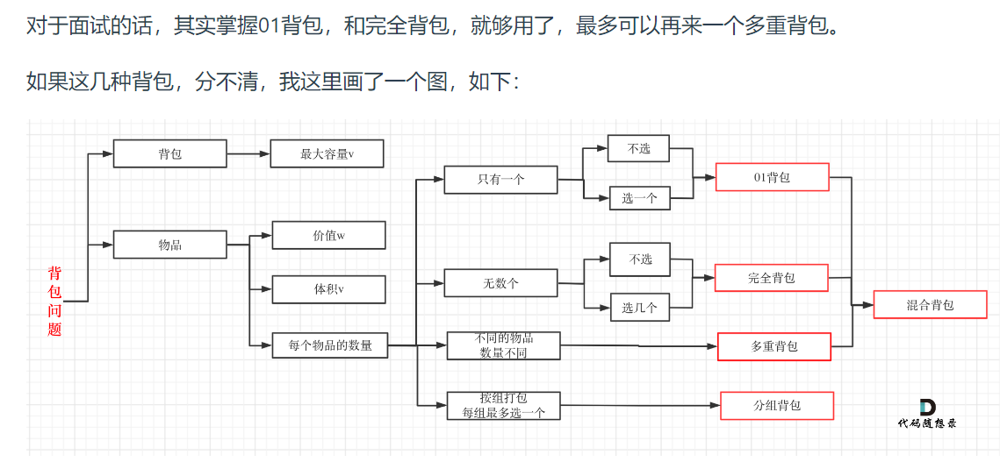

# 动态规划解题方法

## 1 tips

### 背包问题分类





### 递归树

**1、暴力递归**

斐波那契数列的数学形式就是递归的，写成代码就是这样：

```java
int fib(int N) {
    if (N == 1 || N == 2) return 1;
    return fib(N - 1) + fib(N - 2);
}
```

这个不用多说了，学校老师讲递归的时候似乎都是拿这个举例。我们也知道这样写代码虽然简洁易懂，但是十分低效，低效在哪里？假设 n = 20，请画出递归树：


但凡遇到需要递归的问题，最好都**画出递归树**，这对你分析算法的复杂度，寻找算法低效的原因都有巨大帮助。


### 动态规划问题的两种解法

1.动态规划:写出递归的暴力解法，然后选择使用:

- **备忘录优化**递归解法进行优化时间复杂度
- **dp Table使用迭代的方式进行优化**时间复杂度。进一步，可以使用空间压缩技巧优化空间复杂度

动态规划的关键在于「状态转移方程」，即如何通过若干个已计算出的「状态」推导出未计算的「状态」。

在这个推导「状态」的过程中，可能存在重复计算「状态」的情况（重叠子问题），需要备忘录技巧消除冗余计算。

进一步，备忘录可以改造成 `dp` 数组，用非递归（迭代）的方式进行状态转移，也就是自底向上的动态规划解法。

## 2 解法

### 2.1 最优子结构详解

**标准的动态规划问题一定是求最值的**，因为动态规划类型问题有一个性质叫做「最优子结构」，即**从子问题的最优解推导出原问题的最优解。**

我给你提出的这个问题就**符合最优子结构**：可以从子问题的最优结果推出更大规模问题的最优结果。让你算**每个班**的最优成绩就是子问题，你知道所有子问题的答案后，就可以借此推出**全校**学生的最优成绩这个规模更大的问题的答案。

再举个例子：假设你们学校有 10 个班，你已知每个班的最大分数差（最高分和最低分的差值）。那么现在我让你计算全校学生中的最大分数差，你会不会算？可以想办法算，但是肯定不能通过已知的这 10 个班的最大分数差推到出来。因为这 10 个班的最大分数差不一定就包含全校学生的最大分数差，比如全校的最大分数差可能是 3 班的最高分和 6 班的最低分之差。

这次我给你提出的问题就**不符合最优子结构**，因为你没办通过每个班的最优值推出全校的最优值，没办法通过子问题的最优值推出规模更大的问题的最优值。前文 [动态规划详解](https://labuladong.github.io/algo/di-ling-zh-bfe1b/dong-tai-g-1e688/) 说过，**想满足最优子结构，子问题之间必须互相独立。**全校的最大分数差可能出现在两个班之间，显然子问题不独立，所以这个问题本身不符合最优子结构。

**那么遇到这种最优子结构失效情况，怎么办？策略是：改造问题**。

改造问题，也就是把问题等价转化：最大分数差，不就等价于最高分数和最低分数的差么，那不就是要求最高和最低分数么，不就是我们讨论的第一个问题么，不就具有最优子结构了么？那现在改变思路，借助最优子结构解决最值问题，再回过头解决最大分数差问题，是不是就高效多了？


我们做动态规划问题，是不是一直在**求各种最值**，本质跟我们举的例子没啥区别，无非需要处理一下重叠子问题。

最优子结构并不是动态规划独有的一种性质，能求最值的问题大部分都具有这个性质；**但反过来，最优子结构性质作为动态规划问题的必要条件，一定是让你求最值的**，以后碰到那种**恶心人的最值题，思路往动态规划想就对了，这就是套路。**

找最优子结构的过程，其实就是证明状态转移方程正确性的过程，方程符合最优子结构就可以写暴力解了，写出暴力解就可以看出有没有重叠子问题了，有则优化，无则 OK。这也是套路，经常刷题的读者应该能体会。

### 2.2 核心思路

首先，**动态规划问题的一般形式就是求最值**。动态规划其实是运筹学的一种最优化方法，只不过在计算机问题上应用比较多，比如说让你求最长递增子序列呀，最小编辑距离呀等等。

既然是要求最值，核心问题是什么呢？**求解动态规划的核心问题是穷举**。因为要求最值，肯定要把所有可行的答案穷举出来，然后在其中找最值呗。

动态规划这么简单，就是穷举就完事了？我看到的动态规划问题都很难啊！

首先，虽然动态规划的核心思想就是穷举求最值，但是问题可以千变万化，穷举所有可行解其实并不是一件容易的事，需要你熟练掌握递归思维，只有列出**正确的「状态转移方程」**，才能正确地穷举。而且，你需要判断算法问题是否**具备「最优子结构」**，是否能够通过子问题的最值得到原问题的最值。另外，动态规划问题**存在「重叠子问题」**，如果暴力穷举的话效率会很低，所以需要你使用「备忘录」或者「DP table」来优化穷举过程，避免不必要的计算。

以上提到的重叠子问题、最优子结构、状态转移方程就是动态规划三要素。具体什么意思等会会举例详解，但是在实际的算法问题中，写出状态转移方程是最困难的，这也就是为什么很多朋友觉得动态规划问题困难的原因，我来提供我总结的一个思维框架，辅助你思考状态转移方程：

**明确 base case -> 明确「状态」-> 明确「选择」 -> 定义 `dp` 数组/函数的含义**。

那么，既然知道了这是个动态规划问题，就要思考如何列出正确的状态转移方程？

**1、确定 base case**，这个很简单，显然目标金额 `amount` 为 0 时算法返回 0，因为不需要任何硬币就已经凑出目标金额了。

**2、确定「状态」，也就是原问题和子问题中会变化的变量**。由于硬币数量无限，硬币的面额也是题目给定的，只有目标金额会不断地向 base case 靠近，所以唯一的「状态」就是目标金额 `amount`。

**3、确定「选择」，也就是导致「状态」产生变化的行为**。目标金额为什么变化呢，因为你在选择硬币，你每选择一枚硬币，就相当于减少了目标金额。所以说所有硬币的面值，就是你的「选择」。

**4、明确 `dp` 函数/数组的定义**。我们这里讲的是自顶向下的解法，所以会有一个递归的 `dp` 函数，一般来说函数的参数就是状态转移中会变化的量，也就是上面说到的「状态」；函数的返回值就是题目要求我们计算的量。就本题来说，状态只有一个，即「目标金额」，题目要求我们计算凑出目标金额所需的最少硬币数量。

**所以我们可以这样定义 `dp` 函数：`dp(n)` 表示，输入一个目标金额 `n`，返回凑出目标金额 `n` 所需的最少硬币数量**。


**总结一下如何找到动态规划的状态转移关系：**

1、明确 `dp` 数组的定义。这一步对于任何动态规划问题都很重要，如果不得当或者不够清晰，会阻碍之后的步骤。

2、根据 `dp` 数组的定义，运用数学归纳法的思想，假设 `dp[0...i-1]` 都已知，想办法求出 `dp[i]`，一旦这一步完成，整个题目基本就解决了。

但如果无法完成这一步，很可能就是 `dp` 数组的定义不够恰当，需要重新定义 `dp` 数组的含义；或者可能是 `dp` 数组存储的信息还不够，不足以推出下一步的答案，需要把 `dp` 数组扩大成二维数组甚至三维数组。


### 2.3 **如何遍历dp数组：**


如果仔细观察的话可以发现其中的原因，你只要把住两点就行了：

**1、遍历的过程中，所需的状态必须是已经计算出来的**。

**2、遍历结束后，存储结果的那个位置必须已经被计算出来**。

下面来具体解释上面两个原则是什么意思。

比如编辑距离这个经典的问题，详解见后文 [编辑距离详解](https://labuladong.github.io/algo/di-er-zhan-a01c6/zi-xu-lie--6bc09/jing-dian--e5f5e/)，我们通过对 `dp` 数组的定义，确定了 base case 是 `dp[..][0]` 和 `dp[0][..]`，最终答案是 `dp[m][n]`；而且我们通过状态转移方程知道 `dp[i][j]` 需要从 `dp[i-1][j]`, `dp[i][j-1]`, `dp[i-1][j-1]` 转移而来，如下图：


那么，参考刚才说的两条原则，你该怎么遍历 `dp` 数组？肯定是正向遍历：


```java
for (int i = 1; i < m; i++)
    for (int j = 1; j < n; j++)
        // 通过 dp[i-1][j], dp[i][j - 1], dp[i-1][j-1]
        // 计算 dp[i][j]
```

因为，这样每一步迭代的左边、上边、左上边的位置都是 base case 或者之前计算过的，而且最终结束在我们想要的答案 `dp[m][n]`。

### 2.4 **是否存在重叠子问题呢？**

**抽象出该解法的递归框架，递归函数的参数就是状态，使用赋值法进行判断，**

**如果能够找到一个状态相同的结果，则说明存在很多重叠子问题**

比如在 [最小路径和问题](https://labuladong.github.io/algo/di-er-zhan-a01c6/yong-dong--63ceb/dong-tai-g-52f34/) 中，我们写出了这样一个暴力解法：

```java
int dp(int[][] grid, int i, int j) {
    if (i == 0 && j == 0) {
        return grid[0][0];
    }
    if (i < 0 || j < 0) {
        return Integer.MAX_VALUE;
    }

    return Math.min(
            dp(grid, i - 1, j), 
            dp(grid, i, j - 1)
        ) + grid[i][j];
}
```

你不需要读过前文，光看这个函数代码就能看出来，该函数递归过程中参数 `i, j` 在不断变化，即「状态」是 `(i, j)` 的值，你是否可以判断这个解法是否存在重叠子问题呢？

假设输入的 `i = 8, j = 7`，二维状态的递归树如下图，显然出现了重叠子问题：


**但稍加思考就可以知道，其实根本没必要画图，可以通过递归框架直接判断是否存在重叠子问题**。

具体操作就是直接删掉代码细节，抽象出该解法的递归框架：


```java
int dp(int[][] grid, int i, int j) {
    dp(grid, i - 1, j), // #1
    dp(grid, i, j - 1)  // #2
}
```

可以看到 `i, j` 的值在不断减小，那么我问你一个问题：如果我想从状态 `(i, j)` 转移到 `(i-1, j-1)`，有几种路径？

显然有两种路径，可以是 `(i, j) -> #1 -> #2` 或者 `(i, j) -> #2 -> #1`，不止一种，说明 `(i-1, j-1)` 会被多次计算，所以一定存在重叠子问题。

**利用好题目给出的信息：**

有时候题目还会限制我们算法的时间复杂度，这种信息其实也暗示着一些东西。

比如要求我们的算法复杂度是 `O(NlogN)`，你想想怎么才能搞出一个对数级别的复杂度呢？

肯定得用到 [二分搜索](https://labuladong.github.io/algo/di-ling-zh-bfe1b/wo-xie-le--3c789/) 或者二叉树相关的数据结构，比如 `TreeMap`，`PriorityQueue` 之类的对吧。

再比如，有时候题目要求你的算法时间复杂度是 `O(MN)`，这可以联想到什么？

可以大胆猜测，常规解法是用 [回溯算法](https://labuladong.github.io/algo/di-ling-zh-bfe1b/hui-su-sua-c26da/) 暴力穷举，但是更好的解法是动态规划，而且是一个二维动态规划，需要一个 `M * N` 的二维 `dp` 数组，所以产生了这样一个时间复杂度。

对于重叠子问题呢，**优化方法**无非是备忘录或者 DP table。

### 2.1 框架

主函数的解法代码就会是如下的框架：

#### 2.1.1 递归树：自顶向下递归的动态规划

```python
# 自顶向下递归的动态规划
def dp(状态1, 状态2, ...):
    for 选择 in 所有可能的选择:函数
        # 此时的状态已经因为做了选择而改变
        result = 求最值(result, dp(状态1, 状态2, ...))
    return result

```

如: [跳跃游戏 II]( https://leetcode.cn/problems/jump-game-ii/description/)

给定一个长度为 `n` 的 **0 索引**整数数组 `nums`。初始位置为 `nums[0]`。

每个元素 `nums[i]` 表示从索引 `i` 向前跳转的最大长度。换句话说，如果你在 `nums[i]` 处，你可以跳转到任意 `nums[i + j]` 处:

- `0 <= j <= nums[i]` 
- `i + j < n`

返回到达 `nums[n - 1]` 的最小跳跃次数。生成的测试用例可以到达 `nums[n - 1]`。

**示例 1:**

```
输入: nums = [2,3,1,1,4]
输出: 2
解释: 跳到最后一个位置的最小跳跃数是 2。
     从下标为 0 跳到下标为 1 的位置，跳 1 步，然后跳 3 步到达数组的最后一个位置。
```


labuladong5% 递归+备忘录 自顶【dp(nums,0)】向下【dp(numa,1)】的动态规划

~~~java
class Solution {
    // 备忘录定义：memo[p]表示从索引p跳跃到n-1的最小跳跃次数
    int[] memo = null;
    public int jump(int[] nums) {
        // 求最小跳跃次数->动态规划
        // 递归 + 备忘录
        int n = nums.length;
        memo = new int[n - 1];
        Arrays.fill(memo,n);// 相当于int_MAX
        // 状态：i当前在索引i处 选择：跳的长度为0-nums[i]
        return dp(nums,0);
    }
    // dp(状态1，状态2...) for(选择1，选择2...)
    // 定义dp函数：dp(nums,p)表示从索引p处跳跃到n-1处的最小跳跃次数
    public int dp(int[] nums,int p){
        int n = nums.length;
        // 递归停止条件
        if(p >= n - 1){
            return 0;
        }
        // 防止重复计算
        if(memo[p] != n){
            return memo[p];
        }
        int minCount = n;
        // 选择：跳1-nums[p]步 注意：不能选择0，会栈溢出
        for(int i = 1;i<=nums[p];i++){
            // 记录每个选择所对应的跳跃次数（如：选择1，则记录从索引p+1处跳跃到n-1处的最小跳跃次数）
            int count = dp(nums,p+i);// 注意：这里最后不使用memo[p+i]来接收，否则数组索引会越界
            // 求每个选择的最小跳跃次数的最小值
            memo[p] = Math.min(memo[p],count + 1);// 注意：+1表示p跳跃了一次，进行了一次选择
        }

        return memo[p];
    }
}
~~~


#### 2.1.2 自底向上迭代的动态规划 二维dp Table

**大致流程：**

1.明确状态与选择 

2.明确dp数组的含义(一个二维数组，就有3种状态) 

3.明确base case（分析极限情况） 

4.（for循环遍历）根据选择明确状态转移方程，处理特殊情况

**大体框架：**

~~~python

# 自底向上迭代的动态规划
# 初始化 base case
dp[0][0][...] = base case
# 进行状态转移
for 状态1 in 状态1的所有取值：
    for 状态2 in 状态2的所有取值：
        for ...
            dp[状态1][状态2][...] = 计算(选择1，选择2...)
~~~

例如：把上面的[跳跃游戏 II]( https://leetcode.cn/problems/jump-game-ii/description/)使用dp Table进行求解   (写不出来...)

~~~java
~~~


### 2.6 优化为一维dp Table

以01背包问题举例：

1.dp[j]的定义：dp[j]表示：容量为j的背包，所背的物品价值可以最大为dp[j]。

2.base case: 递归公式：dp[j] = max(dp[j], dp[j - weight[i]] + value[i]);

dp数组在推导的时候一定是取价值最大的数，如果题目给的价值都是正整数那么非0下标都初始化为0就可以了。

**这样才能让dp数组在递归公式的过程中取的最大的价值，而不是被初始值覆盖了**。

3.一维dp的写法，背包容量一定是要倒序遍历.

**倒序遍历是为了保证物品i只被放入一次！(为了保证是01背包而不是完全背包)**。

~~~java
for(int i = 0; i < weight.size(); i++) { // 遍历物品
    for(int j = bagWeight; j >= weight[i]; j--) { // 倒序遍历背包容量
        dp[j] = max(dp[j], dp[j - weight[i]] + value[i]);

    }
}
~~~


遍历i(物品的数量)次dp[j]数组，从dp[j]数组初始值全部为0到每遍历一次都改变一些，遍历到最后一个物品i时，在前面这么多次遍历的基础上更新的dp[j]数组的值，被用来推导最终的结果dp[j]的值即是题目所求。

## 3 经典题目(可理解，比较容易写)

### 3.1 编辑距离

1.力扣第 72 题「[编辑距离open in new window](https://leetcode.cn/problems/edit-distance/)」:

（1）：备忘录优化解法：

~~~java
class Solution {
    //memo备忘录的定义：记录word1[0到i]转换为word2[0到j]的最少操作数（即dp函数的返回值） 
    private int[][] memo = null;
    public int minDistance(String word1, String word2) {
        int m = word1.length();
        int n = word2.length();
        memo = new int[m][n];
        for(int[] arr : memo){
            Arrays.fill(arr,-1);
        }
        return dp(word1,m-1,word2,n-1);
    }

    //dp函数的定义：返回word1[0到i]转换为word2[0到j]的最少操作数 
    private int dp(String word1, int i,String word2,int j){
        //对越界的情况处理 base case1
        if(i == -1){
            return j + 1;
        }else if(j == -1){
            return i + 1;
        }
        //防止重复计算
        if(memo[i][j] != -1){
            return memo[i][j];
        }
        //base case 2
        if(word1.charAt(i) == word2.charAt(j)){
            //两个字符串的最后一个字符相同时，原来的编辑距离与去除这个相同字符的编辑距离一致(即：dp(word1,i,word2,j) == dp(word1,i-1,word2,j-1))
            memo[i][j] = dp(word1,i-1,word2,j-1);
            return memo[i][j];
        }else{
            //两个字符串的最后一个字符不同时，有三种选择，取结果最小的
            memo[i][j] =  min(
                        dp(word1,i,word2,j-1) + 1,//插入选择(并没有真正的执行插入操作,+1表示插入操作，再加上dp函数定义的操作数可以得到一个结果)
                        dp(word1,i-1,word2,j) + 1,//删除选择：只有知道word1[0到i-1]转换为word2[0到j]的操作数再加上这次选择的删除操作，即可满足dp函数的定义，完成dp函数的计算
                        dp(word1,i-1,word2,j-1) + 1//替换选择：只有知道word1[0到i-1]转换为word2[0到j-1]的操作数再加上这次选择的替换操作，即可满足dp函数的定义，完成dp函数的计算
                        );
                        return memo[i][j];
        }
    }

    private int min(int a,int b,int c){
        return Math.min(a,Math.min(b,c));
    }
}
~~~

(2): dp Table 优化解法：


首先明确 `dp` 数组的含义，`dp` 数组是一个二维数组，长这样：

 

**唯一不同的是，DP table 是自底向上求解，递归解法是自顶向下求解**：

```java
int minDistance(String s1, String s2) {
    int m = s1.length(), n = s2.length();
    // 定义：s1[0..i] 和 s2[0..j] 的最小编辑距离是 dp[i+1][j+1]
    int[][] dp = new int[m + 1][n + 1];
    // base case 
    for (int i = 1; i <= m; i++)
        dp[i][0] = i;
    for (int j = 1; j <= n; j++)
        dp[0][j] = j;
    // 自底向上求解
    for (int i = 1; i <= m; i++) {
        for (int j = 1; j <= n; j++) {
            if (s1.charAt(i-1) == s2.charAt(j-1)) {
                dp[i][j] = dp[i - 1][j - 1];
            } else {
                dp[i][j] = min(
                    dp[i - 1][j] + 1,
                    dp[i][j - 1] + 1,
                    dp[i - 1][j - 1] + 1
                );
            }
        }
    }
    // 储存着整个 s1 和 s2 的最小编辑距离
    return dp[m][n];
}

int min(int a, int b, int c) {
    return Math.min(a, Math.min(b, c));
}
```

一般来说，处理两个字符串的动态规划问题，都是按本文的思路处理，建立 DP table。为什么呢，因为易于找出状态转移的关系，比如编辑距离的 DP table：


## 框架

my总结的，动态规划问题的大致框架

~~~java
class Solution {
    public int change(int amount, int[] coins) {
        // (1)状态：背包的容量(amount)、可选择的物品(coins[i])
        // (2)选择：物品是否放入背包中
        int n = coins.length;
        // (3)dp数组的含义：dp[i][j]: 1到i个硬币凑成面额为j的组合数 dp[n][amount]即为题目所求
        int[][] dp = new int[n+1][amount+1];
        // (4)base case: 控制变量法取极端情况
        for(int i = 0;i<=n;i++){
            dp[i][0] = 1;
        }
        // 递推开始：
        for(int i = 1;i<=n;i++){
            for(int j = 1;j<=amount;j++){
                if(j - coins[i-1] >= 0){
                    // (5)与背包问题类似：根据选择写状态转移方程，使用dp数组相等的格式去推导。
                    dp[i][j] = dp[i-1][j] + dp[i][j-coins[i-1]];
                }else{
                    dp[i][j] = dp[i-1][j];
                }
            }
        }
        return dp[n][amount];
    }
}
~~~


## 4 背包问题

### 4.1 背包 入门版本

题目：

https://www.acwing.com/problem/content/2/

~~~
有 N 件物品和一个容量是 V
 的背包。每件物品只能使用一次。

第 i件物品的体积是 vi，价值是 wi。

求解将哪些物品装入背包，可使这些物品的总体积不超过背包容量，且总价值最大。
输出最大价值。

输入格式
第一行两个整数，N，V
，用空格隔开，分别表示物品数量和背包容积。

接下来有 N行，每行两个整数 vi,wi，用空格隔开，分别表示第 i 件物品的体积和价值。

输出格式
输出一个整数，表示最大价值。

数据范围
0<N,V≤1000

0<vi,wi≤1000
输入样例
4 5
1 2
2 4
3 4
4 5
输出样例：
8
~~~


解法：

~~~java
import java.util.Scanner;

public class Main {
    public static void main(String[] args) {
        Scanner scanner = new Scanner(System.in);
        int n = scanner.nextInt();
        int w = scanner.nextInt();
        int[] values = new int[n];
        int[] weights = new int[n];
        for(int i = 0;i<n;i++){
            weights[i] = scanner.nextInt();
            values[i] = scanner.nextInt();
        }
        int res = dp(n,w,values,weights);
        System.out.println(res);
    }

    private static int dp(int n, int w, int[] values, int[] weights) {
        // dp表的定义：dp[i][j]表示从第1-i件物品中进行选择，存储到容量为j的背包中的最大价值。
        // 所以dp[n][w]即是题目所求
        int[][] dp = new int[n+1][w+1];
        // base case dp[0][w]、dp[n][0]都为0
        // 遍历除了base case 外剩下的二维数组，进行运算赋值
        for(int i = 1;i<=n;i++){
            for(int j = 1;j<=w;j++){
                // 防止下面的j-weights[i-1]越界访问,进行单独处理
                if(j < weights[i-1]){
                    // 背包装不下第i件物品时，dp[i][j]即为除了第i件物品外，前面所有物品存储到背包的最大价值，即dp[i-1][j]
                    dp[i][j] = dp[i-1][j];
                    continue;
                }
                // dp表的定义：dp[i][j]表示从第1-i件物品中进行选择，存储到容量为j的背包中的最大价值。
                // 取1与2的最大值
                dp[i][j] = Math.max(
                        // 1.不能装下第i件物品,此时dp[i][j] == dp[i-1][j],dp[i][j]相当于表示从第1到i-1件物品中进行选择，存储到容量为j的背包中的最大价值
                        dp[i-1][j],
                        // 2.可以装下第i件物品,就先装下第i件物品values[i-1]，再从剩下的1到i-1件物品中选择最大的价值存放到剩下的空间中
                        values[i-1] + dp[i-1][j-weights[i-1]]// 注意：第1件物品的价值为values[0],使用第i件物品的价值为values[i-1],重量也是相同道理
                        );
            }
        }
        return dp[n][w];
    }
}

~~~


### 4.2 问是否能装满背包（或者最多装多少）

一维公式为：`dp[j] = max(dp[j], dp[j - nums[i]] + nums[i]);`

二维公式为： `dp[i][j] = dp[i - 1][j] || dp[i - 1][j - nums[i - 1]];`

#### 4.2.1 分割等和子集(01背包套壳问题 （剑指offer）)

剑指 Offer：https://leetcode.cn/problems/NUPfPr/description/

给定一个非空的正整数数组 `nums` ，请判断能否将这些数字分成元素和相等的两部分。

 

**示例 1：**

```
输入：nums = [1,5,11,5]
输出：true
解释：nums 可以分割成 [1, 5, 5] 和 [11] 。
```


解法1：二维dp Table

~~~java
class Solution {
    public boolean canPartition(int[] nums) {
        int sum = 0;
        int n = nums.length;
        for(int num:nums){
            sum += num;
        }
        // 和为奇数不可能分成相等的两部分整数
        if(sum % 2 != 0){
            return false;
        }
        // 进行问题转换：
        // (1)状态：背包的容量(sum/2)、可选择的物品(nums[i])
        // (2)选择：物品是否放入背包中
        // (3)dp数组含义：dp[i][j]表示前i件物品是否(true?false?)能够【填满】容器为j的背包中
        // 难点：求dp[n][sum / 2]。即：从第1到第n件物品中进行选择，求是否能够【填满】容器为sum / 2的背包，剩下的没有被选择的其实总容量也等于 sum / 2，这就是题目所求的 两个等和子集
        sum /= 2;
        boolean[][] dp = new boolean[n+1][sum+1];// 题目所求即是dp[n][sum/2],所以数组初始化为new int[n+1][sum / 2 + 1]
        // (4)base case:
        // 1.dp[0][0] = true 背包容量为0，已经被填满了。剩下的 dp[0][j] = false，其中j != 0
        // 2.dp[i][0] = true: 背包容量为0表示已经被填满了。
        for(int i = 0;i<=n;i++){
            dp[i][0] = true;
        }
        // 遍历剩下没有赋值的二维数组进行递推计算赋值
        for(int i = 1;i<=n;i++){
            for(int j = 1;j<=sum;j++){
                // 处理越界情况：容量j装不下第i件物品的重量
                if(j < nums[i-1]){
                    dp[i][j] = dp[i-1][j];
                    continue;
                }
                // (5) 状态转移方程：
                // 根据选择(物品是否放入背包中)来进行递推：
                // 【思路】：1到i件物品是否能够填满背包 = (根据选择：) 第i件物品不放进背包是否能够填满 与 第i件物品放进背包是否能够填满，只要一个能够填满（返回true）即可证明dp[i][j]能够填满，所以使用 ||
                // 【详解】：从1到i件物品中进行选择，是否能够填满容量为j的背包 等价于 
                // 根据选择：1.物品不放入背包中。即：使用1到i-1件物品看看是否能够填满容量为j的背包，如果能够填满，返回true。2.物品放入背包中。把第i件物品(容量为nus[i-1])放入背包，再使用1到i-1件物品看看是否能够填满剩下的背包空间(j - nums[i-1])
                dp[i][j] = dp[i - 1][j] || dp[i - 1][j - nums[i - 1]];
            }
        }
        return dp[n][sum];

    }
}
~~~

解法2：一维dp Table  【难理解】

my 一维dp解法的错误案例：

~~~java
class Solution {
    public boolean canPartition(int[] nums) {
        int sum = 0;
        for(int num:nums){
            sum += num;
        }
        // 如果总和为奇数,肯定不能分割成两个元素和相等的子集
        if(sum % 2 != 0){
            return false;
        }
        // 状态？选择？
        // 难点：dp Table定义：dp[j]表示容量为j的背包能够存放的最大重量(受nums里的值影响)
        // dp[j] = j,即：背包能够存放的最大重量=背包的容量时，背包就装满了，那么题目所求即为: dp[sum/2] 是否等于 sum/2
        int dp[] = new int[sum/2 + 1];
        sum /= 2;
        // base case: dp[0] = 0
        for(int i = 0;i<nums.length;i++){
            for(int j = 1;j<=sum;j++){
                // 根据选择写：状态转移方程
                // 错误！!!这里的写法相当于完全背包了，但是题目是01背包，不可复选
                dp[j] = Math.max(dp[j-nums[i]] + nums[i],dp[j]);
            }
        }
        return dp[sum] == sum ? true : false;
    }
}
~~~

答案：随想录98% 使用一维dp Table进行动态规划

~~~java
class Solution {
    public boolean canPartition(int[] nums) {
        int sum = 0;
        for(int num:nums){
            sum += num;
        }
        // 如果总和为奇数,肯定不能分割成两个元素和相等的子集
        if(sum % 2 != 0){
            return false;
        }
        // 状态？选择？
        // 难点：dp Table定义：dp[j]表示容量为j的背包能够存放的最大重量(受nums里的值影响)
        // dp[j] = j,即：背包能够存放的最大重量=背包的容量时，背包就装满了，题目所求为: dp[j/2] 是否等于 j/2
        int dp[] = new int[sum/2 + 1];
        sum /= 2;
        // base case: dp[0] = 0
        for(int i = 0;i<nums.length;i++){
            // 反向遍历(一维dp Table时使用) ???为什么这样遍历就是01背包了呢？
            for(int j = sum;j>=nums[i];j--){
                // 根据选择写：状态转移方程
                dp[j] = Math.max(dp[j-nums[i]] + nums[i],dp[j]);
            }
            if(dp[sum] == sum){
                return true;
            }
        }
        return false;
    }
}
~~~


### 4.3 问装满背包有几种方法

dp[j] += dp[j - nums[i]]

#### 4.3.1 目标和 组合类问题（剑指offer）

mark1

题目：

https://leetcode.cn/problems/YaVDxD/description/   子集划分问题：

给定一个正整数数组 `nums` 和一个整数 `target` 。

向数组中的每个整数前添加 `'+'` 或 `'-'` ，然后串联起所有整数，可以构造一个 **表达式** ：

- 例如，`nums = [2, 1]` ，可以在 `2` 之前添加 `'+'` ，在 `1` 之前添加 `'-'` ，然后串联起来得到表达式 `"+2-1"` 。

返回可以通过上述方法构造的、运算结果等于 `target` 的不同 **表达式** 的数目。

**示例 1：**

```
输入：nums = [1,1,1,1,1], target = 3
输出：5
解释：一共有 5 种方法让最终目标和为 3 。
-1 + 1 + 1 + 1 + 1 = 3
+1 - 1 + 1 + 1 + 1 = 3
+1 + 1 - 1 + 1 + 1 = 3
+1 + 1 + 1 - 1 + 1 = 3
+1 + 1 + 1 + 1 - 1 = 3
```

解法1：labuladong90% 一维dp Table求组合类问题,dp[j] += dp[j-nums[i]]

~~~java
// labuladong
class Solution {
    public int findTargetSumWays(int[] nums, int target) {
        int sum = 0;
        for(int num:nums){
            sum += num;
        }
        // 排除特殊情况 (难点1)
        if(sum < target || (sum + target) % 2 != 0 ){
            return 0;
        }
        // 分成两部分，只要求出一部分(符号为+的数)即可确认另一部分(符号为-的数)
        // 定义：A表示符号为+的数之和，B为符号为-的数之和，A + B = sum
        // (难点2)则有：A - B = target; A = target + B; 2A = target + sum;
        // 结果：A = (target + sum)/2 表示把问题转换为了:nums中有【多少个】子集之和为A,为(target + sum)/2 这个值
        return subsets(nums,(sum + target)/2);
    }
    // 转换为01背包问题,容量为sum的背包，使用前i件物品进行填充，重量为nums[i-1],每件物品只能使用一次，有多少种填满的方法？
    public int subsets(int[] nums,int sum){
        // 使用一维dp解决,定义：dp[j]:表示容量为j的背包能够有dp[j]种方法使用nums中的物品进填满
        int[] dp = new int[sum+1];
        // base case
        dp[0] = 1;
        for(int i = 0;i<nums.length;i++){
            // 反向遍历
            for(int j = sum;j>=0;j--){
                if(j - nums[i] < 0){
                    dp[j] = dp[j];
                    continue;
                }
                dp[j] = dp[j] + dp[j-nums[i]];
            }
        }
        return dp[sum];
    }
}
~~~

解法2：回溯暴力 + 备忘录优化（具体代码见leetcode题目提交处)

解法3：labuladong 二维dp Table   难

~~~java
class Solution {
    public int findTargetSumWays(int[] nums, int target) {
        int sum = 0;
        for(int num:nums){
            sum += num;
        }
        // 排除特殊情况 (难点1)
        if(sum < target || (sum + target) % 2 != 0 ){
            return 0;
        }
        // 分成两部分，只要求出一部分(符号为+的数)即可确认另一部分(符号为-的数)
        // 定义：A表示符号为+的数之和，B为符号为-的数之和，A + B = sum
        // (难点2)则有：A - B = target; A = target + B; 2A = target + sum;
        // 结果：A = (target + sum)/2 表示把问题转换为了:nums中有【多少个】子集之和为A,为(target + sum)/2 这个值
        return subset(nums,(sum + target)/2);
    }
    // 转换为01背包问题,容量为sum的背包，使用前i件物品进行填充，重量为nums[i-1],每件物品只能使用一次，有多少种填满的方法？
    public int subset(int[] nums,int sum){
        // 背包问题：状态、选择?
        int n = nums.length;
        // dp Table定义：dp[i][j]表示前i件物品填满容量为j背包有多少种方法
        // dp[n][sum]即是使求
        int[][] dp = new int[n+1][sum+1];
        //base case: dp[n][0] = 1
        for(int i = 0;i<dp.length;i++){
            dp[i][0] = 1;
        }   
        //遍历
        for(int i = 1;i<=n;i++){
            // 注意：如果这里j从1开始的话，leetcode有一些案例过不了！！！
            for(int j = 0;j<=sum;j++){
                if(j-nums[i-1] < 0){
                    // 背包容量不够，只有一种选择
                    dp[i][j] = dp[i-1][j];
                    continue;
                }
                // 根据选择写状态转移方程
                // 有两种选择，根据题目所求，两者应该是和的关系
                dp[i][j] = dp[i-1][j] + dp[i-1][j-nums[i-1]];
            }
        }
        return dp[n][sum];

    }
}
~~~


#### 4.3.2 凑零钱求硬币组合数（完全背包套壳问题）

https://leetcode.cn/problems/coin-change-ii/description/

给你一个整数数组 `coins` 表示不同面额的硬币，另给一个整数 `amount` 表示总金额。

请你计算并返回可以凑成总金额的硬币组合数。如果任何硬币组合都无法凑出总金额，返回 `0` 。

假设每一种面额的硬币有无限个。 

题目数据保证结果符合 32 位带符号整数。

 

**示例 1：**

```
输入：amount = 5, coins = [1, 2, 5]
输出：4
解释：有四种方式可以凑成总金额：
5=5
5=2+2+1
5=2+1+1+1
5=1+1+1+1+1
```

解法1：二维dp  与**完全背包**问题类似: 相当于：从coins中的i件物品中可复选的做选择，看看是否能够**填满**一个容量为总金额的背包

~~~java
class Solution {
    public int change(int amount, int[] coins) {
        // (1)状态：背包的容量(amount)、可选择的物品(coins[i])
        // (2)选择：物品是否放入背包中
        int n = coins.length;
        // (3)dp数组的含义：dp[i][j]: 1到i个硬币凑成面额为j的组合数 dp[n][amount]即为题目所求
        int[][] dp = new int[n+1][amount+1];
        // (4)base case: 控制变量法取极端情况
        // i = 0时，dp[0][j] = 0(j != 0) 解释：0个硬币只能凑出0这个面额,凑出其他面额的组合数为0
        // j = 0时，dp[i][0] = 1 解释：0-i个硬币凑出面额为0的方法只有一种（什么也不做)
        // 对于两种情况都进行赋值了的：dp[0][0]这个位置，再进行一次思考：0个硬币是能凑出0这个面额的，组合数为1，dp[0][0] =1
        // 精简后的代码如下：
        for(int i = 0;i<=n;i++){
            dp[i][0] = 1;
        }
        // 动态规划框架：
        for(int i = 1;i<=n;i++){
            for(int j = 1;j<=amount;j++){
                if(j - coins[i-1] >= 0){
                    // (5)与背包问题类似：根据选择写状态转移方程，使用dp数组相等的格式去推导。选择：是否选择硬币进行凑数
                    // dp[i][j] 即：前i个硬币凑成面额为j的组合数 = 最后一次时硬币i不放背包的次数 + 最后一次时硬币i放背包的次数   注意：是相加的关系！！！
                    // 最后一次时硬币i不放背包,所以放的是前面的i-1个即：dp[i-1],相当于禁用了i
                    // 最后一次时硬币i放背包,由于每一种面额的硬币有无限个，所以是dp[i],硬币i还有并且有空间存放，为什么不存呢？
                    dp[i][j] = dp[i-1][j] + dp[i][j-coins[i-1]];
                }else{
                    // 没有空间存放这一个硬币i时，dp[i][j] 即：前i个硬币凑成面额为j的组合数 = 最后一次时硬币i不放背包的次数 + 0 (最后一次时硬币i放背包的次数为0)，所以:
                    dp[i][j] = dp[i-1][j];
                }
            }
        }
        return dp[n][amount];
    }
}
~~~

解法2：类似：回溯法解决无重可复选的组和问题

解法3：my 22% 二维dp O(M*N)

~~~java
class Solution {
    public int change(int amount, int[] coins) {
        int n = coins.length;
        // dp数组的含义:1到n件硬币中进行选择，能够凑出amount的组合数
        // 定义如下，所求即为：dp[n][amount]
        int dp[][] = new int[n+1][amount+1];
        // base case:
        for(int i = 0;i <= n;i++){
            dp[i][0] = 1;
        }
        // 开始递推
        for(int i = 1;i <= n;i++){
            for(int j = 1;j <= amount;j++){
                // 根据选择写动态规划方程
                // 选择：选i物品 与 不选i物品 注意：两者是相加的关系
                if(j - coins[i-1] >= 0){
                    // 背包容量足够时：
                    // dp[i][j] 即：前i个硬币凑成面额为j的组合数 = 最后一次时硬币i不放背包的次数 + 最后一次时硬币i放背包的次数
                    dp[i][j] = dp[i-1][j] + dp[i][j - coins[i-1]];
                }else{
                    // 背包容量不够时：
                    // dp[i][j] 即：前i个硬币凑成面额为j的组合数 = 最后一次时硬币i不放背包的次数
                    dp[i][j] = dp[i-1][j];
                }
                
            }
        }
        return dp[n][amount];

    }
}
~~~


### 4.4 问装满背包所有物品的最小个数

dp[j] = min(dp[j - coins[i]] + 1, dp[j]);

#### 4.4.1 凑零钱求使用的硬币最少（完全背包套壳问题（剑指offer））

https://leetcode.cn/problems/coin-change/description/

解法1：labuladong评论区的  难点在base情况中。使用二维dp Table，仿照完全背包的作法

~~~java
 public int coinChange(int[] coins, int amount) {
		int n = coins.length;
     	// dp数组的定义：dp[i][j]表示前面i个硬币凑成总金额j所需要的最少的硬币个数
        int[][] dp = new int[n+1][amount+1];
        // coin = 0  没有钱 
        for(int j = 1 ; j <=amount;j++){
            dp[0][j] = Integer.MAX_VALUE;// 巧妙的是，无解时都会等于这个值Integer.MAX_VALUE
        }
        //amount = 0  要凑的钱 为 0 
        for(int i = 0; i<=coins.length;i++){
            dp[i][0] = 0;
        }
        
        for(int i = 1; i<=coins.length;i++){
            for(int j = 1; j<=amount;j++){
                //注意这里不能让dp[i][j-coins[i-1]] == Interger.MAX_VALUE的进入,因为后面的+1会爆Integer
                if( j >= coins[i-1] && dp[i][j-coins[i-1]]!=Integer.MAX_VALUE ){
                    dp[i][j] = Math.min(dp[i-1][j],dp[i][j-coins[i-1]]+1);
                }else{//面额大于 要凑的钱
                    dp[i][j] = dp[i-1][j];
                }

            }
        }
        // 巧妙的是，无解时都会等于这个值Integer.MAX_VALUE
        return dp[n][amount] == Integer.MAX_VALUE ? -1: dp[n][amount];
    }
~~~

解法2:my 难点在base情况中。使用二维dp Table，仿照完全背包的作法

~~~java
class Solution {
    public int coinChange(int[] coins, int amount) {
        int n = coins.length;
        // dp数组的定义：dp[i][j]表示前面i个硬币凑成总金额j所需要的最少的硬币个数
        int[][] dp = new int[n+1][amount+1];
        // base case（难点）: dp[i][0] = 0,dp[0][j] = amount + 1 
        for(int i = 0;i<=n;i++){
            for(int j = 0;j<=amount;j++){
                if(j != 0){
                    // 初始化为amount + 1来替代INteger.MAX_VALUE,防止下面的dp[i][j-coins[i-1]] + 1处爆Integer
                    dp[i][j] = amount + 1;
                }
            }
        }
        // 遍历两种状态
        for(int i = 1;i<=n;i++){
            for(int j = 1;j<=amount;j++){
                if(j < coins[i-1]){
                    // 注意：coins[i-1]才是第i个硬币的面额
                    dp[i][j] = dp[i-1][j];
                    continue;
                }
                // 选择->状态转移方程
                dp[i][j] = Math.min(dp[i-1][j],dp[i][j-coins[i-1]] + 1);// 注意：coins[i-1]才是第i个硬币的面额
        }
        
    }
        // (debug后发现：)状态转移方程dp[i][j]中明明是使用min方法求最小值的，如果最后dp[n][amount]的值还是初始值amount + 1，意味着min方法中的另一个结果（之前没有并设置这个值，而是dp递推产生的结果）比amount + 1还要大，这明显是不合理的，因为初始值amount + 1设置的初衷就是不可能取到的，而现在居然有一个比它还大的存在，肯定是凑不出结果导致的，所以按照题目意思直接返回-1即可。
    return dp[n][amount] == amount + 1 ? -1 : dp[n][amount];
}
}
~~~

解法3：labuladong的:使用一维dp Table

~~~java
class Solution {
    //dp数组的定义：dp[amount]表示凑成amount所需的最少的硬币个数
    int[] dp = null;
    public int coinChange(int[] coins, int amount) {
        return dp(coins,amount);
    }

    private int dp(int[] coins, int amount){
        dp = new int[amount + 1];
        //初始化为最大值amount(coins面值全部为1)后再加1,方便求最小值
        Arrays.fill(dp,amount + 1);
        dp[0] = 0;
        for(int i = 1;i<=amount;i++){
            for(int coin : coins){
                if(i - coin < 0){
                    continue;
                }
                //自底向上递推
                dp[i] = Math.min(dp[i],1 + dp[i - coin]);
            }
        }
        return dp[amount] == amount+1 ? -1 : dp[amount];

    }
}
~~~

解法4：带备忘录的递归解法

~~~java
class Solution {
    private int[] memo = null;
    public int coinChange(int[] coins, int amount) {
        memo = new int[amount + 1];
        Arrays.fill(memo,-6);
        return dp(coins,amount);
    }

    
    //定义：输入总金额amount，返回至少需要的硬币的数量,无解则返回-1
    private int dp(int[] coins, int amount){
        //递归结束条件
        if(amount < 0){
            return -1;
        }else if(amount == 0){
            return 0;
        }
        //已经计算过的就直接返回，不进行重复计算
        if(memo[amount] != -6){
            return memo[amount];
        }

        //计算过程：

        //注意res定义的位置，不能作为属性来定义
        int res = Integer.MAX_VALUE;
        //for循环 + 递归
        for(int coin : coins){
            //假设最后一个硬币的面值为coin，计算至少需要的硬币的数量
            int subProblem =  dp(coins,amount-coin);
            //如果无解则跳过
            if(subProblem == -1){
                continue;
            }
            //有解则进行接收并且进行对比求最小值
            res = Math.min(res,subProblem + 1);
        }
        memo[amount] = res==Integer.MAX_VALUE ? -1 : res;
        return memo[amount];
    }
}
~~~

### 4.5 问背包装满最大价值

dp[j] = max(dp[j], dp[j - weight[i]] + value[i]); 


## 5 蓝桥杯题目

~~~java
/**
 * 青蛙跳台阶问题：青蛙跳台阶问题：一次只能跳1台或者2台，问跳到第10台阶有多少种方法
 * 1.自顶向下的递归与优化时间复杂度 2.自底向上的dp递推法与优化空间复杂度
 */
public class Practice11 {
    //可以替换为HashMap<Integer,Integer>,数组类似HashMap的特殊形式(HashMap<Integer,?>)
    static int[] memo = new int[11];
    static int[] dp = new int[11];
    public static void main(String[] args) {
        int res = fun3(10);
        // 89
        System.out.println(res);
    }

    /**
     * 定义：输入想要到达的台阶数，返回能够实现的方法数
     * 自顶向下的递归，使用memo备忘录消除重叠子问题，进行优化
     * @param n
     * @return
     */
    private static int fun(int n){
        if(n==1){
            return 1;
        }else if(n==2){
            return 2;
        }else if(n<1){
            return -1;
        }
        if(memo[n] != 0){
            return memo[n];
        }
        memo[n-1] = fun(n-1);
        memo[n-2] = fun(n-2);
        return memo[n-1] + memo[n-2];
    }

    /**
     * 自底向上的dp递推法 O(N)空间复杂度
     * @param n
     * @return
     */
    private static int fun1(int n){
        dp[1] = 1;
        dp[2] = 2;
        for(int i = 3;i<=n;i++){
            dp[i] = dp[i-1] + dp[i-2];
        }
        return dp[n];
    }

    /**
     * my:自底向上的dp递推法 O(1)空间复杂度
     * @param n
     * @return
     */
    private static int fun2(int n){
        if(n == 1){
            return 1;
        }else if(n==2){
            return 2;
        }else if(n<1){
            return -1;
        }
        int a = 1;
        int b = 2;
        int count = 2;
        int res = 0;
        for(int i = 3;i<=n;i++){
            if(count%2 == 0){
                a = a + b;
                res = a;
            }else{
                b = a + b;
                res = b;
            }
            count++;
        }
        return res;

    }

    /**
     * 老师:自底向上的dp递推法 O(1)空间复杂度
     * @param n
     * @return
     */
    private static int fun3(int n){
        if(n == 1){
            return 1;
        }else if(n==2){
            return 2;
        }else if(n<1){
            return -1;
        }
        int a = 1;
        int b = 2;
        int temp = 0;
        for(int i =3;i<=n;i++){
            temp = a + b;
            a = b;
            b = temp;
        }
        // 或者 return b;
        return temp;

    }

}

~~~

