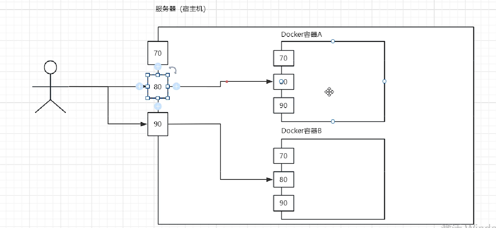
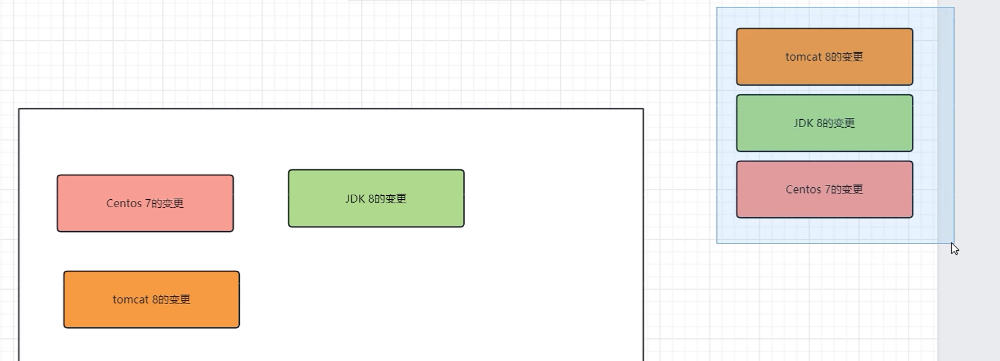
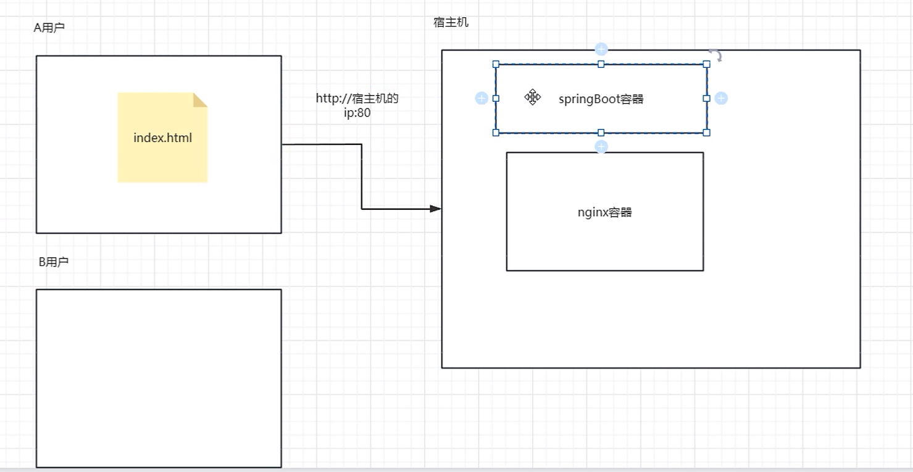
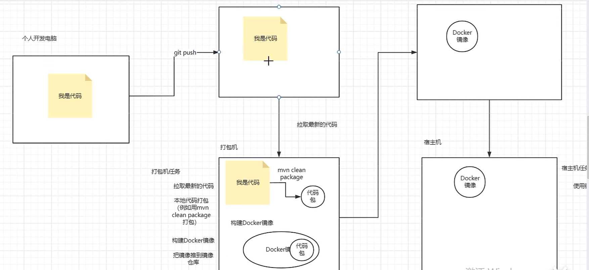

# Docker的使用

### 为什么学习Docker

* 解决应用部署的不便，让应用部署更加简单方便

* 避免环境不同导致问题

* 降低微服务阶段的学习成本，减少安装时间，聚焦核心

* 为理解实际开发中的打包发布流程打基础

### Docker是什么

  Docker是一个容器引擎，用来管理容器。  一个容器可以理解成是一个轻量级的虚拟机。

## 1 Centos7下载docker

需要联网，使用浏览器访问站检查虚拟机是否能够连网。

* 参考文档

  * https://docs.docker.com/engine/install/centos/   或者白马Docker文档

* 安装步骤

  * 卸载旧版本docker

    ~~~~shell
    sudo yum remove docker \
                      docker-client \
                      docker-client-latest \
                      docker-common \
                      docker-latest \
                      docker-latest-logrotate \
                      docker-logrotate \
                      docker-engine
    ~~~~

    

  * 设置仓库链接

    ~~~~shell
    sudo yum install -y yum-utils
    sudo yum-config-manager --add-repo https://download.docker.com/linux/centos/docker-ce.repo
    ~~~~

  * 安装Docker

    ~~~~shell
    sudo yum install docker-ce docker-ce-cli containerd.io docker-buildx-plugin docker-compose-plugin
    ~~~~

  * 启动Docker

    ~~~~shell
    sudo systemctl enable docker # 配置docker开机自启
    sudo systemctl start docker
    ~~~~

  * 测试

    ~~~~shell
    sudo docker run hello-world
    ~~~~

#### 配置镜像加速

##### 步骤

访问阿里云搜索容器镜像服务>镜像工具>镜像加速器
按照操作文档的要求配置。

在centos中执行：

~~~sh
sudo mkdir -p /etc/docker
sudo tee /etc/docker/daemon.json <<-'EOF'
{
  "registry-mirrors": ["https://账号id.mirror.aliyuncs.com"]
}
EOF
sudo systemctl daemon-reload
sudo systemctl restart docker
~~~

## 基础知识

###### 容器继续运行的条件

docker容器运行必须有一个前台进程， 如果没有前台进程执行（如hello-world容器只打印了一些信息），容器认为空闲，就会自行退出。

docker容器内的命令并不完整，如vim命令可能找不到。

## 2常用命令

### docker --help命令

我们可以使用--help、-h来查看对应的帮助文档。
例如：

~~~~sh
docker --help # 查看docker的所有命令的帮助文档
docker pull --help # 查看pull命令的帮助文档
~~~~


### 2.1 docker -v 查看版本

```sh
docker --version # 查看版本
# 或者
docker -v
```


### 2.2 usermod -aG docker当前用户添加到docker用户组中

```sh
sudo usermod -aG docker <用户名> # 将当前用户添加到docker用户组中，不然每次使用docker命令都需要sudo执行
```

exit 退出后再次登录才能生效

### 2.3 docker run创建并运行一个镜像


```sh
docker create hello-world # 仅仅创建容器而不马上运行这个镜像
```

以某个镜像为模版创建容器并且运行：

> docker run [OPTIONS] IMAGE [COMMAND] [ARG...]

1. OPTIONS：选项，需要重点关注-d,-p,-v,-e,--restart这几个选项
2. IMAGE： 镜像信息，推荐使用 镜像名:TAG的写法 如果只写 镜像名 则相当于 tag是latest
3. COMMAND：创建容器后要执行的命令
4. ARG...： COMMAND命令的参数


* **默认运行方式**
  docker run nginx:latest 
* **后台运行**
  docker run -d nginx:latest
* **交互式运行**
  docker run -it nginx:latest bash  **容器运行时默认执行这个镜像构建时配置好的CMD命令**，这里指定运行容器时执行bash命令,打开一个shell，**覆盖**掉nginx默认的CMD命令
  * -i
    	以交互模式运行容器，通常与 -t 同时使用
  * -t
    	启动容器后，为容器分配一个命令行，通常与 -i 同时使
  * 主要在学习阶段和调试的时候会使用到，并且一般容器的执行命令会使用bash，这样才能在进入容器后去执行命令
  * 退出交互式
    	使用exit


#### -p 端口对外发布（端口映射）:



每个容器相当于一个轻量级的虚拟机，运行在宿主机上，每个容器都有各种端口，只有与宿主机的端口进行了端口映射，外部才能够通过访问宿主机的端口来映射到容器的端口，实现访问内部的容器提供的服务：

```sh
  	docker run -p 宿主机端口1:容器端口1 -p 宿主机端口2:容器端口2 镜像名   # 发布多个端口
```

#### -v 数据卷

将宿主机目录或文件挂载到容器中，实现宿主机和容器之间的数据共享、同步和持久化。
用法:
	

```sh
docker run -v 宿主机目录:容器目录[:读写权限] 镜像名
```

​		读写权限
​			在使用 -v 选项时，可以添加 :ro 或 :rw 来指定容器对挂载的目录或文件是只读（read-only）还是可读写（read-write）。**如果不指定默认是rw。**
思考
​	容器中哪些位置需要挂载数据卷？

查看方法：		

- ​		DockerHub的介绍
- ​		构建镜像的DockerFile（VOLUME /var/lib/mysql）

​			


**练习**

后台运行nginx容器，发布一个最简单的静态页面到Nginx，让我们能够通过浏览器去访问这个静态页面

如果指定的是宿主机已经存在的文件，命令会把宿主机上的/home/index.html**覆盖容器上的**/usr/share/nginx/html/index.html来**实现同步**，来让nginx代理宿主机上是文件。（如果是指定的是宿主机已经存在目录，并且目录里面有内容，就会覆盖容器上的对应目录）

如果指定宿主机的目录不存在，命令会自动在宿主机创建目录，并且把指定的容器中的文件**同步到宿主机的目录中**。

~~~~shell
docker run -d -p 81:80 -v /home/index.html:/usr/share/nginx/html/index.html nginx 
~~~~

#### -e 设置环境变量

为什么要用
	容器中某些变量不能直接写死，需要让使用者在创建容器的时候指定，这种情况镜像中一般是定义环境变量来使用。  例如mysql容器的root密码。 遇到这种镜像创建的容器我就可以使用-e来设置环境变量的值。

用法
	docker run -e 变量名=变量值 镜像名

练习

需求
	后台运行一个mysql5.7的容器
	要求容器中的mysql可以被外部连接
	mysql容器的数据需要持久化存储，不能因为容器被删除而丢失。
	mysql的root用户的密码设置为 sangeng

命令  /var/lib/mysql为mysql存储数据的目录

~~~~shell
docker run -d -p 3306:3306 -v /home/datadir:/var/lib/mysql -e MYSQL_ROOT_PASSWORD=sangeng mysql:5.7  
~~~~

#### --name 容器命名

为什么要用
	需要帮助我们更快的识别出来容器的作用。
概念理解
	给容器命名
用法
	docker run --name 需要定义的容器名 镜像名

练习
	需求
		后台运行nginx容器
		挂载一个自己的静态页面到Nginx，让我们能够通过浏览器去访问这个静态页面
		容器命名为 nginx-test 
	命令

~~~~shell
docker run -d --name nginx-test -p 82:80 -v /home/index.html:/usr/share/nginx/html/index.html nginx
~~~~

​	

#### --restart 容器退出后的重启策略

> docker run --restart 重启策略  镜像名

重启策略:

- no(默认策略)：容器退出时不会自动重启。
- always：容器总是在退出后自动重启。(容器设置后当宿主机重启后会自动重启这个容器)
- on-failure[:max-retries]：容器仅在非正常退出时重启，可以指定最大重试次数。
- unless-stopped：容器会在退出后自动重启，除非手动停止了容器。

例如：

```sh
docker run --name=lbwnb --restart=always hello-world # 表示停止运行后总是自动重启
```

#### -it 以交互式的方式运行后进入容器中

~~~sh
docker run -it 容器id bash
~~~


### 2.4 docker pull把某个镜像从仓库下载到本地

> docker pull [镜像仓库地址/]镜像名[:标签]

docker pull 名称:版本(例如1.0或latest)

docker pull hello-world 表示把hello-world镜像从仓库下载到本地，不指定版本时默认使用latest(即最新版本)

先查看**本地**是否存在，查看**缓存**是否存在，都不存在时才去公共仓库进行下载

**镜像分层的应用**：

左边为仓库，右边为从仓库中拉取需要的每一层镜像来构建最终需要的镜像。



拉取镜像时是一层一层的镜像去拉取的，本地已经存在的某层镜像是不会拉取的。

仓库中存储的镜像也是一层一层存储的，需要什么镜像就会基于仓库中的镜像来拉取构建这个镜像所需要的每一层。

### 2.5  docker images 查看下载的镜像信息

```sh
docker images 
docker image ls # 查看所有已下载镜像
```

选项：

- -a 查看所有的镜像
- -q 只显示镜像的id
- --filter=reference=  根据条件过滤出符合条件的镜像

* 列出镜像的镜像id

  ~~~~shell
  docker images -q
  ~~~~

  

* 列出所有镜像的的镜像id

  ~~~~shell
  docker images -aq
  docker images -a -q
  ~~~~

* 列出所有镜像名包含mysql的镜像id

  ~~~~shell
  docker images -aq --filter=reference='*mysql*'
  ~~~~


### 2.6 docker ps查看容器

> docker ps [选项]

默认显示正在运行的容器信息


* 列出当前正在运行的容器

  ~~~~shell
  docker ps
  ~~~~

* 列出所有容器，无论是否在运行

  ~~~~shell
  docker ps -a
  docker container ls # 查看所有容器
  ~~~~

* 列出所有退出状态的容器

  ~~~~shell
  docker ps -f status=exited
  ~~~~

* 列出所有退出状态的容器id

  ~~~~shell
  docker ps -f status=exited
  ~~~~


### 2.7 docker start 启动指定的容器

```sh
docker start 容器id或名字 # 表示后台启动容器

docker start -i 容器id或名字 # 表示前台启动指定id或者名字的容器(里面包含镜像，其实是以这个容器为环境启动容器里面的镜像)

docker restart 容器id或名字
```


### 2.8 docker rm 删除容器

> docker rm [选项]  [容器ID或容器名...]

- -q 只查询容器id
- -f 指定查询的提交

例如

~~~~shell
docker rm 容器1 
docker rm 容器1 容器2
~~~~
其他：
* 删除hello-world的容器

  ~~~~shell
  docker rm 2d1ec2bba545  
  ~~~~

  

* 强制删除一个运行的nginx容器

  ~~~~shell
  docker rm -f fa8075110f21
  ~~~~

  

* 强制删除所有容器

  $() 命令替换在Linux系统中，$()是常用的一种命令替换语法，它可以将()中命令的输出结果作为字符串使用。例如 ls $(pwd)

  ~~~~shell
  docker rm -f $(docker ps -aq )
  ~~~~

  

* 强制删除所有非运行状态的容器

  ~~~~shell
  docker ps -f status=exited -q  # 查询退出状态的容器
  docker rm $(docker ps -f status=exited -q) # 删除退出状态的容器 注意：exited的e为小写，不能为大写
  ~~~~

  

```sh
docker run --rm 镜像名称  # 表示容器在停止(docker stop)后将自动删除
```


### 2.9 docker rmi 删镜像

 只能删除未部署为容器运行的镜像。

```sh
docker rmi 镜像名字或id 
docker image prune # 清理临时的、没有被使用的镜像文件。
# -a, --all: 删除所有没有用的镜像，而不仅仅是临时文件；
```

### inspect、top 命令

镜像
	查看**镜像详细信息**
		用法
			docker image inspect [OPTIONS] IMAGE [IMAGE...]
			docker image inspect 镜像id
容器
	查看**容器内进程**（容器内部很简洁，不像宿主机一样有top命令）
		用法
			docker top CONTAINER [ps OPTIONS]
			docker top nginx_test
	查看**容器详细信息**
		用法
			docker inspect [OPTIONS] NAME|ID [NAME|ID...]
			举例
				docker inspect nginx_test

### docker logs 查看容器日志

> docker logs [选项] 容器ID或容器名


* 查看nginx容器的日志，要求需要持续显示新的日志

  ~~~~shell
  docker logs -f 容器id 
  ~~~~

  

* 查看nginx容器的最近20条日志

  ~~~~shell
  docker logs -n 20 容器id
  ~~~~

**常用**:

搜索 日志中最近3分钟的from device_exception_info字符串，并展示匹配字符串的前后5行：

~~~sh
docker logs --since 3m 容器id或名称 | grep 'from device_exception_info' -C 5
~~~


例子：

启动springBoot项目的容器

~~~sh
docker run -d -p 8080:8080 -it --name=test --rm springboot-test:1.0
~~~

打印springboot-test:1.0输出的日志信息

~~~sh
docker logs 容器名称
~~~

~~~sh
docker logs -f 容器名称
# 表示持续不断的打印输出的日志信息，使用Ctrl+C退出
~~~

**详细使用**参考：

链接：https://www.jianshu.com/p/1eb1d1d3f25e

通过docker logs命令可以查看容器的日志。

**命令格式：**


```shell
$ docker logs [OPTIONS] CONTAINER
  Options:
        --details        显示更多的信息
    -f, --follow         跟踪实时日志
        --since string   显示自某个timestamp之后的日志，或相对时间，如42m（即42分钟）
        --tail string    从日志末尾显示多少行日志， 默认是all
    -t, --timestamps     显示时间戳
        --until string   显示自某个timestamp之前的日志，或相对时间，如42m（即42分钟）
```

**例子：**

查看指定时间后的日志，只显示最后100行：


```shell
docker logs -f -t --since="2018-02-08" --tail=100 CONTAINER_ID
```

查看最近30分钟的日志:


```shell
docker logs --since 30m CONTAINER_ID
```

查看某时间之后的日志：


```shell
docker logs -t --since="2018-02-08T13:23:37" CONTAINER_ID
```

查看某时间段日志：


```shell
docker logs -t --since="2018-02-08T13:23:37" --until "2018-02-09T12:23:37" CONTAINER_ID
```


### 2.10 docker commit 把容器打包为镜像 commit方式

```sh
docker commit 容器id或名字 镜像名字   # 表示把容器打包为镜像
```


### 2.11 docker history 查看镜像的分层结构

docker history 镜像名字:版本

  ### 2.12 docker search 搜索docker的公共仓库

```sh
docker search kaan669/ubuntu-java
```

### 2.13 docker stop 停止容器

> docker stop [选项] [容器ID或容器名...]


~~~sh
docker ps # 查看在运行的容器

sudo docker stop 端口号 # 停止对应端口的容器

docker stop 容器id或容器名字
~~~

### 2.14 不会被删除的退出容器快捷键 & docker attach回到指定id的正在运行的容器去

Ctrl+p,Ctrl+q 退出当前容器，虽然容器没有运行的程序但是容器并不会被删除

~~~sh
docker attach 容器id或容器名字
# 表示回到指定id的正在运行的容器去（比如回到ubuntu容器的终端界面）进入到容器中监控容器，切换为容器内的终端
# 类似 docker exec -it 容器id bash ?
~~~

### 2.15 docker kill 删除容器（相比于docker stop 更加暴力）

~~~sh
docker ps -a # 查看所有的容器
docker kill 容器id或容器名字 
~~~

### 2.16 docker inspect 查看

~~~sh
docker inspect 容器名称  # 表示查看容器的详细信息（网络、配置...）
~~~

使用`network inspect`命令来查看docker0网桥的配置信息：

```sh
docker network inspect bridge
```

### 2.17 docker cp 容器与宿主之间相互传输文件

我们可以使用 docker cp 命令来实现容器和宿主机之间 文件和目录的相互拷贝

> docker cp [OPTIONS] CONTAINER:SRC_PATH DEST_PATH

把容器中的文件拷贝到宿主机中

> docker cp [OPTIONS] SRC_PATH CONTAINER:DEST_PATH

把宿主机的文件拷贝到容器中

拷贝流向：从左到右

例如：

在宿主机中运行（容器中没有docker命令）：

* 拷贝任意一个文件到nginx容器中

  ~~~~shell
  docker cp /home/cp_test CONTAINER:/home/cp_test
  ~~~~

  

* 把nginx容器中的任意一个文件拷贝到宿主机中

  ~~~~shell
  docker cp CONTAINER:/usr/share/nginx/html/index.html /home/index.html
  ~~~~

  

比如把 宿主主机的test/hello.txt文件传输到elastic_bohr容器的/root目录下面


~~~sh
docker cp test/hello.txt elastic_bohr:/root
~~~


### 2.18 docker volume 数据卷相关命令

##### 设置数据卷

绝对路径
	docker run -v 宿主机目录:容器目录[:读写权限] 镜像名
别名
	我们可以直接使用数据卷的别名来作为宿主机的目录来使用。如果这个别名的数据卷还不存在的话，Docker会自动帮我们创建对应的数据卷。
	docker run -v 数据卷别名:容器目录[:读写权限] 镜像名
	例子
		docker run -d -p 80:80 -v nginx_html:/usr/share/nginx/html nginx
		查看数据卷的信息
			docker inspect 容器id

##### 列出所有数据卷

用法
	docker volume ls

##### 查看数据卷详情

用法
	docker volume inspect 数据卷名

##### 创建数据卷

用法
	docker volume create 数据卷名
思考
	我们在创建数据卷的时候只指定了个别名，那我们怎么知道这个数据卷在我们宿主机的什么位置呢？
		使用docker volume inspect

##### 删除数据卷

用法
	docker volume rm 数据卷名
思考
	如果要删除一个正在被使用的数据卷能直接删除嘛？如果需要删除一个正在被使用的数据卷应该怎么办呢？
		删除容器后再去删除数据卷


### 2.21 docker exec命令 进入容器内部执行命令

> docker exec [选项] 容器ID或容器名 命令 [参数...]

例如

~~~~shell
docker exec -it 容器名 ls
# 会在容器中创建一个新的终端，把ls这条命令的执行结果返回到当前的终端上，新创建的终端就结束了
~~~~


后台运行一个nginx镜像的容器，然后尝试**以交互式的方式进入**该容器内部执行命令，例如执行 curl 指令测试nginx是否启动成功

~~~~shell
docker exec -it 容器id bash
~~~~

#### **排查容器中出现的问题：**

使用下面的命令运行容器,启动容器后以交互的方式进入容器中进行排查：

~~~sh
docker run \
-it \
-p 7777:7777 \
--name sg_blog \
--restart always \
-v /usr/blog:/usr/blog \
java:openjdk-8u111 bash
~~~

使用exec命令进入容器会失败，报错：Error response from daemon: Container 895891e57324e100d0f7383c09875c71502957b763d5225907201b49932003d5 is restarting, wait until the container is running

因为容器设置了自动重启。


### 2.22 docker pause命令 暂停容器

可以使用`pause`命令来暂停容器：

```sh
docker pause 容器名
```

将其恢复运行，使用`unpause`命令：

```sh
docker unpause 容器名
```


**与stop+start命令不同的是**，stop命令会使整个进程结束，此时再使用start命令会**重新开一个新的进程**，而使用pause命令后，进程并没有结束，只是暂时被冻结了，使用uppause命令后进程将恢复正常状态

### 实战部署三更博客系统 纯命令版本

#### 1 部署mysql5.7:

\表示换行

~~~sh
docker run -d \
-p 3306:3306 \
--name blog_mysql \
--restart always \
-v mysql_data:/var/lib/mysql \
-e MYSQL_ROOT_PASSWORD=root \
mysql:5.7
~~~

#### 2 执行sql文件创建数据库

#### 3 部署Redis

前置知识：

命令作用：开启Redis的aof持久化机制，持久化容器内存中的数据到容器的磁盘中

~~~sh
redis-server --appendonly yes
~~~

最终命令：

持久化容器磁盘中的数据到宿主机的磁盘中：

~~~sh
docker run -d \
-p 6379:6379 \
--name blog_redis \
--restart always \
-v redis_data:/data \
redis:7.0 redis-server --appendonly yes
~~~

#### 4 测试Redis是否成功部署

1. 图形化界面连接后进行操作
2. 进入容器内部运行redis-cli命令来操作Redis

验证持久化是否成功：

~~~sh
redis-cli
set a 1
get a
~~~

删除redis容器后，再次运行一个Redis容器，进入容器内部看是否能够得到a这个key的值。

#### 5 部署java环境 与 运行springboot程序

使用openjdk8u111版本，去运行springboot服务，保证该服务能正常使用java -jar sangeng-blog-1.0-SNAPSHOT jar

使用openjdk-8u111版本，即： java:openjdk-8u111

~~~sh
docker run \
-d \
-p 7777:7777 \
--name sg_blog \
--restart always \
-v /usr/blog:/usr/blog \ # 把jar包存放到/usr/blog目录下并同步到容器中
java:openjdk-8u111 \ 
java -jar /usr/blog/sangeng-blog-1.0-SNAPSHOT.jar # 运行容器相应目录下的jar包
~~~

~~~sh
docker run \
-d \
-p 7777:7777 \
--name sg_blog \
--restart always \
-v /usr/blog:/usr/blog \
java:openjdk-8u111 java -jar /usr/blog/sangeng-blog-1.0-SNAPSHOT.jar
~~~

**排查容器中出现的问题：**

使用下面的命令运行容器,启动容器后以交互的方式进入容器中进行排查：

~~~sh
docker run \
-it \
-p 7777:7777 \
--name sg_blog \
--restart always \
-v /usr/blog:/usr/blog \
java:openjdk-8u111 bash
~~~

使用exec命令进入容器会失败，报错：Error response from daemon: Container 895891e57324e100d0f7383c09875c71502957b763d5225907201b49932003d5 is restarting, wait until the container is running

因为容器设置了自动重启。

测试

~~~sh
curl --location --request POST 'http://localhost:7777/login' \
--header 'Content-Type:application/json' \
--data '{
"userName":"kana",
"password":"1234"
}'
~~~

#### 6 配置各个容器的网络环境

~~~sh
docker network create blog_net # 创建网络
docker network ls
docker network connect blog_net blog_mysql # 把容器添加到同一个网络下
docker network connect blog_net blog_redis
docker network inspect blog_net # 查看网络的详细信息
~~~

springBoot应用程序容器完整的的运行命令：

~~~sh
docker run \
-d \
-p 7777:7777 \
--name sg_blog \
--network blog_net \
--restart always \
-v /usr/blog:/usr/blog \
java:openjdk-8u111 java -jar /usr/blog/sangeng-blog-1.0-SNAPSHOT.jar \
--spring.datasource.url=jdbc:mysql://blog_mysql:3306/sg_blog?characterEncoding=utf-8 \
--spring.datasource.username=root \
--spring.datasource.password=root \
--spring.redis.host=blog_redis
~~~

测试

~~~sh
curl --location --request POST 'http://localhost:7777/login' \
--header 'Content-Type:application/json' \
--data '{
"userName":"kana",
"password":"1234"
}'
~~~

#### 7 部署前端环境

注意：不需要添加到blog_net网络中，因为用户请求宿主机的80端口,访问nginx容器后返回了静态资源(index.html、static文件夹),由static文件夹中的js在浏览器中执行来向宿主机发起请求来访问springBoot后端程序，如图：



修改dist/static/js目录下面的app.js中的baseURL,改为宿主机的ip地址。

命令：

~~~sh
docker run \
-d \
-p 80:80 \
--name sg_blog_vue \
--restart always \
-v /usr/blog/dist:/usr/share/nginx/html \
nginx:1.21.5
~~~

#### 8 成品的网络架构

如图：

还有容器的DNS服务器等...,springBoot程序启动时会向容器的DNS服务器发起请求，寻找mysql与redis数据库的内网ip地址来进行连接。


### 网络相关的命令

#### 为什么要用

虽然默认情况下容器和容器可以进行网络通信。但是每次创建容器都是Docker给容器分配的IP地址这让我们使用起来不太方便。
这些情况我们都可以创建自定义网络来解决这些问题。**把需要互相连通的容器加入到同一个网络，这样容器和容器之间就可以通过容器名来代替ip地址进行互相访问**。

#### 网络相关操作

##### 创建网络

docker network create 网络名
例如
	docker network create blog_net

##### 列出网络

docker network ls

##### 加入网络

创建容器时加入
	我们可以在容器创建时使用--network选项让容器创建时就加入对应的网络。
	docker run --network 网络名 镜像名
容器创建后加入
	如果容器已经创建了想加入网络可以使用docker network connect命令。
	docker network connect [选项] 网络名 容器名或容器id
	例如
		docker network connect blog_net sg_blog

##### 查看网络详情

docker network inspect 网络名或网络id

##### 删除网络

docker network rm 网络名或网络id

## 3 DockerFile相关命令

### 基本语法

* 不区分大小写，但是习惯大写
* 基本以 FROM 指令开头
* /# 开头代表注释
* CMD、ENTRYPOINT两个指令是**运行镜像时才执行的，其他指令都是构建镜像时执行**。

### 快速入门

构建一个最简单的HelloWorld镜像
	创建文件
		HelloWorld
	编写指令
		FROM centos:7 
		CMD ["echo","helloworld"]
	编译镜像
		

```sh
docker build -t hello:1.0 -f HelloWorld . 
```

​			-t
​				用来指定镜像名和标签,注意：镜像名必须为小写
​			-f
​				指定DockerFile文件
​			.
​				表示在当前目录下查找对应的DockerFile来构建镜像
运行容器测试
​	docker run hello:1.0

### 指令学习

#### FROM

​	作用
​		用来定义基础镜像
​	用法
​		FROM 镜像名:标签名
​		例如
​			FROM centos:7
​	作用时机
​		构建镜像的时候 即：docker build时

#### CMD

​	作用
​		用来定义容器运行时的默认命令。可以在使用docker run的时候**覆盖掉CMD中定义的命令**
​	作用时机
​		运行容器的时候
​	用法
​		1 CMD ["命令1","参数1","参数2"] （推荐写法）
​			命令和参数作为json数组的元素去书写
​			这种形式不会直接去解析环境变量，除非类似这种写法

~~~~shell
CMD [ "sh", "-c", "echo $HOME" ]
~~~~

​       2 CMD echo $HOME
​			这种形式可以解析环境变量
​	尝试
​		尝试使用docker run覆盖HellWorld镜像中定义的CMD命令
​	规律
​			一个DockerFile中写多个CMD的时候**只有最后一个CMD会起作用**

#### ENV

​	作用
​		用来定义环境变量
​	用法
​		ENV 变量名="变量值"
​		例如
​			ENV DIR="/root"
​	作用时机
​		构建镜像的时候

例如：

写dockerFile文件

vim env_test

~~~dockerfile
FROM centos:7
ENV CONTENT="C++"
CMD ["sh","-c","echo $CONTENT"]
~~~

构建

~~~sh
docker build -t test:1.0 -f env_test .
~~~

运行

~~~sh
docker run test:1.0
docker run -e CONTENT=JAVA test:1.0
~~~


#### WORKDIR

​	作用
​		用于设置当前工作的目录，如果该目录不存在会自动创建。**相当于执行了mkdir -p（如果命令不存在） + cd 命令**
​	用法
​		WORKDIR 目录
​		例如
​			WORKDIR /root/app
​	作用时机
​		构建镜像的时候
​	探索
​		1
​			探索如果有如下指令，最终使用pdw输出的目录是什么 /a/b/c
​			WORKDIR /a
​			WORKDIR b
​			WORKDIR c
​			CMD pwd
​			
​		2
​			探究如果WORKDIR指定目录的父目录不存在会怎么样？
​				如果父目录不存在，会把父目录页自动创建了
​			WORKDIR /a/b/qqq
​		3
​			探究WORKDIR 指定的目录能不能引用环境变量   可以
​				
​			ENV DIR="/app/cdd"
​            WORKDIR $DIR 
​            CMD pwd

#### RUN

​	作用
​		它是用来定义构建过程中要执行的命令的
​	用法
​		RUN 命令
​		例如
​			RUN echo sg
​	作用时机
​		构建镜像的时候，**在镜像中的那个操作系统去执行的命令**

**例子**：

需求
	定义一个CONTENT变量，默认值为hellodocker，在镜像的/app目录下创建一个sg目录，在其中创建一个content.txt文件，文件的内容为CONTENT变量的值。容器启动时打印content.txt的内容

脚本

~~~~shell
FROM centos:7
ENV CONTNT="hellodocker"
WORKDIR /app/sg
RUN echo $CONTNT > content.txt
CMD ["cat","content.txt"]
~~~~

思考
	运行的时候尝试修改CONTNT环境变量的值，思考为什么没有效果


#### ADD

​	作用
​		把构建上下文(构建目录)中的文件或者网络文件添加到镜像中
​		如果文件是一个压缩包会自动解压，如果是网络中的文件并不会自动解压
​	用法
​		ADD 构建目录中文件的路径 镜像当前的工作目录中
​		例如
​			ADD sg-blog-vue.tar.gz . 

​					把构建上下文中的sg-blog-vue.tar.gz 添加到镜像当前的工作目录中并且解压
​	作用时机
​		构建镜像的时候

需求

> 在构建目录下存放一个sg-blog-vue.tar.gz包，构建镜像的时候把这个包添加到镜像的/app目录下解压，然后把其中的dist目录的内容存放到存放在nginx的html目录下，声明开放80端口  nginx用1.21.5版本

> 在oss存放一个前端的sg-blog-vue.tar.gz包，构建镜像的时候把这个包添加到镜像的/app目录下解压，然后把其中的dist目录的内容存放到存放在nginx的html目录下，声明开放80端口 nginx用1.21.5版本


脚本

~~~~shell
FROM nginx:1.21.5 # 以nginx为基础镜像
WORKDIR /app # 在镜像中执行 ：mkdir /app;cd /app
ADD sg-blog-vue.tar.gz .  # 把当前构建目录下的sg-blog-vue.tar.gz解压后存放到当前容器的/app目录下
RUN cp -r sg-blog-vue/dist/* /usr/share/nginx/html # 在容器中把sg-blog-vue/dist/目录下面的所有文件拷贝到容器中的/usr/share/nginx/html目录下
EXPOSE 80 # 告诉开发者需要使用-p暴露容器的80端口
CMD ["nginx", "-g", "daemon off;"] # nginx镜像中的启动命令，开启一个前台进程
~~~~

~~~~shell
FROM nginx:1.21.5
WORKDIR /app
ADD https://sg-blog-oss.oss-cn-beijing.aliyuncs.com/exampledir/sg-blog-vue.tar.gz . # 从网络中直接下载文件到/app目录
RUN tar -xzvf sg-blog-vue.tar.gz
RUN cp -r sg-blog-vue/dist/* /usr/share/nginx/html
EXPOSE 80
CMD ["nginx", "-g", "daemon off;"]
~~~~


#### EXPOSE

​	作用
​		暴露需要发布的端口，让镜像使用者知道应该发布哪些端口,**实际run镜像时仍要指定-p的两个端口**。
​	用法
​		EXPOSE 端口号1 端口号2 ....
​		例如
​			EXPOSE 80 8080
​			EXPOSE 80
​	作用时机
​		构建镜像的时候

#### COPY

​	与ADD命令类似，但是**只有拷贝功能**，不能自动解压与下载网络中的文件。

例如：

~~~sh
FROM nginx:1.21.5 # 以nginx为基础镜像
WORKDIR /app # 在容器中执行 ：mkdir /app;cd /app
COPY sg-blog-vue.tar.gz .  # 把当前构建目录下的sg-blog-vue.tar.gz存放到当前容器的/app目录下
RUN tar -zxvf sg-blog-vue.tar.gz # 构建时手动解压到/app目录下
RUN cp -r sg-blog-vue/dist/* /usr/share/nginx/html # 在容器中把当前目录下的sg-blog-vue/dist/目录下面的所有文件拷贝到容器中的/usr/share/nginx/html目录下
EXPOSE 80 # 告诉开发者需要使用-p暴露容器的80端口
CMD ["nginx", "-g", "daemon off;"] # nginx镜像中的启动命令，开启一个前台进程
~~~

**注意**：

sg-blog-vue的目录结构为：sg-blog-vue/dist/...

拷贝sg-blog-vue目录到镜像的当前目录下时，拷贝的其实是sg-blog-vue**目录下的内容**,与ADD命令一样。

~~~dockerfile
WORKDIR /app 
COPY sg-blog-vue . # 拷贝dist文件夹到镜像的当前工作目录中
~~~


#### ENTRYPOINT

​	与CMD类似，用来定义容器运行时的默认命令。docker run的时候**无法覆盖ENTRYPOINT里的内容**。

如：

~~~sh
FROM nginx:1.21.5
WORKDIR /app
ADD https://sg-blog-oss.oss-cn-beijing.aliyuncs.com/exampledir/sg-blog-vue.tar.gz . # 从网络中直接下载文件到/app目录
RUN tar -xzvf sg-blog-vue.tar.gz
RUN cp -r sg-blog-vue/dist/* /usr/share/nginx/html
EXPOSE 80
ENTRYPOINT ["nginx", "-g", "daemon off;"] # 执行docker run 容器 bash 时会与这个nginx默认命令进行拼接，然后报错，识别不了bash命令，容器启动失败。
~~~


**实际应用经验**：

与CMD结合，把不希望被覆盖的命令用ENTRYPOINNT定义，其他部分用CMD定义，这样启动容器的时候只会覆盖CMD的部分
如：

```dockerfile
ENTRYPOINT ["java","-jar"]
CMD ["app.jar"]I
```

上述写法的app,jar就是可以被覆盖的，而java -jar就是不能被覆盖

#### 调试方法

根据报错的行数注释后面的行，使DockerFile能够正常构建镜像，运行为容器后才能够进入容器排查。所以影响半成品镜像正常构建的都不能注释，如：CMD命令（开启一个前台进程来维持容器的运行条件）。

### 实战部署三更博客 DockerFile版本

mysql、redis已提前部署好。

#### 1 部署springBoot应用程序(java)

原来：

~~~sh
docker run \
-d \
-p 7777:7777 \
--name sg_blog \
--network blog_net \
--restart always \
-v /usr/blog:/usr/blog \
java:openjdk-8u111 java -jar /usr/blog/sangeng-blog-1.0-SNAPSHOT.jar \
--spring.datasource.url=jdbc:mysql://blog_mysql:3306/sg_blog?characterEncoding=utf-8 \
--spring.datasource.username=root \
--spring.datasource.password=root \
--spring.redis.host=blog_redis
~~~

dockerFile:

vim blog_app_dockerfile

在构建目录下面有sangeng-blog-1.0-SNAPSHOT.jar包

~~~dockerfile
FROM java:openjdk-8u111
WORKDIR /app
ADD sangeng-blog-1.0-SNAPSHOT.jar .
EXPOSE 7777
CMD ["java","-jar","sangeng-blog-1.0-SNAPSHOT.jar","--spring.datasource.url=jdbc:mysql://blog_mysql:3306/sg_blog?characterEncoding=utf-8","--spring.datasource.username=root","--spring.datasource.password=root","--spring.redis.host=blog_redis"]
~~~

构建命令：

~~~sh
docker build -t sg_blog:1.0 -f blog_app_dockerfile .
~~~


运行命令：

~~~sh
docker run \
-d \
-p 7777:7777 \
--name sg_blog \
--network blog_net \
--restart always \	
sg_blog:1.0
~~~


测试：

~~~sh
curl --location --request POST 'http://localhost:7777/login' \
--header 'Content-Type:application/json' \
--data '{
"userName":"kana",
"password":"1234"
}'
~~~

#### 2 部署前端程序(nginx)

构建目录下面有dist/... 文件夹

原来命令:

~~~sh
docker run \
-d \
-p 80:80 \
--name sg_blog_vue \
--restart always \
-v /usr/blog/dist:/usr/share/nginx/html \
nginx:1.21.5
~~~

vim blog_vue_dockerfile

DockerFile:

~~~dockerfile
FROM nginx:1.21.5 # 以nginx为基础镜像
WORKDIR /app # 在镜像中执行 ：mkdir /app;cd /app
ADD dist .  # 把当前构建目录下的dist目录中的所有内容存放到当前容器的/app目录下
RUN cp -r ./* /usr/share/nginx/html # 在容器中把app目录下面的所有文件拷贝到容器中的/usr/share/nginx/html目录下
EXPOSE 80 # 告诉开发者需要使用-p暴露容器的80端口
CMD ["nginx", "-g", "daemon off;"] # nginx镜像中的启动命令，开启一个前台进程
~~~

cv版本：

~~~dockerfile
FROM nginx:1.21.5
WORKDIR /app
ADD dist . 
RUN cp -r ./* /usr/share/nginx/html
EXPOSE 80
CMD ["nginx", "-g", "daemon off;"]
~~~

构建:

~~~sh
docker build -t my_blog_vue:1.0 -f blog_vue_dockerfile .
~~~

运行：

~~~sh
docker run \
-d \
-p 80:80 \
--name sg_blog_vue \
--restart always \
my_blog_vue:1.0
~~~


其他案例：

```dockerfile
FROM ubuntu  # 表示使用ubuntu作为base镜像

RUN apt update 

RUN apt install -y openjdk-8-jdk  # 使用-y保证能够成功
# 相当于进入了ubuntu系统后运行了上面两条命令

ADD moban5676.tar.gz /usr/share/nginx/html/  # 表示把moban5676.tar.gz自动解压后的文件拷贝到/usr/share/nginx/html/中，类似cp但是能够自动解压

VOLUME /usr/share/nginx/html/  # 表示把挂载点设置为：宿主（Docker管理），容器(/usr/share/nginx/html/)，解压后的文件就能够保存在宿主主机上

COPY target/DockerTest-0.0.1-SNAPSHOT.jar app.jar # 表示把target目录下面的DockerTest-0.0.1-SNAPSHOT.jar文件复制进服务器中docker的默认路径下面并命名为app.jar(相当于 scp命令+mv命令?)

# CMD命令可以设定容器启动后执行的命令
CMD java -jar app.jar 

# EXPOSE可以指定容器需要暴露的端口
EXPOSE 8080  
```

#### 各种服务的DockerFile模版

##### mysql

~~~dockerfile
~~~


##### redis

~~~dockerfile
~~~


### 公司普遍的代码提交与打包流程

如图：



1. 个人开发电脑添加代码到公司的gitlab仓库
2. 公司使用专门的打包机拉取代码、DockerFile文件来打包为jar包并且构建镜像
3. 把构建好的进行存储在镜像仓库中
4. 宿主机从镜像仓库中拉取需要的进行直接运行即可


## 4 DockerCompose的使用

### DockerCompose语法

**编写docker-compose.yaml(文件名不能改！)**：

#### 顶级节点：

1. version: "3.9"  指定版本号，别乱写，这个是和Docker版本有对应的（新版本不需要写了）
2. services:   services里面就是我们所需要进行编写的各种服务了
3. networks:  在这里定义网络
4. volumes:  在这里定义数据卷

如：

```yaml
version: "3.9"  # 指定版本号，别乱写，这个是和Docker版本有对应的（新版本不需要写了）
services:   # services里面就是我们所需要进行编写的各种服务了
  # ...
networks:  # 在这里定义网络,然后services中的networks才能够使用这个网络来添加指定的容器
 blog_net: # 默认会创建新的网络，命名为:当前文件夹的名称_网络名(如：root-blog_net)
volumes: # 在这里定义数据卷,然后services中的volumes才能够使用这个别名来进行挂载
 mysql_data:
   external: true # 表示使用的是已经存在的数据卷，不需要创建新的数据卷了
 redis_data: # 默认会创建新的数据卷，命名为:当前文件夹的名称_数据卷名(如：root-redis_data)
```


#### DockerCompose services中的常用命令：

- command 覆盖容器启动后的默认指令
- environment 指定环境变量，相当于run的-e选项
- image 用来指定镜像
- networks 指定网络，相当于run的--network，可以指定多个网络
- ports 用来指定要发布的端口，相当于run的-p
- volumes 用来指定数据卷，相当于-v
- restart 用来指定重启策略，相当于--restart

#### 4级 注意事项

1 不推荐指定容器名称（因为还是基于Docker的，给容器命名整个项目运行后面后如果其他项目有相同名字的容器是运行不了的），不指定的话，dockerCompose会直接使用服务名称来进行dns解析，实现根据服务名来相互访问。

不推荐指定容器名称的话，默认生成的容器名称的格式为：dockerCompose文件的名称-服务名称-id

2 使用volumes、networks 时，应该多写一个与services同级的volumes、networks来指定别名


#### 基本命令：

~~~sh
# 启动类
docker compose up # 按照当前目录下的docker-compose.yaml文件来部署环境，up指令会创建新的容器
docker compose up -d # 后台运行
docker compose -f xxx.yml up # 指定配置文件来运行
docker compose -f standalone-derby.yaml start # 重新启动容器，如果服务器宕机后重启建议使用

docker compose top # 监控整套环境的状态
# 停止类
docker compose down # 先停止使用容器，然后删除所有容器，最后删除容器的网络
~~~


### 实战案例

Docker-Compose(组成;构成)

**通过编写docker-compose.yml配置文件可以对多个容器进行统一管理，而不是一个个进行部署。**

#### 1 使用在自己本地(idea)安装的DockerCompose进行部署

在自己的本地安装一下DockerCompose，下载地址：https://github.com/docker/compose/releases，下载自己电脑对应的版本，然后在IDEA中配置：


下载完成后，将Docker Compose可执行文件路径修改为你存放刚刚下载的可执行文件的路径，Windows直接设置路径就行，MacOS下载之后需要进行下面的操作：

```sh
mv 下载的文件名称 docker-compose
sudo chmod 777 docker-compose
sudo mv docker-compose /usr/local/bin
```

配置完成后就可以正常使用了，否则会无法运行，接着我们就可以开始在IDEA中编写docker-compose.yml文件了。

一个简单的docker-compose.yml配置文件： 

```yaml
version: "3.9"  #首先是版本号，别乱写，这个是和Docker版本有对应的
services:   # services里面就是我们所有需要进行编排的服务了
  spring:   # 服务名称，随便起
    container_name: app_springboot  # 指定一会要创建的容器名称
    build: . # build进行构建镜像的Dockerfile文件的位置,.表示使用当前目录下的Dockerfile进行构建
    ports:  # 进行端口映射，开启docker外部访问的支持
    - "8080:8080"
  mysql:
    container_name: app_mysql
    image: mysql:latest # image表示使用对应的镜像，这里会自动从仓库下载，然后启动容器
  redis:
    container_name: app_redis
    image: redis:latest
```


其中的Dockerfile文件：将基础镜像修改为已经打包好JDK环境的镜像：

```dockerfile
FROM adoptopenjdk/openjdk8 # 使用官方的jdk
COPY target/DockerTest-0.0.1-SNAPSHOT.jar app.jar
CMD java -jar app.jar
```

使用docker-compose.yml配置文件我们就可以直接一键部署了:

点击下方部署按钮：


 


注意在使用docker-compose部署时，会**自动创建一个新的自定义网络**，并且所有的容器都是连接到这个自定义的网络里面,所以可以使用docker的dns服务：


这个网络默认也是使用bridge作为驱动：


这样，我们就完成了一个简单的配置，去部署我们的整套环境。(参考3.6使用docker-compose部署一个简单的后端项目)


#### 2 在Linux上使用DockerCompose部署博客项目

1 在idea中下载插件，搜索Docker即可找到

2 连接到Linux服务器，使用idea打开文件进行编写docker-compose.yaml文件（不是这个名字的话idea识别不出来）

编写docker-compose文件：

~~~sh
vim docker-compose.yaml # 编写docker-compose.yml配置文件 其中的build需要使用image（Dockerfile文件中构建出来的镜像）替换，如上
~~~

内容：

~~~yaml
services:   # services里面就是我们所有需要进行编排的服务了
  sg_blog:
    image: sg_blog:1.0 # 使用自己用DockerFile构建好的博客后端镜像
    ports:
     - 7777:7777 # 注意：端口的冒号后面没有空格
    networks:
     - blog_net
    restart: always
  blog_mysql:
    image: mysql:5.7
    ports:
     - 3306:3306
    networks:
     - blog_net
    restart: always
    volumes:
     - mysql_data:/var/lib/mysql
    environment:
     MYSQL_ROOT_PASSWORD: root # 注意：环境变量后面没有 -
  blog_redis:
    image: redis:7.0
    ports:
     - 6379:6379
    networks:
     - blog_net
    restart: always
    volumes:
     - redis_data:/data
     # 配置 Redis 服务器在运行时将写操作追加到 AOF 文件中，以便在服务器重启时重新应用这些写操作，从而确保数据的持久化。
    command: ['redis-server','--appendonly','yes']
  sg_blog_vue:
    image: my_blog_vue:1.0
    ports:
      - 80:80
    restart: always # 前端项目设置了volumns后请求的是另一个虚拟机的ip

volumes:
  mysql_data:
    external: true
  redis_data:
    external: true

networks:
  blog_net:
~~~

记得更换/static/js/app.js中的baseURL为自己虚拟机的ip地址


#### 3 使用docker-compose部署一个简单的后端项目 (白马)

我们现在来将这些服务给连起来部署一个完整的项目。

首先是SpringBoot项目，我们先引入依赖：

```xml
<dependency>
   <groupId>org.springframework.boot</groupId>
   <artifactId>spring-boot-starter-jdbc</artifactId>
</dependency>

<dependency>
   <groupId>mysql</groupId>
   <artifactId>mysql-connector-java</artifactId>
</dependency>
```

接着我们就可以开始在IDEA中编写docker-compose.yml文件了。

一个简单的docker-compose.yml配置文件： 

```yaml
version: "3.9"  #首先是版本号，别乱写，这个是和Docker版本有对应的
services:   #services里面就是我们所有需要进行编排的服务了
  spring:   #服务名称，随便起
    container_name: app_springboot  #指定一会要创建的容器名称
    build: . #build表示使用构建的镜像，.表示使用当前目录下的Dockerfile(见下文)进行构建
    ports:  #进行端口映射，开启docker外部访问的支持
    - "8080:8080"	# 把端口暴露出来,然后才能使用服务器公网ip:8080访问SpringBoot应用程序
    depends_on:  #这里设置一下依赖于，表示等待mysql进程建立后才运行，但是没啥用，因为这个并不是等到mysql启动完成后才运行，而				是mysql进程建立后就停止等待了，进程建立后与mysql启动完成后是两码事
  	- mysql
  	restart: always  #这里配置容器(报错)停止后自动重启，因为MySQL的启动速度比较慢，我们要一点时间等待其启动完成，如果连接不					 上数据库导致SpringBoot项目启动失败，我们就重启。
  mysql:
  	container_name: app_mysql
  	image: mysql:latest
  	environment:   #这里我们通过环境变量配置MySQL的root账号和密码
    	MYSQL_ROOT_HOST: '%'   #登陆的主机，这里直接配置为'%'表示允许任意ip地址的主机访问
    	MYSQL_ROOT_PASSWORD: '123456.root'    #MySQL root账号的密码，别设定得太简单了
    	MYSQL_DATABASE: 'study'    #在启动时自动创建的数据库
    	TZ: 'Asia/Shanghai'    #时区
  	ports:
  	- "3306:3306"    #把端口暴露出来，使外部可以访问，当然也可以不暴露，因为docker compose中默认所有容器使用的是同一个网络,而不是外部访问内部
  redis:
    container_name: app_redis
    image: redis:latest
    ports:
 	- "6379:6379"
```

有关MySQL的详细配置请查阅：https://registry.hub.docker.com/_/mysql

其中的Dockerfile文件：将基础镜像修改为已经打包好JDK环境的镜像：

```dockerfile
FROM adoptopenjdk/openjdk8 # 使用官方的jdk
COPY target/DockerTest-0.0.1-SNAPSHOT.jar app.jar
CMD java -jar app.jar
```

接着我们在application.yml文件中将数据源配置完成：

```yaml
spring:
	datasource:
    	driver-class-name: com.mysql.cj.jdbc.Driver # 配置驱动
    	url: jdbc:mysql://app_mysql:3306/study   # ip地址直接输入容器名称，会自动使用Docker提供的Dns服务器进行Dns解析
    	username: root
    	password: 123456.root
  	jpa:
    	database: mysql
    	show-sql: true
    	hibernate:
      		ddl-auto: update   # 这里自动执行DDL创建表，全程自动化，尽可能做到开箱即用
	redis:
    	host: app_redis 
```

java代码编写完成后，我们可以将项目打包了，注意执行我们下面的打包命令，跳过测试环节进行打包，因为连不上数据库测试一定会失败：

在maven的控制台执行：

```sh
mvn package -DskipTests
```

使用docker-compose在idea一键部署即可(使用idea的Edit Configurations).

服务器记得开启3306、6379端口

在本地使用sqlYou连接服务器的数据库（容易被打，数据库暴露在公网中），操作服务器的数据库(创建数据库、**创建用户(以后使用这个用户的账号和密码来登录包括springBoot程序中连接数据库时)**，授予权限(bugs:所有数据库的所有权限都给了springBoot程序才能正常连接数据库，讲师只给了需要的查询的数据库的使用权限),执行sql文件)

#### 4 智能床垫项目部署

~~~yaml
services:
  mattress_backend:
    container_name: mattress_backend
    image: mattress_backend:1.2
    ports:
      - 11003:11003
    restart: always
    volumes:
      - /app/src/main/resources/pictures:/app/src/main/resources/pictures
  pgsql:
    container_name: pgsql
    image: postgres:9.6
    ports:
      - 5432:5432
    restart: always
    volumes:
      - /app/pgsql/data:/var/lib/postgresql/data
    environment:
      POSTGRES_PASSWORD: ysj1072160676wyu
  mattress_frontend:
    container_name: mattress_frontend
    image: mattress_frontend:1.2
    ports:
      - 80:80
    restart: always
  redis:
    container_name: redis
    image: redis:7.2-alpine
    ports:
      - 6379:6379
    restart: always
    volumes:
      - /app/redis/data:/data
      - /app/redis/redis.conf:/usr/local/etc/redis/redis.conf
      - /app/redis/logs:/logs
    command: redis-server /usr/local/etc/redis/redis.conf
~~~


## 5 常用操作

### 3.1 使用bsse镜像同时模拟多种Linux操作系统环境

```sh
docker pull centos  # 下载CentOS的base镜像
```

```sh
docker run -it centos  # 启动centos镜像并且打开一个终端防止没有运行程序直接退出
# 注意这里需要添加-it参数进行启动，其中-i表示在容器上打开一个标准的输入接口，-t表示分配一个伪tty设备，可以支持终端登录，一般这两个是一起使用，否则base容器启动后就自动停止了。
```

exit 退出base镜像，容器没有前台在运行则会自动关闭

docker ps -a 查看所有的容器

```sh
docker start -i 容器id或名字  # 再次启动容器，不需要-t了
```


### 3.3 推送镜像到远程仓库

1 构建自己的镜像：

> 构建：docker build -t username/镜像名:版本 -f dockerfile文件 .

如：

~~~sh
docker build -t kanakana669/ubuntu-java-file:latest -f dockerfile文件 .
~~~

2 重新打标签(拷贝一份并且重命名),为什么要打标签？因为**push时是直接根据标签的名字来进行推送的**，所以镜像的名字要打成特定的格式：用户名/仓库名称:版本

> docker tag 要打包的镜像名:版本 用户名/仓库名称:版本

```sh
docker tag kanakana669/ubuntu-java-file:latest kana669/ubuntu-java:1.0
# 表示拷贝一份ubuntu-java-file:latest文件并且重命名为kana669/ubuntu-java:1.0
```
3 在本地进行登录

```sh
docker login -u 用户名
```

`docker login -u`是Docker命令行工具中的一个命令，用于登录到Docker注册表（Docker Registry）。其中`-u`参数指定用户名，该命令会弹出对话框让你输入密码，或者你可以使用`-p`参数将密码以明文形式传递给命令。登录成功后，你就可以执行与Docker注册表相关的操作，如拉取、推送镜像等。

4 推送镜像到镜像仓库

要将新标签推送到此存储库：


> docker push username/仓库名:版本

如：
```sh
docker push kanakana669/ubuntu-java:1.0
```


### 3.4使用idea把java程序打包为docker镜像 DockerFile方式

1.创建并编写Dockerfile文件，写指令,配置基础环境

~~~dockerfile
FROM ubuntu
RUN apt update && RUN apt install -y openjdk-8-jdk
~~~

2.连接服务器上的docker

修改一下Docker的一些配置，开启远程客户端访问：

~~~sh
sudo vim /etc/systemd/system/multi-user.target.wants/docker.service
~~~

打开后，添加高亮部分 配置0.0.0.0表示允许所有ip进行连接：


修改完成后，重启Docker服务，如果是云服务器，记得开启2375 TCP连接端口：

```sh
sudo systemctl daemon-reload # 重载
sudo systemctl restart docker.service # 重启
```

填写连接地址：


拷贝jar文件并设定容器启动后执行的命令

```dockerfile
# 拷贝jar包拷贝到服务器中docker的默认路径下面并命名为app.jar
COPY target/DockerTest-0.0.1-SNAPSHOT.jar app.jar
# CMD命令可以设定容器启动后执行的命令
CMD java -jar app.jar 
# EXPOSE可以指定容器需要暴露的端口
# EXPOSE 8080  
```

进行端口映射(命令版本或idea图形化界面版本)

容器内部的网络和外部网络是隔离的，我们如果想要访问容器内的服务器，需要将对应端口绑定到宿主机上，让宿主主机也开启这个端口，这样才能连接到容器内(请求服务器8080端口时转发到docker的8080端口)

```sh
docker run -p 8080:8080 -d springboot-test:1.0  # 运行镜像，启动容器
```


### 3.7从0开始使用Docker部署完整的前后端项目

#### 1先在本地部署前端，在本地测试通过后再部署到服务器上

1.购买服务器、安装操作系统、安装Docker（官网 下载docker Engine）

2.在服务器启动docker

~~~sh
sudo systemctl start docker # 启动docker
sudo systemctl enable docker # 设置每次重启后都自动启动Docker
~~~

3.在本地windows下载docker客户端（官网），更新WSL(windows中的Linux系统)

4.部署前端

在idea编写Dockerfile文件

~~~dockerfile
FROM nginx # 使用一个带有nginx的镜像
COPY dist/ /web # 把前端文件拷贝到Docker的web目录下
COPY nginx.conf /etc/nginx/conf.d/default.conf # 把自己编写的nginx.conf文件拷贝到docker中
~~~

在idea编写nginx.conf文件

~~~sh
server {
                listen       80;
                # 配置服务器ip地址
                server_name  localhost;
                location / {
                		# 配置前端文件路径
                        root /web;
                        index index.html;
                        try_files $uri $uri/  /index.html;
                        # 表示无论访问什么路径都重定向到index.html页面
                }
        }
~~~

在Docker桌面版中更换国内的Docker镜像源,否则下载速度非常慢

在idea前端项目的控制台中使用docker build打包为镜像

~~~sh
docker build -t kana_blog_frontend . #表示使用Dockerfile中的指令构建一个镜像到当前目录，并且命名为kanaBlog-frontend

~~~

运行打包好的镜像，此时就可以在本地访问.直接访问localhost即可

~~~sh
docker run -p 80:80 -d --name=kana-blog kana_blog_frontend

~~~

**部署到服务器上:**

流程：把测试通过的镜像上传到镜像仓库中，再在服务器中拉取下来，最后运行即可
1.把测试通过的镜像上传到镜像仓库中，参考 **3.3推送镜像到远程仓库**

2.再在服务器中拉取下来（先登录Docker再拉取,参考 **3.3推送镜像到远程仓库**），最后运行即可(记得开启服务器的端口)

#### 插曲1：可以使用portainer图形化界面来管理服务器上的docker

Portainer安装汉化一步到位:

为了方便直接使用root用户吧：

```sh
sudo -s
cd
```

首先下载安装汉化包：

```sh
wget http://code.imnks.com/zip/portainer-ce-public-cn-20221227.zip
unzip portainer-ce-public-cn-20221227.zip
```

首先创建一个目录作为Portainer的数据目录，方便后续迁移：

```sh
mkdir data
```

然后在启动时将Portainer的public目录挂载到宿主主机刚刚解压出来的目录下，直接输入下面的命令一步到位：

```sh
docker run -d -p 9000:9000 --name portainer --restart always -v /var/run/docker.sock:/var/run/docker.sock -v /root/data:/data -v /root/public:/public portainer/portainer
```

记得开启9000端口

然后就可以开始享受生活了。

#### 插曲2：可以打开服务器Docker的外部访问,使外部可以通过ip地址+端口连接服务器上的Docker

~~~sh
vim /usr/lib/systemd/system/docker.service
~~~

修改ExecStart配置项的内容如下。

另外这里多说一句，2375或者2376都无所谓，只要你在用的地方与这里的配置相对应就可以了。

```sh
ExecStart=/usr/bin/dockerd -H fd:// --containerd=/run/containerd/containerd.sock -H tcp://0.0.0.0:2375
```

重载与重启Docker

~~~sh
systemctl daemon-reload
systemctl restart docker
~~~

记得开启2375端口

#### 插曲3：可以搭建私有的Docker Registry

我们需要搭建一个私有的容器仓库，不能随意访问，因此要先创建验证密码才可以：

CentOs 操作系统下：

```sh
yum install httpd-tools
```

然后创建私有的Docker Registry的密码：

```sh
mkdir registry
mkdir registry/auth
htpasswd -Bbn admin 123456 > /root/registry/auth/passwd #在/root/registry/auth/passwd存储密码并进行加密处理
```

这里直接使用命令一步到位：

```sh
docker run -d -p 5000:5000 --restart always -v /root/registry/auth:/etc/registry/auth -v /root/registry/data:/var/lib/registry -e "REGISTRY_AUTH=htpasswd" -e "REGISTRY_AUTH_HTPASSWD_REALM=Registry Realm" -e "REGISTRY_AUTH_HTPASSWD_PATH=/etc/registry/auth/passwd" registry
```

这样，之后我们就可以往自己的私有Docker仓库上传镜像了。

比如：在idea上传镜像到私有的Docker Registry

因为push时会根据这个名称中的ip地址来推送

~~~sh
docker tag 镜像名称 新的镜像名称（格式为： 目的地的服务器的ip地址:5000/名称）
~~~

登录私有的Docker Registry：记得开启

~~~sh
docker login 服务器ip:5000
~~~

push镜像到私有的Docker Registry

~~~sh
docker push 服务器ip:5000/blog_frontend
~~~

Mac/Windows处理HTTP问题：（直接上https证书或者使用下面的配置）

添加到Docker客户端版本的设置的Docker Engine配置中：

```prolog
"insecure-registries":["仓库ip:port"]
```

Linux: 修改请求，不使用https(处理HTTP问题)

~~~sh
vim /usr/lib/systemd/system/docker.service
~~~

在ExecStart= ... 的最后添加：

~~~sh
--insecure-registry ip:port
~~~

重载与重启Docker

~~~sh
systemctl daemon-reload
systemctl restart docker
~~~

从服务器上私有的Docker Registry中拉取镜像

~~~sh
docker login 服务器ip:5000 # 登录私有的Docker Registry才能进行pull与push
docker pull 服务器ip:5000/blog_frontend
~~~

退出私有的Docker Registry

~~~sh
docker logout 服务器ip:5000 #指明退出的是私有的Docker Registry而不是Dockerhub
~~~


#### 2使用私有仓库、分别部署每一个容器来部署后端项目

**1.安装MySQL并初始化**

一键安装：

```sh
docker run -d -p 3306:3306 -v /root/mysql:/var/lib/mysql -e MYSQL_ROOT_PASSWORD=123456 --name mysql mysql
# -e MYSQL_ROOT_PASSWORD=123456 设置登录的用户名与密码为 root 123456
```

服务器记得开启3306端口

在本地使用sqlYou连接服务器的数据库，操作服务器的数据库(创建数据库、**创建用户(1.以后使用这个用户的账号和密码来登录包括springBoot程序中连接数据库时2.application.yml中设置用来登录的密码不能有英文大写(MySQL 在 Windows 下不区分大小写，但在 Linux 下默认是区分大小写。)，否则登录不了)**，授予权限(bugs:所有数据库的所有权限都给了springBoot程序才能正常连接数据库，讲师只给了需要的查询的数据库的使用权限),执行sql文件)

配置后端的application.yml文件连接服务器的数据库（url = 服务器ip：3306 ...）

**2.配置Redis**

配置后端的application.yml文件连接服务器的数据库（url = 服务器ip：3306 ...）

服务器运行Redis镜像

~~~sh
docker run -d -p 6379:6379 --name=redis --restart always redis
~~~


开放端口

**3.配置后端项目**

在idea的后端项目中编写Dockerfile文件打包项目为镜像

~~~dockerfile
FROM adoptopenjdk/openjdk8 # 使用官方的jdk
COPY target/DockerTest-0.0.1-SNAPSHOT.jar /work/app.jar
WORKDIR /work # 指定工作目录为/work
CMD ["java","-jar","app.jar"]
~~~

build一个镜像，打包好后会在本地自动启动这个镜像(windows下要先启动docker桌面版)

~~~sh
docker build -t kana_blog_backend1 . #表示使用Dockerfile中的指令构建一个镜像到当前目录，并且命名为kana_blog_rear
~~~

在本地的docker桌面版测试通过后：

在idea中：

打标签push到私有的Docker Registry中

~~~sh
docker tag kana_blog_backend1 服务器ip:5000/kana_blog_backend1
~~~

登录私有的Docker Registry：

~~~sh
docker login 服务器ip:5000
~~~

push镜像到私有的Docker Registry

~~~sh
docker push 服务器ip:5000/kana_blog_backend1
~~~


服务器上：

登录私有的Docker Registry：

~~~sh
docker login 服务器ip:5000
~~~

拉取后端的镜像

~~~sh
docker pull 服务器ip:5000/kana_blog_backend1
~~~

运行镜像：

~~~sh
docker run -d -p 7777:7777 --restart always --name=backend1 服务器ip:5000/kana_blog_backend1
~~~

服务器记得开启7777端口


### 4 windows上使用docker部署mysql

在cmd中（前提是下载了docker客户端，配置好环境变量等...）：

1.拉取最新的mysql镜像

~~~sh
docker pull mysql
~~~

2.创建并启动一个MySQL容器

```sh
docker run --name mysql_latest -e MYSQL_ROOT_PASSWORD=123456 -p 3306:3306 -d mysql
```


- –name :给容器命名
- -e MYSQL_ROOT_PASSWORD=123456：初始化 root 用户的密码。
- -p 3306:3306：将容器的 3306 端口映射到主机的 3306 端口。
- -d 后台运行
- 最后的参数是用到的镜像名

3.进入MySQL容器(不必须)

```bash
docker exec -it mysql /bin/bash
```

4:进入mysql(不必须)

```bash
mysql -u root -p
```

输入设置的密码：123456即可登录成功

5.使用nacicat连接 localhost:3306端口即可

## 6 docker工作机制 

#### 虚拟机与容器的比较

容器:**运行的容器相当于一个微型的虚拟机**

1. 容器的**实质是进程**，但与直接在宿主执行的进程不同，容器这个应用进程直接运行于宿主的内核（有属于自己的独立的 命名空间），容器内没有自己的内核，而且也没有进行硬件虚拟。镜像使用的是分层存储，容器也是如此。
2. 容器中所有的文件写入操作，都应该使用数据卷（Volume）、或者绑定宿主目录

虚拟机:

1. 传统虚拟机技术是虚拟出(向物理机借用)一套硬件后，在其上运行一个完整操作系统，在该系统上再运行所需应用进程；
2. 虚拟机 (VM) 是一个物理硬件层抽象，用于将一台服务器变成多台服务器。

关系如图：

物理机包含多个虚拟机，虚拟机包含多个Docker容器：


### 4.1客户端与服务端下载docker镜像

```sh
sudo docker run -d -p 80:80 nginx
```

实际上这个命令输入之后：

1. Docker客户端将操作发送给服务端，告诉服务端我们要运行nginx这个镜像。
2. Docker服务端先看看**本地**有没有这个镜像，发现没有,找**缓存**，发现也没有。
3. 接着只能从公共仓库Docker Hub去查找下载镜像了。
4. 下载完成，镜像**成功保存到本地**。
5. Docker服务端加载Nginx镜像，启动容器开始正常运行（注意容器和其他容器之间，和外部之间，都是隔离的，互不影响）

### 4.2镜像与容器

核心概念：

* 镜像
  相当于一个容器的模板
* 容器
  可以理解成是一个轻量级的虚拟机

**容器是运行镜像时的环境，镜像是具体运行在容器上的东西？？。**

例如：

电脑的硬盘相当于操作系统的容器，操作系统的镜像就是运行在硬盘上面的东西。

docker镜像也要在相应的容器上面运行,**镜像运行在启动镜像时创建的容器上**，**容器就是提供一个运行的环境,并且数据存储在容器中**，容器被删除后数据就没有了，就好像电脑硬盘没了，数据也没了。

有一些容器是一次性的：例如启动hello-world镜像时创建的hello-world容器，运行一次后就关闭了，想要查看需要使用docker ps -a命令来查看所有的容器。

### 4.3镜像结构

​	

#### Linux操作体系的**内核空间**和**用户空间**：

Linux操作体系由**内核空间**和**用户空间**组成，其中内核空间就是整个Linux系统的核心，Linux启动后首先会加载`bootfs`文件系统(（包括BootLoader和Linux内核）)，加载完成后会自动卸载掉，之后会加载用户空间的文件系统rootfs(包含了系统上的常见的目录结构，包括`/dev`、`/proc`、 `/bin`等等以及一些基本的文件和命令)

例如：

```sh
docker pull centos  # 下载CentOS的base镜像
```

​	下载的base镜像实际上只有CentOS的**rootfs(用户空间的文件系统)**，去除了bootfs（包括BootLoader和Linux内核）

​	**base镜像底层会直接使用宿主主机的内核**，也就是说你的Ubuntu内核版本是多少，那么base镜像中的CentOS内核版本就是多少，而rootfs则可以在不同的容器中运行多种不同的版本(所以使用不同的容器，不同的rootfs，相同的宿主主机的内核，**Docker就能够同时模拟多种Linux操作系统环境**，内核相同但是rootfs不同)

​	(base镜像与宿主主机内核版本是一样的（这也是缺点所在，如果软件对内核版本有要求的话，那么此时使用Docker就直接寄了）)，

但是可以使用虚拟机安装对应内核版本的操作系统，再在上面使用docker即可。


#### base镜像的分层结构

​	bootfs使用的是当前操作系统的内核，base镜像是docker拉取的，每安装一个软件，就在base镜像上一层层叠加上去，采用的是一种分层的结构,只需要在本地保存一份base镜像，就可以给多个不同的容器拼装使用。

​	最上层还有一个**可写容器层**:所有的镜像会叠起来组成一个统一的文件系统，如果不同层中存在相同位置的文件，那么**上层的文件会覆盖掉下层的文件**(因为从上往下读，找到第一个返回条件的就返回了)，最终我们看到的是一个叠加之后的文件系统。当我们需要修改容器中的文件时，实际上并不会对镜像进行直接修改，而是在最顶上的容器层（**最上面一般称为容器层，下面都是镜像层(只读)**）进行修改，不会影响到下面的镜像，否则镜像就很难实现多个容器共享了。

具体操作:

- 文件读取：要读取一个文件，Docker会最上层往下依次寻找，找到后则打开文件。
- 文件创建和修改：创建新文件会直接添加到容器层中，修改文件会从上往下依次寻找各个镜像中的文件，如果找到，则将其复制到最上面的容器层，再进行修改。
- 删除文件：删除文件也会从上往下依次寻找各个镜像中的文件，一旦找到，并不会直接删除镜像中的文件，而是在容器层标记这个删除操作。

### 5 docker的缓存机制

注意Docker镜像构建(docker build)有缓存机制，就算你构建中途退出了，然后重新进行构建，也会直接将之前已经构建好的每一层镜像，直接拿来用，除非修改了Dockerfile文件重新构建，只要某一层发生变化其上层的构建缓存都会失效，当然包括docker `pull`时也会有类似的机制。

### 6 容器网络类型

#### 6.1基础知识

Docker在安装后，会在我们的主机上创建三个网络，使用`network ls`命令来查看：

~~~sh
docker network ls  查看网络列表
~~~

默认情况下有`bridge`、`host`、`none`这**三种网络类型**（其实有点像虚拟机的网络配置，也是分桥接、共享网络之类的）

- **none网络：**这个网络除了有一个本地环回网络之外，就没有其他的网络了(意味着不能联网,ping不了，“真”单机运行，可以说是绝对的安全，没人能访问进去，存点密码这些还是不错的。)
- **bridge网络**：容器默认使用的网络类型，这是桥接网络，也是应用最广泛的网络类型(桥接模式实际上就是创建一个单独的虚拟网络，让容器在这个虚拟网络中，然后通过桥接器来与外界相连)
- **host网络**：当容器连接到此网络后，会共享宿主主机的网络，网络配置也是完全一样的(直接使用宿主的网络，传输性能基本没有什么折损，不需要开放什么端口，不需要进行任何的桥接)

可以在创建容器时指定网络，这里使用`--network`参数来指定网络：

```sh
docker run -it --network=none ubuntu-net
```


**bridge网络**：可以看到容器的网络接口地址为172.17.0.2，实际上这是Docker创建的虚拟网络，就像容器单独插了一根虚拟的网线，连接到Docker创建的虚拟网络上，而docker0网络实际上作为一个桥接的角色，一头是自己的虚拟子网，另一头是宿主主机的网络。

网络拓扑类似于下面这样：


通过添加这样的网桥，我们就可以对容器的网络进行管理和控制。


**docker0**：在宿主主机上查看网络信息，会发现有一个名为docker0的网络设备：这个网络设备是Docker安装时自动创建的虚拟设备,我们可以使用`network inspect`命令来查看docker0网桥的配置信息：

```sh
docker network inspect bridge
```

#### 6.2自定义网络

Docker默认提供**三种网络驱动**：`bridge`、`overlay`、`macvlan`，不同的驱动对应着不同的网络设备驱动，实现的功能也不一样，比如bridge类型的，其实就和我们前面介绍的桥接网络是一样的。

我们可以使用`network create`来试试看：

```sh
docker network create --driver bridge test
# 这里我们使用bridge驱动创建了一个桥接网络，名称为test
# 这个就是一会负责我们容器网络的网关了，和之前的docker0是一样的
# docker0的ip：172.17.0.1 test的ip：172.18.0.1 两个网关
```

把容器连接到另一个网络下：

```sh
docker network connect test 容器ID/名称  
# 表示把指定的容器连接到test网络下面，在同一个test网络下，两个容器可以相互使用终端进行ping操作
```

~~~sh
docker attach 容器id 
# 表示回到指定id的正在运行的容器去（比如回到ubuntu容器的终端界面）
~~~

~~~sh
docker network rm test
# 删除自定义的test网络
~~~

#### 6.3容器和容器之间的网络通信

我们可以借助**Docker提供的DNS服务器**，它就像是一个真的DNS服务器一样，能够对域名进行解析，使用很简单，我们**只需要在容器启动时给个名字就行了**，我们可以直接访问这个名称，最后会被解析为对应容器的IP地址，但是注意**只会在我们用户自定义的网络下生效**，默认的网络是不行的：

```sh
# 在test网络下使用容器运行ubuntu-net镜像并且打开一个终端，并给容器命名为test01
docker run -it --name=test01 --network=test ubuntu-net
docker run -it --name=test02 --network=test ubuntu-net
```

~~~sh
ping test01
~~~

我们也可以让**两个容器同时共享同一个网络**，注意这里的共享是直接共享同一个网络设备，两个容器**共同使用一个IP地址**，只需要在创建时指定：

```sh
docker run -it --name=test01 --network=container:test02 ubuntu-net
# 表示运行ubuntu-net镜像命名为test01，并与容器test02共同使用一个IP地址同时启动一个终端
```

这里将网络指定为一个容器的网络，这样两个容器使用的就是同一个网络了，两个容器的IP地址和网卡的Mac地址是完全一样的，它们的网络现在是共享状态，此时在容器中访问:

```sh
curl localhost
```

既是自己也是别人。

#### 6.4容器外部网络

**NAT（Network Address Translation）地址转换：**

一个局域网的IP地址，俗称内网IP

通过NAT，可以实现将局域网的IP地址，映射为对应的公网IP地址(内网IP映射为公网IP):


所以当你打开百度直接搜IP(访问对应的提供ip服务的服务器)，会发现这个IP地址并不是你本地的，而**是NAT设备的公网地址**

（因为是使用通过NAT设备转换后的公网IP来访问提供ip服务的服务器，所以返回的是NAT设备的公网地址）

数据包在两个设备之间移动时，源MAC地址与目的MAC一直改变，遇到NAT设备时源IP地址才会改变，目的IP地址永远不会改变。

**NAT的好处：**

实际上我们家里的路由器一般都带有NAT功能，默认开启NAT模式，包括我们的小区也是有一个NAT设备在进行转换的，这样你的电脑才能在互联网的世界中遨游。当然NAT也可以保护内网的设备不会直接暴露在公网，这样也会更加的安全，只有当我们主动发起连接时，别人才能知道我们。

**Docker和外网进行通信的原理:**

当然，我们的Docker也是这样的，实际上**Docker内网的数据包想要发送到互联网**上去，那么就需要经过这样的一套流程：


容器的数据，Docker容器使用的内网就可以和外网进行通信了。

**外部主动与Docker进行通信：**

直接在容器处配置端口映射

```sh
docker run -d -p 80:80 nginx
```

这里的`-p`参数实际上是进行端口映射配置，端口映射可以**将容器需要对外提供服务的端口映射到宿主主机的端口上**，这样，当外部访问到宿主主机的对应端口时，就会直接转发给容器内对外提供服务的端口了(同时也是容器这个进程运行的端口)。规则为`宿主端口:容器端口`，这里配置的是将容器的80端口映射到宿主主机的80端口上。


一旦监听到宿主主机的80端口收到了数据包，那么会直接转发给对应的容器。所以配置了端口映射之后，我们才可以从外部正常访问到容器内的服务：

我们也可以直接输入`docker ps`**查看端口映射情况**：


PORTS分别对ipv4地址与ipv6地址进行了映射：

表示：任何主机访问8080端口都会被转发到对应容器的8080端口

### 7容器持久化存储

我们知道，容器在创建之后，实际上我们在容器中创建和修改的文件，实际上由于**容器的分层机制保护**，其实我们是在最顶层的容器层进行操作的，为了保护下面每一层的镜像不被修改，所以才有了这样的CopyOnWrite特性。但是这样也会导致容器在销毁时数据的丢失，当我们销毁容器重新创建一个新的容器时，所有的数据全部丢失，直接回到梦开始的地方。

在某些情况下，我们可能希望**对容器内的某些文件进行持久化存储，而不是一次性的**，这里就要用到**数据卷（Data Volume）**了。

我们可以让容器将文件保存到宿主主机上，这样就算容器销毁，文件也会在宿主主机上保留，下次创建容器时，依然可以从宿主主机上读取到对应的文件。

**挂载**：

1. 把宿主主机的文件**复制**一份放在容器中
2. 如果我们对**挂载**的容器的文件进行编辑，那么相当于**编辑的是宿主主机的数据。**

我们可以将**宿主主机**上的目录或文件**挂载**到**容器**的某个目录上：

```sh
docker run -it -v ~/test:/root/test ubuntu-volume
# 表示设置挂载并且运行ubuntu-volume镜像、并且运行一个终端程序,会把宿主主机的~/test复制一份放在容器的/root/test中
```

这里用到了一个新的参数`-v`，用于指定文件挂载(把宿主主机的文件**复制**一份放在容器中)，这里是将我们刚刚创建好的test目录挂在到容器的/root/test路径上。


这样我们就可以直接在容器中访问宿主主机上的文件了，当然如果我们对**挂载**的容器目录中的文件进行编辑，那么相当于**编辑的是宿主主机的数据。**

删除ubuntu-volume容器后，当再次运行docker run -it -v ~/test:/root/test ubuntu-volume时，使用挂载可以把宿主主机保存的文件复制到容器中，从而实现刚刚创建的ubuntu-volume镜像的容器能够读取上一个ubuntu-volume镜像的容器的文件，**达到数据持久化存储的目的**。

**注意:**如果我们在使用`-v`参数时**不指定宿主主机上的目录**进行挂载的话，例如：

~~~sh
docker run -it -v /root/abc ubuntu-volume
~~~

那么就由Docker来自动创建一个目录(数据卷)（一个比较复杂的目录  /var/lib/... (存储了很多数据卷)并且需要root用户才能访问），并且**会将容器中对应路径下的内容拷贝到这个自动创建的目录中(反向拷贝？容器->主机?)**，最后挂载到容器中，这种就是由Docker管理的数据卷了（docker managed volume）

### 8容器数据共享

#### 8.1方法1 使用相同的自定义的数据卷

我们可以在宿主主机创建一个公共的目录，让这些需要实现共享的容器，**都挂载这个公共目录**

~~~sh
docker volume create lbwnb # 创建一个由Docker进行管理的数据卷
~~~

**数据卷其实指向了/var/lib/目录下面的一个文件**,可以使用命令查看：

```sh
docker volume inspect 卷名
```


~~~sh
docker -it -v lbwnb:/root/test --rm ubuntu-vim
# 表示使用自己创建的数据卷对容器的/root/test进行挂载并运行ubuntu-vim镜像，启动容器设置停止后自动删除
~~~

~~~sh
docker -it -v lbwnb:/root/test --rm ubuntu-vim
# 启动第二个容器并进行相同的挂载
~~~

此时两个容器就能够实现数据共享lbwnb这个数据卷了

#### 8.2方法2 使用数据卷容器

**直接在启动容器时指定使用某一个容器挂载的目录**：

```sh
docker run -it --volumes-from=容器名 ubuntu-volume
# 创造出来的这个容器的挂载结构与指定的容器的挂载结构完全相同
```

这里使用`--volumes-from`指定另一个容器（这种用于给其他容器提供数据卷的容器，我们一般称为**数据卷容器**

其实我们可以将数据完全放入到容器中，通过构建一个数据卷容器，来直接将数据卷容器中打包好的数据分享给其他容器(例如下面的nginx容器)，当然本质上依然是一个Docker管理的数据卷，虽然还是没有完全脱离主机，但是移植性就高得多了。

可以创建一个新的nginx容器直接继承指定容器的挂载结构了：

```sh
docker run -p 80:80 --volumes-from=容器名 -d nginx
```

如果指定的容器已经挂载好了需要代理的前端文件，那么直接像上面一样指定即可配置好nginx进行反向代理

### 9容器资源管理

#### 9.1物理资源管理

**1.限制内存的使用：**

对于一个容器，在某些情况下我们可能并不希望它占据所有的系统资源来运行，我们只**希望分配一部分资源给容器**，比如只分配给容器2G内存，最大只允许使用2G，不允许再占用更多的内存，此时我们就需要对容器的资源进行限制:

```sh
docker run -m 内存限制 --memory-swap=内存和交换分区总共的内存限制 镜像名称
```

其中`-m`参数是对容器的物理内存的使用限制，而`--memory-swap`是对内存和交换分区总和的限制，它们默认都是`-1`，也就是说没有任何的限制（如果在一开始仅指定`-m`参数，那么交换内存的限制会与其保持一致）默认情况下跟宿主主机一样，都是2G内存。

**2.限制CPU资源的使用：**

当然除了对内存的限制之外，我们也可以对CPU资源进行限额，默认情况下所有的容器都可以平等地使用CPU资源，我们可以**调整不同的容器的CPU权重**（默认为1024），来按需分配资源，这里需要使用到`-c`选项，也可以输入全名`--cpu-share`：

```sh
docker run -c 1024 ubuntu
docker run -c 512 ubuntu
```

当然我们也可以**直接指定容器使用哪一个CPU**：

```sh
docker run -it --cpuset-cpus=1 ubuntu # 限制这个容器只能使用1这个CPU
```

`--cpuset-cpus`选项可以直接限制只能在指定的CPU上运行，比如现在我们的宿主机是2核的CPU，那么就可以分0和1这两个CPU给Docker使用，限制后，只会使用CPU 1的资源了

~~~sh
docker run -it --cpuset-cpus=1,0 ubuntu # 限制这个容器只能使用0和1这两个CPU
~~~

也可以直接使用`--cpus`来**限制容器使用的CPU资源数**，注意：不是限制cpu的数量而是资源数：

```sh
docker run -it --cpus=1 ubuntu # 限制最多只能使用一个CPU所能提供的资源
```


限制为1后，只能最多使用一个CPU所能提供的资源，所以这里**使用了两个CPU加在一起刚刚好为一个CPU所能提供的资源**。

**3.限制磁盘读写速度：**

使用`dd`命令来测试磁盘读写速度：

```sh
dd if=/dev/zero of=/tmp/1G bs=4k count=256000 oflag=direct
```

- bps：每秒读写的数据量。
- iops：每秒IO的次数。

为了直观，这里我们直接使用BPS作为限制条件：device(装置;设备;)

```sh
docker run -it --device-write-bps=/dev/sda:10MB ubuntu
```

因为容器的文件系统是在`/dev/sda`上的，所以这我们就`/dev/sda:10MB`来限制对/dev/sda的写入速度只有10MB/s，我们来测试一下看看：


可以看到现在的速度就只有10MB左右了。

#### 9.2容器监控

##### 9.2.1使用命令进行监控：

可以使用**`stats`命令**来进行监控：stats(统计学)

```sh
docker stats
```


可以实时地对容器的各项状态进行监控，包括内存使用、CPU占用、网络I/O、磁盘I/O等信息

可以使用**`top`命令**来查看容器中的进程：

```sh
docker top 容器ID/名称
```


##### 9.2.2 使用portainer图形界面操作与监控Docker

**Docker网页管理面板应用Portainer:**

官方Linux安装教程：https://docs.portainer.io/start/install/server/docker/linux，包含一些安装前需要的准备。

首先我们需要创建一个数据卷供Portainer使用：

```sh
docker volume create portainer_data
```

接着通过官方命令安装启动：

```sh
docker run -d -p 8000:8000 -p 9443:9443 --name portainer --restart=always -v /var/run/docker.sock:/var/run/docker.sock -v portainer_data:/data portainer/portainer-ce:latest
```

注意这里需要开放两个端口，一个是8000端口，还有一个是9443端口。


OK，开启成功，我们可以直接登录后台面板：https://IP:9443/，这里需要HTTPS访问，浏览器可能会提示不安全，无视就行：


 


### 5服务器安全

#### 5.1 基本防御

网络攻防:
1.不要用root用户去跑应用进程。
2.不用密码，使用密钥进行登陆
3.如果被攻击了,在排查木马时还要检查登陆用户下.ssh目录下authorized_keys文件（cat .ssh/authorized_keys）有没有被写入公钥(这个文件主要是允许哪个主机免密访问本机，就会把那个主机的公钥填到这个文件里面，这个主机使用对应的私钥就能够免密访问)。
4.及时关闭Docker的外部访问
5.别用默认的端口，密码设置复杂些(Redis需要设置密码，可以使用某个文件的哈希值，保存备份好这个文件,配合git一起使用)，尽量设置限制IP访问
6.使用xshell脚本 + 定时任务备份数据库,防止被爆破后只能交钱

#### 常用排查命令:

```sh
ps -ef | grep scan # 在所有进程信息中搜索scan
kill -9 11  # 杀死进程11
netstart -ant # 查看网络连接情况
top # 查看进程信息
```


#### 5.2常用操作

##### 1.不用密码，使用密钥进行登陆

~~~sh
vim /etc/ssh/sshd_config
~~~

找到并且修改为：PasswordAuthentication no

这里默认是yes，所以把改成no，就是禁止密码登录。

2：重启sshd服务

centos7 命令：

```javascript
systemctl restart sshd.service
```

##### 2.给Redis设置密码

**Linux命令版本：**

如果 redis 是基于容器启动的，则可以通过添加容器启动参数来设置，修改端口和设置密码的示例如下：

```bash
docker run -itd --name redis-demo -p 16379:6379 redis:latest --requirepass 123456789
```

**docker-compose版本：**

