# JUC


## ① 进程与线程

### 概述

#### 进程

- **程序**由指令和数据组成，但这些指令要运行，数据要读写，就必须将指令加载至CPU,数据加载至内
  存。在指令运行过程中还需要用到磁盘、网络等设备。**进程就是用来加载指令、管理内存、管理IO的**。
- 当一个在磁盘静止程序被运行，从磁盘加载这个程序的代码至内存，这时就开启了一个进程(**程序是静态的，进程是动态的**)。
- **进程就可以视为程序的一个实例**。大部分程序可以同时运行多个实例进程（可以打开多个窗口，例如记事本、画图、浏览器等)，也有的程序只能启动一个实例进程（例如网易云音乐、360安全卫士等）


#### 线程

- 一个进程之内可以分为一到多个线程。
- **一个线程就是一个指令流**(由一系列指令组成，指令执行完后，线程也就结束了)，将指令流中的一条条指令以一定的顺序交给CPU执行
- Java中，线程作为**最小调度单位**(CPU根据线程来获取指令)，进程作为**资源分配的最小单位**(管理资源的，如：加载指令、管理内存、管理IO)。在windows中进程是不活动的，只是作为线程的容器


#### 二者对比

- 进程基本上相互独立的，而线程存在于进程内，是进程的一个子集
- 进程拥有共享的资源，如内存空间等，供其内部的线程共享

- 进程间**通信**较为复杂
	- 同一台计算机的进程通信称为IPC(Inter-process communication)
	- 不同计算机之间的进程通信，需要通过网络，并遵守共同的协议，例如HTTP

- 线程通信相对简单，因为它们共享进程内的内存，一个例子是多个线程可以访问同一个共享变量
- 线程更轻量，线程**上下文切换成本**(内存空间不足时，把暂时使用不到的代码存储起来，腾出内存给其他线程使用)一般上要比进程上下文切换低


#### 并发:

单核cpu下，线程**实际还是串行执行的**。操作系统中有一个组件叫做**任务调度器**，将cpu的时间片
(windows下时间片最小约为15毫秒)分给不同的线程使用，只是由于cpu在线程间（时间片很短）的切换
非常快，人类感觉是同时运行的。总结为一句话就是：微观串行，宏观并行，
一般会将这种线程轮流使用CPU的做法称为**并发**，concurrent

cpu、线程图:

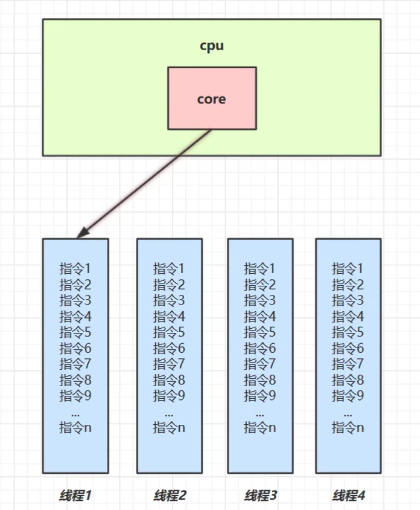

#### 并行:

相定义的为串行

并发并行：

* 并行：在同一时刻，有多个指令在多个 CPU 上同时执行
* 并发：在同一时刻，有多个指令在单个 CPU 上交替执行

例如：

- 家庭主妇做饭、打扫卫生、给孩子喂奶，她一个人轮流交替做这多件事，这时就是并发
- 家庭主妇雇了个保姆，她们一起这三件事事，这时既有并发，也有并行（这时会产生竞争，例如锅只有一口，一个人用锅时，另一个人就得等待)
- 雇了3个保姆，一个专做饭、一个专打扫卫生、一个专喂奶，互不干扰，这时是并行


同步与异步：

从方法调用的角度来讲，如果

- 需要等待结果返回，才能继续运行就是同步
- 不需要等待结果返回，就能继续运行就是异步

注意：同步在多线程中还有另外一层意思，是让多个线程步调一致


### 多线程是否能够提高效率？

场景: 
1.同时执行一个任务,单线程效率要比多线程低.
   但是当如果只有单核CPU的时候,反倒单线程效率还比多线程高..因为多线程始终只有一个CPU,
   且**多线程切换**的时候还有一个**上下文切换**的时间,所以会更慢!!!

结论：

1. 单核cpu下，多线程不能实际提高程序运行效率，只是为了能够在不同的任务之间切换，不同线程轮流使
   用cpu,不至于一个线程总占用cpu,别的线程没法干活
2. 多核cpu可以并行跑多个线程，但能否提高程序运行效率还是要分情况的有些任务，经过精心设计，将任务拆分，并行执行，当然可以提高程序的运行效率。但不是所有计算任务都能拆分（参考后文的【阿姆达尔定律】）也不是所有任务都需要拆分，任务的目的如果不同，谈拆分和效率没啥意义
3. **IO操作（读写磁盘）不占用cpu**,只是我们一般拷贝文件使用的是【阻塞IO】，这时相当于线程虽然不用cpu,但需要一直等待IO结束，把自己的时间片给了其他线程，没能充分利用线程。所以才有后面的【非阻塞IO】和【异步IO】优化来提高线程的利用率。


# ② Java线程

### Java创建线程：

#### 方法1 Thread：

~~~java
    public void test(){
        Thread thread = new Thread("myThread"){
            @Override
            public void run() {
                System.out.println(this.getName());
            }
        };
        // 启动线程，交给任务调度器分配时间片让CPU去执行
        thread.start();
    }
~~~

#### 方法2 Runnable：

推荐

(1)第一种线程对象和任务代码在一起,第二种是分开的!
(2)第二种分开的更为灵活,更易于与一些高级API配合使用
(3)java中组合优于继承,这样灵活性更大,耦合度更低

~~~java
@Slf4j(topic = "c.Test2")// 设置日志的主题为c.Test2
public class Test2 {
    public static void main(String[] args) {
        // 创建任务对象
        Runnable r = () -> {log.debug("running");};
        // 创建线程对象
        Thread t = new Thread(r, "t2");

        t.start();
    }
}
~~~

#### 方法3  FutureTask：

~~~java
    public static void main(String[] args) {
        // 1.创建未来任务类对象												
        FutureTask<Integer> tast = new FutureTask<>(new Callable<Integer>() {		
            @Override														
            public Integer call() throws Exception {	// 有返回值						
                System.out.println(Thread.currentThread().getName()+"is running...");
                Thread.sleep(4000);											
                return 100;													
            }															
        });																
        // 2.创建线程对象													
        Thread t1 = new Thread(tast,"t1");									
        t1.start();														
        // 通过未来任务类对象来拿值,且该方法执行的时候会阻塞当前线程(main)，直到t1线程执行完毕!!!
        Integer integer = tast.get();										
        System.out.println("主线程is run。。。");	
    }
~~~


# 线程运行原理

## 栈与栈帧 

Java Virtual Machine Stacks （Java 虚拟机栈） 


我们都知道 JVM 中由堆、栈、方法区所组成，其中栈内存是给谁用的呢？其实就是线程，**每个线程启动后，虚拟 机就会为其分配一块栈内存。** (在idea debug中的方法进栈图)

- 每个栈由多个栈帧（Frame）组成，对应着每次方法调用时所占用的内存 
- 每个线程只能有一个活动栈帧，对应着当前正在执行的那个方法 


一般栈帧的结构:

- 局部变量表: 一些局部变量的引用
- 返回地址: 当前栈帧(方法)执行结束之后,要返回给哪个?方法..
- 锁记录: 对象头(锁相关..)
- 操作数栈: 
- 动态链接:

如图：


## 线程上下文切换（Thread Context Switch） 

因为以下一些原因导致 cpu 不再执行当前的线程，转而执行另一个线程的代码 

被动：

- 线程的 cpu 时间片用完了 ，任务调度器切换了线程
- 垃圾回收线程要开始工作了，其他工作线程全部暂停，切换到垃圾回收线程上来
- 有更高优先级的线程需要运行，让高优先级的线程先执行

主动： 
- 线程自己调用了 sleep、yield、wait、join、park、synchronized、lock 等方法 


当 Context Switch 发生时，需要由操作系统保存当前线程的状态，并恢复另一个线程的状态，Java 中对应的概念就是**程序计数器**（Program Counter Register），它的作用是记住下一条 jvm 指令的执行地址，是线程私有的 

- 状态信息包括程序计数器、虚拟机栈中每个栈帧的信息，如局部变量、操作数栈、返回地址等都需要记录下来
- Context Switch 频繁发生会影响性能


# 线程常用方法

1

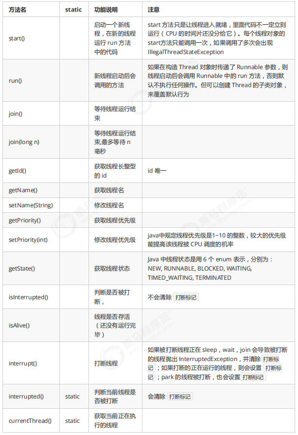

2

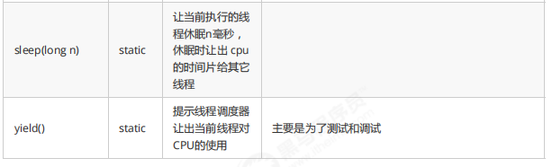

## start 与 run 

### 调用 run()与start()的区别


```java
public static void main(String[] args) {
    Thread t1 = new Thread("t1") {
        @Override
        public void run() {
            log.debug(Thread.currentThread().getName());
            FileReader.read(Constants.MP4_FULL_PATH);
        }
    };// t1处于NEW状态，是一个新建的线程
    
    t1.run();
    // t1.start(); 调用后t1处于RUNABLE状态，准备就绪
    log.debug("do other things ...");
}
```

输出

```plain
19:39:14 [main] c.TestStart - main
19:39:14 [main] c.FileReader - read [1.mp4] start ...
19:39:18 [main] c.FileReader - read [1.mp4] end ... cost: 4227 ms
19:39:18 [main] c.TestStart - do other things ...
```

程序仍在 main 线程运行， `FileReader.read()` 方法调用还是**同步**的.

**结论**：

- 直接调用 run方法 是在主线程中执行了 run方法，没有启动新的线程 
- 使用 start 是启动新的线程，通过新的线程来执行 run 中的代码


## sleep 与 yield 

### sleep 

1. 调用 sleep 会让当前线程从 *Running*进入 *Timed Waiting* 状态（阻塞） 

2. 其它线程可以使用 interrupt 方法打断正在睡眠的线程，这时 sleep 方法会抛出 InterruptedException 

3. 睡眠结束后的线程未必会立刻得到执行 ，要获得CPU的时间片才能执行

4. 建议用 TimeUnit 的 sleep 代替 Thread 的 sleep 来获得更好的可读性 

  ~~~java
  TimeUnit.SECONDS.sleep(1); // 休息1秒
  ~~~

  

### yield 

1. 调用 yield 会让当前线程从 *Running* 进入 *Runnable*就绪状态，然后调度执行其它线程 
2. 具体的实现依赖于操作系统的任务调度器 ，如果没有其他要执行的线程了，那么仍然会执行当前线程


### 线程优先级 

- 线程优先级会提示（hint）调度器优先调度该线程，但它仅仅是一个提示，调度器可以忽略它 
- 如果 cpu 比较忙，那么优先级高的线程会获得更多的时间片，但 cpu 闲时，优先级几乎没作用

线程的调度是由底层操作系统的任务调度器来调度管理,JVM虚拟机并不负责Java中线程
的调度工作,但虚拟机可以通过 优先级/yield() 给操作系统任务调度器一些建议.但是自己控制不了线程的调度

使用案例：

~~~java
Runnable task1 = () -> {
    int count = 0;
    for (;;) {
        System.out.println("---->1 " + count++);
    }
};
Runnable task2 = () -> {
    int count = 0;
    for (;;) {
        // Thread.yield();
        System.out.println(" ---->2 " + count++);
    }
};
Thread t1 = new Thread(task1, "t1");
Thread t2 = new Thread(task2, "t2");
// t1.setPriority(Thread.MIN_PRIORITY); // 设置优先级为最小
// t2.setPriority(Thread.MAX_PRIORITY);
t1.start();
t2.start();
~~~


## 应用: 限制-1.限制对CPU的使用


### sleep 实现 

在没有利用 cpu 来计算时，不要让 while(true) 空转浪费 cpu，这时可以使用 yield 或 sleep 来让出 cpu 的使用权 给其他程序

~~~java
while(true) {
    try {
        Thread.sleep(50);
    } catch (InterruptedException e) {
        e.printStackTrace();
    }
}
~~~

- 可以用 wait 或 条件变量达到类似的效果 
- 不同的是，后两种都需要加锁，并且需要相应的唤醒操作，一般适用于要进行同步的场景 
- sleep 适用于无需锁同步的场景 


### wait实现

~~~java
synchronized(锁对象) {
    while(条件不满足) {
        try {
            锁对象.wait();
        } catch(InterruptedException e) {
            e.printStackTrace();
        }
    }
    // do sth...
}
~~~

### 条件变量实现

~~~java
lock.lock();
try {
    while(条件不满足) {
        try {
            条件变量.await();
        } catch (InterruptedException e) {
            e.printStackTrace();
        }
    }
    // do sth...
} finally {
    lock.unlock();
}
~~~


##  join方法

底层使用wait()实现，与sleep()有些类似，都是阻塞当前线程。

### 为什么需要 join 

下面的代码执行，打印 r 是什么？

~~~java
static int r = 0;
public static void main(String[] args) throws InterruptedException {
    test1();
}

private static void test1() throws InterruptedException {
    log.debug("开始");
    Thread t1 = new Thread(() -> {
        log.debug("开始");
        sleep(1);
        log.debug("结束");
        r = 10;
    });
    t1.start();
    // t1.join(); // 把当前线程一直阻塞直到t1线程运行结束为止
    // t1.join(3000); // 设置当前线程最多等待t1线程3秒，如果t1线程提前结束了，则停止等待
    log.debug("结果为:{}", r);
    log.debug("结束");
}
~~~

分析 

- 因为主线程和线程 t1 是并行执行的，t1 线程需要 1 秒之后才能算出 r=10 
- 而主线程一开始就要打印 r 的结果，所以只能打印出 r=0 

解决方法 

- 用 sleep 行不行？为什么？ 不好，因为不能够确定t1线程休息了多久。
- 用 join，加在 t1.start() 之后即可，这样子最终输出： 结果为:10


##  interrupt 方法详解 

### 打断 sleep，wait，join 的线程 

这几个方法都会让线程进入阻塞状态 

打断 由于sleep()，wait()，join()方法而阻塞的线程, 会清空打断状态为false，并且抛出InterruptedException，以 sleep 为例：

~~~java
private static void test1() throws InterruptedException {
    Thread t1 = new Thread(()->{
        try {
        Thread.sleep(1000);
        } catch (InterruptedException e) {
            e.printStackTrace();
        }
    }, "t1");
    t1.start();
    sleep(0.5);
    t1.interrupt();
    log.debug(" 打断状态: {}", t1.isInterrupted());// 打断了由于sleep()而阻塞的线程，打断状态被重置为fasle
}
~~~

输出

~~~java
java.lang.InterruptedException: sleep interrupted
     at java.lang.Thread.sleep(Native Method)
     at java.lang.Thread.sleep(Thread.java:340)
     at java.util.concurrent.TimeUnit.sleep(TimeUnit.java:386)
     at cn.itcast.n2.util.Sleeper.sleep(Sleeper.java:8)
     at cn.itcast.n4.TestInterrupt.lambda$test1$3(TestInterrupt.java:59)
     at java.lang.Thread.run(Thread.java:745)
21:18:10.374 [main] c.TestInterrupt - 打断状态: false
~~~


### **打断正常运行的线程**


打断正常运行的线程, 不会清空打断状态，线程是否被真正的打断取决于这个线程本身。

~~~java
private static void test2() throws InterruptedException {
    Thread t2 = new Thread(()->{
        while(true) {
            Thread current = Thread.currentThread();// 获取当前的线程对象
            boolean interrupted = current.isInterrupted();
            if(interrupted) {// 根据打断标记来判断是否继续执行
                log.debug(" 打断状态: {}", interrupted);
                break;
            }
        }
    }, "t2");
    t2.start();
    sleep(0.5);
    t2.interrupt();// 当前线程去通知t2线程：我想要打断你,把t2线程的打断标记改为true
}
~~~

输出

```
20:57:37.964 [t2] c.TestInterrupt - 打断状态: true 
```


## (终止)模式之两阶段终止


Two Phase Termination 

在一个线程 T1 中如何“优雅”终止线程 T2？这里的【优雅】指的是给 T2 一个料理后事的机会。 

### 1. 错误思路 

- 使用线程对象的 stop() 方法停止线程 

- - stop 方法会真正杀死线程，如果这时线程锁住了共享资源，那么当它被杀死后就再也没有机会释放锁，其它线程将永远无法获取锁 

- 使用 System.exit(int) 方法停止线程 

- - 目的仅是停止一个线程，但这种做法会让整个程序都停止


### 2. 两阶段终止模式

监控CPU、内存的状态案例：

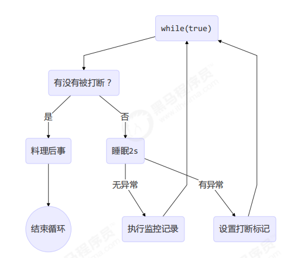

#### 2.1 利用 isInterrupted 

interrupt 可以打断正在执行的线程，无论这个线程是在 sleep，wait，join还是正常运行

~~~java
class TPTInterrupt {
    private Thread thread;
    public void start(){
        thread = new Thread(() -> {
            while(true) {
                Thread current = Thread.currentThread();
                if(current.isInterrupted()) {
                    log.debug("料理后事");
                    break;
                }
                try {
                    Thread.sleep(1000);// sleep()时被打断会抛出InterruptedException
                    log.debug("将结果保存");
                } catch (InterruptedException e) {
                     e.printStackTrace();
                    // 为了处理sleep()时被打断，打断标志为false的情况，在这里重新设置打断标志
                    current.interrupt();
                }
                // 执行监控操作 
            }
        },"监控线程");
        thread.start();
    }
    public void stop() {
        thread.interrupt();
    }
}

~~~

调用

~~~java
TPTInterrupt t = new TPTInterrupt();
t.start();

Thread.sleep(3500);
log.debug("stop");
t.stop();
~~~

结果：

~~~java
11:49:42.915 c.TwoPhaseTermination [监控线程] - 将结果保存
11:49:43.919 c.TwoPhaseTermination [监控线程] - 将结果保存
11:49:44.919 c.TwoPhaseTermination [监控线程] - 将结果保存
11:49:45.413 c.TestTwoPhaseTermination [main] - stop 
11:49:45.413 c.TwoPhaseTermination [监控线程] - 料理后事
~~~

#### **2.2 利用停止标记**

~~~java
// 停止标记用 volatile 是为了保证该变量在多个线程之间的可见性
// 我们的例子中，即主线程把它修改为 true 对 t1 线程可见
class TPTVolatile {
    private Thread thread;
    private volatile boolean stop = false;
    
    public void start(){
        thread = new Thread(() -> {
            while(true) {
                //Thread current = Thread.currentThread();
                if(stop) {
                    log.debug("料理后事");
                    break;
                }
                try {
                    Thread.sleep(1000);
                    log.debug("将结果保存");
                } catch (InterruptedException e) {

                }
                // 执行监控操作
            }
        },"监控线程");
        thread.start();
    }
    
    public void stop() {
        stop = true;
        thread.interrupt();
    }
}
~~~

调用 

~~~java
TPTVolatile t = new TPTVolatile();
t.start();

Thread.sleep(3500);
log.debug("stop");
t.stop();
~~~

结果：

~~~java
11:54:52.003 c.TPTVolatile [监控线程] - 将结果保存
11:54:53.006 c.TPTVolatile [监控线程] - 将结果保存
11:54:54.007 c.TPTVolatile [监控线程] - 将结果保存
11:54:54.502 c.TestTwoPhaseTermination [main] - stop 
11:54:54.502 c.TPTVolatile [监控线程] - 料理后事
~~~


## LockSupport.park()方法

使用：

~~~java
private static void test3() throws InterruptedException {
    Thread t1 = new Thread(() -> {
        log.debug("park...");
        LockSupport.park();// 会阻塞当前线程,被打断后打断标记为true
        log.debug("unpark...");
        log.debug("打断状态：{}", Thread.currentThread().isInterrupted());
    }, "t1");
    t1.start();
    sleep(0.5);
    t1.interrupt();// 会打断park()方法的阻塞
}
~~~

输出

~~~java
21:11:52.795 [t1] c.TestInterrupt - park... 
21:11:53.295 [t1] c.TestInterrupt - unpark... 
21:11:53.295 [t1] c.TestInterrupt - 打断状态：true
~~~

**注意**：如果打断标记已经是 true, 则 park 会失效

~~~java
private static void test4() {
    Thread t1 = new Thread(() -> {
        for (int i = 0; i < 5; i++) {
            log.debug("park...");
            LockSupport.park();// 第二次以及后面的park()会失效
            log.debug("打断状态：{}", Thread.currentThread().isInterrupted());// 改为Thread.interrupted() 即可使park()进行生效，因为会把打断标记改为false
        }
    });
    t1.start();
    sleep(1);
    t1.interrupt();
}
~~~

输出

~~~java
21:13:48.783 [Thread-0] c.TestInterrupt - park... 
21:13:49.809 [Thread-0] c.TestInterrupt - 打断状态：true 
21:13:49.812 [Thread-0] c.TestInterrupt - park... 
21:13:49.813 [Thread-0] c.TestInterrupt - 打断状态：true 
21:13:49.813 [Thread-0] c.TestInterrupt - park... 
21:13:49.813 [Thread-0] c.TestInterrupt - 打断状态：true 
21:13:49.813 [Thread-0] c.TestInterrupt - park... 
21:13:49.813 [Thread-0] c.TestInterrupt - 打断状态：true 
21:13:49.813 [Thread-0] c.TestInterrupt - park... 
21:13:49.813 [Thread-0] c.TestInterrupt - 打断状态：true
~~~


## 不推荐的方法


还有一些不推荐使用的方法，这些方法已过时，容易破坏同步代码块，造成锁的资源来不及释放，导致线程死锁

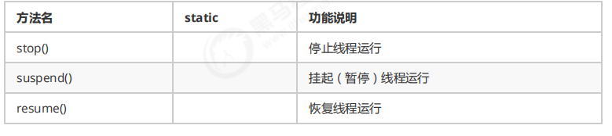


##  主线程与守护线程


默认情况下，Java 进程需要等待所有线程都运行结束，才会结束。

但是有一种特殊的线程叫做守护线程，只要其它非守护线程运行结束了，即使守护线程的代码没有执行完，也会强制结束。 

例如：

~~~java
log.debug("开始运行...");
Thread t1 = new Thread(() -> {
    log.debug("开始运行...");
    sleep(2);
    log.debug("运行结束...");
}, "daemon");
// 设置该线程为守护线程
t1.setDaemon(true);
t1.start();

sleep(1);
log.debug("运行结束...");
~~~

输出

~~~java
08:26:38.123 [main] c.TestDaemon - 开始运行... 
08:26:38.213 [daemon] c.TestDaemon - 开始运行... 
08:26:39.215 [main] c.TestDaemon - 运行结束...
~~~

**注意** 

- 垃圾回收器线程就是一种守护线程 ，内存紧张时，会定期的回收堆中没有被引用的对象。
- Tomcat 中的 Acceptor 和 Poller 线程(接收请求的线程)都是守护线程，所以 Tomcat 接收到 shutdown 命令后，不会等待它们处理完当前请求 


## 线程的五种状态 ( **操作系统** 层面)

这是从 **操作系统** 层面来描述的

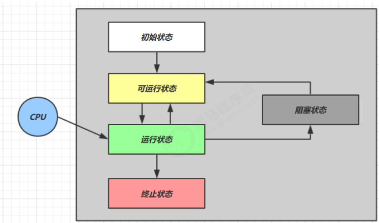

- 【初始状态】仅是在语言层面创建了线程对象，还未与操作系统线程关联 
- 【可运行状态】（就绪状态）指该线程已经调用了start()方法（与操作系统线程关联），可以由 CPU 调度执行，但是还没有获得时间片 
- 【运行状态】指获取了 CPU 时间片运行中的状态 

- - 当 CPU 时间片用完，会从【运行状态】转换至【可运行状态】，会导致线程的上下文切换 

- 【阻塞状态】 

- - 如果调用了阻塞 API，如 BIO 读写文件，这时该线程实际不会用到 CPU，会导致线程上下文切换，进入【阻塞状态】 
  - 等 BIO 操作完毕，会由操作系统唤醒阻塞的线程，转换至【可运行状态】 
  - 与【可运行状态】的区别是，对【阻塞状态】的线程来说只要它们一直不唤醒，调度器就一直不会考虑调度它们 

- 【终止状态】表示线程已经执行完毕，生命周期已经结束，不会再转换为其它状态


## 线程的六种状态(Thread.State)

这是从 **Java API** 层面来描述的 

根据 Thread.State 枚举，分为六种状态

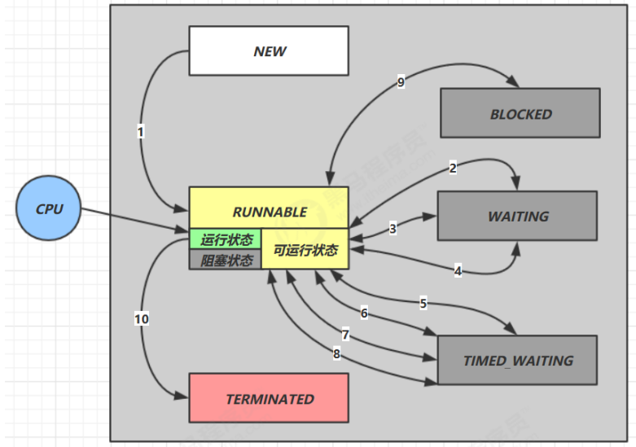

- `NEW`：线程刚被创建，但是还没有调用 `start()` 方法 
- `RUNNABLE` ：当调用了 `start()` 方法之后，注意，**Java API** 层面的 `RUNNABLE` 状态涵盖了 **操作系统** 层面的【可运行状态】、【运行状态】和【阻塞状态】（特指由于 BIO 导致的线程阻塞，没有分到时间片，在 Java 里无法区分，仍然认为是可运行） 
- `BLOCKED ， WAITING ， TIMED_WAITING` 都是 **Java API** 层面对【阻塞状态】的细分
     - `BLOCKED `：例如：拿不到某个对象的锁时，就会陷入此状态
     - `WAITING` ：没有时限的等待，例如：调用 join()方法等待一个死循环的线程结束时。
     - `TIMED_WAITING`：表示有时限的等待，例如：调用sleep()时
- `TERMINATED` 表示线程已经执行完毕，生命周期已经结束，不会再转换为其它状态


## 泡茶问题

想泡壶茶喝。当时的情况是：开水没有；水壶要洗，茶壶、茶杯要洗；火已生了，茶叶也有了。怎么办？ 

- 办法甲：洗好水壶，灌上凉水，放在火上；在等待水开的时间里，洗茶壶、洗茶杯、拿茶叶；等水开 

了，泡茶喝。 

- 办法乙：先做好一些准备工作，洗水壶，洗茶壶茶杯，拿茶叶；一切就绪，灌水烧水；坐待水开了，泡茶喝。 
- 办法丙：洗净水壶，灌上凉水，放在火上，坐待水开；水开了之后，急急忙忙找茶叶，洗茶壶茶杯，泡茶喝。 

哪一种办法省时间？我们能一眼看出，第一种办法好，后两种办法都窝了工。

洗茶壶，洗茶杯，拿茶叶，或先或后，关系不大，而且同是一个人的活儿，因而可以合并成为：

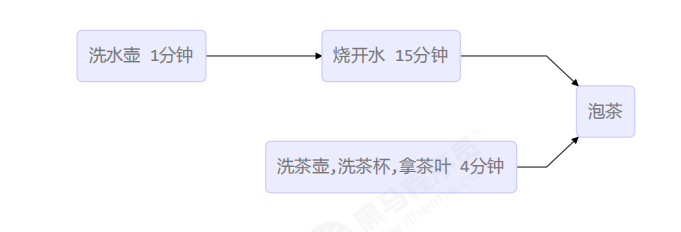

### 解法一: join

~~~java

Thread t1 = new Thread(() -> {
    log.debug("洗水壶");
    sleep(1);
    log.debug("烧开水");
    sleep(15);
}, "老王");

Thread t2 = new Thread(() -> {
    log.debug("洗茶壶");
    sleep(1);
    log.debug("洗茶杯");
    sleep(2);
    log.debug("拿茶叶");
    sleep(1);
    try {
        t1.join();
    } catch (InterruptedException e) {
        e.printStackTrace();
    }
    log.debug("泡茶");
}, "小王");

t1.start();
t2.start();

~~~

输出：

~~~java
19:19:37.547 [小王] c.TestMakeTea - 洗茶壶
19:19:37.547 [老王] c.TestMakeTea - 洗水壶
19:19:38.552 [小王] c.TestMakeTea - 洗茶杯
19:19:38.552 [老王] c.TestMakeTea - 烧开水
19:19:40.553 [小王] c.TestMakeTea - 拿茶叶
19:19:53.553 [小王] c.TestMakeTea - 泡茶
~~~

解法1 的缺陷：

- 上面模拟的是小王等老王的水烧开了，小王泡茶，如果反过来要实现老王等小王的茶叶拿来了，老王泡茶呢？代码最好能适应两种情况 
- 上面的两个线程其实是各执行各的，如果要模拟老王把水壶交给小王泡茶，或模拟小王把茶叶交给老王泡茶呢?


### 解法二:wait/notify


### 解法三: 第三者协调


## 本章小结 

本章的重点在于掌握 

- 线程创建 
- 线程重要 api，如 start，run，sleep，join，interrupt 等 
- 线程状态 
- 应用方面 

- - 异步调用：主线程执行期间，其它线程异步执行耗时操作 
  - 提高效率：并行计算，缩短运算时间 
  - 同步等待：join 
  - 统筹规划：合理使用线程，得到最优效果 

- 原理方面 

- - 线程运行流程：栈、栈帧、上下文切换、程序计数器 
  - Thread 两种创建方式 的源码 

- 模式方面 

- - 终止模式之两阶段终止


# ③ 共享模型

包括：

1. 共享问题 

2. synchronized 

3. 线程安全分析 

4. Monitor 

5. wait/notify 

6. 线程状态转换 

7. 活跃性 

8. Lock 


##  3.1 共享模型之管程

两个线程对初始值为 0 的静态变量一个做自增，一个做自减，各做 5000 次，结果是 0 吗？

 ~~~java
 static int counter = 0;
 public static void main(String[] args) throws InterruptedException {
     Thread t1 = new Thread(() -> {
         for (int i = 0; i < 5000; i++) {
             counter++;
         }
     }, "t1");
     
     Thread t2 = new Thread(() -> {
         for (int i = 0; i < 5000; i++) {
             counter--;
         }
     }, "t2");
     
     t1.start();
     t2.start();
     t1.join();
     t2.join();
     
     log.debug("{}",counter);
 }
 ~~~

以上的结果可能是正数、负数、零。为什么呢？因为 Java 中对静态变量的自增，自减并不是原子操作，要彻底理解，必须从字节码来进行分析 


例如对于 i++ 而言（i 为静态变量），实际会产生如下的 JVM 字节码指令：

~~~java
getstatic i // 获取静态变量i的值
iconst_1 // 准备常量1
iadd // 自增
putstatic i // 将修改后的值存入静态变量i
~~~

而对应` i-- `也是类似：

~~~java
getstatic i // 获取静态变量i的值
iconst_1 // 准备常量1
isub // 自减
putstatic i // 将修改后的值存入静态变量i
~~~


而 Java 的内存模型如下，完成静态变量的自增，自减需要在主存和工作内存中进行数据交换(**从主内存中获取数据到线程中，在线程中进行运算后再写回主内存**)：


**根本原因**：**线程上下文切换导致的指令交错执行**导致多线程访问共享资源时的线程安全问题。

如图：

多线程下这 8 行代码可能交错运行： 

出现负数的情况：

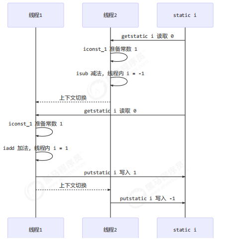


### 临界区 Critical Section  

- 一个程序运行多个线程本身是没有问题的 
- 问题出在多个线程访问**共享资源** 

- - 多个线程读**共享资源**其实也没有问题 
  - 在多个线程对**共享资源**读写操作时发生指令交错，就会出现问题 

- 一段代码块内如果存在对**共享资源**的**多线程读写**操作，称这段代码块为**临界区** 


例如，下面代码中的临界区：

~~~java

static int counter = 0;
static void increment()
// 临界区
{
    counter++; 
}

static void decrement()
// 临界区
{
    counter--; 
}
~~~

### 竞态条件 Race Condition 


多个线程在临界区内执行，由于代码的**执行序列不同(字节码发生改变)**而导致结果无法预测，称之为发生了**竞态条件**


### synchronized(兴歌ilike) 解决方案 

#### 应用之互斥 


为了避免临界区的竞态条件发生，有多种手段可以达到目的。 

- 阻塞式的解决方案：synchronized，Lock 
- 非阻塞式的解决方案：原子变量 


本次课使用阻塞式的解决方案：synchronized，来解决上述问题，即俗称的【对象锁】。

它采用互斥的方式让同一时刻至多只有一个线程能持有【对象锁】，其它线程再想获取这个【对象锁】时就会阻塞住。只有当这个对象锁释放时，才会唤醒由于这个对象锁阻塞的线程，阻塞的线程拿到这个对象锁后才能够执行里面临界区中的代码。

这样就能保证拥有锁的线程可以安全的执行临界区内的代码，不用担心线程上下文切换


**注意** 


虽然 java 中互斥和同步都可以采用 synchronized 关键字来完成，但它们还是有区别的： 

- 互斥是保证临界区的竞态条件发生，同一时刻只能有一个线程执行临界区代码 
- 同步是由于线程执行的先后、顺序不同、需要一个线程等待其它线程运行到某个点


#### synchronized 的使用

 语法

~~~java
synchronized(对象) // 线程1， 线程2(blocked)
{
 	临界区
}
~~~

解决

~~~java

static int counter = 0;
// 定义一个静态共享对象作为对象锁的对象，不能为null
static final Object room = new Object();

public static void main(String[] args) throws InterruptedException {
    
    Thread t1 = new Thread(() -> {
        for (int i = 0; i < 5000; i++) {
            synchronized (room) {
                counter++;
            }
        }
    }, "t1");
    
    Thread t2 = new Thread(() -> {
        for (int i = 0; i < 5000; i++) {
            synchronized (room) {
                counter--;
            }
        }
    }, "t2");
    
    t1.start();
    t2.start();
    t1.join();
    t2.join();
    log.debug("{}",counter);
}
~~~


synchronized原理示意图：

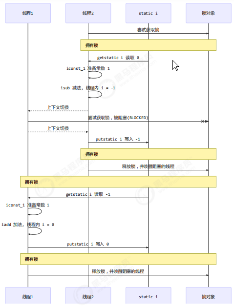

synchronized 实际是用**对象锁**保证了**临界区内代码的原子性**，临界区内的代码对外是**不可分割的**，不会被线程切换所打断。

为了加深理解，请思考下面的问题

- 如果把 `synchronized(obj) `放在 for 循环的外面，如何理解？-- 保证了5000次循环的原子性 
- 如果 t1 `synchronized(obj1)` 而 t2 `synchronized(obj2)` 会怎样运作？-- 锁对象要相同
- 如果 t1 `synchronized(obj)` 而 t2 没有加会怎么样？如何理解？-- 不能只锁一个线程


#### 使用面向对象思想改进 

把需要保护的共享变量放入一个类

~~~java
class Room {
    private int value = 0;
    public void increment() {
        synchronized (this) {
            value++;// 包含：3个字节码指令
        }
    }
    public void decrement() {
        synchronized (this) {
            value--;
        }
    }
    public int get() {
        synchronized (this) {
            return value;
        }
    }
}

@Slf4j
public class Test1 {

    public static void main(String[] args) throws InterruptedException {
        Room room = new Room();
        Thread t1 = new Thread(() -> {
            for (int j = 0; j < 5000; j++) {
                room.increment();
            }
        }, "t1");
        
        Thread t2 = new Thread(() -> {
            for (int j = 0; j < 5000; j++) {
                room.decrement();
            }
        }, "t2");
        
        t1.start();
        t2.start();
        t1.join();
        t2.join();
        
        log.debug("count: {}" , room.get());
    }
}

~~~


### 方法上的 synchronized 


 与使用synchronized(X)等效 ：

锁定成员方法：

~~~java
class Test{
    public synchronized void test() {

    }
}
等价于
class Test{
    public void test() {
        // 锁住对象
        synchronized(this) { 

        }
    }
}
~~~

锁定静态方法：

~~~java
class Test{
    public synchronized static void test() {
        
    }
}
等价于
class Test{
    public static void test() {
        // 锁住类
        synchronized(Test.class) {

        }
    }
}
~~~


### 线程八锁 练习题


其实就是考察 synchronized 锁住的是哪个对象 


情况1：12 或 21

~~~java
@Slf4j(topic = "c.Number")
class Number{
    public synchronized void a() {
        log.debug("1");
    }
    public synchronized void b() {
        log.debug("2");
    }
}

public static void main(String[] args) {
    Number n1 = new Number();
    // 锁住了this,即：n1对象
    new Thread(()->{ n1.a(); }).start();
    // 锁住了this,即：n1对象
    new Thread(()->{ n1.b(); }).start();
}
~~~

情况2：1s后12，或 2 1s后 1

~~~java
@Slf4j(topic = "c.Number")
class Number{
    public synchronized void a() {
        sleep(1);
        log.debug("1");
    }
    public synchronized void b() {
        log.debug("2");
    }
}

public static void main(String[] args) {
    Number n1 = new Number();
    new Thread(()->{ n1.a(); }).start();
    new Thread(()->{ n1.b(); }).start();
}
~~~

情况3：3 1s 12 或 23 1s 1 或 32 1s 1

~~~java
@Slf4j(topic = "c.Number")
class Number{
    public synchronized void a() {
        sleep(1);
        log.debug("1");
    }
    public synchronized void b() {
        log.debug("2");
    }
    public void c() {
        log.debug("3");
    }
}

public static void main(String[] args) {
    Number n1 = new Number();
    new Thread(()->{ n1.a(); }).start();
    new Thread(()->{ n1.b(); }).start();
    new Thread(()->{ n1.c(); }).start();
}
~~~

**线程分析法**：

如果a线程比b线程先获得锁，则：

a线程：1s 1

b线程：         2

c线程：3

结果：3 1s 1 2


情况4：2 1s 后 1

~~~java
@Slf4j(topic = "c.Number")
class Number{
    public synchronized void a() {
        sleep(1);
        log.debug("1");
    }
    public synchronized void b() {
        log.debug("2");
    }
}

public static void main(String[] args) {
    Number n1 = new Number();
    Number n2 = new Number();
    new Thread(()->{ n1.a(); }).start();
    new Thread(()->{ n2.b(); }).start();
}
~~~

情况5：2 1s 后 1

~~~java
@Slf4j(topic = "c.Number")
class Number{
    public static synchronized void a() {
        sleep(1);
        log.debug("1");
    }
    public synchronized void b() {
        log.debug("2");
    }
}

public static void main(String[] args) {
    Number n1 = new Number();
    new Thread(()->{ n1.a(); }).start();
    new Thread(()->{ n1.b(); }).start();
}
~~~

情况6：1s 后12， 或 2 1s后 1

~~~java
@Slf4j(topic = "c.Number")
class Number{
    public static synchronized void a() {
        sleep(1);
        log.debug("1");
    }
    public static synchronized void b() {
        log.debug("2");
    }
}

public static void main(String[] args) {
    Number n1 = new Number();
    new Thread(()->{ n1.a(); }).start();
    new Thread(()->{ n1.b(); }).start();
}
~~~

情况7：2 1s 后 1

~~~java
@Slf4j(topic = "c.Number")
class Number{
    public static synchronized void a() {
        sleep(1);
        log.debug("1");
    }
    public synchronized void b() {
        log.debug("2");
    }
}

public static void main(String[] args) {
    Number n1 = new Number();
    Number n2 = new Number();
    new Thread(()->{ n1.a(); }).start();
    new Thread(()->{ n2.b(); }).start();
}
~~~

情况8：1s 后12， 或 2 1s后 1

~~~java
@Slf4j(topic = "c.Number")
class Number{
    public static synchronized void a() {
        sleep(1);
        log.debug("1");
    }
    public static synchronized void b() {
        log.debug("2");
    }
}

public static void main(String[] args) {
    Number n1 = new Number();
    Number n2 = new Number();
    new Thread(()->{ n1.a(); }).start();
    new Thread(()->{ n2.b(); }).start();
}
~~~


## 变量的线程安全分析 

### 成员变量和静态变量

**成员变量和静态变量是否线程安全？** 

- 如果它们没有共享，则线程安全 
- 如果它们被共享了(如：静态变量 或 成员变量只有一个时，被全部线程所共享)，根据它们的状态是否能够改变，又分两种情况 

- - 如果只有读操作，则线程安全 如：String、Integer等不可变类
  - 如果有读写操作，则这段代码是临界区，需要考虑线程安全 


**局部变量是否线程安全？** 

- 局部变量是线程安全的 
- 但局部变量引用的对象则未必 

- - 如果该对象没有逃离方法的作用范围，它是线程安全的 
  - 如果该对象逃离方法的作用范围，需要考虑线程安全

如：

~~~java
public abstract class Test {

    public void bar() {
        // 是否安全
        SimpleDateFormat sdf = new SimpleDateFormat("yyyy-MM-dd HH:mm:ss");
        foo(sdf);
    }

    public abstract foo(SimpleDateFormat sdf);


    public static void main(String[] args) {
        new Test().bar();
    }
    
}
~~~

子类：其中 foo 的行为是不确定的，可能导致不安全的发生，被称之为**外星方法**

~~~java
public class TestSub extends Test{
    public void foo(SimpleDateFormat sdf) {
        String dateStr = "1999-10-11 00:00:00";
        for (int i = 0; i < 20; i++) {
            new Thread(() -> {// 新建了一个线程对sdf进行修改，线程不安全
                try {
                    sdf.parse(dateStr);
                } catch (ParseException e) {
                    e.printStackTrace();
                }
            }).start();
        }
    }
}
~~~


### **局部变量线程安全分析**

```java
public static void test1() {
    int i = 10;
    i++; 
}
```

每个线程调用 test1() 方法时局部变量 i，会在每个线程的栈帧内存中被创建多份，因此不存在共享

如图：

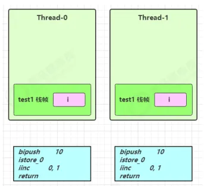

先看一个成员变量的例子:

~~~java
class ThreadUnsafe {
    private ArrayList<String> list = new ArrayList<>();
    
    public void method1(int loopNumber) {
        for (int i = 0; i < loopNumber; i++) {
            // { 临界区, 会产生竞态条件
            method2();
            method3();
            // } 临界区
        }
    }
    private void method2() {
        list.add("1");
    }
    private void method3() {
        list.remove(0);
    }
}
~~~

执行

~~~java
static final int THREAD_NUMBER = 2;
static final int LOOP_NUMBER = 200;

public static void main(String[] args) {
    ThreadUnsafe test = new ThreadUnsafe();
    for (int i = 0; i < THREAD_NUMBER; i++) {
        new Thread(() -> {
            test.method1(LOOP_NUMBER);
        }, "Thread" + i).start();
    }
}
~~~

其中一种情况是，如果线程2 还未 add(size此时为0)，线程1 remove 就会报错：

~~~java
Exception in thread "Thread1" java.lang.IndexOutOfBoundsException: Index: 0, Size: 0 
     at java.util.ArrayList.rangeCheck(ArrayList.java:657) 
     at java.util.ArrayList.remove(ArrayList.java:496) 
     at cn.itcast.n6.ThreadUnsafe.method3(TestThreadSafe.java:35) 
     at cn.itcast.n6.ThreadUnsafe.method1(TestThreadSafe.java:26) 
     at cn.itcast.n6.TestThreadSafe.lambda$main$0(TestThreadSafe.java:14) 
     at java.lang.Thread.run(Thread.java:748)
~~~

原理：

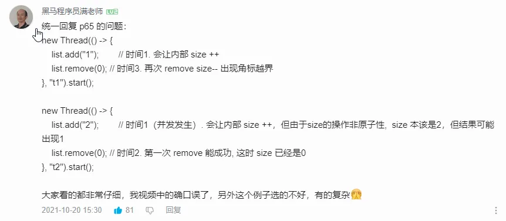
大概是这么回事:

1.  t1 add之后准备将size记为1但还没记的时候被 t2抢走,此时size仍未0
2.  t2 add操作,并成功将size记为1,然后又被t1抢回,
    t1 继续未完操作,再次将size记为1,这时又被t2抢走
3.  t2 继续操作,remove之后,size记为0,然后又被t1抢走
4.  此时t1再去remove时发现size为0,就报了异常


总结：**多线程读写共享的成员变量导致出现临界区代码**，如图：

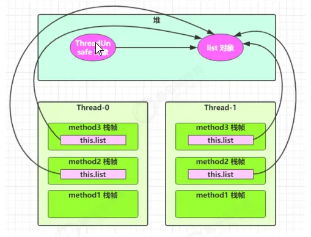


方法访问修饰符带来的思考，如果把 method2 和 method3 的方法修改为 public 会不会出现线程安全问题？ 

- 情况1：有其它线程调用 public的method2 和 method3 ,结果：不会出现线程安全问题，因为其他线程中传入的list肯定不是method1中的局部变量，所以不会发生共享

- 情况2：在 情况1 的基础上，为 ThreadSafe 类添加子类，子类覆盖 method2 或 method3 方法，即：

  ~~~java
  class ThreadSafe {
      public void method1(int loopNumber) {// 为了保证线程安全，所以使用final 保证public方法不被重写
          ArrayList<String> list = new ArrayList<>();
          for (int i = 0; i < loopNumber; i++) {
              method2(list);
              method3(list);
          }
      }
      private void method2(ArrayList<String> list) {// 使用private防止字类继承此方法然后重写
          list.add("1");
      }
      private void method3(ArrayList<String> list) {
          list.remove(0);
      }
  }
  
  class ThreadSafeSubClass extends ThreadSafe{
      @Override
      public void method3(ArrayList<String> list) {
          new Thread(() -> {
              list.remove(0);
          }).start();
      }
  }
  ~~~

  结果：会出现线程安全问题，因为是重写父类的方法，method3中的list参数已经写死了是method1中的局部变量list了，其他线程调用method3时就会出现多线程读写共享变量的问题。

从这个例子可以看出 private 或 final 提供【安全】的意义所在：线程安全


## 常见线程安全类

- String 
- Integer （各种包装类）
- StringBuffffer 
- Random 
- Vector （线程安全的List实现）
- Hashtable （线程安全的Map实现）
- java.util.concurrent 包下的类 (JUC)

这里说它们是线程安全的是指，多个线程调用它们同一个实例的某个方法时，是线程安全的。如：

~~~java
Hashtable table = new Hashtable();

new Thread(()->{
    table.put("key", "value1");
}).start();

new Thread(()->{
    table.put("key", "value2");
}).start();
~~~

- 它们的每个方法是原子的 

- 但**注意**它们多个方法的组合不是原子的,是非线程安全的。如：

  ~~~java
  public class Main{
      Hashtable table = new Hashtable();
      
      public void test(){
          // 线程1，线程2分别执行下面的代码，如图
          if( table.get("key") == null) { // 对同一个共享成员变量table进行了读写
              table.put("key", value);
          }
      }
  }
  ~~~
  
  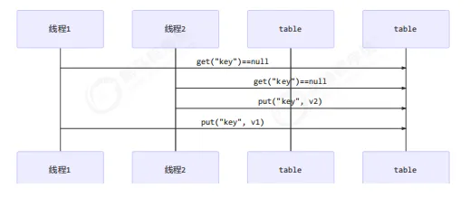


### **实例分析**


例1：成员变量一般都不是线程安全的，因为被所有线程所共享，除非是String这种不可变的类才是线程安全的。

如：

~~~java
public class MyServlet extends HttpServlet {
    // 是否安全？  不安全
    Map<String,Object> map = new HashMap<>();
    // 是否安全？  安全：String是不可变的
    String S1 = "...";
    // 是否安全？  安全
    final String S2 = "...";
    // 是否安全？  不安全： Date是可变的
    Date D1 = new Date();
    // 是否安全？  不安全：D2的指向不能改变了，但是D2对象中的值是可以改变的
    final Date D2 = new Date();

    public void doGet(HttpServletRequest request, HttpServletResponse response) {
        // 使用上述变量
    }
}
~~~

例2：

~~~java
public class MyServlet extends HttpServlet {
    private UserService userService = new UserServiceImpl();

    public void doGet(HttpServletRequest request, HttpServletResponse response) {
        userService.update(...);
    }
}
// 是否安全？  不安全:有成员变量并且有属性，虽然是private的，但是提供了public方法来对属性进行修改，所以是不安全的
public class UserServiceImpl implements UserService {
    // 记录调用次数
    private int count = 0;

    public void update() {
        // ...
        count++;
    }
}
~~~


例3：

~~~java
@Aspect
@Component
public class MyAspect {
    // 是否安全？ 不安全，改为环绕通知使用局部变量替换成员变量即可解决。
    private long start = 0L;

    @Before("execution(* *(..))")
    public void before() {
        start = System.nanoTime();
    }

    @After("execution(* *(..))")
    public void after() {
        long end = System.nanoTime();
        System.out.println("cost time:" + (end-start));
    }
}
~~~

例4：

~~~java
public class MyServlet extends HttpServlet {
    // 是否安全  安全
    private UserService userService = new UserServiceImpl();

    public void doGet(HttpServletRequest request, HttpServletResponse response) {
        userService.update(...);
    }
}

public class UserServiceImpl implements UserService {
    // 是否安全 安全 虽然有成员变量并且有属性，但是是private的，并且没有提供方法来对属性进行修改，所以是安全的
    private UserDao userDao = new UserDaoImpl();

    public void update() {
        userDao.update();
    }
}

public class UserDaoImpl implements UserDao {
    public void update() {
        String sql = "update user set password = ? where username = ?";
        // 是否安全 安全:因为当前的UserDaoImpl类没有属性可以被修改，是无状态的
        try (Connection conn = DriverManager.getConnection("","","")){
            // ...
        } catch (Exception e) {
            // ...
        }
    }
}
~~~

例5：

~~~java
public class MyServlet extends HttpServlet {
    // 是否安全
    private UserService userService = new UserServiceImpl();

    public void doGet(HttpServletRequest request, HttpServletResponse response) {
        userService.update(...);
    }
}

public class UserServiceImpl implements UserService {
    // 是否安全 安全：只有一个成员对象但是不会被修改
    private UserDao userDao = new UserDaoImpl();

    public void update() {
        userDao.update();
    }
}

public class UserDaoImpl implements UserDao {
    // 是否安全 不安全：只有一个UserDaoImpl，所以也就只有一个成员conn，并且会被改变，所以不安全
    private Connection conn = null;
    public void update() throws SQLException {
        String sql = "update user set password = ? where username = ?";
        conn = DriverManager.getConnection("","","");
        // ...
        conn.close();
    }
}
~~~


例6:

~~~java
public class MyServlet extends HttpServlet {
    private UserService userService = new UserServiceImpl();

    public void doGet(HttpServletRequest request, HttpServletResponse response) {
        userService.update(...);
    }
}

public class UserServiceImpl implements UserService {
    public void update() {
        // 每次线程进入update()方法时都会创建一个新的UserDaoImpl对象，所以UserDaoImpl中的Connection也是新的
        UserDao userDao = new UserDaoImpl();
        userDao.update();
    }
}

public class UserDaoImpl implements UserDao {
    // 是否安全 安全
    private Connection = null;
    public void update() throws SQLException {
        String sql = "update user set password = ? where username = ?";
        conn = DriverManager.getConnection("","","");
        // ...
        conn.close();
    }
}
~~~


作业：

### 卖票练习 

~~~java
public class ExerciseSell {
    public static void main(String[] args) {
        TicketWindow ticketWindow = new TicketWindow(2000);
        List<Thread> list = new ArrayList<>();
        // 用来存储卖出去多少张票，所以线程安全的Vector来进行并发的添加
        List<Integer> sellCount = new Vector<>();
        for (int i = 0; i < 2000; i++) {
            Thread t = new Thread(() -> {
                // 分析这里的竞态条件
                int count = ticketWindow.sell(randomAmount());
                sellCount.add(count);
            });
            // 把每一个线程存储起来
            list.add(t);
            t.start();
        }
        // 等待所有卖票的线程执行完毕
        list.forEach((t) -> {
            try {
                t.join();
            } catch (InterruptedException e) {
                e.printStackTrace();
            }
        });
        // 卖出去的票求和  
        log.debug("selled count:{}",sellCount.stream().mapToInt(c -> c).sum());
        // 剩余票数
        log.debug("remainder count:{}", ticketWindow.getCount());
    }
    // Random 为线程安全
    static Random random = new Random();
    // 随机 1~5
    public static int randomAmount() {
        return random.nextInt(5) + 1;
    }
}

class TicketWindow {
    private int count;
    
    public TicketWindow(int count) {
        this.count = count;
    }
    public int getCount() {
        return count;
    }
    public int sell(int amount) {// 线程不安全的，提供了修改成员变量count的方法
        if (this.count >= amount) {
            this.count -= amount;
            return amount;
        } else {
            return 0;
        }
    }
}
~~~

### 转账练习

测试下面代码是否存在线程安全问题，并尝试改正

~~~java
public class ExerciseTransfer {
    public static void main(String[] args) throws InterruptedException {
        Account a = new Account(1000);
        Account b = new Account(1000);
        Thread t1 = new Thread(() -> {
            for (int i = 0; i < 1000; i++) {
                a.transfer(b, randomAmount());
            }
        }, "t1");
        Thread t2 = new Thread(() -> {
            for (int i = 0; i < 1000; i++) {
                b.transfer(a, randomAmount());
            }
        }, "t2");
        t1.start();
        t2.start();
        t1.join();
        t2.join();
        // 查看转账2000次后的总金额
        log.debug("total:{}",(a.getMoney() + b.getMoney()));
    }
    // Random 为线程安全
    static Random random = new Random();
    // 随机 1~100
    public static int randomAmount() {
        return random.nextInt(100) +1;
    }
}

class Account {
    private int money;
    public Account(int money) {
        this.money = money;
    }
    public int getMoney() {
        return money;
    }
    public void setMoney(int money) {
        this.money = money;
    }
    public void transfer(Account target, int amount) {
        if (this.money > amount) {
            this.setMoney(this.getMoney() - amount);
            target.setMoney(target.getMoney() + amount);
        }
    }
}
~~~

这样改正行不行，为什么？  不行,因为在临界区中读写了this.money 与 target.money两个共享变量，只在方法上使用synchronized锁定this只能解决this.money的线程安全问题，对两个一起加锁容易造成死锁

```java
public synchronized void transfer(Account target, int amount) {
    if (this.money > amount) {
        this.setMoney(this.getMoney() - amount);
        target.setMoney(target.getMoney() + amount);
    }
}
```

一个答案：

~~~java
public  void transfer(Account target, int amount) {
    synchronized(Account.class){// 锁住this与target公共的Account类，效率低下
        if (this.money > amount) {
            this.setMoney(this.getMoney() - amount);
            target.setMoney(target.getMoney() + amount);
        }
    }
}
~~~

# Monitor 概念 

## Java 对象头

以 32 位虚拟机为例

对象由对象头与成员变量组成


# 实际应用


## ThreadPoolTaskExecutor 线程池


### ① 配置与定义：

~~~java
@Configuration
@EnableAsync
public class AsyncConfiguration {

    @Bean("firstExecutor")
    public Executor doSomethingExecutor() {
        ThreadPoolTaskExecutor executor = new ThreadPoolTaskExecutor();
        // 核心线程数：线程池创建时候初始化的线程数
        executor.setCorePoolSize(10);
        // 最大线程数：线程池最大的线程数，只有在缓冲队列满了之后才会申请超过核心线程数的线程
        executor.setMaxPoolSize(20);
        // 缓冲队列：用来缓冲执行任务的队列
        executor.setQueueCapacity(500);
        // 允许线程的空闲时间60秒：当超过了核心线程之外的线程在空闲时间到达之后会被销毁
        executor.setKeepAliveSeconds(60);
        // 线程池名的前缀：设置好了之后可以方便我们定位处理任务所在的线程池
        executor.setThreadNamePrefix("first-");
        // 缓冲队列满了之后的拒绝策略：由调用线程处理（一般是主线程）
        executor.setRejectedExecutionHandler(new ThreadPoolExecutor.DiscardPolicy());
        executor.initialize();
        return executor;
    }
}
~~~


`ThreadPoolTaskExecutor` 是 Spring 提供的一种实现 `Executor` 接口的线程池类，它内部是基于 `ThreadPoolExecutor` 构建的。你可以使用 `ThreadPoolTaskExecutor` 来提交任务并等待任务执行完成。这里有两种常见的方式：使用 `Future` 对象和任务计数等待器。

### ②使用

### 1. 使用 `Future` 对象等待任务完成

`ThreadPoolTaskExecutor` 支持通过 `submit()` 方法提交 `Callable` 任务并返回 `Future`，你可以使用 `Future` 的 `get()` 方法来阻塞当前线程，直到任务完成。示例如下：

#### 示例代码

```java
import org.springframework.scheduling.concurrent.ThreadPoolTaskExecutor;
import java.util.concurrent.Callable;
import java.util.concurrent.Future;

public class TaskExecutorExample {

    public static void main(String[] args) throws Exception {
        // 创建一个 ThreadPoolTaskExecutor
        ThreadPoolTaskExecutor executor = new ThreadPoolTaskExecutor();
        executor.setCorePoolSize(5); // 核心线程数
        executor.setMaxPoolSize(10); // 最大线程数
        executor.setQueueCapacity(25); // 队列容量
        executor.initialize(); // 初始化线程池

        // 提交任务并获取 Future 对象
        Future<String> future = executor.submit(new Callable<String>() {
            @Override
            public String call() throws Exception {
                Thread.sleep(2000); // 模拟耗时任务
                return "任务完成";
            }
        });

        // 阻塞当前线程，直到任务完成并获取结果
        String result = future.get();
        System.out.println(result); // 输出 "任务完成"

        // 关闭线程池
        executor.shutdown();
    }
}
```

#### 解释
- `executor.submit()` 提交一个任务并返回 `Future` 对象。
- 调用 `future.get()` 会阻塞当前线程，直到任务执行完成并返回结果。
- 这种方式适用于需要同步等待任务完成的场景。

### 2. 使用计数器或 `CountDownLatch` 等待多个任务

如果需要等待多个任务执行完成，可以使用 Java 的并发工具类 `CountDownLatch`。示例如下：

#### 示例代码

```java
import org.springframework.scheduling.concurrent.ThreadPoolTaskExecutor;
import java.util.concurrent.CountDownLatch;

public class TaskExecutorExample {

    public static void main(String[] args) throws InterruptedException {
        // 创建一个 ThreadPoolTaskExecutor
        ThreadPoolTaskExecutor executor = new ThreadPoolTaskExecutor();
        executor.setCorePoolSize(5);
        executor.setMaxPoolSize(10);
        executor.setQueueCapacity(25);
        executor.initialize();

        // 计数器，表示需要等待的任务数量
        CountDownLatch latch = new CountDownLatch(3);

        // 提交多个任务
        for (int i = 0; i < 3; i++) {
            executor.execute(() -> {
                try {
                    System.out.println(Thread.currentThread().getName() + " 执行任务");
                    Thread.sleep(2000); // 模拟耗时任务
                } catch (InterruptedException e) {
                    e.printStackTrace();
                } finally {
                    latch.countDown(); // 任务完成，计数器减一
                }
            });
        }

        // 等待所有任务完成
        latch.await();
        System.out.println("所有任务已完成");

        // 关闭线程池
        executor.shutdown();
    }
}
```

#### 解释
- `CountDownLatch` 允许一个或多个线程等待其他线程完成任务。
- 每个任务完成时调用 `latch.countDown()`，表示一个任务完成。
- `latch.await()` 会阻塞当前线程，直到计数器归零，即所有任务完成。

### 3. 选择合适的方式
- 如果只需要等待单个任务完成，使用 `Future` 是更简单的选择。
- 如果需要等待多个任务，可以使用 `CountDownLatch`、`CyclicBarrier` 等同步工具。


###  ③`@Async` 注解

下面是一个完整的示例，演示如何使用 `@Async("firstExecutor")` 来将某个方法异步执行，并配置自定义的线程池 `firstExecutor`。

### 示例：异步发送邮件

假设我们有一个服务类 `EmailService`，其中的 `sendEmail` 方法用于发送电子邮件，发送邮件可能比较耗时，因此我们希望它在后台线程池中异步执行。

#### 1. 配置线程池

首先，在配置类中定义 `firstExecutor` 线程池：

```java
import org.springframework.context.annotation.Bean;
import org.springframework.context.annotation.Configuration;
import org.springframework.scheduling.concurrent.ThreadPoolTaskExecutor;

import java.util.concurrent.Executor;

@Configuration
public class AsyncConfig {

    @Bean(name = "firstExecutor")
    public Executor firstExecutor() {
        ThreadPoolTaskExecutor executor = new ThreadPoolTaskExecutor();
        executor.setCorePoolSize(5); // 核心线程数
        executor.setMaxPoolSize(10); // 最大线程数
        executor.setQueueCapacity(25); // 队列容量
        executor.setThreadNamePrefix("EmailExecutor-"); // 线程名称前缀
        executor.initialize();
        return executor;
    }
}
```

这里定义了一个名为 `firstExecutor` 的线程池，核心线程数为 5，最大线程数为 10，并为线程名称添加前缀 `"EmailExecutor-"`。

#### 2. 在服务类中使用 `@Async`

接下来，创建 `EmailService` 类并在 `sendEmail` 方法上使用 `@Async("firstExecutor")` 注解，使其异步执行。

```java
import org.springframework.scheduling.annotation.Async;
import org.springframework.stereotype.Service;

@Service
public class EmailService {

    @Async("firstExecutor")
    public void sendEmail(String recipient, String subject, String body) {
        // 模拟发送邮件的耗时操作
        try {
            System.out.println("开始发送邮件到: " + recipient);
            Thread.sleep(3000); // 模拟耗时3秒
            System.out.println("邮件发送完成: " + recipient);
        } catch (InterruptedException e) {
            e.printStackTrace();
        }
    }
}
```

当调用 `sendEmail` 方法时，它会在 `firstExecutor` 线程池的线程中异步执行，不会阻塞调用它的主线程。

#### 3. 调用异步方法

在其他类中注入 `EmailService` 并调用 `sendEmail` 方法。例如，在一个控制器中：

```java
import org.springframework.beans.factory.annotation.Autowired;
import org.springframework.web.bind.annotation.GetMapping;
import org.springframework.web.bind.annotation.RequestParam;
import org.springframework.web.bind.annotation.RestController;

@RestController
public class EmailController {

    @Autowired
    private EmailService emailService;

    @GetMapping("/send-email")
    public String sendEmail(@RequestParam String recipient) {
        emailService.sendEmail(recipient, "Welcome!", "Thank you for signing up.");
        return "邮件正在发送中...";
    }
}
```

当访问 `/send-email?recipient=example@example.com` 时，`emailService.sendEmail` 会在后台线程中异步执行，并立即返回响应 “邮件正在发送中...”。

### 4. 运行结果

访问 `http://localhost:8080/send-email?recipient=example@example.com` 后，日志会显示：

```plaintext
邮件正在发送中...
开始发送邮件到: example@example.com
邮件发送完成: example@example.com
```

此时，返回到客户端的响应不会等待 `sendEmail` 方法完成，这样即使 `sendEmail` 操作耗时，应用也能迅速响应用户请求，提高了效率。


### ④计算一个方法的执行时间

在 Java 中，计算一个方法的执行时间可以通过记录方法开始执行和结束执行的时间，然后计算两者之间的时间差。最常用的方法是使用 `System.currentTimeMillis()` 或 `System.nanoTime()`。以下是具体的示例代码：

### 使用 `System.currentTimeMillis()`

```java
public class TimeMeasurementExample {

    public static void main(String[] args) {
        long startTime = System.currentTimeMillis(); // 记录开始时间

        // 需要测量时间的方法
        someMethod();

        long endTime = System.currentTimeMillis(); // 记录结束时间
        long duration = endTime - startTime; // 计算方法执行时间
        System.out.println("方法执行时间: " + duration + " 毫秒");
    }

    private static void someMethod() {
        // 模拟耗时任务
        try {
            Thread.sleep(2000); // 休眠2秒
        } catch (InterruptedException e) {
            e.printStackTrace();
        }
    }
}
```

### 使用 `System.nanoTime()`

如果需要更精确的时间测量，可以使用 `System.nanoTime()`，它提供的是更高精度的时间测量（以纳秒为单位）。

```java
public class TimeMeasurementExample {

    public static void main(String[] args) {
        long startTime = System.nanoTime(); // 记录开始时间

        // 需要测量时间的方法
        someMethod();

        long endTime = System.nanoTime(); // 记录结束时间
        long duration = endTime - startTime; // 计算方法执行时间
        System.out.println("方法执行时间: " + duration + " 纳秒");

        // 如果需要将纳秒转换为毫秒
        System.out.println("方法执行时间: " + duration / 1_000_000 + " 毫秒");
    }

    private static void someMethod() {
        // 模拟耗时任务
        try {
            Thread.sleep(2000); // 休眠2秒
        } catch (InterruptedException e) {
            e.printStackTrace();
        }
    }
}
```

### 选择 `System.currentTimeMillis()` vs `System.nanoTime()`

- `System.currentTimeMillis()` 适用于粗略测量较长时间的任务，单位为毫秒。
- `System.nanoTime()` 提供更精确的时间测量，适用于更细粒度的时间计算，例如测量方法的执行时间，单位为纳秒。


### ThreadPoolTaskExecutor 实际使用：

#### 配置：

~~~java
@Configuration
@EnableAsync
public class AsyncConfiguration {

    @Bean("firstExecutor")
    public Executor doSomethingExecutor() {
        ThreadPoolTaskExecutor executor = new ThreadPoolTaskExecutor();
        // 核心线程数：线程池创建时候初始化的线程数
        executor.setCorePoolSize(10);
        // 最大线程数：线程池最大的线程数，只有在缓冲队列满了之后才会申请超过核心线程数的线程
        executor.setMaxPoolSize(20);
        // 缓冲队列：用来缓冲执行任务的队列
        executor.setQueueCapacity(500);
        // 允许线程的空闲时间60秒：当超过了核心线程之外的线程在空闲时间到达之后会被销毁
        executor.setKeepAliveSeconds(60);
        // 线程池名的前缀：设置好了之后可以方便我们定位处理任务所在的线程池
        executor.setThreadNamePrefix("first-");
        // 缓冲队列满了之后的拒绝策略：由调用线程处理（一般是主线程）
        executor.setRejectedExecutionHandler(new ThreadPoolExecutor.DiscardPolicy());
        executor.initialize();
        return executor;
    }
}
~~~


#### 使用：

~~~java
	@Autowired
    private Executor firstExecutor;

	@Test
    public void contextLoads() throws Exception {

        String image_url = "http://8.130.138.112/static-resources/files/2550/_02【客多多出行-23.20元-1个行程】高德打车电子发票.pdf.png";
        String access_token = getOAuth2AccessToken();
        // 计数器，表示需要等待的任务数量
        int taskCount = 5;
        CountDownLatch latch = new CountDownLatch(taskCount);

        // 提交多个任务
        firstExecutor.execute(() -> {
            try {
                // 增值税发票识别
                Map<String, Object> invoice = ocrCoreInvoice("invoice", image_url, access_token);
                if (Objects.nonNull(invoice)) {
                    log.info(String.valueOf(invoice));
                }
            } catch (Exception e) {
                throw new RuntimeException(e);
            }finally {
                latch.countDown();
            }
        });

        firstExecutor.execute(() -> {
            try {
                // 增值税发票识别
                Map<String, Object> invoice = ocrCoreInvoice("invoice", image_url, access_token);
                if (Objects.nonNull(invoice)) {
                    log.info(String.valueOf(invoice));
                }
            } catch (Exception e) {
                throw new RuntimeException(e);
            }finally {
                latch.countDown();
            }

            try {
                // 增值税发票识别
                Map<String, Object> invoice = ocrCoreInvoice("invoice", image_url, access_token);
                if (Objects.nonNull(invoice)) {
                    log.info(String.valueOf(invoice));
                }
            } catch (Exception e) {
                throw new RuntimeException(e);
            }finally {
                latch.countDown();
            }
        });

        firstExecutor.execute(() -> {
            try {
                // 增值税发票识别
                Map<String, Object> invoice = ocrCoreInvoice("invoice", image_url, access_token);
                if (Objects.nonNull(invoice)) {
                    log.info(String.valueOf(invoice));
                }
            } catch (Exception e) {
                throw new RuntimeException(e);
            }finally {
                latch.countDown();
            }

            try {
                // 增值税发票识别
                Map<String, Object> invoice = ocrCoreInvoice("invoice", image_url, access_token);
                if (Objects.nonNull(invoice)) {
                    log.info(String.valueOf(invoice));
                }
            } catch (Exception e) {
                throw new RuntimeException(e);
            }finally {
                latch.countDown();
            }
        });

        // 等待所有任务完成
        latch.await();

    }
~~~

