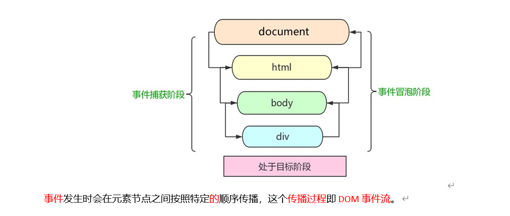
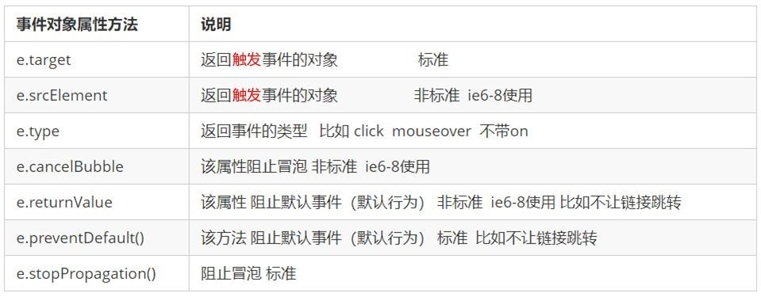
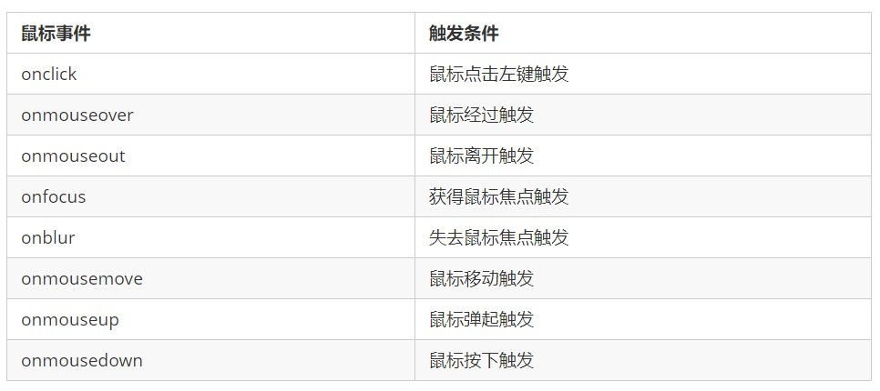

# JavaScript的使用

## 1 基础知识

**js可以实现用户与浏览器的交互、浏览器与服务器的交互**

ES5（旧版本）,ES2015++(新版本)

### 1.1 引入js的方式

~~~html
<body>
    <script>
        // 显示一个警告弹窗
        alert("hello world");
        //向浏览器的控制台打印一份日志信息
        console.log("hi");
    </script>
</body>
~~~


var:声明变量(ES2015中使用let声明变量)

### 1.2 六种数据类型
#### 1. 数值(Number):100,1,2,3
#### 2. 字符串(String):“hello world”"你好世界'
#### 3. 布尔(Boolean):true,false
#### 4. 未定义(Undefined):undefined

~~~html
<script>
    //没有赋值的变量默认为undefined
	var v;
    console.log(v);
</script>
~~~


#### 5.空(Nul):null  (空对象)

#### 6.对象(Object):{} 不是代码块！

即：属性的无序集合

```html
<script>
    var cat{
	name:"mm",
	age:2
}
    //两种获取属性的方式
    var str1 = cat.name;
    var str2 = cat["name"];
</script>
```

遍历方式：

~~~html
<script>
    for(let name in cat){
        // name为cat对象的属性名
        // cat[name]为属性值
    }
</script>
~~~


### 1.3 比较运算符 ==

1. ==
2. ===
3. !=
4. !===

~~~html
    <script>
        // 使用==(等于)判断不同的数据类型时，会自动转换为相同数据类型后(导致性能低)，只对值进行比较
        console.log(20 == "20");
        // ===(恒等于)既判断值是否相同也判断数据类型是否相同
        console.log(20 === "20");
        
        // 使用!=(不等于)判断不同的数据类型时，会自动转换为相同数据类型后，只对值进行比较
        console.log(20 != "20");
        // !==(非更等于)既判断值是否相同也判断数据类型是否相同
        console.log(20 !== "20");
    </script>
~~~

### 1.4 函数

普通函数

~~~html
<body>
    <script>
        // 定义函数，不用写返回值（反正都可以使用var来接收）与形参类型
        function cal(num1,num2,str){
            switch(str){
                case "+":
                    return num1+num2;
                case "-":
                    return num1-num2;
                case "*":
                    return num1*num2;
                case "/":
                    return num1/num2;
            }

        }
        console.log(cal(1,2,"*"));
    </script>
</body>
~~~

匿名函数

~~~html
    <script>
		var v = {
            //定义一个匿名函数(没有函数名)并赋值给cal,cal即是v对象的一个方法
            cal:function(num1,num2,str){
                switch(str){
                case "+":
                    return num1+num2;
                case "-":
                    return num1-num2;
                case "*":
                    return num1*num2;
                case "/":
                    return num1/num2;
            }
            }
        }
        console.log(v.cal(1,2,"/"));
    </script>
~~~

### 1.5 数组 Array

定义方式：

~~~html
<body>
    <script>
        //使用构造函数
       var $arr = new Array("1","2","3"); 
        //简写
        var arr = [1,2,3];
    </script>
</body>
~~~

#### 1.5.1遍历方式 for in,for of,map：

~~~html
<body>
    <script>
      var arr = [1,2,3];
      // 类似java版本
      for(let i = 0;i<arr.length;i++){
          consile.log(arr[i]);
      }
      //for in 版本
      for(var i in arr){
          //i为索引
        console.log(arr[i]);
      }
        
      //for of 版本
      for(var i of arr){
          //i为数组的元素
        console.log(i);
      }
        
      //使用数组对象自带的map方法，传入参数为一个回调函数
    arr.map(function(value,index){
        console.log("第"+(index+1)+"个元素是"+value);
    })
    </script>
</body>
~~~


#### map的使用例子

map的返回值：

~~~js
function joinFieldByComma(arr, field) {
    // map()返回的是数组： [37,44,48] join后返回字符串：37,44,48
    return arr.map(obj => obj[field]).join(',');
}

// 示例使用
const data = [
    { id: 37, name: "Alice" },
    { id: 44, name: "Bob" },
    { id: 48, name: "Charlie" }
];

const result = joinFieldByComma(data, 'id');
console.log(result);  // 输出: "37,44,48"

~~~

**`map` 方法：**

- `arr.map(obj => obj[field])` 遍历数组 `arr` 中的每个对象 `obj`，并对每个对象执行 `obj[field]` 操作。
- `obj[field]` 获取当前对象 `obj` 中的字段 `field` 的值。比如对象 `{ id: 37, name: "Alice" }`，指定字段 `id` 时就会获取值 `37`。
- 最终 `map` 会返回一个新数组，数组中的每个元素是对象中提取出的字段值。

对于例子 `data = [{ id: 37, name: "Alice" }, { id: 44, name: "Bob" }, { id: 48, name: "Charlie" }]`，执行 `arr.map(obj => obj[field])` 会返回 `[37, 44, 48]`。

**`join` 方法：**

- `join(',')` 将数组中的元素以逗号 `,` 作为分隔符拼接成一个字符串。
- 对 `[37, 44, 48]` 调用 `join(',')` 将会返回字符串 `"37,44,48"`。


### forEach遍历不能return中断

1. **`return` 只退出当前函数**
   `return` 只能退出当前的函数，而你在 `forEach` 回调函数中使用了 `return`，它只退出当前的迭代（即当前的 `forEach` 回调函数），不会停止整个 `forEach` 的执行，也不会退出 `subSaveContent()` 函数。
2. **`forEach` 无法被中途终止**
   `forEach` 是数组的一个遍历方法，它设计上不支持通过 `return` 或其他方式中途退出整个遍历。因此，后面的逻辑仍然会继续执行。

------

### 解决方法

为了能够在满足条件时中止遍历并退出 `subSaveContent`，你需要替换 `forEach` 为其他支持中断的遍历方式，比如 `for...of`。


###  **总结 `for...of` 和 `for...in` 的区别**：

- `for...of`

  ：

  - 适用于遍历数组、字符串、Map、Set 等可迭代对象。
  - 直接访问集合中的值。

- `for...in`

  ：

  - 适用于遍历对象的可枚举属性（键）。
  - 访问对象的键名，并通过 `对象[key]` 形式访问对应的值。

例子：

在这段代码中，`for...of` 用于遍历数组中的每个对象，`for...in` 则用于遍历对象中的每个属性。

~~~js
			// 判断数组中的每个对象的字段是否都填了值，是否所有信息都填完了
			hasEmptyValues(data) {
			    for (let item of data) {
                    // item就是数组中的每一个对象
			        for (let key in item) {
                        // key就是每个对象属性，字符串类型
			            if (item[key] === null || item[key] === undefined || item[key] === '' || item[key].length == 0) {
			                return true; // 发现空值，返回 true
			            }
			        }
			    }
			    return false; // 所有值都不为空，返回 false
			},
~~~


#### 1.5.2 数组的常用方法(map,push,sort,filter,join)

- map 遍历
- push 增

~~~html
<body>
    <script>
    var arr = [1,2,3,5,2,8,6];
    arr.push(10);
    console.log(arr);
    </script>
</body>
~~~

- sort 排序

  ~~~js
  (res) => {
      if (res.confirm) {
          console.log(`this.mergArryIndex = ${JSON.stringify(this.mergArryIndex)}`);
          // 获取要删除的发票对象降序后,从后向前删除
          this.mergArryIndex.sort((a, b) => b - a);
          for(let i = 0; i < this.mergArryIndex.length; i++){
              let deletedIndex = this.mergArryIndex[i];
              console.log(`要删除的发票对象索引: deletedIndex = ${deletedIndex}`);
              this.allInvoiceMsg.splice(deletedIndex,1);
          }
  }
  ~~~

  

- filter 过滤

~~~html
    <script>
    var arr = [1,2,3,5,2,8,6];
    var newArr = arr.filter(function(item){
        if(item>3){
            return item;
        }
    });
    console.log(newArr);
    </script>
~~~


- join 拼接为字符串

~~~html
    <script>
    var arr = ["a","b","c"];
    //把数组中的元素使用"+"连接起来,默认为","
    var str = arr.join("+");
    console.log(str);
    </script>
~~~

与join相反的方法：string的splite方法 分隔为数组

~~~html
    <script>
    var date = "2022-1-1";
    // 使用分隔符"-"把字符串分隔为数组,""则分隔每一个字符
    var list = date.split("-");
    console.log(list);
    </script>
~~~


#### splice删除：


`splice` 方法的语法为：`array.splice(start, deleteCount)`，其中 `start` 是开始删除的位置，`deleteCount` 是要删除的元素个数。


#### findIndex 根据条件查询元素的索引

~~~js
function saveHistory(){
				let historyArr= [1,2,3];
				let item={
					id:this.detail.id,
					classid:this.detail.classid,
					picurl:this.detail.picurl,
					title:this.detail.title,
					looktime:parseTime(Date.now())
				}
				
				let index = historyArr.findIndex(i=>{
					return i.id == this.detail.id
				})
				
				if(index>=0){
					historyArr.splice(index,1)
				}
			}
~~~


#### slice

~~~js
				// 最多记录10条历史记录
				historyArr=historyArr.slice(0,10)	
~~~

这段JavaScript代码的作用是对数组 `historyArr` 进行裁剪，只保留数组的前10个元素，删除其余的元素。

代码解析：
```javascript
historyArr = historyArr.slice(0, 10);
```

1. **`historyArr`**：这是一个数组，可能用于存储一些历史记录或其他数据。

2. **`slice(0, 10)`**：
   - `slice()` 是JavaScript中的一个数组方法，用于从数组中提取一个片段，并返回一个新的数组。**它不会修改原始数组。**
   - **`0`**：这是起始索引，表示从数组的第一个元素开始（索引从0开始）。
   - **`10`**：这是结束索引（不包括该索引对应的元素）。所以 `slice(0, 10)` 将提取 `historyArr` 的前10个元素（从索引0到索引9的元素）。

3. **`historyArr =`**：这部分将 `slice()` 返回的新数组重新赋值给 `historyArr`，因此 `historyArr` 现在只包含前10个元素。

应用场景：

这种操作通常用于限制数组的长度。例如，保留最近的10条历史记录，或限制数据集的大小，以避免处理过多的数据或浪费内存。


### 1.6 常用的内置对象

#### 1.6.1 Array-数组 join,sort,map见上文。


#### 1.6.2 Math.abs(),random()...

- Math.floor():向下取整,（正数使用：去除数字的小数部分，负数使用：小数部分使用1来代替）
- Math.random():0-1的随机数
- Math.abs():绝对值
- Math.sqrt(9):开方
- Math.pow(2,4):乘方

在JavaScript中，可以通过多种方式将浮点数2.5转换为整数2。以下是几种常见的方法：

1. 使用`Math.floor()`方法：
   ```javascript
   let number = 2.5;
   let integer = Math.floor(number); // 结果为2
   ```

2. 使用`parseInt()`方法：
   ```javascript
   let number = 2.5;
   let integer = parseInt(number); // 结果为2
   ```

3. 使用`Math.trunc()`方法（ES6引入）：
   ```javascript
   let number = 2.5;
   let integer = Math.trunc(number); // 结果为2
   ```

4. 使用按位运算符`| 0`：
   ```javascript
   let number = 2.5;
   let integer = number | 0; // 结果为2
   ```

5. 使用双重否定运算符`~~`：
   ```javascript
   let number = 2.5;
   let integer = ~~number; // 结果为2
   ```

6. 使用`Math.round()`方法，如果你希望四舍五入：
   ```javascript
   let number = 2.5;
   let integer = Math.round(number); // 结果为3
   ```

前五种方法都会将2.5转换为2，而`Math.round()`方法会将2.5转换为3，因为它是四舍五入的。根据你的需求选择合适的方法。


#### 1.6.3 Date

Date对象

```javascript
var d = new Date();
var d_target = new Date("2020-1-1);

d.getFullYear();
d.getMonth();//月份采用类似索引的方式，0表示1月
d.getDate();//获取今天是几号 
d.getDay();//获取今天星期几
d.getHours();
d.getMinutes();
d.getSeconds();
d.getTime(0);//时间戳是指格林威治时间1970年01月01日00时00分00秒起至现在的总毫秒数
```


解释代码：	setHours()		

```js
isHandLate(log,create) { 			
    let date1 = new Date(log); 			
    let date2 = new Date(create); 			
    return (date1.setHours(0, 0, 0, 0) == date2.setHours(0, 0, 0, 0));
}
```


1. **设置时间为午夜**:

   ```js
   return (date1.setHours(0, 0, 0, 0) == date2.setHours(0, 0, 0, 0));
   ```

   

   `setHours(0, 0, 0, 0)` 是一个方法，它将 `date1` 和 `date2` 的时间部分设置为当天的午夜（00:00:00.000）。这样做的目的是忽略时间，只比较日期部分。

   - `date1.setHours(0, 0, 0, 0)` 和 `date2.setHours(0, 0, 0, 0)` 都会返回相应日期的时间戳（自1970年1月1日00:00:00 UTC以来的毫秒数）。
   - 最后，通过比较这两个日期的时间戳来判断它们是否在同一天。如果时间戳相等，说明这两个日期在同一天。

2. **返回值**:

   - 如果 `date1` 和 `date2` 的日期部分相同（即在同一天），则返回 `true`。
   - 否则，返回 `false`。

总结：

这个函数 `isHandLate` 判断两个日期是否在同一天。如果它们的日期部分相同（忽略时间部分），则返回 `true`，否则返回 `false`。


##### 设置定时任务 setInterval

在控制台输出当前时间，每秒输出一次。

~~~html
<body>
    <script>
        setInterval(function(){
            var d = new Date();
            var hours = d.getHours();
            var minutes = d.getMinutes();
            var seconds = d.getSeconds();
            console.log(hours+":"+minutes+":"+seconds);
        },1000);
    </script>
</body>
~~~


#### 1.6.4 RegExp-正则表达式

在Js中创建正则表达式对象:

```html
<body>
    <script>
        var reg = new RegExp("123");
        //简写：
		var reg = /123/;
    </script>
</body>
```

例子：

~~~html
<body>
    <script>
        //[]:表示范围，占一个位置
        var str = "1";
        var reg = /[a-z]/;
        //测试正则表达式是否匹配成功：test()返回boolean，exec(str)返回匹配的内容
        var result = reg.test(str);
        console.log(result);
    </script>
</body>
~~~

##### 语法:

- ^:开头
- $:结尾
- []：范围 例如：[a-z]:匹配a-z的字母 , [a-z0-9]表示匹配小写字母或者数字
- {}:匹配的数量 例如：{2}：只能匹配两位  {5,8}:匹配5-8位
- ():分组  配合exec(str)方法使用，exec(str)方法可以把使用()分组的内容存放到返回的数组中，从索引1开始
- +:匹配1位或多位，相当于 {1,}
- ?:0位或1位，同{0,1}
- .:匹配除了换行之外的所有字符(匹配一个)
- *:匹配0个或多个字符  
- \:转义
- \d:数字 相当于[0-9]
- \w:匹配数字、字母、下划线，相当于[a-z0-9A-Z_]
- \s:空格或换行
- g:表示全局匹配  /[a-zA-Z]/g:表示匹配所有的字母,没有g只会匹配第一个字母

组合：

~~~java
// .*表示匹配任意的字符串（包括空字符""） 
// .*? 表示尽可能少的匹配任意的字符串，非贪婪匹配
// ^$表示匹配空字符""

~~~


##### 案例：

~~~html
<body>
    <script>
        //验证163邮箱    
        var str = "12345@163.com";
        var reg = /^\w{5,12}@163\.com$/;
        var result = reg.test(str);
        console.log(result);
    </script>
</body>
~~~


~~~html
<body>
    <script>
        //清除所有的字母
        var str = "12638wydj193sqoe";
        var reg = /[a-zA-Z]/g;
        var res = str.replace(reg,"");
        console.log(res);
    </script>
</body>
~~~


~~~html
<body>
    <script>
        //获取字符串日期中的年月日
        var str = "2023-09-30";
        var reg = /(\d{4})-(\d{2})-(\d{2})/;
        var res = reg.exec(str);
        console.log(res[1]);
        console.log(res[2]);
        console.log(res[3]);
    </script>
</body>
~~~


#### Map的使用

~~~js
			submitForm(){
				let invoice = this.allInvoiceMsg[this.showIncoiceIndex];
				let invoiceType = invoice.invoiceType;
				// 验证必填字段是否填写
				
				// 验证差旅报销下火车票的必填字段
				if(this.reimbursementCategory == 1 && invoiceType == 1){
					
					// 使用 Map 存储待验证字段的英文名（key）和中文名（value）
					let needFieldMap = new Map([
					    ['startTime', '开始时间'],
					    ['endTime', '结束时间'],
					    ['totalMoney', '金额']
					]);
					
					for (let [key, value] of needFieldMap) {
					    if (invoice[key] == undefined || invoice[key] == '' || invoice[key].length == 0) {
							uni.showModal({
								title: '消息提示',
								content: `请填写${value} ！`,
								showCancel : false
							});
							return;
					    }
					}
					
				}
            }
~~~


## 2 ES2015+(ES6) 新特性

### 2.1 变量

使用let代替var。替换后：
1.let有了局部作用域的概念。
2.不存在变量提升。(变量不能使用后再定义)
3.不允许重复声明。
总之，让变量更加规范。


### 2.2 常量

1.const定义常量；
2.定义之后不可以修改；
3.不变的值用常量声明：
4.函数表达式可以使用常量；

~~~html
<body>
    <script>
        // 定义函数，标准使用const，而不是var与let
        const fun = function(){
            console.log("111");
        }
        fun();
    </script>
</body>
~~~


5.对象声明可以使用常量；
6.引入外部模块使用常量，后续讲解。

### 2.3 模板字符串(反引号的使用)

~~~html
<body>
    <script>
        // 使用反引号可以支持字符串换行
        let str = `hello 
world`;
        console.log(str);
    </script>
</body>
~~~


~~~html
<body>
    <script>
        let year = "2023";
        let month = "09";
        let day = "30";
        // 使用反引号配合${}
        console.log(`现在时间为：${year}年${month}月${day}日`);
    </script>
</body>
~~~


### 2.4 解构赋值

1.数组的解构赋值

~~~html
<body>
    <script>
        let month = "09";
        let day = "30";
        //交换两个变量而不使用中间变量
        [month,day] = [day,month];
        console.log(`month = ${month},day = ${day}`);
    </script>
</body>
~~~

2.对象的解构赋值

~~~html
<body>
    <script>
        // 根据变量名进行赋值
        let {name,age} = {age:10,name:"我"};
        console.log(`name = ${name},age = ${age}`);
    </script>
</body>
~~~


3.通过解构赋值传递参数

~~~html
<body>
    <script>
        let xm = {name:"小明",age:10};
        // {name}要求传入的是一个对象，它会自动获取传入对象的name属性
        function f({name}){
            return name;
        }
        let res = f(xm);
        console.log(res);
    </script>
</body>
~~~

### 2.5 函数进阶

对象中的方法可以这样定义：

~~~html
<body>
    <script>
        //原来是：sayName:function(){console.log(this.name);}
        let xm = {name:"小明",sayName(){
            console.log(this.name);
        }};
        xm.sayName();
    </script>
</body>
~~~


#### 2.5.1 设置默认参数值

   

#### 2.5.2 立即执行函数 (function...)()

两个括号：()()

   (function(){console.log("hello");})()

#### 2.5.3 闭包

   ...封装？

#### 2.5.4 箭头函数 ()=>{}

注意：箭头函数与this一起使用时，this的指向会与平常的不同

~~~html
<body>
    <script>
        //箭头函数和普通函数的this指向不同
        //普通函数指向的是调用该函数的对象。
        //箭头函数：在哪里定义，this就指向谁。
        let cat = {
            name:"miaomiao",
            sayName(){
                window.setInterval(() => {
                    // this指向的是cat对象而不是window对象
                    console.log(this.name);
                }, 1000);
            }
        }
        cat.sayName();

    </script>
</body>
~~~


## 3 面向对象

### 3.1 ES5语法：

~~~html
<body>
    <script>
        //通过构造函数为对象设置属性
        function Dog(name,age){
            this.name = name;
            this.age = age;
        }
        //通过原型对象prototype为对应的构造器设置方法，只有使用对应的构造器生成的对象才能调用此方法
        Dog.prototype.sayName = function(){
            console.log(this.name);
        }
        var dog =  new Dog("jojo",3);
        dog.sayName();
    </script>
</body>
~~~

### 3.2 ES6语法：

~~~html
<body>
    <script>
        //有了类的概念
        class Dog{
            constructor(name,age){
                this.name = name;
                this.age = age;
            }
            sayName(){
                console.log(`名字为：${this.name}`);
            }
        }
        let dog = new Dog("jojo",3);
        dog.sayName();
    </script>
</body>
~~~

继承与java一致:extends


## 4 Dom基础

### 4.1 获取dom节点的方式

1 		let timer = document.getElementByld("time");  **根据id属性**获取整个节点
2        let arr = document.getElementByTagName("li") **根据标签名字**从document对象中**获取所有的**li标签(包括li和里面的文本内容)，存放在数组中进行返回，相当于document.querySelectorAll()的功能但是兼容老版本
3        let boxs = document.getElementsByClassName('box'); **根据类名**获取dom节点的集合,以数组的方式进行存储
4       let box = document.querySelector('.box');  **根据css选择器**获取节点,只返回第一个dom节点
5       document.querySelectorAll();

特殊获取方式：

~~~html
    <script>
        let bodyEle = document.body; // 获取body标签
        let htmlEle = document.documentElement; // 获取html标签
        console.log(bodyEle);
        console.dir(htmlEle); // dir方法可以查看对象的各种属性
    </script>
~~~


### 4.2 监听事件
#### 4.2.1 监听事件类型 click,move...

**鼠标**类：

1. onclick:鼠标点击事件

2. onmouseenter:鼠标移入元素

3. onmouseleave:鼠标移出元素

4. onmousemove:鼠标移动时

5. window.onscroll:监听鼠标滚轮的移动

6. 输入框获得焦点时：onfucus

7. 输入框失去焦点时：onblur

如：仿京东输入框：

~~~html
<!DOCTYPE html>
<html lang="en">
<head>
    <meta charset="UTF-8">
    <meta name="viewport" content="width=device-width, initial-scale=1.0">
    <title>test</title>
    <style>
        input{
            color: #999;
        }
    </style>
</head>
<body>
    <input type="text" value="手机">
    <script>
        let text = document.querySelector("input");
        text.onfocus = function(){
            if(text.value === '手机'){
                text.value = '';
            }
            text.style.color = '#333';
        }
        text.onblur = function(){
            if(text.value === ''){
                text.value = '手机';
            }
            text.style.color = '#999';
        }
    </script>
</body>
</html>
~~~


**键盘**类：
1 onkeydown: 监听键盘的输入

**触屏**类：

1 ontouchstart:监听触屏的点击事件

2 ontouchend:监听触屏点击后的抬起事件

3 ontouchmove:监听触屏的点击后的抬起之前的滑动事件

   

~~~html
<body>
    <div id="title">111</dic>
    <script>
        let title = document.querySelector("#title");
        title.onmouseenter = function(){
            console.log("enter");
        }
        title.onmouseleave = function(){
            console.log("leave");
        }
    </script>
</body>
~~~

#### 4.2.2 监听函数的参数：e

1. e.clientX 获取点击的x坐标

2. e.clientY 获取点击的y坐标

3. e.preventDefault() 阻止html标签本身的行为(如点击a标签后的跳转),相当于return false;

4. e.stopPropagation();  阻止事件冒泡(点击li: li->ul->body);
5. e.keyCode 获取键盘输入的字符对应的数字

~~~html
<!DOCTYPE html>
<html lang="en">
<head>
    <meta charset="UTF-8">
    <meta name="viewport" content="width=device-width, initial-scale=1.0">
    <title>使用键盘控制来移动的盒子</title>
    <style>
        .box{
            width: 200px;
            height: 200px;
            background-color: red;
            position: absolute;
            top: 100px;
            left: 100px;
        }
    </style>
</head>
<body>
    <div class="box">

    </div>
    <script>
        let box = document.querySelector(".box");
        //注意：是document.onkeydown而不是box.onkeydown
        document.onkeydown = function(e){
            let num = e.keyCode;
            console.log(num);
            switch(num){
                case 37: box.style.left = box.offsetLeft - 5 + "px";break;
                case 38: box.style.top = box.offsetTop - 5 + "px";break;
                case 39: box.style.left = box.offsetLeft + 5 + "px";break;
                case 40: box.style.top = box.offsetTop + 5 + "px";break;
            }
        }
    </script>
</body>
</html>
~~~


#### 4.2.3 例子(移动鼠标，查看大图的功能)：

~~~html
<!DOCTYPE html>
<html lang="en">
<head>
    <meta charset="UTF-8">
    <meta name="viewport" content="width=device-width, initial-scale=1.0">
    <title>移动鼠标，查看大图的功能</title>
    <style>
        .picture-list img{
            width:320px;
            height:160px;
        }
        .big-picture-container img{
            width:640px;
            height:320px;
        }
        .big-picture-container{
            position: absolute;
        }
    </style>
</head>
<body>
    <div class="picture-list">
        
        
        
    </div>
    <div class="big-picture-container">

    </div>
    <script>
        let imgList = document.querySelectorAll(".picture-list img");
        let pictureListContainer = document.querySelector(".picture-list");
        let bigPictureContainer = document.querySelector(".big-picture-container");
        for(let i in imgList){
            imgList[i].onmouseenter = function(){ // 使用反引号+ ${}，添加变量到字符串中
                bigPictureContainer.innerHTML = ``;
            }

            imgList[i].onmouseleave = function(){
                bigPictureContainer.innerHTML = ``;
            }
        }
        // 实现大图跟随着鼠标的移动而移动
        pictureListContainer.onmousemove = function(e){
                bigPictureContainer.style.top = e.clientY + 10 + "px";
                bigPictureContainer.style.left = e.clientX + 10 + "px";
            }

    </script>
</body>
</html>
~~~


### 4.3 事件高级

#### (1)注册事件（绑定事件）

注册事件有两种方式：传统方式 和 方法监听注册方式

**传统注册方式** 

 1 利用 on 开头的事件 onclick 

  

```html
<button onclick=“alert('hi~')”> < /button> 
```

 2 btn.onclick = function() {} 

  特点： 注册事件的**唯一性** 

即：同一个元素同一个事件只能设置一个处理函数，最 后注册的处理函数将会覆盖前面注册的处理函数

**方法监听注册方式** 

- 使用addEventListener()方法
- 同一个元素同一个事件可以注册多个监听器 
- 按注册顺序依次执行

 

```html
<script>
    eventTarget.addEventListener(type, listener[, useCapture])  
</script>
```

eventTarget.addEventListener()方法将指定的监听器注册到 eventTarget（目标对象）上，当该对象触发指定的事件时，就会执行事件处理函数。

该方法接收三个参数： 

type：事件类型是字符串，比如 click 、mouseover ，**注意**这里不要带 on 

listener：事件处理函数，事件发生时，会调用该监听函数

useCapture：可选参数，是一个布尔值，默认是 false表示在冒泡阶段运行

例如：

~~~html
<body>
    <button>传统注册事件</button>
    <button>方法监听注册事件</button>
    <button>ie9 attachEvent</button>
    <script>
        var btns = document.querySelectorAll('button');
        // 1. 传统方式注册事件
        btns[0].onclick = function() {
            alert('hi');
        }
        btns[0].onclick = function() {
                alert('hao a u');
            }
            // 2. 事件侦听注册事件 addEventListener 
            // (1) 里面的事件类型是字符串 必定加引号 而且不带on
            // (2) 同一个元素 同一个事件可以添加多个侦听器（事件处理程序）
        btns[1].addEventListener('click', function() {
            alert(22);
        })
        btns[1].addEventListener('click', function() {
                alert(33);
            })
            // 3. attachEvent ie9以前的版本支持
        btns[2].attachEvent('onclick', function() {
            alert(11);
        })
    </script>
</body>

~~~


#### (2)删除事件（解绑事件）

1 传统方式
eventTarget.onclick = null; 

2 方法监听方式 

①   eventTarget.removeEventListener(type, listener[, useCapture]); 

②   eventTarget.detachEvent(eventNameWithOn, callback); 

例如：

~~~html
<body>
    <div>1</div>
    <div>2</div>
    <div>3</div>
    <script>
        var divs = document.querySelectorAll('div');
        divs[0].onclick = function() {
                alert(11);
                // 1. 传统方式删除事件
                divs[0].onclick = null;
            }
            // 2. removeEventListener 删除事件
        divs[1].addEventListener('click', fn) // 里面的fn 不需要调用加小括号

        function fn() {
            alert(22);
            divs[1].removeEventListener('click', fn);
        }
        // 3. detachEvent
        divs[2].attachEvent('onclick', fn1);

        function fn1() {
            alert(33);
            divs[2].detachEvent('onclick', fn1);
        }
    </script>
</body>
~~~


#### (3)DOM事件流 



1 JS 代码中只能执行捕获或者冒泡其中的一个阶段。
2 onclick 和 attachEvent（ie） 只能得到冒泡阶段

3 addEventListener(type, listener[, useCapture])第三个参数如果是 true，表示在事件捕获阶段调用事件处理程序；

如果是 false（不写**默认就是false**），表示在事件冒泡阶段调用事件处理程序。 

4 实际开发中我们很少使用事件捕获，我们**更关注事件冒泡**。 

5 有些事件是没有冒泡的，比如 onblur、onfocus、onmouseenter、onmouseleave 

6 事件冒泡有时候会带来麻烦，有时候又会帮助很巧妙的做某些事件

 例如：

~~~html
<!DOCTYPE html>
<html lang="en">

<head>
    <meta charset="UTF-8">
    <meta name="viewport" content="width=device-width, initial-scale=1.0">
    <meta http-equiv="X-UA-Compatible" content="ie=edge">
    <title>Document</title>
    <style>
        .father {
            overflow: hidden;
            width: 300px;
            height: 300px;
            margin: 100px auto;
            background-color: pink;
            text-align: center;
        }
        
        .son {
            width: 200px;
            height: 200px;
            margin: 50px;
            background-color: purple;
            line-height: 200px;
            color: #fff;
        }
    </style>
</head>

<body>
    <div class="father">
        <div class="son">son盒子</div>
    </div>
    <script>
        // dom 事件流 三个阶段
。
        // 3. 捕获阶段 如果addEventListener 第三个参数是 true 那么则处于捕获阶段  document -> html -> body -> father -> son
        var son = document.querySelector('.son');
        son.addEventListener('click', function() {
            alert('son');
        }, true);
        var father = document.querySelector('.father');
        father.addEventListener('click', function() {
            alert('father');
        }, true); // 结果：此时点击son,会先执行father的点击事件再执行son的点击事件
        
        // 4. 冒泡阶段 如果addEventListener 第三个参数是 false 或者 省略 那么则处于冒泡阶段  son -> father ->body -> html -> document
        var son = document.querySelector('.son');
        son.addEventListener('click', function() {
            alert('son');
        }, false);
        var father = document.querySelector('.father');
        father.addEventListener('click', function() {
            alert('father');
        }, false);
        document.addEventListener('click', function() {
            alert('document');
        })// 结果：此时点击son,会先执行son的点击事件再执行father的点击事件,最后执行document的点击事件
    </script>
</body>

</html>
~~~


#### (4)事件对象 e

1. event 就是一个事件对象 写到我们侦听函数的 小括号里面 当形参来看

2. 事件对象只有有了事件才会存在，它是系统给我们自动创建的，不需要我们传递参数
3. 事件对象 是 我们事件的一系列相关数据的集合 跟事件相关的 比如鼠标点击里面就包含了鼠标的相关信息，鼠标坐标啊，如果是键盘事件里面就包含的键盘事件的信息 比如 判断用户按下了那个键

4. 这个事件对象我们可以自己命名 比如 event 、 evt、 e

5. 事件对象也有兼容性问题 ie678 通过 window.event 兼容性的写法  e = e || window.event;

例如：

~~~html
<body>
    <div>123</div>
    <script>
        // 事件对象
        var div = document.querySelector('div');
        div.onclick = function(e) {
                // console.log(e);
                // console.log(window.event);
                // // 解决浏览器的兼容性问题,ie浏览器中识别不了e会返回undefined,相当于false,然后就会去使用能够识别的window.event
                // e = e || window.event;
                console.log(e);


            }
            div.addEventListener('click', function(e) {
                    console.log(e);
            })
    </script>
</body>
~~~

##### e的常用属性和方法:



##### e.target 指向触发事件的对象

e.target与this的区别：

1. e.target 返回的是触发事件的对象（元素）在点击事件中就是被点击的哪一个元素
2. this：返回的是绑定事件的对象（元素）

例如：

~~~html
<!DOCTYPE html>
<html lang="en">

<head>
    <meta charset="UTF-8">
    <meta name="viewport" content="width=device-width, initial-scale=1.0">
    <meta http-equiv="X-UA-Compatible" content="ie=edge">
    <title>Document</title>
    <style>
        div {
            width: 100px;
            height: 100px;
            background-color: pink;
        }
    </style>
</head>

<body>
    <div>123</div>
    <ul>
        <li>abc</li>
        <li>abc</li>
        <li>abc</li>
    </ul>
    <script>
        // 常见事件对象的属性和方法
        // 区别 ： e.target: 点击了那个元素，就返回那个元素  this :那个元素绑定了这个点击事件，那么就返回谁
        var div = document.querySelector('div');
        div.addEventListener('click', function(e) {
            console.log(e.target);
            console.log(this);

        })
        var ul = document.querySelector('ul');
        ul.addEventListener('click', function(e) {
                // 我们给ul 绑定了事件  那么this 就指向ul  
                console.log(this);
            	// 2. 了解 跟 this 有个非常相似的属性 e.currentTarget  ie678不认识
                console.log(e.currentTarget);

                // e.target 指向我们点击的那个对象 谁触发了这个事件 我们点击的是li e.target 指向的就是li
                console.log(e.target); // 结果： 点击li时，由于默认为事件冒泡，所以li->ul->body->html->document
            // 最后输出: ul ul li

            })
            // 了解兼容性
            // div.onclick = function(e) {
            //     e = e || window.event;
            //     var target = e.target || e.srcElement;
            //     console.log(target);

        // }

    </script>
</body>

</html>
~~~

##### e.preventDefault() 阻止默认行为

~~~html
<body>
    <div>123</div>
    <a href="http://www.baidu.com">百度</a>
    <form action="http://www.baidu.com">
        <input type="submit" value="提交" name="sub">
    </form>
    <script>
        
        // 1. 返回事件类型
        var div = document.querySelector('div');
        div.addEventListener('click', fn);
        div.addEventListener('mouseover', fn);
        div.addEventListener('mouseout', fn);

        function fn(e) {
            console.log(e.type); // 结果：click mouseover mouseout

        }
        // 2. 阻止默认行为（事件） 让链接不跳转 或者让提交按钮不提交
        var a = document.querySelector('a');
        a.addEventListener('click', function(e) {
                e.preventDefault(); //  dom 标准写法
            })
            // 3. 传统的注册方式
        a.onclick = function(e) {
            // 普通浏览器 e.preventDefault();  方法
            // e.preventDefault();
            // 低版本浏览器 ie678  returnValue  属性
            // e.returnValue;
            // 我们可以利用return false 也能阻止默认行为 没有兼容性问题 特点： return 后面的代码不执行了， 而且只限于传统的注册方式
            return false;
            alert(11);
        }
    </script>
</body>
~~~


#### (5)阻止事件冒泡 

dom 推荐的标准 : e.stopPropagation()

例如：

~~~html
<!DOCTYPE html>
<html lang="en">

<head>
    <meta charset="UTF-8">
    <meta name="viewport" content="width=device-width, initial-scale=1.0">
    <meta http-equiv="X-UA-Compatible" content="ie=edge">
    <title>Document</title>
    <style>
        .father {
            overflow: hidden;
            width: 300px;
            height: 300px;
            margin: 100px auto;
            background-color: pink;
            text-align: center;
        }
        
        .son {
            width: 200px;
            height: 200px;
            margin: 50px;
            background-color: purple;
            line-height: 200px;
            color: #fff;
        }
    </style>
</head>

<body>
    <div class="father">
        <div class="son">son儿子</div>
    </div>
    <script>
        // 常见事件对象的属性和方法
        // 阻止冒泡  dom 推荐的标准 stopPropagation() 
        var son = document.querySelector('.son');
        son.addEventListener('click', function(e) {
            alert('son');
            e.stopPropagation(); // stop 停止  Propagation 传播
            window.event.cancelBubble = true; // 非标准 cancel 取消 bubble 泡泡
        }, false);

        var father = document.querySelector('.father');
        father.addEventListener('click', function() {
            alert('father');
        }, false);
        document.addEventListener('click', function() {
            alert('document');
        })
    </script>
</body>

</html>
~~~


 #### (6)事件委托（代理、委派）

**原理**：想要给每个子节点设置监听事件的效果时时，不是每个子节点单独设置事件监听器，而是将事件监听器设置在其父节点上，然后利用冒泡原理影响设置每个子节点。

**作用：** 

我们只操作了一次 DOM ，提高了程序的性能。 

例如：

~~~html
<!DOCTYPE html>
<html lang="en">

<head>
    <meta charset="UTF-8">
    <meta name="viewport" content="width=device-width, initial-scale=1.0">
    <meta http-equiv="X-UA-Compatible" content="ie=edge">
    <title>Document</title>
</head>

<body>
    <ul>
        <li>知否知否，点我应有弹框在手！</li>
        <li>知否知否，点我应有弹框在手！</li>
        <li>知否知否，点我应有弹框在手！</li>
        <li>知否知否，点我应有弹框在手！</li>
        <li>知否知否，点我应有弹框在手！</li>
    </ul>
    <script>
        // 事件委托的核心原理：给父节点添加侦听器， 利用事件冒泡影响每一个子节点
        var ul = document.querySelector('ul');
        ul.addEventListener('click', function(e) {
            // alert('知否知否，点我应有弹框在手！');
            // e.target 这个可以得到我们点击的对象
            e.target.style.backgroundColor = 'pink';


        })
    </script>
</body>

</html>
~~~


#### (7)常用的鼠标事件  



- contextmenu：鼠标右键后触发
- selectstart：选中文字后触发

例如：

~~~html
<!DOCTYPE html>
<html lang="en">

<head>
    <meta charset="UTF-8">
    <meta name="viewport" content="width=device-width, initial-scale=1.0">
    <meta http-equiv="X-UA-Compatible" content="ie=edge">
    <title>Document</title>
</head>

<body>
    我是一段不愿意分享的文字
    <script>
        // 1. contextmenu 我们可以禁用鼠标右键后显示的菜单
        document.addEventListener('contextmenu', function(e) {
                e.preventDefault();
            })
            // 2. 禁止选中文字 selectstart
        document.addEventListener('selectstart', function(e) {
            e.preventDefault();

        })
    </script>
</body>

</html>
~~~

现阶段我们主要是用

鼠标事件对象 MouseEvent 和键盘事件对象 KeyboardEvent。

如：

~~~html
<!DOCTYPE html>
<html lang="en">

<head>
    <meta charset="UTF-8">
    <meta name="viewport" content="width=device-width, initial-scale=1.0">
    <meta http-equiv="X-UA-Compatible" content="ie=edge">
    <title>Document</title>
    <style>
        body {
            height: 3000px;
        }
    </style>
</head>

<body>
    <script>
        // 鼠标事件对象 MouseEvent
        document.addEventListener('click', function(e) {
            console.log(e); // 老师结果：MouseEvent 我的结果：PointerEvent
            // 1. client 鼠标在可视区的x和y坐标 当前可视区左上角为原点
            console.log(e.clientX);
            console.log(e.clientY);
            console.log('---------------------');

            // 2. page 鼠标在页面文档的x和y坐标 当前页面文档左上角为原点
            console.log(e.pageX);
            console.log(e.pageY);
            console.log('---------------------');
            

            // 3. screen 鼠标在电脑屏幕的x和y坐标 当前电脑屏幕左上角为原点
            console.log(e.screenX);
            console.log(e.screenY);

        })
    </script>
</body>

</html>
~~~

mousemove事件：

案例：跟随鼠标的天使

~~~html
<!DOCTYPE html>
<html lang="en">
<head>
    <meta charset="UTF-8">
    <meta name="viewport" content="width=device-width, initial-scale=1.0">
    <title>Document</title>
    <style>
        img{
            position: absolute;
        }
    </style>
</head>
<body>
    
    <script>
        let pic = document.querySelector("img");
        // 设置当鼠标在document里面移动时触发事件
        document.addEventListener('mousemove',function(e){
            let x = e.pageX;
            let y = e.pageY;
            pic.style.top = y + 'px';
            pic.style.left = x + 'px';
        })
    </script>
</body>
</html>
~~~


#### (8)常用的键盘事件

##### 按下与松开键盘的事件

- onkeydown 
- onkeypress 
- onkeyup 

①  注意： keydown 和 keypress 在文本框里面的特点： 他们两个事件触发的时候，文字还没有落入文本框中。

②  keyup事件触发的时候， 文字已经落入文本框里面了 

应用：

~~~html
<!DOCTYPE html>
<html lang="en">

<head>
    <meta charset="UTF-8">
    <meta name="viewport" content="width=device-width, initial-scale=1.0">
    <meta http-equiv="X-UA-Compatible" content="ie=edge">
    <title>Document</title>
</head>

<body>
    <script>
        // 常用的键盘事件
        //1. keyup 按键弹起的时候触发 
        // document.onkeyup = function() {
        //         console.log('我弹起了');

        //     }
        document.addEventListener('keyup', function() {
            console.log('我弹起了');
        })

        //3. keypress 按键按下的时候触发  不能识别功能键 比如 ctrl shift 左右箭头啊
        document.addEventListener('keypress', function() {
                console.log('我按下了press');
            })
            //2. keydown 按键按下的时候触发  能识别功能键 比如 ctrl shift 左右箭头啊
        document.addEventListener('keydown', function() {
                console.log('我按下了down');
            })
            // 4. 三个事件的执行顺序  keydown -- keypress -- keyup,与添加监听事件的顺序无关
    </script>
</body>

</html>
~~~

##### e.keyCode的使用

~~~html
<!DOCTYPE html>
<html lang="en">

<head>
    <meta charset="UTF-8">
    <meta name="viewport" content="width=device-width, initial-scale=1.0">
    <meta http-equiv="X-UA-Compatible" content="ie=edge">
    <title>Document</title>
</head>

<body>
    <script>
        // 键盘事件对象中的keyCode属性可以得到相应键的ASCII码值
        // 1. 我们的keyup 和keydown事件不区分字母大小写  a 和 A 得到的都是65
        // 2. 我们的keypress 事件 区分字母大小写  a  97 和 A 得到的是65
        document.addEventListener('keyup', function(e) {
            // console.log(e);
            console.log('up:' + e.keyCode);
            // 我们可以利用keycode返回的ASCII码值来判断用户按下了那个键
            if (e.keyCode === 65) {
                alert('您按下的a键');
            } else {
                alert('您没有按下a键')
            }

        })
        document.addEventListener('keypress', function(e) {
            // console.log(e);
            console.log('press:' + e.keyCode);

        })
    </script>
</body>

</html>
~~~

##### 例子：

模拟京东按s快捷键输入内容

~~~html
<!DOCTYPE html>
<html lang="en">

<head>
    <meta charset="UTF-8">
    <meta name="viewport" content="width=device-width, initial-scale=1.0">
    <meta http-equiv="X-UA-Compatible" content="ie=edge">
    <title>Document</title>
</head>

<body>
    <input type="text">
    <script>
        // 核心思路： 检测用户是否按下了s 键，如果按下s 键，就把光标定位到搜索框里面
        // 使用键盘事件对象里面的keyCode 判断用户按下的是否是s键
        
        var search = document.querySelector('input');
        // 使用keyup事件（更加常用，输入完成后再进行相关的操作），键盘松起时才获得焦点，使用keydown容易触发多次然后把s输入到获得焦点后的输入框中
        document.addEventListener('keyup', function(e) {
            // console.log(e.keyCode);
            if (e.keyCode === 83) {
                // 搜索框获得焦点： 使用 js 里面的 focus() 方法
                search.focus();
            }
        })
    </script>
</body>

</html>
~~~

例子：模拟京东快递单号查询案例

~~~html
<!DOCTYPE html>
<html lang="en">
<head>
    <meta charset="UTF-8">
    <meta name="viewport" content="width=device-width, initial-scale=1.0">
    <title>Document</title>
    <style>
        * {
            margin: 0;
            padding: 0;
        }
        
        .search {
            position: relative;
            width: 178px;
            margin: 100px;
        }
        
        .con {
            display: none;
            position: absolute;
            top: -40px;
            width: 171px;
            border: 1px solid rgba(0, 0, 0, .2);
            box-shadow: 0 2px 4px rgba(0, 0, 0, .2);
            padding: 5px 0;
            font-size: 18px;
            line-height: 20px;
            color: #333;
        }
        
        .con::before {
            content: '';
            width: 0;
            height: 0;
            position: absolute;
            top: 28px;
            left: 18px;
            border: 8px solid #000;
            border-style: solid dashed dashed;
            border-color: #fff transparent transparent;
        }
    </style>
</head>
<body>
    <div class="search">
        <div class="con"></div>
        <input type="text" placeholder="请输入您的快递单号" class="jd">
    </div>
    <script>
        let text = document.querySelector(".jd");
        let con = document.querySelector(".con");
        // 在文本框中输入字符时就显示上面的大字体,内容为空时则隐藏
        text.addEventListener("keyup",function(){
            if(text.value !== ''){
                con.innerHTML = text.value;
                con.style.display = 'block';
            }else{
                con.style.display = 'none';
            }
        });
        // 文本框失去焦点则隐藏大字体
        text.addEventListener("blur",function(){
            con.style.display = 'none';
        })
        // 文本框获得焦点且内容不为空则显示大字体
        text.addEventListener('focus',function(){
            if(text.value !== ''){
                con.style.display = 'block';
            }
        })
    </script>
</body>
</html>
~~~


### 4.4 使用JS添加行内样式

（1）设置的样式比较少时：

1. element.style.color = '#999' 相当于 

   ~~~html
   <div style="color:#999"></div>
   ~~~

   

2. element.style.backgroundColor   在JS中设置样式时使用的是驼峰命名法

3. element.src

4. element.id

通过click、mouseenter、mouseleave事件控制样式

~~~html
<body>
    <div id="title">111</dic>
    <script>
        let title = document.querySelector("#title");
        title.onmouseenter = function(){
            // 注意1：在JS中设置样式时使用的是驼峰命名法
            // 注意2：使用JS设置样式本质上其实是设置了行内样式，即：直接把设置后的样式添加到标签的style属性上。
            this.style.backgroundColor = "blue";
        }
        title.onmouseleave = function(){
            this.style.backgroundColor = "red";
        }
    </script>
</body>
~~~


（2）设置的样式比较多时：

使用：  element.className = 'a' 相当于设置 class='a'

**注意**： element.className = 'a' 会给class属性进行赋值，会覆盖原来的类名，不会保留原来的类名。

~~~html
    <script>
        let text = document.querySelector("input");
        // 想要保留原本设置好的first类并且添加新的类时：
        text.className = 'first a';
    </script>
~~~

##### 仿新浪注册页面:

~~~html
<!DOCTYPE html>
<html lang="en">

<head>
    <meta charset="UTF-8">
    <meta name="viewport" content="width=device-width, initial-scale=1.0">
    <meta http-equiv="X-UA-Compatible" content="ie=edge">
    <title>Document</title>
    <style>
        div {
            width: 600px;
            margin: 100px auto;
        }
        
        .message {
            display: inline-block;
            font-size: 12px;
            color: #999;
            background: url(images/mess.png) no-repeat left center;
            padding-left: 20px;
        }
        
        .wrong {
            color: red;
            background-image: url(images/wrong.png);
        }
        
        .right {
            color: green;
            background-image: url(images/right.png);
        }
    </style>
</head>

<body>
    <div class="register">
        <input type="password" class="ipt">
        <p class="message">请输入6~16位密码</p>
    </div>
    <script>
        // 首先判断的事件是表单失去焦点 onblur
        // 如果输入正确则提示正确的信息颜色为绿色小图标变化
        // 如果输入不是6到16位，则提示错误信息颜色为红色 小图标变化
        // 因为里面变化样式较多，我们采取className修改样式
        // 1.获取元素
        var ipt = document.querySelector('.ipt');
        var message = document.querySelector('.message');
        //2. 注册事件 失去焦点
        ipt.onblur = function() {
            // 根据表单里面值的长度 ipt.value.length
            if (this.value.length < 6 || this.value.length > 16) {
                // console.log('错误');
                message.className = 'message wrong';
                message.innerHTML = '您输入的位数不对要求6~16位';
            } else {
                message.className = 'message right';
                message.innerHTML = '您输入的正确';
            }
        }
    </script>
</body>

</html>
~~~


### 案例：点击按钮，切换图片demo

~~~html
<!DOCTYPE html>
<html lang="en">
<head>
    <meta charset="UTF-8">
    <meta name="viewport" content="width=device-width, initial-scale=1.0">
    <title>切换图片demo</title>
    <style>
        img{
            width: 640px;
            height: 320px;
        }
    </style>
</head>
<body>
    
    <br>
    <button class="btn">1</button>
    <button class="btn">2</button>
    <button class="btn">3</button>
    <script>
        let imgs = ["images/1.png","images/2.png","images/3.png"];
        let btns = document.querySelectorAll(".btn");
        let img = document.querySelector("img");
        for(let i in btns){
            btns[i].onclick = function(){
                img.src = imgs[i];
            }
        }
    </script>
    
</body>
</html>
~~~

进阶版：

~~~html
<!DOCTYPE html>
<html lang="en">
<head>
    <meta charset="UTF-8">
    <meta name="viewport" content="width=device-width, initial-scale=1.0">
    <title>点击按钮，轮播图片效果</title>
    <style>
        .demo{
            width: 640px;
            height: 320px;
            overflow: hidden;
            position: relative;
        }
        .img-container{
            width: 1920px;
            height: 320px;
            display: flex;
            transition: transform 0.3s;
        }
        .img-container>img{
            width: 640px;
            height: 320px;
        }
        .btn-list{
            position: absolute;
            bottom: 0px;
        }
    </style>
</head>
<body>
    <div class="demo">
        <div class="img-container">
            
            
            
        </div>
        <div class="btn-list">
            <button>1</button>
            <button>2</button>
            <button>3</button>
        </div>
    </div>
    
    <script>
        let btns = document.querySelectorAll(".btn-list button");
        let img = document.querySelector(".img-container");
        for(let i in btns){
            btns[i].onclick = function(){
                //移动的是width:为1920px的图片容器，而不是一张图片
                img.style.transform = `translate(${-640 * i}px)`;
            }
        }
    </script>

</body>
</html>
~~~

### 4.5 修改标签的内容

1 innerHTML 识别html标签，不会去除空格，换行，是标准

~~~html
    <script>
        let itemFir = document.querySelector(".itemFirst");
        itemFir.innerHTML = "<a href='http://www.baidu.com'></a>";
        console.log(itemFir.innerHTML); // 结果： <a href="http://www.baidu.com"></a>
    </script>
~~~


2 innerText 不识别html标签，会去除空格，换行，不是标准

3 修改表单元素： 

如：

~~~html
<input type="text">
<script>
        let input = document.querySelector("input");
        input.value = "123"; // 使用value属性进行修改
</script>
~~~


### 4. 4DOM节点分类

1、元素节点（获取元素节点：querySelector;querySelectorAll) nodeType为 1
2、文本节点(innerHTML) nodeType为 3（文本节点包含文字、空格、换行等）
3、属性节点(element.src;element.id)  nodeType为 2

#### 4.4.1 dom节点的属性

domObject.innerHTML: innerHTML属性指向了节点的内容

```html
<body>
    <h1 id="title">111</h1>
    <script>
        let title = document.querySelector("#title");
        title.innerHTML = "hello world";
        //还可以直接写入html代码
        title.innerHTML = `<a>111</a>`
    </script>
</body>
```

domObject.offsetLeft:获取dom节点距离左边的偏移量为多少px

domObject.offsetTop:获取dom节点距离上面的偏移量为多少px

#### 4.4.2 增删改查dom节点汇总

**增**：

1. 创建元素节点：document.createElement("li")
2. 创建文本节点：document.createTextNode("111")
3. 创建各种节点：element.innerHTML 
4. 追加节点：domObject.appendChild()
5. 在某个节点之前添加节点：obj.insertBefore(child, 指定插入到哪一个元素的前面)

**删**：父节点.removeChild(子节点)  即： node.parentNode.removeChild(node)

**改**：删除后增加，或者element.innerHTML 覆盖原来的内容

查：无

如：

创建、添加节点

~~~html
<script>
        // 1. 创建节点元素节点
        var li = document.createElement('li');
        // 2. 添加节点 node.appendChild(child)
        var ul = document.querySelector('ul');
        ul.appendChild(li);
        // 3. 添加节点 node.insertBefore(child, 指定插入到哪一个元素的前面);
        var lili = document.createElement('li');
        ul.insertBefore(lili, ul.children[0]);
    </script>
~~~

##### 父子节点：

1 parentNode 

~~~html
	<div data-index="1" id="index"></div>

    <script>
        let index = document.querySelector("#index");
        // 获取最近的父节点(返回元素节点：标签)，找不到则返回null
        console.log(index.parentNode);
    </script>
~~~

2 childNodes 获取所有的子节点存放到集合中进行返回，**包括文本节点** 

~~~html
    <script>
        
        var ul = document. querySelector('ul');
        for(var i = 0; i < ul.childNodes.length;i++) {
            if (ul.childNodes[i].nodeType == 1) {
            // 筛选出元素节点
            console.log(ul.childNodes[i]);
            }
        }
    </script>
~~~

3 children 获取所有的子元素节点存放到集合中进行返回，**不包括文本节点** 

~~~
1 如果想要第一个子元素节点，可以使用 parentNode.chilren[0] 
2 如果想要最后一个子元素节点，可以使用 parentNode.chilren[parentNode.chilren.length - 1]
~~~

##### 兄弟节点：

4  获取兄弟节点

node.nextElementSibling 获取下一个兄弟元素节点

node.previousElementSibling 返回当前元素上一个兄弟元素节点，找不到则返回null。

##### 增删改查节点详情：

增：

- element.innerHTML 
- document.createElement() 

删：tr.parentNode.removeChild(tr);

5 创建、添加节点

**三种动态创建元素区别**

- document.write() 
- element.innerHTML 
- document.createElement() 

区别：

1 document.write("< div>123< /div>")  是直接将内容写入页面的内容流，但是文档流执行完毕后(即html页面从上到下代码执行完毕后，如：点击按钮后执行的代码或者window.onload中页面加载完毕后执行的js代码)执行write代码时，会导致页面全部重绘

 2 innerHTML 是将内容写入某个 DOM 节点，不会导致页面全部重绘 

3 innerHTML 创建多个元素效率更高（不使用拼接字符串的形式 str += "< a>< /a>"的前提下，采取数组形式拼接 arr.push("< a>< /a>")），结构稍微复杂 

4 createElement() 创建多个元素效率稍低一点点，但是结构更清晰 

总结：不同浏览器下，innerHTML 效率要比 creatElement 高

~~~html
<script>
        // 1. 创建元素节点
        var li = document.createElement('li');
        // 2. 添加节点 node.appendChild(child)
        var ul = document.querySelector('ul');
        ul.appendChild(li);
        // 3. 添加节点 node.insertBefore(child, 指定插入到哪一个元素的前面);
        var lili = document.createElement('li');
        ul.insertBefore(lili, ul.children[0]);
    </script>
~~~

案例：添加评论、删除评论

~~~html
<body>
    <textarea name="" id="text" cols="30" rows="10"></textarea>
    <button>发布</button>
    <ul>

    </ul>
    <script>
        let btn = document.querySelector("button");
        let ul = document.querySelector("ul");
        let text = document.querySelector("textarea");
        btn.onclick = function (){
            console.log(text.value);
            if(text.value != ''){
                // 创建li元素
                let li = document.createElement("li");
                // 填充内容
                li.innerHTML = text.value + "<a href='javascript:;'>删除</a>";
                // 添加元素
                ul.insertBefore(li,ul.children[0]);
                
            }else{
                alert("输入不能为空！");
                return;
            }
            let aList = document.querySelectorAll("a");
            for(let i = 0;i<aList.length;i++){
                aList[i].onclick = function() {
                    // 删除节点
                    ul.removeChild(this.parentNode);
                }
            }

        }
    </script>
</body>
~~~


6 克隆节点

node.cloneNode() 方法返回调用该方法的节点的一个副本。 也称为克隆节点/拷贝节点

参数：fasle,true

1如果括号参数为空或者为 false ，则是浅拷贝，即只克隆复制节点本身，不克隆里面的子节点。 

2如果括号参数为 true ，则是深度拷贝，会复制节点本身以及里面所有的子节点

#####  例子(添加水果，点击可以删除)：

~~~html
<!DOCTYPE html>
<html lang="en">
<head>
    <meta charset="UTF-8">
    <meta name="viewport" content="width=device-width, initial-scale=1.0">
    <title>js Study</title>
</head>
<body>
    <input type="text">
    <button>添加</button>
    <ul class="fruit-list">
        <li>111</li>
        <li>222</li>
        <li>333</li>
    </ul>
    <script>
        let button = document.querySelector("button");
        let ul = document.querySelector(".fruit-list");
        let input = document.querySelector("input");

        button.onclick = function(){
            let value = input.value;
            //创建li元素节点
            let li = document.createElement("li");
            //创建文本节点
            let textNode = document.createTextNode(value);
            //把文本节点添加到元素节点中
            li.appendChild(textNode);
            //把li元素节点添加的ul元素节点中
            ul.appendChild(li);
        }
		// 这个写法不能删除新添加的元素：
        // let liList = document.querySelectorAll(".fruit-list li");
        // for(let i in liList){
            // liList[i].onclick = function(){
                // ul.removeChild(this);
            // }
        // }
        
        //事件委托
        // 通过e.target将子元素(li)的事件委托给父级(ul)处理。I
        ul.onclick = function(e){
            //e.target指向了事件捕获过程中(点击li:body->ul->li)的最后的元素
            ul.removeChild(e.target);
        }


    </script>
</body>
</html>
~~~

##### 例子：动态表格，点击可删除

~~~html
<body>
    <table cellspacing="0" border="1">
        <thead>
            <th>姓名</th>
            <th>科目</th>
            <th>成绩</th>
            <th>操作</th>
        </thead>
        <tbody>

        </tbody>
    </table>
    <script>
        // 1.模拟从数据库中查询出来的数据,使用集合中的对象进行存储
        var datas = [{
            name: '魏璎珞',
            subject: 'JavaScript',
            score: 100
        }, {
            name: '弘历',
            subject: 'JavaScript',
            score: 98
        }, {
            name: '傅恒',
            subject: 'JavaScript',
            score: 99
        }, {
            name: '明玉',
            subject: 'JavaScript',
            score: 88
        }, {
            name: '大猪蹄子',
            subject: 'JavaScript',
            score: 0
        }];
        // 展示数据
        let tBody =  document.querySelector("tbody");
        // 添加每一行tr
        for(let i = 0;i<datas.length;i++){
            let tr = document.createElement("tr");
            // 遍历每一个对象,给每一行的每个单元格td填充对象中的内容
            for(let name in datas[i]){
                let td = document.createElement("td");
                td.innerHTML = datas[i][name];
                tr.appendChild(td);
            }
            // 添加删除单元格
            let del = document.createElement("td");
            del.innerHTML = "<a href='javascript:;'>删除</a>"
            tr.appendChild(del);
            tBody.appendChild(tr);
        }
        // 给删除添加点击事件
        let aList = document.querySelectorAll("a");
        for(let i = 0;i<aList.length;i++){
            aList[i].onclick = function(){
                tBody.removeChild(this.parentNode.parentNode);
            }
        }
    </script>
</body>
~~~

##### 例子：js动态生成表格plus

my版本：

~~~html
<!DOCTYPE html>
<html lang="en">
<head>
    <meta charset="UTF-8">
    <meta name="viewport" content="width=device-width, initial-scale=1.0">
    <title>js实现动态生成表格</title>
</head>
<body>
    <button id="addBtn" onclick="addRow()">添加</button>
    <table id="myTable" border="1">
        <thead>
            <tr>
                <th>编号</th>
                <th>姓名</th>
                <th>年龄</th>
                <th>操作</th>
            </tr>
        </thead>
        <tbody>
        
        </tbody>
    </table>
    <script>
        let id = 1;
        let tBody = document.getElementById("myTable").getElementsByTagName("tbody")[0];

        function addRow(){
            // 创建tr对象
            let tr = document.createElement("tr");
            let tds = [];
            let count = 4;
            // 创建td对象，使用数组存储
            for(let i = 0;i < count;i++){
                let td = document.createElement("td");
                tds.push(td);
            }
            // 设置td对象的内容
            tds[0].innerHTML = id;
            id++;
            tds[1].innerHTML = "<input type='text'></input>";
            tds[2].innerHTML = "<input type='text'></input>";
            // saveRow(this)中的this指向了 保存button对象
            tds[3].innerHTML = "<button onclick='save(this)'>保存</button>";
            // 添加到表格中
            for(let i = 0;i < tds.length;i++){
                tr.appendChild(tds[i]);
            }
            tBody.appendChild(tr);
        }

        function save(button){
            let tr = button.parentNode.parentNode;
            // tr.cells 返回tr中的td数组
            let tds = tr.cells;
            // 获取输入框中的值
            let nameInput = tds[1].getElementsByTagName("input")[0];
            let name = nameInput.value;
            let ageInput = tds[2].getElementsByTagName("input")[0];
            let age = ageInput.value;
            // 使用值替换输入框
            tds[1].innerHTML = "" + name;
            tds[2].innerHTML = "" + age;
            tds[3].innerHTML = "<button onclick='edit(this)'>编辑</button>" 
            + "<button onclick='remove(this)'>删除</button>"
        }

        function edit(button){
            let tr = button.parentNode.parentNode;
            let tds = tr.cells;
            // 获取td中的值
            let name = tds[1].innerHTML;
            let age = tds[2].innerHTML;
            // 插入输入框并添加原来的值
            tds[1].innerHTML = "<input type='text' value = '" + name + "'></input>";
            tds[2].innerHTML = "<input type='text' value = '" + age + "'></input>";
            // 按钮改为保存
            tds[3].innerHTML = "<button onclick='save(this)'>保存</button>";
        }

        function remove(button){
            // 获取tr对象
            let tr = button.parentNode.parentNode;
            // 删除tr
            tr.parentNode.removeChild(tr);
        }
    </script>
</body>
</html>
~~~

阿伟给的参考答案版本：

~~~html
<!DOCTYPE  html>
<html>
<head>
    <meta  charset="UTF-8">
    <title>动态表格  </title>
</head>

<body>
    <button onclick="addRow()">添加</button>
	<table id="myTable" border="1">
                <thead>
                        <tr>
                                <th>ID  </th>
                                <th>Name  </th>
                                <th>Age  </th>
                                <th>操作  </th>
                        </tr>
                </thead>

                <tbody>
                </tbody>
	</table>
	<script>
	// 获取表格元素
	let  table  = document.getElementById("myTable").getElementsByTagName('tbody')[0];
	// 定义ID用于自增
	let  id  =   1;

	// 添加一行
	function  addRow()  {
                // 使用insertRow（）创建要插入行的tr对象:向索引为0的位置添加一行(tr)并且返回这个tr对象
                let  newRow  =   table.insertRow(table.rows.length);
                // 使用insertCell（）创建tr中的每个td对象
                let  idCell  =   newRow.insertCell(0);// mark1
                let  nameCell  =   newRow.insertCell(1);
                let  ageCell  =   newRow.insertCell(2);
                let  operationCell  =   newRow.insertCell(3); 
                idCell.innerHTML  =   id;
                nameCell.innerHTML  =   '<input  type="text">';
                ageCell.innerHTML  =   '<input  type="text">';
                // saveRow(this)中的this指向了 保存button对象
                operationCell.innerHTML =  '<button  onclick="saveRow(this)">保存</button>';//mark2
                id++;

	}

	// 保存一行
	function  saveRow(button)  {
                // 直接this获得的是window对象 mark
                let test = this;
                // 根据保存按钮获取按钮所在行的tr对象
                let  row  =   button.parentNode.parentNode;
                // 根据tr对象获取里面cells存储的td对象
                let  nameCell  =   row.cells[1];// mark3
                let  ageCell  =   row.cells[2];
                let  operationCell  =   row.cells[3];
                let  nameInput  =   nameCell.getElementsByTagName('input')[0];
                let  ageInput  =   ageCell.getElementsByTagName('input')[0];
                let  name  =   nameInput.value;
                let  age  =   ageInput.value; 
                nameCell.innerHTML  =   name;
                ageCell.innerHTML  =   age;
                operationCell.innerHTML  =
                '<button  onclick="editRow(this)">编辑  </button><button onclick="deleteRow(this)">删除  </button>';
	}

	// 编辑一行 参数button指向了编辑按钮(是一个button对象)
	function  editRow(button)  {
                let  row  =   button.parentNode.parentNode;
                let  nameCell  =   row.cells[1];
                let  ageCell  =   row.cells[2];
                let  operationCell  =   row.cells[3];
                let  name  =   nameCell.innerHTML;
                let  age  =   ageCell.innerHTML;
                nameCell.innerHTML  =   '<input  type="text"  value="'  +   name  +   '">';
                ageCell.innerHTML  =   '<input  type="text"  value="'  +   age  +   '">';
                operationCell.innerHTML  =   '<button  onclick="saveRow(this)">保存</button>';
        }
	// 删除一行
        function  deleteRow(button)  {
                let  row  =   button.parentNode.parentNode;
                row.parentNode.removeChild(row);
        }
	</script>
	</body>
</html>
~~~


### 5 计时器方法


`setInterval` 和 `setTimeout` 都是 JavaScript 中用于定时执行代码的函数，但它们在行为上有一些关键区别：

### 5.0 setTimeout与setInterval的主要区别

1. **执行次数**
   - `setTimeout`: 只执行一次定时器中的代码。
   - `setInterval`: 按固定的时间间隔反复执行代码，直到被清除。
2. **清除机制**
   - `setTimeout`: 如果不再需要，可以通过 `clearTimeout(timeoutId)` 来清除。
   - `setInterval`: 如果不再需要，可以通过 `clearInterval(intervalId)` 来清除。
3. **触发间隔**
   - `setTimeout`: 间隔时间后执行一次。
   - `setInterval`: 间隔时间是任务完成间隔时间，而不是任务开始时间的间隔。

------

### 示例代码

#### 使用 `setTimeout`

以下是一个延迟 2 秒后执行的代码示例：

```javascript
console.log("开始...");
setTimeout(() => {
  console.log("2 秒后执行");
}, 2000);
console.log("结束...");
```

**输出**：

```
开始...
结束...
2 秒后执行
```

------

#### 使用 `setInterval`

以下是每隔 1 秒打印一次的代码示例：

```javascript
let count = 0;
const intervalId = setInterval(() => {
  console.log(`每隔 1 秒执行：第 ${++count} 次`);
  if (count === 5) {
    console.log("清除定时器");
    clearInterval(intervalId); // 清除定时器
  }
}, 1000);
```

**输出**：

```
每隔 1 秒执行：第 1 次
每隔 1 秒执行：第 2 次
每隔 1 秒执行：第 3 次
每隔 1 秒执行：第 4 次
每隔 1 秒执行：第 5 次
清除定时器
```

------

### 应用场景

- **`setTimeout`**: 用于延时执行某些任务。例如：
  - 页面加载后延迟弹出提示框。
  - 某些任务需要在指定时间后执行一次。
- **`setInterval`**: 用于定时重复执行任务。例如：
  - 实现一个时钟，定时更新时间显示。
  - 轮询服务器状态，定时刷新页面内容。

### 注意事项

1. 如果任务执行时间比定时器的间隔时间长，`setInterval` 会有任务堆积问题，可能导致性能问题。
2. 如果需要保证间隔时间严格控制，推荐用 `setTimeout` 实现循环代替 `setInterval`：

```javascript
function repeatTask() {
  console.log("执行任务");
  setTimeout(repeatTask, 1000); // 再次设置延迟
}
repeatTask();
```


#### 5.1 setInterval 与 clearlnterval 例子:(一个简单的计时器)：

设置定时任务与取消定时任务

~~~html
<!DOCTYPE html>
<html lang="en">
<head>
    <meta charset="UTF-8">
    <meta name="viewport" content="width=device-width, initial-scale=1.0">
    <title>一个简单的计时器</title>
</head>
<body>
    <button class="start">开始</button>
    <button class="pause">暂停</button>
    <button class="end">结束</button>
    <h1 class="time"></h1>
    <script>
        let minute = 0;
        let second = 0;
        let h1 = document.querySelector(".time");
        h1.innerHTML = `${minute}:${second}`;
        
        let startBtn = document.querySelector(".start");
        let timer = null;
        startBtn.onclick = function(){
            //先清除所有的定时任务,防止多次点击按钮时有多个定时任务同时运行,保证唯一性
            clearInterval(timer);
            timer = setInterval(() => {
                if(second === 9){
                    minute++;
                    second = -1;
                }
                second++;
                h1.innerHTML = `${minute}:${second}`;
                //每隔100ms执行一次定时任务
            }, 100);
        }

        let pauseBtn = document.querySelector(".pause");
        pauseBtn.onclick = function(){
            clearInterval(timer);
        }

        let endBtn = document.querySelector(".end");
        endBtn.onclick = function(){
            clearInterval(timer);
            minute = 0;
            second = 0;
            h1.innerHTML = `${minute}:${second}`;
        }


    </script>
        
</body>
</html>
~~~


#### 5.2 setTimeout 与 clearTimeout

设置只执行一次的定时任务与取消此定时任务

#### 5.3 使用防抖与节流来提升性能

~~~html
<script>
    // 防抖动函数，传入核心逻辑代码，返回包装好防抖动代码的函数
        // 功能：鼠标停止滚动后才会开始执行定时任务
        // 使用闭包实现封装
        function debounce(fun){
            let timer = null;
            function eventFun(){
                //如果在等待定时任务开始的0.1s内，再次触发了定时任务，则直接清除，防止多次执行
                if(timer !== null){
                    clearTimeout(timer);
                }
                //鼠标停止滚动达到0.1s时。则定时任务开始执行
                timer = setTimeout(()=>{
                    fun();
                    timer = null;
                },100);
            }
            return eventFun;
            
        }
    
    //节流函数，传入核心逻辑代码，返回包装好节流代码的函数
        // 功能：鼠标滚动时代码执行的次数会大大减少
        function throttle(fun){
            let mark = true;
            return function(){
                if(mark){
                    setTimeout(()=>{
                        fun();
                        mark = true;
                    },500)
                }
                mark = false;
            }
        }
</script>
~~~

#### 5.4 例子：防抖与节流优化返回底部按钮

其中：

1. document.documentElement.scrollTop:页面滚动位置距离顶部的距离，0为没有滚动
2. window.scrollTo(0,0):让页面滚动条返回至顶部。

~~~html
<!DOCTYPE html>
<html lang="en">
<head>
    <meta charset="UTF-8">
    <meta name="viewport" content="width=device-width, initial-scale=1.0">
    <title>防抖与节流优化返回底部按钮</title>
    <style>
        body{
            height: 2000px;
        }
        button{
            position: fixed;
            right: 100px;
            bottom: 100px;
            display: none;
        }
    </style>
</head>
<body>
    <h1>hello world</h1>
    <button>返回顶部</button>
    <script>
        let btn = document.querySelector("button");

        btn.onclick = function(){
            //设置水平与垂直的滚动条都为初始状态0
            window.scrollTo(0,0);
        }

        function fun(){
            console.log("scroll");
            btn.style.display = "block";
            //如果成功返回到了顶部
            if(document.documentElement.scrollTop === 0){
                btn.style.display = "none";
            }
        }
        window.onscroll = throttle(fun);

        // 防抖动函数，传入核心逻辑代码，返回包装好防抖动代码的函数
        // 功能：鼠标停止滚动后才会开始执行定时任务
        // 使用闭包实现封装
        function debounce(fun){
            let timer = null;
            function eventFun(){
                //如果在等待定时任务开始的0.1s内，再次触发了定时任务，则直接清除，防止多次执行
                if(timer !== null){
                    clearTimeout(timer);
                }
                //鼠标停止滚动达到0.1s时。则定时任务开始执行
                timer = setTimeout(()=>{
                    fun();
                    timer = null;
                },100);
            }
            return eventFun;
            
        }
        //节流函数，传入核心逻辑代码，返回包装好节流代码的函数
        // 功能：鼠标滚动时代码执行的次数会大大减少
        function throttle(fun){
            let mark = true;
            return function(){
                if(mark){
                    setTimeout(()=>{
                        fun();
                        mark = true;
                    },500)
                }
                mark = false;
            }
        }
    </script>
</body>
</html>
~~~


### 6 BOM对象 浏览器

详细api的使用可见:

 https://www.w3cschool.cn/javascript/yji712hr.html


#### window对象（全局对象）

windowx对象是全局对象，所有在浏览器可以直接使用的方法，都是windowx对象的方法。
1.计时器方法
2.弹出框方法

- alert("提示") 消息提示框,没有返回值，只有确认选项
- prompt("问题","回答占位符") 输入框，返回用户输入的内容
- confirm("是否删除选择的数据") 确认框，有确认与取消的按钮，返回boolean类型

#### screen对象

包含有关用户屏幕的信息。

#### location对象

用于获得当前页面的地址(URL),并把浏览器重定向到新的页面。

- location.href-属性返回当前页面的URL-"https:/www.baidu.com/"
- location.hostname-主机的域名-"www.baidu.com"
- location.pathname-当前页面的路径和文件名“/s”
- location.port-端口-"8080”
- location..protocol-协议-“https:"

页面跳转location.href="http:/baidu.com

#### history对象

包含浏览器的历史。

#### navigator对象

包含有关访问者浏览器的信息。


### 7 原始类型与引用类型

#### 7.1 类型检测:
**一、原始数据类型**检测：

1. number
2. string
3. boolean
4. null  **typeof(null),返回object,typeof(对象)，也是返回object,但是null是原始数据类型**
5. undefined

使用 **typeof**(1),返回number


二、引用数据类型检测：值 **instanceof** 类型，返回boolean

原始类型 instanceof Object,返回false

其他与java一致，可以判断是否属于这个类或者这个类的子类


### 8 异步编程(多线程)

异步获取数据的方式：

1.使用回调函数，把函数作为参数进行传递


2.使用promise对象获取数据

~~~html
<body>
    <script>
        let target = "hello world";

        let p = new Promise((resolve)=>{
            //setTimeout是异步执行的,resolve是一个函数
            setTimeout(()=>{
                resolve(target);
            },500);
        });
        //使用then方法设置参数d接收异步的数据并且进行消费
        p.then((d)=>{
            console.log(d);
        })

    </script>
</body>
~~~


3.async函数解决异步问题

~~~html
<body>
    <script>
        let target = "hello world";

        function getData(){
            return new Promise((resolve)=>{
            //setTimeout是异步执行的
            setTimeout(()=>{
                resolve(target);
            },500);
        });
        }
        //定义 async函数
        async function f(){
            //可以使用await,等待getData()函数获取到值后再进行执行下去
            let data = await getData();
            console.log(data);
        }
        f();

    </script>
</body>
~~~


#### `async/await` 的工作机制

##### 1） 使用await时，async要加在最近的函数上（包括箭头函数）


##### 2） 调用async函数就要await，保证代码同步执行：

注意：

~~~js
async onLoad(e){
    this.folderId = e.folderId;
    if(e.isOnlyRead == "true"){
        this.isOnlyRead = true;
    }else if(e.isOnlyRead == "false"){
        this.isOnlyRead = false;
    }else{
        this.isOnlyRead = false;
    }
    console.log(`this.allInvoiceMsg = ${JSON.stringify(this.allInvoiceMsg)}`);
    // 这里要使用await，不然代码就不是同步执行的了
    await this.getInvoiceFolderContentAndSet(this.folderId);
    if(this.allInvoiceMsg[0] == undefined){
				
				console.log(`当前文件夹没有内容了！`);
				return;
			}
}
// methods{}中
async getInvoiceFolderContentAndSet(folderId){
				
				let getFolderParam = {
					folderId : folderId
				}
				// 查询发票文件夹的内容 以及 所属的报销类别   (网络请求天然就是异步async的)
				let res = await getInvoicesByFolderId(getFolderParam);
				// console.log(`res = ${JSON.stringify(res)}`);
				let isSuccess = res.body.success;
				let message = res.body.message;
				if(!isSuccess){
					uni.showToast({
						title: message,
						icon: 'error'
					});
					return;
				}
				console.log(`res.body.data = ${JSON.stringify(res.body.data)}`);
				this.allInvoiceMsg = res.body.data;
				this.allInvoiceMsg.sort((a,b) => {
					let aType = a.invoiceType;
					let bType = b.invoiceType;
					if(aType != bType){
						return aType - bType;
					}
					return b.totalMoney - a.totalMoney;
				});
				this.allInvoiceForShow = this.allInvoiceMsg;
				store.setAllInvoiceMsg(this.allInvoiceMsg);
			}
~~~


### 9 自定义属性

#### 常用api

- getAttribute("属性")
- setAttribute("属性"，"值")
- removeAttribute("属性")

使用data-作为自定义属性的前缀来命名

如：

~~~html
    <div data-index="1" id="index"></div>

    <script>
        let index = document.querySelector("#index");
        // 使用getAttribute获取自定义的属性 兼容性好，ie各各版本都支持
        let res = index.getAttribute("data-index");
        console.log(res);
        // 使用setAttribute来添加自定义的属性
        index.setAttribute('data-time',20);
        console.log(index.getAttribute("data-time"));
    </script>
~~~

H5新增的获取自定义属性的方法：ie 11才支持

只能获取data-开头的属性

1 element.dataset.自定义属性 

2 element.dataset['自定义属性']

如：

~~~html
    <div data-index="1" id="index"></div>

    <script>
        let index = document.querySelector("#index");
        console.log(index.dataset.index);
        console.log(index.dataset['index']);
    </script>
~~~

#### 应用案例：点击切换tab栏和内容

~~~html
<!DOCTYPE html>
<html lang="en">
<head>
    <meta charset="UTF-8">
    <meta name="viewport" content="width=device-width, initial-scale=1.0">
    <title>Document</title>
    <style>
        * {
            margin: 0;
            padding: 0;
        }
        
        li {
            list-style-type: none;
        }
        
        .tab {
            width: 978px;
            margin: 100px auto;
        }
        
        .tab_list {
            height: 39px;
            border: 1px solid #ccc;
            background-color: #f1f1f1;
        }
        
        .tab_list li {
            float: left;
            height: 39px;
            line-height: 39px;
            padding: 0 20px;
            text-align: center;
            cursor: pointer;
        }
        
        .tab_list .current {
            background-color: #c81623;
            color: #fff;
        }
        
        .item_info {
            padding: 20px 0 0 20px;
        }
        
        .item {
            display: none;
        }
    </style>
</head>
<body>
    <div class="tab">
        <div class="tab_list">
            <ul>
                <li class="current">商品介绍</li>
                <li>规格与包装</li>
                <li>售后保障</li>
                <li>商品评价（50000）</li>
                <li>手机社区</li>
            </ul>
        </div>
        <div class="tab_con">
            <div class="item" style="display: block;">
                商品介绍模块内容
            </div>
            <div class="item">
                规格与包装模块内容
            </div>
            <div class="item">
                售后保障模块内容
            </div>
            <div class="item">
                商品评价（50000）模块内容
            </div>
            <div class="item">
                手机社区模块内容
            </div>

        </div>
    </div>
    <script>
        let lis = document.querySelector(".tab_list").querySelectorAll("li");
        let items = document.querySelectorAll(".item");
        for(let i = 0;i<lis.length;i++){
            // 给每个li设置自定义属性来映射对应的item
            lis[i].setAttribute("index",i);// index=1时 表示 这个li对应的是items[1]
            lis[i].onclick = function(){
                //清除全部li的样式
                for(let i = 0;i<lis.length;i++){
                    lis[i].className = '';
                }
                // 给自己(被点击的)设置样式
                this.className = 'current';
                // 隐藏所有的内容模块
                for(let i = 0;i<items.length;i++){
                    items[i].style.display = 'none';
                }
                // 显示自己的内容模块(难点)
                let index = this.getAttribute("index");
                items[index].style.display = 'block';
            }
        }
    </script>
</body>
</html>
~~~


### 10 常用字符串api

#### slice 截取字符串

例：

~~~js

				if(invoiceType == 1){
                      // nvoice.startTime = "2023-11-20 18:00:39"

					invoice.onlyDateStart = invoice.startTime.split(" ")[0];// "2023-11-20"
					invoice.onlyTimeStart = invoice.startTime.split(" ")[1].slice(0, 5);// "18:00"
					invoice.onlyDateEnd = invoice.arrivalTime.split(" ")[0];
					invoice.onlyTimeEnd = invoice.arrivalTime.split(" ")[1].slice(0, 5);
                }
~~~


### 11 处理浮点数

1

~~~js
// parseFloat: 将字符串转换为浮点数。
// isNaN: 检查是否转换成功，确保输入是一个有效的数字。
// toFixed(2): 将数字格式化为保留两位小数的字符串。
formatNumber(numberDesc) {
			    // 将 numberDesc 转换为浮点数
			    let number = parseFloat(numberDesc);
			    
			    if (isNaN(number)) {
			        throw new Error("输入必须是一个有效的数字");
			    }
			
			    // 使用 toFixed 来保留两位小数并返回字符串
			    return number.toFixed(2);
			},
~~~

2

~~~js
// 计算总金额
			computedTotalNum() {
				let total = this.allInvoiceArray.reduce((accumulator, currentItem) => {
				    // 使用 BigNumber 进行精确的浮点运算
					if(currentItem.totalMoney == undefined || currentItem.totalMoney.length == 0){
						return new BigNumber(accumulator).plus(new BigNumber(0));
					}
				    return new BigNumber(accumulator).plus(new BigNumber(currentItem.totalMoney));
				  }, new BigNumber(0));
				  // 返回保留两位小数的字符串
				  return total.toFixed(2);
			}
~~~


#### 保留两位小数

1

~~~js
					// 总金额保留两位小数
					// invoice.totalMoney = this.formatNumber(invoice.totalMoney);
					invoice.totalMoney = new BigNumber(invoice.totalMoney).toFixed(2);
~~~


## 待定

### 1

### 2 零散的知识

1 阻止a标签中的链接跳转需要在href中添加 javascript:void(0); 或者 javascript:;
