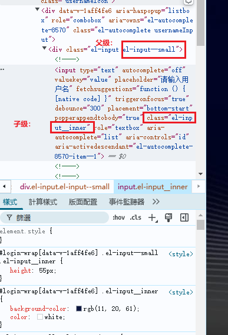

# element-ui


### ElementUl

一个基于vue的UI框架

ElementUl： https://element.eleme.cn/#/zh-CN

#### 安装

配合官方文档进行操作


组件示例

- 1.按钮
- 2.表单
- 3.表格

效果：


例子：


### 按钮组件

#### 一般按钮


#### 按钮组


mark1 p4 2:17


### Link 文字链接组件


### Layout布局组件

每一个el-row占24份(`1*2*3*4`)，方便后面操作

#### el-row属性


效果：


#### el-col属性


设置：


效果：


### 3 Container布局容器


设置：


效果：


### radio单选按钮组件的使用


### 分页组件的使用


### 日期组件


### Table表格 el-table 表格属性

参考视频：https://www.bilibili.com/video/BV1NK4y187XH?p=19&spm_id_from=pageDriver&vd_source=d6367c1fc21883823f1fb738f86ef26e


#### 基本使用，展示表格数据

##### prop

~~~vue
<template>
	<div>
		<el-button @click="save()">保存</el-button>
		<!-- 设备故障表格 -->
		    <el-table :data="afterServiceObjList" border height="800" style="width: 100%" @selection-change="handleSelectionChange" :header-cell-style="{ background: 'rgb(244, 249, 255)'}">
			  
<!-- 			  1:使用prop展示数据 -->

			  <el-table-column label="售后服务站" prop="serviceStation" width="120"></el-table-column>

		    </el-table>
	</div>
</template>
~~~


##### 自定义插槽

~~~vue
<template>
	<div>
		<el-button @click="save()">保存</el-button>
		<!-- 设备故障表格 -->
		    <el-table :data="afterServiceObjList" border height="800" style="width: 100%" @selection-change="handleSelectionChange" :header-cell-style="{ background: 'rgb(244, 249, 255)'}">
			  
<!-- 			 2: 通过自定义插槽来显示:使用slot-scope展示数据，可写js-->
			  <el-table-column label="处理人员">
				  <template slot-scope="scope">
				  	<div>
						{{ joinHandlerName(scope.row) }}
					</div>
				  	
				  </template>
			  </el-table-column>

		    </el-table>
	</div>
</template>
~~~


#### 遍历每一个单元格，设置特别的样式

~~~vue
			<!-- 设备故障表格 -->
		    <el-table :data="afterServiceObjList" border height="800" style="width: 100%" 
			@selection-change="handleSelectionChange" :header-cell-style="{ background: 'rgb(244, 249, 255)'}" :cell-style="cellStyle">
			  <el-table-column type="selection" width="55"></el-table-column>
			  <el-table-column label="序号" prop="number" width="48"></el-table-column>
		      <el-table-column label="设备处所" prop="equipmentLocation" width="160"></el-table-column>
		    </el-table>
~~~


~~~js
			// 遍历每一个单元格，设置特别的样式
			cellStyle(row, column, rowIndex, columnIndex){
				// console.log(`row = ${JSON.stringify(row,null,4)}`);
				// console.log(`column = ${JSON.stringify(column,null,4)}`);
				// if(row.column.label === "物料名称" || row.column.label === "数量"){
				// 	// console.log(`row.column.label = ${row.column.label}`);
				// 	return "margin:0";
				// }
				return "text-align: center";
			},
~~~


#### 合并单元格


设置：

1


​	2


效果：

合并前：


合并后：


##### 例子：

使用前：


设置：

~~~js
// 1
mergeCell({ row, column, rowIndex, columnIndex }){
				let totalRowCount = this.dayStates.length;
				// 合并1-3列的偶数行（从0开始数）
				let mergeRowIndex = 0;
				while(mergeRowIndex < totalRowCount){
					// 合并序号到年月的单元格
					for(let i = 0;i < 4;i++){
						if(rowIndex == mergeRowIndex && columnIndex == i){
							return {
									rowspan: 2,
									colspan: 1
								}
                            // 注意：这里不能使用++mergeRowIndex
						}else if(rowIndex == mergeRowIndex + 1 && columnIndex == i){
							// 隐藏被挤去右边的单元格，基于合并前最开始的坐标
							return {
									rowspan: 0,
									colspan: 0
								}
						}
					}
					mergeRowIndex += 2;
				}
}
// 2 
mergeCell({ row, column, rowIndex, columnIndex }){
				for(let i = 0;i < totalRowCount;i+=2){
					if (columnIndex >= 0 && columnIndex<= 3) {
						if (rowIndex === i) {
						  return [2, 1];
						} else if (rowIndex === i+1) {
						  return [0, 0];
						}
					}
				}
}
~~~

**注意：**

为什么不能使用++mergeRowIndex替换mergeRowIndex + 1？

~~~js
				let i = 0;
				console.log(`i = ${i}`)
				console.log(`++i = ${++i}`);
				console.log(`i++ = ${i++}`);
				console.log(`i + 1 = ${i + 1}`);
// 测试结果没问题，和Java的一样
~~~

因为++mergeRowIndex会改变mergeRowIndex的值，而mergeRowIndex + 1只会使用+1后的值。不会对mergeRowIndex本身进行改变！


使用后：


#### cell-style 设置每个单元格的样式


设置：


#### 4 固定表头 height

固定表头：


##### 设置高度


设置：


效果：


#### stripe 是否显示斑马线


设置：


效果：


#### size 表的大小


设置：


效果：


#### fit 设置列的宽度是否自撑开


设置：


效果：


#### show-header 是否显示表头


设置：


效果：


#### highlight-current-row 是否要高亮显示鼠标选择行


设置：


效果：


#### current-row-key 


设置：


效果：

#### row-class-name 设置每一行的样式


设置：

1


2


3 

注意：stripe斑马线的样式会高于这个设置的样式

效果：


`<style scoped>`科普：

在 Vue.js 的早期版本中（2.x 版本及更早），`<style scoped>` 是一个用于指定样式作用范围的属性。当你在 `<style>` 标签中使用 `scoped` 属性时，表示这些样式只会应用于当前组件中的元素，而不会影响到其他组件中的元素。这样可以避免样式冲突，确保组件的样式是模块化和局部的。

具体工作原理：
当使用 `scoped` 属性时，Vue 会为当前组件的每个 DOM 元素生成一个唯一的属性（类似 `data-v-xxxxxx`），并将这个属性添加到组件的所有 HTML 元素上。同时，Vue 还会将这个属性添加到 CSS 选择器中，以确保这些样式仅适用于带有该属性的元素，从而实现样式的作用范围限定在当前组件内。

示例：
```vue
<template>
  <div class="my-component">
    <p>This is a paragraph in MyComponent.</p>
  </div>
</template>

<style scoped>
.my-component {
  color: blue;
}

p {
  font-size: 14px;
}
</style>
```

在上面的例子中，`scoped` 属性确保 `.my-component` 的样式和 `<p>` 元素的样式只会作用于 `MyComponent` 组件内的元素，不会影响其他组件中的元素，即使其他组件中也有相同的类名或标签选择器。

注意：
- `scoped` 属性只在 Vue 2 中有明确的支持。
- 在 Vue 3 中，Vue 官方推荐使用基于 CSS Modules 或 `<style module>` 的方式来管理局部样式。
- 如果你使用 `scoped` 样式，但需要全局样式（例如，全局样式表或第三方库），你需要将这些样式放在不带 `scoped` 属性的 `<style>` 标签中，或者将这些样式放在全局 CSS 文件中。

总结：
`scoped` 属性的主要作用是将样式的作用范围限定在当前组件内，避免样式冲突，是一种实现样式隔离的技术。


#### empty-text 设置没有数据时的提示信息


设置：


效果：


#### 设置多选框


设置：


效果：


获取选择的多选框的数据:selection-change

~~~vue

<!-- 设备故障表格 -->
<el-table :data="afterServiceObjList" border height="800" style="width: 100%" @selection-change="handleSelectionChange">

</el-table>
methods: {

			handleSelectionChange(clickedAfterServiceObjList){
				console.log(`clickedAfterServiceObjList = ${JSON.stringify(clickedAfterServiceObjList,null,4)}`);
				 // this.multipleSelection = val;
			},
		}
~~~


### 实际使用

~~~vue
<!-- 设备故障表格 -->
<el-table :data="afterServiceObjList" border height="800" style="width: 100%" 
          @selection-change="handleSelectionChange" :header-cell-style="{ background: 'rgb(244, 249, 255)'}" :cell-style="cellStyle">
    <el-table-column type="selection" width="55"></el-table-column>
    <el-table-column label="序号" prop="number" width="48"></el-table-column>
    <el-table-column label="设备处所" prop="equipmentLocation" width="160"></el-table-column>
    <el-table-column label="故障报修时间" prop="faultReportTimeDesc" width="140"></el-table-column>
    <el-table-column label="报修人/联系方式" prop="reporterAndContact" width="200"></el-table-column>
    <el-table-column label="数据来源" prop="dataSource" width="175"></el-table-column>
    <el-table-column label="产品分类" prop="productCategory" width="140"></el-table-column>
    <el-table-column label="维修类别" prop="maintenanceCategory" width="140"></el-table-column>
    <el-table-column label="是否及时响应" prop="isTimelyResponse"></el-table-column>
    <el-table-column label="故障描述" prop="faultDescription" width="180"></el-table-column>

    <el-table-column label="故障原因及处理方法" width="180">
        <template slot-scope="scope">
<!-- 弹出框 -->
<el-popover placement="top-start" width="200" trigger="hover" :content="scope.row.faultReasonSolution">
    <span class="overflowOmit" slot="reference">{{ scope.row.faultReasonSolution }}</span>
            </el-popover>

        </template>
    </el-table-column>

    <el-table-column label="是否修复" prop="isRepaired"></el-table-column>
    <el-table-column label="未修复或未及时响应原因" prop="unrepairedOrTimelyResponseReason" width="180"></el-table-column>

    <el-table-column label="故障修复时间" prop="faultRepairTimeDesc" width="140"></el-table-column>
    <el-table-column label="是否更换物料">

        <template slot-scope="scope">
<span>{{ scope.row.isMaterialReplaced === 1 ? '是' : '否' }}</span>
        </template>

    </el-table-column>

    <el-table-column label="物料名称" width="150">
        <template slot-scope="scope">
<div v-for="(material, index) in scope.row.materials" :key="index" :style="getBorderStyle(index, scope.row.materials.length,'物料名称')" :title="material.materialName">
    {{ material.materialName }}
            </div>
        </template>
    </el-table-column>

    <el-table-column label="数量">
        <template slot-scope="scope">
<div v-for="(material, index) in scope.row.materials" :key="index" :style="getBorderStyle(index, scope.row.materials.length,'数量')">
    {{ material.materialQuantity }}
            </div>
        </template>
    </el-table-column>

    <el-table-column label="售后服务站" prop="serviceStation" width="120"></el-table-column>
    <el-table-column label="处理人员">
        <template slot-scope="scope">
<p v-for="(handlerVO,index) of scope.row.handlerVOList" :key="index">
    {{ handlerVO.name }}
            </p>
        </template>
    </el-table-column>

    <el-table-column label="审核">
        <template slot-scope="scope">
<div v-if="scope.row.approvalStatus == '通过'" class="approvalPass approvalCommon">通过</div>
<div v-if="scope.row.approvalStatus == '审核中'" class="inReview approvalCommon">审核中</div>
<div v-if="scope.row.approvalStatus == '驳回'" class="approvalReject approvalCommon">驳回</div>
<div v-if="scope.row.approvalStatus == '撤回'" class="withdraw approvalCommon">撤回</div>
        </template>
    </el-table-column>

    <el-table-column label="操作" fixed="right" width="200">
        <template slot-scope="scope">
<div class="oneRow">
    <div style="color:rgb(41, 44, 197);cursor: pointer;margin-right:5px;">编辑</div>
    <div style="color:rgb(217, 0, 64);cursor: pointer;margin-right:5px;">删除</div>
    <div style="color:rgb(41, 44, 197);cursor: pointer;margin-right:5px;">审核</div>
    <div style="color:rgb(41, 44, 197);cursor: pointer;margin-right:5px;">预览</div>
    <div style="color:rgb(41, 44, 197);cursor: pointer;margin-right:5px;">下载</div>
            </div>

        </template>
    </el-table-column>
</el-table>
~~~


### 组件事件使用


设置


### 组件方法使用

如，使用：


设置：

1

给组件起别名ref


2


### 表格定义操作列

设置：


效果：


### 自定义表头

设置


效果：


#### 竖直方向的边框 border


#### 设置表头的颜色 header-cell-style


#### el-table-column属性

##### 原始代码：


路由：


app.vue首页：


效果：


##### 5 width属性: 设置列的宽度


默认的width是平均分配的，设置width = 200px;


效果：


##### fixed属性 自适应


设置为right：


效果：


设置为left:


效果：

整体偏左了一些


##### align属性 设置内容的对齐方式

设置内容的对齐方式，标题也会变为居中对齐


设置居中对齐


效果：


##### header-align属性 设置表头的对齐方式


设置：


效果：


##### sortable属性 排序


设置：


效果：


###### sort-method属性 自定义排序


设置：

1


2


效果：


##### resizable属性 单元格是否可以拖动


设置：


效果：


##### formatter属性 在数据渲染之前进行拦截并进行处理


设置：

1


2


3


效果：


##### 与template标签配合

设置：


效果：


##### type="index" 自定义序号列

设置：


函数：


## 实际使用

### 一、选择日期时间范围组件


### 二、上传图片

如：

~~~vue
<el-form-item label="文件上传" required>
    <el-upload class="upload-demo" 
               ref="upload" 
               :headers="uploadHeaders" 
               :action="fileInterface()"
               :data="uploadData"
               :on-preview="handlePreview" 
               :on-remove="handleRemove" 
               :on-success="handleUploadSuccess"
               :before-upload="beforeUpload"
               :file-list="showFileList"
               list-type="picture"
               accept="image/*,application/pdf"
               >

        <el-button size="small" type="primary" slot="trigger">点击上传</el-button>
        <div slot="tip" class="el-upload__tip">只能上传图片或pdf文件</div>
    </el-upload>

</el-form-item>

<script>
	export default {
	    data: function () {
	        return {
				showFileList: [
					{
						name: 'food.jpeg', 
						url: 'https://fuss10.elemecdn.com/3/63/4e7f3a15429bfda99bce42a18cdd1jpeg.jpeg?imageMogr2/thumbnail/360x360/format/webp/quality/100'
					},
					{
						name: 'food2.jpeg',
						url: 'https://fuss10.elemecdn.com/3/63/4e7f3a15429bfda99bce42a18cdd1jpeg.jpeg?imageMogr2/thumbnail/360x360/format/webp/quality/100'
					 },
				],
				host : '',
				uploadHeaders : {
					'Authorization' : "Bearer " + uni.getStorageSync("auth").token,
				},
				uploadData : {
					docType: "售后统计图片",
					upLoaderId: uni.getStorageSync("auth").user.id,
					access: '',
					thumbnailStrategy: 'allPages',
					docName : '',
				},
	        }
	    },
</script>
~~~


~~~
使用“<el-upload class="upload-demo" 
					            ref="upload" 
					            :headers="uploadHeaders" 
					            :action="fileInterface()"
								:data="uploadData"
					            :on-preview="handlePreview" 
					            :on-remove="handleRemove" 
					            :on-success="handleUploadSuccess"
								:before-upload="beforeUpload"
					            :file-list="showFileList"
								list-type="picture"
								accept="image/*,application/pdf"
								>

					  <el-button size="small" type="primary" slot="trigger">点击上传</el-button>
					  <div slot="tip" class="el-upload__tip">只能上传图片或pdf文件</div>
				     </el-upload>”进行文件的上传，为什么上传后的代码“”可以显示出图片来


这是因为 `el-upload` 组件的上传功能支持将文件临时存储为 `Blob` 对象。在上传过程中，文件被转化为一个浏览器内部的 `Blob URL`（如你看到的 `blob:http://localhost:8080/...`），这个 `Blob URL` 可以被用作 `` 标签的 `src` 属性来显示图片。

具体来说：

1. **上传前：** 当用户选择文件时，`<el-upload>` 会将文件传递给浏览器。
2. **上传过程中：** `el-upload` 组件会生成一个临时的 `Blob URL`（如 `blob:http://localhost:8080/...`）作为文件的引用。浏览器可以通过这个 `Blob URL` 来临时访问文件。
3. **文件展示：** 在文件上传成功后，`el-upload` 会自动将这个 `Blob URL` 赋给 `` 标签的 `src` 属性，因此浏览器能够在页面上显示该图片。

这实际上是浏览器的机制，`Blob URL` 使得文件在本地被引用，而无需等待文件上传到服务器并获得实际的 URL。它只是在上传过程中展示文件内容，方便用户查看文件。

如果你需要文件上传后显示的真实 URL，可以在文件上传成功的回调中，通过接口将文件上传到服务器，并获取返回的实际 URL，然后将其赋值给 `` 标签。
~~~


### 三、自动补全输入框


~~~vue
<el-form-item prop="username" style="width:100%">
    <el-autocomplete
                     style="width:100%"
                     v-model="ruleForm.username"
                     :fetch-suggestions="queryHistoryUserAccounts"
                     placeholder="请输入用户名"
                     @select="handleSelectUser">
        <el-button slot="prepend" icon="el-icon-user" tabindex="-1"></el-button>
        <template slot-scope="{ item  }">
<span style="font-style:italic;">{{item.name}}</span>
<span style="float:right;font-weight:bold;">{{item.dispName}}</span>
        </template>

    </el-autocomplete>
</el-form-item>


~~~


这个代码展示了一个使用 `Element UI` 的 `el-autocomplete` 组件来实现用户输入自动补全的功能。它的作用是根据用户输入的内容，查询历史登录过的用户，并提供匹配的用户账号供选择。

**具体解析如下：**

### `el-autocomplete` 组件：

```html
<el-autocomplete
    style="width:100%"
    v-model="ruleForm.username"
    :fetch-suggestions="queryHistoryUserAccounts"
    placeholder="请输入用户名"
    @select="handleSelectUser">
```

- `v-model="ruleForm.username"`：这个绑定了 `ruleForm.username`，意味着当用户选择了某个用户名时，`ruleForm.username` 会自动更新为所选用户名。
- `:fetch-suggestions="queryHistoryUserAccounts"`：当用户在输入框中输入内容时，`queryHistoryUserAccounts` 方法会被调用来根据输入内容提供候选的用户名。
- `placeholder="请输入用户名"`：在输入框中显示提示文字。
- `@select="handleSelectUser"`：当用户选择某个用户名时，会触发 `handleSelectUser` 方法，并传递所选的用户项 `item`。

### `el-button` 组件：

```html
<el-button slot="prepend" icon="el-icon-user" tabindex="-1"></el-button>
```

- 这个按钮会显示在 `el-autocomplete` 输入框的左侧（因为使用了 `slot="prepend"`），并且显示一个用户图标 `el-icon-user`。点击该按钮的行为没有在代码中定义，但通常它可以用来触发一些与用户选择或输入相关的操作。

### `queryHistoryUserAccounts` 方法：

```javascript
queryHistoryUserAccounts(queryString, cb) {
    let users = this.histUserAccounts;
    let results = queryString ? 
        users.filter((user) => {
            return (user.name.indexOf(queryString) >= 0); // 筛选出用户名匹配的用户
        }) 
        : users; // 如果没有输入，则返回所有用户
    cb(results); // 调用回调函数，将筛选结果传递给自动补全组件
}
```

- `queryHistoryUserAccounts` 方法接受两个参数：`queryString`（用户输入的搜索字符串）和 `cb`（回调函数，用来返回筛选出的用户列表）。
- 根据 `queryString` 是否为空，筛选出历史用户（`this.histUserAccounts`），如果有输入内容，则只返回名字包含输入字符串的用户。
- 然后调用 `cb(results)` 来返回建议列表。

### `handleSelectUser` 方法：

```javascript
handleSelectUser(item) {
    console.log(item); // 输出所选的用户项
    this.ruleForm.username = item.name; // 更新输入框的值为所选用户名
    if (item.password) { // 如果所选用户有密码，填充密码
        this.ruleForm.password = item.password;
        this.passwordRemember = true; // 标记为记住密码
    } else {
        this.ruleForm.password = ''; // 如果没有密码，则清空密码
        this.passwordRemember = false; // 不记住密码
    }
}
```

- 当用户选择某个用户后，`handleSelectUser` 方法会被触发，`item` 参数是选中的用户对象。
- 方法会把选中的用户名 `item.name` 设置为 `ruleForm.username`。
- 如果用户对象包含密码（`item.password`），则把密码填充到 `ruleForm.password` 中，并标记为记住密码。
- 如果没有密码，则清空 `ruleForm.password`，并取消记住密码。

### `template slot-scope` 部分：

```html
<template slot-scope="{ item }">
    <span style="font-style:italic;">{{item.name}}</span>
    <span style="float:right;font-weight:bold;">{{item.dispName}}</span>
</template>
```

- 这是 `el-autocomplete` 的自定义选项模板。它自定义了每个候选项显示的内容。
- `slot-scope="{ item }"` 用来获取每个建议项的 `item` 对象。
- 显示 `item.name` 的部分用斜体显示，`item.dispName` 则用加粗显示，并且浮动在右侧。

### 总结：

该代码片段实现了一个基于 `el-autocomplete` 的自动补全功能，它可以查询历史用户数据并根据用户输入提供匹配的用户名供选择。当选择某个用户时，自动填写用户名和密码。


### 其他


#### CSS 覆盖 Element ui的

~~~
我使用的是Element ui，这种方式可以覆盖它的源代码对吗，详细的说说这种css语法以及是否有其他修改覆盖源代码的方式
~~~


你的理解没错，这种方式并不是直接修改 Element UI 的源代码，而是通过后加载的 CSS 规则覆盖库自带的样式。详细说明如下：

1. **CSS 覆盖原理**

   - **级联与优先级**：CSS 样式是层叠的，后加载的规则或者优先级更高的规则会覆盖前面的样式。

   - 选择器

     ：

     ```css
     .ant-modal div[aria-hidden="true"] {
         display: none !important;
     }
     ```

     这里使用的是

     后代选择器

     和

     属性选择器

     。它匹配所有在 

     ```
     .ant-modal
     ```

      内部，带有 

     ```
     aria-hidden="true"
     ```

      属性的 

     ```
     <div>
     ```

      元素。

   - **!important 的作用**：
      加上 `!important` 能够确保这一规则的优先级足够高，从而覆盖 Element UI 默认样式中可能对 `display` 属性的设置。

2. **覆盖 Element UI 源代码样式**

   - **全局 CSS**：
      如果你把这段 CSS 放在全局样式中，并且加载顺序在 Element UI 的样式之后，那么它就能覆盖 Element UI 的默认样式。
   - **Scoped CSS 的注意点**：
      如果你在 Vue 单文件组件中使用了 scoped 样式，可能需要用深度选择器（例如 `::v-deep` 或 `/deep/`）来确保样式能影响到 Element UI 生成的 DOM 元素，因为 scoped 样式默认只作用于当前组件模板内的元素。

3. **其他覆盖方式**
    除了写全局 CSS 外，还有以下几种常用的覆盖方式：

   - **内联样式**：直接在元素上添加 `style` 属性，这种方式优先级最高，但通常不建议大量使用。
   - **自定义主题或变量覆盖**：
      有些 UI 库（包括 Element UI）支持通过修改 SCSS 或 LESS 变量来自定义主题。你可以在构建时修改这些变量，从而改变组件的默认样式，而无需写覆盖 CSS。
   - **组件包装**：
      在某些情况下，你可以对 Element UI 组件进行二次封装，在包装组件中修改或传递样式，这样可以局部覆盖默认样式。
   - **使用 CSS-in-JS 解决方案**：
      比如使用 styled-components 或其他 CSS-in-JS 库，动态生成覆盖样式，但这种方式一般用于 React，Vue 中可以借助类似方案，不过实现成本较高。

总结来说，使用全局 CSS 规则（如你提供的那段代码）是一种简单且直接的方法来覆盖第三方库的默认样式，它不会修改源代码，而是利用 CSS 的级联和选择器优先级来达到覆盖效果。同时，根据项目需要也可以选择其他方式来定制和覆盖样式。


### 四、 >>> 深度选择器修改Element UI编译后的代码


如：



~~~
浏览器中出现的 .el-input--small .el-input__inner {
    height: 55px;
} 是什么意思，为什么有两个选择器


~~~


这段代码是一个 CSS 样式，它设置了 `el-input--small` 类和 `el-input__inner` 类的组合选择器，具体含义如下：

### 选择器解释：

```css
.el-input--small .el-input__inner {
    height: 55px;
}
```

- `.el-input--small`：这是一个类选择器，表示所有拥有 `el-input--small` 类的元素。通常 `el-input--small` 类是用于 `Element UI` 组件库中的 `el-input` 组件，用来改变输入框的大小，让它变得更小。
- `.el-input__inner`：这是另一个类选择器，它表示 `el-input` 组件内部的实际输入框部分，通常是一个 `div` 或 `input` 元素，用来显示用户输入的文本。

### 为什么有两个选择器？

在这条 CSS 中，两个选择器连在一起（`.el-input--small .el-input__inner`），表示你希望样式应用到符合以下条件的元素：

1. 元素的父级是 `.el-input--small` 类的元素；
2. 该元素内部有一个 `.el-input__inner` 类的元素。

换句话说，这个样式只会应用到在 `el-input` 组件（并且它带有 `.el-input--small` 类的情况下）内部的 `.el-input__inner` 元素。

### 样式作用：

```css
height: 55px;
```

这部分样式设置了 `.el-input__inner` 元素的高度为 `55px`。所以，当 `el-input` 组件有 `.el-input--small` 类时，它的输入框内部的实际输入区域（`el-input__inner`）的高度会被设置为 55 像素。

### 总结：

这段代码的目的是在 `Element UI` 的小型输入框（`el-input--small`）中，设置内部实际输入区域的高度为 55 像素。由于 `.el-input__inner` 是输入框的核心区域，而 `.el-input--small` 是控制大小的类，两个选择器结合起来，是为了确保仅在小型输入框中应用该样式。


使用：

~~~css
#login-wrap >>> .el-input--small .el-input__inner {
    height: 55px;

}

#login-wrap >>> .el-input__inner {
    background-color: rgb(11, 20, 61); 
    color: white; 
	font-size: 18px;
}
~~~

