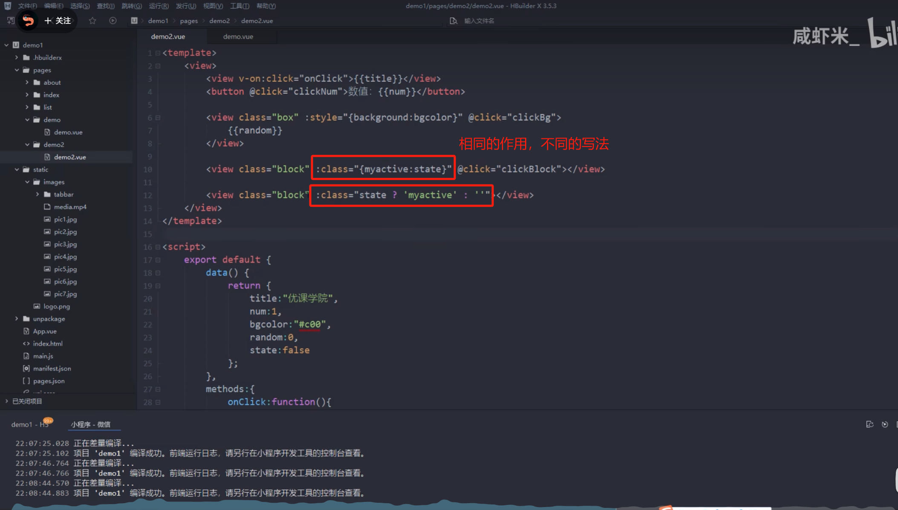
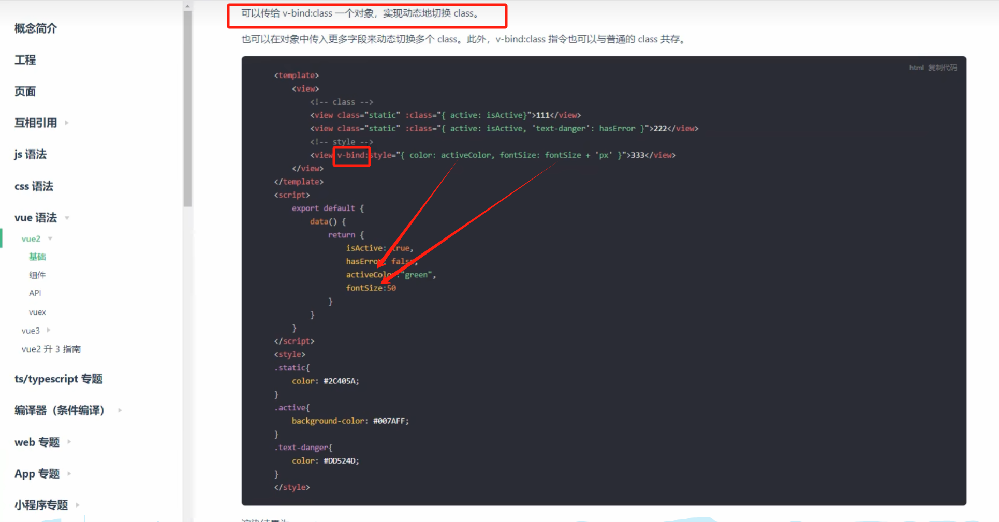

# Vue2.0

## 入门案例

### 环境配置：

vscode插件：https://blog.csdn.net/weixin_38203203/article/details/93124390

使用cnpm替换npm：https://juejin.cn/post/6983231659378212877   

npm对应cnpm版本:https://wenku.csdn.net/answer/1eax3i4qdw

得出命令：

~~~bash
npm install -g cnpm@5.1 --registry=http://registry.npm.taobao.org
~~~


安装node：略

使用nvm管理node版本：https://blog.csdn.net/m0_62173728/article/details/131992891  ，https://blog.csdn.net/ThisEqualThis/article/details/125893548

**Vue语法检编译查规则配置**：

注意：

- Mixed spaces and tabs no-mixed-spaces-and-tabs解决方法：https://blog.csdn.net/weixin_45771601/article/details/123518944
- 组件名"School"应该使用多个单词拼接横线组成: https://blog.csdn.net/Vest_er/article/details/126456572  并且package.json中不能有注释!


### Vue的绑定功能

**重点：**

- 绑定文本：{{  }}
- 绑定属性：v-bind  简写为:
- 绑定事件: v-on 简写为@

new Vue创建一个Vue实例

注意：


#### 快速入门

基础：

- 函数中使用js data中定义的变量时需要使用this进行指示，默认没有使用this时只会在本函数找变量，找不到就是undefined报错，不会去data中找
- 在html标签中就不需要使用this进行指示，会自动去data中找


其实所有的组件其实都是Vue实例

~~~html
<!DOCTYPE html>
<html lang="en">
<head>
    <meta charset="UTF-8">
    <meta name="viewport" content="width=device-width, initial-scale=1.0">
    <title>Document</title>
</head>
<body>
    
    <!-- <h1>hello world</h1> -->
    <div id="app">
         <!-- 绑定文本：{{  }} 意思是表达式 -->
        <h1>{{ message + "!" }}</h1>
        <!-- 绑定属性：v-bind:src 简写为:src，表示使用url这个key绑定了img标签的src属性，使用时去Vue实例data中获取真正的值value -->
        
        <!-- 绑定事件: v-on:click="sayHi" 简写为@click 表示绑定一个点击事件，点击后调用Vue实例methods中的sayHi（）函数 -->
        <button @click="sayHi">测试</button>
        <button @click="changeImage">更换图片</button>
    </div>

    <script src="https://cdn.jsdelivr.net/npm/vue/dist/vue.js"></script>

    <script>
        // 创建Vue实例，传输一个自定义对象进去(el,data,methods是固定的)
        new Vue({
            // 选项
            // 相当于选择器：选择了id=app的element
            el:"#app",
            // 一个数据map集合，来这里根据key获取value数据
            data:{
                message: "hello world",
                url:"img/1.jpg"
            },
            methods:{
                sayHi(){
                    alert("Hi!")
                },
                changeImage(){
                    // this获取当前的Vue实例，获取数据都是访问data选项里面的数据
                    this.url = "img/2.jpg";
                }
            }
        })
    </script>
</body>
</html>
~~~


#### 计数器例子：

~~~html
<!DOCTYPE html>
<html lang="en">
<head>
    <meta charset="UTF-8">
    <meta name="viewport" content="width=device-width, initial-scale=1.0">
    <title>Document</title>
</head>
<body>
    <div id="app">
        <button @click="sub">-</button>
        <span>{{ number }}</span>
        <button @click="add">+</button>
    </div>
    <script src="https://cdn.jsdelivr.net/npm/vue/dist/vue.js"></script>
    <script>
        new Vue({
        el:"#app",
        data:{
            number:0
        },
        methods:{
            add(){
                this.number++;
            },
            sub(){
                if(this.number > 0){
                    this.number--;
                }
            }
        }
    })
    </script>

</body>
</html>
~~~


#### 事件修饰符：


##### .stop 阻止事件冒泡:


##### .prevent 阻止事件的默认行为


##### .self 只触发自己标签上的事件

> 只关心自己标签上触发的事件，不监听事件冒泡传过来的事件
>
> 与.stop作用类似


##### .once 设置事件只触发一次


#### 按键修饰符：

https://cn.vuejs.org/guide/essentials/event-handling.html#key-modifiers

##### 按键别名

Vue 为一些常用的按键提供了别名：

- `.enter`
- `.tab`
- `.delete` (捕获“Delete”和“Backspace”两个按键)
- `.esc`
- `.space`
- `.up`
- `.down`
- `.left`
- `.right`


##### keyup.enter 点击回车后触发的事件


### 3级 Vue/cli创建Vue项目

#### 目录结构解析


命令：

~~~bash
cnpm install -g @vue/cli
vue create hello
npm run serve
~~~

##### 5级 **package.json:**


##### **App.vue:**

组件化开发：


**只能有一个一级标签**：


**使用export把App.vue暴露出去**给别人进行import:

在node环境运行的Vue项目中，**data选项比较特殊**（如图），其他选项与直接引入Vue.js相同：


例子：

计时器App.vue:

~~~vue
<template>
  <div id="app">
    <button @click="sub">-</button>
    <span>{{ number }}</span>
    <button @click="add">+</button>
  </div>
</template>

<script>

export default {
  // 注意：这里不需要 el:"#app"了，在main.js中已经做了
  data(){
    return {
      number:0
    }
  },
  methods:{
    add(){
      this.number++;
    },
    sub(){
      if(this.number > 0){
          this.number--;
      }
    }
  }
}
</script>

<style>

</style>

~~~


##### **main.js:**

入口文件


##### components

一般是存放自定义组件的地方

#### 自定义组件

##### 使用原生的事件


注意：


###### 组件命名：

一般采用大驼峰命名(大写字母开头)，防止与html自带的组件冲突（默认会优先使用html的组件，这样子的话就会出现自定义的同名组件没有使用的错误）

###### 注册组件的方式：

1）传统方式

~~~vue
<template>
  <div id="app">
	  <!-- 3.引入外部组件时，是不区分大小写的，并且每个单词可以使用-进行分割 -->
	<hello></hello>
    
  </div>
</template>

<script>
	// 1.导入hello组件
import hello from "./components/hello.vue"

export default {
	// 2.注册hello组件
	components:{
		// 组件名：组件值 ，相同时可简写为hello
		hello:hello
	}
}
</script>

<style>

</style>

~~~

注意：引入的组件一定要使用，不然会报错。

2）uniapp的easycom方式：


###### 引用外部组件


引用外部组件时，是不区分大小写的，并且每个单词可以使用-进行分割：

例如：


### Vue 中组件（Component）
组件作用：用来减少 Vue 实例对象中代码量，日后在使用 Vue 开发过程中，可以根据不同业务功能将页面中划分不同的多个组件，然后由多个组件去完成整个页面的布局，便于日后使用 Vue 进行开发时页面管理，方便开发人员维护。

#### 全局组件的开发
全局组件注册给 Vue 实例，可以在任意 Vue 实例的范围内使用该组件。

全局组件的开发：
~~~html

<!DOCTYPE html>
<html>
<head>
  <meta charset='utf-8'>
  <title>全局组件的开发</title>
</head>
<body>
  <div id="app">
    <!-- 使用全局组件 -->
    <login></login>
    <!-- 使用局部组件 -->
    <user-login></user-login>
  </div>
  <script src="https://cdn.jsdelivr.net/npm/vue/dist/vue.js"></script>
  <script>
    // 开发全局组件
    // 参数1: 组件名称
    // 参数2: 组件配置对象 template:用来书写组件的html代码(注意:在template中必须存在一个容器)
    Vue.component('login', {
      template : '<div><h1>用户登录</h1></div>'
    });
    // 驼峰命名法的组件会被特殊处理, userLogin 使用时必须写成 user-login
    Vue.component('userLogin', {
      template : '<div><input type="button" value="登录"></div>'
    });
    const app = new Vue({
      el: "#app",
      data: {},
      methods: {},
    });
  </script>
</body>
</html>
~~~


#### 局部组件的开发

通过将组件注册给对应 Vue 实例中一个 components 属性来完成组件注册，这种方式不会对 Vue 实例造成累加。

第一种开发方式：
~~~html

<!DOCTYPE html>
<html>

<head>
  <meta charset='utf-8'>
  <title>局部组件的开发</title>
</head>

<body>
  <div id="app">
    <login></login>
    <login></login>
    <login></login>
  </div>
  <script src="https://cdn.jsdelivr.net/npm/vue/dist/vue.js"></script>
  <script>
    // 定义变量用来保存模板配置对象
    const login = {
      template: '<div><h2>用户登录</h2></div>'
    };
    const app = new Vue({
      el: "#app",
      data: {},
      methods: {},
      components: { // 局部组件
        login: login // 注册局部组件
      }
    });
  </script>
</body>

</html>
~~~
32
第二种开发方式：

~~~html

<!DOCTYPE html>
<html lang="en" xmlns:v-on="http://www.w3.org/1999/xhtml">

<head>
  <meta charset="UTF-8">
  <title>局部组件的开发2</title>
</head>

<body>
  <div id="app">
    <login></login>
    <login></login>
    <login></login>
  </div>

  <!--声明局部组件模板  template标签 注意:在 Vue 实例作用范围外声明-->
  <template id="loginTemplate">
    <h2>用户登录</h2>
  </template>

  <script src="https://cdn.jsdelivr.net/npm/vue/dist/vue.js"></script>
  <script>
    // 定义变量用来保存模板配置对象
    const login = { // 具体局部组件名称
      template: '#loginTemplate' // 定义template标签选择器即可
    };
    const app = new Vue({
      el: "#app",
      data: {},
      methods: {},
      components: { // 局部组件
        login: login // 注册局部组件
      }
    });
  </script>
</body>

</html>
~~~


### Vue的指令

#### 注意：


指令(Directives)是带有`v-`前缀的特殊属性：


#### v-if等 条件判断：

- v-if   为true则显示，为false则不显示（可以配合v-else使用）
- 和一般的if语句一样的使用：
- v-show

两者的区别：


例子：

~~~vue
<template>
  <div id="app">
    <!-- 这里不需要写{{ }}} -->
    <p v-if="isLogin">欢迎你，小明</p>
    <!-- 父类隐藏时子类也会隐藏 -->
    <p v-if="!isLogin">
      <a href="">请登录</a>
    </p>
    
  </div>
</template>

<script>

export default {
  data(){
    return {
      isLogin:true
    }
  }
}
</script>

<style>

</style>

~~~

#### v-for循环显示列表：

- v-for

例子：

~~~vue
<template>
  <div id="app">
    <ul>
		<!-- 相当于for循环生成多个li标签，记得使用索引作为唯一标识来绑定key属性 -->
		<li v-for="(fruit,index) of fruits" :key="index">
			<p>水果序号:{{ index + 1 }}</p>
			<p>水果名称:{{ fruit }}</p>
		</li>
		
		<thead>
			<th>序号</th>
			<th>姓名</th>
			<th>年龄</th>
		</thead>
		<tbody>

			<tr v-for="(v,i) of students" :key="i">
				<td>{{ i + 1 }}</td>
				<td>{{ v.name }}</td>
				<td>{{ v.age }}</td>
			</tr>
		</tbody>
	</ul>
    
  </div>
</template>

<script>

export default {
  data(){
    return {
	  fruits:["苹果","香蕉","莉"],
	  students:[
		  {name:"小明",age:18},
		  {name:"小灰",age:18},
		  {name:"小王",age:18}
	  ]
    }
  }
}
</script>

<style>

</style>

~~~


与of同样的绑定索引：


#### v-html 


#### v-text


### 组件传值

根据组件之间的关系，有三种传值方式：

#### 父级向子级传递数据：绑定标签的自定义属性 + props实现

父级组件:

~~~vue
  <template>
    <div id="app">
  	 <!-- 2.把要传递的数据绑定给子组件hello的自定义属性msg -->
  	<hello :msg="message"></hello>
      
    </div>
  </template>
  
  <script>
  
  import hello from "./components/hello.vue"
  
  export default {
  	components:{
  		hello:hello
  	},
  	// 1.父级定义数据
  	data(){
  		return {
  			message:"app.vue 的值",
  			}
  	}
  }
  </script>
  
  <style>
  
  </style>
  
~~~
子级组件:

~~~vue
<template>
	<!-- 4. 使用属性中的数据-->
	<h1>{{ msg }}</h1>
</template>

<script>
	// 3.子级接收自定义的属性，里面含有数据
	export default{
		props:["msg"]
	}
</script>

<style>
</style>
~~~


##### 默认值设置

1）


2）


##### 单向数据流（子不要改变父传的值）

https://uniapp.dcloud.net.cn/tutorial/vue-components.html#%E5%8D%95%E5%90%91%E6%95%B0%E6%8D%AE%E6%B5%81

注意：


###### 一般解决方式：

使用子组件向父组件传值的方式，把子组件要改变的值通过自定义事件传给父组件，然后父组件根据这个值在父组件中的函数进行改变。


###### 一种简化的解决方式.sync：

1


2


原理：


相当于：


#### 子级向父级传递数据:$emit方法 + 使用自定义事件传值

- 子级按钮绑定了一个click点击事件 -> 
- 会调用自定义的sendData()函数 -> 
- sendData()函数中调用`this.$emit()`函数，指定触发哪一个父级的事件和传递的数据 -> 
- 触发父级的事件后调用自定义的xx函数(能够接收到子级传递的数据) -> 
- 使用子级传递过来的数据

例子：

父级组件：

~~~vue
<template>
  <div>
	<h1>{{ data }}</h1>
	<!-- 1.在父组件中给子组件hello绑定自定义事件，并使用changeData方法接收子组件的数据并使用 -->
	<hello @myevent="changeData"></hello>
    
  </div>
</template>

<script>

import hello from "./components/hello.vue"

export default {
	components:{
		hello
	},
	data(){
		return {
			data:"App.vue data"
			}
	},
	methods:{
		// 2.接收子组件的数据并使用
		changeData(data){
			console.log("App.vue: " + data);
			this.data = data;
		}
	}
}
</script>

<style>

</style>

~~~

子级组件：

~~~vue
<template>
	<!-- 3.设置子级向父级发送数据的入口 -->
	<button @click="sendData">发送数据给父级</button>
</template>

<script>
	export default{
		data(){
			return {
				childData:"data from hello.vue"
			}
		},
		methods:{
			sendData(){
				console.log("hello.vue: " + this.childData)
				// 4.调用$emit方法，实现子级向父级发送数据
				this.$emit("myevent",this.childData);
			}
			
		}
	}
</script>

<style>
</style>
~~~

#### 使用Query Stringurl传值

~~~js
					// 跳转到日报详细界面
					uni.navigateTo({
						url:"/pages/log/logAudit/logDetails?index="+index+"&logs="+logStr
					})
~~~


#### 非父子级(同级)传递数据

使用store.js文件(百货商店；储存)来管理，类似于一个全局变量的东西。

公共的数据叫状态：state

store.js

~~~javascript
export default{
	// 1 定义一个类似于全局变量的东西来存放公共的数据(store.js中的state选项)
	state:{
		message:"hello vue"
	},
	// 注意:这里的函数不需要包裹在methods:{}中
	setStateMessage(str){
		this.state.message = str;
	}
	
	
	
}
~~~

结构：同级的Brother.vue与Sister.vue

Brother.vue:

~~~vue
<template>
	<div>
		<h1>
			Brother.vue
		<button @click="changeData">改变共享数据</button>
		</h1>
		<!-- 4 使用数据，自定义的data.属性名 -->
		<p>{{ state.message }}</p>
	</div>
</template>

<script>
	// 2 导入store
	import store from '../store.js'
	
	export default{
		data(){
			return {
				// 3 使用之前在本文件声明一次  注意：这样子声明：message:store.store.message ，然后去使用message是不会实时变化的!要使用store.message才可以，像上面一样
				state:store.state
			}
		},
		methods:{
			changeData(){
				console.log("准备改变")
                 // 调用方法： 文件变量.方法名
				store.setStateMessage("change")
				console.log("准备完成")
				console.log("结果: " + this.state.message)
			}
		}
		
	}
</script>

<style>
</style>
~~~

Sister.vue

~~~vue
<template>
	<div>
		<h1>Sister.vue</h1>
		<p>{{ state.message }}</p>
	</div>
</template>

<script>
	// 2 导入store
	import store from '../store.js'
	
	export default{
		data(){
			return {
				// 3 使用之前在本文件声明一次
				state:store.state
			}
		}
		
	}
</script>

<style>
</style>
~~~


#### 例子：购物车

结构：App.vue 引用 Cart.vue， Cart.vue引用Counter.vue

App.vue :

~~~vue
<template>
  <span>

    <Cart></Cart>
  </span>
</template>

<script>
import Cart from "./components/Cart.vue"
// App.vue只作为一个容器
export default {
	components:{Cart}
}
</script>

<style>

</style>
~~~


Cart.vue：

~~~vue
<template>
	<div>
		<h1>购物车</h1>
		<ul>
			<li v-for="(v,i) of fruits" :key="i">
				{{ v.name }} 单价: {{ v.pirece }}
				<!-- 父级向子级传数据 -->
				<Counter 
				:count="v.count" 
				:index="i" 
				@add="add"
				@sub="sub">
				</Counter>
			</li>
		</ul>
		<h1>总价格: {{ 
			(fruits[0].pirece * fruits[0].count) + 
			(fruits[1].pirece * fruits[1].count) + 
			(fruits[2].pirece * fruits[2].count) 
			}}</h1>
	</div>
</template>

<script>
	import Counter from './Counter.vue'
	export default{
		components:{Counter},
		data(){
			return {
				fruits:[
					{name:"苹果",pirece:3.14,count:0},
					{name:"香蕉",pirece:2.14,count:0},
					{name:"梨",pirece:1.14,count:0}
				]
			}
		},
		methods:{
			add(index){
				this.fruits[index].count++;
			},
			sub(index){
				if(this.fruits[index].count > 0){
					this.fruits[index].count--;
				}
			}
		}
		
	}
</script>

<style>
</style>
~~~

Counter.vue:

~~~vue
<template>
	<span>
		<button @click="sub">-</button>
		<span>{{ count }}</span>
		<button @click="add">+</button>
	</span>
</template>

<script>
	export default{
		props:["count","index"],
		methods:{
			add(){
				this.$emit("add",this.index)
			},
			sub(){
				this.$emit("sub",this.index)
			}
			
			
		}
		
		
	}
</script>

<style>
</style>
~~~


将系统拆分成组件：

一方面降低了功能的耦合，但是一方面也提升了数据传输难度。

这里的利弊得失需要大家在项目中不断摸索。


### 计算属性与侦听器

#### computed:计算属性

- computed:计算属性
- watch:侦听器（监听器)

computed使用场景：


与data类似：


例子：拼接姓名

使用data:


使用computed:计算属性


作用：

在 Vue 中，计算属性（computed property）是基于数据状态动态计算并缓存的属性。与方法不同，计算属性的结果会被缓存，当依赖的数据发生变化时才会重新计算，因此更适合处理复杂的计算或频繁访问的值。

### 计算属性的特点
1. **缓存**：计算属性的结果会被缓存，只有在依赖的数据发生变化时才会重新计算。这可以减少不必要的计算，提高性能。
2. **响应式**：计算属性是响应式的，当依赖的数据改变时，计算属性的值也会更新。

### 示例解释
在这个例子中，我们通过计算属性 `computedTotalNum` 来计算 `allInvoiceArray` 数组中的总金额。

```javascript
computedTotalNum() {
    let total = this.allInvoiceArray.reduce((accumulator, currentItem) => {
        // 使用 BigNumber 进行精确的浮点运算
        return new BigNumber(accumulator).plus(new BigNumber(currentItem.totalMoney));
    }, new BigNumber(0));
    // 返回保留两位小数的字符串
    return total.toFixed(2);
}
```

#### 代码解析
1. **reduce 方法**：`reduce` 是 JavaScript 数组的方法，用于对数组中的每一项进行累加操作。在这个例子中，`accumulator` 是累加器，`currentItem` 是当前数组项，即每个发票的金额。
   
2. **BigNumber**：使用 `BigNumber` 是为了避免 JavaScript 中的浮点数运算精度问题，尤其在金额计算中更为重要。每个金额都转换为 `BigNumber` 类型，然后相加以获得精确结果。

3. **保留小数**：`toFixed(2)` 将总金额格式化为保留两位小数的字符串，以便在显示时符合货币格式的要求。

#### 优势
通过计算属性 `computedTotalNum`，我们可以直接在模板中使用 `{{ computedTotalNum }}` 来显示总金额值，而无需每次都重新计算；当 `allInvoiceArray` 中的数据发生变化时，`computedTotalNum` 会自动更新，实现响应式数据绑定。


#### watch:侦听器（监听器)

##### 侦听一个属性的变化：


##### 监听路由路径的变化


例子：

~~~js
		watch: {
		    '$route.path': function(newPath) {
		      if (newPath === '/pages/log/logAudit/logAudit') {
		        this.resetLogBottom();
		      }
		    }
		  },
		methods: {
			preventTouchMove(){},
			resetLogBottom() {
			      console.log("store.logBottom = " + this.store.logBottom);
				  // qtypeof store.setStoreLogBottom = function,typeof this.store.setStoreLogBottom = undefindes
				  console.log("typeof store.setStoreLogBottom = " + typeof store.setStoreLogBottom);
			      store.setStoreLogBottom(false);
			      console.log("重置LogBottom成功");
			    }
~~~

logAudit.js

~~~js
export default{
	store:{
			logBottom:false
		},
	setStoreLogBottom(value){
		console.log("参数：" + value);
		console.log("修改之前：this.store.logBottom = " + this.store.logBottom);
		this.store.logBottom = value;
		console.log("修改之后:this.store.logBottom = " + this.store.logBottom);
	}
}
~~~


#### 比较


### 生命周期钩子(函数)

作用：页面加载的时候，主动执行某些程序。


执行是有顺序的：


#### 各个生命周期函数解释


视频演示：https://www.bilibili.com/video/BV1SE411H7CY?p=11&vd_source=d6367c1fc21883823f1fb738f86ef26e  p12


~~~html
<!DOCTYPE html>
<html lang="en" xmlns:v-on="http://www.w3.org/1999/xhtml">

<head>
  <meta charset="UTF-8">
  <title>vue生命周期函数</title>
</head>

<body>
  <div id="app">
    <span id="sp"> {{ msg }} </span>
    <input type="button" value="改变data的值" @click="changeData">
  </div>
  <!-- 引入Vue  -->
  <script src="https://cdn.jsdelivr.net/npm/vue/dist/vue.js"></script>
  <script>
    const app = new Vue({
      el: "#app",
      data: {
        msg: "hello Vue.js!",
      },
      methods: {
        changeData() {
          // this.msg = "Vue.js niubility!";
          this.msg = Math.random();
        }
      },
      // ====================初始化阶段====================
      // 1.生命周期中第一个函数,该函数在执行时Vue实例仅仅完成了自身事件的绑定和生命周期函数的初始化工作,Vue实例中还没有 Data el methods相关属性
      beforeCreate() {
        console.log("beforeCreate: " + this.msg);
      },
      // 2.生命周期中第二个函数,该函数在执行时Vue实例已经初始化了data属性和methods中相关方法
      created() {
        console.log("created:" + this.msg);
      },
      // 3.生命周期中第三个函数,该函数在执行时Vue将El中指定作用范围作为模板编译
      beforeMount() {
        console.log("beforeMount: " + document.getElementById("sp").innerText);
      },
      // 4.生命周期中第四个函数,该函数在执行过程中,已经将数据渲染到界面中并且已经更新页面
      mounted() {
        console.log("Mounted: " + document.getElementById("sp").innerText);
      },
      // ====================运行阶段====================
      // 5.生命周期中第五个函数,该函数是data中数据发生变化时执行 这个事件执行时仅仅是Vue实例中data数据变化页面显示的依然是原始数据
      beforeUpdate() {
        console.log("beforeUpdate-vue: " + this.msg);
        console.log("beforeUpdate-dom: " + document.getElementById("sp").innerText);
      },
      // 6.生命周期中第六个函数,该函数执行时data中数据发生变化,页面中数据也发生了变化  页面中数据已经和data中数据一致
      updated() {
        console.log("updated-vue: " + this.msg);
        console.log("updated-dom: " + document.getElementById("sp").innerText);
      },
      // ====================销毁阶段====================
      // 7.生命周期第七个函数,该函数执行时,Vue中所有数据 methods componet 都没销毁
      beforeDestory() { },
      // 8.生命周期的第八个函数,该函数执行时,Vue实例彻底销毁
      destoryed() { }
    });
  </script>
</body>

</html>

~~~


#### 使用例子：网站加载


- 1.插槽 slot
- 2.DOM操作
- 3.过滤器

### 插槽 slot

#### 简单使用：


#### 具名插槽 v-slot


#### 应用


### DOM操作


### 过滤器(数据处理)


例子：


效果：


### 表单


#### 数据双向绑定


#### 使用vue来提交表单

数据定义：


#### from与文本框：


#### 密码框与下拉单选框：


#### 圆形单选框与方块多选框


结果：


### 数据交互


#### 例子：

后端程序：


前端程序：


效果:


### 路由


创建路由模板文件


#### 使用


##### 快速入门

案例：

~~~vue
<!DOCTYPE html>
<html lang="en">
<head>
    <meta charset="UTF-8">
    <title>路由的基本使用</title>
</head>
<body>
<div id="app">
    <!--4、在页面中显示路由的组件-->
    <router-view></router-view>
    <!--5、根据链接切换路由组件-->
    <a href="#/login">点我登录</a>
    <a href="#/register">点我注册</a>
</div>
</body>
</html>
<script src="https://cdn.jsdelivr.net/npm/vue/dist/vue.js"></script>
<script src="https://unpkg.com/vue-router@3.3.4/dist/vue-router.js"></script>
<script>

    // 1、创建组件对象
    const login = {
        template: "<h1>登录</h1>"
    };
    const register = {
        template: "<h1>注册</h1>"
    };

    // 2、创建路由对象
    const router = new VueRouter({
        routes: [ // 定义路由对象的规则
            // path:设置路由的路径, component:路径对应的组件
            {path: "/login", component: login},
            {path: "/register", component: register}
        ]
    });
    
    const app = new Vue({
        el: "#app",
        data: {},
        methods: {},
        router: router // 3、在vue实例中注册路由对象 注册后浏览器url最后会从 # 变为 
    });
</script>

~~~


##### 使用标签来切换路径

1）配置展示效果：


router-link：


效果：


2）配置路径与要展示组件的对应关系：


或者：


##### $router：


###### 切换路径


###### 获取当前路径


###### 传统方式获取参数 .query


###### restful方式传递参数 .params


##### 配置默认路由


##### 嵌套路由


~~~html
<!DOCTYPE html>
<html lang="en">

<head>
    <meta charset="UTF-8">
    <title>路由中传递参数</title>
</head>

<body>
<div id="app">
    <router-link to="/product">商品管理</router-link>
    <router-view></router-view>
</div>
<template id="product">
    <div>
        <h1>商品管理</h1>
        <router-link to="/product/add">商品添加</router-link>
        <router-link to="/product/edit">商品编辑</router-link>
        <router-view></router-view>
    </div>
</template>
</body>
</html>
<script src="https://cdn.jsdelivr.net/npm/vue/dist/vue.js"></script>
<script src="https://unpkg.com/vue-router@3.3.4/dist/vue-router.js"></script>
<script>
    // 声明最外层和内层组件对象
    const product = {
        template: '#product'
    };
    const add = {
        template: "<h4>商品添加</h4>"
    };
    const edit = {
        template: "<h4>商品编辑</h4>"
    };
    // 创建含有路由对象的路由对象(嵌套路由), 通过children嵌套
    const router = new VueRouter({
        routes: [
            {
                path: "/product",
                component: product,
                children: [
                    // 请求"/product/add路径后才可以访问add组件"
                    {path: "add", component: add},
                    {path: "edit", component: edit},
                ]
            },
        ]
    });

    const app = new Vue({
        el: "#app",
        data: {},
        methods: {},
        router // 注册路由
    });
</script>

~~~


https://www.bilibili.com/video/BV1SE411H7CY?p=10&vd_source=d6367c1fc21883823f1fb738f86ef26e

mark1 p


#### vue3写法:


#### 本地（浏览器）存储数据

#### 博客 + 登录例子：

效果：


##### 登录：


~~~vue
<script>
    // 登录后跳转首页
    this.$router.push("/")
</script>
~~~


##### 注销：


#### 导航守卫


没有写next()进行放行就会被拦截。


###### 登录权限控制：


###### 登录后才显示欢迎用户的文字，没有登录则不显示：


### ElementUl

一个基于vue的UI框架

ElementUl： https://element.eleme.cn/#/zh-CN


组件示例

- 1.按钮
- 2.表单
- 3.表格

效果：


例子：


### 配置文件


#### 使用配置文件中定义的数据


### 前端请求后端

#### 使用axios的$http命令

安装：

1


配置：

1


使用：


#### 基本使用


#### axios发送并发请求


# 语法糖


## Vue函数的两种写法


# Vue的使用例子

**会查看官方文档完成需求即可。**

## 1 三更springBoot课程的案例

### 1.1请求后台接口  把接受到的数据渲染展示在页面中 vue : el、data、methods、created()

~~~html
<div id="app">
    <table class="table table-striped table-bordered table-hover">
    <thead>
        <tr>
            <th>学号</th>
            <th>姓名</th>
            <th>年龄</th>
            <th>地址</th>
        </tr>
    </thead>
    <tbody>
        <!-- 遍历users数组-->
        <tr v-for="user in users">
            <td>{{user.id}}</td>
            <td>{{user.username}}</td>
            <td>{{user.age}}</td>
            <td>{{user.address}}</td>
        </tr>

    </tbody>
</table>
</div>

	<!-- 导入vue与axios-->
    <script src="https://cdn.jsdelivr.net/npm/vue@2/dist/vue.js"></script>
    <script src="https://unpkg.com/axios/dist/axios.min.js"></script>

   <script>
      var v = new Vue({
          <!-- 对id=app的标签进行控制-->
          el:"#app",
          <!-- 创建一个存放数据的数组-->
          data:{
              users:[]
          },
          <!-- id=app的标签创建时就会调用created()方法-->
          created(){
              this.findAll();
          },
          methods:{
              <!-- 定义方法-->
              findAll(){
                  //请求后台接口  把接受到的数据命名为res，渲染展示在页面中
                  axios.get("http://localhost/user/findAll").then((res)=>{
                      console.log(res);
                      //判断是否成功
                      if(res.data.code==200){
                          //如果成功，把数据赋值给this.users
                          this.users = res.data.data;
                      }

                  })
              }
          }
      });
   </script>
~~~

### 1.2 登录页面

~~~html
<form>
    <!-- 使用v-model把输入框的数据绑定给user.username -->
    <input id="exampleInputEmail1" v-model="user.username" type="email" placeholder="请输入用户名" class="form-control">
    <input id="exampleInputPassword1" v-model="user.password"  type="password" placeholder="请输入密码" class="form-control">
    <!-- 点击登录按钮时调用handleLogin()方法 -->
    <button type="submit" class="btn btn-block btn-primary" @click="handleLogin()">登录</button>
</form>

	<script src="https://cdn.jsdelivr.net/npm/vue@2/dist/vue.js"></script>
    <script src="https://unpkg.com/axios/dist/axios.min.js"></script>
   <script>
       var v = new Vue({
           el:"#app",
           data:{
               // 定义一个空的user对象
               user:{}
           },
           methods:{
               handleLogin(){
                   //请求后台登录接口  发起一个异步的post请求，把this.user对象写入请求体中
                   
                   axios.post("http://localhost/sys_user/login",this.user).then((res)=>{
                       // console.log(res);
                       //判断是否成功
                       if(res.data.code==200){
                           //登录成功
                           // alert("登录成功");
                           //存储token
                           localStorage.setItem("token",res.data.data.token);
                           //跳转页面到index.html
                           location.href = "/index.html";
                       }else{
                           //登录失败
                           alert(res.data.msg);
                       }

                   })
               }
           }
       });
   </script>
~~~


## 动态类Class绑定


## 例子

```
vue如何实现当isWhole是false时，就让<view class="invoiceCards">中的invoiceCards类的background-color属性改为rgb(252, 195, 31);
```


在 Vue 中，可以通过绑定 `class` 或使用 `:style` 动态绑定 `background-color` 样式来实现这一效果。假设你的 `isWhole` 是一个 Boolean 值，可以使用如下代码实现条件样式变化：

### 方案1: 动态绑定类


#### 动态绑定单个class:

动态绑定id也是相同做法。

~~~vue
<view :class="isShowInvoiceCategorize ? 'haveInvoiceNumberContent' : 'haveInvoiceNumberContent-categorize'">
</view>
~~~


#### 动态绑定多个class:

```html
<!-- :class指令也可以与普通的class共存 -->
<view class="test" :class="{'invoiceCards': true, 'highlight-background': !isWhole}">
  <!-- 其他内容 -->
</view>
```

```css
.invoiceCards {
  /* 默认样式 */
  background-color: initial;
}

.highlight-background {
  background-color: rgb(252, 195, 31);
}

.test{
    color: black;
}
```


#### 总结：




### 方案2: 动态绑定内联样式

```html
<view class="invoiceCards" :style="{ backgroundColor: !isWhole ? 'rgb(252, 195, 31)' : 'w' }">
  <!-- 其他内容 -->
</view>
```





实际使用：

~~~vue
<view class="oneColumn" :style="{ transform: invoiceFolderObj.over == false ? 'translate(-7vw, 0vh)' : getClickedFinishButtonStyle(invoiceFolderObj.totalMoney) }">
</view>
~~~


js:

~~~js
			// 根据发票金额计算移动端发票金额与已完结按钮布局所需要的大小
			getClickedFinishButtonStyle(totalMoney){
				if (!totalMoney) return `translate(0vw, 0vh)`; // 处理空值或未定义的情况
				let strLen = totalMoney.length;
				let baseNum = strLen < 8 ? (8 - strLen) * 2 : 0;
				return `translate(-${baseNum}vw, 0vh)`;
			},
~~~


## 一、 使用scoped 


为什么要使用scoped ，举一个例子说明


使用 `scoped` 样式的主要原因是 **局部化样式**，即保证样式只作用于当前组件，避免样式泄漏或影响到其他组件。这在开发大型应用时非常有用，特别是当组件化开发时，能够确保每个组件的样式不会互相干扰。

### 举个例子，说明 `scoped` 的作用：

假设我们有两个组件：`Header.vue` 和 `Footer.vue`，它们分别代表页面的头部和底部。在这两个组件中，我们都要使用 `.title` 类来设置标题的样式。假设没有 `scoped`，如果两者都使用 `.title`，它们的样式可能会互相干扰，导致不可预期的效果。

### 1. **没有 `scoped` 的情况**：

#### `Header.vue`：

```vue
<template>
  <div class="header">
    <h1 class="title">页面头部</h1>
  </div>
</template>

<script>
export default {
  name: 'Header',
};
</script>

<style>
.title {
  color: blue;
}
</style>
```

#### `Footer.vue`：

```vue
<template>
  <div class="footer">
    <h1 class="title">页面底部</h1>
  </div>
</template>

<script>
export default {
  name: 'Footer',
};
</script>

<style>
.title {
  color: red;
}
</style>
```

### 结果：

- 由于没有 `scoped`，`Header.vue` 中的 `.title` 和 `Footer.vue` 中的 `.title` 都是全局样式，它们会互相影响。
- 最终，你可能看到头部标题是红色的（`Footer.vue` 的样式覆盖了 `Header.vue` 的样式），而不是蓝色的，这显然不是你希望的效果。

### 2. **使用 `scoped` 的情况**：

现在我们给每个组件的样式加上 `scoped`，这样每个组件的样式就会局部作用于该组件，不会影响到其他组件。

#### `Header.vue`（使用了 `scoped`）：

```vue
<template>
  <div class="header">
    <h1 class="title">页面头部</h1>
  </div>
</template>

<script>
export default {
  name: 'Header',
};
</script>

<style scoped>
.title {
  color: blue;
}
</style>
```

#### `Footer.vue`（使用了 `scoped`）：

```vue
<template>
  <div class="footer">
    <h1 class="title">页面底部</h1>
  </div>
</template>

<script>
export default {
  name: 'Footer',
};
</script>

<style scoped>
.title {
  color: red;
}
</style>
```

### 结果：

- 使用了 `scoped` 后，`Header.vue` 和 `Footer.vue` 中的 `.title` 类不会互相影响。它们分别会显示为蓝色和红色，完全按照各自组件的样式来渲染。
- `scoped` 保证了样式仅作用于当前组件，避免了样式冲突。

### 为什么使用 `scoped`：

- **局部化样式**：确保样式只作用于当前组件，不会影响到其他组件，避免样式污染。
- **可维护性**：在开发复杂项目时，每个组件都可以独立管理自己的样式，减少样式间的冲突。
- **增强可读性**：使用 `scoped` 后，样式只影响当前组件的 HTML 结构，便于其他开发人员理解和修改。

### 总结：

使用 `scoped` 主要是为了 **局部化样式**，确保样式只作用于当前组件，避免不同组件之间的样式干扰。当你需要在 Vue 组件中封装样式，使得它们与其他组件的样式互不干扰时，`scoped` 是非常有用的。


## 二、 深度选择器 >>>

举个例子来帮助你更好地理解 `>>>` 选择器的用途。


好的，举个例子来帮助你更好地理解 `>>>` 选择器的用途。

### 场景描述：

假设你有一个父组件，它包含了一个子组件。在父组件中，你想给子组件的内部元素应用一些样式，但是父组件的样式被 `scoped` 限制了，无法影响到子组件的元素。

### 例子：

#### 1. **父组件 (`Parent.vue`)**：

```vue
<template>
  <div class="parent">
    <h1>欢迎来到管理平台</h1>
    <!-- 引入子组件 -->
    <ChildComponent />
  </div>
</template>

<script>
import ChildComponent from './ChildComponent.vue';

export default {
  components: {
    ChildComponent,
  },
};
</script>

<style scoped>
/* 父组件样式 */
.parent h1 {
  color: blue;
}

/* 尝试给子组件的内部元素应用样式 */
.parent >>> .child-button {
  background-color: red; /* 希望子组件的按钮背景是红色 */
}
</style>
```

#### 2. **子组件 (`ChildComponent.vue`)**：

```vue
<template>
  <div class="child">
    <button class="child-button">点击我</button>
  </div>
</template>

<script>
export default {
  name: 'ChildComponent',
};
</script>

<style scoped>
/* 子组件样式 */
.child-button {
  background-color: green; /* 子组件的按钮背景是绿色 */
}
</style>
```

### 解释：

- 在父组件 `Parent.vue` 中，我们希望给子组件中的 `.child-button` 元素应用样式，改变它的背景颜色为红色。
- 由于父组件使用了 `scoped`，它的样式默认只会影响父组件中的元素，不能直接影响到子组件的 `.child-button` 元素。
- 使用 `>>>` 选择器后，父组件的样式就能够突破 `scoped` 限制，直接作用于子组件中的 `.child-button` 元素。

### 结果：

- 子组件 `ChildComponent.vue` 中的 `.child-button` 默认是绿色的。
- 但在父组件 `Parent.vue` 中，我们通过 `>>>` 选择器强制给子组件 `.child-button` 设置了红色背景。

如果不使用 `>>>`，父组件的样式将无法影响到子组件，`.child-button` 仍然会保持绿色背景。

### 总结：

- **父组件样式无法影响子组件**：如果子组件的样式被 `scoped` 限制了，父组件的样式默认是无法穿透的。
- **使用 `>>>` 可以突破作用域**：通过 `>>>` 选择器，父组件可以影响到子组件的元素样式，即使子组件使用了 `scoped` 限制。

这样，在实际开发中，如果你需要让父组件控制子组件的样式，就可以使用 `>>>`。


## 三、全局监听回车事件


是的，你可以全局监听回车事件来实现这个功能。通过在页面加载时绑定全局的 `keyup` 事件来监听回车键，无论焦点在哪个输入框上，都能够触发相应的登录操作。

你可以在 Vue 的生命周期钩子 `mounted` 中添加全局的 `keyup` 事件监听，在回车键被按下时执行登录操作。

### 实现步骤：

1. **在 `mounted` 生命周期中添加全局监听器。**
2. **判断回车是否被按下，并执行登录逻辑。**

以下是实现代码：

```html
<div>
    <span class="usernameText">用户名：</span>
    

    <el-autocomplete
        class="usernameInput"
        v-model="username"
        :fetch-suggestions="queryHistoryUserAccounts"
        placeholder="请输入用户名"
        @select="handleSelectUser"  <!-- 选择用户名时触发 -->
    >
        <template slot-scope="{ item }">
            <span style="font-style:italic;">{{item.name}}</span>
            <span style="float:right;font-weight:bold;">{{item.dispName}}</span>
        </template>
    </el-autocomplete>
</div>

<div>
    <span class="passwordText">密码：</span>
    
    <input type="password" placeholder="请输入您的密码" class="passwordInput" v-model="password"/>
</div>
```

然后在 JavaScript 中，使用 `mounted` 钩子来全局监听回车事件：

```javascript
data() {
    return {
        username: '',
        password: '',
        selectedUser: false  // 标记是否选择了用户名
    };
},
methods: {
    handleSelectUser(item) {
        // 选择用户名时，将用户名存储到 v-model
        this.username = item.name;
        this.selectedUser = true;  // 标记用户名已选择
    },
    handleLogin() {
        console.log('用户名:', this.username);
        console.log('密码:', this.password);
        // 在此处调用实际的登录 API 或逻辑
    }
},
mounted() {
    // 全局监听回车键
    window.addEventListener('keyup', this.handleKeyUp);
},
beforeDestroy() {
    // 移除全局监听
    window.removeEventListener('keyup', this.handleKeyUp);
},
methods: {
    handleKeyUp(event) {
        // 只处理回车键（Enter键的keyCode是13）
        if (event.key === 'Enter') {
            // 如果用户名已选择或密码框已经填写，调用登录方法
            if (this.username && this.password) {
                this.handleLogin();
            }
        }
    }
}
```

### 关键点：

1. **全局监听回车事件：** `window.addEventListener('keyup', this.handleKeyUp)` 在 `mounted` 钩子中注册监听，`beforeDestroy` 中移除监听，确保不会在组件销毁后仍然监听事件。
2. **`handleKeyUp` 方法：** 判断按下的键是否是回车键（`event.key === 'Enter'`），并且确保用户名和密码都不为空后执行 `handleLogin`。
3. **手动触发登录：** 当回车键被按下时，调用 `handleLogin` 进行登录。

### 优点：

- **全局监听回车事件**，不依赖输入框是否失去焦点，确保回车键的事件始终能被捕获并执行。
- **适用于复杂场景**，例如多个输入框或组件中用户进行操作时，都能通过全局事件监听触发相应的处理函数。

这样实现后，无论用户选择了用户名并点击了回车，还是直接在密码框输入并点击回车，都会触发 `handleLogin` 函数，确保登录操作的顺利进行。
