当然，这是一个非常核心且重要的问题！很高兴能为您解释清楚。作为Java开发者，您可以把这个问题类比成两个不同的Web应用（比如两个部署在不同Tomcat实例上的WAR包）之间的浏览器端通信限制。

我依然会用简洁的笔记形式来解释，方便您理解和回顾。

---

# 笔记：关于前后端开发中的跨域问题与代理解决方案

#### 1. 什么是跨域问题？根源：浏览器的“同源策略”

*   **源（Origin）是什么？**
    *   一个“源”由三部分组成：**协议 (Protocol)** + **域名 (Domain)** + **端口 (Port)**。
    *   只有这三者完全相同时，两个URL才属于“同源”。

| URL A                   | URL B                       | 是否同源？ | 解释                          |
| :---------------------- | :-------------------------- | :--------- | :---------------------------- |
| `http://example.com:80` | `http://example.com:80`     | 是         | 协议、域名、端口完全相同      |
| `http://example.com:80` | `https://example.com:80`    | **否**     | 协议不同 (http vs https)      |
| `http://example.com:80` | `http://www.example.com:80` | **否**     | 域名不同 (顶级域名 vs 子域名) |
| `http://example.com:80` | `http://example.com:8080`   | **否**     | **端口不同** (80 vs 8080)     |

*   **同源策略 (Same-Origin Policy)**
    *   这是浏览器本身的一个**核心安全策略**。
    *   它规定：一个源的网页脚本（JavaScript）**不能**主动去请求和操作另一个源的资源。
    *   **为什么要有这个策略？** 为了安全。如果没有同源策略，假设你登录了你的网上银行，然后不小心点开了一个恶意网站。这个恶意网站的JS脚本就可以向你的银行API发送请求，窃取你的数据或进行转账，因为你的浏览器还存着银行的登录状态（Cookie）。同源策略从根本上杜绝了这种风险。

*   **跨域问题 (Cross-Origin Issue)**
    *   在我们的开发中：
        *   前端Vue项目通过 `npm run serve` 启动，运行在 `http://localhost:8081` (假设)。
        *   后端Java项目（如Spring Boot）运行在 `http://localhost:8080`。
    *   这两个URL的**端口号不同**，因此它们属于**不同源**。
    *   当前端页面 (`:8081`) 中的JS代码（比如用axios）去请求后端API (`:8080/user/list`)时，浏览器的同源策略就会生效，它会认为这是一个**跨域请求** (Cross-Origin Request)，默认情况下会**阻止**这个请求，并在控制台报错。这就是跨域问题的由来。

#### 2. 为什么“配置开发服务器代理”可以解决？

这里的关键点在于：**同源策略是浏览器的安全机制，只在浏览器端生效，服务器与服务器之间的通信不受此限制。**

代理（Proxy）的原理就是利用这一点，在中间设置一个“中转站”。

**没有代理时（请求失败 ❌）：**

```
             (跨域请求，被浏览器拦截)
   Browser      - - - - - - - - >      Backend Server
(localhost:8081)                         (localhost:8080)
```

**使用代理后（请求成功 ✔️）：**

```
   (1. 同源请求)                (2. 代理转发)
   Browser      ------------>      Vue Dev Server      ------------>      Backend Server
(localhost:8081)                 (localhost:8081)                         (localhost:8080)
     ^                                    |                                    |
     |                                    |                                    |
     +------------------------------------+------------------------------------+
                        (5. 响应返回)       (4. 响应返回)       (3. 响应返回)
```

**分步解析：**

1.  **前端发起请求**: 我们的Vue代码不再直接请求 `http://localhost:8080/api/user/list`，而是请求 ` /api/user/list`。这个请求是发向当前页面的源，也就是 `http://localhost:8081/api/user/list`。对于浏览器来说，这是一个**同源请求**，所以浏览器**不会拦截**。

2.  **开发服务器拦截**: Vue的开发服务器（Dev Server，一个Node.js服务）接收到了这个请求。它会检查自己的配置文件 `vue.config.js`。

3.  **代理转发**: 开发服务器在 `vue.config.js` 中发现了 `proxy` 配置，看到请求路径以 `/api` 开头，于是触发了代理规则。它会：
    *   在内部（服务器端）创建一个**新的HTTP请求**。
    *   根据 `target: 'http://localhost:8080'`，将这个新请求的目标指向真正的后端服务器。
    *   根据 `pathRewrite: {'^/api': ''}`，将请求路径从 `/api/user/list` 修改为 `/user/list`。
    *   然后将这个请求发送出去。**这一步是服务器到服务器的通信，不受浏览器同源策略的限制。**

4.  **后端响应**: 后端服务器 (`:8080`) 收到请求，处理后将数据返回给“请求方”，也就是Vue的开发服务器 (`:8081`)。

5.  **返回给前端**: Vue的开发服务器拿到后端的响应数据后，再把它转发给浏览器中的前端页面。

**总结一下：**

代理服务器巧妙地绕过了浏览器的安全限制。它让浏览器以为自己一直在和同源的开发服务器通信，而实际的跨域数据交互则被隐藏在了服务器端的转发过程中。

#### 必须完全停止并重新启动您的 Vue CLI 开发服务器（npm run serve 或 yarn serve）

**注意：**在您修改 vue.config.js 和 MasterSystemCfgExe.ts 后，**必须完全停止并重新启动您的 Vue CLI 开发服务器（npm run serve 或 yarn serve）。**如果只是热重载，代理配置可能不会更新。

~~~
重新npm run serve之后确实可以了，如图，Remote address不还是
127.0.0.1:8080吗，浏览器只能显示代理服务器的信息吧，不会显示实际上的目标服务器
~~~

您观察得非常仔细，并且您的理解是完全正确的！

是的，在这种情况下，浏览器开发者工具中的 "Remote Address" 显示为 `127.0.0.1:8080` 是**完全正常的预期行为**，并且这正说明代理已经成功工作了。

让我来详细解释一下这个过程：

1.  **浏览器发起请求**：您的前端应用在浏览器中向 `http://localhost:8080/face-service/Health` 发起请求。对于浏览器来说，它认为自己是在向 `localhost:8080` 这个**本地地址**请求资源。

2.  **Vue CLI 开发服务器（代理）拦截**：您的 Vue CLI 开发服务器（`webpack-dev-server`），它也运行在 `localhost:8080` 上，会根据您在 `vue.config.js` 中配置的代理规则（`/face-service`），拦截到这个请求。

3.  **代理转发请求**：开发服务器（作为代理）接收到这个请求后，它会**在服务器内部**将请求转发到您配置的 `target` 地址，也就是 `http://192.168.100.210:6000`。在转发之前，`pathRewrite` 规则会将 `/face-service` 部分移除，所以实际转发到目标服务的请求是 `http://192.168.100.210:6000/Health`。

4.  **目标服务响应**：`http://192.168.100.210:6000` 这台人脸识别服务收到请求后，会处理 `/Health` 接口并返回一个响应（在您的截图上显示 `200 OK`，`Content-Length: 7`，`Content-Type: text/plain`，这很可能就是“OK”或者“Healthy”这样的健康检查信息）。

5.  **代理返回响应给浏览器**：Vue CLI 开发服务器收到来自 `http://192.168.100.210:6000` 的响应后，会再将这个响应**原封不动地返回给浏览器**。

**所以，对于浏览器而言：**

*   它发出请求的目标是 `http://localhost:8080`。
*   它接收响应的来源也是 `http://localhost:8080`。

因此，"Remote Address" 始终显示为 `127.0.0.1:8080` 是因为这是浏览器直接通信的端点。浏览器并不知道请求在幕后被转发到了另一个服务器。

**现在，判断代理成功工作的关键指标是：**

*   **Status Code: 200 OK**：这表明请求成功到达了目标服务，并且目标服务返回了成功的响应。
*   **Response Headers 和 Response Payload**：响应头和响应体的内容（例如 `Content-Type: text/plain` 和 `Content-Length: 7`）与您期望的来自 `http://192.168.100.210:6000/Health` 接口的响应特征一致。
*   **没有 CORS 错误**：因为浏览器认为它在与同源的 `localhost:8080` 通信，所以跨域问题就解决了。

恭喜您，您的代理配置已经成功了！


#### 3. chrome关闭跨域限制


参考：https://blog.csdn.net/qq_44472722/article/details/117475364

浏览器快捷方式右键属性，在属性页面中的目标输入框加上 --disable-web-security**(注意：引号后面，加个空格)**


完整的例子：

~~~
"C:\Program Files\Google\Chrome\Application\chrome.exe" --disable-web-security --user-data-dir=C:\Program Files\Google\Chrome\Application
~~~


#### 关闭对默认不安全端口的限制

参考：https://blog.csdn.net/gdpt09/article/details/129179009


~~~
"C:\Program Files\Google\Chrome\Application\chrome.exe" --explicitly-allowed-ports=6000
~~~


#### 4. 生产环境怎么办？

代理只是**开发阶段**的解决方案。当项目打包部署到生产环境后，你就不再有Vue的开发服务器了，只有一个Nginx或Apache这样的Web服务器。

在生产环境中，解决跨域问题的主流方案是 **CORS (Cross-Origin Resource Sharing)**。

*   **CORS原理**: 它是一种W3C标准，允许服务器在HTTP响应头中添加一些特殊的字段（如 `Access-Control-Allow-Origin: *`），从而明确地告诉浏览器：“我允许来自其他源的请求访问我的资源”。浏览器看到这个响应头后，就不会再拦截了。
*   **如何实现**: 这需要在**后端服务器**上进行配置。对于Java Spring Boot项目，通常只需要在Controller或全局配置中添加一个 `@CrossOrigin` 注解即可。

```java
// Spring Boot 示例
import org.springframework.web.bind.annotation.CrossOrigin;
import org.springframework.web.bind.annotation.GetMapping;
import org.springframework.web.bind.annotation.RestController;

@RestController
public class MyController {

    // 允许所有来源的跨域请求访问这个接口
    @CrossOrigin(origins = "*") 
    @GetMapping("/api/user/list")
    public String userList() {
        return "user list data";
    }
}
```

希望这个解释能帮您彻底弄清楚跨域问题的来龙去脉！


## 解释devServer proxy相关的代码

~~~js
解释这段代码（有浏览器，被请求的服务、Vue开发服务器3个角色对吧），并举个例子，尤其是changeOrigin与pathRewrite

module.exports = {
  devServer: {
    proxy: {
      '/face-api': {
        target: 'http://192.168.110.36:6000',
        changeOrigin: true,
        pathRewrite: {
          '^/face-api': ''
        }
      },
      '/person-api': {
        target: 'http://127.0.0.1:5000',
        changeOrigin: true,
        pathRewrite: {
          '^/person-api': ''
        }
      }
    }
  }
} 
~~~


好的，我们来详细解释一下这段代理（Proxy）配置的工作原理。

没错，整个流程中确实有三个核心角色：

1.  **浏览器 (Browser)**：您正在使用的Chrome、Firefox等。它负责运行Vue应用，并遵守“同源策略”安全规则。
2.  **Vue开发服务器 (Vue Dev Server)**：您在本地通过`npm run serve`或类似命令启动的服务器，它将您的Vue应用代码发送给浏览器。现在，它还扮演了一个“中间人”或“代理”的角色。
3.  **被请求的服务 (Target API Server)**：真正的后端API服务器，例如人脸识别服务 `http://192.168.110.36:6000`。

---

### 为什么要用代理？

核心原因是浏览器的**同源策略 (Same-Origin Policy)**。这是一个安全机制，它规定脚本（JavaScript）只能请求与它自己来源（协议、域名、端口号都相同）的资源。

*   您的Vue应用来源是：`http://localhost:8080` （假设）
*   您想请求的API来源是：`http://192.168.110.36:6000`

这两个来源明显不同，所以浏览器会阻止这个请求，导致您看到了“Network Error”，这就是**跨域（CORS）**问题。

代理服务器就是解决这个问题的完美方案。因为服务器之间的数据请求**不受同源策略的限制**。

### 代理的工作流程

流程就像这样：

**浏览器** → (请求 `/face-api/Health`) → **Vue开发服务器** → (处理后转发请求) → **被请求的服务**

这个流程绕过了浏览器的安全限制，因为从浏览器的角度看，它只是在和同源的 `localhost:8080` 通信。

---

### 代理配置详解与例子

我们以请求健康检查接口为例来详细解释 `vue.config.js` 中的每一项配置。

**1. 浏览器发起请求**

您在代码中调用 `checkFaceServiceHealth()`，它实际请求的URL是 `/face-api/Health`。浏览器会向当前页面的服务器（即Vue开发服务器）发起这个请求：

```
GET http://localhost:8080/face-api/Health
```

**2. Vue开发服务器处理请求**

Vue开发服务器接收到这个请求后，会检查 `devServer.proxy` 配置。它发现请求路径 `/face-api/Health` 以 `/face-api` 开头，匹配了我们的第一条代理规则：

```javascript
'/face-api': {
  target: 'http://192.168.110.36:6000',
  changeOrigin: true,
  pathRewrite: {
    '^/face-api': ''
  }
}
```

现在，我们来逐一分析这几个配置项的作用：

*   `target: 'http://192.168.110.36:6000'`
    *   **作用**：告诉代理，所有匹配 `/face-api` 规则的请求，其**真正的目标**是 `http://192.168.110.36:6000`。
    *   **例子**：我们的请求将被转发到这个地址。

*   `changeOrigin: true`
    *   **作用**：这是个非常关键的配置。服务器之间通信时，请求头中会有一个 `Host` 字段，它指明了请求的目标主机。
        *   如果 `changeOrigin` 是 `false`（默认），那么开发服务器转发请求时，`Host` 请求头的值依然是 `localhost:8080`。有些后端服务会校验 `Host` 头，如果发现不是自己，可能会拒绝请求。
        *   如果 `changeOrigin` 是 `true`，开发服务器会**欺骗**目标服务器，它会把 `Host` 请求头的值修改为 `target` 的主机名和端口，即 `192.168.110.36:6000`。这样目标服务器就会认为请求是直接发给它的，从而避免了因 `Host` 头校验失败而导致的问题。
    *   **例子**：将 `Host` 从 `localhost:8080` 修改为 `192.168.110.36:6000`。

*   `pathRewrite: { '^/face-api': '' }`
    *   **作用**：重写请求路径。因为 `/face-api` 这个前缀只是我们为了触发代理规则而添加的“暗号”，目标服务器本身并不知道它。我们需要在转发前把它去掉。
    *   `'^/face-api': ''` 是一个正则表达式替换规则：
        *   `^` 表示从路径的开头匹配。
        *   它会找到路径开头的 `/face-api`，并将其替换为空字符串 `''`。
    *   **例子**：原始路径 `/face-api/Health` 经过重写后，就变成了 `/Health`。

**3. 最终发出的请求**

综合以上所有步骤，Vue开发服务器最终向目标API服务器发出的请求是：

```
GET http://192.168.110.36:6000/Health
```

这个URL正是目标服务器能够理解和处理的正确地址。目标服务器处理完后，将响应返回给Vue开发服务器，再由开发服务器返回给浏览器，整个流程就完成了。


## 生产环境跨域问题的解决方案

您提出了一个非常关键且实际的问题！是的，您完全正确，`devServer.proxy` **仅仅是开发阶段的解决方案**。

当您运行 `npm run build` 打包项目后，生成的是一堆静态的HTML、CSS和JavaScript文件。这时已经没有了Vue开发服务器这个角色，所以 `vue.config.js` 中的代理配置也就失效了。

在生产环境中，您需要采用其他策略来解决跨域问题。既然您的后端服务是C#实现的（通常是ASP.NET Core），主要有以下两种主流的生产环境解决方案：

### 方案一：在C#后端启用CORS（跨域资源共享）

这是最标准、最直接的方法。您需要在您的C# API项目中明确配置，告诉它允许来自您的前端应用域名的跨域请求。

**实现方式：**

在您的ASP.NET Core项目的 `Startup.cs`（或者在新版本的.NET中的 `Program.cs`）中，您需要配置CORS策略。

**示例代码 (`Program.cs` in .NET 6+)**

```csharp
var builder = WebApplication.CreateBuilder(args);

// 定义一个CORS策略名
var MyAllowSpecificOrigins = "_myAllowSpecificOrigins";

// 1. 添加CORS服务
builder.Services.AddCors(options =>
{
    options.AddPolicy(name: MyAllowSpecificOrigins,
                      policy  =>
                      {
                          policy.WithOrigins("http://your-frontend-domain.com", // 允许的前端域名
                                             "https://your-frontend-domain.com") 
                                .AllowAnyHeader() // 允许任何请求头
                                .AllowAnyMethod(); // 允许任何HTTP方法 (GET, POST, etc.)
                      });
});


// ... 其他服务配置

var app = builder.Build();

// ...

// 2. 在中间件管道中使用CORS策略
app.UseCors(MyAllowSpecificOrigins);

app.UseRouting();

// ... 其他中间件

app.MapControllers();

app.Run();
```

**优点：**
*   **标准做法**：遵循W3C的CORS标准。
*   **部署简单**：前端应用和后端API可以独立部署在任何地方。
*   **性能较好**：浏览器直接与API服务器通信，少了一层转发。

**缺点：**
*   **需要修改后端代码**：您必须能够修改并重新部署后端C#项目。

---

### 方案二：使用生产环境的反向代理服务器

这种方案的思路和开发阶段的代理类似，但是在生产环境中，这个“中间人”的角色由一个专门的反向代理服务器来承担，例如 **Nginx**、**IIS** 或 **Apache**。

**工作流程：**

1.  您的前端静态文件（`index.html`等）和后端C# API都部署在服务器上。
2.  使用Nginx或IIS作为Web服务器来处理所有进来的请求。
3.  配置Nginx/IIS，使其：
    *   对于访问根路径 `/` 或其他前端路径的请求，返回您的Vue应用的静态文件。
    *   对于访问特定API路径（例如 `/api`）的请求，将其**反向代理（reverse proxy）**到内部运行的C# API服务（例如 `http://localhost:5000`）。

**Nginx配置示例 (`nginx.conf`)**

```nginx
server {
    listen 80;
    server_name your-domain.com; # 您的域名

    # 根路径，指向Vue应用打包后的文件夹
    location / {
        root   /var/www/frontend/dist;
        try_files $uri $uri/ /index.html;
    }

    # API代理规则
    location /api/ {
        # 转发到内部的C# API服务
        proxy_pass http://localhost:5000/; # 假设C#服务在本地5000端口运行
        
        # 设置必要的请求头
        proxy_set_header Host $host;
        proxy_set_header X-Real-IP $remote_addr;
        proxy_set_header X-Forwarded-For $proxy_add_x_forwarded_for;
    }
}
```

**优点：**
*   **无需修改后端代码**：如果后端API是第三方提供或您无法修改，这是唯一的选择。
*   **安全**：可以将后端API服务隐藏在内网，只暴露Nginx/IIS的端口。
*   **功能强大**：可以利用Nginx/IIS实现负载均衡、SSL卸载、缓存等高级功能。

**缺点：**
*   **配置复杂**：需要了解并维护反向代理服务器的配置。
*   **性能略有损耗**：多了一层网络转发。

---

### 总结与推荐

| 特性         | 方案一 (CORS)          | 方案二 (反向代理)                            |
| :----------- | :--------------------- | :------------------------------------------- |
| **修改后端** | **是**                 | **否**                                       |
| **部署架构** | 前后端可分离           | 通常部署在同一台或同一网络                   |
| **配置**     | C#代码                 | Nginx/IIS/Apache等服务器配置                 |
| **标准性**   | W3C标准                | 架构模式                                     |
| **推荐场景** | **您能控制后端代码时** | 无法修改后端代码，或需要统一入口、负载均衡等 |

对于您的情况，既然后端是您自己用C#实现的，**我强烈推荐方案一：在C#项目中启用CORS**。这是最直接、最标准、也是最符合现代Web应用开发实践的做法。

# 一、Vue3视频学习

## 参考：

https://www.bilibili.com/video/BV1Yg4y127Fp?spm_id_from=333.788.videopod.episodes&vd_source=d6367c1fc21883823f1fb738f86ef26e&p=21


### 1 入门 hello world

data是一个函数，使用到的是他的返回值（一个data对象）：

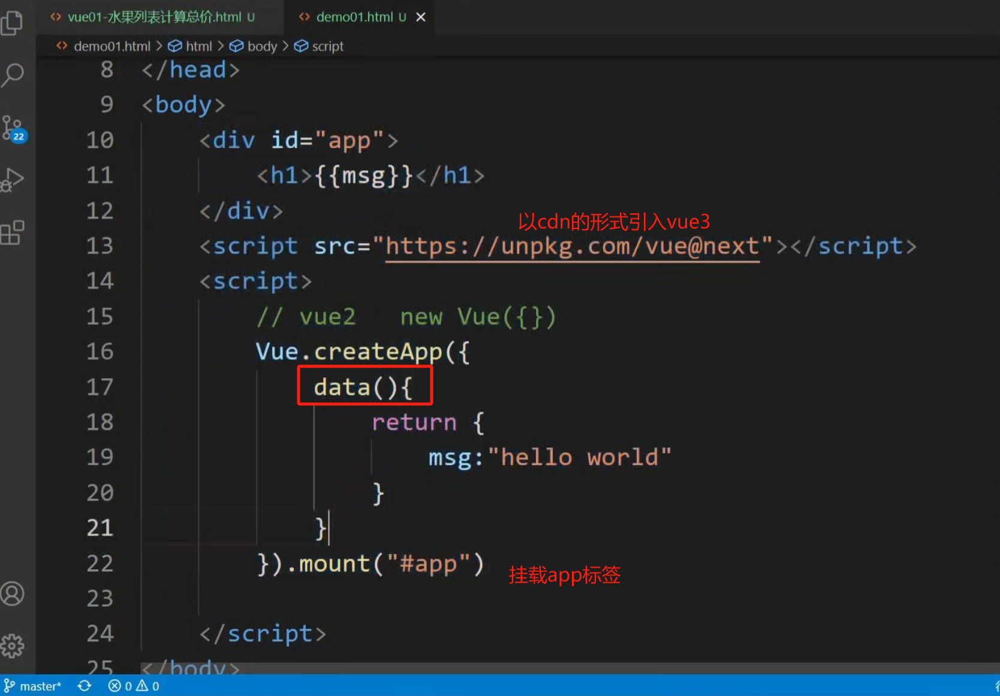


### 2 选项式与组合式api

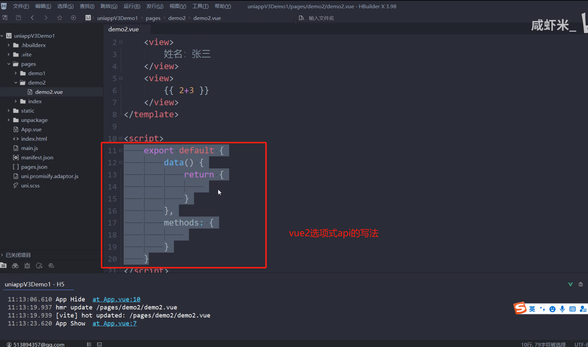


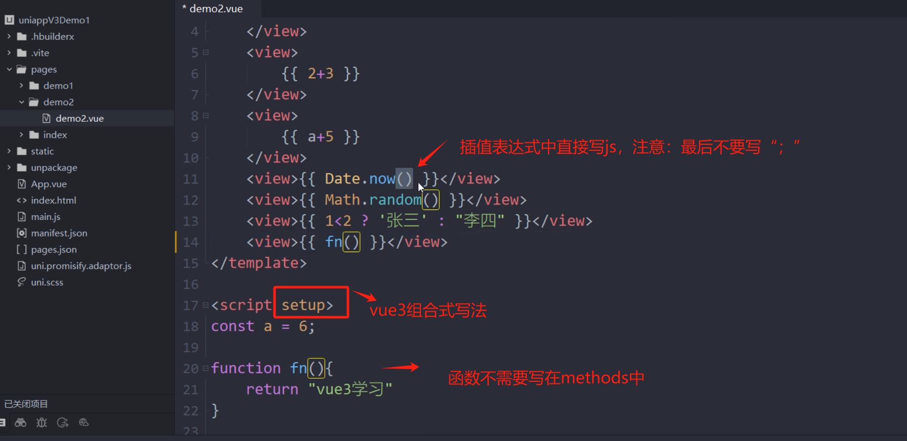


### 3 使用ref()实现响应式

使用目的：实现响应式

其他的不会展示在页面上的数据可以定义普通变量来使用。

#### 3.1 使用流程：

1:

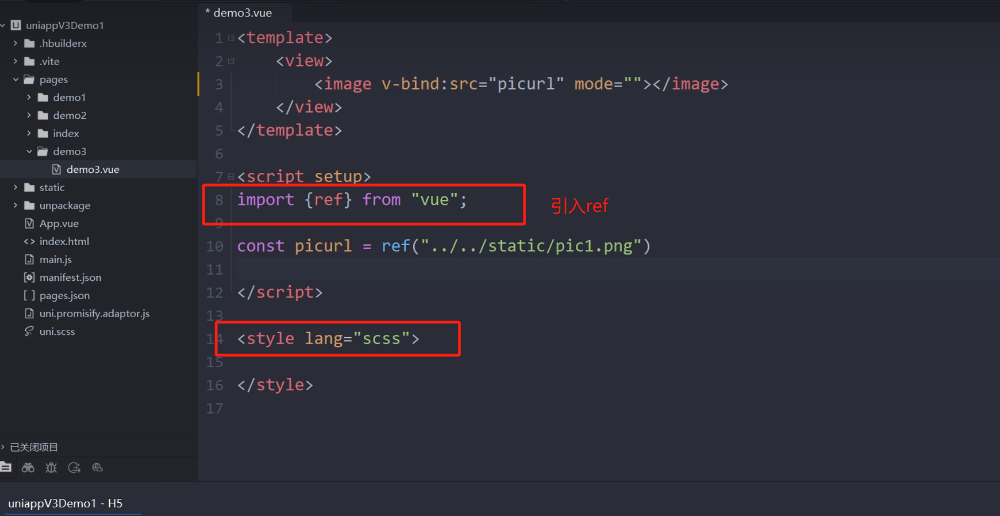

2:

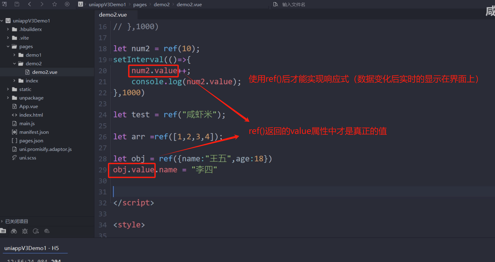


#### 3.2 注意

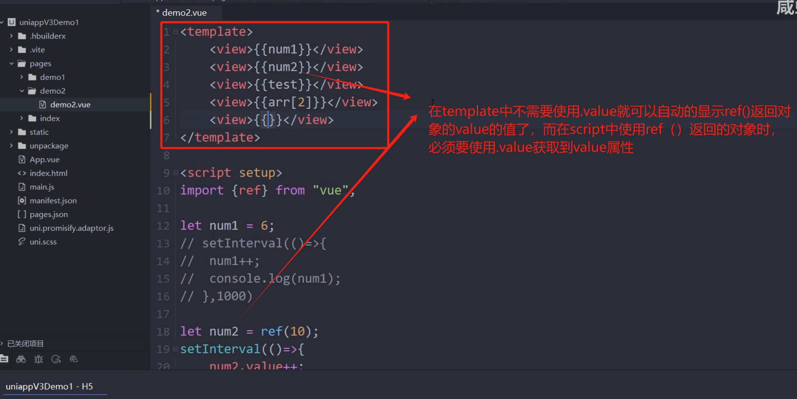

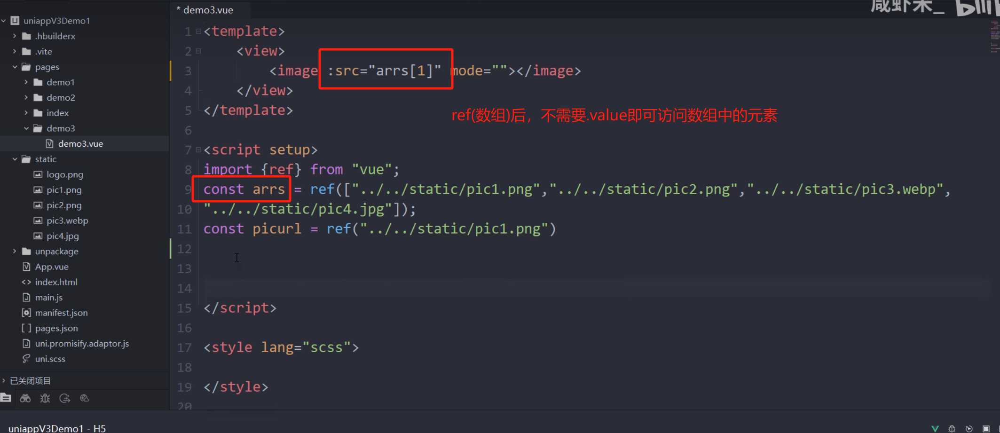


### 4 设置Vue3文件的模板

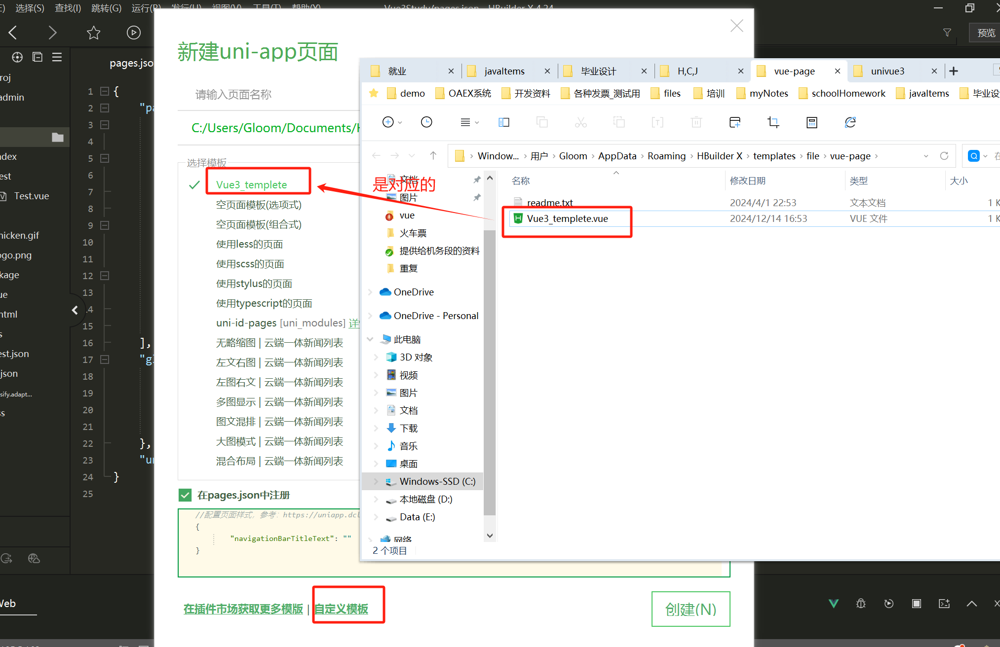

解释：

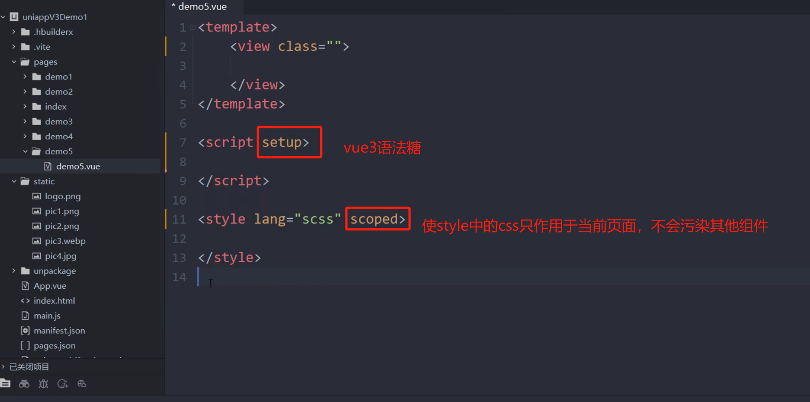

1

~~~vue
<template>
  <view class=""> 

  </view>
</template>

<script setup>
	
</script>

<style lang="scss" scoped>

</style>

~~~


### 5 template标签的使用

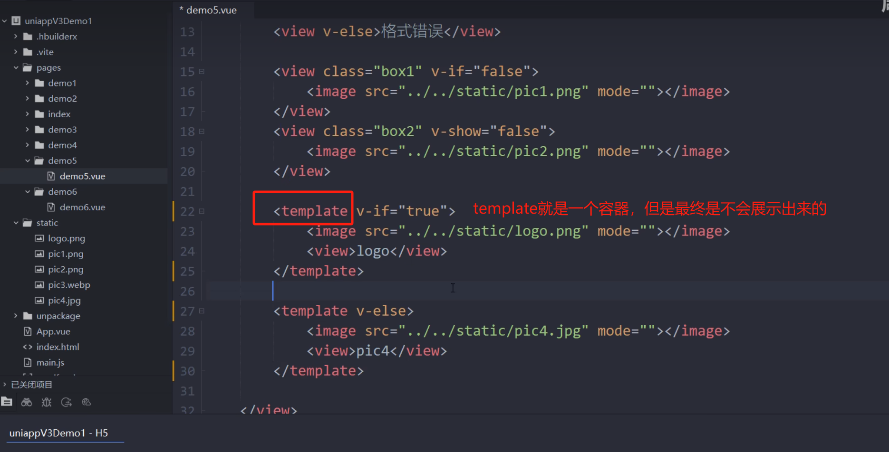

效果：

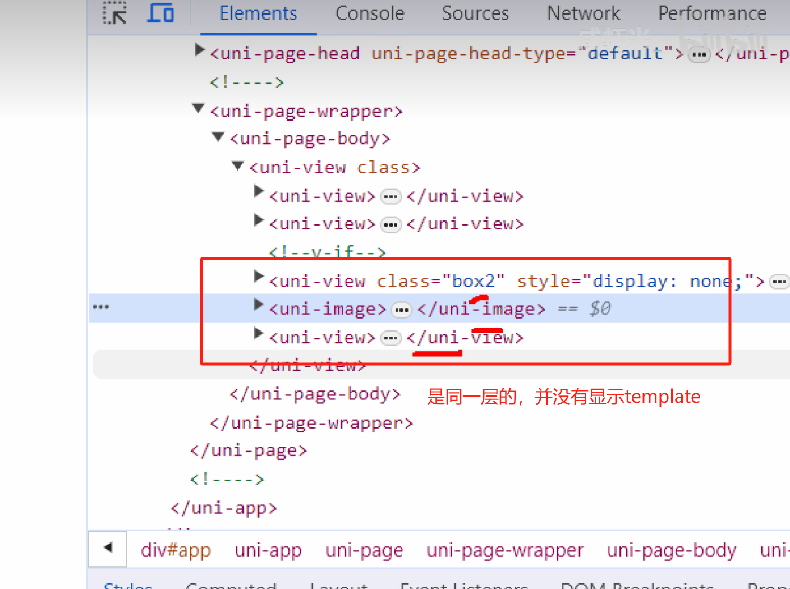


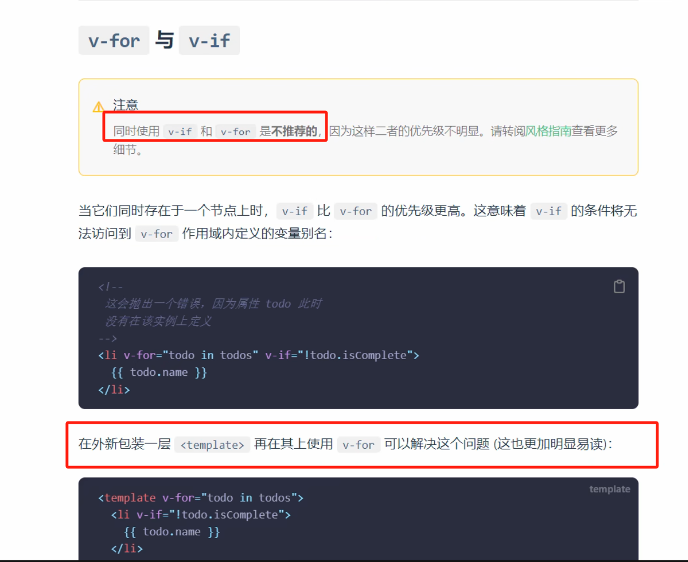


### 6 v-if的易错点

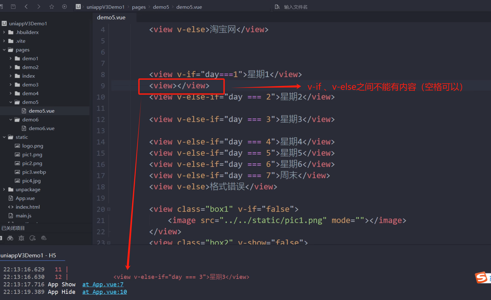


### 7 v-for中 :key的易错点

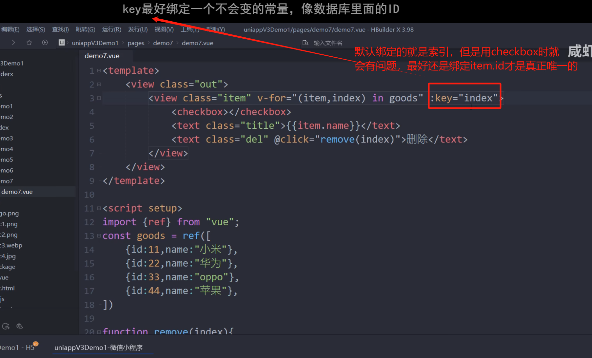


vue3的基础main.js文件：

~~~js
// main.js
import { createApp } from "vue";
import App from "./App.vue"; // 根组件

// 创建 Vue 应用实例
const app = createApp(App);
// 挂载应用到 DOM
app.mount("#app");
~~~


## 学习进度：

https://www.bilibili.com/video/BV1Yg4y127Fp?spm_id_from=333.788.videopod.episodes&vd_source=d6367c1fc21883823f1fb738f86ef26e&p=21


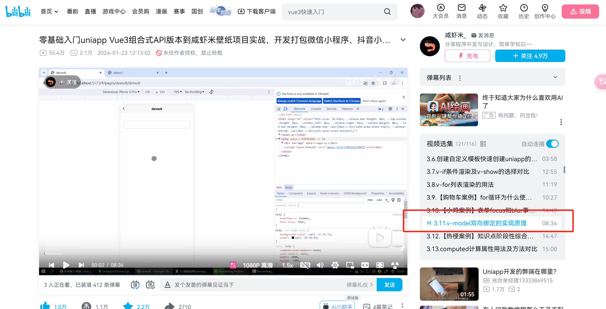


# 二、vue3安全联锁项目


# 初始目录结构解释

好的，非常乐意为您解释这个Vue 3项目的目录结构。这套结构是目前业界比较主流和通用的实践，能很好地组织代码，方便维护和扩展。

我将以笔记的形式为您讲解，方便您后续查阅。

### `BRIDoorSysPlateformWebClient` 项目结构解析

这是一个标准的由 Vue CLI 创建和配置的 Vue.js 项目。

```
BRIDoorSysPlateformWebClient/
├── node_modules/         -- 项目依赖库存放目录
├── public/               -- 静态资源目录 (不会被Webpack处理)
│   └── index.html        -- 应用主HTML文件
├── src/                  -- 核心源码目录
│   ├── api/              -- API请求模块
│   │   └── index.js
│   ├── assets/           -- 本地静态资源 (会被Webpack处理)
│   ├── components/       -- 可复用的公共组件
│   ├── router/           -- 路由配置
│   │   └── index.js
│   ├── store/            -- Pinia状态管理
│   │   └── index.js
│   ├── utils/            -- 工具模块
│   │   └── request.js
│   ├── views/            -- 页面级组件 (视图)
│   ├── App.vue           -- 根组件
│   └── main.js           -- 应用入口文件
├── .browserslistrc       -- 浏览器兼容性配置
├── babel.config.js       -- Babel转换器配置
├── package.json          -- 项目依赖和脚本配置 (类似Java的pom.xml)
├── package-lock.json     -- 锁定项目依赖的精确版本
├── README.md             -- 项目说明文档
└── vue.config.js         -- Vue CLI的自定义配置文件
```

---

### 各文件/目录作用详解

#### 1. 顶层文件和目录

*   **`node_modules/`**
    *   **作用**: 存放项目所有依赖包的地方。当您运行 `npm install` 命令时，npm会根据 `package.json` 的配置下载所有需要的库（如Vue, Element Plus等）到这个文件夹。
    *   **类比**: 类似于Java项目中Maven的本地仓库（`.m2/repository`）的概念，但它是项目级别的，不是全局的。
    *   **注意**: 这个目录通常非常大，不需要手动修改，也不需要提交到Git版本库（`.gitignore`文件里会忽略它）。

*   **`public/`**
    *   **作用**: 存放不会被Webpack等构建工具处理的静态文件。这里的文件会原封不动地被复制到最终的构建输出目录（通常是`dist`）。
    *   **`index.html`**: 是整个单页面应用（SPA）的“壳”。Vue应用最终会被JavaScript动态挂载到这个HTML文件中的一个DOM元素上（通常是`<div id="app"></div>`）。它是浏览器访问的入口。

*   **`src/` (Source)**
    *   **作用**: **项目的核心源代码目录**，您绝大部分的编码工作都会在这里进行。

*   **`package.json`**
    *   **作用**: 项目的“身份证”。它定义了项目的名称、版本、描述等元数据，以及最重要的两部分：
        1.  `dependencies`: 生产环境需要的依赖包（如 `vue`, `pinia`, `axios`）。
        2.  `devDependencies`: 开发和构建时需要的依赖包（如 `@vitejs/plugin-vue`）。
        3.  `scripts`: 定义了一些可以运行的命令脚本，如 `npm run serve` (启动开发服务器) 和 `npm run build` (打包项目)。
    *   **类比**: 功能上完全等同于Java Maven项目中的 `pom.xml` 文件。

*   **`package-lock.json`**
    *   **作用**: 为了保证项目在不同环境（比如您电脑和同事电脑上）安装的依赖版本完全一致，`npm install`会自动生成并维护这个文件。它锁定了每个依赖包的精确版本号。
    *   **重要性**: 必须提交到Git，以确保团队协作和CI/CD部署时的一致性。

*   **`vue.config.js`**
    *   **作用**: Vue CLI的配置文件。您可以在这里进行自定义配置，而无需“eject”（弹出）内部的webpack配置。我们之前就在这里配置了`devServer.proxy`来解决开发环境下的跨域问题。

*   **`babel.config.js` & `.browserslistrc`**
    *   **作用**: `babel` 是一个JavaScript编译器，能将新的、浏览器可能还不支持的JavaScript语法（ES6+）转换成向后兼容的旧语法。`.browserslistrc` 文件则用来告诉Babel和其它工具（如CSS预处理器）我们的项目需要兼容哪些浏览器。

---

#### 2. `src/` 源码目录详解

*   **`main.js`**
    *   **作用**: **整个应用的入口JS文件**。它的主要工作是：
        1.  导入Vue框架和根组件 `App.vue`。
        2.  创建Vue应用实例。
        3.  集成并使用插件，比如 `router` (路由) 和 `pinia` (状态管理)。
        4.  将应用实例挂载到 `public/index.html` 的`#app`元素上。

*   **`App.vue`**
    *   **作用**: **应用的根组件**。所有页面级视图 (`views`) 都会通过 `<router-view>` 标签渲染在这个组件内部。可以把它想象成所有页面的“父框架”，适合放置一些全局性的元素，比如顶层布局、导航栏或页脚。

*   **`views/`**
    *   **作用**: 存放页面级别的组件。每个文件通常代表一个独立的页面或“视图”，比如登录页 `Login.vue`、主页 `Home.vue`、用户管理页 `UserManage.vue` 等。这些组件会由路由 (`router`) 直接管理和渲染。

*   **`components/`**
    *   **作用**: 存放可复用的“公共”或“业务”组件。比如一个自定义的按钮、一个弹窗、一个复杂的图表等。这些组件可以在不同的 `views` 中被多次引用，提高了代码的复用性。

*   **`router/index.js`**
    *   **作用**: **定义应用的路由规则**。它建立URL路径和`views`组件之间的映射关系。比如，当用户访问 `/login` 时，路由配置会告诉Vue去渲染 `Login.vue` 组件。我们还在这里配置了路由守卫，用于实现登录拦截等权限控制。

*   **`store/index.js`**
    *   **作用**: **全局状态管理（使用Pinia）**。当多个组件需要共享或响应同一个数据状态时（比如用户的登录信息、token等），就可以把这些数据存放在`store`中。任何组件都可以读取或修改这份数据，并且数据的变化是响应式的，会自动更新所有使用它的组件。

*   **`api/index.js`**
    *   **作用**: **统一管理对后端接口的请求**。我们将所有与后端API的交互函数（如 `login`, `getUserList`）都封装在这里，使得API的调用更加清晰和易于维护。

*   **`utils/request.js`**
    *   **作用**: **封装的HTTP请求工具**。我们在这里对 `axios` 进行了二次封装，设置了基础URL、请求超时时间，并添加了请求和响应拦截器。请求拦截器可以在每个请求发送前自动添加token；响应拦截器可以统一处理错误码或数据格式。

*   **`assets/`**
    *   **作用**: 存放会被Webpack处理的静态资源，如 `CSS` 样式文件、`SCSS` 预处理文件、图片、字体文件等。Webpack会把它们作为模块依赖进行打包、压缩和优化。

希望这份详细的结构说明对您理解这个Vue项目有帮助！如果您对某个具体的文件或概念还有疑问，随时可以提出来。


好的，没问题。我们来逐行解析 `package.json` 和 `vue.config.js` 这两个核心配置文件。

这对于理解项目如何运行、依赖如何管理以及如何进行自定义构建至关重要。

### `package.json` 文件解析

这个文件是Node.js项目的“户口本”，功能上完全可以类比Java世界里的 `pom.xml`。它定义了项目的基础信息、依赖库和可执行脚本。

```json
{
  // 项目名称，通常在npm生态系统中是唯一的
  "name": "door-sys-web-client", 
  // 项目当前版本，遵循“主版本.次版本.补丁版本”的语义化版本规范
  "version": "1.0.0",
  // 设置为true可防止项目被意外发布到npm公共仓库，对于私有/公司项目是最佳实践
  "private": true,
  // 定义了一系列可以通过 `npm run <脚本名>` 执行的命令
  "scripts": {
    // 运行开发服务器，是下面 "serve" 的一个别名，方便个人习惯
    "dev": "vue-cli-service serve", 
    // 启动一个带热重载的开发服务器，代码修改后浏览器会自动刷新
    "serve": "vue-cli-service serve", 
    // 将项目打包成最终的静态文件（HTML, CSS, JS），用于部署到生产服务器
    "build": "vue-cli-service build" 
  },
  // "生产依赖"：项目线上运行时必须的库
  "dependencies": {
    // Element Plus 的图标库
    "@element-plus/icons-vue": "^2.3.1", 
    // 用于前后端HTTP通信的库，用来调用后端API
    "axios": "^1.6.2", 
    // JavaScript 的 polyfill（垫片），让旧版浏览器支持新的JS特性
    "core-js": "^3.33.3", 
    // 一个强大的图表库，用于数据可视化
    "echarts": "^5.4.3", 
    // 核心的UI组件库
    "element-plus": "^2.4.3", 
    // 用于在浏览器端保存文件的工具，如“导出Excel”功能
    "file-saver": "^2.0.5", 
    // 强大的日期时间处理库
    "moment": "^2.29.4", 
    // Vue 3 的官方状态管理库（替代了Vuex）
    "pinia": "^2.0.30", 
    // Vue 3 框架的核心库
    "vue": "^3.2.13", 
    // Vue 3 的官方路由库
    "vue-router": "^4.2.5" 
  },
  // "开发依赖"：只在开发和打包过程中需要的库，不会被打包到最终的生产代码中
  "devDependencies": {
    // Vue CLI 的 Babel 插件，用于将 ES6+ 语法转为兼容性更好的 ES5
    "@vue/cli-plugin-babel": "~5.0.8", 
    // Vue CLI 的路由插件，帮助快速集成 vue-router
    "@vue/cli-plugin-router": "~5.0.8", 
    // Vue CLI 的核心服务，包含了 serve, build 等命令的实现
    "@vue/cli-service": "~5.0.8",
    // Vue 单文件组件(.vue文件)的编译器
    "@vue/compiler-sfc": "^3.5.17", 
    // SASS/SCSS 语言的编译器
    "sass": "^1.69.5", 
    // Webpack 加载器，让 Webpack 能够理解和处理 SASS/SCSS 文件
    "sass-loader": "^13.3.2", 
    // 一个自动导入插件，可以自动导入Vue的API（如ref, reactive）
    "unplugin-auto-import": "^0.16.7", 
    // 一个自动导入插件，可以按需自动导入组件（如Element Plus组件）
    "unplugin-vue-components": "^0.25.2" 
  }
}
```

**关于版本号的说明 (例如 `^2.3.1` 或 `~5.0.8`)**
*   `^` (Caret): 允许更新次版本和补丁版本。`^2.3.1` 表示可以安装 `2.3.1` 到 `2.x.x` 的任何最新版本，但不能是 `3.0.0`。
*   `~` (Tilde): 只允许更新补丁版本。`~5.0.8` 表示可以安装 `5.0.8` 到 `5.0.x` 的任何最新版本，但不能是 `5.1.0`。

**关于`unplugin-*`**
请注意，在我们之前的调试过程中，为了解决一个启动报错，我们在 `vue.config.js` 中禁用了 `unplugin-auto-import` 和 `unplugin-vue-components` 这两个插件的配置。但它们仍然存在于 `devDependencies` 中。这在开发中很常见。如果确定不再使用，最佳实践是运行 `npm uninstall unplugin-auto-import unplugin-vue-components` 来将它们从项目中移除，保持 `package.json` 的整洁。

---

### `vue.config.js` 文件解析

这个文件是 Vue CLI 的专属配置文件，允许我们对项目的构建和开发服务器进行深度定制，而不需要接触复杂的 Webpack 内部配置。

```javascript
// 从@vue/cli-service中导入defineConfig函数，这是一个辅助函数，
// 它不执行任何操作，但能为你的配置提供基于JSDoc的类型提示和自动补全，增强开发体验
const { defineConfig } = require('@vue/cli-service')

// Node.js的模块导出语法，Vue CLI会读取这个导出的对象作为配置
module.exports = defineConfig({
  // publicPath: 公共路径。默认是'/'，即网站根目录。
  // 设置为'./'可以使所有资源路径都变成相对路径，
  // 这样项目打包后可以部署在任意路径下（比如服务器的子目录），而不会出现资源404。
  publicPath: './',

  // productionSourceMap: 生产环境的SourceMap。
  // SourceMap能将编译压缩后的代码映射回源码，方便调试。
  // 但它会暴露源码并增加文件体积，所以在生产环境中通常设置为false以提高安全性和性能。
  productionSourceMap: false,

  // transpileDependencies: 默认情况下，Babel只转换我们自己写的代码。
  // 设置为true会强制Babel去转换node_modules里的所有依赖。
  // 这能提高在旧浏览器上的兼容性，但会略微增加构建时间。
  transpileDependencies: true,

  // devServer: 对开发服务器的配置
  devServer: {
    // proxy: 配置开发服务器的代理，用于解决开发时的跨域问题
    proxy: {
      // 当请求路径以'/api'开头时，触发此代理规则
      '/api': {
        // target: 代理的目标服务器地址，即你的后端服务地址
        target: 'http://localhost:8080', 
        // changeOrigin: 是否改变请求头中的Origin字段。
        // 设置为true，代理服务器会告诉后端“我是从http://localhost:8080来的”，
        // 而不是“我是从前端页面http://localhost:8081来的”，可以避免一些后端的安全策略拦截。
        changeOrigin: true, 
        // pathRewrite: 路径重写。
        // 在将请求转发给后端前，重写请求URL。
        // 下面的规则意思是，将URL中开头的'/api'替换为空字符串。
        // 例：前端请求/api/user/list -> 代理转发到 http://localhost:8080/user/list
        pathRewrite: {
          '^/api': '' 
        }
      }
    }
  }
})
```

总结来说：

*   `package.json` **管“有什么”**：项目有什么依赖，能执行什么命令。
*   `vue.config.js` **管“怎么做”**：项目应该如何被打包，开发服务器应该如何运行。

希望这个逐行解释能帮助您彻底理解这两个文件的作用！


好的，我们来逐一分析这几个文件。

作为一名Java程序员，你可以把 `package.json` 和 `package-lock.json` 的关系类比于Maven中的 `pom.xml`。`pom.xml` 用来定义项目依赖，而 `package-lock.json` 则更像是确保这些依赖在任何环境下都保持精确一致的快照文件。

下面是针对每个文件的详细解释：

---

### 笔记：前端项目配置文件解析

#### 1. `.browserslistrc` (浏览器支持列表)

这个文件用来告诉前端构建工具（如 Babel、Autoprefixer）你的项目需要支持哪些浏览器。工具会根据这个列表，智能地将你的代码（JavaScript、CSS）转换成目标浏览器可以识别和运行的代码。

```
> 1%
last 2 versions
not dead
```

- **`> 1%`**: 兼容全球浏览器市场份额超过1%的浏览器。
- **`last 2 versions`**: 兼容所有主流浏览器的最新的两个版本。
- **`not dead`**: 排除那些在过去24个月内没有官方支持或更新的浏览器。"Dead" 浏览器通常是指已经停止维护的，比如 `Internet Explorer`。

**总结**: 这个配置的含义是：我们的项目代码需要被转换以兼容“全球市场份额大于1%的，且每个浏览器最新的两个版本，并且不能是已经‘死掉’的浏览器”。这是一种在保证兼容性和现代代码特性之间取得平衡的常见做法。

---

#### 2. `babel.config.js` (Babel 配置文件)

Babel 是一个 JavaScript 编译器。由于浏览器对最新的 JavaScript 语法（如 ES6/ES7+）支持程度不同，Babel 的主要作用就是将你写的现代 JavaScript 代码，转换成大多数浏览器都能理解的向后兼容的旧版本 JavaScript 代码（通常是 ES5）。

```javascript
module.exports = {
  presets: [
    '@vue/cli-plugin-babel/preset'
  ]
}
```

- **`module.exports`**: 这是 Node.js (JavaScript 的后端运行环境) 的模块导出语法，作用是把这个花括号 `{}` 里的配置对象暴露出去，让 Babel 主程序可以读取到。
- **`presets`**: "预设"的意思。Babel 的功能由各种插件（Plugin）提供，比如一个插件负责转换箭头函数 `=>`，另一个负责转换 `class` 语法。如果项目要用的插件很多，一个一个去配很麻烦。预设就是官方或者社区帮你打包好的一系列插件的集合。
- **`'@vue/cli-plugin-babel/preset'`**: 这是 Vue CLI 工具提供的一个 Babel 预设。它包含了将现代 JavaScript 和 Vue 特定语法（比如 `.vue` 文件中的 `<script>` 部分）正确转换为兼容性代码所需要的所有插件。它会读取 `.browserslistrc` 文件来决定代码需要被转换到什么程度。

**总结**: 这个文件告诉 Babel 使用 Vue 官方提供的预设配置，来编译项目中的所有 JavaScript 代码，确保代码能在目标浏览器上顺利运行。

---

#### 3. `package-lock.json` (依赖版本锁定文件)

`package-lock.json` 是在 `npm install` (或 `cnpm install` 等) 命令执行后自动生成的文件。它的核心作用是 **锁定依赖版本**。

我们先看 `package.json`，它里面定义了项目需要的依赖以及版本范围，比如 `axios: "^0.21.1"`。这里的 `^` 符号表示可以安装 `0.21.1` 到 `1.0.0` 之前的任何最新版本。

这会带来一个问题：
你今天 `npm install` 安装的是 `0.21.4` 版本，你的同事下周 `npm install` 可能就安装了 `0.22.0` 版本。如果 `0.22.0` 版本有一个微小的 Bug，就可能导致你的项目在他电脑上运行不起来，这就是著名的“在我电脑上是好的啊”问题。

`package-lock.json` 就是为了解决这个问题而生的。

- **精确锁定**: 它会记录你第一次成功安装时，项目中 **所有依赖**（包括依赖的依赖）的 **确切版本号**、下载地址和哈希值。
- **保证一致性**: 当你的同事，或者部署服务器拿到你的项目代码后，运行 `npm install` 时，npm会优先读取 `package-lock.json` 文件，并安装里面记录的 **一模一样** 的版本。
- **加速安装**: 因为文件已经记录了每个包的精确信息，npm 不需要再去计算和寻找符合版本范围的包，安装速度会更快。

**总结**: `package-lock.json` 的作用是确保项目在任何时间、任何环境下，安装的依赖包版本都是完全一致的，从而保证了开发、测试和生产环境的一致性和稳定性。**你应该把它提交到你的 Git 仓库中**。


好的，这个 `request.js` 文件是项目与后端服务器进行通信的核心。对于Java程序员来说，你可以把它理解为一个经过精心配置和封装的 **HTTP客户端工具**，非常类似于你在Java中配置一个 `RestTemplate` 或者 `OkHttpClient`，并为其添加拦截器（Interceptor）来统一处理请求和响应。

这个文件基于 `axios` 这个库，`axios` 是前端领域非常流行的HTTP请求库，地位相当于Java中的 `Apache HttpClient` 或者 `OkHttp`。

下面我将为你详细解释这份代码。

~~~js
import axios from 'axios'
import { ElMessage } from 'element-plus'
import router from '../router'

// 创建axios实例
const service = axios.create({
  baseURL: '/api',
  timeout: 30000
})

// 请求拦截器
service.interceptors.request.use(
  config => {
    // 统一添加token
    const token = localStorage.getItem('token')
    if (token) {
      config.headers['Authorization'] = `Bearer ${token}`
    }
    return config
  },
  error => {
    console.error('请求错误:', error)
    return Promise.reject(error)
  }
)

// 响应拦截器
service.interceptors.response.use(
  response => {
    const res = response.data
    
    // 如果返回的业务状态码不是200，说明请求出错
    if (res.code !== 200) {
      ElMessage({
        message: res.message || '请求失败',
        type: 'error',
        duration: 3000
      })
      
      // 401: 未登录或token过期
      if (res.code === 401) {
        // 重新登录
        router.push('/login')
      }
      
      return Promise.reject(new Error(res.message || '请求失败'))
    } else {
      return res
    }
  },
  error => {
    console.error('响应错误:', error)
    
    let message = error.message
    if (error.response) {
      switch (error.response.status) {
        case 401:
          message = '未授权，请重新登录'
          router.push('/login')
          break
        case 403:
          message = '拒绝访问'
          break
        case 404:
          message = '请求错误，未找到该资源'
          break
        case 500:
          message = '服务器内部错误'
          break
        default:
          message = `连接错误${error.response.status}`
      }
    } else {
      message = '网络连接异常，请稍后再试'
    }
    
    ElMessage({
      message: message,
      type: 'error',
      duration: 3000
    })
    
    return Promise.reject(error)
  }
)

export default service 
~~~


---

### 笔记：`axios` 封装与HTTP拦截器解析

这个文件主要做了三件事：
1.  创建一个可复用的 `axios` 实例，并进行基础配置。
2.  添加一个 **请求拦截器 (Request Interceptor)**，在每次发送请求前执行特定逻辑。
3.  添加一个 **响应拦截器 (Response Interceptor)**，在接收到服务器响应后、业务代码处理前执行特定逻辑。

#### 1. 创建 `axios` 实例

```javascript
// ... imports
const service = axios.create({
  baseURL: '/api',
  timeout: 30000
})
```

- **`axios.create({...})`**: 这不是直接使用全局的`axios`对象，而是创建了一个新的、独立的实例，叫做 `service`。这样做的好处是可以为项目创建不同的HTTP客户端，比如一个用于请求业务API，另一个用于请求第三方服务，它们的配置（如baseURL、超时时间、拦截器）可以完全不同。
- **`baseURL: '/api'`**: 设置了所有请求的基础URL。当你在其他地方调用 `service.get('/users')` 时，实际请求的地址会是 `/api/users`。`/api` 通常是一个代理标识，在 `vue.config.js` 文件中会被配置为指向真实的后端服务器地址，这主要用于解决开发环境下的跨域问题。
- **`timeout: 30000`**: 设置了请求超时时间为30秒（30000毫秒）。如果请求超过这个时间还没得到响应，请求就会被中断。

#### 2. 请求拦截器 (`service.interceptors.request.use(...)`)

**作用**: 在每个HTTP请求被 **发送出去之前** 对其进行预处理。
**Java类比**: 类似于 `Spring` 中的 `HandlerInterceptor` 的 `preHandle` 方法，或者 `OkHttp` 的 `Request Interceptor`。

```javascript
service.interceptors.request.use(
  config => {
    // 统一添加token
    const token = localStorage.getItem('token')
    if (token) {
      config.headers['Authorization'] = `Bearer ${token}`
    }
    return config
  },
  error => {
    // ...
    return Promise.reject(error)
  }
)
```

- **`config` 对象**: 这个对象包含了即将发送的请求的所有信息，比如 `url`, `method`, `headers` 等。
- **核心逻辑**:
    1.  `localStorage.getItem('token')`: 从浏览器的 `localStorage` 中获取之前保存的认证令牌（Token）。`localStorage` 是浏览器提供的一个简单的、持久化的键值对存储。
    2.  `if (token)`: 如果令牌存在。
    3.  `config.headers['Authorization'] = \`Bearer ${token}\``: 就在请求头（Headers）中添加一个 `Authorization` 字段。这是目前非常流行的 `JWT (JSON Web Token)` 认证方案的标准做法。服务器端会通过这个请求头来验证用户身份。
- **`return config`**: **必须**返回修改后的 `config` 对象，否则请求将无法继续发送。
- **`error => ...`**: 这个函数处理在构造请求时发生的错误，通常很少触发。
- **`Promise.reject(error)`**: 在JavaScript的异步编程中，`Promise` 是核心概念。`Promise.reject` 的作用类似于在同步代码中 `throw new Exception()`，它会中断当前的执行链，并将错误传递到调用方的 `.catch()` 代码块。

**总结**: 这个请求拦截器的主要工作就是为需要认证的API请求自动、统一地添加认证令牌。

#### 3. 响应拦截器 (`service.interceptors.response.use(...)`)

**作用**: 在收到服务器响应之后，在你的业务代码（比如页面中的 `.then()`）处理它 **之前**，对响应进行统一的预处理。
**Java类比**: 类似于 `Spring` 中的 `HandlerInterceptor` 的 `postHandle` 方法，或者 `OkHttp` 的 `Response Interceptor`。

它分为两个处理函数：一个处理 **成功** 的HTTP响应，另一个处理 **失败** 的HTTP响应。

##### 成功响应处理 (HTTP状态码 2xx)

```javascript
response => {
  const res = response.data
  
  if (res.code !== 200) {
    ElMessage(...) // 显示错误提示
    
    if (res.code === 401) {
      router.push('/login') // token失效，跳转到登录页
    }
    
    return Promise.reject(new Error(res.message || '请求失败'))
  } else {
    return res // 直接返回后端数据中的data部分
  }
},
```

- **`response` 对象**: 包含完整的HTTP响应信息，如 `status`, `headers`, 和 `data` (响应体)。
- **`const res = response.data`**: `response.data` 是后端服务器返回的JSON数据体，通常它会包含我们自定义的业务状态码、消息和数据，比如 `{ "code": 200, "message": "成功", "data": [...] }`。
- **`if (res.code !== 200)`**: 这里是一个关键。即使HTTP状态码是200（代表网络层面请求成功），业务层面也可能是失败的（比如“用户名密码错误”）。这里就是通过后端返回的 `code` 字段来判断业务是否成功。
    - 如果业务失败 (`code` 不是200)，就使用 `Element Plus` 的 `ElMessage` 组件弹出全局错误提示。
    - 特别地，如果 `code` 是401，代表“未认证”或“Token过期”，此时会调用 `router.push('/login')` 将用户强制导航到登录页面。
    - **`return Promise.reject(...)`**: 同样，通过返回一个被拒绝的Promise来中断Promise链，这样API调用的 `.then()` 就不会执行，而是会进入 `.catch()`。
- **`else { return res }`**: 如果业务成功，它没有返回完整的 `response` 对象，而是直接返回了 `res` (`response.data`)。这是一个非常实用的处理，它简化了业务代码。原本你需要 `api.getUser().then(response => response.data.data)` 这样来获取数据，现在只需要 `api.getUser().then(res => res.data)`。

##### 失败响应处理 (HTTP状态码 3xx, 4xx, 5xx)

```javascript
error => {
  // ...
  let message = error.message
  if (error.response) {
    switch (error.response.status) { // 根据HTTP状态码判断错误类型
      case 401: /* ... */ break;
      case 403: /* ... */ break;
      // ...
    }
  } else {
    message = '网络连接异常，请稍后再试' // 处理网络断开等情况
  }
  
  ElMessage(...) // 弹出全局错误提示
  
  return Promise.reject(error)
}
```
- **`error` 对象**: 这个对象包含了网络层面或HTTP层面的错误信息。
- **`if (error.response)`**: 如果这个对象存在，说明服务器返回了响应，只是HTTP状态码是错误的（如404, 500）。
    - `error.response.status` 就是HTTP状态码，代码通过 `switch` 语句为常见的错误码提供了更友好的中文提示。
- **`else`**: 如果 `error.response` 不存在，通常是网络问题（比如断网、请求超时、DNS错误），此时会给出一个统一的网络异常提示。
- **`ElMessage(...)` & `return Promise.reject(error)`**: 同样，显示全局错误提示，并抛出错误。

#### 4. 导出 (`export default service`)

`export default service;` 这行代码的作用是将这个配置好的 `axios` 实例 `service` 暴露出去，作为一个模块。在项目的其他地方（比如 `src/api/index.js`）就可以通过 `import service from '@/utils/request'` 来引入并使用它发起HTTP请求了。这类似于在Spring中将一个Bean注册到容器中，以便其他组件可以注入和使用。


好的，我们来详细解析 `main.js` 和 `App.vue` 这两个文件。它们是 Vue 应用的起点和根基。

### `main.js` - 应用的入口

这个文件是整个 Vue 应用被浏览器加载后，第一个执行的 JavaScript 文件。它的核心任务是“组装”和“启动”应用。

```javascript
// 从 'vue' 包中导入 createApp 函数。这是创建 Vue 3 应用实例的工厂函数。
import { createApp } from 'vue'
// 导入应用的根组件 App.vue。所有其他组件和视图都将嵌套在它里面。
import App from './App.vue'
// 导入路由配置。'./router' 会自动寻找 router 目录下的 index.js 文件。
import router from './router'
// 从 'pinia' 包中导入 createPinia 函数，用于创建 Pinia 实例（状态管理器）。
import { createPinia } from 'pinia'
// 导入 Element Plus UI 库本身。
import ElementPlus from 'element-plus'
// 导入 Element Plus 的核心 CSS 样式文件，这是让组件看起来正常的关键。
import 'element-plus/dist/index.css'
// 导入 Element Plus 的中文语言包，让分页、日期选择器等组件显示中文。
import zhCn from 'element-plus/es/locale/lang/zh-cn'
// 将 '@element-plus/icons-vue' 包中所有的图标组件作为一个对象导入。
import * as ElementPlusIconsVue from '@element-plus/icons-vue'
// 导入我们自己定义的全局 CSS 样式文件。
import './assets/css/global.css'

// 调用 createApp 函数，并传入根组件 App，创建一个 Vue 应用实例。
const app = createApp(App)
// 调用 createPinia 函数，创建一个 Pinia 实例，用于全局状态管理。
const pinia = createPinia()

// 这是一个循环，用来全局注册 Element Plus 的所有图标。
// Object.entries(ElementPlusIconsVue) 会将图标对象转换为 [key, value] 形式的数组。
for (const [key, component] of Object.entries(ElementPlusIconsVue)) {
  // 这里的 key 是图标的名称（如 'User', 'Lock'），component 是图标组件本身。
  // app.component(key, component) 的作用是将这个图标注册为一个全局组件。
  // 注册后，就可以在项目任何地方通过 <User /> 或 <Lock /> 的形式直接使用，无需再单独导入。
  app.component(key, component)
}

// 通过 app.use() 方法来“使用”一个插件。
// 这会安装 Pinia 插件，让整个应用都能访问到 store。
app.use(pinia)
// 安装路由插件，让应用支持 <router-link> 和 <router-view>，并使路由配置生效。
app.use(router)
// 安装 Element Plus 插件。
app.use(ElementPlus, {
  // 第二个参数是配置对象，这里我们配置 locale (语言) 为中文。
  locale: zhCn
})

// 将配置好的应用实例挂载到 public/index.html 文件中 id 为 'app' 的 DOM 元素上。
// 从这一刻起，Vue 才真正开始接管页面，渲染组件。
app.mount('#app')
```

**小结:** `main.js` 就像一个项目启动的总指挥。它引入所有必需的“零件”（Vue、路由、状态管理、UI库），将它们“安装”到应用实例上，最后把这个完整的应用“启动”（挂载到DOM上）。

---

### `App.vue` - 应用的根组件

这个文件是所有页面内容的“容器”或“外壳”。无论路由如何切换，显示哪个页面，这些页面实际上都是在这个 `App.vue` 组件内部进行渲染的。

```vue
<template>
  <!-- 
    这是一个Vue Router提供的特殊组件。
    它的作用是一个“占位符”。
    当浏览器URL变化时，路由会根据配置找到对应的页面组件（比如 Home.vue 或 Login.vue），
    然后把那个组件的内容渲染到 <router-view> 的位置。
    所以，这个文件本身很简单，但它却是整个单页面应用能够切换页面的核心。
  -->
  <router-view />
</template>

<style>
/* 
  这里的 <style> 标签没有 'scoped' 属性，意味着里面的样式是“全局的”，会影响到整个应用的所有元素。
  这对于设置基础样式和重置浏览器默认样式非常有用。
*/

/* 选中了 html 和 body 标签 */
html, body {
  margin: 0; /* 移除浏览器默认的外边距 */
  padding: 0; /* 移除浏览器默认的内边距 */
  height: 100%; /* 设置高度为视口（viewport）的100% */
  width: 100%; /* 设置宽度为视口的100% */
  /* 当内容超出容器时，隐藏超出的部分，防止出现滚动条 */
  overflow: hidden; 
  /* 设置一个优雅的字体栈。浏览器会从左到右依次尝试使用这些字体。*/
  font-family: "Helvetica Neue", Helvetica, "PingFang SC", "Hiragino Sans GB", "Microsoft YaHei", "微软雅黑", Arial, sans-serif;
  /* 下面两行是用于优化字体渲染的，让字体在某些屏幕上看起来更平滑、清晰。*/
  -webkit-font-smoothing: antialiased; /* 针对 Webkit 内核浏览器 (Chrome, Safari) */
  -moz-osx-font-smoothing: grayscale; /* 针对 Firefox 浏览器 */
}

/* 选中了 id 为 'app' 的元素，也就是我们在 public/index.html 中定义的挂载点 */
#app {
  /* 确保 #app 元素能撑满它的父元素（即 body） */
  height: 100%;
  width: 100%;
  /* 再次确保 #app 内部如果内容溢出，也不会出现滚动条 */
  overflow: hidden;
}
</style>
```

**小结:** `App.vue` 主要做了两件事：

1.  **提供一个渲染出口**：通过 `<router-view>` 为所有页面组件提供一个展示舞台。
2.  **定义全局基础样式**：通过全局 `<style>` 标签，为整个应用设置统一的、覆盖浏览器默认行为的基础样式，确保在不同浏览器上表现一致。

希望这样逐行的解释能帮助您更好地理解这两个文件的作用！


好的，我们来详细解析 `src/store/index.js` 这个文件。

这个文件使用 [Pinia](https://pinia.vuejs.org/)（Vue 3 官方推荐的状态管理库）来定义和管理应用的全局状态。您可以把它想象成一个**前端的共享内存或全局数据中心**，任何组件都可以方便地存取这里的数据，并且数据的变化会自动通知所有使用它的组件。

这对于管理像用户登录信息、主题设置这类需要在多个页面和组件之间共享的数据非常有用。

---

### `src/store/index.js` 文件解析

```javascript
// 从 'pinia' 库中导入 defineStore 函数。这是定义一个 "Store" (状态存储单元) 的核心函数。
import { defineStore } from 'pinia'

// ---- 用户信息存储 (User Store) ----
// 使用 defineStore 函数定义一个名为 'user' 的 store。
// 第一个参数 'user' 是这个 store 的唯一 ID，Pinia 用它来连接 DevTools 等工具。
// 第二个参数是一个配置对象，定义了 store 的具体内容。
export const useUserStore = defineStore('user', {
  // state 是一个函数，必须返回一个对象。这个对象包含了这个 store 管理的所有状态数据。
  state: () => ({
    // 定义一个 'token' 状态。
    // 程序初始化时，会尝试从浏览器的 localStorage 中读取 'token'。
    // 如果读取到了，就用它；如果没读取到 (比如首次访问或清除了缓存)，就使用空字符串 '' 作为初始值。
    token: localStorage.getItem('token') || '',
    // 定义 'userInfo' 状态，存储用户信息对象。
    // 同样，先尝试从 localStorage 读取。因为 localStorage 只能存字符串，
    // 所以存入时需要用 JSON.stringify() 转为字符串，取出时需要用 JSON.parse() 转回对象。
    // 如果没读取到，则使用空对象 {}作为初始值。
    userInfo: JSON.parse(localStorage.getItem('userInfo')) || {}
  }),
  // actions 对象中定义了可以修改 state 的方法。
  // 它们类似于组件中的 methods。
  actions: {
    // 定义一个名为 setToken 的 action。
    setToken(token) {
      // `this` 在 actions 中指向 store 实例本身。
      // 这行代码更新了 state 中的 token 值。
      this.token = token
      // 同时，将新的 token 保存到 localStorage 中，实现数据持久化，
      // 这样用户刷新页面后登录状态不会丢失。
      localStorage.setItem('token', token)
    },
    // 定义一个设置用户信息的 action。
    setUserInfo(userInfo) {
      // 更新 state 中的 userInfo。
      this.userInfo = userInfo
      // 将用户信息对象转换为 JSON 字符串后，存入 localStorage。
      localStorage.setItem('userInfo', JSON.stringify(userInfo))
    },
    // 定义一个清除用户登录信息的 action，通常在用户登出时调用。
    clearUserInfo() {
      // 将 state 中的 token 和 userInfo 重置为空。
      this.token = ''
      this.userInfo = {}
      // 从 localStorage 中移除对应的项。
      localStorage.removeItem('token')
      localStorage.removeItem('userInfo')
    }
  }
})

// ---- 系统设置存储 (Setting Store) ----
// 按照同样的方式，定义第二个 store，用于管理系统设置。
// ID 是 'setting'，同样必须是唯一的。
export const useSettingStore = defineStore('setting', {
  // 定义设置相关的状态
  state: () => ({
    // 侧边栏是否折叠的状态，默认为 false (不折叠)。
    sidebarCollapsed: false,
    // 应用的主题，'light' 或 'dark'。
    // 同样会尝试从 localStorage 读取持久化的主题设置，如果没有则默认为 'light'。
    theme: localStorage.getItem('theme') || 'light'
  }),
  // 定义设置相关的 actions
  actions: {
    // 定义一个切换侧边栏折叠状态的 action。
    toggleSidebar() {
      // 直接将布尔值取反。
      this.sidebarCollapsed = !this.sidebarCollapsed
    },
    // 定义一个设置主题的 action。
    setTheme(theme) {
      // 更新 state 中的 theme 值。
      this.theme = theme
      // 将新的主题设置存入 localStorage。
      localStorage.setItem('theme', theme)
    }
  }
})
```

### 关键概念总结

1.  **Store**: 一个独立的“数据仓库”，包含了 `state`、`getters` (计算属性，这里没用到) 和 `actions`。我们这里定义了 `user` 和 `setting` 两个 stores。
2.  **`state`**: 定义了最核心的数据。它必须是一个返回对象的函数，这是为了在服务端渲染（SSR）时避免状态交叉污染。
3.  **`actions`**: 定义了修改 `state` 的方法。所有业务逻辑，包括异步请求（比如从后端获取用户信息），都应该封装在 `actions` 中。这是修改状态的**推荐方式**。
4.  **`localStorage`**: 这是浏览器提供的一种**本地存储**机制。存储在这里的数据是**持久化**的，即使关闭浏览器或刷新页面，数据依然存在，直到被手动清除。这对于保存用户的登录`token`或个性化设置非常有用。

### 如何在组件中使用？

在任何 Vue 组件 (`.vue` 文件) 的 `<script setup>` 中，你可以这样使用它们：

```vue
<script setup>
import { useUserStore } from '@/store'; // 导入我们定义的 store

const userStore = useUserStore(); // 获取 user store 的实例

// 读取 state
console.log(userStore.token);

// 调用 action
function handleLogout() {
  userStore.clearUserInfo();
}
</script>
```

Pinia 的设计非常直观，几乎就像在操作一个普通的 JavaScript 对象，但它背后又提供了强大的响应式能力和开发工具支持。


---

#### 2. `src/api/index.js` 文件解析

这个文件是项目的 **API层** 或 **服务层**。它的作用是把项目中所有对后端服务器的HTTP请求都集中封装在这里，统一管理。

**对于Java程序员来说，这完全可以类比于你项目中的 `Service` 层或者 `DAO (Data Access Object)` 层。** 它将数据访问的逻辑（在这里是HTTP请求）从UI视图层（Vue组件）中抽离了出来。

**这样做的好处：**

1.  **集中管理**：所有的API地址都清晰地列在这里，方便查找和修改。
2.  **代码复用**：不同的页面组件如果需要调用同一个API，只需导入并调用这个文件里的同一个函数即可。
3.  **便于维护**：如果后端某个接口的URL或者请求方式变了，你只需要修改这一个文件，而不需要去每个调用它的组件里修改。
4.  **逻辑解耦**：UI组件只关心“调用一个函数来获取数据”，而不用关心这个函数内部是如何使用`axios`、如何设置`headers`、如何处理`POST`或`GET`的。

**代码逐段解析：**

-   **`import request from '../utils/request'`**:
    导入我们之前分析过的、经过统一配置（添加了`baseURL`和拦截器）的 `axios` 实例。现在，`index.js` 文件里的 `request` 变量就是那个实例。

-   **`export function login(data) { ... }`**:
    -   `export function`：这是一个 **命名导出**，意味着在其他文件中，你必须通过 `import { login } from './api'` 来导入它。
    -   它定义了一个名为 `login` 的函数，接收一个 `data` 对象（通常包含用户名和密码）。
    -   `return request({...})`: 调用 `request` 实例发起请求。`axios` 的调用会返回一个 `Promise` 对象。
    -   `url: '/user/login'`: 请求路径。它会自动和 `baseURL: '/api'` 拼接，所以实际请求地址是 `/api/user/login`。
    -   `method: 'post'`: 使用POST方法。
    -   `data`: 这是一个ES6语法糖，等同于 `data: data`。它告诉`axios`将传入的`data`对象作为请求体（Request Body）发送出去，通常会序列化为JSON格式。

-   **`export function getDoorList(params) { ... }`**:
    -   `method: 'get'`: 使用GET方法。
    -   `params`: 这是 `axios` 的一个特定选项，等同于 `params: params`。它会将传入的 `params` 对象转换为URL的查询字符串。例如，如果调用 `getDoorList({ page: 1, keyword: 'A' })`，实际请求的URL会是 `/api/door/list?page=1&keyword=A`。

-   **`export function deleteDoor(id) { ... }`**:
    -   `url: \`/door/delete/${id}\``: 这里使用了JavaScript的 **模板字符串 (Template Literals)**，用反引号 `` ` `` 包裹。它允许你在字符串中通过 `${...}` 的方式直接嵌入变量。这常用于RESTful API中，将ID作为URL路径的一部分。
    -   `method: 'delete'`: 使用DELETE方法。

总结来说，`src/api/index.js` 文件为应用的每一个后端接口都创建了一个清晰、语义化的JavaScript函数，极大地提高了代码的可读性和可维护性。


好的，我们来全面解析 `src/router/index.js` 这个文件。

这个文件是 Vue 应用的**导航中枢**。它使用 `vue-router` 库来定义网站的页面（URL）如何与你的Vue组件进行映射，并负责管理页面间的跳转和访问权限控制。

---

### `src/router/index.js` 文件解析

```javascript
// 从 'vue-router' 库中导入创建路由实例和历史模式所需的函数。
import { createRouter, createWebHashHistory } from 'vue-router'

// `routes` 是一个数组，其中每个对象都是一条“路由规则”。
// 这条规则定义了 "当用户访问哪个URL时，应该显示哪个组件"。
const routes = [
  // 规则 1：根路径重定向
  {
    path: '/', // 当用户访问网站根路径 (例如 http://localhost:8081/)
    redirect: '/login' // 自动将他们重定向到 /login 路径。
  },
  // 规则 2：登录页
  {
    path: '/login', // URL 路径
    name: 'Login',  // 路由的唯一名称，方便在代码中通过名字进行跳转（例如 router.push({ name: 'Login' })）
    // component: 指定要渲染的组件。
    // 这种 `() => import(...)` 的写法叫做“路由懒加载”。
    // 只有当用户真正访问 /login 时，对应的 Login.vue 组件代码才会被下载和解析。
    // 这能显著提高应用首页的加载速度，因为不需要一次性加载所有页面的代码。
    component: () => import('../views/Login.vue')
  },
  // 规则 3：主页/布局页
  {
    path: '/home', // 主页的路径
    name: 'Home',
    component: () => import('../views/Home.vue'),
    // 当访问 /home 时，默认重定向到它的子路由 /dashboard
    redirect: '/dashboard', 
    // `children` 属性定义了“嵌套路由”。
    // 这些子路由的组件将在父路由组件（Home.vue）的 <router-view> 中渲染。
    // 这对于创建后台管理系统的布局（左侧菜单+右侧内容区）非常有用。
    children: [
      {
        path: '/dashboard', // 注意：这里的路径是绝对路径
        name: 'Dashboard',
        component: () => import('../views/Dashboard.vue'),
        // `meta` 字段用于存放自定义元数据。
        // 这里我们用它来存储页面的中文标题，方便后面在路由守卫中设置浏览器标签页的标题。
        meta: { title: '系统首页' } 
      },
      {
        path: '/door-manage',
        name: 'DoorManage',
        component: () => import('../views/DoorManage.vue'),
        meta: { title: '门禁管理' }
      },
      {
        path: '/card-manage',
        name: 'CardManage',
        component: () => import('../views/CardManage.vue'),
        meta: { title: '卡片管理' }
      },
      {
        path: '/user-manage',
        name: 'UserManage',
        component: () => import('../views/UserManage.vue'),
        meta: { title: '用户管理' }
      },
      {
        path: '/system-setting',
        name: 'SystemSetting',
        component: () => import('../views/SystemSetting.vue'),
        meta: { title: '系统设置' }
      }
    ]
  },
  // 规则 4：404 页面 (捕获所有未匹配的路由)
  {
    // `:pathMatch(.*)*` 是一个特殊的参数，它会匹配所有内容。
    // 因为路由是按顺序匹配的，所以这条规则放在最后，
    // 当用户访问的URL没有匹配到上面任何一条规则时，就会命中这条，从而显示404页面。
    path: '/:pathMatch(.*)*',
    name: 'NotFound',
    component: () => import('../views/404.vue')
  }
]

// 调用 createRouter 函数，传入配置对象，创建一个路由实例。
const router = createRouter({
  // `history` 选项配置路由模式。
  // `createWebHashHistory()` 使用 URL 的 hash (哈希/#) 部分来模拟一个完整的URL。
  // 例如，页面路径会是 http://localhost:8081/#/login。
  // 这种模式的好处是简单，不需要后端服务器做特殊配置，刷新页面也不会404。
  history: createWebHashHistory(),
  // 将我们上面定义的路由规则数组传递给路由实例。
  routes
})

// ---- 全局前置守卫 (Navigation Guard) ----
// `router.beforeEach` 注册一个回调函数，这个函数会在“每一次路由跳转之前”被调用。
// 它非常适合用来做登录验证和权限控制。
router.beforeEach((to, from, next) => {
  // `to`: 即将进入的目标路由对象。
  // `from`: 当前导航正要离开的路由对象。
  // `next`: 一个必须被调用的函数，用来“放行”导航。

  // 动态设置浏览器标签页的标题。
  // 它会尝试获取目标路由 `to` 的 `meta.title`，如果没有，就使用默认标题。
  document.title = `${to.meta.title || '门禁系统管理平台'}`

  // 从 localStorage 中获取 token，判断用户是否登录。
  const token = localStorage.getItem('token')

  // 如果目标路径是登录页，无论有没有token都直接放行。
  if (to.path === '/login') {
    next() 
  } else {
    // 如果目标路径不是登录页，则检查是否有 token。
    // 如果有 token (用户已登录)，则放行。
    // 如果没有 token (用户未登录)，则强制跳转到登录页。
    token ? next() : next('/login') 
  }
})

// 将配置好的 router 实例导出，以便在 main.js 中被引入和使用。
export default router
```

### 关键概念总结

1.  **路由规则 (Route Record)**: 一个包含 `path`, `component`, `name` 等属性的对象，定义了URL和组件的映射关系。
2.  **路由懒加载 (Lazy Loading)**: 使用 `() => import(...)` 语法，按需加载页面组件，优化首屏性能。
3.  **嵌套路由 (Nested Routes)**: 使用 `children` 属性，实现复杂的页面布局，例如后台管理系统的侧边栏+内容区。
4.  **路由模式 (History Mode)**:
    *   **Hash 模式 (`createWebHashHistory`)**: URL带 `#`，如 `/#/user`。简单，无需后端配置。
    *   **History 模式 (`createWebHistory`)**: URL不带 `#`，如 `/user`。更美观，但需要后端配合，将所有404请求都指向 `index.html`，否则刷新页面会报404错误。
5.  **导航守卫 (Navigation Guards)**: `router.beforeEach` 就像一个路由的“保安”。在每次路由跳转前进行检查，可以实现登录拦截、权限校验、动态修改页面标题等功能。它的 `next()` 函数是控制导航流程的关键。

这个文件是构建一个“单页面应用”(SPA) 的核心，它让用户感觉像在多个页面间切换，但实际上始终停留在同一个HTML页面上，只是通过JavaScript动态地更换了页面内容。


# 三、vue3新特性解释


好的，这个 `DoorManage.vue` 文件是一个非常典型的 Vue 3 + Element Plus 实现的“增删改查”(CRUD) 管理页面。它完美地展示了 Vue 3 的诸多新特性，特别是**组合式 API (Composition API)**。

我将分三部分来为您解析：**模板 (HTML)**、**脚本 (JavaScript)** 和 **样式 (CSS)**，并重点讲解其中的 Vue 3 新特性。

---

### `<template>`: 页面的结构与视图

这部分定义了用户能看到的所有UI元素。

*   **整体布局**:
    *   使用 `<el-button>`、`<el-card>`、`<el-form>`、`<el-table>`、`<el-pagination>`、`<el-dialog>` 等 Element Plus 组件快速搭建了一个包含**页面标题、搜索区、表格区、分页和弹出式表单**的完整管理界面。
*   **插槽 (Slot) 的新语法 `#`**:
    *   在表格列 `<el-table-column>` 中，您会看到 `<template #default="scope">` 和 `<template #footer>`。
    *   这是 Vue 3 中**具名插槽**的简写语法（`#` 等同于 `v-slot:`）。它允许我们向子组件的特定位置“插入”自定义的HTML内容。
    *   例如，在“状态”列，我们使用插槽来自定义单元格的显示内容：根据 `scope.row.status` 的值（`scope.row` 代表当前行的数据）来动态显示不同颜色和文本的 `<el-tag>`。这比简单地显示 "online" 或 "offline" 字符串要直观得多。

---

### `<script setup>`: 页面的逻辑与数据 (Vue 3 核心)

这部分是页面的“大脑”，使用了 Vue 3 最核心的特性——**组合式 API**。

`<script setup>` 本身就是一个语法糖，它极大地简化了组合式 API 的使用。您在这里声明的所有顶层变量、函数，都会自动暴露给模板使用，无需像 Vue 2 那样写 `data()`, `methods`, `computed` 和 `return`。

#### 1. 响应式状态声明 (`ref` 和 `reactive`)

这是组合式 API 的基石，用来创建“会动”的数据。

*   **`ref`**:
    *   `const loading = ref(false)`
    *   `const dialogVisible = ref(false)`
    *   **作用**: 用于包装**基本数据类型** (如 `String`, `Number`, `Boolean`) 或**单个对象**，使其具有响应性。
    *   **特点**: 在 `<script>` 中访问或修改它的值时，需要通过 `.value` 属性，例如 `loading.value = true`。但在 `<template>` 中使用时，Vue 会自动“解包”，可以直接写 `v-loading="loading"`，无需 `.value`。
    *   我们还用 `ref` 来获取 DOM 元素或组件实例的引用，如 `const formRef = ref(null)` 配合模板中的 `ref="formRef"`。

*   **`reactive`**:
    *   `const searchForm = reactive({...})`
    *   `const formData = reactive({...})`
    *   **作用**: 用于包装**对象或数组**，使其内部所有属性都具有深度响应性。
    *   **特点**: 访问和修改其属性时，就像操作普通 JS 对象一样，无需 `.value`，例如 `searchForm.doorName = '新名称'`。

*   **`ref` vs `reactive` 小结**:
    *   **习惯用法**: 用 `ref` 处理所有类型的数据（包括对象），因为它更通用、更一致（始终通过 `.value` 修改）。用 `reactive` 专门处理对象和数组。这个项目选择了混合使用的方式，也是很常见的。
    *   **核心区别**: `reactive` 创建的是一个代理对象，不能被重新赋值（`reactiveObj = {}` 会使其失去响应性），而 `ref` 可以（`refObj.value = {}`）。

#### 2. 生命周期函数 (`onMounted`)

*   `import { onMounted } from 'vue'`
*   `onMounted(() => { ... })`
*   **作用**: 这是 Vue 3 中注册“挂载完成”生命周期钩子的方式，等同于 Vue 2 中的 `mounted()` {}`。
*   **解释**: 当 Vue 组件初始化、渲染完成并挂载到真实 DOM 上之后，`onMounted` 中注册的回调函数就会被执行。这里通常用来执行一些初始化操作，比如**从后端 API 获取初始数据**来填充表格。

#### 3. 函数式逻辑组织

*   **告别 `methods`**: 在 Vue 2 中，所有方法都必须放在 `methods` 对象里。在 `<script setup>` 中，我们可以直接定义函数，如 `handleSearch()`, `handleAdd()`, `submitForm()` 等。
*   **逻辑高度内聚**: 您可以看到，所有与“对话框”相关的状态（`dialogVisible`, `dialogType`, `formData`）和操作它的函数（`handleAdd`, `handleEdit`, `submitForm`, `resetForm`）都可以在代码中写在一起。这种按**功能/逻辑关注点**来组织代码的方式，使得代码块更容易被理解、维护和抽离复用，是组合式 API 相比于 Vue 2 选项式 API 的最大优势之一。

#### 4. 其它 API

*   **`ElMessage`, `ElMessageBox`**: 这是 Element Plus 提供的 API，用于显示全局消息提示和确认对话框。在 `<script setup>` 中直接导入并使用即可。

---

### `<style scoped>`: 组件的局部样式

*   `scoped` 属性是 Vue 单文件组件的一个非常强大的功能（Vue 2 和 Vue 3 都有）。
*   **作用**: 它会自动为当前组件模板中的所有 HTML 元素添加一个唯一的自定义属性（如 `data-v-xxxxxxxx`），同时，`style` 标签中的所有 CSS 选择器也会被改写，附加上这个属性选择器（如 `.door-manage[data-v-xxxxxxxx]`）。
*   **好处**: 这确保了这里的 CSS 样式**只会作用于当前组件**，绝对不会“泄露”出去影响到其他组件的样式，实现了样式的模块化和隔离，避免了全局样式冲突。

### C#/.NET 开发者视角的小结

对于习惯了C#中强类型、面向对象编程的开发者来说，Vue 3的组合式API可能感觉更亲切一些：

*   **`ref`/`reactive`** 可以看作是对变量的一种“包装”，赋予了其数据绑定的超能力，类似WPF/WinForm中的`INotifyPropertyChanged`机制。
*   **`<script setup>`** 中的代码块更像一个类的构造函数或者一个方法的执行体，变量和函数在一起声明和定义，逻辑关系更清晰。
*   **按功能组织代码**的方式，类似于将相关的功能封装在一个独立的类或方法中，而不是像Vue 2那样分散在`data`, `methods`, `computed`等不同的配置项里。

这个文件是一个非常好的学习范例，它集中体现了如何用 Vue 3 的新特性来高效地构建一个复杂但结构清晰的交互页面。


## 疑问：

~~~
1.再详细说一下插槽 (Slot) 的使用 2.“我们还用 ref 来获取 DOM 元素或组件实例的引用，如 const formRef = ref(null) 配合模板中的 ref="formRef"。”是什么意思 3.ref，reactive有什么用，用vue2的写法不是更加方便吗
~~~


这三个问题都非常棒，直击 Vue 3 核心概念的精髓！特别是第三个问题，是很多从 Vue 2 过来的开发者都会有的疑惑。

让我逐一为您详细解释，并结合 C#/.NET 的概念做类比，希望能帮助您更好地理解。

---

### 1. 详解插槽 (Slot)：组件的“内容定制模板”

您可以把**插槽 (Slot)** 想象成一个**预留的“坑位”**。组件的创建者在组件内部挖好了这些坑，而组件的使用者则可以把任何自己想要的内容“填”到这些坑里。

这极大地增强了组件的灵活性和复用性。组件封装了固定的**行为和样式**，但把一部分**内容决定权**交给了使用者。

**一个简单的例子：创建一个“通用卡片”组件**

假设我们要创建一个 `BaseCard.vue` 组件，它有固定的样式（边框、阴影），但卡片里的内容是多变的。

**`BaseCard.vue` (组件定义方 - “挖坑”)**

```vue
<template>
  <div class="card">
    <div class="card-header">
      <!-- 这里是第一个坑，名字叫 'header' -->
      <slot name="header"></slot> 
    </div>
    <div class="card-content">
      <!-- 这是默认坑，没有名字 -->
      <slot></slot> 
    </div>
    <div class="card-footer">
      <!-- 这是第三个坑，名字叫 'footer' -->
      <slot name="footer"></slot>
    </div>
  </div>
</template>

<style scoped>
.card { border: 1px solid #ccc; border-radius: 4px; box-shadow: 0 2px 4px rgba(0,0,0,.12); }
.card-header { padding: 10px; border-bottom: 1px solid #eee; }
.card-content { padding: 20px; }
.card-footer { padding: 10px; border-top: 1px solid #eee; }
</style>
```

**`DoorManage.vue` (组件使用方 - “填坑”)**

现在我们在门禁管理页面使用这个卡片。

```vue
<template>
  <!-- 使用 BaseCard 组件 -->
  <BaseCard>
    <!-- 使用 <template v-slot:header> 或简写 #header 来填 'header' 这个坑 -->
    <template #header>
      <h2>门禁列表</h2>
    </template>
    
    <!-- 不带 v-slot 的内容，会自动填入默认的坑 -->
    <p>这里是门禁列表的主要内容...</p>
    
    <!-- 填 'footer' 这个坑 -->
    <template #footer>
      <button>加载更多</button>
    </template>
  </BaseCard>
</template>

<script setup>
import BaseCard from './BaseCard.vue'; // 别忘了导入
</script>
```

**发生了什么？**

1.  `BaseCard` 组件提供了三个插槽：一个叫 `header`，一个叫 `footer`，还有一个无名的**默认插槽**。
2.  `DoorManage.vue` 在使用 `<BaseCard>` 时，通过 `<template #header>` 语法，将 `<h2>门禁列表</h2>` 这段 HTML 精准地“投放”到了 `BaseCard` 中 `name="header"` 的那个 `<slot>` 位置。
3.  同理，`button` 被投放到了 `footer` 插槽。
4.  `<p>...</p>` 因为没有指定插槽名，所以被投放到了默认的 `<slot>` 位置。

**回到 `DoorManage.vue` 的表格例子：**

```vue
<el-table-column prop="status" label="状态">
  <!-- <el-table-column> 组件内部有一个默认插槽 -->
  <!-- 通过 #default="scope" 语法，我们可以填充这个插槽 -->
  <template #default="scope">
    <!-- "scope" 是子组件传出来的数据对象，包含了当前行信息 (scope.row) -->
    <el-tag :type="scope.row.status === 'online' ? 'success' : 'danger'">
      {{ scope.row.status === 'online' ? '在线' : '离线' }}
    </el-tag>
  </template>
</el-table-column>
```
这里，我们利用了 `<el-table-column>` 提供的默认插槽，并且从插槽获取了 `scope` 数据，从而实现了对单元格内容的完全自定义。

---

### 2. 详解 `ref` 获取引用：组件的“直接句柄”

**一句话解释：它是在 Vue 的世界里，获取真实 DOM 元素或子组件实例的一种方式。**

**C# 类比**: 这非常类似于在 WinForms 或 WPF 中，你给一个控件（比如一个 Button）设置一个 `Name` 属性（例如 `name="myButton"`），然后在后台代码中可以直接通过 `myButton` 这个名字来访问这个按钮对象，调用它的方法（如 `myButton.Focus()`）或修改它的属性（如 `myButton.Text = "New Text"`）。

**工作流程：**

1.  **在 `<script setup>` 中创建一个 `ref`：**
    ```javascript
    // 创建一个初始值为 null 的 ref，它的名字将用于关联
    const formRef = ref(null); 
    ```
    这相当于在后台代码里声明了一个准备存放控件引用的变量 `Form formRef;`。

2.  **在 `<template>` 中使用 `ref` 属性进行绑定：**
    ```html
    <!-- 将 el-form 组件实例与我们创建的 formRef 关联起来 -->
    <el-form :model="formData" ref="formRef"> 
      ...
    </el-form>
    ```
    这相当于在 XAML 或窗体设计器里设置 `<Form x:Name="formRef">`。

3.  **在代码中使用引用：**
    *   当组件被渲染到页面上后，Vue 会自动将 `<el-form>` 组件的实例赋值给 `formRef.value`。
    *   现在，我们就可以通过 `formRef.value` 来调用 `<el-form>` 组件**内部暴露出来的方法**了。

    ```javascript
    const submitForm = () => {
      // formRef.value 此刻就是 <el-form> 组件的实例
      // .validate() 是 <el-form> 组件提供的一个方法
      formRef.value.validate((valid) => { 
        if (valid) {
          // ...
        }
      });
    };
    
    const resetSearch = () => {
      // searchFormRef.value 就是 <el-form> 组件的实例
      // .resetFields() 是 <el-form> 组件提供的一个方法
      searchFormRef.value.resetFields();
    };
    ```

**总结**：这个机制让你有能力在必要时“穿透”Vue的数据驱动模型，直接对某个具体的UI元素或组件进行命令式的操作，比如触发表单验证、播放视频、聚焦输入框等。

---

### 3. `ref`/`reactive` vs Vue 2 写法：为何看似“更麻烦”却更强大？

这是一个非常深刻的问题。表面上看，Vue 2 的选项式 API (Options API) 把所有东西都分类放好 (`data`, `methods`, `computed`)，似乎更清晰。而 Vue 3 的组合式 API (Composition API) 让我们自己用 `ref` 和 `reactive` 管理状态，似乎更“原始”。

**答案在于：代码的组织方式从“按类型分类”演变成了“按逻辑功能分类”。**

想象一下 `DoorManage.vue` 这个复杂组件，它至少有三个核心功能：
1.  **搜索功能**
2.  **表格和分页功能**
3.  **弹窗表单功能**

**在 Vue 2 (选项式 API) 中，代码会是这样的：**

```javascript
// Vue 2 写法 (伪代码)
export default {
  data() {
    return {
      // 搜索功能的数据
      searchForm: { doorName: '' },
      
      // 表格分页的数据
      tableData: [],
      total: 0,
      
      // 弹窗表单的数据
      dialogVisible: false,
      formData: { doorName: '' }
    }
  },
  methods: {
    // 搜索功能的方法
    handleSearch() { /*...*/ },
    resetSearch() { /*...*/ },
    
    // 表格分页的方法
    handleSizeChange() { /*...*/ },
    handleCurrentChange() { /*...*/ },
    
    // 弹窗表单的方法
    handleAdd() { /*...*/ },
    submitForm() { /*...*/ }
  },
  mounted() {
    // 调用获取表格数据的方法
  }
}
```
**问题**：当组件变得非常大时，一个功能的完整逻辑（数据+方法）被**割裂**在了 `data`, `methods`, `computed` 等不同的代码块里。如果你想理解“弹窗表单”的全部逻辑，你需要在巨大的 `data` 块里找到它的数据，然后在巨大的 `methods` 块里找到它的方法，来回滚动和跳转，维护性急剧下降。

**在 Vue 3 (组合式 API) 中，代码是这样的 (`<script setup>` 内部)：**

```javascript
// Vue 3 写法 (伪代码)

// --- 搜索功能 ---
const searchForm = reactive({ doorName: '' });
const handleSearch = () => { /*...*/ };
const resetSearch = () => { /*...*/ };

// --- 表格和分页功能 ---
const tableData = ref([]);
const total = ref(0);
const handleSizeChange = () => { /*...*/ };
const handleCurrentChange = () => { /*...*/ };

// --- 弹窗表单功能 ---
const dialogVisible = ref(false);
const formData = reactive({ doorName: '' });
const handleAdd = () => { /*...*/ };
const submitForm = () => { /*...*/ };

onMounted(() => {
  // 调用获取表格数据的方法
});
```

**优势体现：**

1.  **逻辑内聚性 (Logical Cohesion)**：所有与“搜索功能”相关的代码（状态和方法）都**写在一起**。所有与“弹窗表单”相关的代码也**写在一起**。当你想修改某个功能时，需要关注的代码都在一个地方，极大地提高了代码的可读性和可维护性。

2.  **代码复用性 (Reusability)**：这是组合式 API **最强大**的地方。如果另一个页面也需要类似的“弹窗表单”功能，我们可以轻易地将上面“弹窗表单功能”那一段代码**抽离**到一个独立的 JS 文件中（这被称为一个 "Composable" 函数），然后在任何需要的组件中导入和使用它。

   **`useDoorForm.js` (可复用的逻辑)**
   ```javascript
   import { ref, reactive } from 'vue';
   export function useDoorForm() {
     const dialogVisible = ref(false);
     const formData = reactive({ doorName: '' });
     const handleAdd = () => { /*...*/ };
     const submitForm = () => { /*...*/ };
     
     // 返回需要暴露给组件的状态和方法
     return { dialogVisible, formData, handleAdd, submitForm };
   }
   ```

   **在 `DoorManage.vue` 中使用**
   ```javascript
   import { useDoorForm } from './useDoorForm.js';
   const { dialogVisible, formData, handleAdd, submitForm } = useDoorForm();
   ```
   看，通过一行代码，我们就复用了整个表单的逻辑。这在 Vue 2 的选项式 API 中是极难做到的（需要通过 Mixin，但 Mixin 有很多问题，比如数据来源不清晰、命名冲突等）。

**结论**：`ref` 和 `reactive` 是组合式 API 的基础工具。虽然在小型组件中，它们的优势不明显，甚至感觉比 Vue 2 的 `data` 更“手动”。但当项目规模扩大，组件逻辑变复杂时，组合式 API 带来的**逻辑内聚**和**灵活复用**的优势是压倒性的，它能帮助我们编写出更健壮、更易于维护和扩展的代码。这是一种从“面向配置”到“面向函数组合”的编程思想的转变。

# 1.为什么不使用this.$refs.formRef来获取组件的实例，都是差不多的吧 2. ref 和 reactive的作用我还是不明白，你说这是组合式 API 的基石，用来创建“会动”的数据？

好的，这两个问题都非常关键，我们再深入地探讨一下，争取彻底弄明白它们。

---

### 1. 为什么不使用 `this.$refs`？—— Vue 3 `<script setup>` 的世界里没有 `this`

您说“`this.$refs.formRef` 和 `formRef.value` 差不多”，这个直觉在功能上是完全正确的！它们的目标都是获取那个 `<el-form>` 实例。

但根本区别在于**运行环境和编程范式**。

*   **Vue 2 (选项式 API) 的世界：**
    *   在 `methods`, `computed`, `watch` 等选项中，Vue 实例 (`this`) 是一个核心概念。Vue 帮你把所有东西（`data`、`props`、`methods`）都挂载到了 `this` 上。
    *   因此，访问 `data` 里的数据用 `this.myData`，调用方法用 `this.myMethod()`，获取 `ref` 引用自然就是 `this.$refs.formRef`。**`this` 是所有东西的“入口”**。

*   **Vue 3 (`<script setup>`) 的世界：**
    *   `<script setup>` 本质上只是一个普通的 JavaScript 模块的“语法糖”。在这个环境中，**`this` 的指向是 `undefined`**。Vue 团队在设计组合式 API 时，刻意地、完全地**抛弃了 `this` 这个概念**。
    *   为什么？因为 `this` 在 JavaScript 中本身就是一个复杂且容易出错的概念（它的指向会根据函数的调用方式而改变），而且在大型组件中，所有东西都挂在 `this` 上会变成一个巨大的、什么都有的“黑盒子”，不利于类型推断和代码组织。
    *   所以，在 `<script setup>` 中，你不能再使用 `this.xxx` 这种语法了。取而代之的是，你直接定义和使用变量。

**总结一下：**

| 特性           | Vue 2 (Options API)            | Vue 3 (`<script setup>`)            |
| :------------- | :----------------------------- | :---------------------------------- |
| **核心**       | 依赖 `this` 作为组件实例的代理 | 摆脱 `this`，使用独立的函数和变量   |
| **获取 `ref`** | `this.$refs.formRef`           | `formRef.value`                     |
| **访问状态**   | `this.myData`                  | `myData.value` (如果 myData 是 ref) |
| **调用方法**   | `this.myMethod()`              | `myMethod()`                        |

所以，不是我们“不使用” `this.$refs`，而是在 `<script setup>` 这个新的编程范式中，**`this` 根本就不存在**，我们必须使用新的、与组合式 API 配套的 `formRef.value` 方式。

---

### 2. 再探 `ref` 和 `reactive`：它们如何让数据“动起来”？

好的，让我们抛开复杂的概念，用一个最简单的例子来理解“会动的数据”（即**响应式数据**）到底是什么意思。

**想象一个场景：** 你有一个计数器。

**普通的、不会“动”的 JavaScript 写法：**

```javascript
let count = 0; // 这是一个普通的JS变量

function increment() {
  count = count + 1;
  console.log(count); // 我们能看到 count 变了
  // 但是，页面上显示 count 的地方【不会】自动更新！
}
```
这里的 `count` 只是一个普通的数字。当 `increment` 函数执行时，内存中 `count` 的值确实变了，但 Vue **不知道**这件事。因此，它不会去重新渲染和更新界面上显示 `count` 的那部分。数据变了，但视图（View）没有反应。

**使用 `ref`，让数据“会动”的写法：**

```javascript
import { ref } from 'vue';

// 使用 ref() 将 0 包装成一个“会动的”响应式对象
let count = ref(0); 

function increment() {
  // 修改它的值需要通过 .value
  count.value = count.value + 1; 
  // Vue 在背后做了手脚，它【知道】count.value 变了！
  // 它会自动去找到模板中所有用到 count 的地方，然后更新它们。
}
```
**`ref` 到底做了什么？**

你可以把 `ref(0)` 想象成创建了一个特殊的小盒子对象，这个对象看起来像这样：

```javascript
// ref(0) 的伪代码实现
function ref(value) {
  return {
    _value: value, // 存储真实的值
    
    // 当你访问 .value 时，它返回真实的值
    get value() {
      // 【魔法1】: “依赖收集”
      // Vue会在这里偷偷记录下来：“哦，当前正在渲染的这个组件用到了我这个值。”
      console.log('Someone is reading me!');
      return this._value;
    },
    
    // 当你修改 .value 时
    set value(newValue) {
      // 【魔法2】: “派发更新”
      // Vue会在这里说：“嘿，我的值变了！所有用到我的组件，你们都给我重新渲染一遍！”
      console.log('My value changed! Triggering update...');
      this._value = newValue;
    }
  }
}
```

**所以，`ref` 和 `reactive` 的作用就是：**

1.  它们把一个普通的 JavaScript 变量（如数字 `0` 或对象 `{}`）包装成一个**代理对象**。
2.  这个代理对象有“间谍”能力。当你在模板中**读取**它时（`get` 操作），它会记住是哪个组件在“看”它，这个过程叫**依赖收集**。
3.  当你**修改**它时（`set` 操作），它会通知所有之前“看”过它的组件：“我变了，你们快更新吧！”，这个过程叫**派发更新**。

这就是“会动的数据”的本质。`ref` 和 `reactive` 为你的普通数据和视图之间建立了一座**自动化的桥梁**。你只需要修改数据，Vue 的响应式系统就会负责搞定所有繁琐的 DOM 更新操作。

**为什么这是组合式 API 的基石？**

因为在 `<script setup>` 中，**我们不再有 Vue 2 的 `data()` 选项来自动为我们做这件事**。我们回到了更“原始”的 JavaScript 环境。所以，我们需要 `ref` 和 `reactive` 这两个工具，**手动地**告诉 Vue：“请帮我追踪这几个变量，当它们变化时，请更新视图。”

这赋予了我们极大的灵活性。我们可以按自己的意愿，在任何函数、任何模块里创建和管理这些响应式状态，然后把它们组合起来，构建出强大的、逻辑内聚的、可复用的功能单元。


~~~vue
<template>
  <div class="search-form">
    <el-form :model="formData" :inline="true" ref="formRef">
      <slot></slot>
      <el-form-item>
        <el-button type="primary" :icon="Search" @click="handleSearch">查询</el-button>
        <el-button :icon="Refresh" @click="handleReset">重置1</el-button>
      </el-form-item>
    </el-form>
  </div>
</template>

<script setup>
import { ref, reactive, defineEmits } from 'vue'
import { Search, Refresh } from '@element-plus/icons-vue'

const props = defineProps({
  initialFormData: {
    type: Object,
    default: () => ({})
  }
})

const emit = defineEmits(['search', 'reset'])

const formData = reactive({...props.initialFormData})
const formRef = ref(null)

const handleSearch = () => {
  emit('search', formData)
}

const handleReset = () => {
  if (formRef.value) {
    formRef.value.resetFields()
  }
  
  // 重置表单后发出事件
  emit('reset')
}

// 向父组件暴露方法
defineExpose({
  formData,
  reset: handleReset
})
</script>

<style scoped>
.search-form {
  margin-bottom: 20px;
  padding: 18px;
  background-color: #f5f7fa;
  border-radius: 4px;
}
</style> 
~~~


好的，我们来详细解析 `SearchForm.vue` 这个组件。

这是一个非常典型的**可复用业务组件**。它的设计目标是封装一个通用的“搜索表单”的**行为和样式**，同时保持**内容的灵活性**。它运用了 Vue 3 组合式 API 中父子组件通信的几个核心概念。

---

### `<template>`: 结构与插槽

```vue
<template>
  <div class="search-form">
    <el-form :model="formData" :inline="true" ref="formRef">
      <!-- 这是一个匿名的默认插槽 -->
      <!-- 它允许父组件向这里“塞入”任意的 <el-form-item> 输入框 -->
      <slot></slot>
      
      <!-- 这里是固定的部分：查询和重置按钮 -->
      <el-form-item>
        <el-button type="primary" :icon="Search" @click="handleSearch">查询</el-button>
        <el-button :icon="Refresh" @click="handleReset">重置</el-button>
      </el-form-item>
    </el-form>
  </div>
</template>
```

*   **封装固定部分**: 这个组件把 `<el-form>` 标签、整体的样式 `class="search-form"` 以及两个核心按钮（查询、重置）给固定下来了。这意味着任何使用此组件的地方，搜索按钮和重置按钮的行为和外观都是统一的。
*   **开放可变部分 (`<slot>`)**: 组件最巧妙的地方在于 `<slot>`. 它没有规定表单里具体应该有哪些输入项。是搜索用户？还是搜索门禁？它不管。它只是提供了一个“坑位”，父组件可以根据自己的需求，向里面填充任意数量和类型的 `<el-form-item>`（如输入框、下拉选择器等）。这使得组件的复用性大大增强。

---

### `<script setup>`: 逻辑与父子通信

这是组件的“大脑”，核心是处理与父组件的交互。

#### 1. `defineProps`: 接收来自父组件的数据

```javascript
const props = defineProps({
  // 定义一个名为 initialFormData 的 prop
  initialFormData: {
    type: Object, // 规定这个 prop 的类型必须是对象
    // default 是一个函数，返回该 prop 的默认值
    // 当父组件没有传递这个 prop 时，就会使用这个默认值（一个空对象）
    default: () => ({}) 
  }
})
```
*   `defineProps` 是 `<script setup>` 中用来声明**父组件可以传递给子组件的数据 (Props)** 的宏函数。
*   这里定义了 `initialFormData`，允许父组件在创建 `SearchForm` 时，给它一个初始的数据对象。
*   **`...props.initialFormData`**: 这是一个展开语法。`const formData = reactive({...props.initialFormData})` 这行代码的意思是：创建一个新的响应式对象 `formData`，它的初始内容是父组件传过来的 `initialFormData` 的一个**浅拷贝**。这样做的好处是避免了子组件直接修改父组件的数据，遵循了 Vue “单向数据流”的最佳实践。

#### 2. `defineEmits`: 向父组件发送事件

```javascript
// 声明该组件会触发 'search' 和 'reset' 这两个自定义事件
const emit = defineEmits(['search', 'reset'])

const handleSearch = () => {
  // 当用户点击“查询”按钮时，触发 'search' 事件
  // 并将当前表单的数据 formData 作为参数传递出去
  emit('search', formData) 
}

const handleReset = () => {
  // ...
  // 重置表单后，触发 'reset' 事件，通知父组件
  emit('reset')
}
```
*   `defineEmits` 是用来声明**子组件可以向父组件发送哪些“信号”（自定义事件）**的宏函数。
*   `emit('事件名', ...参数)`: 这是触发事件的方式。
*   **通信方式**: 当用户点击“查询”按钮，`SearchForm` 组件自己并不知道具体该如何查询，它的职责只是收集好数据。它通过 `emit('search', ...)` 大喊一声：“嘿，父组件，用户要搜索了！这是他填的数据！”。父组件会“监听”这个 `search` 事件，并执行真正的查询逻辑。这就实现了**父子组件的逻辑解耦**。

#### 3. `defineExpose`: 向父组件暴露内部成员

```javascript
// 向父组件暴露 formData 对象和 reset 方法
defineExpose({
  formData,
  reset: handleReset
})
```
*   `defineExpose` 是一个非常有用的宏函数，它允许子组件**选择性地**将自己的内部变量或方法“暴露”出去，让父组件可以通过 `ref` 引用来直接访问它们。
*   **为什么需要它?**: 默认情况下，`<script setup>` 中的所有东西都是私有的，父组件无法通过 `ref` 访问到。`defineExpose` 打破了这个限制。
*   **使用场景**: 假设父组件在某些特殊情况下，需要从外部手动重置这个搜索表单，它就可以通过 `ref` 调用这里暴露的 `reset` 方法。

#### 4. 其他
*   `import { Search, Refresh } from '@element-plus/icons-vue'`：从图标库导入两个图标组件，用于按钮上。
*   `const formRef = ref(null)`：和之前一样，创建一个 `ref` 用于获取 `<el-form>` 组件实例，以便调用它的 `resetFields` 方法。

### 如何在父组件中使用它？

```vue
<!-- 父组件中 -->
<template>
  <SearchForm 
    ref="searchFormRef"
    :initialFormData="myInitialData" 
    @search="onSearch"
    @reset="onReset"
  >
    <!-- 这里是填入<slot>的内容 -->
    <el-form-item label="门禁名称">
      <el-input v-model="myInitialData.doorName"></el-input>
    </el-form-item>
    <el-form-item label="状态">
       <el-select v-model="myInitialData.status"></el-select>
    </el-form-item>
  </SearchForm>
</template>

<script setup>
import { ref, reactive } from 'vue';
import SearchForm from '@/components/common/SearchForm.vue';

const myInitialData = reactive({ doorName: '', status: '' });
const searchFormRef = ref(null);

// 监听子组件的 'search' 事件
const onSearch = (formDataFromChild) => {
  console.log('开始搜索!', formDataFromChild);
  // 执行API调用等
}

// 监听子组件的 'reset' 事件
const onReset = () => {
  console.log('表单被重置了');
  // 重新加载全量数据
}

// 通过 ref 调用子组件暴露的方法
const externalReset = () => {
  searchFormRef.value.reset();
}
</script>
```

**总结：** `SearchForm.vue` 是一个完美的“高内聚、低耦合”组件范例。

*   **高内聚**: 它把搜索表单的通用逻辑（按钮、样式、重置功能）都封装在内部。
*   **低耦合**: 它通过 **Props** (接收数据)、**Events** (发送通知) 和 **Slots** (接收内容) 与父组件进行清晰地交互，而不需要知道父组件的具体业务是什么。这使得它可以在项目的任何地方被轻松复用。


---

###  从 'vue-router' 中导入 useRouter 这个组合式 API 函数。

这部分非常简单，只包含一个功能：返回首页。

```javascript
// 从 'vue-router' 中导入 useRouter 这个组合式 API 函数。
import { useRouter } from 'vue-router'

// 调用 useRouter() 函数来获取当前应用的路由实例。
// 这个 router 实例就包含了所有路由相关的功能，比如跳转页面。
const router = useRouter()

// 定义一个函数，当用户点击按钮时被调用。
const goHome = () => {
  // 使用 router.push() 方法来编程式地导航到一个新的 URL。
  // router.push('/') 会将页面的 URL 改变为根路径 '/'。
  // 根据我们的路由配置，访问 '/' 会被重定向到 '/login' 或 '/home'。
  router.push('/')
}
```

*   **`useRouter()`**: 这是在 Vue 3 的 `<script setup>` 中获取路由实例的**标准方式**。它替代了 Vue 2 中通过 `this.$router` 来访问路由的方式。返回的 `router` 对象提供了 `push`, `replace`, `go` 等一系列用于导航的方法。
*   **编程式导航**: `router.push('/')` 被称为“编程式导航”。与之对应的是“声明式导航”，即在模板中使用 `<router-link to="/">` 标签。在需要通过 JavaScript 逻辑（例如点击按钮后、完成某个操作后）来触发页面跳转时，就会使用编程式导航。


#  `<script setup>` 和 `<script lang="ts">`区别

好的，这是一个关于前端Vue框架的问题。我来为您解释一下 `<script setup>` 和 `<script lang="ts">` 的区别。

简单来说，**`<script setup>` 是 Vue 3 中使用组合式 API (Composition API) 的一种更简洁、高效的语法糖**。而 `<script lang="ts">` 是一个通用的脚本块，只是表明其内部代码将由 TypeScript 编译器来处理。

下面是它们之间的详细对比：

### 核心区别

1.  **写法和简洁性**:
    *   **`<script setup>`**: 非常简洁。所有在 `<script setup>` 顶级作用域中声明的变量、函数和 `import` 的组件，都可以直接在 `<template>` 中使用，无需任何额外的导出或注册操作。这大大减少了样板代码。
    *   **`<script>`**: 相对繁琐。如果使用组合式 API，你需要定义一个 `setup()` 方法，并在该方法的最后 `return` 一个对象，其中包含所有你想在模板中使用的变量和函数。

2.  **API 使用**:
    *   **`<script setup>`**: 使用 `defineProps()`、`defineEmits()`、`defineExpose()` 和 `useSlots()` / `useAttrs()` 等专门的宏函数来声明 `props`、`emits`、暴露的公共属性和访问 `slots`/`attrs`。
    *   **`<script>`**: `props` 和 `emits` 作为 `defineComponent` 的选项来声明。`setup()` 函数接收 `props` 和 `context` (包含 `emits`, `slots`, `attrs`) 作为参数。

3.  **组件注册**:
    *   **`<script setup>`**: 导入的组件会被自动注册，可以直接在模板中使用。
    *   **`<script>`**: 需要在 `components` 选项中显式注册导入的组件。

### 代码示例

假设我们要创建一个简单的计数器组件。

#### 1. 使用 `<script setup lang="ts">` (推荐方式)

这种写法更接近于原生 JavaScript/TypeScript 的直觉。

```vue
<script setup lang="ts">
import { ref } from 'vue'

// 1. 使用宏函数声明 props
const props = defineProps({
  initialValue: {
    type: Number,
    default: 0
  }
})

// 2. 响应式变量直接声明
const count = ref(props.initialValue)

// 3. 函数直接声明
function increment() {
  count.value++
}

// `count` 和 `increment` 都能直接在 template 中使用
</script>

<template>
  <button @click="increment">
    Count is: {{ count }}
  </button>
</template>
```

#### 2. 使用 `<script lang="ts">` 和 `setup()` 函数 (传统方式)

这是 Vue 3 早期或在未使用 `<script setup>` 语法时的标准写法。

```vue
<script lang="ts">
import { defineComponent, ref } from 'vue'

export default defineComponent({
  // 1. props 作为组件选项
  props: {
    initialValue: {
      type: Number,
      default: 0
    }
  },
  
  setup(props) {
    // 2. 在 setup 函数内部声明响应式变量
    const count = ref(props.initialValue)

    // 3. 在 setup 函数内部声明函数
    function increment() {
      count.value++
    }

    // 4. 必须将需要在模板中使用的一切都 return 出去
    return {
      count,
      increment
    }
  }
})
</script>

<template>
  <button @click="increment">
    Count is: {{ count }}
  </button>
</template>
```

### 总结

| 特性            | `<script setup>`                     | `<script>` (使用 `setup` 函数) |
| :-------------- | :----------------------------------- | :----------------------------- |
| **代码量**      | 更少，更简洁                         | 更多，有样板代码               |
| **心智负担**    | 更低，更直观                         | 较高，需要理解 `setup` 的返回  |
| **Props/Emits** | `defineProps()` / `defineEmits()` 宏 | `props` / `emits` 组件选项     |
| **性能**        | 编译时优化，运行时性能更好           | 性能也很好，但编译优化略少     |
| **推荐度**      | **Vue 3 首选**                       | 在需要兼容或有特殊需求时使用   |

总而言之，**在新的 Vue 3 项目中，强烈推荐使用 `<script setup>`**，因为它能带来更好的开发体验和更优的性能。只有在需要处理一些 `<script setup>` 无法处理的边缘情况时（例如，声明具名导出 `named export`），才会考虑同时使用两个 `<script>` 块。


# 一、计算属性的使用和好处

## 相比于使用 `watch` 监听函数的优势

~~~
1.只回答问题，为什么控制“车组放电倒计时显示区”的显示这里使用computed，与使用普通的watch函数来实现相比有什么优势
~~~

好的，只回答您的问题。

在这个场景下，使用 `computed` 计算属性来控制“车组放电倒计时显示区”的显示，相比于使用 `watch` 监听函数，主要有两大优势：

1.  **性能更高（基于缓存）**：
    *   `computed` 属性是基于它们的响应式依赖进行缓存的。`isCountdownActive` 这个计算属性只有在它依赖的 `currentTrack`、`selectedPositionType` 或 `trackPositionCountdownState` 发生改变时才会重新计算。如果这些依赖没有变化，即使页面因为其他原因重新渲染，它也会立即返回之前缓存的计算结果，不会重复执行计算逻辑。
    *   如果使用 `watch`，您需要监听多个数据源，并在每次变化时手动去更新一个 `ref` 变量（例如 `const isVisible = ref(false)`）。这不仅代码更繁琐，而且失去了 Vue 提供的自动缓存优化。

2.  **代码更简洁、可读性更好（声明式编程）**：
    *   `computed` 的本质是**声明式**的。您只需要声明 `isCountdownActive` 的值是如何由其他状态派生出来的，而不需要关心它何时以及如何更新。这使得代码的意图非常清晰：`isCountdownActive` 是一个派生状态。
    *   `watch` 的本质是**命令式**的。它是用来观察一个数据源的变化并执行**副作用**（Side Effect），比如发起网络请求、操作 DOM 或者在数据变化时执行一段复杂的逻辑。用它来派生一个简单的布尔值，属于“杀鸡用牛刀”，会让代码逻辑变得不那么直观，将“派生状态”这个简单的概念复杂化为了“响应一个变化去执行一个动作”。

**总结来说**：当一个值需要根据其他响应式数据计算得出时，`computed` 是最直接、最高效、最符合 Vue 设计思想的选择。`watch` 更适合用于执行异步操作或开销较大的操作以响应状态变化。


## `computed` 的工作原理和它的必要性

~~~
再解释一下computed，如何判断这个计算属性它依赖的是那一些变量，举一个例子，如果不使用computed使用普通的函数进行实现的话会是怎么样的，请你来一个例子以说明使用computed必要性
~~~

好的，我们来深入探讨一下 `computed` 的工作原理和它的必要性。

### 1. `computed` 如何判断它依赖哪些变量？

这是 Vue 响应式系统的核心魔法，它**自动追踪依赖**。过程如下：

1.  **开始追踪**：当你定义一个 `computed` 属性并首次访问它时，Vue 会启动一个内部的“依赖收集器”。
2.  **执行函数**：Vue 立即执行你提供给 `computed` 的那个函数（getter 函数）。
3.  **“触摸”并记录**：在函数执行期间，任何被访问（“触摸”到）的响应式变量（如 `ref` 或 `reactive` 对象的属性），都会被这个依赖收集器“看到”并记录下来。Vue 会建立一个“订阅”关系，它知道这个 `computed` 属性“订阅”了这些被触摸到的变量。
4.  **完成追踪**：函数执行完毕后，依赖列表也就确定了。

**举个例子**：
```javascript
import { ref, computed } from 'vue';

const price = ref(10);
const quantity = ref(2);
const discount = ref(0.1); // 假设这个变量我们没用到

const totalCost = computed(() => {
  // 在执行这个函数时，Vue 发现 .value 被访问了
  // 于是将 `price` 和 `quantity` 记录为 totalCost 的依赖
  return price.value * quantity.value; 
});

// `discount` 从未在 totalCost 的函数中被访问，所以它不是依赖。
// 即使 `discount.value` 的值改变，`totalCost` 也不会重新计算。
```
这个过程是完全自动的。只要你在 `computed` 的函数体内读取了一个响应式变量，Vue 就会自动将它设置为依赖。当这个依赖变量未来发生变化时，Vue 就会知道需要重新计算这个 `computed` 属性。

---

### 2. 如果不用 `computed`，用普通函数会怎么样？

让我们来看一个场景，对比使用普通函数和使用 `computed` 的差异，以此说明 `computed` 的必要性。

**场景**：假设我们有一个包含大量数据的列表，我们需要根据一个搜索框的输入来过滤这个列表。这是一个非常消耗性能的操作。

#### 版本一：使用普通函数 `getFilteredList()`

```vue
<template>
  <div>
    <!-- 这个按钮和列表过滤无关，只是为了触发组件重新渲染 -->
    <button @click="unrelatedCounter++">点击我：{{ unrelatedCounter }}</button>
    
    <input v-model="searchText" placeholder="搜索..." />
    
    <ul>
      <!-- 在模板中直接调用函数 -->
      <li v-for="item in getFilteredList()" :key="item.id">
        {{ item.name }}
      </li>
    </ul>
  </div>
</template>

<script setup>
import { ref } from 'vue';

const searchText = ref('');
const unrelatedCounter = ref(0);

// 假设这是一个非常庞大的数组
const hugeList = ref([...Array(10000).keys()].map(i => ({ id: i, name: `条目 ${i}` })));

function getFilteredList() {
  // 每次调用都打印日志，以便观察执行时机
  console.log("正在执行非常消耗性能的过滤操作...");
  
  if (!searchText.value) {
    return hugeList.value;
  }
  return hugeList.value.filter(item => item.name.includes(searchText.value));
}
</script>
```

**问题分析**：
*   当你在输入框中打字时，`searchText` 变化，组件重新渲染，`getFilteredList()` 被调用，列表被正确过滤。这符合预期。
*   **然而**，当你点击那个“点击我”的按钮时，`unrelatedCounter` 变化，这也会导致整个组件**重新渲染**。在重新渲染的过程中，模板会再次调用 `getFilteredList()`，那个消耗性能的过滤操作**又被不必要地执行了一遍**，尽管 `searchText` 和 `hugeList` 都没有任何变化。

#### 版本二：使用计算属性 `filteredList`

```vue
<template>
  <div>
    <button @click="unrelatedCounter++">点击我：{{ unrelatedCounter }}</button>
    
    <input v-model="searchText" placeholder="搜索..." />
    
    <ul>
      <!-- 直接使用计算属性 -->
      <li v-for="item in filteredList" :key="item.id">
        {{ item.name }}
      </li>
    </ul>
  </div>
</template>

<script setup>
import { ref, computed } from 'vue';

const searchText = ref('');
const unrelatedCounter = ref(0);
const hugeList = ref([...Array(10000).keys()].map(i => ({ id: i, name: `条目 ${i}` })));

const filteredList = computed(() => {
  console.log("正在执行非常消耗性能的过滤操作 (Computed)...");
  
  if (!searchText.value) {
    return hugeList.value;
  }
  return hugeList.value.filter(item => item.name.includes(searchText.value));
});
</script>
```

**优势体现**：
*   当你在输入框中打字时，`searchText` 变化，Vue 知道 `filteredList` 依赖于 `searchText`，于是重新计算 `filteredList` 的值。日志会打印。
*   当你点击那个“点击我”的按钮时，`unrelatedCounter` 变化，组件重新渲染。但是，Vue 在渲染前会检查 `filteredList` 的依赖（`searchText` 和 `hugeList`），发现它们都**没有变化**。因此，Vue **不会**重新执行计算函数，而是直接返回上一次缓存的计算结果。控制台里**不会**打印日志。

### 总结：`computed` 的必要性

`computed` 的核心必要性在于它的**缓存机制**。它确保了只有在依赖的响应式数据发生变化时，才会进行重新计算。这带来了两大好处：

1.  **性能优化**：避免了因不相关的状态变化导致的重复计算，尤其是在计算逻辑复杂或数据量大时，能极大地提升应用性能。
2.  **代码简洁**：你只需要声明式地定义派生状态，而不需要手动去管理何时更新它，让代码逻辑更清晰。


## vue配置文件管理最佳实践

@net.config.js (4-16) @net.config.js 解释一下这段配置，我应该怎么配置才是最佳实践，直接配置baseURL:   process.env.NODE_ENV === 'development'? '开发环境后端地址' : '生产环境后端地址'这样子吗 @request.ts (164-173) @user.ts (5-14) 


### 简短回答
**不建议**直接在代码里写死 `process.env.NODE_ENV === 'development' ? '...' : '...'` 这种三元表达式。

**目前的写法**（读取 `.env` 文件中的变量）其实就是**最佳实践**的框架。这种方式将“**配置**”与“**代码**”分离，便于维护和多环境切换。

---

### 详细解释与最佳实践指南

#### 1. 解释现有的配置代码
```javascript
// net.config.js
baseURL: `${process.env.VUE_APP_BASE_URL}`,
```
这段代码的意思是：**不去猜当前是什么环境，而是去读取环境变量文件里的配置。**
Vue CLI (或 Vite) 会根据启动命令自动加载对应的 `.env` 文件：
*   `npm run serve` (开发模式) -> 加载 `.env.development`
*   `npm run build` (生产模式) -> 加载 `.env.production`

#### 2. 为什么不建议写死三元表达式？
如果您写成：
```javascript
baseURL: process.env.NODE_ENV === 'development' ? 'http://192.168.1.5:8080' : 'https://api.bjtds.com'
```
*   **缺点 1（灵活性差）**：如果此时有一个测试环境（Testing）或预发布环境（Staging），代码就会变成乱七八糟的 `if-else`。
*   **缺点 2（隐私泄露）**：如果代码提交到 Git，内网 IP 或生产环境地址就暴露了。
*   **缺点 3（修改麻烦）**：后端改个 IP，你还得改代码、重新提交 Git。

#### 3. 最佳实践操作步骤

请保持 `net.config.js` 不变，然后在项目根目录下创建或修改以 `.env` 开头的文件：

**第一步：配置开发环境 (.env.development)**
在项目根目录新建或编辑 `.env.development` 文件：

```properties
# .env.development
ENV = 'development'

# 这里通常填空字符串，配合 vue.config.js 的代理解决跨域问题
# 或者直接填后端开发服务器地址（如果有 CORS 允许）
VUE_APP_BASE_URL = '/api' 
```

**第二步：配置生产环境 (.env.production)**
在项目根目录新建或编辑 `.env.production` 文件：

```properties
# .env.production
ENV = 'production'

# 正式上线的后端地址
VUE_APP_BASE_URL = 'https://api.yourcompany.com'
```

这样配置后，`request.ts` 里的 `axios.create` 会自动根据环境读到不同的 URL，代码非常干净。

---

### 4. 进阶：关于开发环境的“跨域”问题 (Proxy)

您在 `user.ts` 中看到了请求：
```typescript
url: '/infra-service/sessions?location=bri',
```

在**开发环境**中，如果直接填后端 IP（如 `http://192.168.1.10:8080`），浏览器通常会报错 **CORS (跨域)**。

**最佳实践**是配合 **Nginx** (生产环境) 或 **devServer Proxy** (开发环境)。

#### 推荐的开发环境配置方案：

1.  **.env.development** 设置为通用前缀：
    ```properties
    VUE_APP_BASE_URL = '/api'
    ```

2.  **vue.config.js** 配置代理（让前端服务器转发请求，绕过跨域）：
    ```javascript
    // vue.config.js
    module.exports = {
      devServer: {
        proxy: {
          '/api': {
            target: 'http://192.168.x.x:8080', // 您的真实后端地址
            changeOrigin: true,
            pathRewrite: {
              '^/api': '' // 发送给后端时去掉 /api 前缀
            }
          }
        }
      }
    }
    ```

3.  **结果**：
    *   前端请求：`http://localhost:8080/api/infra-service/sessions`
    *   代理转发：`http://192.168.x.x:8080/infra-service/sessions`

这样既解决了跨域，又保持了配置文件的整洁。


## 实现审核面板的上下拉伸和内容滚动功能

好的，我为您详细解释一下刚才添加的代码，这些代码共同实现了审核面板的**上下拉伸**和**内容滚动**功能。

主要分为三个部分：**模板结构**、**JavaScript 逻辑** 和 **CSS 样式**。

### 1. 模板结构 (Template)

在 `<template>` 中，我主要做了两处关键修改：

```html
<!-- 1. 动态绑定高度 -->
<div 
  v-if="showAuditPanel" 
  class="audit-panel"
  :style="{ height: auditPanelHeight + 'px' }" 
>
  <!-- 2. 添加拖拽手柄 -->
  <div 
    class="audit-panel-resize-handle"
    @mousedown="handleResizeStart"
  >
    <div class="resize-handle-line"></div>
  </div>
  
  <!-- 面板头部和内容区域不变... -->
</div>
```

*   **:style="{ height: auditPanelHeight + 'px' }"**: 将面板的高度与 JavaScript 中的变量 `auditPanelHeight` 绑定，这样修改变量就能实时改变面板高度。
*   **audit-panel-resize-handle**: 这是面板顶部的一条不可见的"热区"（实际上有 8px 高），用户鼠标放上去会变成上下箭头的形状。
*   **@mousedown="handleResizeStart"**: 当用户在这个区域按下鼠标时，触发拖拽开始的逻辑。

### 2. JavaScript 逻辑 (Script)

在 `<script>` 中，我添加了控制高度和拖拽逻辑的核心代码：

```javascript
// 1. 状态定义
const auditPanelHeight = ref(400) // 默认高度 400px
const minPanelHeight = 200        // 最小高度限制
const maxPanelHeight = 800        // 最大高度限制
const isResizing = ref(false)     // 标记是否正在拖拽中
const resizeStartY = ref(0)       // 记录鼠标按下时的 Y 坐标
const resizeStartHeight = ref(0)  // 记录鼠标按下时的面板高度

// 2. 开始拖拽 (鼠标按下)
const handleResizeStart = (event: MouseEvent) => {
  isResizing.value = true
  resizeStartY.value = event.clientY      // 记录当前鼠标位置
  resizeStartHeight.value = auditPanelHeight.value // 记录当前面板高度

  // 添加全局监听：因为鼠标拖拽得快时可能会移出面板区域，所以要监听整个 document
  document.addEventListener('mousemove', handleResizeMove)
  document.addEventListener('mouseup', handleResizeEnd)
}

// 3. 拖拽中 (鼠标移动)
const handleResizeMove = (event: MouseEvent) => {
  if (!isResizing.value) return

  // 计算移动距离：起始位置 - 当前位置
  // (注意：屏幕坐标系 Y 轴向下是正方向，我们向上拖是增加高度，所以用 Start - Current)
  const deltaY = resizeStartY.value - event.clientY
  
  // 计算新高度 = 初始高度 + 移动距离
  const newHeight = resizeStartHeight.value + deltaY

  // 限制高度范围
  auditPanelHeight.value = Math.max(minPanelHeight, Math.min(maxPanelHeight, newHeight))
}

// 4. 结束拖拽 (鼠标松开)
const handleResizeEnd = () => {
  isResizing.value = false
  // 移除监听，防止内存泄漏和干扰其他操作
  document.removeEventListener('mousemove', handleResizeMove)
  document.removeEventListener('mouseup', handleResizeEnd)
}
```

### 3. CSS 样式 (Style)

样式部分保证了布局的正确性和滚动的可用性：

```scss
.audit-panel {
  // ... 其他定位样式 ...
  display: flex;          // 使用 Flex 布局
  flex-direction: column; // 垂直排列：头部在上，内容在下
  transition: none;       // 禁用过渡动画，让拖拽跟手更流畅

  .audit-panel-resize-handle {
    cursor: ns-resize;    // 鼠标变成上下箭头
    // ... 样式细节 ...
  }

  .audit-panel-content {
    flex: 1;              // 占据剩余所有空间
    overflow-y: auto;     // 【关键】内容超出高度时显示滚动条
    min-height: 0;        // 防止 flex 子项溢出问题
    
    // 自定义滚动条样式，使其更美观
    &::-webkit-scrollbar { width: 8px; }
    // ...
  }
}
```

**总结效果：**
用户在面板顶部边缘按下鼠标（触发 `Start`），移动鼠标（触发 `Move` 计算新高度并赋值），面板高度随之改变；当内容超过这个高度时，`.audit-panel-content` 的 `overflow-y: auto` 属性会自动让内容区域出现滚动条，从而实现鼠标滚轮查看每个请求的功能。


~~~
1.“// 计算移动距离：起始位置 - 当前位置
  // (注意：屏幕坐标系 Y 轴向下是正方向，我们向上拖是增加高度，所以用 Start - Current)
  const deltaY = resizeStartY.value - event.clientY
  
  // 计算新高度 = 初始高度 + 移动距离
  const newHeight = resizeStartHeight.value + deltaY”是什么意思，尤其是“屏幕坐标系 Y 轴向下是正方向，我们向上拖是增加高度”。2.为什么要用“@index.vue (1258-1260) ”，不用会怎么样
~~~


这两个问题问得非常到位，涉及到了前端开发中 **坐标系原理** 和 **DOM 事件机制** 的核心知识点。我为您逐一解答。

---

### 问题 1：关于坐标系计算公式的含义

> `const deltaY = resizeStartY.value - event.clientY`

#### 1. 浏览器的坐标系规则
首先，您需要理解网页（浏览器）的坐标系与我们在数学课上学的笛卡尔坐标系不同：
*   **原点 (0, 0)**：位于屏幕（或浏览器可视区域）的 **左上角**。
*   **X 轴**：向右增加。
*   **Y 轴**：**向下增加**（这是关键）。越往下，Y 的值越大；越往上，Y 的值越小。

#### 2. 为什么是 `Start - Current`？
我们的审核面板位于屏幕的 **底部**，调整高度是通过拖拽面板的 **顶部边缘** 来实现的。

*   **当我们想把面板“拉高”时：**
    *   鼠标是 **向上** 移动的。
    *   **MouseY (当前位置)** 会变 **小**（因为离顶部原点更近了）。
    *   **Start - Current** = 大数 - 小数 = **正数**。
    *   **原高度 + 正数 = 高度增加**。这符合我们的预期（向上拖 -> 变高）。

*   **当我们想把面板“压矮”时：**
    *   鼠标是 **向下** 移动的。
    *   **MouseY (当前位置)** 会变 **大**（因为离顶部原点更远了）。
    *   **Start - Current** = 小数 - 大数 = **负数**。
    *   **原高度 + 负数 = 高度减少**。这符合我们的预期（向下拖 -> 变矮）。

**如果反过来写 (`Current - Start`) 会发生什么？**
向上拖（想变高）时，算出来是负数，面板反而会变矮，操作就反了。

---

### 问题 2：为什么要用 `document.addEventListener`？

这段代码：
```javascript
// 在开始拖拽时绑定到 document 上
document.addEventListener('mousemove', handleResizeMove)
document.addEventListener('mouseup', handleResizeEnd)
```

**如果不这么做（比如直接绑定在那个 div 上），会有两个严重的 Bug：**

#### 1. "脱轨"现象 (鼠标移动过快)
那个拖拽条 (`audit-panel-resize-handle`) 只有 **8px** 高。
如果您在拖拽时鼠标移动得稍微快一点，鼠标指针就会瞬间移出这 8px 的区域。
*   **如果事件绑定在 div 上**：一旦鼠标移出 div，div 就接收不到 `mousemove` 事件了，面板就会停止伸缩，给人一种“卡顿”或“跟不上手”的感觉。
*   **绑定在 document 上**：无论鼠标跑到屏幕的哪个角落，只要您没松手，浏览器都会捕捉到移动事件，保证拖拽流畅。

#### 2. "粘手"现象 (无法停止拖拽)
这是最糟糕的情况。
假设您绑定在 div 上：
1.  您按下了鼠标开始拖拽。
2.  鼠标移出了 div 区域。
3.  您在 div 外部松开了鼠标 (`mouseup`)。
4.  因为鼠标不在 div 上，div **根本不知道您已经松开了鼠标**。
5.  当您的鼠标再次回到 div 上时，面板会**自动跟着鼠标变大变小**（因为代码认为 `isResizing` 还是 `true`），必须再点一下才能松开。

**总结：**
使用 `document.addEventListener` 是为了建立一个**全局的捕获区**。一旦开始拖拽，我们将监听范围扩大到整个网页，直到用户松手（触发 `mouseup`）并移除监听器，这是实现拖拽功能的标准最佳实践。


## Vue 3 `watch` API侦听多个源

这是 Vue 3 `watch` API 的一种高级用法：**侦听多个源**。

### 1. 为什么是数组形式 `[currentTrack, selectedPositionType]`？

Vue 的 `watch` 函数允许你传入一个**数组**作为第一个参数，这样就可以同时侦听多个响应式数据源。

```javascript
watch([currentTrack, selectedPositionType], (newValues, oldValues) => { ... })
```

*   **触发时机**：只要数组中的**任意一个**值发生变化（`currentTrack` 变了 **或者** `selectedPositionType` 变了），回调函数就会被执行。
*   **参数解构**：
    *   回调函数的第一个参数 `newValues` 是一个数组，包含了两个新值：`[newTrack, newPositionType]`。
    *   回调函数的第二个参数 `oldValues` 也是一个数组，包含了两个旧值：`[oldTrack, oldPositionType]`。
    *   代码中使用了 **ES6 解构赋值** 语法 `([newTrack, newPositionType], ...)` 直接把数组里的值取出来赋给变量，方便使用。

**应用场景**：这非常适合你的场景，因为**唯一的 `key`**（例如 `"1道-A端"`）是由**股道**和**列位**这两个变量共同决定的。无论用户切了股道，还是切了列位，都需要重新计算 key 并加载对应的数据。

---

### 2. `{ immediate: false }` 是什么意思？

这是 `watch` 的配置选项对象。

*   **`immediate: false` (默认值)**：
    *   **含义**：在侦听器创建时（即 `watch` 语句执行时），**不立即执行**回调函数。
    *   **效果**：只有当被侦听的数据**后续发生变化**时，回调函数才会第一次执行。
    *   **在本代码中的作用**：页面刚加载时，Vue 会执行组件的初始化逻辑。虽然 `currentTrack` 和 `selectedPositionType` 可能有初始值，但我们不想在 `watch` 初始化的一瞬间就去触发加载逻辑（可能会导致和 `onMounted` 中的逻辑冲突，或者此时其他依赖还未准备好）。我们希望只有用户**手动切换**或者数据**真正更新**时才触发。

*   **对比 `immediate: true`**：
    *   如果设置为 `true`，Vue 会在侦听器创建后**立即执行一次**回调函数（此时 `oldValue` 为 `undefined`）。这通常用于页面初始化时就需要根据当前值立即执行一次查询的场景。

### 总结

```javascript
// 同时侦听 currentTrack 和 selectedPositionType
watch([currentTrack, selectedPositionType], 
  // 当任意一个变化时，解构出新值和旧值
  async ([newTrack, newPositionType], [oldTrack, oldPositionType]) => {
    // ... 业务逻辑 ...
  }, 
  // 配置项：不在初始化时立即执行，只在后续变化时执行
  { immediate: false }
)
```

这种写法简洁高效，避免了写两个独立的 `watch`，也保证了两个依赖变量任何一个变化时都能正确响应。

### 什么是解构赋值（Destructuring Assignment）？

ES6 的解构赋值允许我们按照**位置**（数组）或**属性名**（对象）从集合中提取值，并直接赋给对应的变量。

在你的代码中，`watch` 传递给回调函数的第一个参数本来是一个数组 `[Val1, Val2]`。

#### 不使用解构赋值的写法（传统写法）

如果不使用解构赋值，你需要手动通过数组下标 `[0]` 和 `[1]` 来获取值，代码会比较繁琐且可读性差：

```javascript
watch([currentTrack, selectedPositionType], (newValues, oldValues) => {
  // newValues 是一个数组，比如 [Track对象, "A端"]
  const newTrack = newValues[0];          // 手动取第1个值
  const newPositionType = newValues[1];   // 手动取第2个值
  
  const oldTrack = oldValues[0];          // 手动取旧值的第1个
  const oldPositionType = oldValues[1];   // 手动取旧值的第2个
  
  if (newTrack && newPositionType) {
    // ...
  }
})
```

#### 使用解构赋值的写法（你的代码）

你可以直接在参数定义的位置“拆包”，Vue 传进来的数组会被自动拆开赋给对应的变量名：

```javascript
// 参数位置直接写成数组形式 [a, b]
watch([currentTrack, selectedPositionType], ([newTrack, newPositionType], [oldTrack, oldPositionType]) => {
  // 此时 newTrack 已经是数组里的第一个元素
  // newPositionType 已经是数组里的第二个元素
  // 不需要再写 arr[0], arr[1] 了
  
  if (newTrack && newPositionType) {
    // ...
  }
})
```

### 再举一个简单的独立例子

假设我们有一个函数返回一个坐标点 `[x, y]`：

```javascript
function getCoordinates() {
  return [100, 200];
}

// --- 传统写法 ---
const point = getCoordinates();
const x = point[0]; // 100
const y = point[1]; // 200

// --- 解构赋值写法 ---
const [x, y] = getCoordinates(); 
// 自动完成：x = 100, y = 200
```

### 总结

在 `watch` 中使用 `([newTrack, newPositionType], ...)` 就像是告诉 JS 引擎：
> "我知道传进来的第一个参数是一个包含两个元素的数组，请把**第一个元素**叫 `newTrack`，把**第二个元素**叫 `newPositionType`，剩下的事我不管了。"

这样代码更简洁，变量名也更直观。
