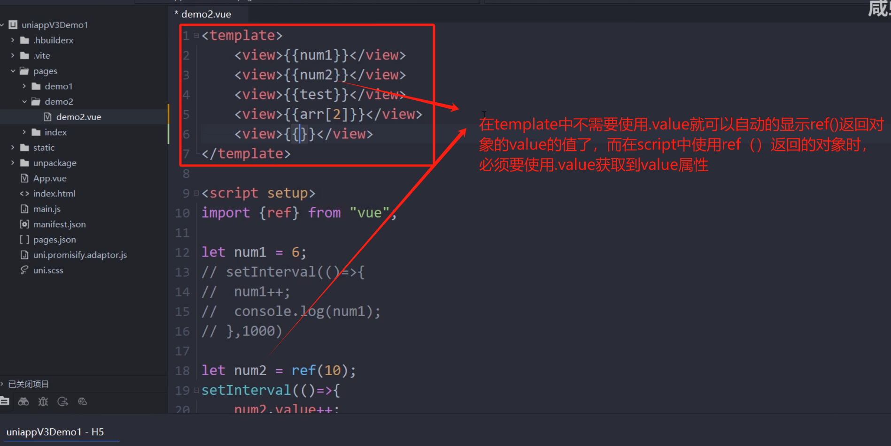

# Vue3

## 参考：

https://www.bilibili.com/video/BV1Yg4y127Fp?spm_id_from=333.788.videopod.episodes&vd_source=d6367c1fc21883823f1fb738f86ef26e&p=21

### 1 入门 hello world

data是一个函数，使用到的是他的返回值（一个data对象）：

### 2 选项式与组合式api

### 3 使用ref()实现响应式

使用目的：实现响应式

其他的不会展示在页面上的数据可以定义普通变量来使用。

#### 3.1 使用流程：

1:

2:

#### 3.2 注意

### 4 设置Vue3文件的模板

解释：

1

~~~vue
<template>
  <view class=""> 

  </view>
</template>

~~~

### 5 template标签的使用

效果：

### 6 v-if的易错点

### 7 v-for中 :key的易错点

vue3的基础main.js文件：

~~~js
// main.js
import { createApp } from "vue";
import App from "./App.vue"; // 根组件

// 创建 Vue 应用实例
const app = createApp(App);
// 挂载应用到 DOM
app.mount("#app");
~~~

## 学习进度：

https://www.bilibili.com/video/BV1Yg4y127Fp?spm_id_from=333.788.videopod.episodes&vd_source=d6367c1fc21883823f1fb738f86ef26e&p=21

