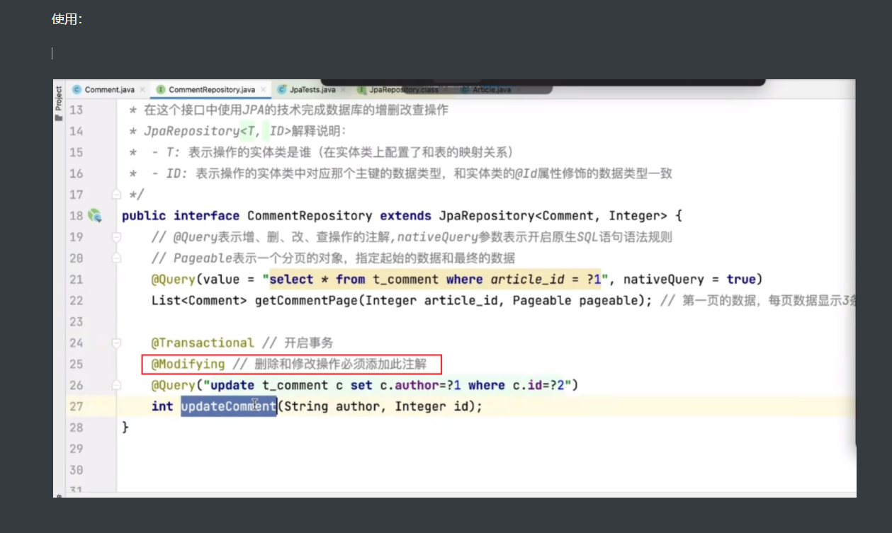

# JPA

## 配置

### 显示执行的sql

如何查看JPA执行save方法时具体sql日志

~~~yaml
spring:
  jpa:
    database-platform: org.hibernate.dialect.MySQL5InnoDBDialect
    hibernate:
      ddl-auto: validate
      show-sql: true
      properties:
        hibernate:
          format_sql: true

logging:
  level:
    org:
      hibernate:
        SQL: DEBUG
        type:
          descriptor:
            sql:
              BasicBinder: TRACE
~~~


## 使用思路


### 简单查询：

#### 使用dao自带的方法 

配置好表关系（多对多等），可以方便的使用dao自带的方法，去查询出有关系的（注解配置后）其他DO对象


#### 根据方法名自动生成相应sql的方法

~~~java
@Repository
public interface InvoiceOrFolderDao extends JpaRepository<InvoiceOrFolder,Long>{
    /**
     * 根据 发票号码 列表查询所有匹配的 InvoiceOrFolder
     * @param invoiceNumberList
     * @return
     */
    List<InvoiceOrFolder> findByInvoiceNumberIn(List<String> invoiceNumberList);

}
~~~


#### 使用注解来写原生sql：



实际使用：

~~~java
@Repository
public interface InvoiceOrFolderDao extends JpaRepository<InvoiceOrFolder,Long>, JpaSpecificationExecutor<InvoiceOrFolder> {

    @Query(value = "select max(sort_number) from tbl_oaex_invoices i where i.parent_id = ?1",nativeQuery = true)
    int getMaxSortNumberByFolderId(Long folderId);

}
~~~


### 复杂查询：

#### 1）使用类似MP的条件构造 

~~~java
public ResultVO<List<InvoiceFolderVO>> getInvoiceFolder(Long userId, String departmentName, String userName, Date startTime, Date endTime, Boolean isOver, Integer reimbursementCategory) {

        // 根据发票表有的字段构建动态查询条件
        Specification<InvoiceOrFolder> specification = (root, query, criteriaBuilder) -> {
            List<javax.persistence.criteria.Predicate> predicates = new ArrayList<>();

            if (Objects.nonNull(userId)) {
                // 使用驼峰命名法来写，而不是数据库的字段名称
                predicates.add(criteriaBuilder.equal(root.get("createBy"), userId));
            }
            if (Objects.nonNull(startTime)) {
                predicates.add(criteriaBuilder.greaterThanOrEqualTo(root.get("createAt"), startTime));
            }
            if (Objects.nonNull(endTime)) {
                predicates.add(criteriaBuilder.lessThanOrEqualTo(root.get("createAt"), endTime));
            }
            if (Objects.nonNull(isOver)) {
                predicates.add(criteriaBuilder.equal(root.get("isOver"), isOver));
            }
            if (Objects.nonNull(reimbursementCategory)) {
                predicates.add(criteriaBuilder.equal(root.get("reimbursementCategory"), reimbursementCategory));
            }
            // 查询根文件夹
            predicates.add(criteriaBuilder.isNull(root.get("parentId")));
            // 将条件列表转换为 `Predicate` 数组，并生成 `and` 条件
            return criteriaBuilder.and(predicates.toArray(new javax.persistence.criteria.Predicate[0]));
        };

        // 多条件查询根文件夹信息
        List<InvoiceOrFolder> invoiceFolders = invoiceOrFolderDao.findAll(specification);
}
~~~


#### 2）使用原生sql语句 this.findAll()

继承PersistenceContextService类：

~~~java
public class StatisticServiceImpl extends PersistenceContextService implements StatisticService {
    // 在某个方法中使用
    List<Map<String, Object>> oneList = this.findAll(durationSql.toString());
}
~~~


~~~java
public abstract class PersistenceContextService {

    @PersistenceContext
    protected EntityManager _entityManager;

    /**
     * 通过原生 SQL 查询返回 List<Map> - 多条记录
     *
     * @param sql 原生 SQL 语句
     * @return List<Map<String, Object>>
     */
    @SuppressWarnings("unchecked")
    public List<Map<String, Object>> findAll(String sql) {
        return createResultMapQuery(sql).getResultList();
    }
    

    /**
     * 通过原生 SQL 分页查询返回 List<Map> - 多条记录
     *
     * @param sql 原生 SQL 语句
     * @param pageable Pageable
     * @return List<Map<String, Object>>
     */
    @SuppressWarnings("unchecked")
    public List<Map<String, Object>> findAll(String sql, Pageable pageable) {
        Query query = createResultMapQuery(sql);
        query.setFirstResult((int) pageable.getOffset());
        query.setMaxResults(pageable.getPageSize());
        return query.getResultList();
    }

    /**
     * 通过原生 SQL 查询返回 Map - 单条记录
     *
     * @param sql 原生 SQL 语句
     * @return Map<String, Object>
     */
    @SuppressWarnings("unchecked")
    public Map<String, Object> findOne(String sql) {
        Query query = createResultMapQuery(sql);
        return (Map<String, Object>) query.getSingleResult();
    }

    /**
     * 创建 Map 查询结果转换器
     *
     * @param sql 原生 SQL 语句
     * @return {@link Query}
     */
    private Query createResultMapQuery(String sql) {
        Query query = _entityManager.createNativeQuery(sql);
        query.unwrap(SQLQuery.class).setResultTransformer(Transformers.ALIAS_TO_ENTITY_MAP);
        return query;
    }

    /**
     * 通过原生 SQL 更新数据
     * @param sql
     * @return
     */
    public int update(String sql) {
        Query query = createResultMapQuery(sql);
        return query.executeUpdate();
    }

    @Transactional
    public Long insertAndGetId(String sql) {
        java.sql.Connection connection = _entityManager.unwrap(SessionImpl.class).connection();
        try {
            PreparedStatement statement = connection.prepareStatement(sql,
                    Statement.RETURN_GENERATED_KEYS);
            int affectedRows = statement.executeUpdate();
            if (affectedRows > 0) {
                try (ResultSet rs = statement.getGeneratedKeys()) {
                    if (rs.next()) {
                        return rs.getLong(1);
                    }
                }
            }
        } catch (SQLException e) {
            // 处理异常
            e.printStackTrace();
        }
        return null;
    }
}

~~~


其他：

使用JpaRepository + @Query注解


## 目录

SpringData JPA笔记: https://blog.csdn.net/DDDDeng_/article/details/108197565

分开的笔记总结：

https://blog.csdn.net/nanhuaibeian/article/details/107239604


https://blog.csdn.net/nanhuaibeian/article/details/107281370


## 继承JpaRepository


https://blog.csdn.net/nanhuaibeian/article/details/107295124


### 完成crud操作

参考：https://www.bilibili.com/video/BV1s3411c7Mh/?spm_id_from=333.788.recommend_more_video.7&vd_source=d6367c1fc21883823f1fb738f86ef26e


#### 基础：


#### 使用：


#### 根据方法名来执行sql


## 其他


## 多表处理

更多代码：见：


### 一对多：配置一对多和多对一


#### 配置实体类

配置主表的实体类：


​	

~~~java
@Entity
@Table(name = "tbl_oaex_invoices")
public class InvoiceOrFolder implements Serializable {

    /**
     * 主键ID
     */
    @Id
    @GeneratedValue(strategy = GenerationType.IDENTITY)
    @Column(name = "id")
    private Long id;

    @ManyToOne(fetch = FetchType.EAGER, cascade=CascadeType.PERSIST)
    @JoinColumn(name = "parentId")
    private InvoiceOrFolder parentFolder;

    @OneToMany(targetEntity=InvoiceOrFolder.class,
            cascade=CascadeType.ALL,
            orphanRemoval=true,
            mappedBy="parentFolder")
    @Fetch(FetchMode.JOIN)
    private Set<Department> children;

}
~~~


外键名称就是公司表的建表sql的外键名称

配置从表的实体类：


#### dao层操作：

#### 保存例子：

##### 在主表中配置关系：


sql：


##### 在从表中配置关系：


结果：


##### 主表与从表都进行配置：

两个表都配置了对外键进行维护（体现在实体类的JPA注解），并且在使用时都配置了各种的关系（体现在代码中对集合添加元素）


解决方法：


具体操作：


customer即为图中的customer：


结果：


#### 级联操作

级联介绍：


##### 级联删除：


在主表上进行配置：


修改配置文件中的启动方式：


使用：


结果：


##### 级联增加：

配置：


使用：


结果：


### 多对多

步骤：


#### 设置实体类：

设置Set集合(推荐)与配置映射关系：

设置User实体类：


设置Role实体类：


#### 使用：


#### 注意：两个表都配置了对外键进行维护（体现在实体类的JPA注解），并且在使用时都配置了各种的关系（体现在代码中对集合添加元素）


解决：

**多对多放弃维护权**：被动的一方放弃（谁被选择就放弃谁的维护关系）

这里是用户选择角色，所以要放弃角色的维护关系：


改完后再次执行代码，程序正常运行：


#### 级联操作

与一对多关系的使用一样，参考上面即可。


#### 对象导航查询


查询一个对象的同时，通过此对象查询他的关联对象（调用此对象的get方法）

效果：


##### 懒加载

懒加载：


##### 配置为立即加载


修改配置，将延迟加载（懒加载）改为立即加载（不推荐）

fetch,需要配置到多表映射关系的注解上


执行的sql如下：


##### 从多方查询一方

从员工处查询公司，默认使用的是立即加载的形式：


#### 最佳实践

参考：https://www.51cto.com/article/768852.html


## 实践


### 根据传入的字段列表批量查找

~~~java
import org.springframework.data.jpa.repository.JpaRepository;
import org.springframework.data.jpa.repository.Query;
import org.springframework.data.repository.query.Param;
import java.util.List;

public interface InvoiceOrFolderDao extends JpaRepository<InvoiceOrFolder, Long> {

    // 方法 1: 根据 travelNumber 列表查询所有匹配的 InvoiceOrFolder
    // 这个方法是 JPA Repository 提供的功能，可以根据传入的 `travelNumber` 列表批量查找所有匹配的记录。这样可以一次性获取所有已存在的 `InvoiceOrFolder`，然后与输入的 `trainList` 进行比较。
    List<InvoiceOrFolder> findByTravelNumberIn(List<String> travelNumbers);

    // 方法 2: 仅返回存在的 travelNumber 集合（如果数据库中存在该字段的唯一索引）
    // 自定义 JPQL 查询： findExistingTravelNumbers 方法使用了 JPQL 查询，只返回存在的 travelNumber 集合，可以提高查询效率。
    @Query("SELECT i.travelNumber FROM InvoiceOrFolder i WHERE i.travelNumber IN :travelNumbers")
    List<String> findExistingTravelNumbers(@Param("travelNumbers") List<String> travelNumbers);
}

~~~


Spring Data JPA 通过解析方法名来自动生成 SQL 查询语句。方法名必须遵循以下模式：

```
findBy + 属性名 + 关键词
```

在你的例子中：

- `findBy`: 表示查询，前缀可以是 `findBy`, `readBy`, `getBy` 等。
- `TravelNumber`: 表示你要查询的实体类 `InvoiceOrFolder` 中的字段名（属性名），这个字段名是大小写敏感的，必须与实体类中的属性名一致。
- `In`: 表示关键词，通常用于列表类型的查询，表示 `WHERE travelNumber IN (...)` 这样的 SQL 语句。

因此，`findByTravelNumberIn(List<String> travelNumbers)` 会被自动解析为如下 SQL 语句：

```mysql

SELECT * FROM invoice_or_folder WHERE travel_number IN (..传入的travelNumber列表..);
```

### 2. **JPA Repository 方法解析规则**：

Spring Data JPA 支持以下几种常用查询关键词，可以基于这些关键词自动生成查询：

- `And`：表示多个条件查询，如 `findByFirstNameAndLastName`
- `Or`：表示 OR 条件，如 `findByFirstNameOrLastName`
- `In`：表示集合查询，如 `findByTravelNumberIn`
- `Between`：表示范围查询，如 `findByStartDateBetween`
- `LessThan` / `GreaterThan`：表示小于、大于查询
- `Like` / `Containing` / `StartsWith` / `EndsWith`：模糊查询关键词


## 文件夹例子

使用@Data导致栈一出


为了直观展示 `@ManyToOne` 和 `@OneToMany` 之间的父子关系和级联操作如何运作，我们可以用一个简单的代码例子来模拟这些关系。这个例子将创建父子关系的 `InvoiceOrFolder` 实体，并展示通过保存父实体时自动级联保存子实体的操作，以及删除时如何处理孤儿对象的行为。

### 1. **修改实体类**
注意：由于你在 `children` 字段中定义的目标实体类是 `Department` 而不是 `InvoiceOrFolder`，我会对其稍微修改一下以便展示其作用，或者可以统一成 `InvoiceOrFolder`，根据实际情况调整。

```java
@Entity
@Table(name = "tbl_oaex_invoices")
public class InvoiceOrFolder implements Serializable {

    @Id
    @GeneratedValue(strategy = GenerationType.IDENTITY)
    @Column(name = "id")
    private Long id;

    private String name;

    // 父文件夹（多对一关系）
    @ManyToOne(fetch = FetchType.EAGER, cascade = CascadeType.PERSIST)
    @JoinColumn(name = "parentId")
    private InvoiceOrFolder parentFolder;

    // 子文件夹集合（一个文件夹可以有多个子文件夹）
    @OneToMany(targetEntity = InvoiceOrFolder.class,
               cascade = CascadeType.ALL,
               orphanRemoval = true,
               mappedBy = "parentFolder")
    @Fetch(FetchMode.JOIN)
    private Set<InvoiceOrFolder> children = new HashSet<>();

    // Getter 和 Setter
    public Long getId() {
        return id;
    }

    public void setId(Long id) {
        this.id = id;
    }

    public String getName() {
        return name;
    }

    public void setName(String name) {
        this.name = name;
    }

    public InvoiceOrFolder getParentFolder() {
        return parentFolder;
    }

    public void setParentFolder(InvoiceOrFolder parentFolder) {
        this.parentFolder = parentFolder;
    }

    public Set<InvoiceOrFolder> getChildren() {
        return children;
    }

    public void setChildren(Set<InvoiceOrFolder> children) {
        this.children = children;
    }

    @Override
    public String toString() {
        return "InvoiceOrFolder{id=" + id + ", name='" + name + "'}";
    }
}
```

### 2. **定义 Repository 接口**
定义 `InvoiceOrFolderRepository` 接口来管理数据操作：

```java
import org.springframework.data.jpa.repository.JpaRepository;

public interface InvoiceOrFolderRepository extends JpaRepository<InvoiceOrFolder, Long> {
}
```

### 3. **Service 层的实现**
定义 `InvoiceOrFolderService`，实现创建和级联保存的逻辑：

```java
import org.springframework.beans.factory.annotation.Autowired;
import org.springframework.stereotype.Service;

import javax.transaction.Transactional;
import java.util.HashSet;
import java.util.Set;

@Service
public class InvoiceOrFolderService {

    @Autowired
    private InvoiceOrFolderRepository repository;

    @Transactional
    public InvoiceOrFolder createFolderWithChildren() {
        // 创建父文件夹
        InvoiceOrFolder parentFolder = new InvoiceOrFolder();
        parentFolder.setName("Parent Folder");

        // 创建子文件夹 1
        InvoiceOrFolder child1 = new InvoiceOrFolder();
        child1.setName("Child Folder 1");
        child1.setParentFolder(parentFolder); // 设置父子关系

        // 创建子文件夹 2
        InvoiceOrFolder child2 = new InvoiceOrFolder();
        child2.setName("Child Folder 2");
        child2.setParentFolder(parentFolder); // 设置父子关系

        // 将子文件夹添加到父文件夹的 children 集合中
        Set<InvoiceOrFolder> children = new HashSet<>();
        children.add(child1);
        children.add(child2);
        parentFolder.setChildren(children);

        // 保存父文件夹（自动级联保存子文件夹）
        return repository.save(parentFolder);
    }

    @Transactional
    public void deleteFolder(Long parentId) {
        repository.deleteById(parentId);
    }

    public InvoiceOrFolder findById(Long id) {
        return repository.findById(id).orElse(null);
    }
}
```

### 4. **Controller 层的实现**
创建 `InvoiceOrFolderController`，提供一个接口来触发上述的操作：

```java
import org.springframework.beans.factory.annotation.Autowired;
import org.springframework.web.bind.annotation.*;

@RestController
@RequestMapping("/invoice")
public class InvoiceOrFolderController {

    @Autowired
    private InvoiceOrFolderService service;

    // 创建文件夹及其子文件夹
    @GetMapping("/create")
    public InvoiceOrFolder createFolderWithChildren() {
        return service.createFolderWithChildren();
    }

    // 根据 ID 查找文件夹
    @GetMapping("/{id}")
    public InvoiceOrFolder getFolder(@PathVariable Long id) {
        return service.findById(id);
    }

    // 删除文件夹
    @DeleteMapping("/delete/{id}")
    public String deleteFolder(@PathVariable Long id) {
        service.deleteFolder(id);
        return "Folder with ID " + id + " and its children deleted successfully!";
    }
}
```

### 5. **运行结果分析**

启动项目后，访问以下接口来测试 CRUD 操作。

#### 5.1 创建文件夹及子文件夹

- **访问 URL**: `http://localhost:8080/invoice/create`
- **操作说明**: 调用 `createFolderWithChildren()` 方法，生成一个名为 "Parent Folder" 的父文件夹，并自动级联保存其两个子文件夹 "Child Folder 1" 和 "Child Folder 2"。
- **生成的数据库记录**:

| ID   | Name           | ParentId |
| ---- | -------------- | -------- |
| 1    | Parent Folder  | NULL     |
| 2    | Child Folder 1 | 1        |
| 3    | Child Folder 2 | 1        |

- **控制台输出**:
```plaintext
InvoiceOrFolder{id=1, name='Parent Folder'}
InvoiceOrFolder{id=2, name='Child Folder 1'}
InvoiceOrFolder{id=3, name='Child Folder 2'}
```

#### 5.2 根据 ID 查找父文件夹及其子文件夹

- **访问 URL**: `http://localhost:8080/invoice/1`
- **返回结果**:

```json
{
  "id": 1,
  "name": "Parent Folder",
  "parentFolder": null,
  "children": [
    {
      "id": 2,
      "name": "Child Folder 1",
      "parentFolder": 1
    },
    {
      "id": 3,
      "name": "Child Folder 2",
      "parentFolder": 1
    }
  ]
}
```

#### 5.3 删除父文件夹及其子文件夹

- **访问 URL**: `http://localhost:8080/invoice/delete/1`
- **操作说明**: 删除父文件夹时，JPA 会自动级联删除其所有子文件夹，因为我们在 `@OneToMany` 中指定了 `orphanRemoval = true`。

- **删除后的数据库记录**: 

| ID                     | Name | ParentId |
| ---------------------- | ---- | -------- |
|                        |      |          |
| （所有记录均已被删除） |      |          |

- **返回结果**: `"Folder with ID 1 and its children deleted successfully!"`

### 6. **工作原理分析**
- 当调用 `service.createFolderWithChildren()` 时：
  1. 创建父 `InvoiceOrFolder` 实体。
  2. 创建子 `InvoiceOrFolder` 实体并设置 `parentFolder`。
  3. 将子实体添加到父实体的 `children` 集合中。
  4. 调用 `save(parentFolder)` 时，JPA 会**级联保存**子文件夹，因为 `cascade = CascadeType.ALL`。
  
- 当调用 `service.deleteFolder()` 时：
  1. 删除父文件夹时，JPA 会级联删除其子文件夹，并自动移除这些孤儿对象。

这种设计非常适合用来表示目录结构、树形结构等层次关系的数据。如果你还有更多想深入讨论的地方，可以继续交流！
