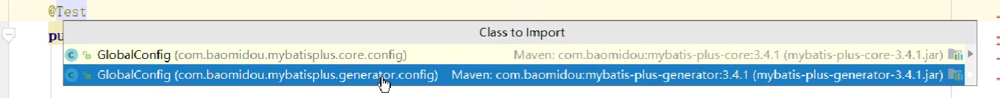
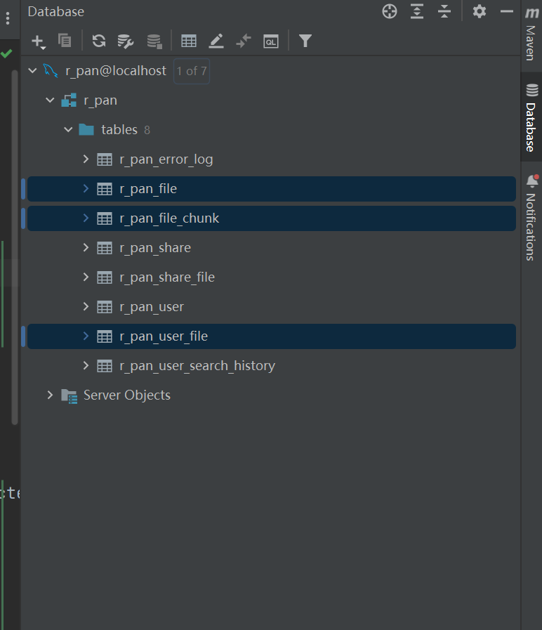
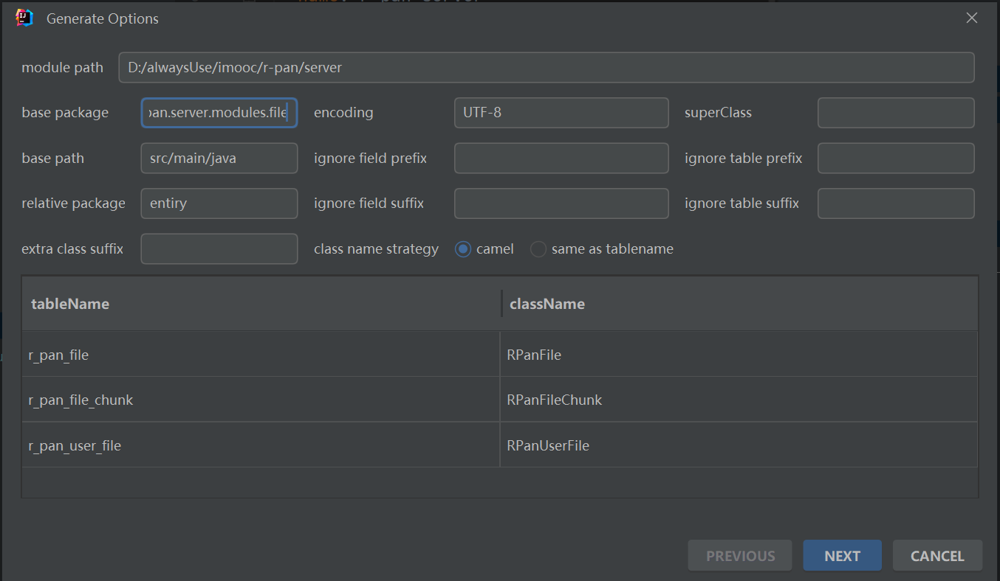
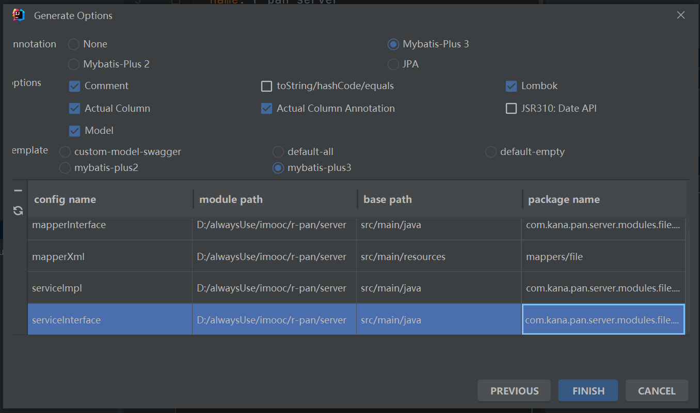
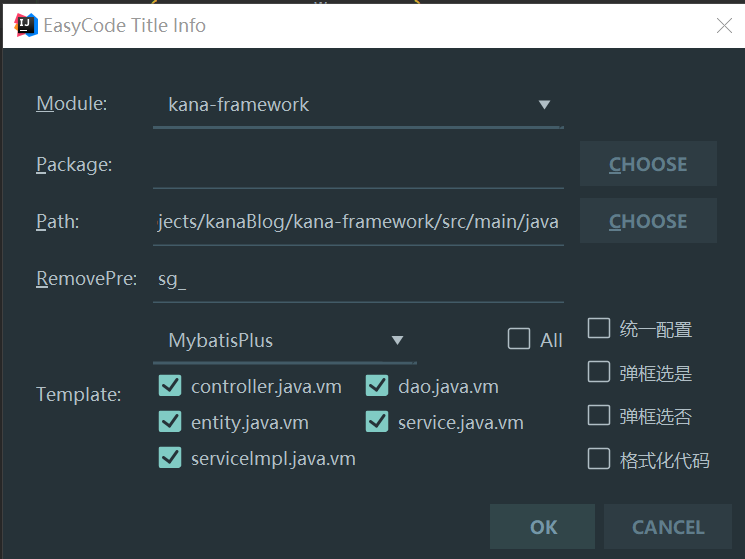

# MP的使用

## 1.简介：

MybatisPlus是一款Mybatis增强工具，用于简化开发，提高效率。  它在 MyBatis 的基础上只做增强不做改变，为简化开发、提高效率而生。 

​	官网： https://mp.baomidou.com/ 

## 2.快速入门

### 2.0 准备工作

#### ①准备数据

~~~~mysql
CREATE TABLE `user` (
  `id` bigint(20) NOT NULL AUTO_INCREMENT COMMENT 'id',
  `user_name` varchar(20) NOT NULL COMMENT '用户名',
  `password` varchar(20) NOT NULL COMMENT '密码',
  `name` varchar(30) DEFAULT NULL COMMENT '姓名',
  `age` int(11) DEFAULT NULL COMMENT '年龄',
  `address` varchar(100) DEFAULT NULL COMMENT '地址',
  PRIMARY KEY (`id`)
) ENGINE=InnoDB AUTO_INCREMENT=5 DEFAULT CHARSET=utf8;

insert  into `user`(`id`,`user_name`,`password`,`name`,`age`,`address`) values (1,'ruiwen','123','瑞文',12,'山东'),(2,'gailun','1332','盖伦',13,'平顶山'),(3,'timu','123','提姆',22,'蘑菇石'),(4,'daji','1222','妲己',221,'狐山');
~~~~

#### ②创建SpringBoot工程

##### 添加依赖

~~~~xml
    <parent>
        <groupId>org.springframework.boot</groupId>
        <artifactId>spring-boot-starter-parent</artifactId>
        <version>2.5.0</version>
    </parent>
    <dependencies>
        <dependency>
            <groupId>org.springframework.boot</groupId>
            <artifactId>spring-boot-starter-web</artifactId>
        </dependency>
        <dependency>
            <groupId>org.projectlombok</groupId>
            <artifactId>lombok</artifactId>
            <optional>true</optional>
        </dependency>
        <dependency>
            <groupId>org.springframework.boot</groupId>
            <artifactId>spring-boot-starter-test</artifactId>
            <scope>test</scope>
        </dependency>
    </dependencies>
~~~~

##### 创建启动类

~~~~java
@SpringBootApplication
public class SGApplication {

    public static void main(String[] args) {
        SpringApplication.run(SGApplication.class);
    }
}

~~~~


#### ③准备实体类

~~~~java
@Data
@NoArgsConstructor
@AllArgsConstructor
public class User {
    private Long id;
    private String userName;
    private String password;
    private String name;
    private Integer age;
    private String address;
}
~~~~


### 2.1 使用MybatisPlus

#### ①添加依赖

~~~~xml
        <dependency>
            <groupId>com.baomidou</groupId>
            <artifactId>mybatis-plus-boot-starter</artifactId>
            <version>3.4.3</version>
        </dependency>
        <dependency>
            <groupId>mysql</groupId>
            <artifactId>mysql-connector-java</artifactId>
        </dependency>
~~~~


#### ②配置数据库信息

~~~~yaml
spring:
  datasource:
    url: jdbc:mysql://localhost:3306/mp_db?characterEncoding=utf-8&serverTimezone=UTC
    username: root
    password: root
    driver-class-name: com.mysql.cj.jdbc.Driver
~~~~


#### ③创建Mapper接口

创建Mapper接口继承BaseMapper接口

~~~~java
public interface UserMapper extends BaseMapper<User> {
}
~~~~

BaseMapper接口中已经提供了很多常用方法。所以我们只需要直接从容器中获取Mapper就可以进行操作了，不需要自己去编写Sql语句。


#### ④配置Mapper扫描

​	在启动类上配置我们的Mapper在哪个包。

~~~~java
@SpringBootApplication
@MapperScan("com.sangeng.mapper")
public class SGApplication {
    public static void main(String[] args) {
        SpringApplication.run(SGApplication.class,args);
    }
}

~~~~


#### ⑤获取Mapper进行测试

~~~~java
@SpringBootTest
public class MPTest {

    @Autowired
    private UserMapper userMapper;

    @Test
    public void testQueryList(){
        System.out.println(userMapper.selectList(null));
    }

}

~~~~


## 3.常用设置

### 配置文件汇总：

~~~yml
spring:
  datasource: # 配置连接数据库的相关信息
    url: jdbc:mysql://localhost:3306/mp_db?characterEncoding=utf-8&serverTimezone=UTC
    username: root
    password: root
    driver-class-name: com.mysql.cj.jdbc.Driver
mybatis-plus:
  configuration:
    # 配置日志实现类
    log-impl: org.apache.ibatis.logging.stdout.StdOutImpl
  global-config:
    db-config:
		# 逻辑删除相关的设置
      logic-delete-field: delFlag
      logic-delete-value: 1
      logic-not-delete-value: 0
		# 设置id增长类型为自动递增
      id-type: auto
~~~

### 3.1 设置表映射规则

​	默认情况下MP操作的表名就是实体类的类名，但是如果表名和类名不一致就需要我们自己设置映射规则。

#### 3.1.1 单独设置

​	可以在实体类的类名上加上@TableName注解进行标识。

例如：

​	如果表名是tb_user，而实体类名是User则可以使用以下写法。

~~~~java
@TableName("tb_user")
public class User {
	//....
}

~~~~


#### 3.1.2 全局设置表名前缀

​	一般一个项目表名的前缀都是统一风格的，这个时候如果一个个设置就太麻烦了。我们可以通过配置来设置全局的表名前缀。

例如：

​	如果一个项目中所有的表名相比于类名都是多了个前缀： `tb_` 。这可以使用如下方式配置

~~~~yml
mybatis-plus:
  global-config:
    db-config:
      #表名前缀
      table-prefix: tb_
~~~~


### 3.2 设置主键生成策略

#### 3.2.0 测试代码

~~~~java
    @Test
    public void testInsert(){
        User user = new User();
        user.setUserName("三更草堂222");
        user.setPassword("7777");
        int r = userMapper.insert(user);
        System.out.println(r);
    }
~~~~


#### 3.2.1 单独设置

​	默认情况下使用MP插入数据时，如果在我们没有设置主键生成策略的情况下**默认的策略是基于雪花算法的自增id。**

​	如果我们需要使用别的策略可以在定义实体类时，在代表主键的字段上加上`@TableId`注解，使用其`type`属性指定主键生成策略。

例如：

​	我们要设置主键自动增长则可以设置如下

~~~~java
@Data
@NoArgsConstructor
@AllArgsConstructor
public class User {
    @TableId(type = IdType.AUTO)
    private Long id;
	//.....
}

~~~~


​	全部主键策略定义在了枚举类`IdType`中，`IdType`有如下的取值

- `AUTO`

  数据库ID自增，**依赖于数据库**。**注意**：该类型请确保数据库设置了 ID自增 否则无效

  

- `NONE`

  未设置主键类型。若在代码中没有手动设置主键，则会根据**主键的全局策略**自动生成（**默认的主键全局策略是基于雪花算法的自增ID**）

  

- `INPUT`

  需要手动设置主键，若不设置。插入操作生成SQL语句时，主键这一列的值会是`null`。

  

- `ASSIGN_ID`

  当没有手动设置主键，即实体类中的主键属性为空时，才会自动填充，使用雪花算法

  

- `ASSIGN_UUID`

  当实体类的主键属性为空时，才会自动填充，使用UUID


#### 3.2.2 全局设置

~~~~yaml
mybatis-plus:
  global-config:
    db-config:
      # id生成策略 auto为数据库自增
      id-type: auto
~~~~


### 3.3 设置字段映射关系

​	默认情况下MP会根据实体类的属性名去映射表的列名。

​	如果数据库的列表和实体类的属性名不一致了我们可以使用`@TableField`注解的`value`属性去设置映射关系。

​	

例如：

​	如果表中一个列名叫 address而 实体类中的属性名为addressStr则可以使用如下方式进行配置。

~~~~java
    @TableField("address")
    private String addressStr;
~~~~


### 3.4 设置字段和列名的驼峰映射

​	默认情况下MP会开启字段名列名的驼峰映射， 即从经典数据库列名 A_COLUMN（下划线命名） 到经典 Java 属性名 aColumn（驼峰命名） 的类似映射 。

​	如果需要关闭我们可以使用如下配置进行关闭。

~~~~yaml
mybatis-plus:
  configuration:
	#是否开启自动驼峰命名规则（camel case）映射，即从经典数据库列名 a_column（下划线命名） 到经典 Java 属性名 aColumn（驼峰命名） 的类似映射
    map-underscore-to-camel-case: false
~~~~


### 3.5 日志

​	如果需要打印MP操作对应的SQL语句等，可以配置日志输出。

配置方式如下：

~~~~yml
mybatis-plus:
  configuration:
    # 日志
    log-impl: org.apache.ibatis.logging.stdout.StdOutImpl
~~~~


## 4.基本使用

### 4.1 插入操作

​	我们可以使用insert方法来实现数据的插入。

示例：

~~~~java
    @Test
    public void testInsert(){
        User user = new User();
        user.setUserName("三更草堂333");
        user.setPassword("7777888");
        int r = userMapper.insert(user);
        System.out.println(r);
    }
~~~~


### 4.2 删除操作

​	我们可以使用**deleteXXX**方法来实现数据的删除。

- deleteById(id),传入一个id，删除这个id,sql: dehete from table where id = ?
- deleteBatchIds(ids),传入一个集合ids,删除这些id,sql: dehete from table where id in (?,?,?)
- deleteByMap(map),传入一个map集合，根据map的键值对进行删除，sql:dehete from table where key1 = value1 **and** key2 = value2

示例：

~~~~java
    @Test
    public void testDelete(){
        List<Integer> ids = new ArrayList<>();
        ids.add(5);
        ids.add(6);
        ids.add(7);
        int i = userMapper.deleteBatchIds(ids);
        System.out.println(i);
    }
    @Test
    public void testDeleteById(){
        int i = userMapper.deleteById(8);
        System.out.println(i);
    }
    @Test
    public void testDeleteByMap(){
        Map<String, Object> map = new HashMap<>();
        map.put("name","提姆");
        map.put("age",22);
        int i = userMapper.deleteByMap(map);
        System.out.println(i);
    }
~~~~


### 4.3 更新操作

​	我们可以使用**updateXXX**方法来实现数据的删除。

示例：

~~~~java
    @Test
    public void testUpdate(){
        //把id为2的用户的年龄改为14
        User user = new User();
        user.setId(2L);
        user.setAge(14);
        int i = userMapper.updateById(user);
        System.out.println(i);
    }
~~~~


## 5.条件构造器Wrapper（查询与更新）

**基本格式**：mapper.selectList(queryWrapper),根据queryWrapper构建的条件进行查询。

### 5.1 概述

​	我们在实际操作数据库的时候会涉及到很多的条件。所以MP为我们提供了一个功能强大的**条件构造器 `Wrapper`** 。使用它可以让我们非常方便的构造条件。

​	其继承体系如下：

​	

​	在其子类**AbstractWrapper**中提供了**很多用于构造Where条件**的方法。

​	`AbstractWrapper`的子类`QueryWrapper`则额外提供了用于针对Select语法的`select`方法。可以用来设置查询哪些列。

​	`AbstractWrapper`的子类`UpdateWrapper`则额外提供了用于针对SET语法的`set`方法。可以用来设置对哪些列进行更新。


​	完整的AbstractWrapper方法可以参照：https://baomidou.com/guide/wrapper.html#abstractwrapper


介绍是用来干什么的。它的实现类有哪些

QueryWrapper,UpdateWrapper，【LambdaQueryWrapper】


### 5.2 常用AbstractWrapper方法(通用)

> eq：equals，等于
> gt：greater than ，大于 >
> ge：greater than or equals，大于等于≥
> lt：less than，小于<
> le：less than or equals，小于等于≤
> between：相当于SQL中的BETWEEN
> like：模糊匹配。like("name","黄")，相当于SQL的name like '%黄%'
> likeRight：模糊匹配右半边。likeRight("name","黄")，相当于SQL的name like '黄%'
> likeLeft：模糊匹配左半边。likeLeft("name","黄")，相当于SQL的name like '%黄'
> notLike：notLike("name","黄")，相当于SQL的name not like '%黄%'
> isNull
> isNotNull
> and：SQL连接符AND
> or：SQL连接符OR
>
> in: in(“age",{1,2,3})相当于 age in(1,2,3)
>
> groupBy: groupBy("id","name")相当于 group by id,name
>
> orderByAsc :orderByAsc("id","name")相当于 order by id ASC,name ASC
>
> orderByDesc :orderByDesc ("id","name")相当于 order by id DESC,name DESC


#### 示例一

SQL语句如下： 

~~~~mysql
SELECT 
	id,user_name,PASSWORD,NAME,age,address 
FROM 
	USER 
WHERE 
	age > 18 AND address = '狐山'
~~~~

如果用Wrapper写法如下：

~~~~java
    @Test
    public void testWrapper01(){
        QueryWrapper wrapper = new QueryWrapper();
        wrapper.gt("age",18);
        wrapper.eq("address","狐山");
        List<User> users = userMapper.selectList(wrapper);
        System.out.println(users);
    }
~~~~


#### 示例二

SQL语句如下：

~~~~mysql
SELECT 
	id,user_name,PASSWORD,NAME,age,address 
FROM 
	USER 
WHERE 
	id IN(1,2,3) AND 
	age BETWEEN 12 AND 29 AND 
	address LIKE '%山%'
~~~~


如果用Wrapper写法如下：

~~~~java
    @Test
    public void testWrapper02(){
        QueryWrapper<User> wrapper = new QueryWrapper<>();
        wrapper.in("id",1,2,3);
        wrapper.between("age",12,29);
        wrapper.like("address","山");
        List<User> users = userMapper.selectList(wrapper);
        System.out.println(users);
    }
~~~~


#### 示例三

SQL语句如下：

~~~~mysql
SELECT 
	id,user_name,PASSWORD,NAME,age,address 
FROM 
	USER 
WHERE 
	id IN(1,2,3) AND 
	age > 10 
ORDER BY 
	age DESC
~~~~

如果用Wrapper写法如下：

~~~~java
    @Test
    public void testWrapper03(){
        QueryWrapper<User> queryWrapper = new QueryWrapper<>();
        queryWrapper.in("id",1,2,3);
        queryWrapper.gt("age",10);
        queryWrapper.orderByDesc("age");
        List<User> users = userMapper.selectList(queryWrapper);
        System.out.println(users);
    }
~~~~


### 5.3 常用QueryWrapper方法(select方法)

 	QueryWrapper的 select 可以设置要查询的列。


#### 示例一 

> select(String... sqlSelect) 方法的测试为要查询的列名

SQL语句如下：

~~~~mysql
SELECT 
	id,user_name
FROM 
	USER 
~~~~

MP写法如下：

~~~~java
    @Test
    public void testSelect01(){
        QueryWrapper<User> queryWrapper = new QueryWrapper<>();
        queryWrapper.select("id","user_name");
        List<User> users = userMapper.selectList(queryWrapper);
        System.out.println(users);
    }
~~~~


#### 示例二

> `select(Class<T> entityClass, Predicate<TableFieldInfo> predicate)`

方法的第一个参数为实体类的字节码对象，第二个参数为Predicate类型，可以使用lambda的写法，过滤要查询的字段 (**主键除外**) 。


SQL语句如下：

~~~~mysql
SELECT 
	id,user_name
FROM 
	USER 
~~~~

MP写法如下：

~~~~java
    @Test
    public void testSelect02(){
        QueryWrapper<User> queryWrapper = new QueryWrapper<>();
        queryWrapper.select(User.class, new Predicate<TableFieldInfo>() {
            @Override
            public boolean test(TableFieldInfo tableFieldInfo) {
                // 表的字段等于user_name的才进行查询
                return "user_name".equals(tableFieldInfo.getColumn());
            }
        });
        List<User> users = userMapper.selectList(queryWrapper);
        System.out.println(users);
    }
~~~~


#### 示例三

> select(Predicate<TableFieldInfo> predicate)

方法第一个参数为Predicate类型，可以使用lambda的写法，过滤要查询的字段 (**主键除外**) 。


SQL语句如下：

~~~~mysql
SELECT 
	id,user_name,PASSWORD,NAME,age 
FROM 
	USER
~~~~

就是不想查询address这列，其他列都查询了


MP写法如下：

~~~~java
    @Test
    public void testSelect03(){
        QueryWrapper<User> queryWrapper = new QueryWrapper<>(new User());
        queryWrapper.select(new Predicate<TableFieldInfo>() {
            @Override
            public boolean test(TableFieldInfo tableFieldInfo) {
                return !"address".equals(tableFieldInfo.getColumn());
            }
        });
        List<User> users = userMapper.selectList(queryWrapper);
        System.out.println(users);
    }
~~~~


### 5.4 常用UpdateWrapper方法(set方法)

​		我们前面在使用update方法时**需要创建一个实体类对象传入**，用来指定要更新的列及对应的值。但是如果需要更新的列比较少时，创建这么一个对象显的有点麻烦和复杂。

​		我们可以使用UpdateWrapper的**set方法**来设置要更新的列及其值。同时这种方式也可以使用Wrapper去指定更复杂的更新条件。


#### 示例

SQL语句如下：

~~~~mysql
UPDATE 
	USER
SET 
	age = 99
where 
	id > 1
~~~~

​	我们想把id大于1的用户的年龄修改为99，则可以使用如下写法：

~~~~java
    @Test
    public void testUpdateWrapper(){
        UpdateWrapper<User> updateWrapper = new UpdateWrapper<>();
        updateWrapper.gt("id",1);
        updateWrapper.set("age",99);
        userMapper.update(null,updateWrapper);
    }
~~~~


### 5.5 Lambda条件构造器

​	我们前面在使用条件构造器时列名都是用字符串的形式去指定。这种方式**无法在编译期确定列名的合法性**。

​	所以MP提供了一个Lambda条件构造器可以让我们直接**以实体类的方法引用的形式来指定列名**。这样就可以弥补上述缺陷。


#### 示例		

要执行的查询对应的SQL如下

~~~~mysql
SELECT 
	id,user_name,PASSWORD,NAME,age,address 
FROM 
	USER 
WHERE 
	age > 18 AND address = '狐山'
~~~~

如果使用之前的条件构造器写法如下

~~~~java
    @Test
    public void testLambdaWrapper(){
        QueryWrapper<User> queryWrapper = new QueryWrapper();
        queryWrapper.gt("age",18);
        queryWrapper.eq("address","狐山");
        List<User> users = userMapper.selectList(queryWrapper);
    }
~~~~

如果使用Lambda条件构造器写法如下

~~~~java
    @Test
    public void testLambdaWrapper2(){
        LambdaQueryWrapper<User> queryWrapper = new LambdaQueryWrapper<>();
        queryWrapper.gt(User::getAge,18);
        queryWrapper.eq(User::getAddress,"狐山");
        List<User> users = userMapper.selectList(queryWrapper);
    }
~~~~


## 6.Mybatis使用MP的Wrapper

​	虽然MP为我们提供了很多常用的方法，并且也提供了条件构造器。但是如果真的遇到了复杂的SQL时，我们还是需要自己去定义方法，自己去写对应的SQL，**自定义的SQL也更有利于后期维护**。

​	因为MP是对mybatis做了增强，所以还是支持之前Mybatis的方式去自定义方法。

​	同时也支持在使用Mybatis的自定义方法时使用MP的条件构造器帮助我们进行条件构造。

​	接下去我们分别来讲讲。

### 6.0 准备工作

①准备数据

~~~~mysql
CREATE TABLE `orders` (
  `id` bigint(20) NOT NULL AUTO_INCREMENT,
  `price` int(11) DEFAULT NULL COMMENT '价格',
  `remark` varchar(100) DEFAULT NULL COMMENT '备注',
  `user_id` int(11) DEFAULT NULL COMMENT '用户id',
  `update_time` timestamp NULL DEFAULT NULL COMMENT '更新时间',
  `create_time` timestamp NULL DEFAULT NULL COMMENT '创建时间',
  `version` int(11) DEFAULT '1' COMMENT '版本',
  `del_flag` int(1) DEFAULT '0' COMMENT '逻辑删除标识,0-未删除,1-已删除',
  `create_by` varchar(100) DEFAULT NULL COMMENT '创建人',
  `update_by` varchar(100) DEFAULT NULL COMMENT '更新人',
  PRIMARY KEY (`id`)
) ENGINE=InnoDB AUTO_INCREMENT=6 DEFAULT CHARSET=utf8;

/*Data for the table `orders` */

insert  into `orders`(`id`,`price`,`remark`,`user_id`,`update_time`,`create_time`,`version`,`del_flag`,`create_by`,`update_by`) values (1,2000,'无',2,'2021-08-24 21:02:43','2021-08-24 21:02:46',1,0,NULL,NULL),(2,3000,'无',3,'2021-08-24 21:03:32','2021-08-24 21:03:35',1,0,NULL,NULL),(3,4000,'无',2,'2021-08-24 21:03:39','2021-08-24 21:03:41',1,0,NULL,NULL);

~~~~

②创建实体类

~~~~java
@Data
@NoArgsConstructor
@AllArgsConstructor
public class Orders  {

    private Long id;

    /**
     * 价格
     */
    private Integer price;

    /**
     * 备注
     */
    private String remark;

    /**
     * 用户id
     */
    private Integer userId;

    /**
     * 更新时间
     */
    private LocalDateTime updateTime;

    /**
     * 创建时间
     */
    private LocalDateTime createTime;

    /**
     * 版本
     */
    private Integer version;

    /**
     * 逻辑删除标识,0-未删除,1-已删除
     */
    private Integer delFlag;


}
~~~~


### 6.1 Mybatis方式

#### ①定义方法

​	在Mapper接口中定义方法  **extends BaseMapper**

~~~~java
public interface UserMapper extends BaseMapper<User> {
	// 自定义方法
    User findMyUser(Long id);
}

~~~~


#### ②创建xml

​	先配置xml文件的存放目录

~~~~yml
mybatis-plus:
  mapper-locations: classpath*:/mapper/**/*.xml
~~~~


​	创建对应的xml映射文件

#### ③在xml映射文件中编写SQL

​	创建对应的标签，编写对应的SQL语句

~~~~java
<?xml version="1.0" encoding="UTF-8" ?>
<!DOCTYPE mapper PUBLIC "-//mybatis.org//DTD Mapper 3.0//EN" "http://mybatis.org/dtd/mybatis-3-mapper.dtd" >
<mapper namespace="com.sangeng.mapper.UserMapper">

    <select id="findMyUser" resultType="com.sangeng.domian.User">
       select * from user where id = #{id} 
    </select>
</mapper>
~~~~


### 6.2 Mybatis方式结合条件构造器

​	我们在使用上述方式自定义方法时。如果也希望我们的自定义方法能像MP自带方法一样使用条件构造器来进行条件构造的话只需要使用如下方式即可。

模仿mp源码中BaseMapper的写法：


①方法定义中添加Warpper类型的参数

添加Warpper类型的参数，并且要注意给其指定参数名。

~~~~java
public interface UserMapper extends BaseMapper<User> {
	// 枚举Constants.WRAPPER的值为ew
    User findMyUserByWrapper(@Param(Constants.WRAPPER) Wrapper<User> wrapper);
}
~~~~


②在SQL语句中获取Warpper拼接的SQL片段进行拼接。

customSqlSegment属性即为wapper根据条件拼接好后的sql

~~~~xml
    <select id="findMyUserByWrapper" resultType="com.sangeng.domian.User">
        select * from user ${ew.customSqlSegment}
    </select>
~~~~

**注意**：进行字符串的拼接，不能使用#{}应该用${},    mp源码也这样干，sql注入怎么办？


## 7.分页查询

### 7.1 基本分页查询

①配置分页查询拦截器

~~~~java
@Configuration
public class PageConfig {

    /**
     * 3.4.0之前的版本
     * @return
     */
   /* @Bean
    public PaginationInterceptor paginationInterceptor(){
        return  new PaginationInterceptor();
    }*/

    /**
     * 3.4.0之后版本
     * @return
     */
   @Bean
   public MybatisPlusInterceptor mybatisPlusInterceptor(){
       MybatisPlusInterceptor mybatisPlusInterceptor = new MybatisPlusInterceptor();
       // 配置分页查询拦截器
       mybatisPlusInterceptor.addInnerInterceptor(new PaginationInnerInterceptor());
       return mybatisPlusInterceptor;
   }
}
~~~~

②进行分页查询

~~~~java
    @Test
    public void testPage(){
        IPage<User> page = new Page<>();
        //设置每页条数
        page.setSize(2);
        //设置查询第几页
        page.setCurrent(1);
        userMapper.selectPage(page, null);// 返回值其实就是page对象
        System.out.println(page.getRecords());//获取当前页的数据
        System.out.println(page.getTotal());//获取总记录数
        System.out.println(page.getCurrent());//当前页码
    }
~~~~


### 7.2 多表分页查询(配合Mybatis)

​	如果需要在多表查询时进行分页查询的话，就可以在mapper接口中自定义方法，然后让方法接收Page对象。


#### 示例

##### 需求

​	我们需要去查询Orders表，并且要求查询的时候除了要获取到Orders表中的字段，还要获取到每个订单的下单用户的用户名。


##### 准备工作

###### SQL准备

~~~mysql
SELECT 
	o.*,u.`user_name`
FROM 
	USER u,orders o
WHERE 
	o.`user_id` = u.`id`
~~~

###### 实体类修改

增加一个userName属性

~~~~java
@Data
@NoArgsConstructor
@AllArgsConstructor
public class Orders  {
	//省略无关代码
    private String userName;
}
~~~~


##### 实现

①定义接口，定义方法

方法第一个参数定义成Page类型，返回值最好定义为IPage< Orders>类型，定义为List< Orders>获取到的信息会不全

~~~~java
public interface OrdersMapper extends BaseMapper<Orders> {
	
    IPage<Orders> findAllOrders(Page<Orders> page);
}
~~~~


在xml中不需要关心分页操作，MP会帮我们添加 limit ?,?语句。

~~~~xml
<?xml version="1.0" encoding="UTF-8" ?>
<!DOCTYPE mapper PUBLIC "-//mybatis.org//DTD Mapper 3.0//EN" "http://mybatis.org/dtd/mybatis-3-mapper.dtd" >
<mapper namespace="com.sangeng.mapper.OrdersMapper">
    <select id="findAllOrders" resultType="com.sangeng.domian.Orders">
        SELECT
            o.*,u.`user_name`
        FROM
            USER u,orders o
        WHERE
            o.`user_id` = u.`id`
    </select>
</mapper>
~~~~

然后调用方法测试即可

~~~~java
    @Autowired
    private OrdersMapper ordersMapper;
    @Test
    public void testOrdersPage(){
        Page<Orders> page = new Page<>();
        //设置每页大小
        page.setSize(2);
        //设置当前页码
        page.setCurrent(2);
        // 查询到的数据在page对象中，不需要接收返回值
        ordersMapper.findAllOrders(page);
        System.out.println(page.getRecords());
        System.out.println(page.getTotal());
    }
~~~~


## 8.Service 层接口

​	MP也为我们**提供了Service层的实现**。我们只需要编写一个接口，继承`IService接口`(提供了很多常用的单表操作的方法)，并创建一个接口实现类继承`ServiceImpl`(作为IService接口的实现类)，即可使用。

​	**继承BaseMapper，可以使用单表操作，多表操作则使用Mybatis配合MP。**

​	相比于Mapper接口，**Service层主要是支持了更多批量操作的方法**。


### 8.1 基本使用

#### 8.1.1 改造前

定义接口

~~~~java
public interface UserService {
    List<User> list();
}

~~~~

定义实现类

~~~~java
@Service
public class UserServiceImpl implements UserService {
    @Autowired
    private UserMapper userMapper;

    @Override
    public List<User> list() {
        return userMapper.selectList(null);
    }
}

~~~~


#### 8.1.2 改造后

接口

~~~~java
public interface UserService extends IService<User> {

}
~~~~

实现类

~~~~java
@Service // UserMapper、UserService、UserServiceImpl 一起出现
public class UserServiceImpl extends ServiceImpl<UserMapper,User> implements UserService {
	
}

~~~~

测试

~~~~java
    @Autowired
    private UserService userService;


    @Test
    public void testSeervice(){
        List<User> list = userService.list();
        System.out.println(list);
    }
~~~~


### 8.2自定义方法

~~~~java
public interface UserService extends IService<User> {


    User test();
}

~~~~

~~~~java
@Service
public class UserServiceImpl extends ServiceImpl<UserMapper,User> implements UserService {

    @Autowired
    private OrdersMapper ordersMapper;

    @Override
    public User test() {
        UserMapper userMapper = getBaseMapper();
        List<Orders> orders = ordersMapper.selectList(null);
        User user = userMapper.selectById(3);
        //查询用户对于的订单
        QueryWrapper<Orders> wrapper = new QueryWrapper<>();
        wrapper.eq("user_id",3);
        List<Orders> ordersList = ordersMapper.selectList(wrapper);
        return user;
    }
}
~~~~


## 2级 9. 代码生成器

### 3级 使用代码生成器 方法1

​	原理：连接到我们的数据库，找到对应的表，根据字段名等自动生成实体类。

​	MP提供了一个代码生成器，可以让我们一键生成实体类，Mapper接口，Service，Controller等全套代码 。使用方式如下

### ①添加依赖

~~~~xml
        <!--mybatisplus代码生成器-->
        <dependency>
            <groupId>com.baomidou</groupId>
            <artifactId>mybatis-plus-generator</artifactId>
            <version>3.4.1</version>
        </dependency>
        <!--模板引擎-->
        <dependency>
            <groupId>org.freemarker</groupId>
            <artifactId>freemarker</artifactId>
        </dependency>
~~~~

**注意**：包不要导错了,应该导入generator的包



### ②生成

​	修改相应配置后，**在测试类中执行**以下代码即可：

~~~~java
public class GeneratorTest {
	@Test
	public void generate() {
		AutoGenerator generator = new AutoGenerator();

		// 全局配置
		GlobalConfig config = new GlobalConfig();
		String projectPath = System.getProperty("user.dir");
		// 设置输出到的目录
		config.setOutputDir(projectPath + "/src/main/java");
		config.setAuthor("sangeng");
		// 生成结束后是否打开文件夹
		config.setOpen(false);

		// 全局配置添加到 generator 上
		generator.setGlobalConfig(config);

		// 数据源配置
		DataSourceConfig dataSourceConfig = new DataSourceConfig();
		dataSourceConfig.setUrl("jdbc:mysql://localhost:3306/mp_db?characterEncoding=utf-8&serverTimezone=UTC");
		dataSourceConfig.setDriverName("com.mysql.cj.jdbc.Driver");
		dataSourceConfig.setUsername("root");
		dataSourceConfig.setPassword("root");

		// 数据源配置添加到 generator
		generator.setDataSource(dataSourceConfig);

		// 包配置, 生成的代码放在哪个包下
		PackageConfig packageConfig = new PackageConfig();
		packageConfig.setParent("com.sangeng.mp.generator");

		// 包配置添加到 generator
		generator.setPackageInfo(packageConfig);

		// 策略配置
		StrategyConfig strategyConfig = new StrategyConfig();
		// 下划线驼峰命名转换
		strategyConfig.setNaming(NamingStrategy.underline_to_camel);
		strategyConfig.setColumnNaming(NamingStrategy.underline_to_camel);
		// 是否开启lombok，开启则实体类上有@Data注解
		strategyConfig.setEntityLombokModel(true);
		// 开启RestController，开启则controller层上有@RestController注解
		strategyConfig.setRestControllerStyle(true);
		generator.setStrategy(strategyConfig);
		generator.setTemplateEngine(new FreemarkerTemplateEngine());

        // 开始生成
		generator.execute();
	}
}
~~~~


### 使用代码生成器 方法2

#### ①添加依赖

~~~xml
        <dependency>
            <groupId>com.baomidou</groupId>
            <artifactId>mybatis-plus-generator</artifactId>
        </dependency>
        <dependency>
            <groupId>org.apache.velocity</groupId>
            <artifactId>velocity-engine-core</artifactId>
        </dependency>
~~~


#### ②生成

~~~java
/**
 * mp代码生成工具类
 * 可以选择安装MyBatisX插件生成
 * 或者执行该类工具方法生成
 */
public class CodeGenerator {

    /**
     * <p>
     * 读取控制台内容
     * </p>
     */
    public static String scanner(String tip) {
        Scanner scanner = new Scanner(System.in);
        StringBuilder help = new StringBuilder();
        help.append("请输入" + tip + "：");
        System.out.println(help);
        if (scanner.hasNext()) {
            String ipt = scanner.next();
            if (StringUtils.isNotBlank(ipt)) {
                return ipt;
            }
        }
        throw new MybatisPlusException("请输入正确的" + tip + "！");
    }

    public static void generate() {
        // 代码生成器
        AutoGenerator mpg = new AutoGenerator();

        String username = scanner("用户名"),
                password = scanner("密码"),
                moduleName = scanner("模块名"),
                outputDir = scanner("输出目录");
        String[] tableNameArray = scanner("表名，多个英文逗号分割").split(",");

        // 全局配置
        GlobalConfig gc = new GlobalConfig();
        gc.setOutputDir(outputDir);
        gc.setAuthor("RubinChu");
        gc.setOpen(false);
        gc.setSwagger2(false);
        gc.setMapperName("%sMapper");
        gc.setXmlName("%sMapper");
        gc.setServiceName("I%sService");
        gc.setServiceImplName("%sServiceImpl");
        gc.setIdType(IdType.INPUT);
        gc.setBaseColumnList(true);
        gc.setBaseResultMap(true);
        gc.setDateType(DateType.ONLY_DATE);
        gc.setFileOverride(true);
        mpg.setGlobalConfig(gc);

        // 数据源配置
        DataSourceConfig dsc = new DataSourceConfig();
        dsc.setUrl("jdbc:mysql://127.0.0.1:3306/r_pan?characterEncoding=utf8&serverTimezone=Asia/Shanghai&useSSL=false&allowPublicKeyRetrieval=true");
        dsc.setDbType(DbType.MYSQL);
        dsc.setDriverName("com.mysql.cj.jdbc.Driver");
        dsc.setUsername(username);
        dsc.setPassword(password);
        mpg.setDataSource(dsc);

        // 包配置
        PackageConfig pc = new PackageConfig();
        pc.setModuleName(moduleName);
        pc.setParent("");
        mpg.setPackageInfo(pc);

        // 自定义配置
        InjectionConfig cfg = new InjectionConfig() {
            @Override
            public void initMap() {
                // to do nothing
            }
        };

        // 如果模板引擎是 freemarker
//        String templatePath = "/templates/mapper.xml.ftl";
        // 如果模板引擎是 velocity
        String templatePath = "/templates/mapper.xml.vm";

        // 自定义输出配置
        List<FileOutConfig> focList = new ArrayList<>();
        // 自定义配置会被优先输出
        focList.add(new FileOutConfig(templatePath) {
            @Override
            public String outputFile(TableInfo tableInfo) {
                // 自定义输出文件名 ， 如果你 Entity 设置了前后缀、此处注意 xml 的名称会跟着发生变化！！
                return outputDir + File.separator + pc.getParent().replace(".", File.separator) + File.separator + "mapper" + File.separator + tableInfo.getEntityName() + "Mapper" + StringPool.DOT_XML;
            }
        });
        /*
        cfg.setFileCreate(new IFileCreate() {
            @Override
            public boolean isCreate(ConfigBuilder configBuilder, FileType fileType, String filePath) {
                // 判断自定义文件夹是否需要创建
                checkDir("调用默认方法创建的目录，自定义目录用");
                if (fileType == FileType.MAPPER) {
                    // 已经生成 mapper 文件判断存在，不想重新生成返回 false
                    return !new File(filePath).exists();
                }
                // 允许生成模板文件
                return true;
            }
        });
        */
        cfg.setFileOutConfigList(focList);
        mpg.setCfg(cfg);

        // 配置模板
        TemplateConfig templateConfig = new TemplateConfig();

        // 配置自定义输出模板
        //指定自定义模板路径，注意不要带上.ftl/.vm, 会根据使用的模板引擎自动识别
        // templateConfig.setEntity("templates/entity2.java");
        // templateConfig.setService();
        // templateConfig.setController();

        templateConfig.setXml(null);
        mpg.setTemplate(templateConfig);

        // 策略配置
        StrategyConfig strategy = new StrategyConfig();
        strategy.setNaming(NamingStrategy.underline_to_camel);
        strategy.setColumnNaming(NamingStrategy.underline_to_camel);
//        strategy.setSuperEntityClass("你自己的父类实体,没有就不用设置!");
        strategy.setEntityLombokModel(false);
        strategy.setRestControllerStyle(true);
        strategy.setEntityTableFieldAnnotationEnable(true);
        // 公共父类
//        strategy.setSuperControllerClass("你自己的父类控制器,没有就不用设置!");
        // 写于父类中的公共字段
//        strategy.setSuperEntityColumns("id");
        strategy.setInclude(tableNameArray);
        strategy.setControllerMappingHyphenStyle(true);
        strategy.setTablePrefix(pc.getModuleName() + "_");
        mpg.setStrategy(strategy);
        mpg.setTemplateEngine(new VelocityTemplateEngine());
        mpg.execute();
    }

}

~~~


### Mybatis-X 插件生成代码

idea连接数据库，在数据库面板中选择需要生成的表，右键生成，填写相关的信息即可：

选择表



参考配置：

配置信息1



配置信息2.png




## EasyCode生成代码

也能够让我们一键生成实体类，Mapper接口，Service，Controller等全套代码 。

使用方法：

1. 在idea的数据库模块选择对应的表，右键相应的表，选择EasyCode - > Generate Code 
2. RemovePre配置要删除的数据库表名称的前缀，如：表名：sg_article,删除sg_后为article,easyCode会找到sg_article表来生成代码。再选择生成到哪一个模块、生成到哪一个路径、生成什么文件，最后点击ok即可。

#### EasyCode代码模板

##### 生成实体类

~~~~java
##导入宏定义
$!{define.vm}

##保存文件（宏定义）
#save("/entity", ".java")

##包路径（宏定义）
#setPackageSuffix("entity")

##自动导入包（全局变量）
$!{autoImport.vm}

import java.io.Serializable;
import lombok.AllArgsConstructor;
import lombok.Data;
import lombok.NoArgsConstructor;
import com.baomidou.mybatisplus.annotation.TableId;
import com.baomidou.mybatisplus.annotation.TableName;
##表注释（宏定义）
#tableComment("表实体类")
@SuppressWarnings("serial")
@Data
@AllArgsConstructor
@NoArgsConstructor
@TableName("$!{tableInfo.obj.name}")
public class $!{tableInfo.name}  {
#foreach($column in $tableInfo.pkColumn)
    #if(${column.comment})//${column.comment}#end
@TableId
    private $!{tool.getClsNameByFullName($column.type)} $!{column.name};
#end

#foreach($column in $tableInfo.otherColumn)
    #if(${column.comment})//${column.comment}#end

    private $!{tool.getClsNameByFullName($column.type)} $!{column.name};
#end


}

~~~~

##### 生成mapper
~~~~java
##导入宏定义
$!{define.vm}

##设置表后缀（宏定义）
#setTableSuffix("Mapper")

##保存文件（宏定义）
#save("/mapper", "Mapper.java")

##包路径（宏定义）
#setPackageSuffix("mapper")

import com.baomidou.mybatisplus.core.mapper.BaseMapper;


##表注释（宏定义）
#tableComment("表数据库访问层")
public interface $!{tableName} extends BaseMapper<$!tableInfo.name> {

}

~~~~

##### 生成Service接口
~~~~java
##导入宏定义
$!{define.vm}

##设置表后缀（宏定义）
#setTableSuffix("Service")

##保存文件（宏定义）
#save("/service", "Service.java")

##包路径（宏定义）
#setPackageSuffix("service")

import com.baomidou.mybatisplus.extension.service.IService;


##表注释（宏定义）
#tableComment("表服务接口")
public interface $!{tableName} extends IService<$!tableInfo.name> {

}

~~~~


##### 生成Service实现类
~~~~java
##导入宏定义
$!{define.vm}

##设置表后缀（宏定义）
#setTableSuffix("ServiceImpl")

##保存文件（宏定义）
#save("/service/impl", "ServiceImpl.java")

##包路径（宏定义）
#setPackageSuffix("service.impl")

import com.baomidou.mybatisplus.extension.service.impl.ServiceImpl;
import org.springframework.stereotype.Service;

##表注释（宏定义）
#tableComment("表服务实现类")
@Service("$!tool.firstLowerCase($tableInfo.name)Service")
public class $!{tableName} extends ServiceImpl<$!{tableInfo.name}Mapper, $!{tableInfo.name}> implements $!{tableInfo.name}Service {

}

~~~~

##### 生成Controller层

一般不使用，controller层的变化太多了

~~~java
##导入宏定义
$!{define.vm}

##设置表后缀（宏定义）
#setTableSuffix("Controller")

##保存文件（宏定义）
#save("/controller", "Controller.java")

##包路径（宏定义）
#setPackageSuffix("controller")

##定义服务名
#set($serviceName = $!tool.append($!tool.firstLowerCase($!tableInfo.name), "Service"))

##定义实体对象名
#set($entityName = $!tool.firstLowerCase($!tableInfo.name))

import com.baomidou.mybatisplus.core.conditions.query.QueryWrapper;
import com.baomidou.mybatisplus.extension.api.ApiController;
import com.baomidou.mybatisplus.extension.api.R;
import com.baomidou.mybatisplus.extension.plugins.pagination.Page;
import $!{tableInfo.savePackageName}.entity.$!tableInfo.name;
import $!{tableInfo.savePackageName}.service.$!{tableInfo.name}Service;
import org.springframework.web.bind.annotation.*;

import javax.annotation.Resource;
import java.io.Serializable;
import java.util.List;

##表注释（宏定义）
#tableComment("表控制层")
@RestController
@RequestMapping("$!tool.firstLowerCase($!tableInfo.name)")
public class $!{tableName} extends ApiController {
    /**
     * 服务对象
     */
    @Resource
    private $!{tableInfo.name}Service $!{serviceName};

    /**
     * 分页查询所有数据
     *
     * @param page 分页对象
     * @param $!entityName 查询实体
     * @return 所有数据
     */
    @GetMapping
    public R selectAll(Page<$!tableInfo.name> page, $!tableInfo.name $!entityName) {
        return success(this.$!{serviceName}.page(page, new QueryWrapper<>($!entityName)));
    }

    /**
     * 通过主键查询单条数据
     *
     * @param id 主键
     * @return 单条数据
     */
    @GetMapping("{id}")
    public R selectOne(@PathVariable Serializable id) {
        return success(this.$!{serviceName}.getById(id));
    }

    /**
     * 新增数据
     *
     * @param $!entityName 实体对象
     * @return 新增结果
     */
    @PostMapping
    public R insert(@RequestBody $!tableInfo.name $!entityName) {
        return success(this.$!{serviceName}.save($!entityName));
    }

    /**
     * 修改数据
     *
     * @param $!entityName 实体对象
     * @return 修改结果
     */
    @PutMapping
    public R update(@RequestBody $!tableInfo.name $!entityName) {
        return success(this.$!{serviceName}.updateById($!entityName));
    }

    /**
     * 删除数据
     *
     * @param idList 主键结合
     * @return 删除结果
     */
    @DeleteMapping
    public R delete(@RequestParam("idList") List<Long> idList) {
        return success(this.$!{serviceName}.removeByIds(idList));
    }
}

~~~


# MybatisPlus从入门到精通-高级篇

## 1.自动填充

​	在实际项目中的表会和我们的orders表一样，有**更新时间**，**创建时间**，**创建人，更新人**等字段。

​	我们可以使用 `@TableField` 的 `fill`  属性来设置字段的自动填充。让我们能更方便的更新相关字段。


### 示例

①在对应字段上增加注解

​	使用TableField注解的fill属性来标注**哪些字段需要自动填充**(在我们`没有对其进行设置时`)，加了注解后MP才会在对应的SQL中为我们预留字段。而属性值则代表我们**希望在进行什么操作时需要预留字段进行填充**。

~~~~java
    /**
     * 更新时间
     */
    @TableField(fill = FieldFill.INSERT_UPDATE)
    private LocalDateTime updateTime;

    /**
     * 创建时间
     */
    @TableField(fill = FieldFill.INSERT)
    private LocalDateTime createTime;
~~~~


②自定义填充处理器  MetaObjectHandler  **设置自动填充时具体填什么值**

~~~~java
@Component
public class MyMetaObjectHandler implements MetaObjectHandler {
    @Override
    public void insertFill(MetaObject metaObject) {
        this.setFieldValByName("createTime", LocalDateTime.now(), metaObject);
        this.setFieldValByName("updateTime", LocalDateTime.now(), metaObject);
    }

    @Override
    public void updateFill(MetaObject metaObject) {
        this.setFieldValByName("updateTime", LocalDateTime.now(), metaObject);
    }
}

~~~~

​	三更博客项目使用例子：

~~~java

/***
 * 配置MP字段自动填充,自定义一个类实现MetaObjectHandler接口重写对应的方法即可
 */
@Component
public class MyMetaObjectHandler implements MetaObjectHandler {
    /***
     * 配置执行插入语句时自动更新一些公共的字段
       当执行插入语句时就会调用此方法
     * @param metaObject
     */
    @Override
    public void insertFill(MetaObject metaObject) {
        Long userId = null;
        try {
            userId = SecurityUtils.getUserId();
        } catch (Exception e) {
            //处理注册时执行insert用户语句时，还没有登录导致获取不到userId时发生的异常
            e.printStackTrace();
            userId = -1L;//表示是注册时创建的
        }
        this.setFieldValByName("createTime", new Date(), metaObject);
        this.setFieldValByName("createBy",userId , metaObject);
        this.setFieldValByName("updateTime", new Date(), metaObject);
        this.setFieldValByName("updateBy", userId, metaObject);
    }

    /***
     * 配置执行更新语句时自动更新一些公共的字段
     * @param metaObject
     */
    @Override
    public void updateFill(MetaObject metaObject) {
        this.setFieldValByName("updateTime", new Date(), metaObject);
        this.setFieldValByName("updateBy", SecurityUtils.getUserId(), metaObject);
    }
}
~~~

## 2.逻辑删除

​	MP也支持逻辑删除的处理。我们只需要配置好逻辑删除的实体字段名，代表删除的字段值和代表未删除的字段值后即可。

​	**注意**：如果3.3.0版本之前还需要在对应的字段上加上`@TableLogic`注解

~~~~yaml
mybatis-plus:
  global-config:
    db-config:
      logic-delete-field: delFlag  # 全局逻辑删除的实体字段名(since 3.3.0,配置后可以忽略不配置步骤2)
      logic-delete-value: 1 # 逻辑已删除值(默认为 1)
      logic-not-delete-value: 0 # 逻辑未删除值(默认为 0)
~~~~

**注意**：

1 使用mp执行select语句时也会在sql中自动加上delFlog字段，如： ... where ... and delFlog = 0

2 配置后，使用删除方法如：removeById(obj)时:

- 如果obj没有delFlag属性时，执行的sql为:`delete from 表 where id = id`，
- 如果有，执行的sql语句为:`wherr del_flag = 1`

## 3.乐观锁

​	作用：解决**并发操作时数据冲突问题**的一种方式。**如**：对price字段 值为0，第一个线程想要加10，在执行的过程中，另一个线程执行完了加20的操作，此时price的值为20，第一个线程执行完毕后，把结果10覆盖price的20，造成了数据的错误,把结果从30变成了10。

​	并发操作时,我们需要保证对数据的操作不发生冲突。乐观锁就是其中一种方式。乐观锁就是先假设不存在并发冲突问题，在进行实际数据操作的时候再检查是否冲突。

​	我们在使用乐观锁时一般在表中**增加一个version列**。用来记录我们对每天记录操作的版本。**每次对某条记录进行操作时，对应的版本也需要+1。**

​	然后我们在每次要进行更新操作时，会先查询对应数据的version值。在执行更新时， where子句**为 where ... and version = 老版本 来对老版本进行修改。**

​	如果在查询老版本号到更新操作的中间时刻有其他人更新了这条数据，**version发生了改变**，那么这次更新语句就会**更新失败**。

​	这里在更新时对version的操作如果有我们自己做就会显的有点麻烦。所以**MP提供了乐观锁插件**。

​	使用后我们就可以非常方便的实现对version的操作。


### 3.1 使用

①配置对应插件

~~~~java
@Configuration
public class MybatisPlusConfig {
    /**
     * 旧版
     */
    @Bean
    public OptimisticLockerInterceptor optimisticLockerInterceptor() {
        return new OptimisticLockerInterceptor();
    }
    
    /**
     * 新版
     */
    @Bean
    public MybatisPlusInterceptor mybatisPlusInterceptor() {
        MybatisPlusInterceptor mybatisPlusInterceptor = new MybatisPlusInterceptor();
        mybatisPlusInterceptor.addInnerInterceptor(new OptimisticLockerInnerInterceptor());
        return mybatisPlusInterceptor;
    }
}
~~~~


②在实体类的字段上加上`@Version`注解

~~~~java
@Version
private Integer version;
~~~~

③更新

**注意：在更新前我们一定要先执行查询语句查询到包含version值的实体类后,再对实体类进行更新才能生效**

~~~~java
    @Test
    public void testVersion(){
        //查询id为3的数据
        QueryWrapper<Orders> queryWrapper = new QueryWrapper<>();
        queryWrapper.eq("id",3);
        // 实体类中包含version
        Orders orders = ordersMapper.selectOne(queryWrapper);
		// new Orders()对象后，手动设置version值后进行更新是否能够生效呢？

        //对id为3的数据进行更新  把price修改为88
        orders.setPrice(88);
        ordersMapper.updateById(orders);
    }
~~~~

这种情况下我们可以看到执行的sql已经发生了变化。

~~~~
==>  Preparing: UPDATE orders SET price=?, update_time=?, version=? WHERE id=? AND version=? AND del_flag=0
==> Parameters: 8888(Integer), null, 2(Integer), 2(Long), 1(Integer)
~~~~


但是没有看到version + 1的更新语句...


### 3.2 多插件配置问题(注意顺序)

​	其他顺序具体参考mp的官方文档。

​	我们在使用3.4.0版本以后的MP时，如果需要用到多个插件的话要注意。在配置的时候只需要注入一个MybatisPlusInterceptor 对象，把插件对象添加到MybatisPlusInterceptor 对象中即可。

​	例如：

~~~~java
    @Bean
    public MybatisPlusInterceptor mybatisPlusInterceptor() {
        MybatisPlusInterceptor interceptor = new MybatisPlusInterceptor();
        // 先添加分页拦截器
        interceptor.addInnerInterceptor(new PaginationInnerInterceptor(DbType.MYSQL));
        // 再添加乐观锁拦截器
        interceptor.addInnerInterceptor(new OptimisticLockerInnerInterceptor());
        return interceptor;
    }
~~~~


## 4:SGBlog中与MP相关的bug

### (3)updateById()与updateBatchById()方法

​		定时任务UpdateViewCountJob类中使用mp的update方法就报错：java.lang.NullPointerException。原因不明

：

~~~java
articleService.updateBatchById(articles);
~~~

现在：使用自定义的ArticleMapper.xml中的sql：

`

```xml
update sg_article set view_count = #{viewCount} where id = #{articleId} and del_flag = 0;`
```


~~~java
articles.forEach(article -> articleService.updateViewCountToMysql(article.getId(),article.getViewCount()));

~~~


## 5实体类相关注解的使用

~~~java
@Data
@AllArgsConstructor
@NoArgsConstructor
@Accessors(chain = true)//开启链式调用
@TableName("sg_article")//对应数据库中名字为sg_article的表
public class Article{
    @TableId//主键id,只能有一个，但是数据库表可能有两个主键
    private Long id;
  
    private String title;
   
    private String content;
 
    private String summary;

    private Long categoryId;

    private String thumbnail;

    private String isTop;

    private String status;

    private Long viewCount;

    private String isComment;
	//使用mp自动填充
    @TableField(fill = FieldFill.INSERT)
    private Long createBy;

    @TableField(fill = FieldFill.INSERT)
    private Date createTime;

    @TableField(fill = FieldFill.INSERT_UPDATE)
    private Long updateBy;

    @TableField(fill = FieldFill.INSERT_UPDATE)
    private Date updateTime;

    private Integer delFlag;
    //注解表示String categoryName不在数据库表中
    @TableField(exist = false)
    private String categoryName;

    public Article(Long id, Long viewCount) {
        this.id = id;
        this.viewCount = viewCount;
    }
}
~~~

