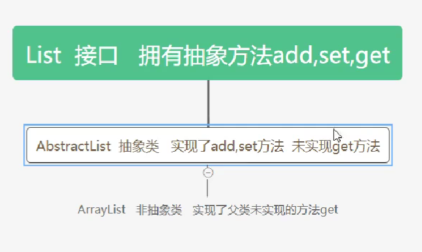
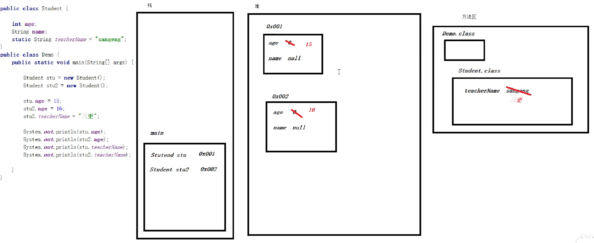
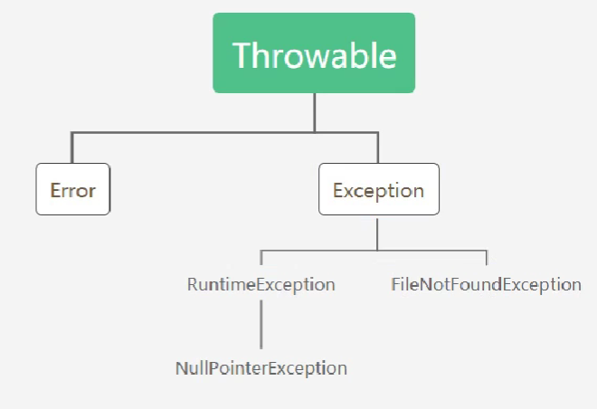
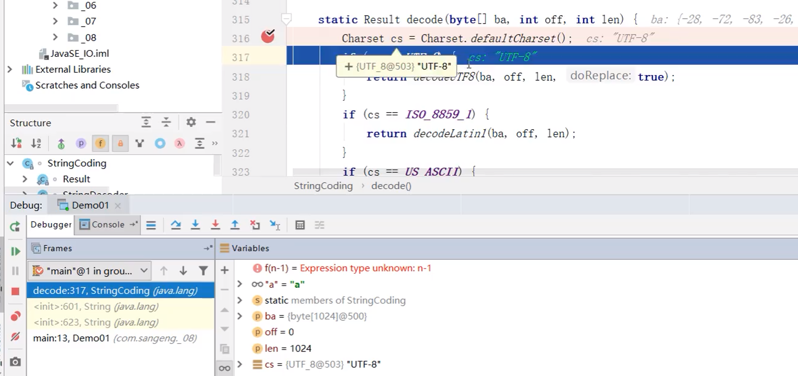
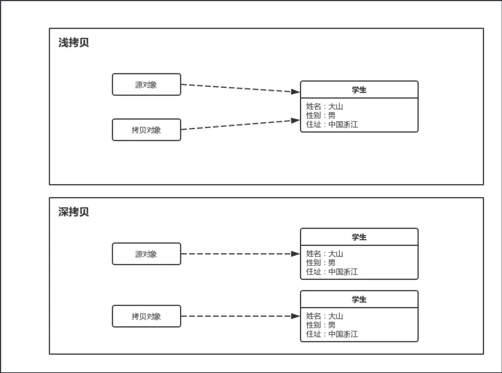

# java SE

# [Java中short、int、long、float、double的取值范围](https://www.cnblogs.com/pangpanghuan/p/6418441.html)


一、基本数据类型的特点，位数，最大值和最小值。
1、
基本类型：short 二进制位数：16
包装类：java.lang.Short
最小值：Short.MIN_VALUE=-32768 （-2的15此方）
最大值：Short.MAX_VALUE=32767 （2的15次方-1）
2、
基本类型：int 二进制位数：32
包装类：java.lang.Integer
最小值：Integer.MIN_VALUE= -2147483648 （-2的31次方）
最大值：Integer.MAX_VALUE= 2147483647 （2的31次方-1）**(2 * 10^9)**
3、
基本类型：long 二进制位数：64
包装类：java.lang.Long
最小值：Long.MIN_VALUE=-9223372036854775808 （-2的63次方）
最大值：Long.MAX_VALUE=9223372036854775807 （2的63次方-1）**(9 * 10^18)**
4、
基本类型：float 二进制位数：32
包装类：java.lang.Float
最小值：Float.MIN_VALUE=1.4E-45 （2的-149次方）
最大值：Float.MAX_VALUE=3.4028235E38 （2的128次方-1）
5、
基本类型：double 二进制位数：64
包装类：java.lang.Double
最小值：Double.MIN_VALUE=4.9E-324 （2的-1074次方）
最大值：Double.MAX_VALUE=1.7976931348623157E308 （2的1024次方-1）

 

| 基本类型 | 字节数 | 位数  | 最大值                 | 最小值     |
| -------- | ------ | ----- | ---------------------- | ---------- |
| byte     | 1byte  | 8bit  | 2^7 - 1                | -2^7       |
| short    | 2byte  | 16bit | 2^15 - 1               | -2^15      |
| int      | 4byte  | 32bit | 2^31 - 1               | -2^31      |
| long     | 8byte  | 64bit | 2^63 - 1               | -2^63      |
| float    | 4byte  | 32bit | 3.4028235E38           | 1.4E - 45  |
| double   | 8byte  | 64bit | 1.7976931348623157E308 | 4.9E - 324 |
| char     | 2byte  | 16bit | 2^16 - 1               | 0          |

# Random-生成随机数

我们可以通过 Random 类来生成随机数。

## 使用步骤

1、导包。在定义类的上面写上下面的语句。

~~~java
import java.util.Random；
~~~

2、创建对象

~~~java
Random r = new Random();
~~~

3、生成随机数

 ~~~java
int num = r.nextInt(10);// 结果：[0,9]的随机数  生成  生成[0.xxx ~ 1) -> 0 , 生成[1.xxx ~ 2) -> 1
 ~~~

演示：

~~~java
//导包
import java.util.Random;
public class RandomDemo {
    public static void main(String[] args) {
        Random r = new Random();
        int num = r.nextInt(10)+ 1;//[1,10]
        System.out.println(num);
    }
}
~~~


# 运算符

运算符： 用来**在编程过程中**对各种数据进行处理运算的符号 

## 算术运行符

其实就是常见的数学运行符，不过有些地方有点不同

| 符号 | 作用 |                           不同之处                           |
| ---- | ---- | :----------------------------------------------------------: |
| +    | 加   |        单纯使用数字参与运算的时候和数学中的+没有不同         |
| -    | 减   |                              无                              |
| *    | 乘   |                              无                              |
| /    | 除   | 整数相除只能得到整数,如果想得到小数必须使用小数参与计算    例如:    int num = 10/3； //num的值为3而不会是3.333 |
| %    | 取余 |     获取的是两个数据做整除后得到的余数  int num = 10%3;      |

如果字符参与了运算：

​	char类型参与算术运算，会把字符转换成对应的数字（参照 [ASCII 码表](img\image-20200815160249620.png)）然后参与运算。

~~~~java
char c = 'A';
System.out.println(c+0); 
~~~~


如果字符串参与了+运算：	

​	当“+”操作中出现字符串时，这个”+”是会进行字符串的拼接，而不会进行数据的计算

~~~~java
System.out.println("夜半三更三更看了"+3+"遍小白船"); // 夜半三更三更看了3遍小白船
~~~~


### 练习

判断下面代码的执行结果

~~~~java
System.out.println('a'+10+"bc"+'d'+10);//107bcd10  'a' -> 97
~~~~


## 赋值运算符

可以用来修改变量的值。赋值运行符左边写要被修改值的变量名，右边写参与计算的值,这个值可以是具体的值也可以是变量。

| 符号 | 功能       | 举例                                       |
| ---- | ---------- | ------------------------------------------ |
| =    | 赋值       | a=10，将10赋值给变量a                      |
| +=   | 加后赋值   | a+=10;  //相当于a =(a的数据类型) (a + 10); |
| -=   | 减后赋值   | a-=b;//相当于a =(a的数据类型) (a - b);     |
| *=   | 乘后赋值   | a*=b;//相当于a =(a的数据类型) (a * b);     |
| /=   | 除后赋值   | a/=b;//相当于a =(a的数据类型) (a / b);     |
| %=   | 取余后赋值 | a%=b;//相当于a =(a的数据类型) (a % b);     |


## 自增自减运算符

| 符号 | 作用 | 举例                   |
| ---- | ---- | ---------------------- |
| ++   | 自增 | a++;//相当于a = a+1;   |
| --   | 自减 | a--;//相当于a = a - 1; |

**注意:**

​	++和--可以写在变量的前面也可以写在变量的后面,单独写的时候写前面写后面都没有区别.区别就在和其它运算符一起写.
​	++**写在变量前**的时候**先自增**然后再参与其他运算
​	++**写在变量后面**的时候先参与其它运算**后自增**

~~~~java
public class Demo03 {
    public static void main(String[] args) {
        int a = 10;
        int b = 10;
        int c = a++;
        int d = ++b;
        System.out.println(a);
        System.out.println(b);
        System.out.println(c);
        System.out.println(d);
    }
}
~~~~

​	**爬山警告：如果想让领导带你去爬山的话，在公司中写代码的时候可以把自增自减运算符和其他运行放在一起使用。**

例如：

~~~~java
		int a = 5;
        int c = 10;
        int b = 20;
        int d = ++a+b+++c+++(a+b);
        System.out.println(d);
~~~~


## 比较运算符

让计算机帮我们去比较数值之间的关系是否正确。

~~~~java
==  比较左右两边是否相等,结果是布尔类型的
<    比较左边是否小于右边,结果是布尔类型
>    比较左边是否大于右边,结果是布尔类型
<=  比较左边是否小于等于右边,结果是布尔类型
>=  比较左边是否大于等于右边,结果是布尔类型
!=  比较左右两边是否不相等,如果不相等结果是true,否则是false
~~~~


## 逻辑运算符

| 符号 | 作用     | 说明                                           |
| ---- | -------- | ---------------------------------------------- |
| &    | 逻辑与   | 理解成并且的意思，左右两边都要为真才为真       |
| \|   | 逻辑或   | 理解成或者的意思，左右两边只要有一个为真就为真 |
| ^    | 逻辑异或 | 左右两边不同结果才为真                         |
| !    | 逻辑非   | 取反                                           |
| &&   | 短路与   | 作用和&相同，但是有短路效果                    |
| \|\| | 短路或   | 作用和\|相同，但是有短路效果                   |


短路效果：左边表达式的结果确定之后,如果整个表达式的结果已经被确定了,就不会去执行右边的表达式

例如：

~~~~java
int x = 10;
int y = 15;
//System.out.println((x++ > 4) | (y++ > 5)); // 两个表达都会运算
System.out.println((x++ > 4) || (y++ > 5)); // 左边已经可以确定结果为false，右边不参与运算
~~~~


## 三元运算符

### 格式

~~~~java
布尔表达式?表达式1:表达式2;
~~~~

### 执行流程

​		先判断布尔表达式的结果,如果结果为true三元表达式的结果就是表达式1的值,否则就是表达式2的值。因为肯定会有一个结果。所以我们在使用的时候需要把这个结果使用(用变量保存，打印等)起来。不然就没有意义。

例如：

~~~~java
int a = 10;
int b = 20;
int result = a==b?a:b;
System.out.println(result);
~~~~


# JVM、JRE、JDK

JVM（Java Virtual Machine），Java虚拟机，java程序需要在jvm上运行

JRE（Java Runtime Environment），Java运行环境，包含了JVM和Java的核心类库（可供我们直接使用的代码）

JDK（Java Development Kit）称为Java开发工具，包含了JRE和开发工具


# if语句

下面代码的执行结果是什么?

~~~~java
int a=10;
int b;
if(a%2==0){
    b=0;
}else if(a%2==1){
    b=1;
}
System.out.println(b);
~~~~


答案：<span style='background:black'> 会在编译的时候报错.因为在编译的时候编译器看到了if...else if语句.它认为有可能两个判断都不成立.这样的话b就可能出现没有赋值直接使用的情况. </span>

# 流程控制语句-switch

使用switch也可以根据判断不同的情况做不同的处理。

## 格式

~~~~java
		switch (表达式) {
			case 值1:
				语句体1;
				break;
			case 值2:
				语句体2;
				break;
			case 值3:
				语句体3;
				break;
			...
			default:
				语句体n+1;
				break; // 最后一个break语句可以省略，但是推荐不要省略
		}

~~~~

switch后面小括号当中只能是下列数据类型：
			**基本数据类型：byte/short/char/int**
			**引用数据类型：String字符串、enum枚举**

## 小思考

switch和if都可以做多种情况的判断,那他们之间有什么区别呢?你觉得谁更灵活?

> tips:可以从他们小括号里能写的表达式的类型方面去考虑
> if的小括号中是布尔表达式，switch是byte,short...

答案：

if的表达式的布尔表达式，可以进行更复杂条件的判断(例如：值在某个范围内，多个条件同时符合等)

而switch的表达式的数据类型**只能适合做有限个数的等值判断**。所以如果是有限个数的等值判断的话switch有的时候会更方便。

其他情况下if会更适合。 

# 循环语句

当我们需要多次执行完全重复的操作或者是多次执行有规律的操作时，我们就可以用循环语句。

在java中有三种循环语句，分别是for循环，while循环，do...while循环。

## for循环

### 格式

~~~~Java
		for(初始化语句;布尔表达式(条件判断);步进语句){
			循环体;
		}
~~~~

例如：

~~~~java
    public static void main(String[] args) {
        for (int i = 1; i <= 5; i++) {
            System.out.println("HelloWorld");
        }
    }
~~~~

### 执行流程

​	①先执行初始化语句,

​	②然后看布尔表达式的结果,

​				如果为false  循环结束,

​				如果为true  执行循环体.

​	③循环体执行完后执行步进语句.然后继续执行②判断布尔表达式的结果(PS:注意,不是初始化语句)

​	然后以此类推.


### 注意

①初始化语句、布尔表达式、步进语句之间是用分号分隔，而不是逗号。 但是在初始化语句和步进语句部分，我们可使 用一系列由逗号分隔的语句。而且那些语句均会独立执行 。例如：

~~~~java
		for(int i = 1,j = 10;i<j;i++,j--){
			循环体;
		}
~~~~

②无论初始化语句，布尔表达式，还是步进语句，都可以空着不写，但是分号不能少 。例如：

~~~~java
		// 会无限循环，类似于while(true)
		for(;;){
			循环体;
		}
~~~~


## While循环

### 格式

```java
	while(布尔表达式){
		循环体;
	}
```

例如：

~~~~~java
    public static void main(String[] args) {
        int i = 0;
        while (i<=10){
            System.out.println(i);//0  1  2   ... 10   
            i++;
        }
    }
~~~~~

### 执行流程

​		①看布尔表达式的结果

​						如果为false循环结束

​						如果为true,则执行循环体.

​		②循环体执行完后继续执行①以此类推


## do...while循环

### 格式

~~~~java
		do{
			循环体;
		}while(布尔表达式);
~~~~

例如：

~~~~java
    public static void main(String[] args) {
        int i = 0;
        do{
            System.out.println(i);//0  1  2  3 4 ...  10
            i++;
        }while (i<=10);
    }
~~~~

**注意**：while小括号后面必须有个分号。

### 执行流程

​		①执行循环体

​		②然后看布尔表达式的结果

​							如果为true则继续执行①循环体

​							如果判断表达式的结果为false则循环结束

​		 	以此类推


## 循环总结

<span style='background:black'>  如何选择循环语句：  </span>
循环之间其实是都可以相互转换的，所以用哪种循环都可以。

1. 但是用的最多的是for循环,如果循环次数已知一般用for. 	
2. while循环一般在循环次数未知的情况下使用,或者死循环一般都用while循环 
3. ​	do...while循环基本不用 


# 循环控制语句

我们在循环的过程中有的时候可能需要跳过某次或某几次循环、甚至直接结束整个循环。这个时候我们就可以使用循环控制语句。

循环控制语句主要有两个：<font color='red'>break</font>,<font color='red'>continue</font>

## break

在循环过程中,碰到break<font color='red'> 整个循环 </font>就直接<font color='red'>结束</font>了

例如：

~~~~java
    public static void main(String[] args) {
        for (int i = 0; i < 10; i++) {
            System.out.println(i);//0 1 2 3 4 5
            if(i==5){
                break;
            }
        }

    }
~~~~

**<font color='red'> 注意：break只能出现在循环中或者switch中 </font>**

## continue

如果在循环过程中碰到了continue,则<font color='red'> 跳过本次循环 </font>,<font color='red'> 继续下次循环 </font>

~~~~java
   public static void main(String[] args) {
        for (int i = 0; i < 10; i++) {
            
            if(i==5){
                continue;
            }
            System.out.println(i);//0 1 2 3 4 6 7 ... 9
        }
    }
~~~~

**<font color='red'> 注意：continue只能出现在循环中 </font>**


## 常见小问题

下面代码的执行结果

~~~~java
int a = 10;
if(a%2==0){
    if(a==0){
        break;
    }
    System.out.println("a是偶数");
}else{
    System.out.println("a是奇数");
}
~~~~

答案：<span style='background:black'>直接报错，break只能出现在循环或switch语句中</span>


下面代码会输出哪些数字  
代码:

```java
	for(int i=1;i<10;i++){
		if(i%2==0){
			continue;
		}else{
			break;
		}
		System.out.println(i);
	}
```

答案：<span style='background:black'>因为最后的输出语句永远执行不到,这个时候编译的时候就会报错</span>

练习：

打印99乘法表

效果如下：

~~~~
1*1=1
1*2=2	2*2=4
1*3=3	2*3=6	3*3=9
1*4=4   2*4=8   3*4=12  4*4=16
.....
~~~~

回答：

~~~java
    /**
     * 结构
     * @param args
     */
    public static void main(String[] args) {
        // 每一行
        for(int i = 1;i <= 9;i++){
            // 每一列
            for(int j = 1;j <= i;j++){
                System.out.print("*");
            }
            System.out.println();
        }
    }

    /**
     * 答案
     * @param args
     */
    public static void main(String[] args) {
        // 每一行
        for(int i = 1;i <= 9;i++){
            // 每一列
            for(int j = 1;j <= i;j++){
                System.out.print( j + " * " + i + "=" + j * i + " ");
            }
            System.out.println();
        }
    }
~~~


# 变量

1.变量有其作用范围，它的作用访问是定义他的那行代码所在的大括号内。

2.在同一个大括号中定义的变量名不能重复。

3.变量在使用之前，必须先初始化（赋值）**注意**：成员变量可以不手动初始化，有默认值。

4.定义long类型的变量时，需要在整数的后面加L（大小写均可，建议大写）。因为整数默认是int类型，加L相当于告诉计算机这个整数很特殊是long类型的。定义float类型的变量时，需要在小数的后面加F（大小写均可，建议大写）。因为浮点数的默认类型是double， 加F相当于告诉计算机这个小数很特殊是float类型的。

## 命名规则

- 由字母、数字、下划线“_”、美元符号“$”组成。
- 不能以数字开头
- 不能使用java中的关键字。	


## 命名规范

* 小驼峰式命名：变量名、方法名

​		首字母小写，从第二个单词开始每个单词的首字母大写。 **例如：  nickname  setAge  getAge**

* 大驼峰式命名：类名

​		每个单词的首字母都大写。  **例如：HelloWorld  FileUploadController**


# 数组

我们可以使用数组来保存同一个数据类型的多个数据

## 数组的特点

​		①数组的长度一旦确定就不能改变

​		②一个数组中元素的数据类型都是一样的

## 数组的初始化

### 动态初始化

#### 格式

​			数据类型[] 数组名 = new 数据类型[长度];

例如：

~~~~java
	int[] arr = new int[10];//动态初始化了一个长度为10的数组，数组元素为int类型
~~~~


### 静态初始化

#### 格式

​		标准格式：

​					数据类型[] 数组名 = new 数据类型[] {元素值1,元素值2,元素值3,...};

例如：

~~~~java
	int[] arr = new int[]{1,2,3,4,5};
~~~~

​		省略格式（<font color='red'>推荐使用</font>）：

​					数据类型[] 数组名 = {元素值1,元素值2,元素值3,...};

例如：

~~~~java
	int[] arr = {1,2,3,4,5};
~~~~

### 总结

​		静态初始化和动态初始化都可以实现对数组的初始化，那么我们在需要创建数组的时候应该如何选择呢？

​		如果数组元素都确定好了，并且个数有限的情况下我们可以使用静态初始化，因为更方便。如果只能确定数组的长度，数组的元素值需要后面再赋值的话可以使用动态初始化。


## 数组的内存结构

观察下面代码的输出结果

~~~~java
int[] arr = new int[5];
arr[0] = 1;
arr[1] = 2;
int[] arr2 = arr;
arr2[2] = 3;
arr2[3] = 4;
System.out.println(arr2[0]);
System.out.println(arr[3]);
~~~~

如果想要弄明白上面代码的输出结果就需要知道一个数组在内存中是如何存储的。

**实际上，数组的实体保存在堆中，数组名实际保存的是数组实体的地址值。**


## 方法重载

作用：方法的功能相同，但是需要的参数类型不同时，使用同一个方法名称构成方法重载即可，不需要另外起名，非常方便。

定义：在同一个类中,**方法名相同,参数列表不同**的方法才叫方法重载（与返回值、参数名称无关）

参数列表不同：1. 参数类型不同  2.参数个数不同  3.参数顺序不同

如何判断参数列表是否相同？**把参数类型全部拼接成一个字符串，如果字符串的内容不同就算参数列表不同。**

~~~~java
public class Demo{
    public int test(int a,int b){}   // intint
    public void test(int a,int b){}//错，不构成重载
    
    
    public void test(int a,int b,int c){}
    public void test(int x,int y){}//错   
    public void test(int a,double b){}
    public void test(double a,int b){}
    public void test(double a,double b){}
}
~~~~


# 面向对象基础

## 1.面向对象思想

​		面向对象的思想其实就是让我们**去指挥别人**或者是**使用工具**帮我们去把要做的事情完成。


## 2.类和对象

### 2.1 概念

类：对一类事物共同点的<font color='red'> 描述 </font>

对象：对象是某类事物的一个<font color='red'> 个体 </font>

> 类仅仅只是描述，我们要指挥事物指挥的肯定是某类事物中的一个个体。我们去指挥或者使用事物的时候肯定是使用其中的具体的个体也就是对象。


### 2.2 类的定义

我们去描述一类事物的共同点可以分成两种，一种是属性，一种是行为(技能)。


属性：具有具体的值的共同点就是属性(例如：姓名，年龄，血量)，我们用成员变量表示

行为(技能)： 具体的技能或功能这些都是包含了一系列的动作。这些共同点就是行为，我们用成员方法表示。（例如：吃饭，睡觉）


成员变量：定义在类中方法外的变量就是成员变量。

成员方法：没有static修饰的方法就是成员方法。


~~~~java
public class Phone {

    // 成员变量
    String brand; // 品牌
    double price; // 价格
    String color; // 颜色

    // 成员方法
    public void call() {
        System.out.println("打00009999888866663333333325474425477747*##36363#打电话");
    }

    public void sendMessage() {
        System.out.println("群发短信");
    }

	
}
~~~~


### 2.3 对象的创建和使用

#### 2.3.1 创建对象格式

​							<font color='red'>**类名 对象名 = new 类名();**   </font>

~~~~java
Phone phone = new Phone();
Student stu = new Student();
~~~~


#### 2.3.2 成员变量的使用格式

​						 <font color='red'> **对象名.成员变量名**</font>

注意:在定义的类中使用本类中的成员变量的时候 <font color='red'>**对象名.**</font>  可以省略  可以直接写 <font color='red'>**成员变量名**</font>

~~~~java
Phone phone = new Phone();
//设置phone的brand属性
phone.brand = "华为";
//打印phone的brand属性
System.out.println(phone.brand);
~~~~


#### 2.3.3 成员方法的调用格式

​							<font color='red'>**对象名.方法名(参数)**</font>

注意:在定义的类中使用本类中的成员方法的时候 <font color='red'>**对象名.**</font>  可以省略  可以直接写 <font color='red'>**方法名(参数)**</font>

~~~~java
Phone phone = new Phone();
//使用phone的sendMessage方法
phone.sendMessage();
~~~~


## 3. 构造方法

### 3.1 定义格式

构造方法的定义格式就是在普通成员方法定义格式的基础上加上了两个强制的要求。

要求：①没有返回值类型,连void都不能写  ②方法名和类名必须相同 

例如：

~~~~java
public class Phone {
	// 成员变量
    String brand; // 品牌
    double price; // 价格
    String color; // 颜色
	public Phone(){
        //这是一个无参构造
    }
    public Phone(String color,double price,String brand){
        //这是一个有参构造
        this.color = color;
        this.price = price;
        this.brand = brand;
    }
}
~~~~


### 3.2 调用格式

​						<font color='red'>**new 类名(参数);**</font>

例如：

~~~~java
Phone p = new Phone();
Phone p2 = new Phone("原谅绿",2999.9,"华为");
~~~~


### 3.3 构造方法的作用

- 创建对象
- 在创建对象的时候更便捷的对成员变量进行赋值
- <font color='red'>对类中的成员变量进行**默认初始化**</font>(与赋值不同，默认初始化是在赋值之前的)

~~~java
public class Student {
    private int age;
    private String name;
    
    public Student(int age,String name){
        // 赋值之前JVM会给成员变量进行默认的初始化
        // 赋值
        this.name = name;
        this.age = age;
    }
}
~~~


### 3.4 注意事项

​	 **如果一个类中没有写构造方法，编译器会默认送我们一个无参构造方法，但是如果自己写了，编译器就不会送了。这种情况下建议自己再加一个无参构造**


# 面向对象-抽象类


## 1. 为什么要抽象

​	当一个类中有一个方法,这个方法在不同的子类中有不同的实现的时候,在父类中我们没有办法去写具体的方法体,这个时候就可以使用抽象.(即不写方法体)


## 2. 抽象类和抽象方法的格式

### 2.1 抽象方法

​	在成员方法的返回值类型前加<font color='red'>abstract</font>修饰，然后<font color='red'>去掉方法的大括号</font>,加上一个<font color='red'>分号</font>。

例如

~~~~java
public abstract void eat();
~~~~


### 2.2 抽象类

​	在class关键字的前面加上<font color='red'> abstract </font>修饰。

例如

~~~~java
public abstract class Animal{
    
}
~~~~


## 3.  抽象类的特点

- 抽象类既可以**有抽象方法**，也可以有非抽象方法，还有就是**不能直接创建对象**，其他所有都和普通类一样
- 抽象类的子类，要么重写抽象父类中所有的抽象方法，要么子类本身也是一个抽象类


# 面向对象-接口

## 1. 接口的概念

​	接口就是规范\规则，我们可以使用接口来定义一些规则（比如要求某个方法的方法名必须叫什么，方法的参数列表必须是什么，方法的返回值类型必须是什么）

​	现实生活中的规范


作用：

使用接口后，即使没有具体的实现，也可以根据接口定义的规范搭建出代码的整体框架。


## 2. 接口的格式

### 2.1 定义接口

​	使用interface来定义接口

~~~~java
public interface 接口名{
    //定义抽象方法
    void method();
}
~~~~


### 2.2 实现接口

​	在要实现接口的类名后面加上<font color='red'>implements 接口名</font>。如果要实现多个接口，多个接口名用逗号分开。我们在理解的时候可以把接口理解成是一个特殊的父类。

~~~~java
 public class 类名 implements 接口名{}
~~~~


## 3. 接口中的成员

### 3.1 常用成员

​	在jdk7版本中接口中只能有常量和抽象方法。

​	我们接口中定义不了成员变量。因为定义的成员**变量默认都会修饰为**：public static final   即：常量

​	我们在接口中定义的**方法默认修饰符**为public abstract  即：抽象方法

例子

~~~~java
public interface InterfaceA {
    //常量
    int NUM =10;//等价于public static final int NUM =10;
    //抽象方法
    void method();//等价于  public abstract void method();
}
~~~~


### 3.2 新增成员

​	在新版本的jdk中接口中允许出现更多的成员，并且其中的方法都可以有方法体(不像抽象方法那样不能有方法体)。


#### 3.2.1 默认方法

​	在jdk8中允许我们在接口中定义默认方法。默认方法允许有方法体。

​	**默认方法可以不进行重写**。

##### 3.2.1.1 格式

​	使用defaut关键字进行修饰。

~~~~java
public interface InterfaceA {
	//默认方法
    default void method(){

    }
}
~~~~

##### 3.2.1.2 注意事项

​	如果两个接口中有相同的默认方法。一个类同时实现了这两个接口，必须要重写该方法。

​	否则调用这个类的这个默认方法时，计算机不知道具体调用哪一个方法，所以会报错。


##### 3.2.1.3 应用场景

​	如果在**接口升级**的时候某些方法并不想让所有的实现类都进行重写(使用抽象方法的话，所有实现类都要重写这个抽象方法，没有必要且工程量大)，可以使用默认方法来定义。

例子：Map接口有很多的实现类，如果只有抽象方法，一旦需要对Map接口进行升级，需要添加新的抽象方法时，全部的实现类都需要重写这个抽象方法，会导致非常大的代码变动。有了默认方法后，实现类就可以根据自己的情况来选择是否重写这个默认方法，而不是强制所有实现类进行重写，并且默认方法还有方法体，非常方便。


#### 3.2.2 静态方法

​	在jdk8中允许我们在接口中定义静态方法。

- **静态方法允许有方法体**。
- **静态方法不能被重写。**(Java规范中规定，静态、私有的成员是不会被继承的，没有继承也就没有了重写)


##### 3.2.2.1 格式

​	使用static关键字进行修饰。

~~~~java
public interface InterfaceA {
	//静态方法
    static void staticMethod(){

    }
}

public class Demo {
    public static void main(String[] args) {
        //使用接口名.方法名(参数)  来调用
        InterfaceA.staticMethod();
    }
}

~~~~


##### 3.2.2.2 应用场景

​	如果在接口升级的时候需要给接口增加一些工具方法。不想让实现类去重写该方法，可以使用静态方法来定义。

类似于 默认方法 。


#### 3.2.3 私有方法

​	在jdk9中允许我们在接口中定义私有方法。

- 私有方法允许有方法体。
- 私有方法不可以被重写。


##### 3.2.3.1 格式

​	使用private进行修饰。

~~~~~java
public interface InterfaceA {
    private static void privateStaticMethod(){

    }
    private  void privateMethod(){

    }
}

~~~~~

##### 3.2.3.2 应用场景

​	对默认方法或者是静态方法中重复的代码进行抽取，提高代码复用度。


## 4. 继承实现关系

- 类：类似亲爹，只能继承一个 
- 接口：类似干爹，可以实现多个

​	只能继承一个，可以实现多个。

在java中一个类可以实现多个接口

例如

~~~~java
 public class Person implements InterfaceA,InterfaceB{}
~~~~

​	在java中接口和接口之间可以有继承关系。继承之后会把父接口的成员继承下来。

~~~~java
public interface InterfaceC  extends InterfaceA{
//    void method1();
}
~~~~


## 5. 抽象类和接口的使用区别

​	接口中的基本都是抽象的(默认方法等有方法体的一般不会使用)，而在抽象类中可以有一部分是非抽象方法。而非抽象类中是不可以有抽象方法的。

​	我们就发现接口是最抽象的，其次是抽象类，最后是非抽象类。
​	所以我们最顶层设计成接口(都是抽象方法)，然后实现类设计成抽象类（只实现部分抽象方法，因为这部分的实现都是一样的，剩下不同子类有不同的实现的方法就不在这里实现，交给抽象类的不同子类来进行实现），抽象类的子类可以设计成非抽象类（对剩下的所有抽象方法进行实现）。

例如：

ArrayList源码的接口、抽象类结构:




# 面向对象-代码块

# 1. 局部代码块

## 1.1 格式

​	在方法中直接写一对大括号即可

~~~~java
public class Demo{
    
    public void test(){
        int a = 10;
        //下面是一个局部代码块
        {
            int b = 20;
        }
    }
}
~~~~


## 1.2 应用场景

​	如果需要控制局部变量的生命周期，想让其使用完后尽快销毁，释放内存，可以把局部变量定义在局部代码块


# 2. 构造代码块

## 2.1 格式

​	在类中方法外部直接写一对大括号即可

~~~~java
public class Student{
    
    int age;
     //下面是一个构造代码块
    {
       age = 0;
    }

}
~~~~


## 2.2 调用时机

​	构造代码块会在调用构造方法的时候执行，并且会**在构造方法中的代码执行之前执行**。

​	每调用一次构造方法就会执行一次构造代码块。


## 2.3 应用场景

​	用来抽取构造方法中的重复代码，提高代码的复用性。


# 3. 静态代码块(重点)

## 3.1 格式

​	在类中方法外部直接写一对大括号即可，在括号前用static修饰

~~~~java
public class Student{
    
    static int num;
     //下面是一个构造代码块
    static {
       num = 0;
    }

}
~~~~


## 3.2 调用时机

​	在类被加载的时候会执行，同一个类在程序运行过程中只会被加载一次，所以只会执行一次


## 3.3 应用场景

​	用来给类当中的静态成员进行初始化。

如果使用构造代码块给静态变量进行初始化，可能出现：直接使用`类名.静态变量`访问静态变量时，由于没有调用构造方法进行初始化，而导致使用了没有初始化的变量而报错。

如：

~~~java
public class Student{
    
    static int num;
     //在构造代码块中对静态变量进行初始化
    {
       num = 0;
    }

}
~~~


使用静态代码块给静态变量进行初始化，在类加载时就会进行初始化，完美解决上面的问题，更加安全。


# 面向对象-内部类

# 1. 局部内部类

## 1.1 格式

### 1.1.1 定义格式

​	把类定义在方法中即可

~~~~java
public class Outer{
    
    public void test(){
        class Inner{//定义了一个局部内部类
			public void print(){
				System.out.println("局部内部类");	
            }
		}
    }
}
~~~~


### 1.1.2 对象创建格式

​	直接在定义局部内部类的方法中按照之前创建对象的格式进行创建即可。如果在该方法外就不能使用该局部内部类了。

~~~~java
public class Outer{
    
    public void test(){
        class Inner{//定义了一个局部内部类
			public void print(){
				System.out.println("局部内部类");
			}
		}
        Inner inner = new Inner();
        inner.print();
    }
}
~~~~


## 1.2 应用场景

​	如果需要定义一个在方法中临时使用的类时可以使用局部内部类。不过该内部类基本不会使用到。


## 1.3 注意事项

​	内部类可以使用外部的局部变量。但是要求这些局部变量必须是**事实常量**(变量一旦赋值后，就没有改变这个值，类似于final修饰的变量)。


# 2. 成员内部类

## 2.1 格式

### 2.1.1 定义格式

​	把类定义在类中即可

~~~~java
public class Outer{
    
    class Inner{//定义了一个成员内部类
        public void print(){
            System.out.println("局部内部类");
        }
    }
}
~~~~


### 2.1.2 对象创建格式

​	内部类在除了外部类的其他类中创建会非常繁琐，在外部类中创建会非常简单，所以我们在定义内部类的外部类中创建对象并提供公共的方法即可即可。

~~~~java
public class Outer{
    // 直接在外部类中创建内部类
    private Inner inner = new Inner();
    // 提供公共的方法给其他类进行访问Inner对象
    public Inner getInner(){
        return inner;
    }
    
    class Inner{//定义了一个成员内部类
        public void print(){
            System.out.println("成员内部类");
        }
    }
}
~~~~

## 2.2 特点

​	①在成员内部类中**可以直接使用外部类的成员，即使这个成员是私有的**。

​	②如果外部类的成员和内部类的成员重名了，可以使用**外部类名.this.成员名**来表示外部类的成员。

​	③成员内部类中不能定义静态的成员。（解释：非静态的类中不能有静态的成员)

~~~~java
public class Outer{
    private Inner inner = new Inner();
    private int num = 10;
    
    private void test(){
        System.out.println("外部类中的test方法被调用");
    }
    class Inner{//定义了一个成员内部类
        public void print(){
            System.out.println("成员内部类");
            System.out.println(num);//等价于Outer.this.num
            test();//等价于Outer.this.test();
        }
    }
}
~~~~


## 2.3 应用场景

​	如果一个类不会单独使用，需要和另外类（外部类）一起使用才有意义。

​	并且会用到外部类中的私有成员的时候可以把该类定义为一个内部类。

例如**ArrayList中的Itr类，用来遍历ArrayList 即：`while(hasNext())`**


# 3. 静态内部类


## 3.1 格式

### 3.1.1 定义格式

​	把类定义在类中方法外，然后使用static关键字修饰即可。

~~~~java
public class Outer{
	private int[] arr1;
    
    static class Inner{//定义了一个静态内部类
        // 可以定义非静态的成员，但是不能使用外部非静态的成员
        private int[] arr2;
        // arr1 = null; 错误！
        public static void print(){
            System.out.println("静态内部类");
        }
    }
}
~~~~

## 3.2 特点

​	在静态内部类中可以直接使用外部类静态成员，即使是私有的。

## 3.2 应用场景

​	一个类不会单独使用，需要和另外类（外部类）一起使用才有意义。需要在内部类中定义静态成员的时候，可以把成员内部类用static修饰变成静态内部类。例如**Integer中的IntegerCache**


# 4. 匿名内部类

​	匿名内部类本质是一个对象。它是某个类(接口)的子类(实现类)对象。

## 4.1 格式

~~~~java
	new 接口名/类名(){
      	//重写要重写的方法  
    };
~~~~


~~~~java
interface Runner{
    void run();
}

public class Demo{
    public static void main(String[] args){
        Runner r = new Runner(){
            public void run(){
                System.out.println("匿名内部类重写了run方法");
            }
        };
        r.run();
    }
    
    
}
~~~~


## 4.2 应用场景

​	如果需要创建一个类或者接口的子类对象。但是这个子类只会使用一次，没必要创建单独创建一个类文件。就可以使用匿名内部类的形式。


# 面向对象-封装


## 1.封装的概念

​			封装其实就相当于把不需要用户了解细节（隐私或者的特别复杂的细节)包装(隐藏)起来，只对外提供公共访问方式 。


## 2.  成员变量私有化（封装的一种体现形式）

​		我们可以使用private来修饰成员变量，提供对应的set/get方法提供刚刚的访问方式。

## 3. this

​		  this可以用来在局部变量和成员变量重名的时候区分他们，加了this的就是成员变量。

​		  注意：<font color='red'>我们只能在一个类的成员方法或者构造方法中去使用this。</font>

### 3.1 小思考

​		this究竟代表什么？<span style='background:black'>this代表当前对象</span>

## 4.思考

### 构造方法与set方法


​	我们之前用构造方法可以给成员变量赋值，现在学习了set方法也可以给成员变量赋值。那么它们使用起来有区别吗？

- 构造方法是用来创建对象的，只不过可以定义有参的构造方法来顺便对成员变量进行赋值。
- 而set方法是专门用来给成员变量进行赋值的。


### 一个标准的类是怎么样的?

- 成员变量都用private修饰
- 提供对应的set/get方法
- 提供空参和全参构造

# 面向对象-继承

## 1. 继承的概念

​			继承可以理解为就是让两个类（事物）产生从属关系，有了从属关系子类就肯定会具有父类的特征（父类中的非私有成员），这样我们用类去描述一些事物的时候就可以更方便


### 1.1 相关名词

​	超类，父类都是同一个概念就是叫法不同

​	派生类，子类都是同一个概念就是叫法不同


## 2. 继承的格式

​		在子类名后面加extends 父类名

例如

~~~~java
public class Dog extends Animal {
  //Dog就成为了Animal的一个子类
}
~~~~


## 3. 继承的注意事项

- java中类只能单继承,一个类只能有一个父类,但是可以多层继承
- 要有实际的从属关系才可以继承，不能不合逻辑的任意继承。


## 4. 继承的优缺点

### 4.1 优点

​		提高了代码的复用性

### 4.2 缺点

​		增加了类和类之间的耦合性。违背了`高内聚，低耦合`原则


## 5. 继承后成员相关语法

​		

### 5.1 成员变量

1. 父类**非私有的成员变量**才会继承给子类。所以当我们看到使用子类对象的某个成员变量时，有可能这个成员变量是定义在子类中。也有可能是定义在其父类中。

2. 父类中如果已经有了某个成员变量，我们不应该再在子类中定义同名的成员变量。否则可能会导致非常难排查的Bug。


### 5.2 构造方法

 1. 构造方法不会继承给子类

 2. 子类的构造中必须调用父类的构造并且要求在第一行。

 3. 子类的构造默认都会在第一行调用父类的无参构造，所以当父类没有无参构造的时候子类构造中会报错。解决方案是给父类加上无参构造或者在子类构造中显示的调用父类的有参构造。

     

**理解**

问：继承的时候构造方法为什么不会被继承？

答：<span style='background:black'> 假设会被继承,这个方法名和子类的类名就肯定不相同,所以不能算是构造方法.所以假设不成立 </span>


问：子类的构造方法会默认调用父类的无参构造super().为什么?

答：<span style='background:black'>因为父类中可能有成员变量,并且这个成员变量要继承给子类使用,但是所有的变量在使用之前必须先赋值.而父类的成员变量只能用父类的构造进行默认的初始化。</span>


问：在子类的构造方法中,能不能把父类的构造放到第二行?

答：<span style='background:black'>不能,因为要保证成员变量先初始化了.如果放到第二行,有可能在第一行还没初始化的时候就使用的父类的成员变量</span>


### 5.3 成员方法

​		父类**非私有的成员方法**会继承给子类。所以当我们看到使用子类对象的某个成员成员方法时，有可能这个成员方法是定义在子类中。也有可能是定义在其父类中。

​		

## 6. 方法重写

### 6.1 方法重写的概念

​		 当子类拥有父类继承下来的某个功能（成员方法）,但是在子类中对这个方法的具体实现和父类不同。这个时候我们在子类中定义了一个和父类方法相同的方法(包括返回值类型,方法名,参数列表) ，这就叫做方法重写。


### 6.2 注意事项

- ​		我们在重写方法的时候方法的**权限修饰符**其实可以和父类不同**（一般都相同）**。但是子类中方法的权限不能比父类低。**（权限修饰符 : private  <   默认(什么都不写)  <   protected  < public）**

- ​		我们在重写方法的时候方法的**返回值类型其实可以不同（一般都相同）**。但是要求子类中方法的返回值类型必须是父类方法返回值类型的**子类**。

- ​		我们可以用 @Override 注解来校验是不是方法重写。

- ​        私有的方法不能被重写，因为私有的不会被继承

  

### 6.3 小思考

面试题：说说overload和override的区别。

答：		
<span style='background:black'>	方法重载：在同一个类中，方法名相同，参数列表不同，和返回值无关方法重写：在子父类中，子类有一个和父类方法名相同，参数列表相同，返回值类型也相同的方法。这个就叫方法的重写				</span>


## 7. this和super

​			this就代表本类的，super就代表父类的

使用：

- 访问成员变量
- ​			this.成员变量名                 本类的成员变量
- ​			super.成员变量名             父类的成员变量
- 访问成员方法
- ​			this.成员方法名(参数)       调用本类的成员方法
- ​			super.成员方法名(参数)   调用父类的成员方法
- 调用构造方法
- ​			this(参数)                           调用本类的构造方法
- ​			super(参数)                       调用父类的构造方法

# 面向对象-多态

## 1. 多态的概念

​	同一个数据类型的不同对象对同一种行为会有多种不同的实现。

例如：接口数据类型的不同实现类有各种不同的方法实现。


## 2. 多态的前提

​	① 子类重写了父类的方法

​	② 父类引用指向子类对象（创建的是一个子类的对象，并把该对象赋值给一个变量，这个变量的类型是其父类类型）

​	例如：

~~~~java
Animal a = new Dog();
Animal b = new Cat();
~~~~


## 4. 多态的应用场景

​	多态最大的应用场景其实就用**在方法的参数上**。在适当的时候把方法的参数类型定义成父类类型。调用方法的时候就可以传入任意的子类对象。提高了代码的复用性和可扩展性。


## 5. 多态的优缺点

优点：提高了代码的复用性和可扩展性

缺点：不能直接使用子类的成员。


## 6.向上转型，向下转型

### 6.1 向上转型 

​			向上转型就是子类转父类。因为是绝对安全的所以会自动进行转换。

例如：

~~~~java
	Animal a = new Dog();
~~~~


### 6.2 向下转型

​          向下转型就是父类转子类。因为不是绝对安全的所以必须使用强转的方式来进行转换。

例如：

~~~~java
	Animal a = new Dog();
	Dog d = (Dog)a;
~~~~


注意：必须是这个子类的对象才可以转换成该子类,否则会出异常


### 6.3 instanceof进行类型判断

​		在向下转型的时候为了保证安全我们可以使用instanceof进行类型判断。判断一个对象是否某个类的对象。如果是的话我们再把它转换成该类型，这样会更加安全。


#### 6.3.1 使用格式

​					对象 instanceof 类名/接口名  

示例：

~~~~java
	//判断对象是否是某个类的对象，如果是结果为true，如果不是结果为false
	Animal a = new Dog();
	if(a instanceof Dog){
        //说明a是Dog这个类的对象，我们可以把他强转成Dog类型
        Dog d = (Dog)a;
    }
~~~~


## 3. 父类引用指向子类对象后成员访问的特点

**编译时看左边类的哪一个方法能够处理，运行时看右边类中这个方法是否被重写了**：

编译期间会去看左边(父类),看父类有没有这个成员方法。如果没有则直接报错,如果有则编译通过,不报错。

运行期间,实际执行代码,看的是右边(子类),看子类中有没有重写该方法,如果有则执行子类中的该方法,如果没有则运行父类中的该方法。


## 7. 继承、多态 思考题

思考下面代码的输出结果

~~~~java
class A {  
	 public String show(D obj){  
			return ("A and D");  
	 }   
	 public String show(A obj){  
			return ("A and A");  
	 }   
}   
class B extends A{  
     // 一共有3个方法
     // 继承的方法
	 //public String show(D obj){  
			//return ("A and D");  
	 //}   
	 public String show(B obj){  
			return ("B and B");  
	 }  
	 public String show(A obj){  
			return ("B and A");  
	 }   
}  
class C extends B{}   
class D extends B{}

class  DynamicTest
{	
	public static void main(String[] args){
		A a1 = new A();  
        A a2 = new B();  
        B b = new B();  
        C c = new C();   
        D d = new D();   
        System.out.println(a1.show(b));  // A and A
        System.out.println(a1.show(c));  // A and A
        System.out.println(a1.show(d));  // A and D

        System.out.println(a2.show(b));  // (题型1)向上转型，编译时看左边：A类中的String show(A obj)方法能够处理b这个参数，所以不会报错，运行时看右边：String show(A obj)方法被子类重写了，所以选择被重写的方法：即 B and A  注意：不是B and B，不能只看右边然后选择执行最匹配的String show(B obj)方法！！！
        
        System.out.println(a2.show(c));  // 向上转型 B and B ? （错误）
        // 正确答案：向上转型，编译时看左边：A类中的String show(A obj)方法能够处理c这个参数，所以不会报错，运行时看右边：String show(A obj)方法被子类重写了，所以选择被重写的方法：即 B and A
        
        System.out.println(a2.show(d));  // 向上转型，编译时看左边：A类中的String show(D obj)方法能够处理d这个参数，所以不会报错，运行时看右边：String show(D obj)方法没有被子类重写，所以选择了A类中的String show(D obj)方法：即 A and D

        System.out.println(b.show(b));   // B and B ,b在D、B、A中进行选择，会传入最近的一个类B
        System.out.println(b.show(c));   // B and B ,c在D、B、A中进行选择，会传入最近的一个父类B
        System.out.println(b.show(d)); 	 // (题型2)A and D,因为B类一共有3个方法，一个重写的String show(A obj),另外两个分别为String show(D obj)与String show(B obj)，所以根据参数d会选择最近的String show(D obj)
	
	}
}
~~~~
上面都是方法的练习，如果是子类、父类中有同名的属性，使用时则遵循**最近原则**

# 修饰符

## 1. 包和权限修饰符

### 1.1 包

​        包其实就是文件夹，用来管理我们的类的。一个类的全类名其实是包名加类名（在java中要求全类名是不能重复的）。


#### 1.1.1 包的定义格式

​		在类的最上面加上 package 包名;

例如

~~~~~java
package com.sangeng;
~~~~~


#### 1.1.2 导包

​		当我们在一个类中使用另外一个类的时候，如果这个类在另外一个包下。我们必须要写全类名或者导包（如果是在java.lang包下的类我们也不需要）。


格式：import 全类名;
例如

~~~~java
import java.util.Scanner;
~~~~


### 1.2 权限修饰符   

​	我们使用权限修饰符来控制被修饰的成员的使用权限。Java中有四种权限修饰符：public，protected，default（default并不是关键字，而是代表不写权限修饰符），private

#### 1.2.1 权限

​	被不同的权限修饰符修饰后，被修饰的成员可以在不同范围内被使用。

|           | 本类中 | 同一个包下 | 子类 | 不同包非子类 |
| --------- | :----: | :--------: | :--: | :----------: |
| public    |   √    |     √      |  √   |      √       |
| protected |   √    |     √      |  √   |              |
| 默认      |   √    |     √      |      |              |
| private   |   √    |            |      |              |


#### 1.2.2 使用规律总结

​	我们在工作中一般不使用默认的权限。

- 如果一个成员我们只想在本类中使用我们就使用private修饰。
- 如果我们想只被本类和子类使用可以使用protected。
- 如果可以被人任意使用，我们使用public。


## 2. static

​	static是一个修饰符，被其修饰的成员就属于类了。会被类的所有对象所共享，随着类的加载而加载。


### 2.1 静态成员的调用格式

​	无论是成员变量，还是成员方法。用static修饰后我们即可以用对象名来调用也可以用类名来调用。一般都使用类名称进行调用。

​	静态变量：**类名.静态变量名**
​	静态方法：**类名.静态方法名(参数)**

例如

~~~~java
class Student{
	public static int num;
    public static void test(){}
}
class Demo{
    public static void main(String[] args){
        Student.num = 10;
        Student.test();
    }
}
~~~~


### 2.2 注意事项

​	1.静态方法中不能直接使用非静态的成员 

​	2.静态方法中不能使用this


### 2.3 理解

​	因为被static修饰的东西就属于类了,所以可以使用**类名**来调用
​	因为被static修饰的东西就属于类了,**类的加载优先于对象**,所以在静态方法中,不能使用非静态的成员(PS:非静态的成员是属于对象),类出现的时候对象还不存在,所以不能使用还不存在的东西
​	因为被static修饰的东西就属于类了,而this代表的某个对象,类加载的时候对象还没创建,所以在静态方法中不能使用this,因为对象都没有出现呢


### 2.4 使用场景

​	①如果需要共享数据,可以使用static，节省内存空间
​	**②如果想要方便调用某些成员,可以使用static修饰**(PS:因为就可以直接用类名来调用,不需要创建对象)

内存图：

使用static修饰的内存图：使用类时，会把类的字节码文件(.class文件)加载到内存中的**方法区**中，new出来的对象都存储在堆中。



所以代码的输出结果为：15、16、三更

## 3. final

​	final可以修饰类，成员方法，局部变量，成员变量。

​	修饰后的作用如下：
​		①可以修饰类,被final修饰的类**不能被继承**，不能基于此类再进行实现了.
​		②可以修饰成员方法,被final修饰的成员方法**不能被重写**，不能基于此方法再进行实现了
​		③可以修饰局部变量,被final修饰的局部变量**就变成了死引用**，赋值之后就**不能改变指向**，但是可以改变指向的对象里面的内容
​        ④可以修饰成员变量,被final修饰的成员变量**就变成了常量**,一旦赋值之后就**不能被修改**.并且**必须初始化**。有两种初始化方式，一种是**直接赋值**，另外一种是要在类的**所有的构造方法中对其进行赋值.**

# 常见类

# 0. API文档

https://docs.oracle.com/en/java/javase/11/docs/api/java.base/java/lang/String.html


## 1.Object 

### 1.1 概述

​	在JDK的java.lang包下定义了Object这个类。

​	java中所有的类都直接或者间接的继承Object。所以任意类的对象都可以使用Object中定义的方法。不过方法内部的实现可能在不同的子类中有不同的重写。

​	我们可以直接使用空参构造创建Object的对象，但是一般我们不会直接创建Object对象，更多的是使用多态的写法。


### 1.2 常用方法

#### 1.2.1 toString方法

​	取得对象信息，返回该对象的字符串表示。Object的toString方法返回值的是类的全类名和对象hash值的拼接。

​	内部实现如下：

~~~~java
    public String toString() {
        return getClass().getName() + "@" + Integer.toHexString(hashCode());
    }
~~~~

​	

​	正常情况下Object的toString的返回值对我们是没有什么意义的。所以如果有需要的话我们都会在自己的类中重写toString方法。


#### 1.2.2 equals方法

​	比较两个对象是否相同。

​	内部实现如下：

~~~~java
    public boolean equals(Object obj) {
        return (this == obj);
    }
~~~~

​	

​	很多情况下判断两个对象是否相同的时候不能单纯的使用==去判断。这种情况下就可以重写equals方法。实现自己的判断逻辑。

# 科学编程学习法
物理，化学
## 步骤：
1.大胆的猜测

根据：参数列表，返回值类型，方法名

大致流程：

​	比如一个需求为需要判断字符串是否以某个字符串开头，直接在idea中使用String类进行寻找，如果有这个方法，参数列表应该为 String,返回值为Boolean,然后根据方法名来确定，最后使用代码进行测试验证，这样就能够快速找到需要的api了。

特例：

​	参数列表可能不是String，而是String的父类、接口，比如CharSequence接口 具体方法：name.contains(CharSequence charSequence)，这种情况下是可以接收String类型的参数的，查找的时候要注意。

再如：

获取某个字符在字符串中第一次出现的索引
分析：

参数列表：char 
返回值类型：int

实际上： int indexOf(int i)  ,因为字符是以数字的形式进行存储的，可以与int类型相互转换

2.小心的验证
写代码测试，查api文档

## 2.String

### 2.1 概述

​	Java提供的用于描述字符串的类。在JDK的java.lang包下定义了String这个类。在该类中定义了很多我们常用的成员方法，用于对字符串进行常用操作。


### 2.2 对象创建

#### 2.2.1 直接使用字面值

​	可以直接定义String类型的变量直接给其赋值一个字符串字面值

~~~~java
String name = "三更";
~~~~

​	

#### 2.2.2 使用构造方法

​	可以使用String中定义的构造方法来创建对象。String有10多个构造方法。我们就针对其中比较常用的几个进行演示。

~~~~java
String()
String(byte[] bytes)  
String(byte[] bytes, int offset, int length)
String(char[] value)
String(char[] value, int offset, int count)
~~~~

演示如下：

~~~~java
    public static void main(String[] args) {
		//使用无参构造创建。字符串的内容为空 相当于 ""
        String s1 = new String();
    }
~~~~

~~~~java
    public static void main(String[] args) {
		
        byte[] bytes = {97,98,99};
        String s = new String(bytes);
        System.out.println(s);//输出结果为  abc
    }
~~~~

~~~~java
    public static void main(String[] args) {
        byte[] bytes = {97,98,99};
        String s = new String(bytes,0,2);
        System.out.println(s);//输出结果为ab
        String s2 = new String(bytes,0,1);
        System.out.println(s2);//输出结果为a
    }
~~~~

~~~~java
    public static void main(String[] args) {
        char[] chars = {'a','b','c'};
        String s = new String(chars);
        System.out.println(s);//输出结果为  abc
    }
~~~~

~~~~java
    public static void main(String[] args) {
        char[] chars = {'a','b','c'};
        String s = new String(chars,0,1);
        System.out.println(s);//输出结果为  a
        String ss = new String(chars,0,2);
        System.out.println(s2);//输出结果为  ab
    }
~~~~


### 2.3 常用方法

> String[]	split(String regex)   把一个字符串按照指定的分隔符切割成多个字符串，把多个字符串放在一个字符串数组中返回
>
> char[] toCharArray();               把一个字符串的内容转换成一个字符数组
>
> byte[] getBytes();                      把一个字符串的内容转换成一个byte数组
>
> String substring(int index);                把某个字符串从index索引开始截取到最后  
>
> String substring(int begin,int end)   把某个字符串索引begin到索引end截取出来
>
> boolean equals(Object anObject)    判断两个字符串的内容是否相同


split方法演示

~~~~java
    public static void main(String[] args) {
        String s = "三更,15,男";
        String[] strs = s.split(",");
        for (int i = 0; i < strs.length; i++) {
            System.out.println(strs[i]);
        }
    }
~~~~


toCharArray方法演示

~~~~java
    public static void main(String[] args) {
        String s = "三更,15,男";
        char[] chars = s.toCharArray();
        for (int i = 0; i < chars.length; i++) {
            System.out.println(chars[i]);
        }
    }
~~~~


getBytes方法演示

~~~~java
    public static void main(String[] args) {
        String s = "abcd";
        byte[] bytes = s.getBytes();
        for (int i = 0; i < bytes.length; i++) {
            System.out.println(bytes[i]);
        }
    }
~~~~


substring方法演示

~~~~java
    public static void main(String[] args) {
        String s = "abcd";
        String substring = s.substring(1);
        System.out.println(substring);
    }
~~~~

~~~~java
    public static void main(String[] args) {
        String s = "abcd";
        String substring = s.substring(1,2);
        System.out.println(substring);
    }
~~~~


equals方法演示

~~~~java
    public static void main(String[] args) {
        String s = "abcd";
        String s2 = "abcd";
        boolean flag = s.equals(s2);
        System.out.println(flag);//输出true
    }
~~~~


### 2.4 特点

1. 一个字符串一旦创建其内容是永远不会变的
2. 字符串效果上相当于是char[]字符数组，但是底层其实是byte[]字节数组


## 3. 包装类

### 3.1 概述

​	Java为每一个基本数据类型提供了对应的一个包装类。包装类是一个类，这样Java就可以在包装类中提供常用的方法等供我们使用。

​	基本数据类型和对应包装类的对应关系为：

| 基本数据类型 | 包装类    |
| ------------ | --------- |
| byte         | Byte      |
| boolean      | Boolean   |
| short        | Short     |
| char         | Character |
| int          | Integer   |
| long         | Long      |
| float        | Float     |
| double       | Double    |

​	包装类的功能基本类似下面就以Integer为例子演示。


### 3.2 创建对象

#### 3.2.1 直接使用字面值

~~~~java
    public static void main(String[] args) {
        Integer i = 10;
    }
~~~~

#### 3.2.2 使用构造方法

~~~~java
    public static void main(String[] args) {
        Integer i = new Integer(10);
        Integer i2 = new Integer("11");
    }
~~~~

#### 3.2.3 使用静态方法valueOf

~~~~java
    public static void main(String[] args) {
        Integer i = Integer.valueOf(10);
        Integer i2 = Integer.valueOf("11");
    }
~~~~


### 3.3. 常用方法

> static Integer	valueOf(int i)   把int转换转换成Integer对象返回
>
> static Integer	valueOf(String s)    把字符串转换转换成Integer对象返回  要求字符串的内容必须为纯数字
>
> static int	parseInt(String s)  把字符串转换转换成int返回  要求字符串的内容必须为纯数字

~~~~java
    public static void main(String[] args) {
        Integer i = Integer.valueOf(10);
        Integer i2 = Integer.valueOf("11");

        int num = Integer.parseInt("123");
        System.out.println(num);
    }
~~~~


### 3.4 自动装箱与自动拆箱

#### 3.4.1 概述

​	在JDK1.5中就增加了自动装箱和自动拆箱。主要是让基本数据类和对应的包装类进行**自动**的转换，方便我们的使用。


#### 3.4.2 自动装箱

​	自动装箱就是基本数据类型可以自动转换为对应的包装类。例如：

~~~~java
Integer i = 10; // 相当于：Integer i = Integer.valueOf(10)	自动装箱
int num = 20;
Integer i2 = num;
~~~~


#### 3.4.3 自动拆箱

​	自动拆箱就是包装类可以自动转换为基本数据类型。例如：

~~~~java
Integer i = new Integer(10);
int num = i; // 相当于： int num = i.intValue()  	自动拆箱
~~~~


#### 3.4.4 原理

笔试题：

求下面代码的输出结果：

~~~java
public static void main(String[] args) {
        Integer i1 = 10;
        Integer i2 = 10;
        Integer i3 = 300;
        Integer i4 = 300;
        System.out.println(i1 == i2);// true
        System.out.println(i3 == i4);// false
    }
~~~

​	**自动装箱其实是通过包装类的静态方法valueOf来实现的转换**

Integer类中如果超出了[-128,127]的范围才会去使用构造方法创建：

在Integer类的静态方法valueOf中，[-128,127]之间的值Integer类中有静态的数组来进行存储，当类加载时就会创建，如果想要创建Integer对象的范围在[-128,127]之间则会从静态数组中找到相同值的Integer对象后之间返回，不在这个范围内的Integer数值才会去使用`new Integer(num)`构造方法进行创建。

​	**自动装箱的作用**： 有了自动装箱后，创建Integer对象时就不需要每次都进行new操作来创建了，使用起来更加方便。对于[-128,127]这个常用范围的数字使用静态数组的方式缓存到类中供所有对象共享，就不需要重复的创建这些常用的对象了，大大节省了内存空间。


##  4. StringBuilder

### 4.1 概述

​	StringBuilder是专门用来进行字符串拼接的。我们可以使用他来进行拼接字符串。


### 4.2 创建对象

​	可以使用构造方法来创建对象。例如：

~~~~java
    public static void main(String[] args) {
        StringBuilder sb = new StringBuilder("三更草堂");
        StringBuilder sb2 = new StringBuilder();//创建出来的对象的内容相当于空字符串
    }
~~~~


### 4.3 常用方法

> append方法     用于拼接内容
>
> reverse方法     可以翻转内容
>
> toString方法    把StringBuilder转换为String类型


append方法演示：

~~~~java
    public static void main(String[] args) {

        StringBuilder sb = new StringBuilder();
        sb.append("三更,");
        sb.append("三更草堂中");
        sb.append("三更在录制视频");
        System.out.println(sb);
    }
~~~~


reverse方法演示：

~~~~java
    public static void main(String[] args) {

        StringBuilder sb = new StringBuilder();
        sb.append("三更,");
        sb.append("三更草堂中");
        sb.append("三更在录制视频");
        sb.reverse();
        System.out.println(sb);
    }
~~~~


toString方法演示：

~~~~java
    public static void main(String[] args) {

        StringBuilder sb = new StringBuilder();
        sb.append("三更,");
        sb.append("三更草堂中");
        sb.append("三更在录制视频");
        sb.reverse();
        String s = sb.toString();
        System.out.println(s);
    }
~~~~


# 异常体系

## 1. 异常继承体系

​	Java中异常体系的核心类是Throwable，它有两个子类Error和Exception。

​		Error代表一些非常严重的错误。我们一般不必特意在代码中处理他们(如内存溢出错误，是程序的问题而不是代码的问题)。

​		Exception相当于一些小错误。可以用来提示我们出现了什么问题。我们后面主要讲的就是Exception。

​	异常主要分两种：

​		运行时异常（编译期间不会去做检查，不需要在代码中做预处理）

​			**运行时异常**都是RuntimeException的子类，例如：NullPointerException, ArrayIndexOutOfBoundsException

​		编译时异常（编译时就会做检查，如果一段代码中可能出现编译时异常必须在代码中做预处理）

​			**编译时异常**是指非继承自RuntimeException的Exception的子类,例如：FileNotFoundException

​	异常体系图：




## 2. 异常处理

### 2.1 throws声明抛出异常

​	有些时候我们需要把异常抛出，在适当的地方去处理异常。这个时候就可以使用throws抛出异常，把异常交给方法的调用者处理。

格式：

​		在方法声明出加上 throws 异常类型.如果有多个异常用逗号分隔

示例：

抛出一个异常

~~~~java
    public static void test() throws FileNotFoundException {
        FileInputStream fis = new FileInputStream("a.txt");
    }
~~~~

抛出多个异常

~~~~java
    public static void test() throws FileNotFoundException, ParseException {
        FileInputStream fis = new FileInputStream("a.txt");
    }
~~~~


### 2.2 try...catch抓取异常

​		我们可以对可能出现异常的代码提前做好准备。这个时候就可以使用到try...catch了。

#### 2.2.1 格式

~~~~java
	try{
        //可能出现异常的代码
    }catch(异常类型 标识符){
        //对异常做相应的处理
    }
~~~~

示例：

~~~~java
    public static void main(String[] args) {
        try {
            test();
        } catch (FileNotFoundException e) {
            e.printStackTrace();//打印异常信息
        }
    }
~~~~


#### 2.2.2 执行流程

​		如果try中的代码真的出现了异常，并且异常类型和cathch中的异常类型能匹配上。这个时候就会进入指定的catch块中执行，而异常对象也会赋值给我们在catch中定义的异常变量接收。

​		如果没有异常try中代码执行完就去执行try..catch之后的代码。

#### 2.2.3 注意事项

如果可能有多种异常，有多种处理方式。

①可以选择使用多个catch。

例如：

~~~~java
    public static void main(String[] args) {
        try {
            test();
        } catch (FileNotFoundException e) {
            e.printStackTrace();
        } catch (ParseException e) {
            e.printStackTrace();
        }
    }
~~~~

②直接catch一个父异常类型

~~~~java
    public static void main(String[] args) {
        try {
            test();
        } catch (Exception e) {
            e.printStackTrace();
        } 
    }
~~~~


## 3. 自定义异常

​		我们也可以自定义异常类。如果要定义运行时异常只要继承RuntimeException,定义构造方法即可。如果是定义编译时异常改成继承Exception。

示例：

~~~~java
//自定义运行时异常
public class MyRuntimeException extends RuntimeException {
    public MyRuntimeException() {
    }

    public MyRuntimeException(String message) {
        super(message);
    }
}
~~~~

~~~~java
//自定义编译时异常
public class TooSmallException extends Exception {
    public TooSmallException() {
    }

    public TooSmallException(String message) {
        super(message);
    }
}

~~~~


我们可以去使用下自定义的异常。可以在代码中使用throw抛出异常对象。

~~~~java
    public static void playGame(int age) throws TooSmallException {
        if(age<18){
            throw new TooSmallException("您的年龄过小不适合玩本游戏。");
        }
    }
~~~~


因为自定义的TooSmallException是一个编译时异常，所以必须对异常进行预处理。如果是适合运行时异常不做预处理也没有问题。


## 4. 异常的作用

1. 异常可以帮助我们知道具体的错误原因。
2. 异常可以让我们在方法调用过程中出现问题的时候，把具体的问题反馈到方法调用处。


# 集合-1

## 1.集合的概念

​	集合就是用于存储多个数据的容器。相对于具有相同功能的数组来说，集合的长度可变会更加灵活方便。Java中提供了使用不同数据结构存储数据的不同集合类，他们有各自不同的特点，并且在类中提供了很多常用了方法，便于我们使用。


## 2.集合体系结构

​	集合主要有两个顶层接口，单列集合的顶层接口Collection和双列集合的顶层接口Map。


## 3. 常用list集合

### 3.1 list集合的特点

​	List接口下的集合都会有以下特点：

- 有索引
- 可以存储重复元素
- 元素存入的顺序和实际存储的顺序相同


### 3.2 ArrayList

#### 3.2.1 创建对象

~~~~java
ArrayList list = new ArrayList<>();//不限定集合中存放元素的数据类型
ArrayList<集合元素的数据类型> list2 = new ArrayList<>();//限定集合中存放元素的数据类型
~~~~


#### 3.2.2 常用方法

> ```java
> boolean add(E e)  //添加元素，直接添加到集合的末尾 返回值代表是否添加成功
> void add(int index, E element)  //往指定索引位置添加元素
> boolean remove(Object o)// 删除元素
> E remove(int index)  //删除指定索引位置的元素，返回值是被删除的元素
> E set(int index, E element) //修改指定索引位置的元素 返回值为修改之前的元素值
> E get(int index)     //获取指定索引位置的元素 返回值为对应的元素
> int size()  //获取集合中元素的个数
> boolean contains(Object o)  //判断集合中是否存在某个元素 ，返回值代表是否存在
> ```

我们平时对集合用的最多的是add，remove,get,set，size这几个方法。


#### 3.2.3 遍历

1.使用索引遍历

~~~~java
    public static void main(String[] args) {
        ArrayList<String> list = new ArrayList<>();
        list.add("三");
        list.add("更");
        list.add("草");
        list.add("堂");
        for (int i = 0; i < list.size(); i++) {
            System.out.println(list.get(i));
        }
    }
~~~~


2.使用迭代器遍历

~~~~java
    public static void main(String[] args) {
        ArrayList<String> list = new ArrayList<>();
        list.add("三");
        list.add("更");
        list.add("草");
        list.add("堂");
        Iterator<String> it = list.iterator();
        while (it.hasNext()){
            String s = it.next();
            System.out.println(s);
        }
    }
~~~~

注意：为了避免并发修改异常（ConcurrentModificationException）的出现。避免在使用迭代器遍历的过程中对集合进行操作(添加、修改)。

**笔试题**：并发修改异常（ConcurrentModificationException）什么时候出现，如何避免？

在使用迭代器遍历的过程中对集合进行添加或者修改操作。

如：没有抛出ConcurrentModificationException,为什么？明明代码与三更的一致  mark1 question

~~~java
public static void main(String[] args) {
        ArrayList<String> strings = new ArrayList<>();
        strings.add("1");
        strings.add("2");
        strings.add("3");
        strings.add("4");
        // 遍历过程中删除集合中的元素
        Iterator<String> iterator = strings.iterator();
        while (iterator.hasNext()){
            String next = iterator.next();
            if("3".equals(next)){
                strings.remove(next);// 删除元素
            }
            System.out.println(next);
        }
        System.out.println(strings); // [1, 2, 4]
    }
~~~


避免方式：

1 仍然使用使用迭代器遍历，先遍历集合并使用另一个集合存储需要删除的元素，然后再删除这些元素。

要删除的数据量大时推荐使用这种方式

~~~java
public static void main(String[] args) {
        ArrayList<String> strings = new ArrayList<>();
        strings.add("1");
        strings.add("2");
        strings.add("3");
        strings.add("4");
        // 遍历过程中删除集合中的元素
        // 使用另一个集合存储需要删除的元素
        ArrayList<String> removeList = new ArrayList<>();
        Iterator<String> iterator = strings.iterator();
        while (iterator.hasNext()){
            String next = iterator.next();
            if("3".equals(next)){
                removeList.add(next);
            }
        }
        // 再删除这些元素
        strings.removeAll(removeList);
        System.out.println(strings);// [1, 2, 4]
    }
~~~


2 使用其他的遍历方式，如：使用for循环降序遍历来删除集合中的元素。

~~~java
public static void main(String[] args) {
        ArrayList<String> strings = new ArrayList<>();
        strings.add("1");
        strings.add("2");
        strings.add("3");
        strings.add("4");
        // 遍历过程中删除集合中的元素
        //  使用for循环降序遍历
        for (int i = strings.size() - 1; i >= 0; i--) {
            if("3".equals(strings.get(i))){
                strings.remove(i);
            }
            System.out.print(strings.get(i));// 4421
        }
    	System.out.println(strings);// [1, 2, 4]
    }
~~~


3.使用foreach遍历

​		foreach是java提供的一个语法糖。可以让我们更方便的遍历集合或数组。

格式如下：

~~~~java
	for(元素数据类型 变量名 : 遍历的集合或者数组){
        //遍历的时候会把遍历到的元素赋值给我们上面定义的变量
    }
~~~~

例如:

~~~~java
    public static void main(String[] args) {
        ArrayList<String> list = new ArrayList<>();
        list.add("三");
        list.add("更");
        list.add("草");
        list.add("堂");
        for (String s : list) {
            System.out.println(s);
        }
    }
~~~~

~~~java
        String[] arr = {"三","更","草","堂"};
        for(String s : arr){
            System.out.println(s);
        }
~~~


4.转换为数组遍历

~~~~java
 public static void main(String[] args) {
        ArrayList<String> list = new ArrayList<>();
        list.add("三");
        list.add("更");
        list.add("草");
        list.add("堂");

        //把list集合转换为数组     参数列表     返回值类型  []
//        Object[] objects = list.toArray();


        //遍历数组
//        for (int i = 0; i < objects.length; i++) {
//            System.out.println(objects[i]);
//        }

        //  public <T> T[] toArray(T[] a)
        String[] strings = list.toArray(new String[0]);
        for (String string : strings) {
            System.out.println(string);
        }

    }
~~~~


### 3.3 LinkedList

#### 3.3.1 创建对象

~~~~java
LinkedList list = new LinkedList<>();//不限定集合中存放元素的数据类型
LinkedList<集合元素的数据类型> list2 = new LinkedList<>();//限定集合中存放元素的数据类型
~~~~


#### 3.3.2 常用方法

> ```java
> boolean add(E e)  //添加元素，直接添加到集合的末尾 返回值代表是否添加成功
> void add(int index, E element)  //往指定索引位置添加元素
> boolean remove(Object o)// 删除元素
> E remove(int index)  //删除指定索引位置的元素，返回值是被删除的元素
> E set(int index, E element) //修改指定索引位置的元素 返回值为修改之前的元素值
> E get(int index)     //获取指定索引位置的元素 返回值为对应的元素
> int size()  //获取集合中元素的个数
> boolean contains(Object o)  //判断集合中是否存在某个元素 ，返回值代表是否存在
> ```

~~~~java
 public static void main(String[] args) {
        LinkedList<String> list = new LinkedList<>();
        //添加元素
        list.add("更");
        list.add(0,"三");
        //删除元素
        list.remove("三");
        //修改元素
        list.set(0,"三更草堂");
        //获取元素
        String s = list.get(0);
        //获取集合大小
        int size = list.size();
        //判断元素是否存在
        boolean flag = list.contains("三更草堂");
    }
~~~~


我们发现上面这些方法其实和ArrayList中的常用方法都是相同的。因为LinkedList和ArrayList都是List接口的实现类，上面的很多方法都是他们共同的接口中定义的方法，所以都会有。

下面是LinkedList的一些特有方法：

>```java
>void addFirst(E e)  //把元素添加到集合的最前面
>void addLast(E e)   //把元素添加到集合的最后面
>E removeFirst()     //删除集合最前面的一个元素，返回值代表被删除的元素
>E removeLast()      //删除集合最后面的一个元素，返回值代表被删除的元素
>```

~~~~java
public static void main(String[] args) {
        LinkedList<String> list = new LinkedList<>();
        list.add("三");
        list.add("更");
        list.add("草");
        list.add("堂");

        list.addFirst("[");
        list.addLast("]");


        String s = list.removeFirst();
        System.out.println(s);
        String s1 = list.removeLast();
        System.out.println(s1);
    }
~~~~


#### 3.3.3 遍历

​	同ArrayList。

~~~java
public static void main(String[] args) {
        LinkedList<String> list = new LinkedList<>();
        list.add("三");
        list.add("更");
        list.add("草");
        list.add("堂");

        //遍历集合
        //for循环遍历
//        for (int i = 0; i < list.size(); i++) {
//            System.out.println(list.get(i));
//        }

        //迭代器
//        Iterator<String> it = list.iterator();
//        while (it.hasNext()){
//            String s = it.next();
//            System.out.println(s);
//        }

        //foreach
//        for(String s : list){
//            System.out.println(s);
//        }

        //转换为数组遍历
        String[] strings = list.toArray(new String[0]);
        for (int i = 0; i < strings.length; i++) {
            System.out.println(strings[i]);
        }
    }
~~~


### 3.4 ArrayList和LinkedList的区别

​	都是实现了List接口，不同点是底层存储数据的数据结构不同。ArrayList底层是用动态数组来存储，而LinkedList是双向链表。所以各自的特点也和数据结构的特点一样。

​	**ArrayList ： 查找快，增删慢**

​	**LinkedList:  增删快，查找慢**


# 集合-2


## 1. 常用Set集合

### 1.1 Set集合的特点

​	Set接口下的集合都会有以下特点

- 不能存储重复元素
- 没有索引


### 1.2 HashSet

HashSet集合的特点

- 底层数据结构是哈希表
- 存储元素的顺序和遍历获取出来的顺序可能不一致
- 没有索引
- 集合中不能存储重复元素


#### 1.2.1 创建对象

~~~~java
HashSet<元素数据类型> set = new HashSet<>();
~~~~

~~~~java
public static void main(String[] args) {
    HashSet<String> set = new HashSet<>();
}
~~~~


#### 1.2.2 常用方法

>```java
>boolean add(E e)  //添加元素， 返回值代表是否添加成功，
>boolean remove(Object o)  //删除元素 ，返回值代表删除元素是否成功
>boolean contains(Object o)  //判断元素是否存在  
>int size()  //获取集合的大小
>```

~~~~java
    public static void main(String[] args) {
        HashSet<String> set = new HashSet<>();
        //添加元素
        boolean f = set.add("三");
        set.add("更");
        set.add("草");
        set.add("堂");

        boolean f2 = set.add("三");

        //删除元素
        boolean f3 = set.remove("三");
        boolean f4 = set.remove("三");

        //判断元素是否存在
        boolean f5 = set.contains("更");

        //获取集合的大小
        int size = set.size();

    }
~~~~

#### 1.2.3 遍历


1.转换为数组遍历

~~~~java
    public static void main(String[] args) {
        HashSet<String> set = new HashSet<>();
        set.add("三");
        set.add("更");
        set.add("草");
        set.add("堂");

        String[] strings = set.toArray(new String[0]);
        for (int i = 0; i < strings.length; i++) {
            System.out.println(strings[i]);
        }
    }
~~~~


2.使用迭代器遍历

~~~~java
	public static void main(String[] args) {
        HashSet<String> set = new HashSet<>();
        set.add("三");
        set.add("更");
        set.add("草");
        set.add("堂");

        Iterator<String> it = set.iterator();
        while (it.hasNext()){
            String s = it.next();
            System.out.println(s);
        }
    }
~~~~


3.foreach遍历

~~~~java
    public static void main(String[] args) {
        HashSet<String> set = new HashSet<>();
        set.add("三");
        set.add("更");
        set.add("草");
        set.add("堂");

        for (String s : set) {
            System.out.println(s);
        }
    }
~~~~


# 集合-3


## 1. 常用Map集合

### 1.1 Map集合的概述

​	Map接口是双列集合的顶层接口，下面是Map接口的定义

~~~~java
interface Map<K,V>  K：键的类型；V：值的类型
~~~~

​	存储的数据必须包含key和value。

​	key和value在Map集合中是一一对应的关系。一个key对应一个value。

​	key在map集合中是不会重复的。

​	


### 1.2 HashMap

HashMap集合的特点

- 底层数据结构是**哈希表**(就是一个数组，根据key进行哈希运算后决定存储在数组中的索引位置，如果出现哈希冲突，则使用链表进行连接，后面再优化为红黑树，数组装不下就进行扩容)
- 存储元素的顺序和遍历获取出来的顺序可能不一致
- key不会重复


#### 1.2.1 创建对象

~~~~java
HashMap<key的数据类型,value的数据类型> map = new HashMap<>();
~~~~

例如：

~~~~java
    public static void main(String[] args) {
        HashMap<String,String> map = new HashMap<>();
        HashMap<String,Integer> map = new HashMap<>();
    }
~~~~


#### 1.2.2 常用方法

>```java
>V put(K key, V value)   //添加元素，如果key不存在就添加，如果key已经存在则是修改对应的value,并且返回修改前的value
>V get(Object key)  //根据key获取对应的value值返回。如果key不存在就返回null
>V remove(Object key) //根据key删除map中对应的键值对。并且把删除的value返回
>boolean containsKey(Object key) //判断key是否存在
>int size() //集合中键值对的对数
>void clear() //清空集合中的所有键值对    
>```

~~~~java
    public static void main(String[] args) {
        HashMap<String,String> map = new HashMap<>();
//        map.put()
        //添加元素
        map.put("name", "三更");
        map.put("age", "15");
        String v = map.put("name", "三更草堂");
        String name = map.get("name");
        String age = map.get("age");
        //删除元素
        String delV = map.remove("age");
        //判断key是否存在
        if(map.containsKey("name")){
            String age111 = map.get("name");//null
            System.out.println(age111.length());
        }
        //size
        int size = map.size();
        map.clear();
    }
~~~~


#### 1.2.3 遍历

1.使用entrySet遍历

​	map集合的entrySet方法可以获取一个Set集合，集合中存放的是Entry对象，一个Entry对象相当于一个键值对。我们可以遍历set集合拿到Entry对象，然后获取出里面的键和值。

~~~~java
    public static void main(String[] args) {
        HashMap<String,String> map = new HashMap<>();
        map.put("name","三更");
        map.put("age","15");

        Set<Map.Entry<String, String>> entries = map.entrySet();
        //使用迭代器遍历entrySet
        Iterator<Map.Entry<String, String>> it = entries.iterator();
        while (it.hasNext()){
            Map.Entry<String, String> entry = it.next();
            System.out.println(entry.getKey()+"===="+entry.getValue());
        }
    }
~~~~

~~~~java
    public static void main(String[] args) {
        HashMap<String,String> map = new HashMap<>();
        map.put("name","三更");
        map.put("age","15");
		
        Set<Map.Entry<String, String>> entries = map.entrySet();
        //使用foreach遍历entrySet
        for (Map.Entry<String, String> entry : entries) {
            System.out.println(entry.getKey()+"===="+entry.getValue());
        }
    }
~~~~


2.使用keySet遍历

​	map集合的keySet方法可以获取一个Set集合，集合中存放的是所有的key。我们可以遍历set集合拿到key对象，然后通过key获取对应的value。

~~~~java
    public static void main(String[] args) {
        HashMap<String,String> map = new HashMap<>();
        map.put("name","三更");
        map.put("age","15");

        Set<String> keys = map.keySet();
        for (String key : keys) {
            System.out.println(key+"===="+map.get(key));
        }
    }
~~~~


### 1.3 HashMap的key去重原理

​	如何判断HashMap(HashSet)的Key是否相同呢？

​	HashMap在添加元素的时候会判断集合中是否有key和本次存入的key相同。判断的时候主要是**通过hashCode方法和equals方法来进行判断**的。hashCode相同，并且equals判断也相同就会认为是同一个key。


​	所以如果我们要存储到HashMap中的key是一个自定义的类型(如：Student)。就需要根据情况判断下是否需要重写下hashCode方法和equals方法。

如：

Student类：

~~~java
public class Student{
    private String name;
    private int age;
    // 省略构造方法
}
~~~


测试：

~~~java
Map<Student,String> map = new HashMap<>();
map.put(new Student("kana",15),"kana");
map.put(new Student("kana",15),"kana");
System.out.println(map);// 结果: map中有两个键值对，而不是一个，因为两个HashMap判断这两个Student是不同的key
~~~

如何让HashMap根据Student的两个属性来判断是否是同一个对象，比如：如果name属性与age属性的值都相同，就判断为同一个对象。

根据HashMap的源码(上图)，只需要重写Student的equals和hashCode方法即可：

重写方式如下（使用idea自动生成即可）：

~~~~java
public class Student {
    private int age;
    private String name;
	// ....此次省略了构造方法和set/get方法

    @Override
    public boolean equals(Object o) {
        if (this == o) return true;
        if (o == null || getClass() != o.getClass()) return false;
        Student student = (Student) o;
        return age == student.age && // 如果两个都属性相同，则返回true
                Objects.equals(name, student.name);
    }

    @Override
    public int hashCode() {
        // 根据age、name两个属性来生成hashCode，如果两个属性都相同，则生成的hashCode也相同
        return Objects.hash(age, name);
    }
}
~~~~


​	**注意：HashSet存储数据其实也是使用了HashMap。所以如果往HashSet中存储自定义对象时也要看情况是否需要重写hashCode方法和equals方法。**


# 


## 2级 2. 泛型

### 2.1 概述

​		泛型可以把**类型明确**的工作**推迟**到**创建对象、定义子类**或**调用方法**的时候才去明确的特殊的类型 。

​		相当于把数据类型作为参数来进行传递。

​		**注意：泛型只能是引用数据类型。，如果输入的是基本数据类型，则会自动转换为对应的包装类来确定泛型**

### 2.2 使用

#### 2.2.1 泛型类&泛型接口

​		 泛型类和泛型接口的用都相同，下面我们以泛型类为例进行讲解。

​		泛型类就是把泛型定义在类上，用户使用该类的时候，才把类型明确下来 。

##### 2.2.1.1 定义泛型

​	在类名后加<>，在<>中定义泛型，<>中的内容相当于泛型的名字，可以随便写。在泛型类中我们可以把这个泛型的名字当做一个数据类型来使用。

~~~~java
public class TestClass<T> {
    //...
}
~~~~

##### 2.2.1.2 使用泛型

​	在泛型类中可以使用在类名后面定义的泛型。

~~~~java
public class TestClass<T> {
    public void test(T t){
       
    }
}
~~~~


##### 2.2.1.3 泛型的确定

①创建对象时确定

​		在创建泛型类对象的时候才去确定之前定义的泛型代表什么数据类型。在定义泛型类对象的时候，在类名的后加<>，在其中写一个具体的数据类型。

~~~~java
    public static void main(String[] args) {
        TestClass<String>  t = new TestClass();//确定了该对象的泛型T是String类型
        t.test("三更草堂");//所以test方法的参数类型应该也是String类型
    }
~~~~

②定义子类时确定

​		在定义子类的时候可以确定泛型。具体用法如下：

~~~~java
public class SubClass extends TestClass<String> {
    @Override
    public void test(String s) {
        
    }
}
~~~~

​		这样在子类SubClass中泛型就确定为String类型了。


**注意**：我们在定义子类时也可以选择不确定泛型，让其在创建对象的时候在确定。写法如下

~~~~java
public class SubClass<T> extends TestClass<T> {
    @Override
    public void test(T t) {
        super.test(t);
    }
}
~~~~

**创建对象时确定`SubClass<T>`的类型，然后传递给extends的`TestClass<T>`，也为String类型**，于是：

~~~java
SubClass()<String> sub = new SubClass<>();
sub.test("test");
~~~


#### 2.2.2泛型方法

##### 2.2.2.1 定义泛型

​		在**方法返回值类型的前面**加<>，在<>中定义泛型，<>中的内容相当于泛型的名字，可以随便写。在该泛型方法中我们可以把这个泛型的名字当做一个数据类型来使用。

~~~~java
    public static  <T> T test(T t){
        return t;
    }
~~~~


##### 2.2.2.2 使用泛型

​		在泛型方法中可以使用定义的泛型。并且我们一般是**在参数列表中(必须的，不然没有办法确定这个泛型的类型)**或者是返回值类型上使用到这个泛型。

~~~~java
    public static  <T> T test(T t){
        return t;
    }
~~~~


##### 2.2.2.3 泛型的确定

​		在**调用泛型方法**的时候才真正确定之前定义的泛型代表什么数据类型。在**调用泛型方法**的时候，程序会根据你的调用自动推导泛型的具体类型。

~~~~java
    public static void main(String[] args) {
        Integer test = test(1);
        String s = test("三更草堂");
    }
~~~~


### 2.3 泛型上限&泛型下限

#### 2.3.1 泛型限定的概念

​	我们在使用确定泛型的时候可以使用任意的引用数据类型去确定。但是在某些场景下我们**要求这个泛型必须是某个类的子类或者是某个类的父类**。这种情况下我们就需要用到泛型上限和泛型下限来限制泛型的范围。


#### 2.3.1 泛型上限

​	限制泛型必须是某个类或者是其子类。

格式：

~~~~java
  <? extends 具体的类型> // 亲爹必须是某个类型才可以传入
~~~~

例如：

~~~~java
public static void test(List<? extends Person> t){

}
~~~~

这样我们再调用test方法的时候只能存入泛型**为Person(可以是相同类)**或者是Person子类的List集合对象。


#### 2.3.2 泛型下限

​	限制泛型必须是某个类或者是其父类。

格式：

~~~~java
<? super 具体的类型> 
~~~~

例如：

~~~~java
public static  void test(List<? super Student> t){

}
~~~~

这样我们再调用test方法的时候只能存入泛型**为Student(可以是相同类)**或者是Student父类的List集合对象。


#### 2.3.3 注意事项

​	1.泛型上限可以在定义泛型类和方法参数上使用

~~~~java
public class Box<E extends Person> { // 不能使用?了
    E e;
}

~~~~

​	2.泛型下限主要在方法参数上使用，不能在泛型类上使用（没有意义）。


### 方法泛型实战例子

~~~java
    //方法上的<V>表示声明一个泛型V,设置返回的类型为V类型，推迟到传入Class参数时才确定泛型V的类型
    //类似于List<String>,Class<String>表示传入的是String的字节码对象
    public static <V> V beanCopy(Object source, Class<V> clazz) {
        V v = null;
        try {
            v = clazz.newInstance();
            //使用org.springframework.beans.BeanUtils中的copyProperties方法
            BeanUtils.copyProperties(source, v);
        } catch (Exception e) {
            e.printStackTrace();
        }
        return v;
    }

    public static <V,O> List<V> beanListCopy(List<O> sourceLists, Class<V> clazz) {
            return sourceLists.stream()
                    .map(o->beanCopy(o,clazz))
                    .collect(Collectors.toList());

        }
~~~

使用：

~~~java
List<HotArticleVo> articleVos = BeanCopyUtil.beanListCopy(articles, HotArticleVo.class);
~~~


# IO流-1

## 1. File

### 1.1 概述

​	File对象主要是用来表示文件或者是目录的路径的。类中提供了很多对文件或者文件夹操作的常用方法。

​	

### 1.2 创建对象

- 绝对路径

  以磁盘名开头的路径。例如：D:\Program Files\Java\jdk1.8.0_172

- 相对路径

  不是以盘符开头的，相对于当前项目下的路径。例如： a.txt

  

~~~~java
File(String pathname) //通过字符串类型的路径来创建对象
File(String parent, String child) //通过父目录的路径(字符串类型)和文件(文件夹)名称来创建对象
File(File parent, String child)//通过父目录的路径(File类型)和文件(文件夹)名称来创建对象
~~~~


### 1.3 常用方法

~~~~java
boolean createNewFile()//根据路径创建一个文件，返回值代表创建是否成功 如文件名已经存在则返回false
boolean mkdir() //根据路径创建一个文件夹，返回值代表创建是否成功，如果父目录不存在会返回false
boolean mkdirs() //根据路径创建一个文件夹,如果父目录不存在会自动创建父目录，更加安全

boolean exists() //判断文件或者文件夹是否存在
boolean isFile() //判断是否是一个文件，注意：判断的文件不存在时会返回false
boolean isDirectory() //判断是否是一个文件夹，注意：判断的文件夹不存在时会返回false
    
boolean delete() //删除文件，或者删除空文件夹，返回值代表删除是否成功
    
long length() //获取一个文件的大小(单位为字节B)，对文件夹无意义

String getName()//获取文件或文件夹的名字,根据字符串路径来获取的，文件不存在也能够获取到
File getParentFile() //获取父目录的File对象
String getAbsolutePath()//获取File对象的绝对路径   
~~~~


### 1.4 重要方法

~~~~java
File[] listFiles() //如果当前File对象是一个文件夹，可以获取文件夹下的所有文件或者文件夹的File对象。
~~~~

注意：如果不是文件夹或者是文件夹的权限受限返回值是null。所以一定要对返回结果做非空判断。

~~~~java
    public static void main(String[] args) {
        File dir = new File("C:\\Users\\root\\Desktop\\test\\a.txt");
        File[] files = dir.listFiles();
        if(files!=null){
            for (File file : files) {
                System.out.println(file);
            }
        }
    }
~~~~


## 2. 递归

​	在方法中调用方法本身就是递归。

例如

~~~~java
    public int f(int n){
        if(n==1){
            return 1;
        }
        return n*f(n-1);
    }
~~~~


​	**注意：我们在使用递归的过程中一定要保证递归能结束，不能无限递归下去不然会出现栈溢出(StackOverflowError)的情况 。**


小结：如果既可以用递归解决又可以用循环解决。我们一般用循环解决。

**练习**：删除文件夹2.0(含有子文件夹)

~~~java
public class Exam3 {
    // 删除文件夹2.0(含有子文件夹)
    public static void main(String[] args) {
        if(deleteDir("D:\\alwaysUse\\for-zip\\临时\\test1")){
            System.out.println("删除成功");
        }
    }

    private static boolean deleteDir(String path) {
        File dir = new File(path);

        if (dir.exists() && dir.isDirectory()) {
            // 删除目录下面的所有文件 与 文件夹
            File[] files = dir.listFiles();
            if(files != null){
                for (File file : files) {
                    if(file.isFile()){
                        file.delete();
                    }else{
                        deleteDir(file.getAbsolutePath());
                    }
                }
            }
        }else{
            System.out.println("目录不存在或者传入的不是一个目录");
        }
        // 删除传入的文件夹
        return dir.delete();
    }
}
~~~


# IO流-2

## 1. IO流概述

​	当需要进行数据的传输的时候可以使用IO流来进行。例如：把磁盘中文件的数据读取到内存中。把内存中的数据写入到磁盘中。把网络中的数据读取到内存中。

IO指Input与Output，流指像水流一样慢慢的进行传输，比如传输到内存中一部分后，马上被内存进行了处理后释放，就可以循环利用好内存的空间来处理大空间的数据。


## 2. IO流分类

​	 IO流根据处理数据类型的不同分为字符流(只能操作纯文本类型的数据)和字节流(可以存在任意类型的数据，因为计算机底层存储数据的方式就是使用字节)，根据数据流向不同分为输入流和输出流，对输入流只能进行读操作，对输出流只能进行写操作。

| 数据类型 | 流向     | 顶层父类             |
| -------- | -------- | -------------------- |
| 字节流   | 输入(读) | java.io.InputStream  |
| 字节流   | 输出(写) | java.io.OutputStream |
| 字符流   | 输入(读) | java.io.Reader       |
| 字符流   | 输出(写) | java.io.Writer       |


**输出流特点**：

- 如果写入的文件不操作，则会自动创建
- 如果写入的文件存在则默认会清空原来的内容后再进行写入


## 3. 字节输入流

​	所有字节输入流的父类是  java.io.InputStream ，它是以字节为单位的输入流 。

​	我们就以FileInputStream为例进行学习。


### 3.1 FileInputStream概述

​	FileInputStream是用来读取文件数据的字节输入流。


### 3.2 FileInputStream对象创建

构造方法如下：

~~~~java
FileInputStream(String name) throws FileNotFoundException  //传入文件路径创建对象
FileInputStream(File file) throws FileNotFoundException    //传入文件路径的File对象来创建流对象    
~~~~

范例：

~~~~java
    public static void main(String[] args) throws FileNotFoundException {
        //创建对象
        FileInputStream fis = new FileInputStream("C:\\Users\\root\\Desktop\\test\\11.txt");
        System.out.println(fis);

        File file = new File("C:\\Users\\root\\Desktop\\test\\11.txt");
        FileInputStream fis2 = new FileInputStream(file);
        System.out.println(fis);
    }
~~~~


### 3.3 读取数据

​	我们可以使用FileInputStream来读取文件中的字节数据。

#### 3.3.1 一次读取一个字节

核心方法如下：

~~~~java
public int read() throws IOException // 读取一个字节的数据作为返回值返回  返回值为-1时代表以及没有内容了
~~~~

范例：

~~~~java
    public static void main(String[] args) throws IOException {
        FileInputStream fis = new FileInputStream("C:\\Users\\root\\Desktop\\test\\11.txt");
        //读取数据
        int b;
        while((b=fis.read())!=-1){
            System.out.println(b);
        }
        //释放资源
        fis.close();
    }
~~~~


#### 3.3.2 一次读取一个字节数组

核心方法如下：

~~~~java
public int read(byte b[]) throws IOException //传入一个字节数组，最多读取一个字节数组的数据，并且会把数据存入数组中，返回值代表本次读取到的字节的个数。   如果返回值为-1代表没有数据了
~~~~

范例：

~~~~java
    public static void main(String[] args) throws IOException {
        FileInputStream fis = new FileInputStream("C:\\Users\\root\\Desktop\\test\\11.txt");
        //读取数据  一次读一个字节数组
        byte[] bytes = new byte[1024*2];
        int len;
        while ((len = fis.read(bytes))!=-1){
            System.out.println(new String(bytes,0,len));// offset为0，从索引0开始转换len个字节为字符串
        }
        //释放资源
        fis.close();
    }
~~~~


### 3.4 资源释放

​	我们在前面处理异常的时候都同意做了声明抛出的处理。但是这很可能导致在出现了异常时资源没有被正确的释放。所以我们要更合理的处理异常，尤其是处理资源释放的问题。


#### 3.4.1 JDK6版本

~~~~~java
  private static void test() {
        FileInputStream fis = null;
        try{
            fis = new FileInputStream("C:\\Users\\root\\Desktop\\test\\11.txt");
            //读取数据  一次读一个字节数组
            byte[] bytes = new byte[1024*2];
            int len;
            while ((len=fis.read(bytes))!=-1){
                System.out.println(new String(bytes,0,len));
            }
        }catch (IOException e){
            e.printStackTrace();
        }finally {
            //释放资源
            if(fis!=null){
                try {
                    fis.close();
                } catch (IOException e) {
                    e.printStackTrace();
                }
            }

        }
    }
~~~~~


#### 3.4.2 JDK7版本

可以使用try...catch...resource的写法，在try的后面可以加小括号，把需要释放的资源在小括号中定义。我们就不需要自己去释放资源，jvm会帮我们在最后调用close方法释放资源的。原理是FileInputStream的父类实现了Closeable接口。重写了close()方法。

~~~~java
     private static void test2() {
        try(FileInputStream fis =new FileInputStream("C:\\Users\\root\\Desktop\\test\\11.txt"); ){
            //读取数据  一次读一个字节数组
            byte[] bytes = new byte[1024*2];
            int len;
            while ((len=fis.read(bytes))!=-1){
                System.out.println(new String(bytes,0,len));
            }
        }catch (IOException e){
            e.printStackTrace();
        }
    }
~~~~


#### 3.4.3 JDK9版本

资源的定义也可以不放在try的小括号中，只要在try的小括号中声明要释放的资源即可。

~~~~java
  private static void test3() throws FileNotFoundException {
        FileInputStream fis =new FileInputStream("C:\\Users\\root\\Desktop\\test\\11.txt");
        try(fis ){
            //读取数据  一次读一个字节数组
            byte[] bytes = new byte[1024*2];
            int len;
            while ((len=fis.read(bytes))!=-1){
                System.out.println(new String(bytes,0,len));
            }
        }catch (IOException e){
            e.printStackTrace();
        }
    }
~~~~


## 4. 字节输出流

​	所有字节输出流的父类是  java.io.OutputStream ，它是以字节为单位的输出流 。

​	我们就以FileOutputStream为例进行学习。


### 4.1 FileOutputStream概述

​	FileOutputStream是用来往文件中写入数据的字节输出流，如果路径中的文件不存在则会自动创建。


### 4.2 FileOutputStream对象创建

常用构造方法如下：

~~~~java
FileOutputStream(String name) throws FileNotFoundException //传入文件路径创建对象
FileOutputStream(File file) throws FileNotFoundException    //传入文件路径的File对象来创建流对象
~~~~

示例：

~~~~java
    public static void main(String[] args) throws FileNotFoundException {
        FileOutputStream fos = new FileOutputStream("C:\\Users\\root\\Desktop\\test\\11.txt");
        File file = new File("C:\\Users\\root\\Desktop\\test\\11.txt");
        FileOutputStream fos2 = new FileOutputStream(file);
    }
~~~~


### 4.3 写数据

​	我们可以使用FileOutputStream来往文件中写入字节数据，**输出流默认会清空原来的内容，然后再写的**。


#### 4.3.1 一次写一个字节

核心方法如下：

~~~~java
public void write(int b) throws IOException //传入一个字节数据，把字节数据写入文件
~~~~

范例：

~~~~java
    public static void main(String[] args) throws IOException {

        File file = new File("C:\\Users\\root\\Desktop\\test\\11.txt");
        FileOutputStream fos = new FileOutputStream(file);

        fos.write('a');

        fos.close();
    }
~~~~


#### 4.3.2 一次写一个字节数组

核心方法如下：

~~~~java
public void write(byte b[]) throws IOException     //  存入一个字节数组，把字节数组中的数据全部写入文件
public void write(byte b[], int off, int len) throws IOException  //存入一个字节数组，把字节数组中从off索引开始len个元素写入文件
~~~~

范例：

~~~~java
    public static void main(String[] args) throws IOException {

        File file = new File("C:\\Users\\root\\Desktop\\test\\11.txt");
        FileOutputStream fos = new FileOutputStream(file);


        byte[] bytes = "abc".getBytes();
//        fos.write(bytes);
        fos.write(bytes,0,2);

        fos.close();
    }
~~~~


### 4.4文件续写

​	如果用之前的构造方法创建的流对象，每次流对象创建的时候就会把文件中的内容清空。所以没有办法实现续写的效果。如果需要续写就需要使用另外的构造方法。

~~~~java
FileOutputStream(String name, boolean append) throws FileNotFoundException //第二个参数代表是否续写
FileOutputStream(File file, boolean append) throws FileNotFoundException  //第二个参数代表是否续写
~~~~

​	使用上面的构造创建流对象，并且第二个参数传入true，就不会清空文件中原有的内容。实现文件续写的效果。

范例：

~~~~java
    public static void main(String[] args) throws IOException {

        File file = new File("C:\\Users\\root\\Desktop\\test\\11.txt");
        FileOutputStream fos = new FileOutputStream(file,true);


        byte[] bytes = "abc".getBytes();
//        fos.write(bytes);
        fos.write(bytes,0,2);

        fos.close();
    }
~~~~


## 5.练习

### 5.1 文件复制

​	要求定义一个方法，该方法能够实现文件的复制

~~~java
public class CopyFile {
    // 实现复制文件功能
    public static void main(String[] args) {
        if(copyFile("D:\\alwaysUse\\for-zip\\临时\\test2\\git-test1\\hello_world\\test.txt",
                "D:\\alwaysUse\\for-zip\\临时\\test2\\git-test1\\hello_world\\test拷贝.txt")){
            System.out.println("复制文件成功");
        }else{
            System.out.println("复制文件失败");
        }
    }

    private static boolean copyFile(String source, String target) {
        // 判断路径是否合法
        File sourceFile = new File(source);
        File targetFile = new File(target);
        if(!sourceFile.exists()){
            System.out.println("源文件不存在！");
            return false;
        }
        if(!sourceFile.isFile()){
            System.out.println("输入的路径不是一个文件");
            return false;
        }
        if(targetFile.exists()){
            System.out.println("目标路径已存在！");
            return false;
        }else{
            try {
                targetFile.createNewFile();
            } catch (IOException e) {
                e.printStackTrace();
            }
            System.out.println("创建" + targetFile.getAbsolutePath() + "成功");
        }
        // 释放资源
        try(FileInputStream fis = new FileInputStream(source);
            FileOutputStream fos = new FileOutputStream(target,true);){// 开启续写
            // 读取源文件的内容 并 写入目标文件
            byte[] bytes = new byte[1024];
            int len = 0;
            while ((len = fis.read(bytes)) != -1){
                fos.write(bytes,0,len);
            }
        }catch (IOException e) {
            e.printStackTrace();
        }
        return true;

    }
}
~~~


### 5.2 文件夹复制

​	要求定义一个方法，该方法能够实现文件夹的复制

三更：

~~~~java
public class Test09 {
    public static void main(String[] args) throws IOException {
        //要求定义一个方法，该方法能够实现文件夹的复制，考虑有子文件夹的情况
        File srcDir = new File("C:\\Users\\root\\Desktop\\test");
        File dest = new File("C:\\Users\\root\\Desktop\\test2");
        copyDir(srcDir,dest);
    }

    //File srcDir  源文件夹
    //File dest要复制到哪个目录
    public static void copyDir(File srcDir,File dest ) throws IOException {
        if(!(srcDir.exists()&&srcDir.isDirectory())){
            throw new RuntimeException("源文件夹必须存在并且是一个文件夹");
        }
        if(!dest.isDirectory()){
            throw new RuntimeException("目标文件夹必须是一个文件夹");
        }
        //1.在目标文件夹下创建一个和源文件夹同名的文件夹destDir
        File destDir = new File(dest,srcDir.getName());
        destDir.mkdirs();
        //2.获取源文件夹下的所有子文件
        File[] files = srcDir.listFiles();
        if(files!=null){// 判断一下，防止没有权限导致获取到的结果为null，导致空指针异常
            //3.遍历数组，复制每一个文件到目标文件夹destDir下
            for (File file : files) {
                if(file.isFile()){
                    copyFile(file,destDir);
                }else {
                    //复制文件夹
                    copyDir(file,destDir);
                }

            }
        }

    }


    //源文件的路径  File srcFile
    //目标文件的存放目录路径  File destDir
    public static void copyFile(File srcFile,File destDir) throws IOException {
        //在destDir下创建一个和srcFile同名的文件
        File destFile = new File(destDir,srcFile.getName());
        //读取源文件  把读到的数据写入目标文件destFile
        FileInputStream fis = new FileInputStream(srcFile);
        FileOutputStream fos = new FileOutputStream(destFile);

        byte[] bytes = new byte[1024];
        int len;
        while((len=fis.read(bytes))!=-1){
            //把读到的内容写入新文件中
            fos.write(bytes,0,len);
        }
        //释放资源
        fis.close();
        fos.close();

    }
}

~~~~

my:

~~~java
public class CopyDir {

    public static void main(String[] args) {
        if(copyDir("D:\\alwaysUse\\for-zip\\临时\\test2\\git-test1\\hello_world",
                "D:\\alwaysUse\\for-zip\\临时\\test1")){
            System.out.println("拷贝成功！");
        }else{
            System.out.println("拷贝失败!");
        }
    }
    // 拷贝一个源文件夹到目标路径下
    private static boolean copyDir(String srcDir, String destDir) {
        // 在目标路径下创建拷贝文件夹
        File srcFile = new File(srcDir);
        String dirPath = destDir + "\\" + srcFile.getName();
        File destCopyDir = new File(dirPath);
        if(!destCopyDir.exists()){
            if (destCopyDir.mkdir()) {
                System.out.println("创建" + destCopyDir.getAbsolutePath() + "成功");
            } else {
                System.out.println("创建" + destCopyDir.getAbsolutePath() + "失败");
                return false;
            }
        }
        // 获取源文件夹的所有文件、子文件夹
        File[] srcFiles = srcFile.listFiles();
        for (File file : srcFiles) {
            // 拷贝文件
            if(file.isFile()){
                 if(!CopyFile.copyFile(file.getAbsolutePath(), dirPath + "\\" + file.getName())){
                     System.out.println("拷贝文件时出错！");
                     return false;
                 }
            }
            // 拷贝子文件夹
            if(file.isDirectory()){
                copyDir(file.getAbsolutePath(),dirPath);
            }
        }
        return true;
    }
}

~~~


# IO流-3

## 1.编码表

计算机要准确的存储和识别各种字符集符号，就需要进行字符编码，一套字符集必然至少有一套字符编码。 如果**编码和解码不是用一个编码表**就会出现**乱码**问题。

​	 编码(加密)：把看懂的-->看不懂

​	 解码(解密)：看不懂-->把看懂的

### 1.1 常见的编码表

- **ASCII** 

  ​      用于显示现代英语，主要包括控制字符(回车键、退格、换行键等)和可显示字符(英文大小写字符、阿拉伯数字和西文符号)  

  ​	  基本的ASCII字符集，使用7位表示一个字符，共128字符。ASCII的扩展字符集使用8位表示一个字符，共256字符，方便支持欧洲常用字符。是一个系统支持的所有字符的集合，包括各国家文字、标点符号、图形符号、数字等 

- **GBK**	

  ​	  最常用的中文码表。是在GB2312标准基础上的扩展规范，使用了双字节编码方案，共收录了21003个汉字，完全兼容GB2312标准，同时支持繁体汉字以及日韩汉字等 

- **Unicode** 

  ​	  UTF-8编码：可以用来表示Unicode标准中任意字符，它是电子邮件、网页及其他存储或传送文字的应用 中，优先采用的编码。互联网工程工作小组（IETF）要求所有互联网协议都必须支持UTF-8编码。它使用一至四个字节为每个字符编码 

  ​		编码规则： 

    			128个US-ASCII字符，只需一个字节编码
    	
    			拉丁文等字符，需要二个字节编码
    	
    			大部分常用字（含中文），使用三个字节编码
    	
    			其他极少使用的Unicode辅助字符，使用四字节编码

- **ANSI** 

  ​	  其实不是具体的编码表，它指代系统的默认编码表。例如：**简体中文的Windows系统默认编码是GBK。**


String类的默认解码方式:

debug查看String类的源代码可知，String默认使用的解码方式为UTF-8，如果写入byte[]的数据的编码方式是gbk(加密、解密使用的密码本不同),则会出现乱码。使用note++软件可以查看文本文件的编码方式。




## 2. 字符流

​	当需要读取/写入的数据是纯文本的形式时我们可以使用字符流来进行操作会更加方便。

原理为 字节流 + 编码表，使操作纯文本形式的数据更加方便了。

### 2.1 字符输入流

​	所有字符输入流的父类是  java.io.Reader ，它是以字符为单位的输入流 。

​	我们就以其子类FileReader为例进行学习。


#### 2.1.1 FileReader 概述

​	FileReader 是用来从文件中读取数据的字符输入流。


#### 2.1.2 FileReader创建对象

​	构造方法如下：

~~~~java
public FileReader(String fileName) throws FileNotFoundException //传入文件路径创建对象
public FileReader(File file) throws FileNotFoundException //传入文件路径的File对象来创建流对象 
~~~~

​	范例：

~~~~JAVA
    public static void main(String[] args) throws FileNotFoundException {
		// 注意：字符串路径不能写成文件夹的路径，防止会报错：拒绝被访问
        FileReader fr = new FileReader("C:\\Users\\root\\Desktop\\test\\汉字2.txt");

        FileReader fr2 = new FileReader(new File("C:\\Users\\root\\Desktop\\test\\汉字2.txt"));
    }
~~~~


####  2.1.3 读取数据

##### 2.1.3.1 一次读取一个字符

核心方法如下：

~~~~java
public int read() throws IOException //一次读取一个字符返回，如果读到文件末尾，返回值为-1
~~~~

范例：

~~~~java
    public static void main(String[] args) throws IOException {
        //创建流对象
        FileReader fr = new FileReader(new File("C:\\Users\\root\\Desktop\\test\\11.txt"));

        //调用方法
        int ch;
        while((ch=fr.read())!=-1){
            System.out.println((char)ch);
        }

        //释放资源
        fr.close();
    }
~~~~


##### 2.1.3.2 一次读取一个字符数组

核心方法如下：

~~~~java
public int read(char cbuf[]) throws IOException //一次读取一个字符数组存放到传入的参数中，返回值为读取到的有效菜单， 返回值为-1时代表读到了末尾
~~~~

范例：

~~~~java
    public static void main(String[] args) throws IOException {

        //创建流对象
        FileReader fr = new FileReader(new File("C:\\Users\\root\\Desktop\\test\\11.txt"));

        //读取
        char[] chars = new char[1024];
        int len;
        while((len=fr.read(chars))!=-1){
            //说明读到了内容
            System.out.println(chars);
        }
        //释放资源
        fr.close();
    }
~~~~


### 2.2 字符输出流

​	所有字符输出流的父类是  java.io.Writer ，它是以字符为单位的输出流 。

​	我们就以FileWriter为例进行学习。**会清空原文件的所有内容再写。**


#### 2.2.1 FileWriter概述

​	FileWriter是用来往文件写入数据的字符输出流。


#### 2.2.2 FileWriter对象创建

构造方法如下：

~~~~java
public FileWriter(String fileName) throws IOException //传入文件路径创建对象
public FileWriter(File file) throws IOException      //传入文件路径的File对象来创建流对象
~~~~

范例：

~~~~java
    public static void main(String[] args) throws IOException {
        
        FileWriter fw = new FileWriter("C:\\Users\\root\\Desktop\\test\\11.txt");

        FileWriter fw2 = new FileWriter(new File("C:\\Users\\root\\Desktop\\test\\11.txt"));
    }
~~~~


#### 2.2.3 写入数据

**注意**：字符流写入数据时，会先写入内存中的缓冲区，在缓冲区满了后或者调用flush()方法或者close()方法后，才会把内存中的数据刷到磁盘中。

##### 2.2.3.1 一次写一个字符

核心方法如下：

~~~~java
public void write(int c) throws IOException //把一个字符写入目的地
public void flush() throws IOException //清空内存缓冲区的内容，把缓存区中的数据写入硬盘
~~~~

范例：

~~~~java
public static void main(String[] args) throws IOException {

        //创建流对象
        FileWriter fw = new FileWriter(new File("C:\\Users\\root\\Desktop\\test\\11.txt"));

        //写数据
        fw.write('三');
        fw.write('更');
        fw.flush();
        fw.write('草');
        fw.write('堂');
        //释放资源
        fw.close();
    }
~~~~


##### 2.2.3.2 一次写一个字符数组

核心方法如下：

~~~~java
public void write(char cbuf[]) throws IOException //把一个字符数组写入目的地
~~~~

范例：

~~~~java
    public static void main(String[] args) throws IOException {

        //创建流对象
        FileWriter fw = new FileWriter(new File("C:\\Users\\root\\Desktop\\test\\11.txt"));

        //写数据
        char[] chars = "三更".toCharArray();
        fw.write(chars);

        fw.flush();

        chars = "草堂".toCharArray();
        fw.write(chars);

        //释放资源
        fw.close();
    }
~~~~


##### 2.2.3.3 一次写一个字符串

核心方法如下：

~~~~java
public void write(String str) throws IOException //把一个字符串写入目的地
~~~~

范例：

~~~~java
    public static void main(String[] args) throws IOException {

        //创建流对象
        FileWriter fw = new FileWriter(new File("C:\\Users\\root\\Desktop\\test\\11.txt"));

        fw.write("三更草堂");
        fw.flush();

        //释放资源
        fw.close();
    }
~~~~


##### 2.2.3.4 如何抉择？

​	随机应变，有什么类型的数据就使用对应的重载。


## 练习

1.使用字符流实现纯文本文件的复制。

~~~~java
   public static void main(String[] args) throws IOException {
        //1.创建流对象
        File file = new File("C:\\Users\\root\\Desktop\\test\\11.txt");
        FileReader fr = new FileReader(file);
        FileWriter fw = new FileWriter("C:\\Users\\root\\Desktop\\test\\22.txt");

        //2.循环读写
        char[] chars = new char[3];
        int len;
        while((len=fr.read(chars))!=-1){
            //把读到的内容写入新文件中
            fw.write(chars,0,len);// 读取到的第一个字符如：'\uFFFF',是用来区分使用什么编码方式的
            //fw.flush();
        }

        //3.释放资源
        fw.close();
        fr.close();
    }
~~~~


my：

~~~java
public class CopyStringFile {
    // 使用字符流实现纯文本文件的复制
    public static void main(String[] args){
        // 定义字符流 释放资源
        try(FileReader fileReader = new FileReader(
                "D:\\alwaysUse\\for-zip\\临时\\test1\\hello_world\\test\\test.txt");
        FileWriter fileWriter = new FileWriter(
                "D:\\alwaysUse\\for-zip\\临时\\test1\\hello_world\\test\\test拷贝.txt");){
            // 读取文件 并 写入文件
            int len = 0;
            char[] chars = new char[1024];
            while((len = fileReader.read(chars)) != -1){
                fileWriter.write(chars,0,len);
            }
        }catch (IOException e){
            e.printStackTrace();
        }
    }
}

~~~


# IO流-4

## 1. 高效缓冲流

### 1.1 概述

​		对硬盘进行数据的读取相比于从内存中存取数据要慢的多。所以JDK为我们提供了高效缓冲流来提高我们IO流的效率。

内部原理就是借助内存的缓冲区来减少硬盘IO的次数，提高性能。即使读取一个字符时也会直接从磁盘中读取4 * 1024 B(4kB)到缓冲区中，后面读取这4KB的数据时会直接从缓存区中进行读取，减少了磁盘IO次数。

​		

### 1.2 分类

- 字节流

  输入流

  ​	BufferedInputStream

  输出流

  ​	BufferedOutputStream

- 字符流

  输入流

  ​	BufferedReader

  输出流

  ​	BufferedWriter

### 1.2 对象的创建

构造方法：

~~~~java
public BufferedInputStream(InputStream in) 
public BufferedOutputStream(OutputStream out)
public BufferedReader(Reader in) 
public BufferedWriter(Writer out)
~~~~

范例：

~~~~java
    public static void main(String[] args) throws IOException {
        BufferedInputStream bis = new BufferedInputStream(new FileInputStream("C:\\Users\\root\\Desktop\\test\\汉字.txt"));
        BufferedOutputStream bos = new BufferedOutputStream(new FileOutputStream("C:\\Users\\root\\Desktop\\test\\汉字3.txt"));


        BufferedReader br = new BufferedReader(new FileReader("C:\\Users\\root\\Desktop\\test\\汉字3.txt"));

        BufferedWriter bw = new BufferedWriter(new FileWriter("C:\\Users\\root\\Desktop\\test\\汉字3.txt"));
    }
~~~~


### 1.3 特有的方法

| 类             | 方法                                        | 作用                                                         |
| -------------- | ------------------------------------------- | ------------------------------------------------------------ |
| BufferedReader | public String readLine() throws IOException | 一次读取一行数据，读到的内容不包含换行符,读到了文件末尾返回null。 |
| BufferedWriter | public void newLine() throws IOException    | 写入一个换行符，会根据系统变化，windows中为'\r\n' \r表示回车 |

范例：

~~~~java
    public static void main(String[] args) throws IOException {
        //readLine
        //创建对象
        BufferedReader br = new BufferedReader(new FileReader("C:\\Users\\root\\Desktop\\test\\333.txt"));

        //读取数据
        String line;
        while((line=br.readLine())!=null){
            //把读到的内容输出
            System.out.println(line);
        }
        
        //释放资源
        br.close();

    }
~~~~

~~~~java
    public static void main(String[] args) throws IOException {
        //newLine
        //创建对象
        BufferedWriter bw = new BufferedWriter(new FileWriter("C:\\Users\\root\\Desktop\\test\\444.txt"));

        //写入数据
        bw.write("你好啊");
        //写入换号符
        bw.newLine();
        bw.write("我很好");
        //释放资源
        bw.close();
    }
~~~~

~~~~java
    public static void main(String[] args) throws IOException {
        //newLine
        //创建对象
        BufferedReader br = new BufferedReader(new FileReader("C:\\Users\\root\\Desktop\\test\\333.txt"));
        BufferedWriter bw = new BufferedWriter(new FileWriter("C:\\Users\\root\\Desktop\\test\\444.txt"));

        //循环读写数据  把读到的数据写入目标文件中
        String line;
        while((line=br.readLine())!=null){
            //把读到的数据写入文件
            bw.write(line);
            //写入换行符
            bw.newLine();
        }

        //释放资源
        br.close();
        bw.close();
    }
~~~~

my:

~~~java
public class CopyStringFileByBuffered {
    public static void main(String[] args){
        // 定义字符缓存流
        try(
        BufferedReader bufferedReader = new BufferedReader(
                new FileReader("D:\\alwaysUse\\for-zip\\临时\\test1\\hello_world\\test拷贝.txt"));
        BufferedWriter bufferedWriter = new BufferedWriter(
                new FileWriter("D:\\alwaysUse\\for-zip\\临时\\test1\\hello_world\\test.txt"));){
            // 一行一行的循环读取文本的数据
            String res;
            while((res = bufferedReader.readLine()) != null){
                // 循环写入数据到新的文本文件中
                bufferedWriter.write(res);
                // 写入换行符
                bufferedWriter.newLine();
            }
        }catch (IOException e){
            e.printStackTrace();
        }
    }
}
~~~


### 1.4 应用场景

​	如果想让IO操作效率更高或者想使用特有的方法（readLine、newLine）就可以使用高效缓冲流。


## 2. 转换流

### 2.1 概述

​	如果我们需要把字节流转换成字符流，可以使用转换流来实现转换。


### 2.2 分类

| 流类型 | 类                 |
| ------ | ------------------ |
| 输入流 | InputStreamReader  |
| 输出流 | OutputStreamWriter |


### 2.2  转换流的使用

当我们需要把字节流转换成字符流时直接使用转换流的构造方法进行转换即可。

~~~~java
public InputStreamReader(InputStream in)
public InputStreamReader(InputStream in, String charsetName)
public OutputStreamWriter(OutputStream out)
public OutputStreamWriter(OutputStream out, String charsetName)
~~~~

范例：

~~~~java
public class Test1 {
    public static void main(String[] args){
        try(
        //字节流对象
        FileInputStream fis = new FileInputStream(
                "D:\\alwaysUse\\for-zip\\临时\\test1\\hello_world\\test.txt");
        FileOutputStream fos = new FileOutputStream(
                "D:\\alwaysUse\\for-zip\\临时\\test1\\hello_world\\test1.txt");
        //转换成字符流
        InputStreamReader isr = new InputStreamReader(fis);
        OutputStreamWriter osw = new OutputStreamWriter(fos);) {
            char[] chars = new char[1024];
            int len;
            // 拷贝文件
            while ((len = isr.read(chars)) != -1) {
                osw.write(chars, 0, len);
            }
        }catch (IOException e){
            e.printStackTrace();
        }
    }
}

~~~~


## 3. Properties

​	 Properties 其实是一个Map集合，其Key和Value都是String类型。他提供了和流结合的方法，可以方便我们把集合中的数据写入文件或者是把文件中的数据读取到集合中。

​	

### 3.1 对象创建

构造方法：

~~~~java
public Properties() 
~~~~

范例：

~~~~java
 public static void main(String[] args) {
	Properties properties = new Properties();  
 }
~~~~


### 3.2 常用方法

​	Map集合的方法Properties都有，这里不做演示。因为我们在使用Properties的时候一般都是使用其特有的一些方法。

常用方法：

~~~~java
public synchronized Object setProperty(String key, String value) //设置键值对
public String getProperty(String key) //根据键获取对应的值    
public Set<String> stringPropertyNames()//获取所有Key的集合
~~~~

范例：

~~~~java
public static void main(String[] args) {
        Properties properties = new Properties();
        // 存储key value
        properties.setProperty("name","三更");
        properties.setProperty("age","17");

        // 获取对应的值
        String v = properties.getProperty("name");
        // 获取key集合
        Set<String> keys = properties.stringPropertyNames();
        for (String key : keys) {
            String value = properties.getProperty(key);
            System.out.println(key+"===="+value);
        }
    }
~~~~


### 3.2 和流结合的方法

~~~~java
public synchronized void load(Reader reader) throws IOException   //通过字符流加载数据
public synchronized void load(InputStream inStream) throws IOException  //通过字节流加载数据
public void store(Writer writer, String comments) throws IOException  //通过字符流保存数据,并带上注释
public void store(OutputStream out, String comments) throws IOException//通过字节流保存数据,并带上注释
~~~~

范例：

把Properties集合中的数据写入文件：

~~~~java
    public static void main(String[] args) throws IOException {
        Properties pro = new Properties();
        //存数据
        pro.setProperty("name","三更");
        pro.setProperty("age","16");
        //把集合中的数据写入文件
        FileWriter fw = new FileWriter("C:\\Users\\root\\Desktop\\test\\proTest.txt");
        pro.store(fw,"java");
        fw.close();
    }
~~~~
记事本打开后如下:

~~~
#java
#Tue Feb 27 21:00:51 CST 2024
age=16
name=三更
~~~


读取文件中的数据到Properties集合中


~~~~java
    public static void main(String[] args) throws IOException {
        //创建集合
        Properties pro = new Properties();
        //从文件中加载数据
        FileReader fr = new FileReader("D:\\alwaysUse\\for-zip\\临时\\test1\\hello_world\\proTest.txt");
        pro.load(fr);
        System.out.println(pro);// 结果：{age=16, name=三更}

    }
~~~~


### 3.3 应用场景

​	Properties主要是用来读取和写入配置文件时使用。要求配置文件中的数据格式是： key=value3


## 浅拷贝与深拷贝

在Java语言里，当我们需要拷贝一个对象时，有两种类型的拷贝：浅拷贝与深拷贝。浅拷贝只是拷贝了源对象的地址，所以源对象的值发生变化时，拷贝对象的值也会发生变化。而深拷贝则是拷贝了源对象的所有值来重新创建了一个对象并指向它，所以即使源对象的值发生变化时，拷贝对象指向的值也不会改变。如下图描述：



