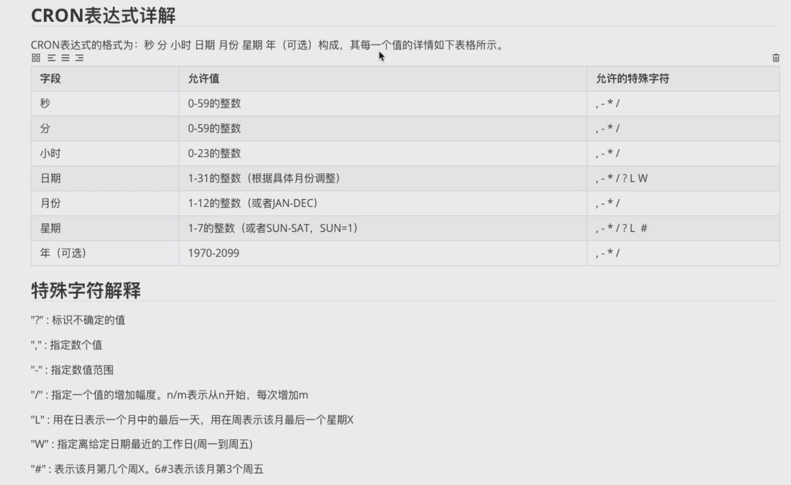

# SpringBoot-常见场景

## 1.热部署(非必要)

​	SpringBoot为我们提供了一个方便我们开发测试的工具dev-tools。使用后可以实现热部署的效果。当我们运行了程序后对程序进行了修改并且离开了idea的界面时，程序会自动快速的重启。

​	 原理是**使用了两个ClassLoder(类加载器)**,一个ClassLoader加载哪些不会改变的类(第三方jar包),另一个ClassLoader加载会更改的类.称之为Restart ClassLoader,这样在有代码更改的时候,原来的Restart Classloader被丢弃,重新创建一个Restart ClassLoader,由于需要加载的类相比较少,所以实现了较快的重启。

​	查看方式：

~~~java
    @GetMapping("/test")
    public R test(@NotBlank(message = "注意：name不能为空哦") String name){
        // 查看当前线程的类加载器
        System.out.println(Thread.currentThread().getContextClassLoader());
        return R.success(name);
    }
~~~

使用热部署后会打印出：

~~~java
TomcatEmbeddedWebappClassLoader
  context: ROOT
  delegate: true
----------> Parent Classloader:
org.springframework.boot.devtools.restart.classloader.RestartClassLoader@1f79e5d8
~~~


### 1.1 准备工作

①设置IDEA自动编译

​	 在idea中的setting做下面配置 


②设置允许程序运行时自动启动

​	 ctrl + shift + alt + / 这组快捷键后会有一个小弹窗，点击Registry 就会进入下面的界面，找到下面的配置项并勾选，勾选后直接点close 


### 1.2使用

①添加依赖

~~~~xml
        <dependency>
            <groupId>org.springframework.boot</groupId>
            <artifactId>spring-boot-devtools</artifactId>
            <optional>true</optional>
        </dependency>
~~~~

②触发热部署

​	当我们在修改完代码或者静态资源后可以切换到其它软件，让IDEA自动进行编译，自动编译后就会触发热部署。

​	或者使用Ctrl+F9手动触发重新编译。


## 2.单元测试

​	我们可以使用SpringBoot整合Junit进行单元测试。

​	**Spring Boot 2.2.0 版本开始引入 JUnit 5 作为单元测试默认库**。

​	

### 2.1 使用

#### ①添加依赖

~~~~xml
        <dependency>
            <groupId>org.springframework.boot</groupId>
            <artifactId>spring-boot-starter-test</artifactId>
        </dependency>
~~~~

#### ②编写测试类

~~~~java
import com.sangeng.controller.HelloController;
import org.junit.jupiter.api.Test;
import org.springframework.beans.factory.annotation.Autowired;
import org.springframework.boot.test.context.SpringBootTest;

@SpringBootTest
public class ApplicationTest {

    @Autowired
    private HelloController helloController;

    @Test
    public void testJunit(){
        System.out.println(1);
        System.out.println(helloController);
    }
}
~~~~


**注意：测试类所在的包需要和启动类是在同一个包下。否则就要使用如下写法指定启动类。**

~~~~java
import com.sangeng.controller.HelloController;
import org.junit.jupiter.api.Test;
import org.springframework.beans.factory.annotation.Autowired;
import org.springframework.boot.test.context.SpringBootTest;

//classes属性来指定启动类
@SpringBootTest(classes = HelloApplication.class)
public class ApplicationTest {

    @Autowired
    private HelloController helloController;

    @Test
    public void testJunit(){
        System.out.println(1);
        System.out.println(helloController);
    }
}

~~~~


### 3级 2.2 兼容老版本

​	如果是对老项目中的SpringBoot进行了版本升级会发现之前的单元测试代码出现了一些问题。

​	因为Junit5和之前的Junit4有比较大的不同。

​	先看一张图：

  

​	从上图可以看出  **JUnit 5 = JUnit Platform + JUnit Jupiter + JUnit Vintage**


- **JUnit Platform**： 这是Junit提供的平台功能模块，通过它，其它的测试引擎也可以接入
- **JUnit JUpiter**：这是JUnit5的核心，是一个基于JUnit Platform的引擎实现，它包含许多丰富的新特性来使得自动化测试更加方便和强大。
- **JUnit Vintage**：这个模块是兼容JUnit3、JUnit4版本的测试引擎，使得旧版本的自动化测试也可以在JUnit5下正常运行。


​	虽然Junit5包含了**JUnit Vintage**来兼容JUnit3和Junit4，但是**SpringBoot 2.4 以上版本对应的spring-boot-starter-test移除了默认对** **Vintage 的依赖。**所以当我们仅仅依赖spring-boot-starter-test时会发现之前我们使用的@Test注解和@RunWith注解都不能使用了。

​	所以**只要导入这个被移除的JUnit Vintage依赖即可进行兼容**

~~~~xml
        <dependency>
            <groupId>org.junit.vintage</groupId>
            <artifactId>junit-vintage-engine</artifactId>
            <scope>test</scope>
        </dependency>
~~~~


**注意：**

​		**org.junit.Test对应的是Junit4的版本，就搭配@RunWith注解来使用。**

SpringBoot2.2.0之前版本的写法

~~~~java
import com.sangeng.controller.HelloController;
//import org.junit.jupiter.api.Test;
import org.junit.Test;
import org.junit.runner.RunWith;
import org.springframework.beans.factory.annotation.Autowired;
import org.springframework.boot.test.context.SpringBootTest;
import org.springframework.test.context.junit4.SpringRunner;

//classes属性来指定启动类
@SpringBootTest
@RunWith(SpringRunner.class)
public class ApplicationTest {

    @Autowired
    private HelloController helloController;

    @Test
    public void testJunit(){
        System.out.println(1);
        System.out.println(helloController);
    }
}
~~~~

### Junit4的写法

​	**Spring Boot 2.2.0 版本开始引入 JUnit 5 作为单元测试默认库**。之前都是Junit4

导入依赖：见上

新建包，包结构要与开发的包结构保存一致。

①编写配置类：

~~~java
/**
 * 单元测试配置类
 */
@SpringBootConfiguration
@ComponentScan("com.kana.pan.schedule") // 配置组件扫描：test包下的包
public class ScheduleTestConfig {
}

~~~


②编写测试类，进行测试

~~~java
/**
 * 定时任务模块单元测试
 */
@RunWith(SpringJUnit4ClassRunner.class)// Junit4
@ContextConfiguration(classes = ScheduleTestConfig.class) // 指定上面的上下文配置类
@Transactional // 开启事务，测试完成后自动回滚，防止测试数据污染数据库
public class ScheduleTaskTest {

    @Autowired
    private ScheduleManager manager;

    @Autowired
    private SimpleScheduleTask scheduleTask;

    @Test // 进行测试
    public void testRunScheduleTask() {

    }

}

~~~


或者使用启动类作为配置类来进行测试，写法如下：

~~~java
@RunWith(SpringJUnit4ClassRunner.class)// Junit4
@SpringBootTest(classes = RPanServerLauncher.class) // 指定启动类
@Transactional // 开启事务，测试完成后自动回滚，防止测试数据污染数据库
public class TestRegister {

    @Test(expected = RPanBusinessException.class) // 设置期待的异常为RPanBusinessException，出现了则会通过测试
    public void test2(){
		// 配合cn.hutool.core.lang.Assert包下的Assrt断言来使用
        String username = null;
        Assert.isTrue(username == null);
    }
}
~~~


## 3.整合mybatis

### 3.1 准备工作

①数据准备

~~~~mysql
/*Table structure for table `user` */
DROP TABLE IF EXISTS `user`;
CREATE TABLE `user` (
  `id` int(11) NOT NULL AUTO_INCREMENT,
  `username` varchar(50) DEFAULT NULL,
  `age` int(11) DEFAULT NULL,
  `address` varchar(50) DEFAULT NULL,
  PRIMARY KEY (`id`)
) ENGINE=InnoDB AUTO_INCREMENT=10 DEFAULT CHARSET=utf8;

/*Data for the table `user` */

insert  into `user`(`id`,`username`,`age`,`address`) values (2,'pdd',25,'上海'),(3,'UZI',19,'上海11'),(4,'RF',19,NULL),(6,'三更',14,'请问2'),(8,'test1',11,'cc'),(9,'test2',12,'cc2');

/*!40101 SET SQL_MODE=@OLD_SQL_MODE */;
/*!40014 SET FOREIGN_KEY_CHECKS=@OLD_FOREIGN_KEY_CHECKS */;
/*!40014 SET UNIQUE_CHECKS=@OLD_UNIQUE_CHECKS */;
/*!40111 SET SQL_NOTES=@OLD_SQL_NOTES */;

~~~~

②实体类

~~~~java
import lombok.AllArgsConstructor;
import lombok.Data;
import lombok.NoArgsConstructor;

@Data
@AllArgsConstructor
@NoArgsConstructor
public class User {
    private Integer id;
    private String username;
    private Integer age;
    private String address;
}

~~~~


### 3.2 整合步骤

​	查看Mybatis与SpringBoot对应的版本

​	github: https://github.com/mybatis/spring-boot-starter/

#### ①依赖

~~~~xml
        <!--mybatis启动器-->
        <dependency>
            <groupId>org.mybatis.spring.boot</groupId>
            <artifactId>mybatis-spring-boot-starter</artifactId>
            <version>2.2.0</version><!--非官方的，需要指定版本，springBoot父工程中没有-->
        </dependency>
        <!--mysql驱动-->
        <dependency>
            <groupId>mysql</groupId>
            <artifactId>mysql-connector-java</artifactId>
            <scope>runtime</scope>
        </dependency>
~~~~

#### ②配置数据库信息

~~~~yml
spring:
  datasource:
    url: jdbc:mysql://localhost:3306/test?characterEncoding=utf-8&serverTimezone=UTC
    username: root
    password: root
    driver-class-name: com.mysql.cj.jdbc.Driver
~~~~

#### ③配置mybatis相关配置

~~~~yml
mybatis:
  mapper-locations: classpath:mapper/*Mapper.xml # mapper映射文件路径
  type-aliases-package: com.sangeng.domain   # 配置哪个包下的类有默认的别名
  configuration:
    map-underscore-to-camel-case: true # 开启驼峰命名映射
logging:
  level:
    com.mvcDemo.mapper: DEBUG # 打印mybatis的日志
~~~~

#### ④编写Mapper接口   

**注意:在接口上加上@Mapper 和@Repository 注解**(值得一提的是，最简洁的写法是只写@Mapper注解而不写@Repository，因为运行时Mybatis会自动把这个Bean注入容器中，不需要我们手动的进行注入，但是不写的话，idea编译时会显示红色波浪线，表示在容器中找不到这个类型的Bean)

**也可以在启动类上使用@MapperScan("com.kana.mapper")注解，指定扫描的mapper包**

~~~~java
@Repository
@Mapper // 告诉Mybatis这是一个mapper接口，否则Mybatis识别不出来
public interface UserMapper {
    public List<User> findAll();
}

~~~~

#### ⑤编写mapper接口对应的xml文件

~~~~xml
<?xml version="1.0" encoding="UTF-8" ?>
<!DOCTYPE mapper PUBLIC "-//mybatis.org//DTD Mapper 3.0//EN" "http://mybatis.org/dtd/mybatis-3-mapper.dtd" >
<mapper namespace="com.sangeng.mapper.UserMapper">
    <select id="findAll" resultType="com.sangeng.domain.User">
        select * from user
    </select>
</mapper>
~~~~

#### ⑥测试

~~~~java
@SpringBootTest(classes = HelloApplication.class)
public class SpringMyTest {

    @Autowired
    UserMapper userMapper;


    @Test
    public void tesMapper(){
        System.out.println(userMapper.findAll());
    }
}
~~~~


## 4.Web开发

### 4.1 静态资源访问

​	由于SpringBoot的项目是**打成jar包而不是war包**的所以没有之前web项目的那些web资源目录(webapps)。

​	那么我们的静态资源要放到哪里呢？

​	从SpringBoot官方文档中我们可以知道，我们可以把静态资源放到 `resources/static`   (或者 `resources/public` 或者`resources/resources` 或者 `resources/META-INF/resources`) 中即可。

​	静态资源放完后，**/ 相当于 resources/static/**

​	例如我们想访问文件：resources/static/index.html  只需要在访问时资源路径写成/index.html即可。  

​	例如我们想访问文件：resources/static/pages/login.html  访问的资源路径写成： /pages/login.html


#### 4.1.1 修改静态资源访问路径

**静态资源访问路径，即：（想要访问静态资源时应该访问的路径，访问路径后会跳转到静态资源存放目录中）**

​	**注意：**

​	SpringBoot默认的静态资源路径匹配为/**,意味着请求/index.html时会访问resources/static/index.html 。

​	如果想要修改可以通过 `spring.mvc.static-path-pattern` 这个配置进行修改。

​	例如想让访问静态资源的url必须前缀有/res。例如/res/index.html 才能访问到static目录中的。我们可以修改如下：

在application.yml中

~~~~yml
spring:
  mvc:
    static-path-pattern: /res/** #修改静态资源访问路径，设置为访问res下的目录及其子目录，表示请求/res/index.html时才可以访问resources/static/index.html
~~~~


#### 4.1.2 修改静态资源存放目录

**静态资源存放目录，即：存放静态资源的目录(可以有多个)**

​	我们可以修改 spring.web.resources.static-locations 这个配置来修改静态资源的存放目录。

​	例如:

~~~~yml
spring:
  web:
    resources:
      static-locations:
        - classpath:/sgstatic/ 
        - classpath:/static/
~~~~


### 4.4 响应体响应数据

​	无论是RestFul风格还是我们之前web阶段接触过的异步请求，都需要把数据转换成Json放入响应体中。


#### 4.4.1 数据放到响应体

​	我们的SpringMVC为我们提供了**@ResponseBody**来非常方便的把Json放到响应体中。

​	**@ResponseBody**可以加在哪些东西上面？类上和方法上


#### 4.4.2 数据转换成Json

##### 4.4.2.1 配置

​	SpringBoot项目中使用了web的start后，不需要进行额外的依赖和配置


##### 4.4.2.2 使用

​	只要把要转换的数据直接作为方法的返回值返回即可。SpringMVC会帮我们把返回值转换成json。具体代码请参考范例。


#### 4.4.3 范例

~~~~java
@Controller
@RequestMapping("/response")
public class ResponseController {

    @RequestMapping("/user/{id}")
    @ResponseBody
    public User findById(@PathVariable("id") Integer id){
        User user = new User(id, "三更草堂", 15, null);
        return user;
    }
}
~~~~


### 4.5 跨域请求

#### 4.5.1 什么是跨域

​	浏览器**出于安全**的考虑（移动端发起请求并不会发生这种错误），**使用 XMLHttpRequest对象(AJAX)发起 HTTP请求时必须遵守同源策略，否则就是跨域的HTTP请求**，默认情况下是被禁止的。 同源策略要求源相同才能正常进行通信，即**协议、域名、端口号都完全一致(通常是端口不同导致的)**。 

跨域触发条件：ajax请求的发起者与服务者的协议、域名、端口任意一个不一致时。

例如：使用前端程序在loaclhost的8090端口上发起一个ajax请求，请求的url为http:localhost:10010,此时ajax请求的发起者与服务者的端口不同，于是出现跨域问题。

**跨域问题**: 浏览器禁止请求的发起者与服务端发生跨域ajax请求，如果发起的请求是跨域的，就会被浏览器拦截。

为什么移动端发起请求并不会发生这种错误？

​	gpt4回答：

​	对于移动端（如手机或平板电脑）的非浏览器应用（通常被称作“**原生应用**”），它们不受同源策略的约束。原生应用可以使用各自平台（如iOS中的`NSURLSession`，Android中的`HttpURLConnection`或`OkHttpClient`）的网络API向任何服务器发送HTTP请求。由于它们不执行在浏览器的安全上下文中，因此可以自由地发起跨域请求。

要注意的是，虽然原生应用可以绕过同源策略，但它们仍需要考虑服务器在CORS（跨源资源共享）策略上的设定。如果服务器端没有正确配置CORS响应头来允许来自其他源的请求，这些请求可能会由于无法满足CORS预检要求而失败。


#### 4.5.2 CORS解决跨域

​	CORS是一个W3C标准，全称是”跨域资源共享”（Cross-origin resource sharing），允许浏览器向跨源服务器，发出XMLHttpRequest请求，从而克服了AJAX只能同源使用的限制。

​	它通过使服务器增加一个特殊的Header[Access-Control-Allow-Origin]来告诉客户端跨域的限制（客户端需要看服务器是否同意），如果浏览器支持CORS、并且判断Origin通过的话，就会允许XMLHttpRequest发起跨域请求。

​	**大致流程：**

​	发起跨域请求时，**请求头**中会有**Origin:**http: //localhost:63379属性，表示当前浏览器发起了一个跨域请求，发起请求的地址为http: //localhost:63379。如果服务器中配置了允许这个地址进行跨域访问，则**响应头**中会有**Access-Control-Allow-Origin**：http: //localhost:63379属性，表示允许http: //localhost:63379进行跨域访问。

​	

#### 4.5.3 SpringBoot使用CORS解决跨域

##### 1.使用@CrossOrigin

可以在支持跨域的方法上或者是Controller上加上@CrossOrigin注解。

~~~~java
@RestController
@RequestMapping("/user")
@CrossOrigin
public class UserController {

    @Autowired
    private UserServcie userServcie;

    @RequestMapping("/findAll")
    public ResponseResult findAll(){
        //调用service查询数据 ，进行返回
        List<User> users = userServcie.findAll();

        return new ResponseResult(200,users);
    }
}

~~~~


##### 2. 实现WebMvcConfigurer 接口

重写addCorsMappings 方法，**配置CorsInterceptor拦截器**

在CorsInterceptor拦截器中会读取并按照下面配置的信息进行跨域的处理:

~~~~java
@Configuration
public class CorsConfig implements WebMvcConfigurer {

    @Override
    public void addCorsMappings(CorsRegistry registry) {
      // 设置允许跨域的路径
        registry.addMapping("/**")
                // 设置允许跨域请求的域名
                .allowedOriginPatterns("*")
                // 是否允许cookie
                .allowCredentials(true)
                // 设置允许的请求方式
                .allowedMethods("GET", "POST", "DELETE", "PUT")
                // 设置允许的header属性
                .allowedHeaders("*")
                // 跨域允许持续的时间 3600秒，有的复杂请求例如put请求，会在发起跨域put请求之前会先发送一个请求来询问服务器是否允许跨域，服务器允许跨域后，在接下来的3600秒内发起put的跨域请求后，就不需要再次向服务器进行确认了。
                .maxAge(3600);
    }
}
~~~~

发起一个跨域的post请求时，会先发送一个**(OPTIONS方法)Request Method:OPTIONS**的请求来询问是否允许跨域。

### 4.6 登录案例

#### 4.6.0 登录案例


##### 4.6.0.1 思路分析

​		在前后端分离的场景中，很多时候会采用token的方案进行登录校验。

​		**大致流程：**

​		登录成功时，后端会根据一些用户信息(id...)生成一个token字符串返回给前端。

​		前端会存储这个token。以后前端发起请求时如果有token就会把token放在请求头中发送给后端。

​		后端接口就可以获取请求头中的token信息进行解析，如果解析不成功说明token超时了或者不是正确的token，相当于是未登录状态。解析成功则登录成功，可以访问一些需要权限的资源。

​		如果解析成功，说明前端是已经登录过的。

##### 4.6.0.2 Token生成方案-JWT

​		本案例采用目前企业中运用比较多的JWT来生成token。

​		**token方案的优点：**采用JWT方案来生成token可以统一实现前端与移动端的登录校验流程，这是之前的Session方案不能做到的，因为**移动端没有Session的概念。**

​		**使用UUID类来生成唯一的id，UUID.randomUUID().toString().**

​		使用时先引入相关依赖

~~~~xml
        <dependency>
            <groupId>io.jsonwebtoken</groupId>
            <artifactId>jjwt</artifactId>
            <version>0.9.0</version>
        </dependency>
~~~~

​		然后可以使用下面的工具类来生成和解析token

~~~~java
import io.jsonwebtoken.Claims;
import io.jsonwebtoken.JwtBuilder;
import io.jsonwebtoken.Jwts;
import io.jsonwebtoken.SignatureAlgorithm;

import javax.crypto.SecretKey;
import javax.crypto.spec.SecretKeySpec;
import java.util.Base64;
import java.util.Date;
import java.util.UUID;

/**
 * JWT工具类
 */
public class JwtUtil {

    //有效期为
    public static final Long JWT_TTL = 60 * 60 *1000L;// 60 * 60 *1000  一个小时
    //设置秘钥明文
    public static final String JWT_KEY = "sangeng";

    /**
     * 创建token
     * @param id  使用UUID类生成一个不重复的id
     * @param subject 传入要加密的内容(用户的相关信息,如id)
     * @param ttlMillis
     * @return
     */
    public static String createJWT(String id, String subject, Long ttlMillis) {

        SignatureAlgorithm signatureAlgorithm = SignatureAlgorithm.HS256;
        long nowMillis = System.currentTimeMillis();
        Date now = new Date(nowMillis);
        if(ttlMillis==null){
            ttlMillis=JwtUtil.JWT_TTL;
        }
        long expMillis = nowMillis + ttlMillis;
        Date expDate = new Date(expMillis);
        SecretKey secretKey = generalKey();

        JwtBuilder builder = Jwts.builder()
                .setId(id)              //唯一的ID
                .setSubject(subject)   // 主题  可以是JSON数据
                .setIssuer("sg")     // 签发者
                .setIssuedAt(now)      // 签发时间
                .signWith(signatureAlgorithm, secretKey) //使用HS256对称加密算法签名, 第二个参数为秘钥
                .setExpiration(expDate);// 设置过期时间
        return builder.compact();
    }

    /**
     * 生成加密后的秘钥 secretKey
     * @return
     */
    public static SecretKey generalKey() {
        byte[] encodedKey = Base64.getDecoder().decode(JwtUtil.JWT_KEY);
        SecretKey key = new SecretKeySpec(encodedKey, 0, encodedKey.length, "AES");
        return key;
    }
    
    /**
     * 解析
     *
     * @param jwt
     * @return
     * @throws Exception
     */
    public static Claims parseJWT(String jwt) throws Exception {
        SecretKey secretKey = generalKey();
        return Jwts.parser()
                .setSigningKey(secretKey)
                .parseClaimsJws(jwt)
                .getBody();
    }


}
~~~~

##### 4.6.0.3 登录接口实现


SystemUserController

~~~~java
import com.sangeng.domain.ResponseResult;
import com.sangeng.domain.SystemUser;
import com.sangeng.service.SystemUserService;
import com.sangeng.utils.JwtUtil;
import org.springframework.beans.factory.annotation.Autowired;
import org.springframework.web.bind.annotation.PostMapping;
import org.springframework.web.bind.annotation.RequestBody;
import org.springframework.web.bind.annotation.RequestMapping;
import org.springframework.web.bind.annotation.RestController;

import java.util.HashMap;
import java.util.Map;
import java.util.UUID;

@RestController
@RequestMapping("/sys_user")
public class SystemUserController {
    @Autowired
    private SystemUserService userService;

    @PostMapping("/login")
    public ResponseResult login(@RequestBody SystemUser user) {
        //校验用户名密码是否正确
        SystemUser loginUser = userService.login(user);
        // 可能不止返回token这一个数据，使用map进行统一存储（顺便命名）
        Map<String, Object> map;
        if (loginUser != null) {
            //如果正确 生成token返回
            map = new HashMap<>();
            String token = JwtUtil.createJWT(UUID.randomUUID().toString(), String.valueOf(loginUser.getId()), null);
            map.put("token", token);
        } else {
            //如果不正确 给出相应的提示
            return new ResponseResult(300, "用户名或密码错误，请重新登录");
        }
        return new ResponseResult(200, "登录成功", map);
    }
}

~~~~

#### 过滤器的使用

方式1：

~~~java
package com.kana.filter;

import com.alibaba.fastjson.JSON;
import com.kana.constants.SystemConstants;
import com.kana.domain.ResponseResult;
import com.kana.domain.entity.LoginUser;
import com.kana.enums.AppHttpCodeEnum;
import com.kana.utils.JwtUtil;
import com.kana.utils.RedisCache;
import com.kana.utils.WebUtils;
import io.jsonwebtoken.Claims;
import org.springframework.beans.factory.annotation.Autowired;
import org.springframework.security.authentication.UsernamePasswordAuthenticationToken;
import org.springframework.security.core.context.SecurityContextHolder;
import org.springframework.stereotype.Component;
import org.springframework.util.StringUtils;
import org.springframework.web.filter.OncePerRequestFilter;

import javax.servlet.FilterChain;
import javax.servlet.ServletException;
import javax.servlet.http.HttpServletRequest;
import javax.servlet.http.HttpServletResponse;
import java.io.IOException;
import java.util.Objects;

/***
 * 继承OncePerRequestFilter重写方法实现自定义过滤器至SpringSecurity中
 * 
 */
@Component
public class JwtAuthenticationTokenFilter extends OncePerRequestFilter {
    @Autowired
    private RedisCache redisCache;

    /***
     * 
     * @param httpServletRequest
     * @param httpServletResponse
     * @param filterChain
     * @throws ServletException
     * @throws IOException
     */
    @Override
    protected void doFilterInternal(HttpServletRequest httpServletRequest,
                                    HttpServletResponse httpServletResponse,
                                    FilterChain filterChain) throws ServletException, IOException {
        //获取前端请求头中携带的token并解析出userId
        String token = httpServletRequest.getHeader("token");
		// 业务操作...
        //放行
        filterChain.doFilter(httpServletRequest,httpServletResponse);

    }
}

~~~

方式2：

~~~java
/**
 * @Description: 登录用戶信息包装过滤器
 * @Author: Zifeng.Lin
 * @Date: 2024/4/7 16:21
 **/
@Component
@WebFilter(urlPatterns = "/**") // 表示该过滤器将匹配所有的 URL 路径
public class UserInfoRequestWrapperFilter implements Filter {

    @Override
    public void doFilter(ServletRequest request, ServletResponse response, FilterChain chain) throws IOException, ServletException {
        UserInfoRequestWrapper userInfoRequestWrapper = new UserInfoRequestWrapper((HttpServletRequest) request, (HttpServletResponse) response);
        chain.doFilter(userInfoRequestWrapper, response);
    }
}
~~~


#### 4.6.1 拦截器的概念

​		**拦截器在Handler方法之前，过滤器在Servlet之前。**

#### 4.6.1 使用步骤

##### ①创建类实现HandlerInterceptor接口

~~~~java
public class LoginInterceptor implements HandlerInterceptor {
}
~~~~

##### ②实现方法

~~~~java
@Component
public class LoginInterceptor implements HandlerInterceptor {

    @Override
    public boolean preHandle(HttpServletRequest request, HttpServletResponse response, Object handler) throws Exception {
        //获取请求头中的token
        String token = request.getHeader("token");
        //判断token是否为空，如果为空也代表未登录 提醒重新登录（401）
        if(!StringUtils.hasText(token)){
            response.sendError(HttpServletResponse.SC_UNAUTHORIZED);
            return false;
        }
        //解析token看看是否成功
        try {
            Claims claims = JwtUtil.parseJWT(token);
            String subject = claims.getSubject();
            System.out.println(subject);
        } catch (Exception e) {
            e.printStackTrace();
            //如果解析过程中没有出现异常说明是登录状态
            //如果出现了异常，说明未登录，提醒重新登录（401）
            response.sendError(HttpServletResponse.SC_UNAUTHORIZED);
            return false;
        }
        return true;
    }
}
~~~~

##### ③配置拦截器(实现WebMvcConfigurer接口重写方法代替xml配置)

**注意**：如果这个工程（模块）中有**静态资源**，则应该默认放行不拦截。


~~~~java
@Configuration
public class LoginConfig implements WebMvcConfigurer {

    @Autowired
    private LoginInterceptor loginInterceptor;

    @Override
    public void addInterceptors(InterceptorRegistry registry) {
        registry.addInterceptor(loginInterceptor)//添加拦截器
            .addPathPatterns("/**")  //配置拦截路径
            .excludePathPatterns("/sys_user/login");//配置排除路径
    }
}
~~~~


### 4.7 异常统一处理

#### ①创建类加上@ControllerAdvice注解进行标识

~~~~java
@ControllerAdvice
public class MyControllerAdvice {

}
~~~~

#### ②定义异常处理方法	

​	定义异常处理方法，使用**@ExceptionHandler**标识可以处理的异常。

~~~~java
@ControllerAdvice
public class MyControllerAdvice {

    @ExceptionHandler(RuntimeException.class)
    @ResponseBody
    public ResponseResult handlerException(Exception e){
        //获取异常信息，存放如ResponseResult的msg属性
        String message = e.getMessage();
        ResponseResult result = new ResponseResult(300,message);
        //把ResponseResult作为返回值返回，要求到时候转换成json存入响应体中
        return result;
    }
}
~~~~


### 4.8 获取web原生对象

​	我们之前在web阶段我们经常要使用到request对象，response，session对象等。我们也可以通过SpringMVC获取到这些对象。（不过在MVC中我们很少获取这些对象，因为有更简便的方式，避免了我们使用这些原生对象相对繁琐的API。）

​	我们只需要在方法上添加对应类型的参数即可，但是注意数据类型不要写错了，SpringMVC会把我们需要的对象传给我们的形参。

~~~~java
@RestController
public class TestController {

    @RequestMapping("/getRequestAndResponse")
    public ResponseResult getRequestAndResponse(HttpServletRequest request, HttpServletResponse response, HttpSession session){
        System.out.println(request);
        return new ResponseResult(200,"成功");
    }
}

~~~~

其他获取方式：

~~~java
// 例如：根据请求上下文持有者RequestContextHolder获取http请求对象 来 判断请求头或者请求参数中是否携带了token信息
    private boolean checkAndSaveUserId() {
        ServletRequestAttributes requestAttributes =
                    (ServletRequestAttributes) RequestContextHolder.getRequestAttributes();
HttpServletRequest request = requestAttributes.getRequest();
        // 从请求头或者请求参数获取token
        String accessToken = request.getHeader(LOGIN_AUTH_REQUEST_HEADER_NAME);
        if(StringUtils.isBlank(accessToken)){
            accessToken = request.getParameter(LOGIN_AUTH_PARAM_NAME);
            if(StringUtils.isBlank(accessToken)){
                return false;
            }
        }
        // 省略...
    }
~~~


### 4.9 自定义参数解析（如果有相应的注解，则执行相应的方法,把方法的返回值进行赋值）

​	如果我们想实现像获取请求体中的数据那样，在Handler方法的参数上增加一个@RepuestBody注解就可以获取到对应的数据的话。

​	可以**使用HandlerMethodArgumentResolver来实现自定义的参数解析**。

①定义用来标识的注解

~~~~java
@Target(ElementType.PARAMETER) // 指定注解可以作用于方法的参数上
@Retention(RetentionPolicy.RUNTIME)
public @interface CurrentUserId {

}
~~~~

②创建类实现HandlerMethodArgumentResolver接口并重写其中的方法

**注意加上@Component注解注入Spring容器**

~~~~java
@Component
public class UserIdArgumentResolver implements HandlerMethodArgumentResolver {

    //判断方法参数是否能使用当前的参数解析器进行解析
    @Override
    public boolean supportsParameter(MethodParameter parameter) {
        //如果方法参数有加上CurrentUserId注解，就能把被我们的解析器解析
        return parameter.hasParameterAnnotation(CurrentUserId.class);
    }
    //进行参数解析的方法，可以在方法中获取对应的数据，然后把数据作为返回值返回。方法的返回值就会赋值给对应的方法参数
    @Override
    public Object resolveArgument(MethodParameter parameter, ModelAndViewContainer mavContainer, NativeWebRequest webRequest, WebDataBinderFactory binderFactory) throws Exception {
        //获取请求头中的token
        String token = webRequest.getHeader("token");
        if(StringUtils.hasText(token)){
            //解析token，获取userId
            Claims claims = JwtUtil.parseJWT(token);
            String userId = claims.getSubject();
            //返回结果
            return userId;
        }
        return null;
    }
}
~~~~

③配置参数解析器

~~~~java
@Configuration
public class ArgumentResolverConfig implements WebMvcConfigurer {

    @Autowired //注意：这里需要使用子类UserIdArgumentResolver来获取对象，不能使用父类
    private UserIdArgumentResolver userIdArgumentResolver;

    @Override
    public void addArgumentResolvers(List<HandlerMethodArgumentResolver> resolvers) {
        // 在参数解析器列表中直接添加即可
        resolvers.add(userIdArgumentResolver);
    }
}
~~~~


④测试

在需要获取UserId的方法中增加对应的方法参数然后使用@CurrentUserId进行标识即可获取到数据

~~~~java
@RestController
@RequestMapping("/user")
public class UserController {

    @Autowired
    private UserServcie userServcie;

    @RequestMapping("/findAll")
    public ResponseResult findAll(@CurrentUserId String userId) throws Exception {
        System.out.println(userId);

        return new ResponseResult(200,users);
    }
}
~~~~


### 4.10 声明式事务

​	**保证一组数据库的操作，要么同时成功，要么同时失败**

​	对数据库的操作通过mapper层的方法来实现，而service则是通过操作mapper的方法来进行对数据库的操作，使用**@Transactional注解放在Service层中。**

​	直接在需要事务控制的方法上加上对应的注解**@Transactional**

**注意**：想要**@Transactional**注解在程序有异常时进行回滚操作，**出现的异常必须是RuntimeException或者其子类的异常**。如果是Exception等受检查异常是不能够进行回滚操作的，如果程序程序这些异常**会使事务失效**。


~~~~java
@Service
public class UserServiceImpl implements UserServcie {

    @Autowired
    private UserMapper userMapper;

    @Override
    public List<User> findAll() {
        return userMapper.findAll();
    }

    @Override
    @Transactional
    public void insertUser() {
        //添加2个用户到数据库
        User user = new User(null,"sg666",15,"上海");
        User user2 = new User(null,"sg777",16,"北京");
        userMapper.insertUser(user);
        System.out.println(1/0);
        userMapper.insertUser(user2);
    }


}
~~~~


### 4.11 AOP

​		在SpringBoot中**默认是开启AOP功能的**。如果不想开启AOP功能可以使用如下配置设置为false(一般使用不到)

~~~~yml
spring:
  aop:
    auto: false
~~~~


#### 4.11.1 使用步骤

①添加依赖

~~~~xml
        <dependency>
            <groupId>org.springframework.boot</groupId>
            <artifactId>spring-boot-starter-aop</artifactId>
        </dependency>
~~~~

②自定义注解

~~~~java
@Target(ElementType.METHOD)
@Retention(RetentionPolicy.RUNTIME)
public @interface InvokeLog {
}

~~~~

③定义切面类

~~~~java
@Aspect  //标识这是一个切面类
@Component
public class InvokeLogAspect {

    //确定切点
    @Pointcut("@annotation(com.sangeng.aop.InvokeLog)")
    public void pt(){
    }

    @Around("pt()")
    public Object printInvokeLog(ProceedingJoinPoint joinPoint){
        //目标方法调用前
        Object proceed = null;
        MethodSignature signature = (MethodSignature) joinPoint.getSignature();
        String methodName = signature.getMethod().getName();
        System.out.println(methodName+"即将被调用");
        try {
            proceed = joinPoint.proceed();
            //目标方法调用后
            System.out.println(methodName+"被调用完了");
        } catch (Throwable throwable) {
            throwable.printStackTrace();
            //目标方法出现异常了
            System.out.println(methodName+"出现了异常");
        }
        return proceed;
    }
}

~~~~

④在需要正确的地方增加对应的注解

~~~~Java
@Service
public class UserServiceImpl implements UserServcie {

    @Autowired
    private UserMapper userMapper;

    @Override
    @InvokeLog  //需要被增强方法需要加上对应的注解
    public List<User> findAll() {
        return userMapper.findAll();
    }
}
~~~~


#### 4.11.2 切换动态代理

​	有的时候我们需要修改AOP的代理方式。

​	我们可以使用以下方式修改：

​	springBoot默认使用cglib动态代理,切换为jdk动态代理时：

​	引入依赖：

~~~xml
        <dependency>
            <groupId>org.aspectj</groupId>
            <artifactId>aspectjweaver</artifactId>
        </dependency>
~~~

​	在配置文件中配置spring.aop.proxy-target-class为false这为使用jdk动态代理。该配置默认值为true，代表**默认使用cglib动态代理。**

~~~~java
@SpringBootApplication
@EnableAspectJAutoProxy(proxyTargetClass = false)//修改代理方式为jdk代理
public class WebApplication {
    public static void main(String[] args) {
        ConfigurableApplicationContext context = SpringApplication.run(WebApplication.class, args);
    }
}
~~~~

​	如果想生效还需要在配置文件中做如下配置

~~~~yml
spring:
  aop:
    proxy-target-class: false #切换动态代理的方式
~~~~


### 4.12 模板引擎相关-Thymeleaf（Jsp）

#### 4.12.1 快速入门

##### 4.12.1.1 导入依赖

~~~~xml
        <!--thymeleaf依赖-->
        <dependency>
            <groupId>org.springframework.boot</groupId>
            <artifactId>spring-boot-starter-thymeleaf</artifactId>
        </dependency>
~~~~

##### 4.12.1.2 定义Controller

在controller中往域中存数据，并且跳转

~~~~java
@Controller
public class ThymeleafController {

    @Autowired
    private UserServcie userServcie;

    @RequestMapping("/thymeleaf/users")
    public String users(Model model){
        //获取数据
        List<User> users = userServcie.findAll();
        //望域中存入数据
        model.addAttribute("users",users);
        model.addAttribute("msg","hello thymeleaf");
        //页面跳转 不需要添加前缀与后缀，会自动拼接前缀/resources/与后缀.html,然后跳转到resources\templates\下面寻找table-standard.html文件
        return "table-standard";
    }
}
~~~~

##### 4.12.1.3 书写htmL

springBoot中的thymeleaf默认在**resources\templates**下存放模板页面，静态资源(css,js)存放在resources\static文件夹下。

在html标签中加上 xmlns:th="http://www.thymeleaf.org",引入命名空间。

获取域中的name属性的值可以使用： ${name}    注意要在th开头的属性中使用

~~~~html
<html lang="en" class="no-ie" xmlns:th="http://www.thymeleaf.org">
 .....
 <div class="panel-heading" th:text="${msg}">Kitchen Sink</div>
~~~~

如果需要**引入静态资源**，需要使用如下写法。**语法： th: ... ="@{/ ... }"**

~~~~html
   <link rel="stylesheet" th:href="@{/app/css/bootstrap.css}">
   <link rel="stylesheet" th:href="@{/vendor/fontawesome/css/font-awesome.min.css}">
   <link rel="stylesheet" th:href="@{/vendor/animo/animate+animo.css}">
   <link rel="stylesheet" th:href="@{/vendor/csspinner/csspinner.min.css}">
   <link rel="stylesheet" th:href="@{/app/css/app.css}">

   <script th:src="@{/vendor/modernizr/modernizr.js}" type="application/javascript"></script>
   <script th:src="@{/vendor/fastclick/fastclick.js}" type="application/javascript"></script>
~~~~

遍历语法：遍历的语法  th:each="自定义的元素变量名称 : ${集合变量名称}" 

~~~~html
<tr th:each="user:${users}"><!-- 遍历users集合，把遍历到的每个元素(user对象)命名为user并且存放到域中-->
    <!-- 从域中获取user对象数据进行渲染-->
    <td th:text="${user.id}"></td>
    <td th:text="${user.username}"></td>
    <td th:text="${user.age}"></td>
    <td th:text="${user.address}"></td>
</tr>
~~~~


## 5.整合Redis

### 启动Redis

在Redis目录下面打开cmd

运行下面的命令，读取redis.windows.conf配置文件运行Redis服务端

~~~sh
redis-server.exe redis.windows.conf
~~~

### ①依赖

~~~~xml
        <!--redis-->
        <dependency>
            <groupId>org.springframework.boot</groupId>
            <artifactId>spring-boot-starter-data-redis</artifactId>
        </dependency>
~~~~

### ②配置Redis地址和端口号

~~~~yml
spring:
  redis:
    host: 127.0.0.1 #redis服务器ip地址
    port: 6379  #redis端口号
~~~~

### ③注入RedisTemplate使用

~~~~java
    @Autowired
    private StringRedisTemplate redisTemplate;

    @Test
    public void testRedis(){
        redisTemplate.opsForValue().set("name","三更");
    }
~~~~

## 6.环境切换

### 6.1 为什么要使用profile

​	 在实际开发环境中，我们存在开发环境的配置，部署环境的配置，测试环境的配置等等，里面的配置信息很多时，例如：端口、上下文路径、数据库配置等等，若每次切换环境时，我们都需要进行修改这些配置信息时，会比较麻烦，profile的出现就是为了解决这个问题。它可以让我们针对不同的环境进行不同的配置，然后可以通过激活、指定参数等方式快速切换环境。

### 6.2 使用

#### 6.2.1 创建profile配置文件

​	 我们可以用**application-xxx.yml**的命名方式 创建配置文件，其中xxx可以根据自己的需求来定义。

​	例如

​			我们需要一个测试环境的配置文件，则可以命名为：**application-test.yml**

​			需要一个生产环境的配置文件，可以命名为：**application-prod.yml**

​	我们可以不同环境下**不同的配置**放到对应的profile文件中进行配置。然后把不同环境下都**相同的配置**放到application.yml文件中配置。


#### 6.2.2 激活环境

​	1.我们可以再**application.yml**文件中使用**spring.profiles.active**属性来配置激活哪个环境。 

~~~yml
spring:
  profiles:
    active: test # 使用application-test.yml+公共的application.yml作为配置文件
~~~


​	2.也可以使用**虚拟机参数**来指定激活环境。例如 ： **-Dspring.profiles.active=test**

​	

​	3.也可以使用命令行参数来激活环境。例如： **--spring.profiles.active=test**

把项目打包为jar包后，在jar包目录下面的cmd中执行即可：

~~~sh
java -jar xxx.jar  --spring.profiles.active=test
~~~


​	

## 7.日志

​	开启日志：开启后，别人请求了什么接口，传输的参数是什么都会进行打印日志，mybatis日志也会打印

~~~~yml
debug: true #开启日志(除了自己写的代码之外的日志都会打印)
logging:
  level:
    com.sangeng: debug #设置com.sangeng包的日志级别为debug,debug级别的日志都会打印
    
~~~~


## 8.指标监控

​	我们在日常开发中需要对程序内部的运行情况进行监控， 比如：健康度、运行指标、日志信息、线程状况等等 。而SpringBoot的监控Actuator就可以帮我们解决这些问题。


### 8.1 使用

①添加依赖

~~~~xml
<dependency>
 	<groupId>org.springframework.boot</groupId>
 	<artifactId>spring-boot-starter-actuator</artifactId>
</dependency>
~~~~

②访问监控接口

根据springBoot打印的日志信息来判断使用哪一个端口，访问哪一个路径

http://localhost:81/actuator

③配置启用监控端点

**注意：**需要添加双引号，因为在yml中*有特殊的含义

~~~~yml
management:
  endpoints:
    enabled-by-default: true # 配置启用所有端点
	web:
      exposure:
        include: "*" # web端暴露所有端点 
~~~~


### 8.2 常用端点

直接在yml文件的最左边书写，根据idea的提示进行选择即可。

| 端点名称         | 描述                                      |
| :--------------- | :---------------------------------------- |
| `beans`          | 显示应用程序中所有Spring Bean的完整列表。 |
| `health`         | 显示应用程序运行状况信息。                |
| `info`           | 显示应用程序信息。                        |
| `loggers`        | 显示和修改应用程序中日志的配置。          |
| `metrics`        | 显示当前应用程序的“指标”信息。            |
| `mappings`       | 显示所有`@RequestMapping`路径列表。       |
| `scheduledtasks` | 显示应用程序中的计划任务。                |


### 8.3 图形化界面 SpringBoot Admin

解析返回的JSON信息，使用图形化界面进行展示。

①创建SpringBoot Admin Server应用

创建一个新的springBoot模块，引入spring-boot-admin-starter-server依赖

~~~~xml
        <dependency>
            <groupId>de.codecentric</groupId>
            <artifactId>spring-boot-admin-starter-server</artifactId>
        </dependency>
~~~~

然后在启动类上加上@EnableAdminServer注解

~~~java
@EnableAdminServer
@SpringBootApplication
public class HelloApplication {
    public static void main(String[] args) {
        SpringApplication.run(HelloApplication.class, args);
    }
}
~~~

并且配置服务启动的端口：

~~~yml
server.port=8888
~~~

启动即可。

②配置SpringBoot Admin client应用

在需要监控的应用中加上spring-boot-admin-starter-client依赖

~~~~xml
        <dependency>
            <groupId>de.codecentric</groupId>
            <artifactId>spring-boot-admin-starter-client</artifactId>
            <version>2.3.1</version>
        </dependency>
~~~~

然后配置SpringBoot Admin Server的地址

~~~~yml
spring:
  boot:
    admin:
      client:
        url: http://localhost:8888 #配置 Admin Server的地址
~~~~


## 9:特殊功能

### 9.1开跑自启：启动项目时自动执行一些操作：

① 实现 CommandLineRunner接口后注入容器中即可：

~~~java
/**
 * 自定义一个类implements CommandLineRunner接口来指示springBoot程序启动时要做的一些事情
 */
@Component
public class ViewCountRunner implements CommandLineRunner {
    @Autowired
    private ArticleMapper articleMapper;

    @Autowired
    private RedisCache redisCache;

    /**
     * 程序启动时将数据库中每篇文章的访问量的数据存储到map中最后存储到Redis中
     * @param args
     * @throws Exception
     */
    @Override
    public void run(String... args) throws Exception {
        //获取所有的文章列表
        List<Article> articles = articleMapper.selectList(null);
        //存储在map集合中
        Map<String,Integer> map = articles.stream()
                .collect(Collectors.toMap(article -> article.getId().toString()
                        //value值转换为Integer类型而不是Long，后面才能进行递增
                        , article -> article.getViewCount().intValue()));
        //存储到Redis中
        redisCache.setCacheMap(SystemConstants.VIEWCOUNT_MAP_KEY,map);

    }

}

~~~

② 容器启动成功后会向它的Lintener发送很多事件，这里只监听其中的ApplicationReadyEvent事件

~~~java
/**
 * 项目启动成功日志打印监听器
 */
@Component
@Slf4j
public class StartedListener implements ApplicationListener<ApplicationReadyEvent> {

    /**
     * 项目启动成功将会在日志中输出对应的启动信息
     * 
     * @param applicationReadyEvent
     */
    @Override
    public void onApplicationEvent(ApplicationReadyEvent applicationReadyEvent) {
        // 获取配置文件的端口信息
        String serverPort = applicationReadyEvent.getApplicationContext().getEnvironment().getProperty("server.port");
        String serverUrl = String.format("http://%s:%s", "127.0.0.1", serverPort);
        // 使用AnsiOutput输出带颜色的日志
        log.info(AnsiOutput.toString(AnsiColor.BRIGHT_BLUE, "r pan server started at: ", serverUrl));
        if (checkShowServerDoc(applicationReadyEvent.getApplicationContext())) {
            log.info(AnsiOutput.toString(AnsiColor.BRIGHT_BLUE, "r pan server's doc started at:", serverUrl + "/doc.html"));
        }
        log.info(AnsiOutput.toString(AnsiColor.BRIGHT_YELLOW, "r pan server has started successfully!"));
    }

    /**
     * 校验是否开启了接口文档
     *
     * @param applicationContext
     * @return
     */
    private boolean checkShowServerDoc(ConfigurableApplicationContext applicationContext) {
        // 检查配置文件中swagger2.show的值是否为true，返回Boolean类型 和 检查容器中是否有名为swagger2Config的Bean
        return applicationContext.getEnvironment().getProperty("swagger2.show", Boolean.class, true) && applicationContext.containsBean("swagger2Config");
    }

}

~~~


### 9.2 定时任务：使用cron表达式实现定时任务

定时任务的实现方式有很多，比如XXL-Job等。但是其实核心功能和概念都是类似的，很多情况下只是调用的API不同而已。

#### 4级 实现方式1 @EnableScheduling注解

这里就用SpringBoot为我们提供的定时任务的API来实现一个定时任务:

① 使用@EnableScheduling注解开启定时任务功能

​	我们可以在配置类上加上@EnableScheduling

~~~~java
@SpringBootApplication
@MapperScan("com.sangeng.mapper")
@EnableScheduling
public class SanGengBlogApplication {
    public static void main(String[] args) {
        SpringApplication.run(SanGengBlogApplication.class,args);
    }
}
~~~~

② 确定定时任务执行代码，并配置任务执行时间

​	使用@Scheduled注解标识需要定时执行的代码。注解的cron属性相当于是任务的执行时间。目前可以使用 0/5 * * * * ? 进行测试，代表从0秒开始，每隔5秒执行一次。 

​	注意：对应的bean要注入容器，否则不会生效。

~~~~java
@Component
public class TestJob {

    @Scheduled(cron = "0/5 * * * * ?")
    public void testJob(){
        //要执行的代码
        System.out.println("定时任务执行了");
    }
}

~~~~

#### 例子（博客项目）

~~~java
@Component
public class UpdateViewCountJob {
    @Autowired
    //继承了IService,提供了许多批量操作的方法
    private ArticleService articleService;

    @Autowired
    private RedisCache redisCache;

    /*
     每隔5分钟的第1秒把Redis中的访问量数据写入数据库中
     */
    @Scheduled(cron = "1 0/5 * * * ?")
    public void updateViewCount() {
        Map<String, Integer> viewCountMap = redisCache.getCacheMap(SystemConstants.VIEWCOUNT_MAP_KEY);
        List<Article> articles = viewCountMap.entrySet()
                .stream()
                .map(entry -> {
                            return new Article(Long.valueOf(entry.getKey()), entry.getValue().longValue());
                        }
                )
                .collect(Collectors.toList());
        //对于updateBatchById方法，如果批量更新的实体对象属性为空，
        // 则不会对数据库中对应的字段进行更新，即数据库中原有的值会保持不变。
        // 使用updateBatchById(articles);或updateById()都会报错：java.lang.NullPointerException
        //articleService.updateBatchById(articles);
        articles.forEach(article -> articleService.updateViewCountToMysql(article.getId(),article.getViewCount()));

    }
}

~~~

#### 实现方式2 ThreadPoolTaskScheduler

实现零重启，自由编排任务的定时管理器，可以更改定时任务的执行时间，网盘项目例子:

①编写配置类

~~~java
/**
 * 定时模块配置类
 * 配置定时器执行器
 */
@SpringBootConfiguration
public class ScheduleConfig {
    @Bean
    public ThreadPoolTaskScheduler taskScheduler(){
        return new ThreadPoolTaskScheduler();
    }
}

~~~

②编写定时任务的任务接口

~~~java
/**
 * 定时任务的任务接口
 */
public interface ScheduleTask extends Runnable {

    /**
     * 获取定时任务的名称
     *
     * @return
     */
    String getName();

}

~~~

③编写缓存对象

~~~java
/**
 * 定时任务和定时任务结果的缓存对象
 */
@Data
@NoArgsConstructor
@AllArgsConstructor
public class ScheduleTaskHolder implements Serializable {

    /**
     * 执行任务实体
     */
    private ScheduleTask scheduleTask;

    /**
     * 执行任务的结果实体
     */
    private ScheduledFuture scheduledFuture;

}
~~~

④编写定时任务管理器

~~~java
/**
 * 定时任务管理器: 实现零重启自由编排任务的定时管理器
 * 对外提供的api：
 * 1、创建并启动一个定时任务
 * 2、停止一个定时任务
 * 3、更新一个定时任务
 */
@Component
@Slf4j
public class ScheduleManager {

    @Autowired
    private ThreadPoolTaskScheduler taskScheduler;

    /**
     * 内部正在执行的定时任务缓存
     */
    private Map<String, ScheduleTaskHolder> cache = new ConcurrentHashMap<>();

    /**
     * 启动一个定时任务
     *
     * @param scheduleTask 定时任务实现类
     * @param cron         定时任务的cron表达式
     * @return 唯一标识
     */
    public String startTask(ScheduleTask scheduleTask, String cron) {
        // 启动定时任务
        // 传入 定时任务实现类 与 corn表达式 返回： 任务结果实体
        ScheduledFuture<?> scheduledFuture = taskScheduler.schedule(scheduleTask, new CronTrigger(cron));
        String key = UUIDUtil.getUUID();
        // 把定时任务实现类与任务结果实体 封装为 ScheduleTaskHolder缓存对象来进行缓存
        ScheduleTaskHolder holder = new ScheduleTaskHolder(scheduleTask, scheduledFuture);
        // 以UUID作为key，缓存对象作为value存储到Map中
        cache.put(key, holder);
        log.info("{} 启动成功！唯一标识为：{}", scheduleTask.getName(), key);
        return key;
    }

    /**
     * 停止一个定时任务
     *
     * @param key 定时任务的唯一标识
     */
    public void stopTask(String key) {
        if (StringUtils.isBlank(key)) {
            return;
        }
        // 从Map中获取缓存对象
        ScheduleTaskHolder holder = cache.get(key);
        if (Objects.isNull(holder)) {
            return;
        }
        // 获取任务的结果实体
        ScheduledFuture scheduledFuture = holder.getScheduledFuture();
        // 停止任务
        boolean cancel = scheduledFuture.cancel(true);
        if (cancel) {
            log.info("{} 停止成功！唯一标识为：{}", holder.getScheduleTask().getName(), key);
        } else {
            log.error("{} 停止失败！唯一标识为：{}", holder.getScheduleTask().getName(), key);
        }
    }

    /**
     * 更新一个定时任务的执行时间
     *
     * @param key  定时任务的唯一标识
     * @param cron 新的cron表达式
     * @return
     */
    public String changeTask(String key, String cron) {
        if (StringUtils.isAnyBlank(key, cron)) {
            throw new RPanFrameworkException("定时任务的唯一标识以及新的执行表达式不能为空");
        }
        // 获取定时任务缓存对象
        ScheduleTaskHolder holder = cache.get(key);
        if (Objects.isNull(holder)) {
            throw new RPanFrameworkException(key + "唯一标识不存在");
        }
        // 停止当前的定时任务
        stopTask(key);
        // 根据缓存对象的定时任务实现类来重新创建一个执行时间不同的定时任务
        return startTask(holder.getScheduleTask(), cron);
    }

}

~~~


####  cron 表达式语法

​	 在线Cron表达式生成器：

​	https://www.bejson.com/ot

​	cron表达式是用来设置定时任务执行时间的表达式。

​	很多情况下我们可以用 ： [在线Cron表达式生成器](https://www.bejson.com/othertools/cron/) 来帮助我们理解cron表达式和书写cron表达式。

​	但是我们还是有需要学习对应的Cron语法的，这样可以更有利于我们书写Cron表达式。



#### 常用表达式例子

~~~


  （1）0/2 * * * * ?   表示每2秒 执行任务

  （1）0 0/2 * * * ?    表示每2分钟 执行任务

  （1）0 0 2 1 * ?   表示在每月的1日的凌晨2点调整任务

  （2）0 15 10 ? * MON-FRI   表示周一到周五每天上午10:15执行作业

  （3）0 15 10 ? 6L 2002-2006   表示2002-2006年的每个月的最后一个星期五上午10:15执行作

  （4）0 0 10,14,16 * * ?   每天上午10点，下午2点，4点 

  （5）0 0/30 9-17 * * ?   朝九晚五工作时间内每半小时 

  （6）0 0 12 ? * WED    表示每个星期三中午12点 

  （7）0 0 12 * * ?   每天中午12点触发 

  （8）0 15 10 ? * *    每天上午10:15触发 

  （9）0 15 10 * * ?     每天上午10:15触发 

  （10）0 15 10 * * ?    每天上午10:15触发 

  （11）0 15 10 * * ? 2005    2005年的每天上午10:15触发 

  （12）0 * 14 * * ?     在每天下午2点到下午2:59期间的每1分钟触发 

  （13）0 0/5 14 * * ?    在每天下午2点到下午2:55期间的每5分钟触发 

  （14）0 0/5 14,18 * * ?     在每天下午2点到2:55期间和下午6点到6:55期间的每5分钟触发 

  （15）0 0-5 14 * * ?    在每天下午2点到下午2:05期间的每1分钟触发 

  （16）0 10,44 14 ? 3 WED    每年三月的星期三的下午2:10和2:44触发 

  （17）0 15 10 ? * MON-FRI    周一至周五的上午10:15触发 

  （18）0 15 10 15 * ?    每月15日上午10:15触发 

  （19）0 15 10 L * ?    每月最后一日的上午10:15触发 

  （20）0 15 10 ? * 6L    每月的最后一个星期五上午10:15触发 

  （21）0 15 10 ? * 6L 2002-2005   2002年至2005年的每月的最后一个星期五上午10:15触发 

  （22）0 15 10 ? * 6#3   每月的第三个星期五上午10:15触发
~~~


如上我们用到的 0/5 * * * * ? *，cron表达式由七部分组成，中间由空格分隔，这七部分从左往右依次是：

秒（0~59），分钟（0~59），小时（0~23），日期（1-月最后一天），月份（1-12），星期几（1-7,1表示星期日），年份（一般该项不设置，直接忽略掉，即可为空值）


通用特殊字符：, - * /  (可以在任意部分使用)

> *

星号表示任意值，例如：

```
* * * * * ?
```

表示 “ 每年每月每天每时每分每秒 ” 。

,可以用来定义列表，例如 ：  

```
1,2,3 * * * * ?
```

表示 “ 每年每月每天每时每分的每个第1秒，第2秒，第3秒 ” 。


> -

定义范围，例如：

```
1-3 * * * * ?
```

表示 “ 每年每月每天每时每分的第1秒至第3秒 ”。


> /

每隔多少，例如

```
5/10 * * * * ?
```

表示 “ 每年每月每天每时每分，从第5秒开始，每10秒一次 ” 。即 “ / ” 的左侧是开始值，右侧是间隔。如果是从 “ 0 ” 开始的话，也可以简写成 “ /10 ” 

~~~
     cron = "0 0/10 * * * ?" 的执行时机有：
     2023-12-24 16:40:00
     2023-12-24 16:50:00
     2023-12-24 17:00:00 
~~~


日期部分还可允许特殊字符： ? L W

星期部分还可允许的特殊字符: ? L # 


> ?

只可用在日期和星期部分。表示没有具体的值，**使用?要注意冲突**。日期和星期两个部分如果其中一个部分设置了值，则另一个必须设置为 “ ? ”。

例如：

~~~~
0\* * * 2 * ?
 和
0\* * * ? * 2
~~~~

同时使用?和同时不使用?都是不对的

例如下面写法就是错的

~~~~
* * * 2 * 2
 和
* * * ? * ?

~~~~


> W

只能用在日期中，表示当月中最接近某天的工作日(Work)

```
0 0 0 31W * ?
```

表示最接近31号的工作日，如果31号是星期六，则表示30号，即星期五，如果31号是星期天，则表示29号，即星期五。如果31号是星期三，则表示31号本身，即星期三。


> L

表示最后（Last）,**只能用在日期和星期中**


(1)在日期中表示每月最后一天，在一月份中表示31号，在六月份中表示30号

也可以表示每月倒是第N天。例如： L-2表示每个月的倒数第2天


 0 0 0 LW * ?
 LW可以连起来用，表示每月最后一个工作日，即每月最后一个星期五


(2)在星期中表示7即星期六


~~~~
0 0 0 ? * L
表示每个星期六的0点整
0 0 0 ? * 6L
若前面有其他值的话，则表示最后一个星期几，即每月的最后一个星期五
~~~~


> # 

`#`号只能用在星期中，表示第几个星期几

~~~~
0 0 0 ? * 6#3
表示每个月的第三个星期五。
~~~~


## 10 @Import注解的使用

### 10.1 @Import作用

(1).**不用被组件扫描就能够把类注册为Bean**:当配置类(实际上不是配置类也可以)不在启动类及其子包下，没有被组件扫描到时，可以使用@Import(Configure.class)引入配置类,使其能够被扫描。

~~~java
@Import(MyConfigure.class)
@SpringBootApplication
public class HelloApplication {
    public static void main(String[] args) {
        SpringApplication.run(HelloApplication.class, args);
    }
}
~~~

(2).可以引入**ImportSelector**的子类与**ImportBeanDefinitionRegistrar**的子类（**springBoot自动配置的原理**）,把其注入为Bean**,注意**：使用传统的 被组件扫描到 + @Companent的方式进行注入是成功不了的。

### 10.2 ImportSelector接口的作用：

创建实现类实现此接口返回字符串数组的方法，字符串数组中的每个字符串为某类的全类名，把实现类注入容器后，容器就**会根据字符串数组中的全类名来导入这些类到容器中注册为Bean**。

#### 10.2.1 使用例子：读取配置文件，批量注入Bean

实现类：

~~~java
public class MyImportSelector implements ImportSelector {
    // 设置要把哪些类注入容器中
    @Override
    public String[] selectImports(AnnotationMetadata annotationMetadata) {
        // 使用ResourceBundle工具类读取import.properties(Bundle文件)
        ResourceBundle anImport = ResourceBundle.getBundle("import");
        // 根据key获取value
        String className = anImport.getString("className");
        // 处理格式
        String[] split = className.split(",");
        return split;
    }
    
    // 根据设置的条件对selectImports方法中要注入容器中的Bean进行过滤
    @Override
    public Predicate<String> getExclusionFilter() {
        return new Predicate<String>() {
            // 会把selectImports方法返回的字符串数组中的每个字符串依次传入这个方法中进行判断
            // true则过滤掉，false则保留
            @Override
            public boolean test(String s) {
                return s.contains("My");
            }
        };
    }
}
~~~

启动类：

~~~java
@Import(MyImportSelector.class) // 使用@Import注解来注入容器
@SpringBootApplication
public class HelloApplication {
    public static void main(String[] args) {
        // 返回一个spring容器
        ConfigurableApplicationContext run = SpringApplication.run(HelloApplication.class, args);
        MyService bean = run.getBean(MyService.class);// 结果：会出现异常，获取不到
        System.out.println(bean);
    }
}
~~~

被读取的配置文件：import.properties

~~~properties
# properties文件就是键值对的形式key=value
# 多个字符串使用,进行分隔，\表示换行符，不会影响到读取的内容
className=com.service.MyService,\
  com.service.TestService
~~~

### 10.3 ImportBeanDefinitionRegistrar接口的作用：

**动态加载Bean**：

如要要实现动态生成Bean的装载可以使用ImportBeanDefinitionRegistrar。尤其是如果想**装载动态代理对象**的时候。例如Mybatis的启动器就是使用了它实现了对Mapper接口的代理对象的装载。

#### 10.3.1 简单案例：实现一个组件扫描功能:

~~~java
public class MyBeanDefinitionRegistrar implements ImportBeanDefinitionRegistrar {
    /**
     * 
     * @param importingClassMetadata 存储着打上@Import注解的类的信息
     * @param registry beanFactory对象，存储着各种BeanDefinition对象，容器从这里获取BeanDefinition对象进行Bean的注册
     *                可以在这里添加BeanDefinition对象然后注入到容器中
     */
    @Override
    public void registerBeanDefinitions(AnnotationMetadata importingClassMetadata, BeanDefinitionRegistry registry) {
        // 创建扫描对象，true表示使用默认的过滤器(扫描的类中，只有添加了@Component等注解的才会返回这个类的BeanDefinition对象)
        // registry为存放BeanDefinition对象的beanFactory
        ClassPathBeanDefinitionScanner scanner = new ClassPathBeanDefinitionScanner(registry, true);
        // 指定包的路径进行扫描，源码的doScan方法由于是protected修饰的使用不了，改用scan方法
        scanner.scan("com.service");
    }
}
~~~

**注意**：记得在启动类上使用@Import注解引入这个实现类才能生效

#### 10.3.2 进阶案例：实现@Component注解的类似功能

自定义一个@SGComponent注解，实现：当类上添加了这个注解并且被组件扫描到时，能够把这个类注入到容器中。

(1)自定义注解： **注意**：添加元注解

~~~java
@Target({ElementType.TYPE})
@Retention(RetentionPolicy.RUNTIME)
public @interface KanaComponent {
}
~~~

(2)给类添加注解

~~~java
@KanaComponent
public class MyService {
}
~~~

(3)使用ImportBeanDefinitionRegistrar接口，实现扫描与注入容器

~~~java
public class MyBeanDefinitionRegistrar implements ImportBeanDefinitionRegistrar {
    /**
     *
     * @param importingClassMetadata 存储着打上@Import注解的类的信息
     * @param registry beanFactory对象，存储着各种BeanDefinition对象，容器从这里获取BeanDefinition对象进行Bean的注册
     *                可以在这里添加BeanDefinition对象到beanFactory中最后注入到容器中
     */
    @Override
    public void registerBeanDefinitions(AnnotationMetadata importingClassMetadata, BeanDefinitionRegistry registry) {
        // 创建扫描器，不使用默认的过滤器
        ClassPathBeanDefinitionScanner scanner = new ClassPathBeanDefinitionScanner(registry, false);
        // 添加自定义的过滤器
        scanner.addIncludeFilter(new TypeFilter() {
            @Override
            public boolean match(MetadataReader metadataReader, MetadataReaderFactory metadataReaderFactory) throws IOException {
                // 必须要有@KanaComponent注解才能够放行
                return metadataReader.getAnnotationMetadata().hasAnnotation("com.kana.annotation.KanaComponent");
                // 注意：应该填写完整的注解路径
            }
        });
        // 指定包的路径进行扫描，源码的doScan方法由于是protected修饰的使用不了，改用scan方法
        scanner.scan("com.service");
    }
}


~~~

(4)使用@Import注入ImportBeanDefinitionRegistrar接口的实现类

~~~java
@Import(MyBeanDefinitionRegistrar.class)
@SpringBootApplication
public class HelloApplication {
    public static void main(String[] args) {
        // 返回一个spring容器
        ConfigurableApplicationContext run = SpringApplication.run(HelloApplication.class, args);
        TestService bean = run.getBean(MyService.class);
        System.out.println(bean);

    }
}
~~~

(5)debug测试即可


### 10.4 FactoryBean接口的使用

把复杂Bean的创建写在FactoryBean接口的getObject()方法中，Spring容器直接根据getObject()方法获取对象即可，相当于把复杂Bean的创建工程封装了起来。

#### 10.4.1 基本使用：

(1)实现FactoryBean接口

~~~java
public class MyFactoryBean implements FactoryBean<User> {
    // Spring容器会直接根据getObject()方法获取对象
    @Override
    public User getObject() throws Exception {
        User user = new User(1, "jojo", "美国");
        return user;
    }
	
    @Override
    public Class<?> getObjectType() {
        return User.class;
    }
}

~~~


(2)把FactoryBean接口的实现类注入Spring容器

~~~java
@SpringBootApplication
public class HelloApplication {
    public static void main(String[] args) {
        // 返回一个spring容器
        ConfigurableApplicationContext run = SpringApplication.run(HelloApplication.class, args);

    }
	// 注入工厂的同时，工厂中的Bean也注入到了容器中
    @Bean
    public MyFactoryBean myFactoryBean(){// 方法的名字myFactoryBean就是容器中这个Bean的名称
        return new MyFactoryBean();
    }
}
~~~

#### 10.4.2 实现类似Mybatis的根据接口自动生成代理对象与自动注入代理对象

(1)定义接口与方法

~~~java
public interface UserMapper {
    void select();
}
~~~


(2)使用jdk动态代理生成代理对象，使用FactoryBean接口把登录对象注入到容器中

测试没有通过：jdk动态代理生成的proxyInstance为null

~~~java
public class MyFactoryBean implements FactoryBean {
    // 使用这个字符串变量接收接口的全类名，来生成这个接口的代理对象(实现类)
    private String interfaceName;

    // 参数通过构造方法传入
    public MyFactoryBean(String interfaceName) {
        this.interfaceName = interfaceName;
    }

    // 使用jdk动态代理生成接口的代理对象，创建一个实现类实现这个接口注入容器中
    @Override
    public Object getObject() throws Exception {
        ClassLoader classLoader = MyFactoryBean.class.getClassLoader();
        Class<?> interfaceClass = Class.forName(interfaceName);
        // 使用jdk动态代理生成代理对象 TODO proxyInstance 为null
        Object proxyInstance = Proxy.newProxyInstance(classLoader, new Class[]{interfaceClass}, new InvocationHandler() {
            // 代理对象调用任意方法时都会执行invoke方法
            @Override
            public Object invoke(Object o, Method method, Object[] objects) throws Throwable {
                if ("select".equals(method.getName())) {
                    System.out.println(interfaceName + "的代理对象的invoke方法被执行了");
                }
                return null;
            }
        });
        return proxyInstance;
    }

    // 返回Bean类型的字节码对象
    @Override
    public Class<?> getObjectType() {
        // 因为是重写方法，不能给父方法添加异常声明，所以只能使用try-catch进行处理
        try {
            Class<?> interfaceClass = Class.forName(interfaceName);
            return interfaceClass;
        } catch (ClassNotFoundException e) {
            e.printStackTrace();
        }
        return null;
    }
}

~~~


(3)把FactoryBean接口的实现类注入Spring容器

~~~java
    @Bean
    public MyFactoryBean userMapper(){ // 方法名就是Bean的名称
        return new MyFactoryBean("com.kana.mapper.UserMapper");
    }
	// 相当于：
	// <bean class="com.MyFactoryBean.MyFactoryBean">作用：调用MyFactoryBean.getObject()方法把返回值的对象注入容器
    // <constructor-arg value="com.kana.mapper.UserMapper"></constructor-arg> 接口名
    // <bean/>
~~~


#### 10.4.3 究极案例: 实现@Mapper注解

(1)创建注解

~~~java
@Target({ElementType.TYPE})
@Retention(RetentionPolicy.RUNTIME)
public @interface KanaMapper {
}
~~~


(2)创建接口，添加注解

~~~java
@KanaMapper
public interface TestMapper {
    void select();
}
~~~

(3)自定义扫描器,使接口能够被注入到容器中

~~~java
public class MyClassPathScanner extends ClassPathBeanDefinitionScanner {

    // 强制要求重写构造器
    public MyClassPathScanner(BeanDefinitionRegistry registry) {
        super(registry);
    }

    public MyClassPathScanner(BeanDefinitionRegistry registry, boolean useDefaultFilters) {
        super(registry, useDefaultFilters);
    }
    // 重写这个方法覆盖父类的使接口的BeanDefinition也能够存放到容器中
    @Override
    protected boolean isCandidateComponent(AnnotatedBeanDefinition beanDefinition) {
        AnnotationMetadata metadata = beanDefinition.getMetadata();
        return metadata.isInterface();
    }
}

~~~

(4)创建FactoryBean(实现传入接口名称生成实现类)

~~~java
public class MyFactoryBean implements FactoryBean {
    // 使用这个字符串变量接收接口的全类名，来生成这个接口的代理对象(实现类)
    private String interfaceName;

    // 参数通过构造方法传入
    public MyFactoryBean(String interfaceName) {
        this.interfaceName = interfaceName;
    }

    // 使用jdk动态代理生成接口的代理对象，创建一个实现类实现这个接口注入容器中
    @Override
    public Object getObject() throws Exception {
        ClassLoader classLoader = MyFactoryBean.class.getClassLoader();
        Class<?> interfaceClass = Class.forName(interfaceName);
        // 使用jdk动态代理生成代理对象 TODO proxyInstance 为null
        Object proxyInstance = Proxy.newProxyInstance(classLoader, new Class[]{interfaceClass}, new InvocationHandler() {
            // 代理对象调用任意方法时都会执行invoke方法
            @Override
            public Object invoke(Object o, Method method, Object[] objects) throws Throwable {
                if ("select".equals(method.getName())) {
                    System.out.println(interfaceName + "的代理对象的invoke方法被执行了");
                }
                return null;
            }
        });
        return proxyInstance;
    }

    // 返回Bean类型的字节码对象
    @Override
    public Class<?> getObjectType() {
        // 因为是重写方法，不能给父方法添加异常声明，所以只能使用try-catch进行处理
        try {
            Class<?> interfaceClass = Class.forName(interfaceName);
            return interfaceClass;
        } catch (ClassNotFoundException e) {
            e.printStackTrace();
        }
        return null;
    }
}

~~~


(5)实现ImportBeanDefinitionRegistrar接口，自定义过滤器，扫描指定的包，自己封装BeanDefinition

~~~java
public class MybatisBeanDefinitionRegistrar implements ImportBeanDefinitionRegistrar {
    @Override
    public void registerBeanDefinitions(AnnotationMetadata importingClassMetadata, BeanDefinitionRegistry registry) {
        // 使用自定义的扫描器，不使用默认的过滤器
        MyClassPathScanner scanner = new MyClassPathScanner(registry, false);
        // 添加自定义的过滤器
        scanner.addIncludeFilter(new TypeFilter() {
            @Override
            public boolean match(MetadataReader metadataReader, MetadataReaderFactory metadataReaderFactory) throws IOException {
                return metadataReader.getAnnotationMetadata().hasAnnotation("com.kana.annotation.KanaMapper");
            }
        });
        // 指定要扫描的包的路径，获取通过的beanDefinition（全部为接口）
        Set<BeanDefinition> beanDefinitions = scanner.findCandidateComponents("com.kana.mapper");

        for(BeanDefinition beanDefinition : beanDefinitions){
            // 相当于bean标签:
            // <bean class="com.MyFactoryBean.MyFactoryBean">
            // <constructor-arg value="${beanDefinition.getBeanClassName()}"></constructor-arg> 接口名
            // <bean/>
            String interfaceName = beanDefinition.getBeanClassName();
            // 使用自定义的MyFactoryBean（传入接口名称生成实现类）封装为新的beanDefinition替换原来接口的beanDefinition
            AbstractBeanDefinition factoryBeanDefinition = BeanDefinitionBuilder.genericBeanDefinition(MyFactoryBean.class)
                    .addConstructorArgValue(interfaceName)
                    .getBeanDefinition();
            // 把接口的全类名作为bean的名称，把factoryBeanDefinition注册到beanFactory中，以便注入容器
            registry.registerBeanDefinition(interfaceName,factoryBeanDefinition);
        }
    }
}

~~~


(6)使用@Import注解引入Registrar实现类

~~~java
@Import(MybatisBeanDefinitionRegistrar.class)
@SpringBootApplication
public class HelloApplication {
    public static void main(String[] args) {
        // 返回一个spring容器
        ConfigurableApplicationContext run = SpringApplication.run(HelloApplication.class, args);
    }
~~~


### 使用序列化器处理Long类型的数据

把Long类型的文件id使用序列化器进行加密序列化后返回给前端，防止前端js出现精度丢失的问题 使用@JsonSerialize(using IdEncryptSerializer.class)注解，指定使用的序列化器

~~~java
@ApiModel(value = "用户基本信息VO实体")
@Data
public class UserInfoVO implements Serializable {


    private static final long serialVersionUID = -2597972106743289163L;

    @ApiModelProperty("用户名称")
    private String username;
	// 如：
    @ApiModelProperty("用户根目录的加密ID")
    @JsonSerialize(using = IdEncryptSerializer.class)
    private Long rootFileId;

    @ApiModelProperty("用户根目录名称")
    private String rootFilename;

}

~~~

