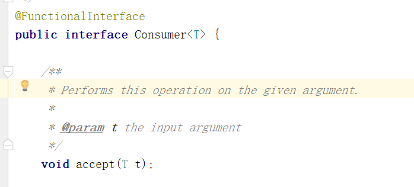

# 函数式编程-Stream流

## 1. 概述

### 1.1 为什么学？

- 能够看懂公司里的代码
- 大数量下处理集合效率高
- 代码可读性高
- 消灭嵌套地狱

~~~~java
//查询未成年作家的评分在70以上的书籍 由于洋流影响所以作家和书籍可能出现重复，需要进行去重
List<Book> bookList = new ArrayList<>();
Set<Book> uniqueBookValues = new HashSet<>();
Set<Author> uniqueAuthorValues = new HashSet<>();
for (Author author : authors) {
    if (uniqueAuthorValues.add(author)) {
        if (author.getAge() < 18) {
            List<Book> books = author.getBooks();
            for (Book book : books) {
                if (book.getScore() > 70) {
                    if (uniqueBookValues.add(book)) {
                        bookList.add(book);
                    }
                }
            }
        }
    }
}
System.out.println(bookList);
~~~~

~~~~java
List<Book> collect = authors.stream()
    .distinct()
    .filter(author -> author.getAge() < 18)
    .map(author -> author.getBooks())
    .flatMap(Collection::stream)
    .filter(book -> book.getScore() > 70)
    .distinct()
    .collect(Collectors.toList());
System.out.println(collect);
~~~~


### 1.2 函数式编程思想

#### 1.2.1 概念

​	面向对象思想需要关注用什么对象完成什么事情。而函数式编程思想就类似于我们数学中的函数。它主要关注的是对数据进行了什么操作。

#### 1.2.2 优点

* 代码简洁，开发快速
* 接近自然语言，易于理解
* 易于"并发编程"

### 注意事项

- 惰性求值（如果没有终结操作，没有中间操作是不会得到执行的）
- 流是一次性的（一旦一个流对象经过一个终结操作后。这个流就不能再被使用）
- 不会影响原数据（我们在流中可以多数据做很多处理。但是正常情况下是不会影响原来集合中的元素的。这往往也是我们期望的）

### 3.4 常用操作

#### 3.4.1 创建流

单列集合： `集合对象.stream()`

~~~~java
        List<String> strings = Arrays.asList(1, 2, 3);
		Stream<Author> stream = authors.stream();
~~~~

数组：`Arrays.stream(数组) `或者使用`Stream.of`来创建

~~~~JAVA
        Integer[] arr = {1,2,3,4,5};
        Stream<Integer> stream = Arrays.stream(arr);
        Stream<Integer> stream2 = Stream.of(arr);
~~~~

双列集合：转换成单列集合后再创建

~~~~java
        Map<String,Integer> map = new HashMap<>();
        map.put("蜡笔小新",19);
        map.put("黑子",17);
        map.put("日向翔阳",16);

        Stream<Map.Entry<String, Integer>> stream = map.entrySet().stream();
~~~~


直接根据元素创建流：


使用builder动态的创建流：


#### 3.4.2 中间操作

##### filter

​	可以对流中的元素进行条件过滤，**符合过滤条件的才能继续留在流中。**


例如：

​	打印所有姓名长度大于1的作家的姓名

~~~~java
        List<Author> authors = getAuthors();
        authors.stream()
                .filter(author -> author.getName().length()>1)
                .forEach(author -> System.out.println(author.getName()));
~~~~


##### map 一对一

​	可以把对流中的元素进行计算或转换。

例如：

​	打印所有作家的姓名

~~~~java
        List<Author> authors = getAuthors();

        authors
                .stream()
                .map(author -> author.getName())
                .forEach(name->System.out.println(name));
~~~~

~~~~java
//        打印所有作家的姓名
        List<Author> authors = getAuthors();

//        authors.stream()
//                .map(author -> author.getName())
//                .forEach(s -> System.out.println(s));

        authors.stream()
                .map(author -> author.getAge())
                .map(age->age+10)
                .forEach(age-> System.out.println(age));
~~~~


##### distinct

​	可以去除流中的重复元素。原理是内部维护了一个HashSet来进行去重。


例如：

​	打印所有作家的姓名，并且要求其中不能有重复元素。

~~~~java
        List<Author> authors = getAuthors();
        authors.stream()
                .distinct()
                .forEach(author -> System.out.println(author.getName()));
~~~~


**注意：distinct方法是依赖Object的equals方法来判断是否是相同对象的。所以需要注意重写equals方法。**


##### sorted


###### 自定义排序


​	可以对流中的元素进行排序。


例如：

​	对流中的元素按照年龄进行降序排序，并且要求不能有重复的元素。

~~~~java
        List<Author> authors = getAuthors();
//        对流中的元素按照年龄进行降序排序，并且要求不能有重复的元素。
        authors.stream()
                .distinct()
                .sorted()
                .forEach(author -> System.out.println(author.getAge()));
~~~~

~~~~java
        List<Author> authors = getAuthors();
//        对流中的元素按照年龄进行降序排序，并且要求不能有重复的元素。
        authors.stream()
                .distinct()
                .sorted((o1, o2) -> o2.getAge()-o1.getAge())
                .forEach(author -> System.out.println(author.getAge()));
~~~~


**注意：如果调用空参的sorted()方法，需要流中的元素是实现了Comparable。**

如：

~~~java
public class demo {
    public static void main(String[] args) {
        TreeSet<Person> data = new TreeSet<>();
        Person person1 = new Person("Edmond",17);
        Person person2 = new Person("John",19);
        Person person3 = new Person("Tom",9);
        data.add(person1);
        data.add(person2);
        data.add(person3);
        for(Person p : data){
            System.out.println(p);
        }
    }

    static class Person implements Comparable<Person>{
        private String name;
        private int age;

        public Person(String name, int age) {
            this.name = name;
            this.age = age;
        }

        @Override
        public int compareTo(Person o) {
            //this当前对象 与 o 比较
            //返回数据有三种类型：
            //整数 ： 代表this当前对象较大
            //0   :  代表一样大
            //负数 ： 代表this当前对象较小
            if(this.age > o.age){
                return 1;
            }else if(this.age == o.age){
                return 0;
            }
             return -1;
             //可以简写为return this.age - o.age;
        }

        @Override
        public String toString() {
            return "Person{" +
                    "name='" + name + '\'' +
                    ", age=" + age +
                    '}';
        }
    }
}

~~~

否则会报错：

~~~java
java.lang.ClassCastException: class com.fa.modules.dao.UserRoleDO cannot be cast to class java.lang.Comparable (com.fa.modules.dao.UserRoleDO is in unnamed module of loader 'app'; java.lang.Comparable is in module java.base of loader 'bootstrap')

~~~


###### 自然排序


​		当流中的元素类型实现了Comparable接口时，比如字符串或包装类型的数字，可以直接调用无参数的sorted方法，按照自然顺序进行排序：


###### 反转排序、组合排序


**多个条件组合排序：**

```java
Comparator.comparing(InvoiceOrFolder::getStartTime)
          .thenComparing(InvoiceOrFolder::getEndTime)
```

首先按 `startTime` 排序，如果 `startTime` 相同，再按 `endTime` 排序。


##### limit	

​	可以设置流的最大长度，超出的部分将被抛弃。


例如：

​	对流中的元素按照年龄进行降序排序，并且要求不能有重复的元素,然后打印其中年龄最大的两个作家的姓名。

~~~~java
        List<Author> authors = getAuthors();
        authors.stream()
                .distinct()
                .sorted()
                .limit(2)
                .forEach(author -> System.out.println(author.getName()));
~~~~


##### skip

​	跳过流中的前n个元素，返回剩下的元素


例如：

​	打印除了年龄最大的作家外的其他作家，要求不能有重复元素，并且按照年龄降序排序。

~~~~java
//        打印除了年龄最大的作家外的其他作家，要求不能有重复元素，并且按照年龄降序排序。
        List<Author> authors = getAuthors();
        authors.stream()
                .distinct()
                .sorted()
                .skip(1)
                .forEach(author -> System.out.println(author.getName()));
~~~~


##### flatMap 一对多

​	map只能把一个对象转换成另一个对象来作为流中的元素。而flatMap可以把**一个对象转换成多个对象**作为流中的元素。


例一：

​	打印所有书籍的名字。要求对重复的元素进行去重。

~~~~java
//        打印所有书籍的名字。要求对重复的元素进行去重。
        List<Author> authors = getAuthors();

        authors.stream()
                .flatMap(author -> author.getBooks().stream())
                .distinct() // 记得重写equals方法 this.name.equals(str)
                .forEach(book -> System.out.println(book.getName()));
~~~~


例二：

​	打印现有数据的所有分类。要求对分类进行去重。不能出现这种格式：哲学,爱情

~~~~java
//        打印现有数据的所有分类。要求对分类进行去重。不能出现这种格式：哲学,爱情,爱情  处理结果：哲学,爱情
        List<Author> authors = getAuthors();
        authors.stream()
                .flatMap(author -> author.getBooks().stream()) // Stream: Auther - > Book
                .distinct()
                .flatMap(book -> Arrays.stream(book.getCategory().split(","))) // Stream: Book - > String
                .distinct()
                .forEach(category-> System.out.println(category));
~~~~


例3：

peopleGroups:列表中套列表


处理：


原理：

**flatMap: 遍历Stream集合中的每一个Stream，进行指定的处理后再作为一个统一的Stream收集起来**


例4：


原理：


#### 3.4.3 终结操作

##### forEach

​	对流中的元素进行遍历操作，我们通过传入的参数去指定对遍历到的元素进行什么具体操作。

流是**惰性求值**的（即流的中间操作不会立刻执行，只有在终端操作调用时才会触发）


例子：

​	输出所有作家的名字

~~~~java
//        输出所有作家的名字
        List<Author> authors = getAuthors();

        authors.stream()
                .map(author -> author.getName())
                .distinct()
                .forEach(name-> System.out.println(name));

~~~~


##### count

​	可以用来获取当前流中元素的个数。

例子：

​	打印这些作家的所出书籍的数目，注意删除重复元素。

~~~~java
//        打印这些作家的所出书籍的数目，注意删除重复元素。
        List<Author> authors = getAuthors();

        long count = authors.stream()
                .flatMap(author -> author.getBooks().stream())
                .distinct()
                .count();
        System.out.println(count);
~~~~


##### max & min

​	可以用来或者流中的最值。

例子：

​	分别获取这些作家的所出书籍的最高分和最低分并打印。

~~~~java
//        分别获取这些作家的所出书籍的最高分和最低分并打印。
        //Stream<Author>  -> Stream<Book> ->Stream<Integer>  ->求值

        List<Author> authors = getAuthors();
        Optional<Integer> max = authors.stream()
                .flatMap(author -> author.getBooks().stream())
                .map(book -> book.getScore())
                .max((score1, score2) -> score1 - score2);

        Optional<Integer> min = authors.stream()
                .flatMap(author -> author.getBooks().stream())
                .map(book -> book.getScore())
                .min((score1, score2) -> score1 - score2);
        System.out.println(max.get());
        System.out.println(min.get());
~~~~


##### collect

​	把当前流转换成一个集合。

###### toList


例子：

​	获取一个存放所有作者名字的List集合。

~~~~java
//        获取一个存放所有作者名字的List集合。
        List<Author> authors = getAuthors();
        List<String> nameList = authors.stream()
                .map(author -> author.getName())
                .collect(Collectors.toList());
        System.out.println(nameList);
~~~~

​	拓展：

~~~java
    /**
     * 查询院舍的分区案例,分区案例是所有院舍共有的，不需要传院舍id
     * @return
     */
    @Override
    public List<BaseKeyValueDTO> getFacilityZone() {
        List<Status> statuses = statusMapper.getStatusNameAndIdByType(StatusConstant.STATUS_TYPE_ZONE);
        return statuses.stream()
                .map(status -> BaseKeyValueDTO.build(status.getStatusId(),status.getStatusName()) )
                .collect(Collectors.toList()); // collect(Collectors.toList())与toList()的区别是？ toList()返回的是List<BaseKeyValueDTO<Integer,String>> 不满足要求，，而collect(Collectors.toList())返回的是List<BaseKeyValueDTO>。，满足要求

    }
~~~


###### toSet


获取一个所有书名的Set集合。

~~~~java
//        获取一个所有书名的Set集合。
        List<Author> authors = getAuthors();
        Set<String> bookNames = authors.stream()
                .flatMap(author -> author.getBooks().stream())
            	.map(book -> book.getName())
                .collect(Collectors.toSet());

        System.out.println(books);
~~~~

​	

###### toMap

获取一个Map集合，map的key为作者名，value为`List<Book>`

~~~~java
//        获取一个Map集合，map的key为作者名，value为List<Book>
        List<Author> authors = getAuthors();

        Map<String, List<Book>> map = authors.stream()
                .distinct()
                .collect(Collectors.toMap(author -> author.getName(), author -> author.getBooks()));

        System.out.println(map);
~~~~


> **注意：**像上面这样子写的话，toMap()的key是不能够重复的，否则会报异常：

~~~java
java.lang.IllegalStateException: Duplicate key 1 (attempted merging values 301 and 238)
~~~

解决：

这样子写：

~~~java
//        获取一个Map集合，map的key为作者名，value为List<Book>
        List<Author> authors = getAuthors();

        Map<String, List<Book>> map = authors.stream()
                .distinct()
                .collect(Collectors.toMap(author -> author.getName(), author -> author.getBooks(),(oldValue,newValue) -> newValue));// 指定了当key重复的时候，使用新的value覆盖原来的value

        System.out.println(map);
~~~

参考：https://blog.csdn.net/qq_28600087/article/details/122336204


> 根据某元素进行分组来转换为Map：


结果：


##### 查找与匹配

###### anyMatch

​	可以用来判断是否有任意符合匹配条件的元素，结果为boolean类型。


例子：

​	判断是否有年龄在29以上的作家

~~~~java
//        判断是否有年龄在29以上的作家
        List<Author> authors = getAuthors();
        boolean flag = authors.stream()
                .anyMatch(author -> author.getAge() > 29);
        System.out.println(flag);
~~~~


###### allMatch

​	可以用来判断是否都符合匹配条件，结果为boolean类型。如果都符合结果为true，否则结果为false。

例子：

​	判断是否所有的作家都是成年人

~~~~java
//        判断是否所有的作家都是成年人
        List<Author> authors = getAuthors();
        boolean flag = authors.stream()
                .allMatch(author -> author.getAge() >= 18);
        System.out.println(flag);
~~~~


###### noneMatch

​	可以判断流中的元素是否都不符合匹配条件。如果都不符合结果为true，否则结果为false

例子：

​	判断作家是否都没有超过100岁的。

~~~~java
//        判断作家是否都没有超过100岁的。
        List<Author> authors = getAuthors();

        boolean b = authors.stream()
                .noneMatch(author -> author.getAge() > 100);

        System.out.println(b);
~~~~


###### findAny

​	获取流中的任意一个元素。该方法没有办法保证获取的一定是流中的第一个元素。


例子：

​	获取任意一个年龄大于18的作家，如果存在就输出他的名字

~~~~java
//        获取任意一个年龄大于18的作家，如果存在就输出他的名字
        List<Author> authors = getAuthors();
        Optional<Author> optionalAuthor = authors.stream()
                .filter(author -> author.getAge()>18)
                .findAny();

        optionalAuthor.ifPresent(author -> System.out.println(author.getName()));
~~~~


###### findFirst

​	获取流中的第一个元素。


例子：

​	获取一个年龄最小的作家，并输出他的姓名。

~~~~java
//        获取一个年龄最小的作家，并输出他的姓名。
        List<Author> authors = getAuthors();
        Optional<Author> first = authors.stream()
                .sorted((o1, o2) -> o1.getAge() - o2.getAge())
                .findFirst();

        first.ifPresent(author -> System.out.println(author.getName()));
~~~~


##### reduce归并

​	对流中的数据按照你指定的计算方式计算出一个结果。（缩减操作）

​	**reduce的作用是把stream中的元素给组合起来，我们可以传入一个初始值，它会按照我们的计算方式依次拿流中的元素和初始化值进行计算，计算结果再和后面的元素计算。**

​	reduce两个参数的重载形式内部的计算方式如下：

~~~~java
T result = identity;
for (T element : this stream)
	result = accumulator.apply(result, element)
return result;
~~~~

​	其中identity就是我们可以通过方法参数传入的初始值，accumulator的apply具体进行什么计算也是我们通过方法参数来确定的。


例子：

​	使用reduce求所有作者年龄的和

~~~~java
//        使用reduce求所有作者年龄的和
        List<Author> authors = getAuthors();
        Integer sum = authors.stream()
                .distinct()
                .map(author -> author.getAge())
                .reduce(0, (result, element) -> result + element);
        System.out.println(sum);
~~~~

​	使用reduce求所有作者中年龄的最大值

~~~~java
//        使用reduce求所有作者中年龄的最大值
        List<Author> authors = getAuthors();
        Integer max = authors.stream()
                .map(author -> author.getAge())
                .reduce(Integer.MIN_VALUE, (result, element) -> result < element ? element : result);

        System.out.println(max);
~~~~


​	reduce一个参数（不指定初始值）的重载形式内部的计算

~~~~java
 	 boolean foundAny = false;
     T result = null;
     for (T element : this stream) {
         if (!foundAny) {
             foundAny = true; // 获取Stream中的第一个元素作为初始值 并且完成stream中第一个元素的遍历
             result = element;
         }
         else
             result = accumulator.apply(result, element);
     }
     return foundAny ? Optional.of(result) : Optional.empty();
~~~~

​	如果用一个参数的重载方法去求最小值代码如下：

~~~~java
        //        使用reduce求所有作者中年龄的最小值
        List<Author> authors = getAuthors();
        Optional<Integer> minOptional = authors.stream()
                .map(author -> author.getAge())
                .reduce((result, element) -> result > element ? element : result);
        minOptional.ifPresent(age-> System.out.println(age));
~~~~


## 4. Optional

### 4.1 概述

​	我们在编写代码的时候出现最多的就是空指针异常。所以在很多情况下我们需要做各种非空的判断。

​	例如：

~~~~java
        Author author = getAuthor();
        if(author!=null){
            System.out.println(author.getName());
        }
~~~~

​	尤其是对象中的属性还是一个对象的情况下。这种判断会更多。	

​	而过多的判断语句会让我们的代码显得臃肿不堪。

​	所以在JDK8中引入了Optional,养成使用Optional的习惯后你可以写出更优雅的代码来避免空指针异常。

​	并且在很多函数式编程相关的API中也都用到了Optional，如果不会使用Optional也会对函数式编程的学习造成影响。


### 4.2 使用

#### 4.2.1 创建对象

​	Optional就好像是包装类，可以把我们的具体数据封装Optional对象内部。然后我们去使用Optional中封装好的方法操作封装进去的数据就可以非常优雅的避免空指针异常。

使用Optional类的3个静态方法：

- ofNullable()
- of()
- empty()

​	我们一般使用**Optional**的**静态方法ofNullable**来把数据封装成一个Optional对象。**无论传入的参数是否为null**都不会出现问题。

~~~~java
        Author author = getAuthor();
        Optional<Author> authorOptional = Optional.ofNullable(author);
~~~~

​	你可能会觉得还要加一行代码来封装数据比较麻烦。但是如果改造下getAuthor方法，让其的返回值就是封装好的Optional的话，我们在使用时就会方便很多。

​	而且在实际开发中我们的数据很多是从数据库获取的。Mybatis从3.5版本可以也已经支持Optional了。我们可以直接把dao方法的返回值类型定义成Optional类型，MyBastis会自己把数据封装成Optional对象返回。封装的过程也不需要我们自己操作。


​	如果你**确定一个对象不是空**的则可以使用**Optional**的**静态方法of**来把数据封装成Optional对象。

~~~~java
        Author author = new Author();
        Optional<Author> authorOptional = Optional.of(author);
~~~~

​	但是一定要注意，如果使用of的时候传入的参数必须不为null。（尝试下传入null会出现什么结果）


​	如果一个方法的返回值类型是Optional类型。而如果我们经判断发现某次计算得到的返回值为null，这个时候就需要把null封装成Optional对象返回。这时则可以使用**Optional**的**静态方法empty**来进行封装。

~~~~java
		Optional.empty()
~~~~

​	

​	所以最后你觉得哪种方式会更方便呢？**ofNullable**


#### 4.2.2 安全消费值

​	我们获取到一个Optional对象后肯定需要对其中的数据进行使用。这时候我们可以使用其**ifPresent**方法对来消费其中的值。

​	这个方法会判断其内封装的数据是否为空，不为空时才会执行具体的消费代码。这样使用起来就更加安全了。

​	例如,以下写法就优雅的避免了空指针异常。

~~~~java
        Optional<Author> authorOptional = Optional.ofNullable(getAuthor());

        authorOptional.ifPresent(author -> System.out.println(author.getName()));
~~~~


#### 4.2.3 获取值

​	如果我们想获取值自己进行处理可以使用get方法获取，但是不推荐。因为当Optional内部的数据为空的时候会出现异常。


#### 4.2.4 安全获取值

​	如果我们期望安全的获取值。我们不推荐使用get方法，而是使用Optional提供的以下方法。

* orElseGet

  获取数据并且设置数据为空时的默认值。如果数据不为空就能获取到该数据。如果为空则根据你传入的参数来创建对象作为默认值返回。

  ~~~~java
          Optional<Author> authorOptional = Optional.ofNullable(getAuthor());
          Author author1 = authorOptional.orElseGet(() -> new Author());
  ~~~~

  


* orElseThrow

  获取数据，如果数据不为空就能获取到该数据。如果为空则根据你传入的参数来创建异常抛出。

  ~~~~java
          Optional<Author> authorOptional = Optional.ofNullable(getAuthor());
          try {
              Author author = authorOptional.orElseThrow((Supplier<Throwable>) () -> new RuntimeException("author为空"));
              System.out.println(author.getName());
          } catch (Throwable throwable) {
              throwable.printStackTrace();
          }
  ~~~~

  

#### 4.2.5 过滤

​	我们可以使用filter方法对数据进行过滤。如果原本是有数据的，但是不符合判断，也会变成一个无数据的Optional对象。

~~~~java
        Optional<Author> authorOptional = Optional.ofNullable(getAuthor());
        authorOptional.filter(author -> author.getAge()>100).ifPresent(author -> System.out.println(author.getName()));

~~~~


#### 4.2.6 判断

​	我们可以使用isPresent方法进行是否存在数据的判断。如果为空返回值为false,如果不为空，返回值为true。但是这种方式并不能体现Optional的好处，**更推荐使用ifPresent方法**。

~~~~java
        Optional<Author> authorOptional = Optional.ofNullable(getAuthor());

        if (authorOptional.isPresent()) {
            System.out.println(authorOptional.get().getName());
        }
~~~~


#### 4.2.7 数据转换

​	Optional还提供了map可以让我们的对数据进行转换，并且转换得到的数据也还是被Optional包装好的，保证了我们的使用安全。

例如我们想获取作家的书籍集合。

~~~~java
    private static void testMap() {
        Optional<Author> authorOptional = getAuthorOptional();
        Optional<List<Book>> optionalBooks = authorOptional.map(author -> author.getBooks());
        optionalBooks.ifPresent(books -> System.out.println(books));
    }
~~~~


## 5. 函数式接口

### 5.1 概述

​	**只有一个抽象方法**的接口我们称之为函数接口。

​	JDK的函数式接口都加上了**@FunctionalInterface** 注解进行标识。但是无论是否加上该注解只要接口中只有一个抽象方法，都是函数式接口。


### 5.2 常见函数式接口	

- ​	Consumer 消费接口

  根据其中抽象方法的参数列表和返回值类型知道，我们可以在方法中对传入的参数进行消费。

  

- ​	Function 计算转换接口

  根据其中抽象方法的参数列表和返回值类型知道，我们可以在方法中对传入的参数计算或转换，把结果返回

  

- ​	Predicate 判断接口

  根据其中抽象方法的参数列表和返回值类型知道，我们可以在方法中对传入的参数条件判断，返回判断结果

  

- ​	Supplier 生产型接口

  根据其中抽象方法的参数列表和返回值类型知道，我们可以在方法中创建对象，把创建好的对象返回


### 5.3 常用的默认方法

- and()

  我们在使用Predicate接口时候可能需要进行判断条件的拼接。而and方法相当于是使用&&来拼接两个判断条件

  例如：

  打印作家中年龄大于17并且姓名的长度大于1的作家。

  ~~~~java
          List<Author> authors = getAuthors();
          Stream<Author> authorStream = authors.stream();
          authorStream.filter(new Predicate<Author>() {
              @Override
              public boolean test(Author author) {
                  return author.getAge()>17;
              }
          }.and(new Predicate<Author>() {
              @Override
              public boolean test(Author author) {
                  return author.getName().length()>1;
              }
          })).forEach(author -> System.out.println(author));
  ~~~~

- or 

  我们在使用Predicate接口时候可能需要进行判断条件的拼接。而or方法相当于是使用||来拼接两个判断条件。

  例如：

  打印作家中年龄大于17或者姓名的长度小于2的作家。

  ~~~~java
  //        打印作家中年龄大于17或者姓名的长度小于2的作家。
          List<Author> authors = getAuthors();
          authors.stream()
                  .filter(new Predicate<Author>() {
                      @Override
                      public boolean test(Author author) {
                          return author.getAge()>17;
                      }
                  }.or(new Predicate<Author>() {
                      @Override
                      public boolean test(Author author) {
                          return author.getName().length()<2;
                      }
                  })).forEach(author -> System.out.println(author.getName()));
  ~~~~

  

- negate

  Predicate接口中的方法。negate方法相当于是在判断添加前面加了个! 表示取反

  例如：

  打印作家中年龄不大于17的作家。

  ~~~~java
  //        打印作家中年龄不大于17的作家。
          List<Author> authors = getAuthors();
          authors.stream()
                  .filter(new Predicate<Author>() {
                      @Override
                      public boolean test(Author author) {
                          return author.getAge()>17;
                      }
                  }.negate()).forEach(author -> System.out.println(author.getAge()));
  ~~~~
  
  

## 6. 方法引用（省略参数）

​	我们在使用lambda时，如果方法体中只有一个方法的调用的话（包括构造方法）,我们可以用方法引用进一步简化代码。


### 6.1 推荐用法

​	我们在使用lambda时不需要考虑什么时候用方法引用，用哪种方法引用，方法引用的格式是什么。我们只需要在写完lambda方法发现方法体只有一行代码，并且是方法的调用时使用快捷键尝试是否能够转换成方法引用即可。

​	当我们方法引用使用的多了慢慢的也可以直接写出方法引用。


### 6.2 基本格式

​	类名或者对象名::方法名


### 6.3 语法详解(了解)

#### 6.3.1 引用类的静态方法

​	其实就是引用类的静态方法

##### 格式

~~~~java
类名::方法名
~~~~


##### 使用前提

​	如果我们在重写方法的时候，方法体中**只有一行代码**，并且这行代码是**调用了某个类的静态方法**，并且我们把要重写的**抽象方法中所有的参数都按照顺序传入了这个静态方法中**，这个时候我们就可以引用类的静态方法。

​	

例如：

如下代码就可以用方法引用进行简化

~~~~java
        List<Author> authors = getAuthors();

        Stream<Author> authorStream = authors.stream();
        
        authorStream.map(author -> author.getAge())
                .map(age->String.valueOf(age));
~~~~

注意，如果我们所重写的方法是没有参数的，调用的方法也是没有参数的也相当于符合以上规则。

优化后如下：

~~~~java
        List<Author> authors = getAuthors();

        Stream<Author> authorStream = authors.stream();

        authorStream.map(author -> author.getAge())
                .map(String::valueOf);
~~~~


#### 6.3.2 引用对象的实例方法

##### 格式

~~~~java
对象名::方法名
~~~~


##### 使用前提

​	如果我们在重写方法的时候，方法体中**只有一行代码**，并且这行代码是**调用了某个对象的成员方法**，并且我们把要重写的**抽象方法中所有的参数都按照顺序传入了这个成员方法中**，这个时候我们就可以引用对象的实例方法


例如：

~~~~java
        List<Author> authors = getAuthors();

        Stream<Author> authorStream = authors.stream();
        StringBuilder sb = new StringBuilder();
        authorStream.map(author -> author.getName())
                .forEach(name->sb.append(name));
~~~~

优化后：

~~~~java
        List<Author> authors = getAuthors();

        Stream<Author> authorStream = authors.stream();
        StringBuilder sb = new StringBuilder();
        authorStream.map(author -> author.getName())
                .forEach(sb::append);
~~~~


#### 6.3.4 引用类的实例方法

##### 格式

~~~~java
类名::方法名
~~~~


##### 使用前提

​	如果我们在重写方法的时候，方法体中**只有一行代码**，并且这行代码是**调用了第一个参数的成员方法**，并且我们把要**重写的抽象方法中剩余的所有的参数都按照顺序传入了这个成员方法中**，这个时候我们就可以引用类的实例方法。


例如：

```java
    interface UseString{
        String use(String str,int start,int length);
    }

    public static String subAuthorName(String str, UseString useString){
        int start = 0;
        int length = 1;
        return useString.use(str,start,length);
    }
    public static void main(String[] args) {

        subAuthorName("三更草堂", new UseString() {
            @Override
            public String use(String str, int start, int length) {
                return str.substring(start,length);
            }
        });

	}
```

优化后如下：

~~~~java
    public static void main(String[] args) {

        subAuthorName("三更草堂", String::substring);

    }
~~~~


#### 6.3.5 构造器引用

​	如果方法体中的一行代码是构造器的话就可以使用构造器引用。


##### 格式

~~~~java
类名::new
~~~~


##### 使用前提

​	如果我们在重写方法的时候，方法体中**只有一行代码**，并且这行代码是**调用了某个类的构造方法**，并且我们把**要重写的抽象方法中的所有的参数都按照顺序传入了这个构造方法中**，这个时候我们就可以引用构造器。

例如：

~~~~java
        List<Author> authors = getAuthors();
        authors.stream()
                .map(author -> author.getName())
                .map(name->new StringBuilder(name))
                .map(sb->sb.append("-三更").toString())
                .forEach(str-> System.out.println(str));
~~~~

优化后：

~~~~java
        List<Author> authors = getAuthors();
        authors.stream()
                .map(author -> author.getName())
                .map(StringBuilder::new)
                .map(sb->sb.append("-三更").toString())
                .forEach(str-> System.out.println(str));
~~~~


## 7. 高级用法

### 基本数据类型优化

​	我们之前用到的很多Stream的方法由于都使用了泛型。所以涉及到的参数和返回值都是引用数据类型。

​	即使我们操作的是整数小数，但是实际用的都是他们的**包装类**。JDK5中引入的自动装箱和自动拆箱让我们在使用对应的包装类时就好像使用基本数据类型一样方便。但是你一定要知道装箱和拆箱肯定是要消耗时间的。虽然这个时间消耗很小。但是在大量的数据不断的重复装箱拆箱的时候，你就不能无视这个时间损耗了。

​	所以为了让我们能够对这部分的时间消耗进行优化。Stream还提供了很多专门针对基本数据类型的方法。

​	例如：mapToInt,mapToLong,mapToDouble,flatMapToInt,flatMapToDouble等。

~~~~java
    private static void test27() {

        List<Author> authors = getAuthors();
        authors.stream()
                .map(author -> author.getAge())
                .map(age -> age + 10)
                .filter(age->age>18)
                .map(age->age+2)
                .forEach(System.out::println);

        authors.stream()
                .mapToInt(author -> author.getAge()) // 返回的是IntStream流
                .map(age -> age + 10)
                .filter(age->age>18)
                .map(age->age+2)
                .forEach(System.out::println);
    }
~~~~


### 并行流

​	当流中有大量元素时，我们可以使用并行流去提高操作的效率。其实并行流就是**把任务分配给多个线程去完全**。如果我们自己去用代码实现的话其实会非常的复杂，并且要求你对并发编程有足够的理解和认识。而如果我们使用Stream的话，我们只需要修改一个方法的调用就可以使用并行流来帮我们实现，从而提高效率。

工作流程：

任务的分解(Fork)与任务的合并（Join）


​	

#### 创建并行流


​		parallel方法可以把串行流转换成并行流。

~~~~java
    private static void test28() {
        Stream<Integer> stream = Stream.of(1, 2, 3, 4, 5, 6, 7, 8, 9, 10);
        Integer sum = stream.parallel()
                .peek(new Consumer<Integer>() {
                    @Override
                    public void accept(Integer num) {
                        System.out.println(num+Thread.currentThread().getName());
                    }
                })
                .filter(num -> num > 5)
                .reduce((result, ele) -> result + ele)
                .get();
        System.out.println(sum);
    }
~~~~

​	


也可以通过parallelStream直接获取并行流对象。

~~~~java
        List<Author> authors = getAuthors();
        authors.parallelStream()
                .map(author -> author.getAge())
                .map(age -> age + 10)
                .filter(age->age>18)
                .map(age->age+2)
                .forEach(System.out::println);
~~~~


#### 顺序问题

注意：有些场景下并行流无法保证元素的处理顺序

并行流采用多线程并发处理，可以同时在多个核心上处理数据，但不保证元素的处理顺序。


##### 使用forEach()遍历会乱序，使用forEachOrdered()可以解决

但是会损失部分效率


##### collect操作：


##### reduce操作

由于减法不满足结合率，即a-b不等于b-a，它不是一个关联操作，所以结果肯定会不一致。

结果应该为：-10


#### 为什么 `peek()` 用于调试？

`peek()` 方法在 Java Stream API 中通常用于调试流的中间操作，因为它允许我们查看流中的元素在处理过程中的状态，而不会改变流的结果。`peek()` 的作用是对每个元素执行一个操作，并返回一个与原来相同的流，它既不会终止流，也不会修改元素本身。

- 在处理复杂的流操作时，调试和追踪数据流的状态是很重要的。由于流是惰性求值的（即流的中间操作不会立刻执行，只有在终端操作调用时才会触发），我们难以直接查看中间过程中流中的数据状态。`peek()` 正好可以在流处理的每个阶段插入调试代码（比如打印元素值），从而帮助我们追踪流的处理过程。

##### 例子

假设有这样一段代码，它对一个整数流进行了一些中间处理操作：

```java
Stream<Integer> stream = Stream.of(1, 2, 3, 4, 5, 6, 7, 8, 9, 10);
Integer sum = stream
    .filter(num -> num % 2 == 0)     // 保留偶数
    .map(num -> num * 2)             // 将每个偶数乘以 2
    .reduce((result, ele) -> result + ele) // 累加结果
    .orElse(0);
System.out.println(sum); // 输出累加结果
```


这段代码先过滤出偶数，然后将偶数乘以 2，最后将所有结果累加。如果我们想调试这段代码，观察每个中间阶段的数据流情况，可以在 `filter()` 和 `map()` 之间插入 `peek()`，来打印出流中每一步的状态。

使用 `peek()` 进行调试后的代码如下：

```java
Stream<Integer> stream = Stream.of(1, 2, 3, 4, 5, 6, 7, 8, 9, 10);
Integer sum = stream
    .filter(num -> num % 2 == 0)     // 保留偶数
    .peek(num -> System.out.println("After filter: " + num)) // 调试: 过滤后的元素
    .map(num -> num * 2)             // 将每个偶数乘以 2
    .peek(num -> System.out.println("After map: " + num)) // 调试: 映射后的元素
    .reduce((result, ele) -> result + ele) // 累加结果
    .orElse(0);
System.out.println("Sum: " + sum); // 输出累加结果
```

输出结果：

```mathematica
After filter: 2
After filter: 4
After filter: 6
After filter: 8
After filter: 10
After map: 4
After map: 8
After map: 12
After map: 16
After map: 20
Sum: 60
```

解释：

1. `filter()` 之后，`peek()` 打印出过滤后的偶数：2, 4, 6, 8, 10。
2. `map()` 之后，`peek()` 打印出每个偶数乘以 2 之后的结果：4, 8, 12, 16, 20。
3. 最后，累加这些结果得到 60。

在这个例子中，`peek()` 不会修改流中的数据，但通过插入打印语句，我们能够更好地观察流中每个阶段的数据处理情况，帮助调试和理解流的操作步骤。
