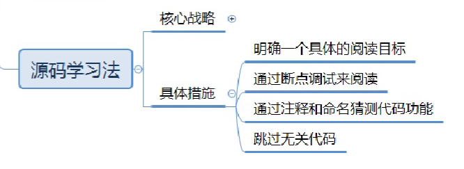
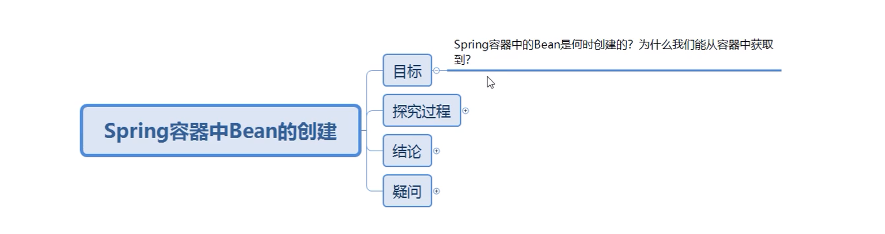

# Spring面试型知识

源码学习法：

通过断点(配合idea.md中的debug快捷键与技巧食用)，一行一行代码的进行尝试，判断是哪一行代码执行后达到了想要的效果，不断重复，找到最里面的我们熟悉的代码。

跳过无关代码：throw异常的安全性校验的代码、assert断言、没有执行的代码

具体例子：

1.根据目标使用源码学习法进行探究

2.记录探究过程(图文并茂的记录**每个方法的调用**，圈出**方法中关键的代码**，使用xmind工具)

3.探究完成后要总结出面试时被问到这个问题后如何回答、可以口述出来的结论

4.最后记录探究过程中产生的疑问，循环上面的过程即可

## 1 Spring容器中Bean的创建与获取的原理

**结论1：**非懒加载的单实例bean会在容器创建的时候创建。容器内部会创建一个beanFactory,使用beanFactory的doGetBean方法来进行创建，底层其实是使用反射，根据spring配置文件中的全类名获取类的字节码对象，再获取构造器对象，然后使用构造器对象的newInstance()方法传入相应的参数来创建对象,并且在创建后会把bean放入一个单例bean的map集合(singletonObjects)中进行存储,存储时map集合的key就是我们spring配置文件中配置的id属性。这样，当我们在spring的配置文件中写好bean标签的类名与id后，调用容器的getBean方法来获取对象的时，其实就是去访问这个singletonObjects集合，所以能够获取到对应的Bean。

**口述：**非懒加载的单实例bean其实是在容器创建的时候创建的，它内部其实是借助一个beanFactory去创建的，里面有一个doGetBean方法,在这个方法里面，其实是通过反射创建出来的，在创建出来之后，它还会把这个Bean存放到一个单例bean的map集合(singletonObjects)，所以后面我们去调用容器的getBean方法时，其实就是去访问这个singletonObjects集合，所以能够获取到对应的Bean。

## 3.Spring声明式事务

### 3.1 事务回顾

### 	

#### **3.1.1 事务的概念**

​		**保证一组数据库的操作，要么同时成功，要么同时失败**

#### 3.1.2 四大特性(三更故事记忆法)

- 隔离性
  多个事务之间要相互隔离，不能互相干扰

- 原子性
  指事务是一个不可分割的整体，类似一个不可分割的原子

- 持久性
  指事务一旦被提交，这组操作修改的数据就真的的发生变化了(不会再被回滚了)。即使接下来数据库故障也不应该对其有影响。

- 一致性
  保障事务前后这组数据的状态是一致的。要么都是成功的，要么都是失败的。

### 3.2 实现声明式事务

​		**声明式事务底层是通过AOP实现**

  ​	如果我们自己去对事务进行控制的话我们就需要在原来核心代码的基础上加上事务控制相关的代码（就会耦合在一起）。而在我们的实际开发中这种事务控制的操作也是非常常见的。所以Spring提供了声明式事务的方式让我们去控制事务。

  ​	只要简单的加个注解(或者是xml配置)就可以实现事务控制，不需要事务控制的时候只需要去掉相应的注解即可(解耦了)。

  #### 3.2.1 注解实现

  ##### ①配置事务管理器和事务注解驱动

  在spring的配置文件applicationContext.xml中添加如下配置：

  ~~~~xml
    <!--把事务管理器注入Spring容器，需要配置一个连接池-->
    <bean id="txManager" class="org.springframework.jdbc.datasource.DataSourceTransactionManager">
        <property name="dataSource" ref="dataSource"/>
    </bean>
    <!--开启事务注解驱动，配置使用的事务管理器-->
    <tx:annotation-driven transaction-manager="txManager"/>
  ~~~~

  ##### ②添加注解

  在需要进行事务控制的方法或者类上添加@Transactional注解就可以实现事务控制。

  ~~~~java
    @Transactional
    public void transfer(Integer outId, Integer inId, Double money) {
        //增加
        accoutDao.updateMoney(inId,money);
//        System.out.println(1/0);
        //减少
        accoutDao.updateMoney(outId,-money);
    }
  ~~~~

  **注意：如果加在类上，这个类的所有方法都会受事务控制，如果加在方法上，就是那一个方法受事务控制。**

  注意，因为声明式事务底层是通过AOP实现的，所以最好把AOP相关依赖都加上。

  ~~~~xml
       <dependency>
            <groupId>org.aspectj</groupId>
            <artifactId>aspectjweaver</artifactId>
            <version>1.9.6</version>
        </dependency>
  ~~~~

  

  #### 3.2.2 xml方式实现

 

  ##### ①配置事务管理器

  ~~~~xml
    <bean id="txManager" class="org.springframework.jdbc.datasource.DataSourceTransactionManager">
        <property name="dataSource" ref="dataSource"/>
    </bean>
  ~~~~

  ##### ②配置事务切面

  ~~~~xml
 	<!--定义事务管理的通知类-->
    <tx:advice transaction-manager="txManager" id="txAdvice">
        <tx:attributes>
            <!--第二次筛选：使用对方法名称进行-->
            <tx:method name="trans*"/>
        </tx:attributes>
    </tx:advice>

    <aop:config>
        <!--第一次筛选:使用切点表达式-->
        <aop:pointcut id="pt" expression="execution(* com.sangeng.service..*.*(..))"></aop:pointcut>
        <aop:advisor advice-ref="txAdvice" pointcut-ref="pt"></aop:advisor>
    </aop:config>
  ~~~~

  注意，因为**声明式事务底层是通过AOP实现**的，所以最好把AOP相关依赖都加上。

  ~~~~xml
       <dependency>
            <groupId>org.aspectj</groupId>
            <artifactId>aspectjweaver</artifactId>
            <version>1.9.6</version>
        </dependency>
  ~~~~

### 3.3 属性配置

#### 3.3.1 事务传播行为propagation

​	当**事务方法嵌套调用时**，需要控制是否开启新事务，可以使用事务传播行为来控制。

测试案例:

~~~~java
@Service
public class TestServiceImpl {
    @Autowired
    AccountService accountService;

    @Transactional
    public void test(){
        accountService.transfer(1,2,10D);
        accountService.log();
    }
}
~~~~

~~~~java
public class AccountServiceImpl implements AccountService {
	//...省略其他不相关代码
    @Transactional
    public void log() {
        System.out.println("打印日志");
        int i = 1/0;
    }
    
    // 具体效果：当这个方法没有出现异常，事务正常提交后就不会被回滚了，成功了就是肯定成功了
	@Transactional(propagation = Propagation.REQUIRES_NEW)
    public void transfer(Integer outId, Integer inId, Double money) {
        //增加
        accoutDao.updateMoney(inId,money);
        //减少
        accoutDao.updateMoney(outId,-money);
    }

}
~~~~

测试：

~~~~java
  	@Autowired
    AccountService accountService;  

	@Test
    public void test(){
        //结果：transfer方法成功向数据库写入了数据，没有被log()方法引起的异常回滚。
        accountService.test();
    }
~~~~

@Transactional注解，propagation属性的其他值：

新建：即：使用一个新的连接对象去开启事务(

原来：c1.setAutoCommit(false),c1.commit(),c1.rollback()

新建后: c2.setAutoCommit(false),c2.commit(),c2.rollback() , c2调用commit()方法后，即使c1调用了rollback()方法，c2的提交也不会被回滚。

)

| 属性值                                                   | 行为                                                   |
| -------------------------------------------------------- | ------------------------------------------------------ |
| REQUIRED（必须要有：别人有我就进入别人的，没有就新建）   | 外层方法有事务，内层方法就加入。外层没有，内层就新建   |
| REQUIRES_NEW（必须要有新事务：不管别人有没有，我都新建） | 外层方法有事务，内层方法新建。外层没有，内层也新建     |
| SUPPORTS（支持有：别人有我就进入别人的，没有就摆了）     | 外层方法有事务，内层方法就加入。外层没有，内层就也没有 |
| NOT_SUPPORTED（支持没有:我谁也不加）                     | 外层方法有事务，内层方法没有。外层没有，内层也没有     |
| MANDATORY（强制要求外层有）                              | 外层方法有事务，内层方法加入。外层没有。内层就报错     |
| NEVER(绝不允许有)                                        | 外层方法有事务，内层方法就报错。外层没有。内层就也没有 |

**重点掌握：前三个即可**。

**(内层)事务为什么失效？**可能是事务传播行为propagation设置错误，比如设置为SUPPORTS并且此时外层方法没有设置事务时，内层的事务就会失效。

#### 3.3.2 隔离级别isolation

1. Isolation.DEFAULT 使用数据库默认隔离级别

2. Isolation.READ_UNCOMMITTED 读未提交,存在脏读问题

3. Isolation.READ_COMMITTED 读已提交,解决脏读问题

4. Isolation.REPEATABLE_READ 重复读,解决可能的不可重复读问题

5. Isolation.SERIALIZABLE 序列化,可以避免脏读、不可重复读与幻读。但是这种事务隔离级别效率低下，比较耗数据库性能，一般不使用。

大多数数据库默认的事务隔离级别是Read committed，比如Sql Server , Oracle。

而Mysql的默认隔离级别是Repeatable read。

使用方法：

~~~~java
   @Transactional(propagation = Propagation.REQUIRES_NEW,isolation = Isolation.READ_COMMITTED)
    public void transfer(Integer outId, Integer inId, Double money) {
        //增加
        accoutDao.updateMoney(inId,money);
        //减少
        accoutDao.updateMoney(outId,-money);
    }
~~~~

#### 3.3.3 只读readOnly

​	如果事务中的操作**都是读操作（select）**，没涉及到对数据的写操作可以设置readOnly为true。这样可以提高效率。

~~~~java
    @Transactional(readOnly = true)
    public void log() {
        System.out.println("打印日志");
        int i = 1/0;
    }
~~~~

## 6 AOP原理-动态代理

实际上Spring的AOP其实底层就是使用动态代理来完成的。并且使用了两种动态代理分别是JDK的动态代理和Cglib动态代理。
	
所以我们接下去来学习下这两种动态代理，理解下它们的不同点。

### 6.1 JDK动态代理 生成对应接口的实现类对象

JDK的动态代理使用的java.lang.reflect.Proxy这个类来进行实现的。**要求被代理（被增强）的类需要实现了接口**。并且JDK动态代理也**只能对接口中的方法进行增强**。

~~~~java
public static void main(String[] args) {
        AIControllerImpl aiController = new AIControllerImpl();
        //使用动态代理增强getAnswer方法
        //1.JDK动态代理
        //获取类加载器
        ClassLoader cl = Demo.class.getClassLoader();
        //被代理类所实现接口的字节码对象数组
        Class<?>[] interfaces = AIControllerImpl.class.getInterfaces();
    	//Proxy.newProxyInstance()方法返回一个代理对象，是接口的实现类对象，所以这里使用父接口进行接收
        AIController proxy = (AIController) Proxy.newProxyInstance(cl, interfaces, new InvocationHandler() {
            //使用代理对象的任何方法 都会调用到invoke方法
                public Object invoke(Object proxy, Method method, Object[] args) throws Throwable {
                //proxy   是代理对象
                //method 是当前被调用的方法封装的Method对象
                //args   是调用方法时传入的参数
               
                //模拟进行aop增强：判断 当前调用的是否是getAnswer方法
                if(method.getName().equals("getAnswer")){
                    System.out.println("增强");
                }
                //调用被代理对象的对应方法: 相当于调用aiController.method(args)
                Object ret = method.invoke(aiController, args);
                return ret;
            }
        });
        String answer = proxy.getAnswer("三连了吗？");
		System.out.println(answer);
    }
~~~~

### 6.2 Cglib动态代理

使用的是org.springframework.cglib.proxy.Enhancer类进行实现的。类在spring-context依赖所依赖的aop jar包中，生成的代理类为被代理类的子类。

1.导入依赖

~~~xml
        <dependency>
            <groupId>org.springframework</groupId>
            <artifactId>spring-context</artifactId>
            <version>5.1.9.RELEASE</version>
        </dependency>
~~~

2.代码实现

~~~~java
public class CglibDemo {
    public static void main(String[] args) {
        Enhancer enhancer = new Enhancer();
        //设置父类的字节码对象,设置代理类的父类
        enhancer.setSuperclass(AIControllerImpl.class);
        //设置方法回调
        enhancer.setCallback(new MethodInterceptor() {
            //使用代理对象执行任何方法时都会调用到intercept方法
            @Override
            public Object intercept(Object o, Method method, Object[] objects, MethodProxy methodProxy) throws Throwable {
                //判断当前调用的方法是不是getAnswer方法 如果是进行增强
                if ("getAnswer".equals(method.getName())){
                    System.out.println("被增强了");
                }
                //调用父类中对应的方法(没有使用method.invoke()方法)
                Object ret = methodProxy.invokeSuper(o, objects);
                return ret;
            }
        });
        // 使用create()方法生成代理对象
        AIControllerImpl proxy = (AIControllerImpl) enhancer.create();
//        System.out.println(proxy.getAnswer("你好吗？"));
        System.out.println(proxy.fortuneTelling("你好吗？"));
    }
}

~~~~

### 6.3 总结

**JDK动态代理**要求被代理（被增强）的类必须要实现接口，生成的代理对象相当于是被代理对象的**兄弟**。
	
[你(被代理的类)必须有父接口，我(代理对象)也来做他的儿子]
	
**Cglib的动态代理**不要求被代理（被增强）的类要实现接口，生成的代理对象相当于被代理对象的**子类**对象(父子关系)。
	
[你(被代理的类)不必有父接口，我(代理对象)直接继承你，做你的儿子]
	
**Spring的AOP默认情况下优先使用的是JDK的动态代理，如果使用不了JDK的动态代理才会使用Cglib的动态代理。**
	
**注意**：**使用AOP对被代理对象进行增强后，容器中就没有被代理对象了。**因为使用注解如@Service把想把被代理对象注入容器时，**注入的其实是增强后的代理对象**。

1. 如果被代理对象实现了接口，那么AOP使用的是**JDK动态代理**，此时使用getBean(被代理对象.class)方法是获取不到被代理对象的，因为容器中注入的是代理对象，而代理对象与被代理对象是同一个父接口的实现类，所以**可以使用getBean(被代理对象实现的父接口.class)方法成功获取代理对象**。

2. 如果被代理对象没有实现接口（或者配置了**使用Cglib动态代理**），那么此时**使用getBean(被代理对象.class)方法仍然能够获取到被代理对象**，因为容器中注入的是代理对象，而代理对象是被代理对象的子类，两者是父子关系。