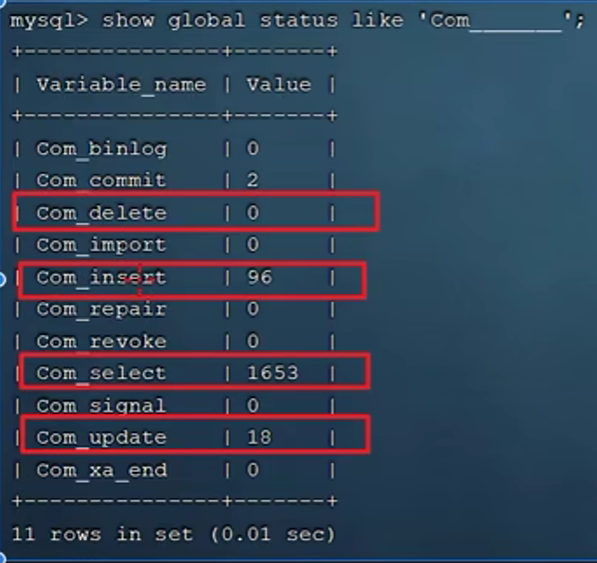

# 数据库命令

### 查询某张表的建表语句：

~~~mysql
show create table 表名
~~~

### 查看MySQL的变量：

#### 查看、修改系统变量

**查**：

~~~mysql
select @@have-profiling;
~~~

**改**：

~~~mysql
set global local_infile = 1
~~~

#### 查看普通变量

查看MySQL的变量：

~~~mysql
show variables like '变量名'
~~~

例如：查看InnoDB存储引擎是否是：一张表对应一个.ibd文件的形式

~~~mysql
show variables like 'innodb_file_pre_table'
~~~

在cmd中查看ibd文件的命令：

~~~sh
ibd2sdi 表名.ibd # 意味着：从ibd文件中提取sdi表结构数据，会以JSON的格式返回表的相关数据
~~~

### 索引的相关操作（增删改查）

**增删改查**

增：

~~~mysql
# 创建索引  可以选择 UNIQUE 或者 FULLTEXT 关键字来指定创建唯一索引还是全文索引，不指定默认创建的是常规索引
CREATE [UNIQUE | FULLTEXT] INDEX index_name ON tableName (col_name1,col_name2...)
~~~

如：

~~~mysql
# 规范
create index idx_表名_字段名 on 表(字段1)
# 例如
create index idx_stu_age on 表(age)
~~~

删：

~~~mysql
# 删除索引
DROP INDEX indexName ON tableName
~~~

查：

~~~mysql
# 查看索引 以一行的排列方式
SHOW INDEX FROM tableName
# 以一列的 排列方式显示表的索引数据
SHOW INDEX FROM tableName\G
~~~

### 查看增删改查sql的执行频率

命令：

~~~mysql
# 查看全局
show global status like 'Com_______'; # 7个_
# 查看当前会话
show session status like 'Com_______';
~~~

如：

