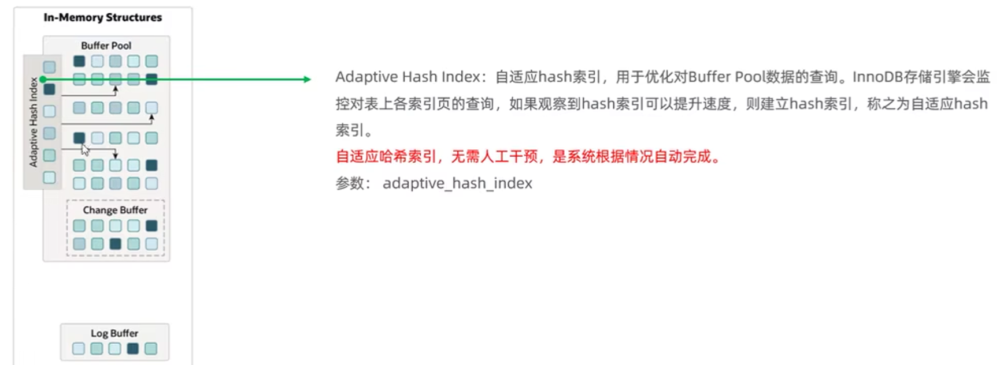

# Mysql(八股学习型)

## 什么是MySQL

MySQL是一个关系型数据库，它采用表的形式来存储数据。既然是表的形式存储数据，就有表结构（行和列）。行代表每一行数据，列代表该行中的每个值。列上的值是有数据类型的，比如：整数、字符串、日期等等。


## 2级 数据库的三大范式

### **第一范式1NF**

1. 确保数据库表字段的**原子性**,即一个字段只能存放一种数据，

   

​	比如字段`phone number：110 13432249938`，依照第一范式必须拆分成 `家庭电话`: `110` `个人电话`:` 13432249938`两个字段。


### **第二范式2NF**

1. 首先要**满足第一范式**，另外包含两部分内容，
2. 一是表必须**有一个主键**；
3. 二是非主键列必须**完全依赖**于主键，而不能只依赖于主键的一部分。

举个例子。假定选课关系表为`student_course`(student_no, student_name, age, course_name, grade, credit 学分)，主键为(student_no, course_name)。其中学分完全依赖于课程名称，姓名年龄完全依赖学号，**不符合第二范式，会导致数据冗余**（学生选n门课，姓名年龄有n条记录）、插入异常（插入一门新课，因为没有学号，无法保存新课记录）等问题。

应该拆分成三个表：学生：`student`(stuent_no, student_name, 年龄)；课程：`course`(course_name, credit)；选课关系：`student_course_relation`(student_no, course_name, grade)。

### **第三范式3NF**

1. 首先要**满足第二范式**，
2. 另外非主键列必须**直接依赖**于主键，不能存在传递依赖。即不能存在：非主键列 A 依赖于非主键列 B，非主键列 B 依赖于主键的情况。

假定学生关系表为

Student(student_no, student_name, age, academy_id,  academy_address,academy_telephone)，

主键为"学号"，其中学院id依赖于学号，而学院地点和学院电话依赖于学院id，存在传递依赖，不符合第三范式。

可以把学生关系表分为如下两个表：

学生：(student_no, student_name, age, academy_id)；

学院：(academy_id, academy_address,academy_telephone)。

### **2NF和3NF的区别？**

- 2NF依据是非主键列是否**完全依赖**于主键，还是依赖于主键的一部分。
- 3NF依据是非主键列是**直接依赖**于主键，还是直接依赖于非主键

# sql语句的执行流程

## 2级 一条查询sql语句的执行流程

### 学习版：


MySQL 的逻辑架构图

大体来说，MySQL 可以分为 Server 层和存储引擎层两部分。

Server 层包括连接器、查询缓存、分析器、优化器、执行器等，涵盖 MySQL 的大多数核心服务功能，以及所有的内置函数（如日期、时间、数学和加密函数等），所有跨存储引擎的功能都在这一层实现，比如存储过程、触发器、视图等。

而存储引擎层负责数据的存储和提取。其架构模式是插件式的，支持 InnoDB、MyISAM、Memory 等多个存储引擎。现在最常用的存储引擎是 InnoDB，它从 MySQL 5.5.5 版本开始成为了默认存储引擎。

也就是说，你执行 create table 建表的时候，如果不指定引擎类型，默认使用的就是 InnoDB。不过，你也可以通过指定存储引擎的类型来选择别的引擎，比如在 create table 语句中使用 engine=memory, 来指定使用内存引擎创建表。不同存储引擎的表数据存取方式不同，支持的功能也不同。

从图中不难看出，不同的存储引擎共用一个**Server 层**，也就是从连接器到执行器的部分。


#### 4级 连接器

连接器负责跟客户端建立连接、获取权限、维持和管理连接。


### 回答：

查询语句的执行流程如下：权限校验(连接器)--->查询缓存--->分析器--->优化器--->权限校验--->执行器--->引擎

当执行一条**查询sql**时，首先会去查询当前用户是否具有相应的权限，没有权限则会执行失败。如果有权限的话，在Mysql8.0版本之前缓存还没有被删除，则会去校验这个 SQL 是否执行过，是否以 Key-Value 的形式缓存在内存中,在缓存中能够命中的话就直接返回结果，如果没有命中缓存或者使用的是Mysql8.0之后的版本，则会走分析器来对sql进行关键字提取、语法分析，确认sql的语法无误后就会交给优化器来挑选Mysql认为最优的执行方案，当选择了执行方案后，接下来就会交给执行器准备开始执行了，执行之前还会进行一次权限验证，判断当前用户是否有执行的权限，如果没有权限，就会返回错误信息，如果有权限，才会调用存储引擎的接口来执行sql，并且返回接口执行的结果，如果有缓存的话还会把查询结果放到缓存中。

## 一条更新sql语句执行流程

### 学习版

#### update 语句执行流程

从一个表的一条更新语句举例，下面是这个表的创建语句，这个表有一个主键 ID 和一个整型字段 c：

```sql
mysql> create table T(ID int primary key, c int);
```

如果要将 ID=2 这一行的值加 1，SQL 语句就会这么写：

```r
mysql> update T set c=c+1 where ID=2;
```

**查询语句的那一套流程，更新语句也是同样会走一遍：**

你执行语句前要先连接数据库，这是连接器的工作。

接下来，**分析器会通过词法和语法解析知道这是一条更新语句**。优化器决定要使用 ID 这个索引。然后，执行器负责具体执行，找到这一行，然后更新。与查询流程不一样的是，更新流程还涉及两个重要的日志模块：redo log（重做日志）和 binlog（归档日志）。

另外，在一个表上有更新的时候，跟这个表有关的**查询缓存会失效**，所以这条语句就会把表 T 上所有缓存结果都清空。

我们再来看执行器和 InnoDB 引擎在执行这个简单的 update 语句时的内部流程。

1. 执行器先找引擎取 ID=2 这一行。ID 是主键，引擎直接用树搜索找到这一行。如果 ID=2 这一行所在的数据页本来就在内存中，就直接返回给执行器；否则，需要先从磁盘读入内存，然后再返回。
2. 执行器拿到引擎给的行数据，把这个值加上 1，比如原来是 N，现在就是 N+1，得到新的一行数据，再调用引擎接口写入这行新数据。
3. 引擎将这行新数据更新到内存中，同时将这个更新操作记录到 redo log 里面，此时 redo log 处于 prepare 状态。然后告知执行器执行完成了，随时可以提交事务。
4. 执行器生成这个操作的 binlog，并把 binlog 写入磁盘。
5. 执行器调用引擎的提交事务接口，引擎把刚刚写入的 redo log 改成提交（commit）状态，更新完成。

这里我给出这个 update 语句的执行流程图，图中浅色框表示是在 InnoDB 内部执行的，深色框表示是在执行器中执行的。


你可能注意到了，最后三步看上去有点“绕”，将 redo log 的写入拆成了两个步骤：prepare 和 commit，这就是”两阶段提交”。

#### 为什么必须有“两阶段提交”呢？

两阶段提交是跨系统维持数据逻辑一致性时常用的一个方案，即使你不做数据库内核开发，日常开发中也有可能会用到。

这是为了让两份日志之间的逻辑一致。

如果不使用“两阶段提交”，那么数据库的状态就有可能和用它的日志恢复出来的库的状态不一致。


#### redo log(重做日志)是什么？

##### 5级 为什么需要redo log

在 MySQL 里也有这个问题，如果每一次的更新操作都需要写进磁盘，然后磁盘也要找到对应的那条记录，然后再更新，整个过程 IO 成本、查找成本都很高。为了解决这个问题, MySQL 里使用了 **WAL 技术**，WAL 的全称是 Write-Ahead Logging，它的**关键点就是先写日志，再写磁盘。**


1.  **当有一条记录需要更新的时候，InnoDB 引擎就会先把记录写到 redo log（粉板）里面，并更新内存**，这个时候更新就算完成了。同时，InnoDB 引擎会在适当的时候，将这个操作记录更新到磁盘里面，而这个更新往往是在系统比较空闲的时候做。
2.  有了 redo log，InnoDB 就可以保证即使数据库发生异常重启，之前提交的记录都不会丢失，这个能力称为**crash-safe**。

##### redo log详解

InnoDB 的 redo log 是固定大小的，比如可以配置为一组 4 个文件，每个文件的大小是 1GB，那么这块“粉板”总共就可以记录 4GB 的操作。从头开始写，写到末尾就又回到开头循环写，如下面这个图所示。


**write pos 是当前记录的位置，一边写一边后移，写到第 3 号文件末尾后就回到 0 号文件开头。checkpoint 是当前要擦除的位置，也是往后推移并且循环的，擦除记录前要把记录更新到数据文件。**

write pos 和 checkpoint 之间的是“粉板”上还空着的部分，可以用来记录新的操作。如果 write pos 追上 checkpoint，表示“粉板”满了，这时候不能再执行新的更新，得停下来先擦掉一些记录，把 checkpoint 推进一下。

#### binlog（归档日志）

 **redo log 是 InnoDB 引擎特有的日志，而 Server 层也有自己的日志，称为 binlog（归档日志）。**

##### 为什么会有两份日志呢？

因为最开始 MySQL 里并没有 InnoDB 引擎。MySQL 自带的引擎是 MyISAM，但是 MyISAM 没有 crash-safe 的能力，binlog 日志只能用于归档。而 InnoDB 是另一个公司以插件形式引入 MySQL 的，既然只依靠 binlog 是没有 crash-safe 能力的，所以 InnoDB 使用另外一套日志系统——也就是 redo log 来实现 crash-safe 能力。

##### **两种日志的比较**

1. redo log 是 InnoDB 引擎特有的；binlog 是 MySQL 的 Server 层实现的，所有引擎都可以使用。
2. redo log 是物理日志，记录的是“在某个数据页上做了什么修改”；binlog 是逻辑日志，记录的是这个语句的原始逻辑，比如“给 ID=2 这一行的 c 字段加 1 ”。
3. redo log 是循环写的，空间固定会用完；binlog 是可以追加写入的。“追加写”是指 binlog 文件写到一定大小后会切换到下一个，并不会覆盖以前的日志。


### 回答

更新语句执行流程如下：连接器(权限校验)----->分析器---->执行器根据索引调用存储引擎的接口寻找数据--->存储引擎找到数据后从磁盘写入内存中--->执行器从内存中获取数据进行更新操作后再调用引擎接口写入这行新数据---->引擎将这行新数据更新到内存中，同时将这个更新操作记录到 redo log 里面---->记录redo log(prepare 状态)--->执行器生成binlog--->redo log(commit 状态)

你执行语句前要先连接数据库，这是连接器的工作。

接下来，**分析器会通过词法和语法解析知道这是一条更新语句**。优化器决定要使用 ID 这个索引。然后，执行器负责具体执行，找到这一行，然后更新。与查询流程不一样的是，更新流程还涉及两个重要的日志模块：redo log（重做日志）和 binlog（归档日志）。

另外，在一个表上有更新的时候，跟这个表有关的**查询缓存会失效**，所以这条语句就会把表 T 上所有缓存结果都清空。

我们再来看执行器和 InnoDB 引擎在执行这个简单的 update 语句时的内部流程。

1. 执行器先找引擎取 ID=2 这一行。ID 是主键，引擎直接用树搜索找到这一行。如果 ID=2 这一行所在的数据页本来就在内存中，就直接返回给执行器；否则，需要先从磁盘读入内存，然后再返回。
2. 执行器拿到引擎给的行数据，把这个值加上 1，比如原来是 N，现在就是 N+1，得到新的一行数据，再调用引擎接口写入这行新数据。
3. 引擎将这行新数据更新到内存中，同时将这个更新操作记录到 redo log 里面，此时 redo log 处于 prepare 状态。然后告知执行器执行完成了，随时可以提交事务。
4. 执行器生成这个操作的 binlog，并把 binlog 写入磁盘。
5. 执行器调用引擎的提交事务接口，引擎把刚刚写入的 redo log 改成提交（commit）状态，更新完成。

# 事务

## 事务是什么

简单来说，**事务就是要保证一组数据库操作，要么全部成功，要么全部失败。**


## 事务四大特性ACID(三更故事记忆法)

 ACID（Atomicity、Consistency、Isolation、Durability，即原子性、一致性、隔离性、持久性）


- 原子性
  是指事务操作类似一个不可分割的原子，事务中包含的所有操作要么全部成功，要么全部失败回滚（这种成功或失败的状态是像原子一样不可分割为成功与失败两者都包含的）

- 一致性
  指一个事务执行之前和执行之后都必须处于一致性状态。比如a与b账户共有1000块，两人之间转账之后无论成功还是失败，它们的账户总和还是1000。

- 隔离性
  指事务之间是有一定的隔离级别的，如在`read committed`隔离级别下，一个事务只能读取到已提交的事务修改，没有提交事务修改是不可见的。

- 持久性
  指**事务一旦被提交**，这组操作修改的数据就真的的发生变化了(不会再被回滚了)。即使接下来数据库故障也不应该对其有影响。


1. 原子性-undo log
2. 一致性-undo log+redo log
3. 隔离性-锁+MVCC
4. 持久性-redo log


## 事务隔离级别

事务隔离级别 transaction isolation level

**SQL 标准的事务隔离级别包括：读未提交（read uncommitted）、读提交（read committed）、可重复读（repeatable read）和串行化（serializable ）。**下面我逐一为你解释：

- 读未提交是指，一个事务还没提交时，它做的变更就能被别的事务看到。
- 读提交是指，一个事务提交之后，它做的变更才会被其他事务看到。
- 可重复读是指，一个事务执行过程中看到的数据，总是跟这个事务**在启动时看到的数据是一致的**。当然在可重复读隔离级别下，未提交变更对其他事务也是不可见的。
- 串行化，顾名思义是对于同一行记录，**“写”会加“写锁”，“读”会加“读锁”。**当出现读写锁冲突的时候，后访问的事务必须等前一个事务执行完成，才能继续执行。

### 3种错误现象


#### **脏读**

脏指：**读取到其它事务未提交的数据**

| **tx1**                                                    | **tx2**                                               |
| ---------------------------------------------------------- | ----------------------------------------------------- |
| set  session transaction isolation level read uncommitted; |                                                       |
| start  transaction;                                        |                                                       |
| select  * from account;  /*两个账户都为 1000*/             |                                                       |
|                                                            | start  transaction;                                   |
|                                                            | update  account set balance = 2000 where accountNo=1; |
| select  * from account; /*1号账户2000, 2号账户1000*/       |                                                       |

* tx2 未提交的情况下，tx1 仍然读取到了它的更改


#### **不可重复读**

在同一事务内，两次读取的结果不一致（第二次读取到了另一个事务修改、提交后的数据）

| **tx1**                                                  | **tx2**                                               |
| -------------------------------------------------------- | ----------------------------------------------------- |
| set  session transaction isolation level read committed; |                                                       |
| start  transaction;                                      |                                                       |
| select  * from account; /*两个账户都为 1000*/            |                                                       |
|                                                          | update  account set balance = 2000 where accountNo=1; |
| select  * from account; /1号账户2000/                    |                                                       |

* tx1 在同一事务内，两次读取的结果不一致


#### **幻读**

| **tx1**                                                      | **tx2**                               |
| ------------------------------------------------------------ | ------------------------------------- |
| set  session transaction isolation level repeatable read;    |                                       |
| start  transaction;                                          |                                       |
| select  * from account; /*存在 1,2 两个账户*/                |                                       |
|                                                              | insert  into account values(3, 1000); |
| select  * from account; /*发现还是只有 1,2 两个账户*/        |                                       |
| insert  into account values(3, 5000);  /* ERROR  1062 (23000): Duplicate entry '3' for key 'PRIMARY'  */ |                                       |

* tx1 查询时并没有发现 3 号账户，执行插入时却发现主键冲突异常，就好像出现了幻觉一样

### 4种隔离级别

MySQL数据库为我们提供的四种隔离级别：

- **Serializable** (串行化)：通过强制事务排序，使之不可能相互冲突，从而解决幻读问题。
- **Repeatable read** (可重复读)：MySQL的默认事务隔离级别，它确保同一事务的多个实例在并发读取数据时，会看到同样的数据行，解决了不可重复读的问题。
- **Read committed** (读已提交)：一个事务只能看见已经提交事务所做的改变。可避免脏读的发生。
- **Read uncommitted** (读未提交)：所有事务都可以看到其他未提交事务的执行结果。


1. Isolation.READ_UNCOMMITTED 读未提交,存在脏读、不可重复读、幻读问题

2. Isolation.READ_COMMITTED 读已提交,解决脏读问题，仍然存在不可重复读、幻读问题

3. Isolation.REPEATABLE_READ 可重复读,解决不可重复读问题，仍然存在幻读问题

4. Isolation.SERIALIZABLE 序列化,可以避免脏读、不可重复读与幻读。但是这种事务隔离级别效率低下，比较耗数据库性能，一般不使用。

大多数数据库默认的事务隔离级别是Read committed，比如Sql Server , Oracle。

而Mysql的默认隔离级别是Repeatable read。

#### **读未提交**

* 读到其它事务未提交的数据（最新的版本）

* 错误现象：有脏读、不可重复读、幻读现象


#### **读已提交（RC）**

* 读到其它事务已提交的数据（最新已提交的版本）

* 错误现象：有不可重复读、幻读现象

* 使用场景：希望看到最新的有效值


#### **可重复读（RR）** 

* 在事务范围内，多次读能够保证一致性（快照建立时最新已提交版本）

* 错误现象：有幻读现象，可以用加锁避免

* 使用场景：事务内要求更强的一致性，但看到的未必是最新的有效值

原理：在实现上，数据库里面会创建一个视图，访问的时候以视图的逻辑结果为准。在“可重复读”隔离级别下，**这个视图是在事务启动时创建的，整个事务存在期间都用这个视图**，所以即使真正的表被另一个事务改变了，由于读的是这个视图，仍然能够保证一致性。

在“读提交”隔离级别下，这个视图是在**每个 SQL 语句开始执行的时候**根据真正的表来创建的，所以其他事务把表进行修改提交后，能够查询得到。

这里需要注意的是，“读未提交”隔离级别下直接返回记录上的最新值，**没有视图概念**；

而“串行化”隔离级别下直接**用加锁的方式来避免并行访问**。

**加锁避免幻读**

| **tx1**                                                   | **tx2**                                           |
| --------------------------------------------------------- | ------------------------------------------------- |
| set  session transaction isolation level repeatable read; |                                                   |
| start  transaction;                                       |                                                   |
| select  * from account; /*存在 1,2 两个账户*/             |                                                   |
| select  * from account where accountNo=3  for update;     |                                                   |
|                                                           | insert  into account values(3, 1000);  /* 阻塞 */ |
| insert  into account values(3, 5000);                     |                                                   |

* 在 for update 这行语句执行时，虽然此时 3 号账户尚不存在，但 MySQL 在 repeatable read 隔离级别下会用**间隙锁**，锁住 2 号记录与正无穷大之间的间隙
* 此时 tx2 想插入 3 号记录就不行了，被间隙锁挡住了


#### **序列化(串行读)** 

* 在事务范围内，仅有读读可以并发，读写或写写会阻塞其它事务，用这种办法保证更强的一致性

* 错误现象：无


**串行读避免幻读**

| **tx1**                                                | **tx2**                                           |
| ------------------------------------------------------ | ------------------------------------------------- |
| set  session transaction isolation level serializable; |                                                   |
| start  transaction;                                    |                                                   |
| select  * from account; /* 存在 1,2 两个账户 */        |                                                   |
|                                                        | insert  into account values(3, 1000);  /* 阻塞 */ |
| insert  into account values(3, 5000);                  |                                                   |

* 串行读隔离级别下，普通的 select 也会加**共享读锁**，其它事务的查询可以并发，但增删改就只能阻塞了


## 生产环境数据库一般用的什么隔离级别呢？

**生产环境大多使用RC**。为什么不是RR呢？

> 可重复读(Repeatable Read)，简称为RR 读已提交(Read Commited)，简称为RC


1. 缘由一：在RR隔离级别下，存在间隙锁，导致出现死锁的几率比RC大的多！
2.  缘由二：在RR隔离级别下，条件列未命中索引会锁表！而在RC隔离级别下，只锁行!
3. 也就是说，RC的并发性高于RR。

并且大多数数据库默认的事务隔离级别是RC，比如Sql Server , Oracle。

而Mysql的默认隔离级别是RR。

并且大部分场景下，**不可重复读问题是可以接受的**。毕竟读取到的数据都已经提交过一次了，说明已经经过了合法性验证，再次读出来覆盖原来的数据本身就没有太大问题！


## 事务传播行为propagation

当**事务方法嵌套调用时**，需要控制是否开启新事务，可以使用事务传播行为来控制。

| 属性值                                                   | 行为                                                   |
| -------------------------------------------------------- | ------------------------------------------------------ |
| REQUIRED（必须要有：别人有我就进入别人的，没有就新建）   | 外层方法有事务，内层方法就加入。外层没有，内层就新建   |
| REQUIRES_NEW（必须要有新事务：不管别人有没有，我都新建） | 外层方法有事务，内层方法新建。外层没有，内层也新建     |
| SUPPORTS（支持有：别人有我就进入别人的，没有就摆了）     | 外层方法有事务，内层方法就加入。外层没有，内层就也没有 |
| NOT_SUPPORTED（支持没有:我谁也不加）                     | 外层方法有事务，内层方法没有。外层没有，内层也没有     |
| MANDATORY（强制要求外层有）                              | 外层方法有事务，内层方法加入。外层没有。内层就报错     |
| NEVER(绝不允许有)                                        | 外层方法有事务，内层方法就报错。外层没有。内层就也没有 |

**重点掌握：前三个即可**。

**(内层)事务为什么失效？**可能是事务传播行为propagation设置错误，比如设置为SUPPORTS并且此时外层方法没有设置事务时，内层的事务就会失效。

# 存储引擎

### MySQL体系结构


1. 连接层
   最上层是一些客户端和链接服务，主要完成一些类似于**连接处理、授权认证**、及相关的安全方案。服务器也会为安全接入的每个客户
   端验证它所具有的操作权限。
2. 服务层
   第二层架构主要**完成大多数的核心服务功能**，如SQL接口，并完成缓存的查询，SQL的分析和优化，部分内置函数的执行。**所有跨存**
   **储引擎的功能也在这一层实现，如过程、函数等。**
3. 引擎层
   存储引擎真正的负责了MySQL中数据的存储和提取，服务器通过API和存储引擎进行通信。不同的存储引擎具有不同的功能，这样我
   们可以根据自己的需要，来选取合适的存储引擎。**索引是在存储引擎层实现的**，所以不同的存储引擎，索引的结构是不一样的。
4. 存储层
   主要是**将数据存储在磁盘**的文件系统之上，并完成与存储引擎的交互。

### 存储引擎是什么

存储引擎就是**存储数据、建立索引、更新/查询数据等技术的实现方式**。存储引擎是基于表的，而不是基于库的，所以存储引擎也可被
称为表类型(所以一个数据库下可以有多个不同类型的表)。

#### InnoDB介绍

 介绍
   InnoDB是一种兼顾**高可靠性和高性能**的通用存储引擎，在MySQL5.5之后，InnoDB是默认的MySQL存储引擎。
特点:

1. DML操作遵循ACID模型，支持**事务**；
2. 支持**外键**FOREIGN KEY:约束，保证了数据的完整性和正确性；
3. **行级锁**，提高并发访问性能：

文件
XXX.ibd:XXX代表的是表名，innoDB引擎的每张表都会对应这样一个表空间文件，存储该表的**表结构(frm、sdi)、数据和索引**。

例如：查看InnoDB存储引擎是否是：一张表对应一个.ibd文件的形式

~~~mysql
show variables like 'innodb_file_pre_table'
~~~

在cmd中查看ibd文件的命令：

~~~sh
ibd2sdi 表名.ibd # 意味着：从ibd文件中提取sdi表结构数据，会以JSON的格式返回表的相关数据
~~~


#### MyISAM介绍

介绍

MyISAM:是MySQL早期的默认存储引擎

特点

1. 不支持事务，不支持外键
2. 支持表锁，不支持行锁
3. 访问速度快

文件

- XXX.sdi:存储表结构信息
- XXX.MYD:存储数据
- XXX.MYI:存储索引


#### Memory介绍
介绍

​	Memory引擎的表数据是存储在内存中的，由于受到硬件问题、或断电问题的影响，只能将这些表作为临时表或缓存使用。

特点

1. 内存存放，访问速度快
2. hash索引（默认）

文件

XXxX.sdi:存储表结构信息

#### 存储引擎的选择
在选择存储引擎时，没有最好的存储引擎，应该根据应用系统的特点选择最合适的存储引擎。对于复杂的应用系统，还可以根据实际情况选择多种存储引擎进行组合。

1. InnoDB:是Mysq的默认存储引擎，支持事务、外键。如果应用对事务的完整性有比较高的要求，在并发条件下要求数据的一致
   性，数据操作除了插入和查询之外，还包含很多的更新、删除操作，那么InnoDB存储引擎是比较合适的选择。

2. MyISAM：如果应用是以读操作和插入操作为主，只有很少的更新和删除操作，并且对事务的完整性、并发性要求不是很高，那
   么选择这个存储引擎是非常合适的，比如日志系统，偶尔丢弃一些数据也无伤大雅。(被mongoDB取代)

3. MEMORY:将所有数据保存在内存中，访问速度快，通常用于临时表及缓存。MEMORY的缺陷就是对表的大小有限制，太大的表
   无法缓存在内存中，而且无法保障数据的安全性。(被Redis取代)


##  InnoDB vs MyISAM


### **要求**

* 掌握 InnoDB 与 MyISAM 的主要区别
* 尤其注意它们在索引结构上的区别

## InnoDB引擎 详解
### 逻辑存储结构

innoDB的逻辑存储结构：


1. 表空间(ibd文件)，一个MySQL实例可以对应多个表空间，用于**存储表结构、表数据、索引等数据**。

2. 段，分为**数据段、索引段、回滚段**,InnoDB是索引组织表，数据段就是B+树的叶子节点，索引段即为B+树的非叶子节点。段用来管理多个Extent(区)。

3. 区，表空间的单元结构，每个区的大小为1M。默认情况下，InnoDB存储引擎页大小
   为16K,即一个区中一共有64个连续的页。

4. 页，是**InnoDB存储引擎磁盘管理的最小单元**，每个页的大小默认为16KB。为了保证页的连续性，InnoDB存储引擎每次从
   磁盘申请4-5个区。

5. 行，InnoDB存储引擎数据是按行进行存放的，**Page中的每个Row对应的就是数据库表中的每一行数据**。

   其中的两个隐藏字段有：

   Trx_id:每次对某条记录进行改动时，都会把对应的事务id赋值给trx_id隐藏列。
   Roll_pointer:每次对某条引记录进行改动时，都会把旧的版本写入到udo日志中，然后这个隐藏列就相当于一个指针，可以通过它来找到该记录修改前的信息。


### 架构

#### 内存架构

InnoDB的内存架构：

**缓存池(Buffer Pool)**:


**更改缓冲区(Change Buffer)的介绍**:


**自适应哈希索引**：



查看自适应索引的开启情况:


**日志缓冲区**:


#### 磁盘架构

磁盘结构1:


磁盘架构2:


磁盘架构3:


#### 后台线程

作用：把内存结构中的数据刷新到磁盘中。


### 事务原理

事务的实现原理:


## undo log 与 redo log

### **要求**

* 理解 undo log 的作用
* 理解 redo log 的作用

### **undo log**

 回滚日志，在insert、update、delete的时候产生的便于数据回滚的日志。
当insert的时候，产生的undo log日志只在回滚时需要，在事务提交后，**可被立即删除**。
而update、delete的时候，产生的undo log日志不仅在回滚时需要，在快照读时也需要，**不会立即被删除**。

#### **undo log版本链**:

执行事务2时，要修改id=30的记录的age改为3，首先把当前的数据记录到undo log中（即：地址值为Ox0001的记录），然后才进行修改，把age改变的同时，修改隐藏字段DB_TRX_ID 为当前的事务2，表示这条数据最后修改的事务id，修改DB_ROLL_PTR的指针指向修改之前记录的uodo log（即：地址值为Ox0001的记录），其他的以此类推。


#### **readview**

ReadView(读视图)是快照读SQL执行时MVCC提取数据的依据(决定从uodo log版本链中读取哪一个版本的数据)，记录并维护系统当前活跃的事务（未提交的）id。


#### **undo log版本链数据访问规则**:


**RC隔离级别下查询到相应版本数据的流程**:

流程：RC隔离级别下，以事务5的第二次查询为例，每次普通查询，进行快照读时会建立ReadView,根据建立的ReadView中的4个字段来判断读取哪一个版本的数据，结果为：只能读取到已经提交的事务id。


**RR隔离级别下查询到相应版本数据的流程**:


#### 什么是undo log?有什么用？

undo log,也称为回滚日志，是MySQL数据库中InnoDB存储引擎的一个重要概念。
在数据库中，undo log主要有两个作用：

1. 提供了事务的回滚功能。当一个事务执行过程中出现错误，或者在一定的情况下需要主动回滚一个事务时，InnoDB可以通过undo log把数据恢复到事务开始之前的状态。
2. 为了实现多版本并发控制(MVCC)提供了一种机制。在执行读操作时，为了能读取到一个一致性的快照，需要通过undo log来获取数据在某个时间点的版本。

undo log和redo log记录物理日志不一样，它是逻辑日志。可以认为当delete一条记录时，undo log中会记录一条对应的insert记录，反之
亦然，当update一条记录时，它记录一条对应相反的update记录。当执行rollback时，就可以从undo log中的逻辑记录读取到相应的内容
并进行回滚。

Undo log销毁：undo log在事务执行时产生，事务提交时，并不会立即删除undo log,因为这些日志可能还用于MVCC。

Undo log存储：undo log采用段的方式进行管理和记录，存放在前面介绍的rollback segment回滚段中，内部包含1024个undo log
segment。

需要注意的是，undo log也是InnoDB存储引擎特有的，其他存储引擎不一定有类似的机制。


* 回滚数据，以行为单位，记录数据每次的变更，一行记录有多个版本并存
* 多版本并发控制，即快照读（也称为一致性读），让查询操作可以去访问历史版本


1. 每个事务会按照开始时间，分配一个单调递增的事务编号 trx id
2. 每次事务的改动都会以行为单位记入回滚日志，包括当时的事务编号，改动的值等
3. 查询操作，事务编号大于自己的数据是不可见的，事务编号小于等于自己的数据才是可见的
   * 例如图中红色事务看不到 trx id=102 以及 trx id=101 的数据，只有 trx id=99 的数据对它可见


#### 4级 (uodo log详解)“快照”在 MVCC 里是怎么工作的？

mysql实战45讲：

**在可重复读隔离级别下，事务在启动的时候就“拍了个快照”。注意，这个快照是基于整库的。**

这时，你会说这看上去不太现实啊。如果一个库有 100G，那么我启动一个事务，MySQL 就要拷贝 100G 的数据出来，这个过程得多慢啊。可是，我平时的事务执行起来很快啊。

实际上，我们并不需要拷贝出这 100G 的数据。我们先来看看这个快照是怎么实现的。

**InnoDB 里面每个事务有一个唯一的事务 ID，叫作 transaction id。它是在事务开始的时候向 InnoDB 的事务系统申请的，是按申请顺序严格递增的。**

**而每行数据也都是有多个版本的。每次事务更新数据的时候，都会生成一个新的数据版本，并且把 transaction id 赋值给这个数据版本的事务 ID，记为 row trx_id。同时，旧的数据版本要保留，并且在新的数据版本中，能够有信息可以直接拿到它。**

**也就是说，数据表中的一行记录，其实可能有多个版本 (row)，每个版本有自己的 row trx_id。**

如图 2 所示，就是一个记录被多个事务连续更新后的状态。


图 2 行状态变更图

图中虚线框里是同一行数据的 4 个版本，当前最新版本是 V4，k 的值是 22，它是被 transaction id 为 25 的事务更新的，因此它的 row trx_id 也是 25。

你可能会问，前面的文章不是说，语句更新会生成 **undo log（回滚日志）**吗？那么，**undo log 在哪呢？**

实际上，图 2 中的三个虚线箭头，就是 undo log；而 V1、V2、V3 并不是物理上真实存在的，而是每次需要的时候根据当前版本和 undo log 计算出来的。比如，**需要 V2 的时候，就是通过 V4 依次执行 U3、U2 算出来。**

明白了多版本和 row trx_id 的概念后，我们再来想一下，InnoDB 是怎么定义那个“100G”的快照的。

按照可重复读的定义，一个事务启动的时候，能够看到所有已经提交的事务结果。但是之后，这个事务执行期间，其他事务的更新对它不可见。

因此，**一个事务只需要在启动的时候声明说，“以我启动的时刻为准，如果一个数据的（事务？）版本是在我启动之前生成的，就认；如果是我启动以后才生成的，我就不认，我必须要找到它的上一个（事务？）版本”。**

当然，如果“上一个版本”也不可见，那就得继续往前找。还有，如果是这个事务自己更新的数据，它自己还是要认的。

**my：简单来说：即：一个可重复读隔离级别的事务启动时建立的一致性快照（这整个事务过程中可见的数据）必须为：数据对应的事务id <= 当前这个事务的id的数据，对于数据的事务id大于当前事务id的数据，在当前这个事务看来是不可见的**


### **redo log**

我们知道 InnoDB 存储引擎是以页为单位来管理存储空间的，我们往 MySQL 插入的数据最终都是存在于页中的，准确点来说是数据页这种类型。为了减少磁盘 IO 开销，还有一个叫做 Buffer Pool(缓冲池) 的区域，存在于内存中。当我们的数据对应的页不存在于 Buffer Pool 中的话， MySQL 会先将磁盘上的页缓存到 Buffer Pool 中，这样后面我们直接操作的就是 Buffer Pool 中的页，这样大大提高了读写性能。

redo log 的作用主要是**实现 ACID 中的持久性**，保证提交的数据不丢失

* 它记录了事务提交的变更操作，服务器意外宕机重启时，利用 redo log 进行回放，重新执行已提交的变更操作
* 事务提交时，首先将变更写入 redo log，事务就视为成功。至于数据页（表、索引）上的变更，可以放在后面慢慢做
  * 数据页上的变更宕机丢失也没事，因为 redo log 里已经记录了
  * **数据页在磁盘上位置随机，写入速度慢，redo log 的写入是顺序的速度快**

它**由两部分组成**，内存中的 redo log buffer，磁盘上的 redo log file

* redo log file 由一组文件组成，当写满了会循环覆盖较旧的日志，这意味着不能无限依赖 redo log，更早的数据恢复需要 binlog 
* buffer 和 file 两部分组成意味着，写入了文件才真正安全，**同步策略**由参数 innodb_flush_log_at_trx_commit  控制
  * 0 - 每隔 1s 将日志 write and flush 到磁盘 
  * **1 - 每次事务提交将日志 write and flush（默认值）**
  * 2 - 每次事务提交将日志 write，每隔 1s flush 到磁盘，write 意味着写入操作系统缓存，如果 MySQL 挂了，而操作系统没挂，那么数据不会丢失

#### 什么是redo log?有什么用？

redo log,也被称为重做日志，是MySQL数据库中InnoDB存储引擎的一个重要概念。

在数据库中，为了提高性能，数据在更新的时候并不是直接更新在磁盘上，而是先更新在内存中，然后通过后台的方式慢慢刷(flush)到磁盘。但是这种方式存在一个问题，那就是如果数据库在数据还没有刷到磁盘的时候发生了崩溃，那么这部分数据就会丢失。

这时，就需要使用到redo log。当数据更新的时候，InnoDB引擎会先把记录写到redo log中，并更新内存，这个时候更新就算完成了。InnoDB引擎会在适当的时候，将这个操作记录更新到磁盘中。

并且，redo log是循环写的，当写到末尾时，又会从头开始写。这样做的好处是，即使数据库发生崩溃，只要redo log还在，就可以通过redo log把数据恢复到最新的状态。因此，redo log主要是用来保证事务的持久性(Durability)。

需要注意的是，redo log是InnoDB存储引擎特有的，其他存储引擎不一定有类似的机制。

**redo log的应用**:

redo log记录的是物理日志，即：这条数据本身的值


##  快照读与当前读

### **要求**

* 理解快照读与当前读
* 了解快照产生的时机

### **当前读**

读取的是记录的最新版本，读取时还要保证其他并发事务不能修改当前记录，会对读取的记录进行加锁。

对于我们日常的操作，如：


* select ... lock in share mode (共享锁)
* select … for update (排他锁)
* insert、update、delete (排他锁)，都是一种当前读，会按最新提交的数据进行操作

当前读本质上是基于锁的并发读操作


### **快照读**

也称为一致性读，简单的select(不加锁)就是快照读，快照读，读取的是记录数据的可见版本，有可能是历史数据，不加锁，是非阻塞读。

快照读主要体现在 **select** 时，而**不同隔离级别下，select 的行为不同**

* 在 Serializable 隔离级别下 - 普通 select 会退化为当前读，即加共享读锁

* 在 RC 隔离级别下 - 每次 select 都会建立新的快照

* 在 RR 隔离级别下
  * 事务启动后，首次 select 会建立快照
  * 如果事务启动选择了 with consistent snapshot，事务启动时就建立快照
  * 基于旧数据的修改操作，会重新建立快照

快照读**本质上读取的是历史数据**（原理是回滚段），属于无锁查询


**RR 下，快照建立时机 - 第一次 select 时**

| **tx1**                                                      | **tx2**                                               |
| ------------------------------------------------------------ | ----------------------------------------------------- |
| set  session transaction isolation level repeatable read;    |                                                       |
| start  transaction;                                          |                                                       |
| select  * from account;  /* 此时建立快照，两个账户为 1000  */ |                                                       |
|                                                              | update  account set balance = 2000 where accountNo=1; |
| select  * from account;  /* 两个账户仍为 1000 */             |                                                       |

* 快照一旦建立，以后的查询都基于此快照，因此 tx1 中第二次 select 仍然得到 1 号账户余额为 1000

如果 tx2 的 update 先执行

| **tx1**                                                      | **tx2**                                               |
| ------------------------------------------------------------ | ----------------------------------------------------- |
| set  session transaction isolation level repeatable read;    |                                                       |
| start  transaction;                                          |                                                       |
|                                                              | update  account set balance = 2000 where accountNo=1; |
| select  * from account; /* 此时建立快照，1号余额已经为2000 */ |                                                       |

**RR 下，快照建立时机 - 事务启动时**

如果希望事务启动时就建立快照，可以添加 with consistent snapshot 选项

| **tx1**                                                      | **tx2**                                               |
| ------------------------------------------------------------ | ----------------------------------------------------- |
| set  session transaction isolation level repeatable read;    |                                                       |
| start  transaction with consistent snapshot; /* 此时建立快照，两个账户为 1000  */ |                                                       |
|                                                              | update  account set balance = 2000 where accountNo=1; |
| select  * from account; /* 两个账户仍为 1000 */              |                                                       |

**RR 下，快照建立时机 - 修改数据时**

| **tx1**                                                     | **tx2**                                                     |
| ----------------------------------------------------------- | ----------------------------------------------------------- |
| set  session transaction isolation level repeatable read;   |                                                             |
| start  transaction;                                         |                                                             |
| select  * from account; /* 此时建立快照，两个账户为 1000 */ |                                                             |
|                                                             | update  account set balance=balance+1000 where accountNo=1; |
| update  account set balance=balance+1000 where accountNo=1; |                                                             |
| select  * from account; /* 1号余额为3000 */                 |                                                             |

* tx1 内的修改必须重新建立快照，否则，就会发生丢失更新的问题


### 快照读和当前读

表记录有两种读取方式。

- 快照读：读取的是快照版本。普通的`SELECT`就是快照读。通过mvcc来进行并发控制的，不用加锁。
- 当前读：读取的是最新版本。`UPDATE、DELETE、INSERT、SELECT … LOCK IN SHARE MODE、SELECT … FOR UPDATE`是当前读(增删改 与 特殊的查)。

#### 当前读导致的幻读现象

快照读情况下，InnoDB通过`mvcc`机制避免了幻读现象。而`mvcc`机制无法避免当前读情况下出现的幻读现象。因为当前读每次读取的都是最新数据，这时如果两次查询中间有其它事务插入数据，就会产生幻读。

下面举个例子说明下：

下图左边是事务a，右边是事务b。b事务开始之前只有两条用户名非a的记录，想要更改用户名为全a，但是中途事务a插入一条数据之后，本应该查询出两条用户名为a的数据，实际上事务a查询出来的是三条用户名为a的数据


以上就是当前读出现的幻读现象。

每个步骤的解读：

1. 在RR隔离级别下，事务b以普通的方式开始事务，在第一条select(快照读)语句时建立快照，查询到的两个user_name不等于a。
2. 事务a执行插入语句(当前读，对最新的数据进行插入)
3. 提交事务a
4. 事务b执行更新语句(当前读，对最新的数据进行修改)，把用户名全部更新为a，同时以此建立新的快照
5. 事务b的select(快照读)依据最新的快照查询出数据，结果读取到了其他事务插入的数据


**那么MySQL是如何避免幻读？**

- 在快照读情况下，MySQL通过`mvcc`来避免幻读。
- 在当前读情况下，MySQL通过`next-key`来避免幻读（加行锁和间隙锁来实现的）。

next-key包括两部分：行锁和间隙锁。行锁是加在索引上的锁，间隙锁是加在索引之间的。

`Serializable`隔离级别也可以避免幻读，会锁住整张表，并发性极低，一般不会使用


##  

### MVCC

#### 详解

全称Multi-Version Concurrency Control,多版本并发控制。指维护一个数据的多个版本，使得读写操作没有冲突。

**作用：快照读时要通过MVCC来查找对应的历史版本。**

快照读为MySQL实现MVCC提供了一个非阻塞读功能。MVCC的具体实现，还需要依赖于数据库记录中的三个隐式字段、undo log日志、readView。

**隐藏字段**：

主要是：事务id 与回滚指针，每个InonoDB表中都有这两个字段。


#### 什么是MVCC

MVCC(多版本并发控制，Muti-Version Concurrency Control)是数据库管理系统（如MySQL的InnoDB存储引擎）中用于实现事务隔离级别的一种技术。它允许多个事务同时读取同一行数据(快照读，不加锁)，而不会彼此产生干扰，从而提高了数据库的并发性能。

MVCC的基本原理是为每个数据行保存多个版本。当一个事务修改某行数据时，它不会直接覆盖原始数据，而是生成一个新版本的
数据行，同时保留原始数据行的一个旧版本。其他事务在读取数据时，会根据其事务隔离级别和数据的生成的ReadView，看到适当的数据版本。

具体来说，在InnoDB中，每行数据都有两个隐藏的系统列：DB_TRX_ID和DB_ROLL_PTR。

DB_TRX_ID:表示最近修改该行数据的事务ID,

DB_ROLL_PTR是一个指向undo日志的指针，用于回滚事务或读取I旧版本的数据。

当事务尝试修改一行数据时，InnoDB会检查该行数据的DB_TRX_ID与当前事务的ID。如果两者相等，说明该行数据是由当前事务修
改的，可以直接进行修改。如果DB_TRX_ID小于当前事务的ID,说明该行数据是由其他事务修改的，此时会根据隔离级别和锁策略
来决定如何处理。

在读取数据时，事务会根据其隔离级别看到不同版本的数据。例如，在可重复读(REPEATABLE READ)隔离级别下，事务始终看到
其开始时的数据版本，即使其他事务在此期间修改了数据。而在读已提交(READ COMMITTED)隔离级别下，事务每次读取数据
时都会看到最新的已提交数据版本。

**通过MVCC技术，InnoDB可以在高并发场景下实现良好的性能和数据一致性。**


## InnoDB vs MyISAM

### **InnoDB**

* 索引分为聚簇索引与二级索引
  * 聚簇索引：主键值作为索引数据(非叶子节点的值)，叶子节点还包含了**所有字段数据**，索引和数据是存储在一起的
  * 二级索引：除主键外的其它字段建立的索引称为二级索引。被索引的字段值作为索引数据，叶子节点还包含了**主键值**

* 支持事务
  * 通过 undo log 支持事务回滚、当前读（多版本查询）
  * 通过 redo log 实现事务的持久性
  * 通过两阶段提交实现一致性
  * 通过当前读、锁实现隔离性

* 支持行锁、间隙锁

* 支持外键


### **MyISAM**

* 索引只有一种
  * 被索引字段值作为索引数据(非叶子节点的值)，叶子节点还包含了该记录**数据页地址**，数据和索引是分开存储的
* 不支持事务，没有 undo log 和 redo log
* 仅支持表锁
* 不支持外键
* 会保存表的总行数 ,MyISAM保存有表的总行数，如果`select count(*) from table`;会直接取出该值。InnoDB没有保存表的总行数，如果使用select count(*) from table；就会遍历整个表，消耗相当大，但是在加了where条件后，MyISAM和InnoDB处理的方式都一样


### **InnoDB 索引特点**

#### 聚簇索引：

主键值作为索引数据(非叶子节点的值为主键值)，叶子节点还包含了**所有**字段数据（从左到右依次递增），索引和数据是存储在一起的


* 主键即 7369、7499、7521 等

#### 二级索引：

除主键外的其它字段建立的索引称为二级索引。被索引的字段值作为索引数据(非叶子节点的值为被索引字段的值)，叶子节点还包含了主键值


* 上图中 800、950、1100 这些是工资字段的值，根据它们建立了二级索引


* 上图中，如果执行查询 `select empno, ename, sal from emp where sal = 800`，这时候可以利用二级索引定位到 800 这个工资，同时还能知道主键值 7369
* 但 select 字句中还出现了 ename 字段，在二级索引中不存在，因此需要根据主键值 7369 查询聚簇索引来获取 ename 的信息，这个过程俗称**回表**


### **MyISAM 索引特点**

被索引字段值作为索引数据(非叶子节点的值为被索引字段的值)，叶子节点还包含了该记录数据页地址，数据和索引是分开存储的


# 索引

##  索引


### 索引的相关操作（增删改查）

给某个字段增加索引：

~~~mysql
create index 索引名 on 表(字段1,字段2);
# 规范
create index idx_表名_字段名 on 表(字段1)
# 例如
create index idx_stu_age on 表(age)
~~~


查看某个表的索引；

~~~mysql
show index from 表名;
~~~


### 什么是索引？

索引是存储引擎用于提高数据库表的访问速度的一种**有序的数据结构**。它就像一本字典的目录，可以帮我们快速找到对应的记录。

在MySQL中，索引可以根据单个列或多个列组合来创建的。当执行查间时，MySQL可以利用索引快速定位到满足查询条件的行，而不必扫描整个数据表。这样可以提高查询的速度，并减少数据库的负载。


### 索引的优缺点？


优点：

- **加快数据查找的速度**，降低数据库的I/O成本
- 为用来排序或者分组的字段添加索引，通过索引列对数据进行排序，可以降低数据排序的成本，可以加快分组和排序的速度
- 加快表与表之间的连接

缺点：

- 索引一般存储在磁盘的文件中，建立索引需要**占用物理空间**
- 会降低表的**增删改**的效率，因为每次对表记录进行增删改，需要进行**动态维护索引**，导致增删改时间变长

### 索引的作用

数据是存储在磁盘上的，查询数据时，如果没有索引，会加载所有的数据到内存，依次进行检索，读取磁盘次数较多。有了索引，就不需要加载所有数据，因为B+树的高度一般在2-4层，最多只需要读取2-4次磁盘，查询速度大大提升。

### 什么情况下需要建索引？

1. 经常用于**查询**的字段
2. 经常用于**表连接**的字段建立索引，可以加快连接的速度
3. 经常需要**排序**的字段建立索引，因为索引已经排好序，可以加快排序查询速度

### 什么情况下不建索引？

1. `where`条件中用不到的字段不适合建立索引
2. 表记录较少。比如只有几百条数据，没必要加索引。
3. 需要**经常增删改**。需要评估是否适合加索引
4. **参与列计算**的列不适合建索引
5. **区分度不高**的字段不适合建立索引，如性别，只有男/女/未知三个值。加了索引，查询效率也不会提高。


### Hash索引和B+树索引的区别？

- 哈希索引**不支持排序**，因为哈希表是无序的。
- 哈希索引**不支持范围查找**。
- 哈希索引**不支持模糊查询**及多列索引的最左前缀匹配。
- 因为哈希表中会**存在哈希冲突**，所以哈希索引的性能是不稳定的，而B+树索引的性能是相对稳定的，每次查询都是从根节点到叶子节点。


### 为什么B+树比B树更适合实现数据库索引？

1. B树的每个节点都同时存储了 key 和 value ，而B+树只有叶子节点同时存储了key和value，非叶子节点不存储value只存储了key，所以可以腾出空间存储更多的key：这意味着B+树的**分叉更多，所以树的高度会更低，查询数据时磁盘I/O次数更少**，查询效率更高。
2.  B+树的叶子节点使用链表连接：这对于**范围查询极其有利**。如果需要进行一个范围查询，只需要找到范围的最小值，然后沿着叶子节点链表往后读，直到遇到范围的最大值就行了。而如果使用的是B树的话，查找范围最小值和最大值是独立的，二者没有任何关系。
3.  **查询效率更稳定**：B+树只有叶子节点存储了value，所有数据的查找必须从根节点开始进行走一条从根结点到叶子节点的路。而不像B树那样，其搜索性能最好时可在顶端直接完成，最差则要寻找到叶子节点，因此，B+树的查询稳定性更好。
4.  以上的这些优势，使得InnoDB在处理大型数据时，具有良好的性能以及更高的存储效率，因此，它选择了B+树作为其索引的数据结构。

### 谈谈你对最左前缀原则的理解？
最左前缀原则是MySQL使用联合索引的一种重要原则，它决定了数据库可以如何利用索引进行查询优化。
根据该原则，如果你的查询不包含联合索引的最左部分，那么MySQL将无法利用该索引。

##### **order关键字的最左前缀原则**

排序字段中的第一个字段必须**以组合索引的第一个字段开头**，并且按照组合索引的顺序来看是**连续的**、**每个字段的升降序需要一致(都是ASC)**才能够使用索引。

##### where使用联合索引的条件

结论：

1. where + 模糊查询 想要走组合索引时，需要遵循字符串最左前缀原则,首先必须**出现组合索引的第一个字段**，然后like匹配的字符串的开头内容必须不是通配符（如：%）
2. where + and 想要走组合索引只要where字段中**出现组合索引的第一个字段**即可，不要求顺序，特殊情况：索引下推

##### 遇到范围查询后停止使用索引

如果 SQL 语句中用到了组合索引中的最左边的索引，那么这条 SQL 语句就可以利用这个组合索引去进行匹配。**当遇到范围查询(`>`、`<`、`between`、`like`)就会停止匹配**，后面的字段不会用到索引。

对`(a,b,c,d)`建立索引，查询条件为`a = 1 and b = 2 and c > 3 and d = 4`，那么a、b和c三个字段能用到索引，而d无法使用索引。因为遇到了范围查询。

如下图，对(a, b) 建立索引，a 在索引树中是**全局有序**的，而 b 是**全局无序，局部有序**（当a相等时，会根据b进行排序）。直接执行`b = 2`这种查询条件无法使用索引。


当a的值确定的时候，b是有序的。例如`a = 1`时，b值为1，2是有序的状态。当`a = 2`时候，b的值为1，4也是有序状态。 当执行`a = 1 and b = 2`时a和b字段能用到索引。而执行`a > 1 and b = 2`时，a字段能用到索引，b字段用不到索引。因为a的值此时是一个范围，不是固定的，在这个范围内b值不是有序的，因此b字段无法使用索引。

### 什么是索引下推

在MySQL5.6之前，通过使用非主键索引进行查询的时候，存储引擎通过索引查询数据，然后将结果返回给MySQL server层，**在server层判断是否符合条件**。

在MySQL5.6及以后版本，可以使用索引下推的特性。当存在与索引的列(level)做为判断条件时，MySQL server将这一部分判断条件传递给存储引擎，然后存储引擎会筛选出**符合MySQL server传递条件的索引项**，即在存储引擎层根据索引条件**过滤**掉不符合条件的索引项，然后回表查询得到结果，将结果返回给MySQL server。

**有了索引下推的优化，存储引擎层会在回表查询之前对数据进行过滤，可以减少存储引擎回表查询的次数**。

详细可见：

https://mp.weixin.qq.com/s?__biz=Mzg2OTY1NzY0MQ==&mid=2247486661&idx=1&sn=4771369fd5c624c96647696ae76eca4a&chksm=ce98f183f9ef789562ac15c02b0d0dfdf3d2f178ea26667f5aded5d24c1004f049b951e85b33&scene=126&&sessionid=1650167859#rd


### **要求**

* 了解常见索引与它们的适用场景，尤其是 B+Tree 索引的特点
* 掌握索引用于排序，以及失效情况
* 掌握索引用于筛选，以及失效情况
* 理解索引条件下推
* 理解二级索引覆盖

### 索引基础

### 索引的数据结构

索引的数据结构主要有B+树和哈希表，对应的索引分别为B+树索引和哈希索引。

InnoDB引擎的索引类型有B+树索引和哈希索引，默认的索引类型为B+树索引。


#### 4级 **常见索引**的实现

* 哈希索引

  哈希索引是基于哈希表实现的，对于每一行数据，存储引擎会对索引列进行哈希计算得到哈希码，并且哈希算法要尽量保证不同的列值计算出的哈希码值是不同的，将哈希码的值作为哈希表的key值，将指向数据行的指针作为哈希表的value值。这样查找一个数据的时间复杂度就是O(1)，一般多用于精确查找。

  * 理想时间复杂度为 $O(1)$
  * 适用场景：适用于等值查询的场景，内存数据的索引
  * 典型实现：Redis，MySQL 的 memory 引擎

* 平衡二叉树索引 
  * 查询和更新的时间复杂度都是 $O(log_2(n))$
  * 缺点：顺序插入时，会形成一个链表，查询性能大大降低。大数据量情况下，层级较深，检索速度慢。
  * 适用场景：适用于等值查询以及范围查询；适合内存数据的索引，但不适合磁盘数据的索引，可以认为**树的高度决定了磁盘 I/O 的次数**，百万数据树高约为 20
  
* BTree 索引
  * BTree 其实就是 n 叉树，分叉多意味着节点中的孩子（key）多，树高自然就降低了
  * 分叉数由页大小和行（包括 key 与 value）大小决定
    * 假设页大小为 16k，每行 40 个字节，那么分叉数就为 16k / 40 ≈ 410
    * 而分叉为 410，则百万数据树高约为3，仅 3 次 I/O 就能找到所需数据
  * **局部性原理**：每次 I/O 按页为单位读取数据，把多个 **key 相邻**的行放在同一页中（每页就是树上一个节点），能进一步减少 I/O

* B+ 树索引 
  * 在 BTree 的基础上做了改进，索引上只存储 key，这样能进一步增加分叉数，假设 key 占 13 个字节，那么一页数据分叉数可以到 1260，树高可以进一步下降为 2

> ***树高计算公式***
>
> * $log_{10}(N) /  log_{10}(M)$ 其中 N 为数据行数，M 为分叉数

#### Hash索引结构

哈希索引就是采用一定的hash算法，将键值换算成新的hash值，映射到对应的槽位上(槽位上记录着key与相应的哈希值)，然后存储在hash表中。
如果两个（或多个）键值，映射到一个相同的槽位上，他们就产生了hash冲突（也称为hash碰撞），可以通过链表来解决。


Hash索引特点
1. Hash索引只能用于等值比较(=，in),不支持范围查询(between,>,<,…)
2. 无法利用索引完成排序操作
3. 查询效率高，通常只需要一次检索就可以了，效率通常要高于B+tree索引,发生哈希碰撞时除外

存储引擎支持
在MySQL中，支持hash索引的是Memory引擎，而nnoDB中具有自适应hash呐能，hash索引是存储引擎根据B+Tree索引在指定条件下自动构建的。

**索引结构介绍**:


**各存储引擎支持的索引结构**:


#### **BTree vs B+Tree**

数据结构可视化网址：https://www.cs.usfca.edu/~galles/visualization/Algorithms.html

其他可视化网址：https://blog.csdn.net/weixin_42208959/article/details/108065466

**B-Tree的结构**:


* 无论 BTree 还是 B+Tree，每个叶子节点到根节点距离都相同
* **BTree key 及 value 存储在每个节点上，无论叶子还是非叶子节点**


* **B+Tree 普通节点只存 key，叶子节点才存储 key 和 value**，因此分叉数可以更多
  * 不过也请注意，**普通节点上的 key 有的会与叶子节点的 key 重复**
* B+Tree **必须到达叶子节点才能找到 value**
* B+Tree **叶子节点用单向链表连接**，可以方便范围查询及全表遍历


> 注：这两张图都是仅画了 key，未画 value

B+Tree相对于B-Tree区别：

1. 所有的key都会出现在叶子节点
2. 叶子节点形成一个单向链表,可以方便范围查询及全表遍历
3. **B+Tree 普通节点只存 key，叶子节点才存储 key 和 value**，因此分叉数可以更多

**MySQL优化后的B+Tree结构**：

MySQL索引数据结构**对经典的B+Tree进行了优化**。在原B+Tree的基础上，增加一个指向相邻叶子节点的链表指针，就形成了带有顺序
指针的B+Tree(**双向链表**),提高区间访问的性能。每个节点存储在页中，大小为16K。


#### **B+Tree 新增 key的过程**


假设阶数（m）为5

1. 若为空树，那么直接创建一个节点，插入 key 即可，此时这个叶子结点也是根结点。例如，插入 5

   

2. 插入时，若当前结点 key 的个数小于阶数，则插入结束

3. 依次插入 8、10、15，按 key 大小升序

   

4. 插入 16，这时到达了阶数限制，所以要进行分裂

   

5. **叶子节点分裂规则**：将这个叶子结点分裂成左右两个叶子结点，左叶子结点包含前 m/2 个（2个）记录，右结点包含剩下的记录，将中间的 key 进位到父结点中。**注意**：中间的 key 仍会保留在叶子节点一份

   

6. 插入 17

   

7. 插入 18，这时当前结点的 key 个数到达 5，进行分裂

   

8. 分裂成两个结点，左结点 2 个记录，右结点 3 个记录，key 16 进位到父结点中

   

9. 插入 19、20、21、22、6、9

   

10. 插入 7，当前结点的 key 个数到达 5，需要分裂

    

11. 分裂后 key 7 进入到父结点中，这时父节点 key 个数也到达 5

    

12. **非叶子节点分裂规则**：左子结点包含前 (m-1)/2 个 key，将中间的 key 进位到父结点中（**不保留**），右子节点包含剩余的 key

    


#### **B+Tree 查询 key的过程**

以查询 15 为例

* 第一次 I/O

  

* 第二次 I/O

  

* 第三次 I/O

  


**B+Tree 删除叶子节点 key**

1. 初始状态

   

2. **删完有富余**。即删除后结点的key的个数 > m/2 – 1，删除操作结束，例如删除 22

   

3. **删完没富余，但兄弟节点有富余**。即兄弟结点 key 有富余（ > m/2 – 1 ），向兄弟结点借一个记录，同时替换父节点，例如删除 15

   

4. **兄弟节点也不富余，合并兄弟叶子节点**。即兄弟节点合并成一个新的叶子结点，并删除父结点中的key，将当前结点指向父结点，例如删除 7

   

5. 也需要删除非叶子节点中的 7，并替换父节点保证区间仍有效

   

6. 左右兄弟都不够借，合并

   


#### **B+Tree 删除非叶子节点 key的过程**

接着上面的操作

1. 非叶子节点 key 的个数 > m/2 – 1，则删除操作结束，否则执行 2

2. 若**兄弟结点有富余**，父结点 key 下移，兄弟结点 key 上移，删除结束，否则执行 3

3. 若**兄弟节点没富余**，当前结点和兄弟结点及父结点合并成一个新的结点。重复 1

   

   


### 命中索引

> **准备数据**
>
> 1. 修改 MySQL 配置文件，在 [mysqld] 下添加 secure_file_priv= 重启 MySQL 服务器，让选项生效
>
> 2. 执行 db.sql 内的脚本，建表
>
> 3. 执行 `LOAD DATA INFILE 'D:\\big_person.txt' INTO TABLE big_person;` 注意实际路径根据情况修改
>    * 测试表 big_person（此表数据量较大，如果与其它表数据一起提供不好管理，故单独提供），数据行数 100 万条，列个数 15 列。为了更快速导入数据，这里采用了 load data infile 命令配合 *.txt 格式数据

#### **索引用于排序**

##### **order关键字的最左前缀原则**

排序字段中的第一个字段必须**以组合索引的第一个字段开头**，并且按照组合索引的顺序来看是**连续的**、**每个字段的升降序需要一致(都是ASC)**才能够使用索引。

>若建立组合索引 (a,b,c)，则可以**利用**到索引的**排序**条件是：
>
>* order by a
>* order by a, b
>* order by a, b, c


##### 多列排序时使用索引

结论：

单列索引并不能在多列排序时被使用，多列排序想要走索引的话需要建立**组合索引**(遵循最左前缀原则)并且多列排序**每个字段的升降序需要一致**。

例子：

```sql
/* 测试单列索引并不能在多列排序时加速 */
create index first_idx on big_person(first_name);
create index last_idx on big_person(last_name);
explain select * from big_person order by last_name, first_name limit 10; 

/* 多列排序需要用组合索引 */
alter table big_person drop index first_idx;
alter table big_person drop index last_idx;
create index last_first_idx on big_person(last_name,first_name);

/* 多列排序需要遵循最左前缀原则, 第1个查询可以利用索引，第2,3查询不能利用索引 */
explain select * from big_person order by last_name, first_name limit 10; 
explain select * from big_person order by first_name, last_name limit 10; 
explain select * from big_person order by first_name limit 10; 

/* 多列排序升降序需要一致，查询1可以利用索引，查询2不能利用索引*/
explain select * from big_person order by last_name desc, first_name desc limit 10; 
explain select * from big_person order by last_name desc, first_name asc limit 10; 
```


#### 4级 **索引用于 where 筛选**

* 参考 https://dev.mysql.com/doc/refman/8.0/en/multiple-column-indexes.html

##### 索引失效

1. 函数及计算问题，一旦在字段上**应用了计算或函数**，都会造成索引失效。
2. 发生**隐式类型转换**等价于在某个字段上应用了函数，造成索引失效

##### where使用组合索引的条件

结论：

1. where + 模糊查询 想要走组合索引时，需要遵循字符串最左前缀原则,首先必须**出现组合索引的第一个字段**，然后like匹配的字符串的开头内容必须不是通配符（如：%）
2. where + and 想要走组合索引只要where字段中**出现组合索引的第一个字段**即可，不要求顺序，特殊情况：索引下推

例子：

```sql
/* 模糊查询需要遵循字符串最左前缀原则，查询2可以利用索引，因为建立的组合索引为(last_name,first_name)，查询1,3不能利用索引 */
explain SELECT * FROM big_person WHERE first_name LIKE 'dav%' LIMIT 5;
explain SELECT * FROM big_person WHERE last_name LIKE 'dav%' LIMIT 5;
explain SELECT * FROM big_person WHERE last_name LIKE '%dav' LIMIT 5;

/* 组合索引需要遵循最左前缀原则，查询1,2可以利用索引，查询3,4不能利用索引 */
create index province_city_county_idx on big_person(province,city,county);
explain SELECT * FROM big_person WHERE province = '上海' AND city='宜兰县' AND county='中西区';
explain SELECT * FROM big_person WHERE county='中西区' AND city='宜兰县' AND province = '上海'; 
explain SELECT * FROM big_person WHERE city='宜兰县' AND county='中西区';
explain SELECT * FROM big_person WHERE county='中西区';

/* 函数及计算问题，一旦在字段上应用了计算或函数，都会造成索引失效。查询2可以利用索引，查询1不能利用索引 */
create index birthday_idx on big_person(birthday);
explain SELECT * FROM big_person WHERE ADDDATE(birthday,1)='2005-02-10';
explain SELECT * FROM big_person WHERE birthday=ADDDATE('2005-02-10',-1);

/* 隐式类型转换问题
	* 查询1会发生隐式类型转换等价于在phone字段上应用了函数，造成索引失效
	* 查询2字段与值类型相同不会类型转换，可以利用索引
*/
create index phone_idx on big_person(phone);
explain SELECT * FROM big_person WHERE phone = 13000013934;
explain SELECT * FROM big_person WHERE phone = '13000013934';
```

###### where的最左前缀原则

> ***最左前缀原则（leftmost prefix）***
>
> 若建立组合索引 (a,b,c)，则可以**利用**到索引的查询条件是：
>
> * where a = ?
> * where a = ? and b = ? （注意与条件的先后次序无关，也可以是 where b = ? and a = ?，只要出现即可）
> * where a = ? and b = ? and c = ? （注意事项同上）
>
> **不能利用**的例子：
>
> * where b = ?
> * where b = ? and c = ?
> * where c = ?
>
> **即：where想要走组合索引，只要字段中出现组合索引的第一个字段即可**
>
> 特殊情况：
>
> * where a = ? and c = ?（a = ? 会利用索引，但 c = ? 不能利用索引加速，会触发索引条件下推）


##### **索引条件下推**

* 参考 https://dev.mysql.com/doc/refman/8.0/en/index-condition-pushdown-optimization.html

```sql
/* 查询 1,2,3,4 都能利用索引，但 4 相当于部分利用了索引，会触发索引条件下推 */
explain SELECT * FROM big_person WHERE province = '上海';
explain SELECT * FROM big_person WHERE province = '上海' AND city='嘉兴市';
explain SELECT * FROM big_person WHERE province = '上海' AND city='嘉兴市' AND county='中西区';
explain SELECT * FROM big_person WHERE province = '上海' AND county='中西区';
```

> > ***索引条件下推***
> >
> > * MySQL 执行条件判断的时机有两处：
> >   * 服务层（上层，不包括索引实现）
> >   * 引擎层（下层，包括了索引实现，可以利用）
> >   * 上面查询 4 中有 province 条件能够利用索引，在引擎层执行，但 county 条件仍然要交给服务层处理
> > * 在 5.6 之前，服务层需要判断所有记录的 county 条件，性能非常低
> > * 5.6 以后，引擎层会先根据 province 条件过滤，满足条件的记录才在服务层处理 county 条件
>
> 我们现在用的是 5.6 以上版本，所以没有体会，可以用下面的语句关闭索引下推优化，再测试一下性能
>

```sql
SET optimizer_switch = 'index_condition_pushdown=off';
SELECT * FROM big_person WHERE province = '上海' AND county='中西区';
```


##### **二级索引覆盖**

```sql
explain SELECT * FROM big_person WHERE province = '上海' AND city='宜兰县' AND county= '中西区';
explain SELECT id,province,city,county FROM big_person WHERE province = '上海' AND city='宜兰县' AND county='中西区';
```

根据查询条件查询 1，2 都会先走二级索引，但是二级索引仅包含了 (province, city, county) 和 id 信息

* 查询 1 是 select *，因此还有一些字段二级索引中没有，需要回表（查询聚簇索引）来获取其它字段信息
* 查询 2 的 select 中明确指出了需要哪些字段，这些字段在二级索引都有，就避免了回表查询


#### **其它注意事项**

* 表连接需要在连接字段上建立索引
* 不要迷信网上说法，具体情况具体分析

例如：

```sql
create index first_idx on big_person(first_name);

/* 不会利用索引，因为优化器发现查询记录数太多，还不如直接全表扫描 */
explain SELECT * FROM big_person WHERE first_name > 'Jenni';

/* 会利用索引，因为优化器发现查询记录数不太多 */
explain SELECT * FROM big_person WHERE first_name > 'Willia';

/* 同一字段的不同值利用 or 连接，会利用索引 */
explain select * from big_person where id = 1 or id = 190839;

/* 不同字段利用 or 连接，会利用索引(底层分别用了两个索引) */
explain select * from big_person where first_name = 'David' or last_name = 'Thomas';

/* in 会利用索引 */
explain select * from big_person where first_name in ('Mark', 'Kevin','David'); 

/* not in 不会利用索引的情况  查找所有的字段，走索引的话会先得到id再得到回表得到所有字段，并且数据量很多，不如全表扫描???*/
explain select * from big_person where first_name not in ('Mark', 'Kevin','David');

/* not in 会利用索引的情况 只需要查询一次索引即可得到id，所以走索引??? */
explain select id from big_person where first_name not in ('Mark', 'Kevin','David');
```

* 以上实验基于 5.7.27，其它如 !=、is null、is not null 是否使用索引都会跟版本、实际数据相关，以优化器结果为准


## InnoDB 的索引模型

在 InnoDB 中，**表都是根据主键顺序以索引的形式存放的，这种存储方式的表称为索引组织表。又因为前面我们提到的，InnoDB 使用了 B+ 树索引模型，所以数据都是存储在 B+ 树中的。**

每一个索引在 InnoDB 里面对应一棵 B+ 树。

假设，我们有一个主键列为 ID 的表，表中有字段 k，并且在 k 上有索引。

这个表的建表语句是：

```sql
mysql> create table T(
id int primary key, 
k int not null, 
name varchar(16),
index (k))engine=InnoDB;
```

表中 R1~R5 的 (ID,k) 值分别为 (100,1)、(200,2)、(300,3)、(500,5) 和 (600,6)，两棵树的示例示意图如下。

**树可以有二叉，也可以有多叉。多叉树就是每个节点有多个儿子，儿子之间的大小保证从左到右递增。**


图 4 InnoDB 的索引组织结构

### 主键索引和非主键索引

从图中不难看出，根据叶子节点的内容，**索引类型分为主键索引和非主键索引**。

主键索引的叶子节点存的是**整行数据**。在 InnoDB 里，主键索引也被称为聚簇索引（clustered index）。

非主键索引的叶子节点内容是**主键的值**。在 InnoDB 里，非主键索引也被称为二级索引（secondary index）。

根据上面的索引结构说明，我们来讨论一个问题：**基于主键索引和普通索引的查询有什么区别？**

- 如果语句是 select * from T where ID=500，即主键查询方式，则只需要搜索 ID 这棵 B+ 树；
- 如果语句是 select * from T where k=5，即普通索引查询方式，则需要先搜索 k 索引树，得到 ID 的值为 500，再到 ID 索引树搜索一次。这个过程称为回表。

也就是说，基于非主键索引的查询需要多扫描一棵索引树。因此，我们在应用中应该尽量使用主键查询。

### 覆盖索引

如果执行的语句是 select ID from T where k between 3 and 5，这时只需要查 ID 的值，而 ID 的值已经在 k 索引树上了，因此可以直接提供查询结果，不需要回表。也就是说，**在这个查询里面，索引 k 已经“覆盖了”我们的查询需求，我们称为覆盖索引。**

**由于覆盖索引可以减少树的搜索次数，显著提升查询性能，所以使用覆盖索引是一个常用的性能优化手段。**

### 联合索引

**在一个市民信息表上，是否有必要将身份证号和名字建立联合索引？**

假设这个市民表的定义是这样的：

```r
CREATE TABLE `tuser` (
  `id` int(11) NOT NULL,
  `id_card` varchar(32) DEFAULT NULL,
  `name` varchar(32) DEFAULT NULL,
  `age` int(11) DEFAULT NULL,
  `ismale` tinyint(1) DEFAULT NULL,
  PRIMARY KEY (`id`),
  KEY `id_card` (`id_card`),
  KEY `name_age` (`name`,`age`)
) ENGINE=InnoDB
```

我们知道，身份证号是市民的唯一标识。也就是说，如果有根据身份证号查询市民信息的需求(会走身份证号的索引)，我们只要在身份证号字段上建立索引就够了。而再建立一个（身份证号、姓名）的联合索引，是不是浪费空间？

如果现在有一个高频请求，要根据市民的身份证号查询他的姓名，这个联合索引就有意义了。它可以在这个高频请求上用到覆盖索引，不再需要回表查整行记录，减少语句的执行时间。

当然，索引字段的维护总是有代价的。因此，在建立冗余索引来支持覆盖索引时就需要权衡考虑了。这正是业务 DBA，或者称为业务数据架构师的工作。

### 最左前缀原则

看到这里你一定有一个疑问，如果为每一种查询都设计一个索引，索引是不是太多了。如果我现在要按照市民的身份证号去查他的家庭地址呢？虽然这个查询需求在业务中出现的概率不高，但总不能让它走全表扫描吧？反过来说，单独为一个不频繁的请求创建一个（身份证号，地址）的索引又感觉有点浪费。应该怎么做呢？

这里，我先和你说结论吧。**B+ 树这种索引结构，可以利用索引的“最左前缀”，来定位记录。** mark1 question

为了直观地说明这个概念，我们用（name，age）这个联合索引来分析。


图 2 （name，age）索引示意图

可以看到，索引项是按照索引定义里面出现的字段顺序排序的(李[li]四、王[wang]五、张[zhang]三 ???)。

当你的逻辑需求是**查到所有名字是“张三”的人时**，可以快速定位到 ID4，然后向后遍历得到所有需要的结果。

如果你要查的是所有名字第一个字是“张”的人，你的 SQL 语句的条件是”where name like ‘张 %’”。这时，你也能够用上这个索引，查找到第一个符合条件的记录是 ID3，然后向后遍历，直到不满足条件为止。

可以看到，不只是索引的全部定义，只要满足最左前缀，就可以利用索引来加速检索。这个最左前缀可以是联合索引的最左 N 个字段，也可以是字符串索引的最左 M 个字符。


### 索引下推

上一段我们说到**满足最左前缀原则的时候，最左前缀可以用于在索引中定位记录。**这时，你可能要问，那些不符合最左前缀的部分，会怎么样呢？

我们还是以市民表的联合索引（name, age）为例。如果现在有一个需求：检索出表中“名字第一个字是张，而且年龄是 10 岁的所有男孩”。那么，SQL 语句是这么写的：

```sql
mysql> select * from tuser where name like '张 %' and age=10 and ismale=1;
```

你已经知道了前缀索引规则，所以这个语句在搜索索引树的时候，只能用 “张”，找到第一个满足条件的记录 ID3。当然，这还不错，总比全表扫描要好。

然后呢？

当然是判断其他条件是否满足。

在 MySQL 5.6 之前，只能从 ID3 开始一个个回表。到主键索引上找出数据行，再对比字段值。

而 MySQL 5.6 引入的**索引下推优化（index condition pushdown)， 可以在索引遍历过程中，对索引中包含的字段先做判断，直接过滤掉不满足条件的记录，减少回表次数。**

图 3 和图 4，是这两个过程的执行流程图。


图 3 无索引下推执行流程


图 4 索引下推执行流程

在图 3 和 4 这两个图里面，每一个虚线箭头表示回表一次。

图 3 中，在 (name,age) 索引里面我特意去掉了 age 的值，这个过程 InnoDB 并不会去看 age 的值，只是按顺序把“name 第一个字是’张’”的记录一条条取出来回表。因此，需要回表 4 次。

图 4 跟图 3 的区别是，InnoDB 在 (name,age) 索引内部就判断了 age 是否等于 10，对于不等于 10 的记录，直接判断并跳过。在我们的这个例子中，只需要对 ID4、ID5 这两条记录回表取数据判断，就只需要回表 2 次。


# 锁

## 锁

### **要求**

* 了解全局锁
* 了解表级锁
* 掌握行级锁

**数据库锁设计的初衷是处理并发问题。作为多用户共享的资源，当出现并发访问的时候，数据库需要合理地控制资源的访问规则。而锁就是用来实现这些访问规则的重要数据结构。**

**根据加锁的范围，MySQL 里面的锁大致可以分成全局锁、表级锁和行锁三类**。

### 锁的分类

MySQL主要有以下三种锁：

**按锁粒度分类**，有行级锁、表级锁和页级锁。

1. 行级锁是mysql中锁定粒度最细的一种锁。表示只针对当前操作的行进行加锁。行级锁能大大减少数据库操作的冲突，其加锁粒度最小，能够最大程度地支持并发处理，但加锁的开销也最大。
    行级锁的类型主要有三类：
    -  Record Lock，记录锁，也就是仅仅把一条记录锁上；
    - Gap Lock，间隙锁，锁定一个范围，但是不包含记录本身；
    - Next-Key Lock：Record Lock + Gap Lock 的组合，锁定一个范围，并且锁定记录本身。

2. 表级锁是mysql中锁定粒度最大的一种锁，表示对当前操作的整张表加锁，它实现简单，资源消耗较少，被大部分mysql引擎支持。最常使用的MyISAM与InnoDB都支持表级锁定。它会锁定整个表，让其他所有的DML、DDL操作和可能读取不同版本数据的读操作等待，直到锁被释放。例如，当对一张表进行写操作时，需要对其加表锁，这期间其他任何人都无法对表进行修改，可以进行读取。

3. 页级锁是 MySQL 中锁定粒度介于行级锁和表级锁中间的一种锁。表级锁速度快，但冲突多，行级冲突少，但速度慢。因此，采取了折衷的页级锁，它锁定的是数据库的某一"页"，这个"页"中包含了相邻的很多行。

这三种锁各有优缺点:

- 表锁开销小，加锁快，不会出现死锁，锁定粒度大，发生冲突的概率最高，并发度最低。
- 行锁开销大，加锁慢，会出现死锁，锁定粒度小，发生冲突的概率最低，并发度也最高。

- 页锁侧介于两者之间。

**按锁级别分类**，有共享锁、排他锁和意向锁。

1. 共享锁又称读锁，是读取操作创建的锁。所有用户都可以并发读取数据，但任何用户都不能对数据进行修改（即：获取数据上的排他锁），直到已释放所有共享锁。即：读锁不会阻塞其他客户端的读，但是会阻塞写。
2. 排他锁又称写锁、独占锁，如果事务T对数据A加上排他锁后，则其他事务就不能再对A加任何类型的锁了。获准排他锁的事务既能读数据，又能修改数据。即：写锁既会阻塞其他客户端的读，又会阻塞其他客户端的写。
3. 意向锁是表级锁，其设计目的主要是为了在一个事务中揭示下一行将要被请求锁的类型。

InnoDB 中的两个表锁：

1. 意向共享锁（IS）：表示事务准备给数据行加入共享锁，也就是说一个数据行加共享锁前必须先取得该表的IS锁；
2. 意向排他锁（IX）：类似上面，表示事务准备给数据行加入排他锁，说明事务在一个数据行加排他锁前必须先取得该表的IX锁。

意向锁是 InnoDB 自动加的，不需要用户干预。对于INSERT、UPDATE和DELETE，InnoDB 会自动给涉及的数据加排他锁；

对于一般的SELECT语句，InnoDB 不会加任何锁，事务可以通过以下语句显式加共享锁或排他锁。

1. 共享锁：SELECT … LOCK IN SHARE MODE;
2. 排他锁：SELECT … FOR UPDATE;


### 全局锁

**全局锁就是对整个数据库实例加锁。**

用作全量备份时，保证**表与表之间的数据一致性**

如果不加任何锁，数据备份时就可能产生不一致的情况，如下图所示


全局读锁的语法：

```sql
flush tables with read lock;	
```

 使用全局读锁锁定所有数据库的所有表。**让整个库处于只读状态**这时会阻塞其它线程所有 DML写语句 以及 DDL 操作，DQL语句仍然可以执行，这样可以避免备份过程中的数据不一致。接下来可以使用mysqldump执行备份:

注意：应该在windows的用户目录下执行，而不是在mysql命令行中执行：

~~~mysql
mysqldump -uroot -p1234 databaseName > D:/xxx.sql # 使用mysqldump备份工具指定用户名、密码、备份的数据库与备份文件路径
~~~


最后用 `unlock tables` 来解锁

> ***注意***
>
> 但 flush tables 属于比较重的操作，可以使用 --single-transaction 参数来完成不加锁的一致性备份（原理为快照读，仅针对 InnoDB 引擎的表）
>
> ```sql
> mysqldump --single-transaction -uroot -p test > 1.sql
> ```

DML(Data Manipulation Language)数据操纵语言：

适用范围：对数据库中的数据进行一些简单操作，如insert,delete,update,select等.

 

DDL(Data Definition Language)数据定义语言：

适用范围：对数据库中的某些对象(例如，database,table)进行管理，如Create,Alter和Drop

**缺点**：
数据库中加全局锁，是一个比较重的操作，存在以下问题：

1. 如果在主库上备份，那么在备份期间都不能执行更新，业务基本上就得停摆。
2. 如果在从库上备份，那么在备份期间从库不能执行主库同步过来的二进制日志(binlog),会导致主从延迟。


### 表级锁

对于表级锁，主要分为以下三类：
1. 表锁
2. 元数据锁(meta data lock,MDL)
3. 意向锁

#### **表锁**

对于表锁，分为两类：
1. 表共享读锁(read lock)    ：这张表都可以读，但是都不能写
2. 表独占写锁(write lock)    ：这张表只有我能够读与写，其他人都不能读与写

* 语法：加锁 `lock tables 表名 read/write;`，解锁 `unlock tables;`或者关闭客户端连接。
* 缺点：粒度较粗，在 InnoDB 引擎很少使用

读锁:


客户端1给一张表添加读锁后，所有客户端都可以对这张表执行读取操作(DQL),但是不能进行写入操作(DDL/DML)，直到锁被释放。

写锁：


客户端1给一张表添加写锁后，只有添锁的客户端1能够进行读取与写入操作(DQL、DDL和DML)，其他客户端都不能进行读取与写入操作(DQL、DDL和DML)，直到写锁被释放。


#### **元数据锁**

即 metadata-lock（MDL） ，MDL加锁过程是系统自动控制，无需显式使用，在访问一张表的时候会自动加上。

在MySQL5.5中引入了MDL,当对一张表进行增删改查的时候，加MDL读锁（共享）；

当对表结构进行变更操作的时候，加MDL写锁（排他）。

- 读锁之间不互斥，因此你可以有多个线程同时对一张表增删改查。
- 读锁与写锁之间、写锁与写锁之间是互斥的，用来保证变更表结构操作的安全性。因此，如果有两个线程要同时给一个表加字段，其中一个要等另一个执行完才能开始执行。

MDL锁主要作用是维护表元数据的数据一致性，在表上有活动事务的时候（存在未提交的事务时），不可以对元数据进行写入操作。这是**为了避免DML与DDL冲突，保证读写的正确性。**

**事务中的 MDL 锁，在语句执行开始时申请，但是语句结束后并不会马上释放，而会等到整个事务提交后再释放。**

**各种锁的类型**：

分别为需要显式使用的表锁 与 不需要显式使用的元数据锁；


其中：

- SHARED_READ_ONLY 和 SHARED_NO_READ_WRITE 分别为 表共享读锁 与 表独占写锁。
- SHARED_WRITE为 MDL中的共享写锁，实际上也是MDL的读锁，SHARED_READ也是MDL的读锁。
- EXCLUSIVE为MDL写锁（排他）


 查看元数据锁（适用于 MySQL 8.0 以上版本）

```mysql
select object_type,object_schema,object_name,lock_type,lock_duration from performance_schema.metadata_locks;
```


查看元数据锁:


#### 意向锁

**为什么要有意向锁**:


**意向锁的具体使用**：

线程A先开启事务，然后执行update语句后给id=3的行添加行锁，同时给这张表添加意向锁，线程B执行`lock table xxx read/write` 添加表锁时，不需要检查每一行是否添加了行锁了，只需要根据意向锁就能够判断即将添加的表锁是否与这个表中的行锁兼容，兼容则直接加锁，不兼容则进入阻塞状态，直到线程A事务提交后行锁与意向锁释放。

**实际测试**意向锁：


其中：

- lock_type为RECORD表示行锁，表示对db01数据库中的score表的主键id=1添加了行锁 写锁

- lock_type为TABLE表示表锁，IX表示对db01数据库中的score表添加了意向排他锁


测试语句select ... lock in share mode添加意向锁的情况：


其中：

- lock_type为RECORD表示行锁，表示对db01数据库中的score表的主键id=1添加了行锁

- lock_type为TABLE表示表锁，IS表示对db01数据库中的score表添加了意向共享锁


**DML添加意向锁的类型**：


1. 意向共享锁(IS):由语句select ... lock in share mode添加。
2. 意向排他锁(IX):由insert、update、delete、select ...for update添加。

**与表锁的兼容情况**：

1. 意向共享锁(IS):与表共享读锁兼容，与表独占写锁互斥。
2. 意向排他锁(IX):与表共享读锁 及 表独占写锁都互斥。
3. 意向锁之间不会互斥。

可以通过以下SQL,，**查看意向锁及行锁的加锁情况**：

```mysql
select object_schema,object_name,index_name,lock_type,lock_mode,lock_data 
from performance_schema.data_locks;
```


### **行级锁**

MySQL 的行锁是在引擎层由各个引擎自己实现的。但**并不是所有的引擎都支持行锁**，比如 MyISAM 引擎就不支持行锁。不支持行锁意味着并发控制只能使用表锁，对于这种引擎的表，同一张表上任何时刻只能有一个更新在执行，这就会影响到业务并发度。InnoDB 是支持行锁的，这也是 MyISAM 被 InnoDB 替代的重要原因之一。

在 InnoDB 事务中，行锁是在需要的时候才加上的，但并不是不需要了就立刻释放，而是要等到事务结束时才释放。

这个就是**两阶段锁协议。**

行级锁，每次操作锁住对应的行数据。锁定粒度最小，发生锁冲突的概率最低，并发度最高。应用在InnoDB存储引擎中。
InnoDB的数据是基于索引组织的，行锁是通过**对索引上的索引项加锁来实现的，而不是对记录加的锁。**

**行级锁的分类**：

对于行级锁，主要分为以下三类：
1. 行锁(Record Lock):锁定单个行记录的锁，防止其他事务对此行进行update和delete。在RC、RR隔离级别下都支持。
2. 间隙锁(Gap Lock):锁定索引记录间隙（不含该记录），确保索引记录间隙不变，防止其他事务在这个间隙进行insert,.产生幻读。在RC、RR隔离级别下都支持。
3. 临键锁(Next-Key Lock):行锁和间隙锁组合，同时锁住数据，并锁住数据前面的间隙Gap。在RR隔离级别下支持。

**临键锁示意图**：

MySQL中B+树的叶子节点，叶子节点使用双向链表进行连接，并且是有序排列的。


#### 行锁

InnoDB实现了以下两种类型的行锁：
1. 共享锁(S)：允许一个事务去读一行，阻止其他事务获得相同数据集的排它锁。共享锁之间是兼容的，共享锁与排他锁是互斥的。
2. 排他锁(X)：允许获取排他锁的事务更新数据，阻止其他事务获得相同数据集的共享锁和排他锁。例如：事务获得了数据集的排他锁才能够对这个数据集进行修改操作，并且这个数据集的共享锁和排他锁不能被别的事务获取了，直到排他锁被释放。

**执行DML语句后添加的行锁类型**:


**行锁之锁的转化**：

默认情况下，InnoDB在 RR事务隔离级别运行，InnoDB使用next-key锁（临键锁）进行搜索和索引扫描，以防止幻读。
1. 针对唯一索引(如主键索引)进行检索时，对已存在的记录进行等值匹配时，将会自动优化为行锁。
2. InnoDB的**行锁是针对于索引加的锁**，不通过索引条件检索数据，那么InnoDB将对表中的所有记录加锁，此时就会**升级为表锁**。


可以通过以下SQL,，**查看意向锁及行锁的加锁情况**：

```mysql
select object_schema,object_name,index_name,lock_type,lock_mode,lock_data 
from performance_schema.data_locks;
```


#### 间隙锁/临键锁
默认情况下，InnoDB在RR事务隔离级别运行，InnoDB使用next-key锁进行搜索和索引扫描，以防止幻读。
1. 索引上的等值查询（唯一索引），**给不存在的记录加锁**时，优化为间隙锁。例如：stu表有id=3和id=8这个间隙，并且id为5的记录不存在时，执行 `update stu set age = 20 where id = 5`，就会给stu表添加间隙锁，锁住[3,8)之间的记录
2. 索引上的等值查询（走普通索引，然后回表查询详细信息），向右遍历时最后一个值不满足查询需求时，next-key lock退化为间隙锁。
3. 索引上的范围查询（唯一索引）--会访问到不满足条件的第一个值为止。

注意：间隙锁唯一目的是防止其他事务插入间隙。间隙锁可以共存，一个事务采用的间隙锁不会阻止另一个事务在同一间隙上采用间隙锁。

**走非唯一索引的加锁情况**：

走idx_stu_age这个索引时：


其中：

lock_mode为S 与 S，REC_NOT_GAP表示临键锁,锁住了[1,3]的范围，S，GAP表示间隙锁 锁定了(3,7)的范围

走非唯一索引后的加锁情况：查询age = 3的数据，临键锁 + 间隙锁 锁定了[1,3] + [3,7)的范围

**唯一索引范围查询的加锁情况**:


执行查询id>=19的范围查询，`S，REC_NOT_GAP 19`锁定了id=19这一行，`S 25`临键锁锁定了[19,25]这个范围，剩下的S supremum pseuso-record锁定了[25,正无穷]的范围，总共锁定了[19,正无穷]这个范围


* 种类
  * 行锁(记录锁) – 在 RC 下，锁住的是行，防止其他事务对此行 update 或 delete
  * 间隙锁 – 在 RR 下，锁住的是间隙，防止其他事务在这个间隙 insert 产生幻读
  * 临键锁 – 在 RR 下，锁住的是前面间隙+行，特定条件下可优化为行锁(记录锁)

* 查看行级锁
  * `select object_schema,object_name,index_name,lock_type,lock_mode,lock_data from performance_schema.data_locks where object_name='表名';`

> ***注意***
>
> * 它们锁定的其实都是**索引**上的行与间隙，根据索引的有序性来确定间隙


测试数据

```sql
create table t (id int primary key, name varchar(10),age int, key (name)); 
insert into t values(1, 'zhangsan',18); 
insert into t values(2, 'lisi',20); 
insert into t values(3, 'wangwu',21); 
insert into t values(4, 'zhangsan', 17); 
insert into t values(8,'zhang',18);
insert into t values(12,'zhang',20);
```

> **说明**
>
> * 1,2,3,4 之间其实并不可能有间隙
> * 4 与 8 之间有间隙
> * 8 与 12 之间有间隙
> * 12 与正无穷大之间有间隙
> * 其实我们的例子中还有负无穷大与 1 之间的间隙，想避免负数可以通过建表时选择数据类型为 unsigned int


间隙锁例子

事务1：

```sql
begin;
select * from t where id = 9 for update; /* 根据id查询走主键索引，for update加排他行锁，id=9不存在，升级为间隙锁，8 与 12 之间有间隙并且9在这里面，所以锁住的是 8 与 12 之间的间隙，即 ：(8,12) */
```

事务2：

```sql
update t set age=100 where id = 8; /* 不会阻塞 */
update t set age=100 where id = 12; /* 不会阻塞 */
insert into t values(10,'aaa',18); /* 会阻塞 */ 
```

结论：证明这个**间隙锁锁定的范围是是左开右开的**,即锁定的是：(8,12)

临键锁和记录锁例子

事务1：

```sql
begin;
select * from t where id >= 8 for update;
```

* 临键锁锁定的是**左开右闭**的区间，与上条查询条件相关的区间有 (4,8]，(8,12]，(12,+∞),锁定的区间为[8,12)，[12,+∞) 即：[8,+∞)
* 临键锁在某些条件下可以被优化为记录锁，例如 (4,8] 被优化为只针对 8 的记录锁，前面的区间不会锁住

事务2：

```sql
insert into t values(7,'aaa',18); /* 不会阻塞 */
update t set age=100 where id = 8; /* 想要加排他行锁，会阻塞 */
insert into t values(10,'aaa',18); /* 会阻塞 */
update t set age=100 where id = 12; /* 会阻塞 */
insert into t values(13,'aaa',18); /* 会阻塞 */
```


### MySQL行锁的底层实现

MySQL的行锁是通过索引来实现的。也就是说，只有通过索引条件检索数据，MySQL才使用行级锁，否则，MySQL将使用表锁。
这也意味着如果在执行UPDATE、DELETE等操作时，如果没有使用索引，那么MySQL将使用表锁而不是行锁，这可能会导致大量的
阻塞操作。
MySQL的行锁有两种模式：

共享锁(Shared Locks,.简称S锁)和排他锁(Exclusive Locks,简称X锁)。

共享锁(S锁)：允许一个事务去读一行，阻止其他事务对其进行修改。
排他锁(X锁)：允许获取锁的事务更新数据，阻止其他事务取得同一数据行的读锁和写锁。
当一个事务已经持有了某行数据的S锁，其他事务可以继续获取该行的S锁，但不能获取X锁，直到已经持有S锁的事务释放锁。

当一个事务已经持有了某行数据的X锁，其他事务不能再获取该行的任何锁，直到已经持有X锁的事务释放锁。
在InnoDB引擎中，**行锁是通过给索引项上的索引记录加锁来实现的。**如果一个操作符合索引，则InnoDB只给符合条件的索引记录
加锁；如果一个操作不符合索引，InnoDB则会对表中所有的记录加锁，此时的行锁就升级为表锁了。

### 什么情况下会触发全局锁？

使用FLUSH TABLES WITH READ LOCK(FTWRL)后（执行mysql dump --master --data时会间接调用FTWRL或者也可以直接调用FTWRL），

全局锁是MySQL中的一个概念，对整个数据库实例加锁。全局锁的级别是最高的，一旦加上全局锁，其他任何操作都无法执行，直到全局锁被释放。
以下情况可能会触发全局锁：

1. 对数据库进行全备份：在执行mysql dump --master --data的时候，为了获取一致性视图，会显式地使用FLUSH TABLES WITH
READ LOCK(FTWRL)。在此期间，整个库都是只读的，无法执行更新操作。
2. 数据库升级：在某些情况下，例如对整个数据库进行大版本升级，为了保证数据的一致性，也可能会使用全局锁。
3. 手动触发：DBA或开发者也可以手动执行FLUSH TABLES WITH READ LOCK命令来触发全局锁。

需要注意的是，全局锁的使用应该尽量避免，因为它会阻塞其它线程所有 DML 以及 DDL 操作，严重影响数据库的并发性能。对于需要获取一致性视图的场景，可以考虑使用其他方式，如MVCC(多版本并发控制)等。

### 数据库悲观锁和乐观锁介绍一下？
悲观锁和乐观锁是在并发控制中常用的两种锁机制，用来解决多个事务同时操作数据时可能出现的问题。

悲观锁(Pessimistic Locking)是假设最坏的情况，每次去获取数据的时候都认为其他事务会修改数据，所以在整个数据处理过程中
将数据锁定，其他事务无法进行修改，直到该事务完成。在数据库中，悲观锁一般就是我们提到的行锁或表锁，如SELECT..「OR
UPDATE就是典型的悲观锁操作。

乐观锁(Optimistic Locking)则是假设最好的情况，每次去获取数据的时候都认为其他事务不会修改数据，所以不会上锁，但是在
更新时会判断在此期间有没有其他事务更新了这个数据。乐观锁适用于读多写少的应用场景，因为不用经常去做数据的互斥操作
可以提高并发效率。乐观锁在数据库中一般是通过版本号机制实现的，每次读取数据时都会获取当前的版本号，在更新时北比较版本
号，如果版本号发生改变，则说明有其他事务已经修改了数据，那么就需要进行相应的处理，如重试或者回滚。


### 死锁和死锁检测

当并发系统中不同线程出现循环资源依赖，涉及的线程都在等待别的线程释放资源时，就会导致这几个线程都进入无限等待的状态，称为死锁。这里我用数据库中的行锁举个例子。

这时候，事务 A 在等待事务 B 释放 id=2 的行锁，而事务 B 在等待事务 A 释放 id=1 的行锁。 事务 A 和事务 B 在互相等待对方的资源释放，就是进入了死锁状态。**当出现死锁以后，有两种策略**：

- 一种策略是，直接进入等待，直到超时。这个超时时间可以通过参数 innodb_lock_wait_timeout 来设置。
- 另一种策略是，发起死锁检测，发现死锁后，主动回滚死锁链条中的某一个事务，让其他事务得以继续执行。将参数 innodb_deadlock_detect 设置为 on，表示开启这个逻辑。

在 InnoDB 中，innodb_lock_wait_timeout 的默认值是 50s，意味着如果采用第一个策略，当出现死锁以后，第一个被锁住的线程要过 50s 才会超时退出，然后其他线程才有可能继续执行。对于在线服务来说，这个等待时间往往是无法接受的。

但是，我们又不可能直接把这个时间设置成一个很小的值，比如 1s。这样当出现死锁的时候，确实很快就可以解开，但如果不是死锁，而是简单的锁等待呢？所以，**超时时间设置太短的话，会出现很多误伤。**

所以，正常情况下我们还是要采用第二种策略，即：主动死锁检测，而且 innodb_deadlock_detect 的默认值本身就是 on。**主动死锁检测在发生死锁的时候，是能够快速发现并进行处理的，但是它也是有额外负担的。**

你可以想象一下这个过程：每当一个事务被锁的时候，就要看看它所依赖的线程有没有被别人锁住，如此循环，最后判断是否出现了循环等待，也就是死锁。

那如果是我们上面说到的所有事务都要更新同一行的场景呢？

每个新来的被堵住的线程，都要判断会不会由于自己的加入导致了死锁，这是一个时间复杂度是 O(n) 的操作。假设有 1000 个并发线程要同时更新同一行，那么死锁检测操作就是 100 万这个量级的。虽然最终检测的结果是没有死锁，但是这期间要消耗大量的 CPU 资源。因此，你就会看到 CPU 利用率很高，但是每秒却执行不了几个事务。

根据上面的分析，我们来讨论一下，**怎么解决由这种热点行更新导致的性能问题呢？**问题的症结在于，死锁检测要耗费大量的 CPU 资源。

**一种头痛医头的方法，就是如果你能确保这个业务一定不会出现死锁，可以临时把死锁检测关掉。**但是这种操作本身带有一定的风险，因为业务设计的时候一般不会把死锁当做一个严重错误，毕竟出现死锁了，就回滚，然后通过业务重试一般就没问题了，这是业务无损的。而关掉死锁检测意味着可能会出现大量的超时，这是业务有损的。

**另一个思路是控制并发度。**根据上面的分析，你会发现如果并发能够控制住，比如同一行同时最多只有 10 个线程在更新，那么死锁检测的成本很低，就不会出现这个问题。一个直接的想法就是，在客户端做并发控制。但是，你会很快发现这个方法不太可行，因为客户端很多。我见过一个应用，有 600 个客户端，这样即使每个客户端控制到只有 5 个并发线程，汇总到数据库服务端以后，峰值并发数也可能要达到 3000。

因此，这个并发控制要做在数据库服务端。如果你有中间件，可以考虑在中间件实现；如果你的团队有能修改 MySQL 源码的人，也可以做在 MySQL 里面。基本思路就是，对于相同行的更新，在进入引擎之前排队。这样在 InnoDB 内部就不会有大量的死锁检测工作了。

可能你会问，**如果团队里暂时没有数据库方面的专家，不能实现这样的方案，能不能从设计上优化这个问题呢？**

你可以考虑通过将一行改成逻辑上的多行来减少锁冲突。还是以影院账户为例，可以考虑放在多条记录上，比如 10 个记录，影院的账户总额等于这 10 个记录的值的总和。这样每次要给影院账户加金额的时候，随机选其中一条记录来加。这样每次冲突概率变成原来的 1/10，可以减少锁等待个数，也就减少了死锁检测的 CPU 消耗。

这个方案看上去是无损的，但其实这类方案需要根据业务逻辑做详细设计。如果账户余额可能会减少，比如退票逻辑，那么这时候就需要考虑当一部分行记录变成 0 的时候，代码要有特殊处理。

**小结：**

我以两阶段协议为起点，和你一起讨论了在开发的时候如何安排正确的事务语句。这里的原则 / 我给你的建议是：如果你的事务中需要锁多个行，要把最可能造成锁冲突、最可能影响并发度的锁的申请时机尽量往后放。

但是，调整语句顺序并不能完全避免死锁。所以我们引入了死锁和死锁检测的概念，以及提供了三个方案，来减少死锁对数据库的影响。减少死锁的主要方向，就是控制访问相同资源的并发事务量。

