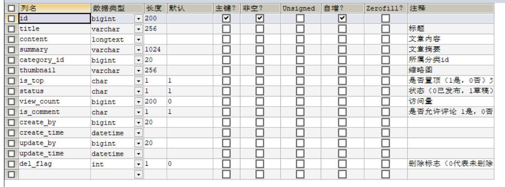

# sql的使用

## 1 关键字的使用


### 1.1 limit和offset的用法 从哪一个索引开始获取？取几条数据?

1.当limit后面跟两个参数的时候，第一个数表示要跳过的数量(或者**从哪一个索引开始获取，第一条的数据为0，不指定的话默认为0)**，后一位表示**要获取的数量**,例如：

```sql
select * from article LIMIT 1,3 # 表示从索引1开始，取3条数据，也就是取2,3,4三条数据
```

------

2.当 limit后面跟一个参数的时候，该参数表示要取的数据的数量：

例如 :

```sql
select * from article LIMIT 3 # 表示直接取前三条数据。相当于 0,3
```

------

3.当 limit和offset组合使用的时候，limit后面只能有一个参数，表示要取的的数量,offset表示要跳过的数量 。

例如:

```sql
select * from article LIMIT 3 OFFSET 1 # 表示跳过1条数据,从第2条数据开始取，取3条数据，也就是取2,3,4三条数据
```

等价于:

```sql
select * from article LIMIT 1,3
```


### 1.2 groub by ... having的使用

大致功能：**group by 字段的含义：把字段值相同的归类为一组，使用Having 对每一组进行遍历然后过滤，留下符合条件的，使用聚合函数对每一组进行相应的计算。**

注意：

group by**会把组变成一行，**前提是group by后面的字段的**值有多个相同，而不是全部不同**，否则group by相当于没写。

1 group by 有一个原则,就是 **select中使用了聚合函数时，select 中没有使用聚合函数的字段,必须出现在 group by 后面**,gruop by 之后直接查询emp_no会默认取非聚合起来的第一条数据（没有意义），或者直接报错。


**where 子句**的作用是在对查询结果进行**分组前**，将不符合where条件的行去掉，即在分组之前过滤数据，条件中**不能包含聚组函数**，使用where条件显示特定的行。

**having 子句**的作用是筛选满足条件的组，即在**分组之后过滤数据**，条件中经常包含聚组函数(可以使用select中聚合字段的别名)，having子句限制的是组，而不是行。where子句中不能**使用聚集函数，而having子句中可以**。

书写顺序：

**select –>from ->where –> group by–> having–>order by->limit**

执行顺序：

**from-where-group by-select(聚合)-having-select（字段）-order by-limit**，所以having可以使用select中聚合字段的别名。

例如：除了02学号的学生之外，查询所有平均分大于60的学生学号和平均成绩

~~~sql
SELECT s.`s_id`,AVG(s.`s_score`) avg_score
FROM score s
WHERE s.`s_id` != '02'
GROUP BY s.`s_id` HAVING avg_score > 60
~~~

### 1.3 Order by desc,asc 设置排序方式

~~~sql
# 16、检索"01"课程分数小于60，按分数降序排列的学生信息

SELECT st.*,sc.`s_score`
FROM score sc INNER JOIN student st
ON sc.`s_id` = st.`s_id`
WHERE sc.`c_id` = '01' AND sc.`s_score` < 60
ORDER BY sc.`s_score` DESC
~~~

### 1.4 with ... as 的使用

如果一整句查询中**多个子查询都需要使用同一个子查询**的结果，那么就可以用with as，将共用的子查询提取出来，加个别名。后面查询语句可以直接用，对于大量复杂的SQL语句起到了很好的优化作用。

- 相当于一个临时表，但是不同于视图，不会存储起来，要与select配合使用。
- 同一个select前可以有多个临时表，写一个with就可以，用逗号隔开，最后一个子查询不用写逗号。
- with子句要用括号括起来。

~~~sql
WITH a AS ( SELECT * FROM category WHERE cname = '家电' ),
b AS ( SELECT * FROM products WHERE pname IN ( '小米电视机', '格力空调' ) ) 
SELECT * 
FROM a	LEFT JOIN b ON a.cid = b.category_id;
~~~

### 1.5 left join、inner join、right join的使用

1.以谁为主表，谁的表的**顺序就不会改变**，并且**完整保留主表**，另一张表没有相应的连接信息时会直接**使用null进行连接**

2.inner join 取两个表的**公共部分**

案例：视频p37  查询所有学生的课程及分数情况（重点）

解法1：以学生为中心

~~~mysql
select st.s_name,c.c_name,sc.s_score
from student st left join score sc on st.s_id = sc.s_id
left join course c on sc.c_id = c.c_id
~~~

解法2：以课程为中心

~~~mysql
-- 子1：查询
select c_id,s_id,s_score,rank() over(PARTITION by c_id order by s_score desc) '排名'
from score sc
-- 结果： 以谁为主表，谁的表的就顺序就不会改变，并且完整保留主表，另一张表没有相应的连接信息时会直接使用null进行连接
-- 缺点：没有选科的学生没有查询出来，因为为了保证顺序，主表不是student
select c.c_name '课程名称',st.s_name '学生姓名',a.s_score '分数'
from
(
	select c_id,s_id,s_score,rank() over(PARTITION by c_id order by s_score desc) '排名'
	from score sc
) a left join student st on st.s_id = a.s_id left join course c on a.c_id = c.c_id

~~~

解法3：一行展示学生的所有成绩

**注意**：主表与其他表之间都有想要查询的字段时，应该**优先从主表中进行查询**，(例如下面的st.s_id与sc.s_id)因为主表中的内容不会被改变，不会突然变为null。

~~~mysql
SELECT st.`s_id` "学号",st.s_name '姓名',
MAX(CASE WHEN sc.`c_id` = '01' THEN sc.`s_score` ELSE NULL END) "语文",
MAX(CASE WHEN sc.`c_id` = '02' THEN sc.`s_score` ELSE NULL END) "数学",
MAX(CASE WHEN sc.`c_id` = '03' THEN sc.`s_score` ELSE NULL END) "英语",
MAX(CASE WHEN sc.`c_id` = '04' THEN sc.`s_score` ELSE NULL END) "化学"
FROM student st LEFT JOIN score sc ON st.`s_id` = sc.`s_id`
GROUP BY st.`s_id`,st.s_name  

-- 使用其他聚合函数:
SELECT st.`s_id` "学号",st.s_name '姓名',
sum(CASE WHEN sc.`c_id` = '01' THEN sc.`s_score` ELSE 0 END) "语文",
min(CASE WHEN sc.`c_id` = '02' THEN sc.`s_score` ELSE NULL END) "数学",
MAX(CASE WHEN sc.`c_id` = '03' THEN sc.`s_score` ELSE NULL END) "英语",
MAX(CASE WHEN sc.`c_id` = '04' THEN sc.`s_score` ELSE NULL END) "化学"
FROM student st LEFT JOIN score sc ON st.`s_id` = sc.`s_id`
GROUP BY st.`s_id`,st.s_name
~~~

### 1.6 distinct的使用


例如：distinct的位置不同

~~~mysql
-- 子1：查询第3名的总分
select distinct sum(s_score) sum_score -- distinct sum(s_score)表示从总分的结果中去重
from score -- sum(distinct s_score)表示计算总分时重复的分数不进行计算
group by s_id
order by sum_score desc
limit 2,1
~~~

再如：distinct去重的字段的选择

视频的p44

~~~mysql
-- 43、统计每门课程的学生选修人数（超过5人的课程才统计）
-- 要求输出课程号和选修人数，查询结果按人数降序排列，若人数相同，按课程号升序排列

select c_id '课程号',count(DISTINCT s_id) '选修人数' -- 根据s_id进行计数并且进行去重，防止遇到重修的情况(可能有一个人选了两次这门课)
from score
group by c_id having 选修人数 > 5
order by 选修人数 desc,c_id asc
~~~

**大表一般用distinct效率不高**，大数据量的时候都禁止用distinct，建议用group by解决重复问题。

在**单表的时候使用distinct**，多表的时候使用group by，虽然一般使用group by ，但还是要知道distinct的用法

### mysql的运算符 <=>,<>

**运算符：!= 和 <>**

- 在[MySQL](https://cloud.tencent.com/product/cdb?from_column=20065&from=20065)中!= 和 <> 的功能一致，在sql92规范中建议是：!=，新的规范中建议为: <>
- is 专门用来判断是否为 NULL，而 = 则是用来判断非NULL以外的所有数据类型使用。而 <=> 则是前两者合起来,既可以判断 非NULL值，也可以用来判断NULL值。

例如：

数据库SQL实战 No. 10

https://www.nowcoder.com/questionTerminal/32c53d06443346f4a2f2ca733c19660c

获取所有非manager的员工emp_no

解法1：使用is成功，使用=失败

~~~mysql
select e.emp_no
from employees e
left join dept_manager d on e.emp_no = d.emp_no
where dept_no is null
~~~


## 2 MySQL 常用内置函数的使用

###【数值函数】

- Abs(X) //绝对值abs(-10.9) = 10
- Format(X，D) //格式化千分位数值format(1234567.456, 2) =1,234,567.46
- Ceil(X) //向上取整ceil(10.1) = 11
- Floor(X) //向下取整floor (10.1) = 10
- Round(X) //四舍五入取整
- Mod(M,N) M%N M MOD N //求余 10%3=1
- Pi() //获得圆周率
- Pow(M,N) //M^N
- Sqrt(X) //算术平方根
- Rand() //随机数
- TRUNCATE(X,D) //截取D位小数

###【时间日期函数】

- Now(),current_timestamp() //获取当前的日期与时间 返回：2023-11-27 04:03:27
- year('2023-10-22') = 2023 // 获取字符串中的年、月 **日期字符串支持下面4种格式**：1.YYYY-MM-DD,2.YYYY/MM/DD,3.YYYYMMDD,4.YYMMDD
- month('2023-10-22') = 10
- day('2023-10-22') = 22
- datediff("2023-11-27","2023-11-26") 返回 1表示第一个日期与第二个日期相差的天数
- week('2021-10-05',1) 获取'2021-10-05'这一天是这一年的第几周，1表示从星期一作为一周的开始
- Current_date(),curdate()  //当前日期
- current_time() //当前时间
- Date(‘yyyy-mm-dd HH;ii:ss’) =  yyyy-mm-dd //获取年月日的日期部分

例如：

~~~mysql
select date(now()) -- 结果：2023-12-29
~~~


- Time(‘yyyy-mm-dd HH;ii:ss’) //获取时间部分
- Date_format(‘yyyy-mm-dd HH;ii:ss’,’%D %y %a %d %m %b %j')
- Unix_timestamp() //获得unix时间戳
- From_unixtime() //从时间戳获得时间

###【字符串函数】

- upper() 使字母全部变为大写
- lower() 使字母全部变为小写
- ASCII(str) //返回字符串str的最左面字符的ASCII代码值.如果str是空字符串,返回0.如果str是NULL,返回NULL.
- LENGTH(string ) //string长度，字节
- CHAR_LENGTH(string) //string的字符个数
- SUBSTRING(str ,position [,length ]) //从str的position开始（从1开始数）,取length个字符

~~~mysql
substring('2023-11-04',6,5) -- 结果：11-04
~~~


- REPLACE(str ,search_str ,replace_str) //在str中用replace_str替换search_str
- INSTR(string ,substring ) //返回substring首次在string中出现的位置
- CONCAT(string [,... ]) //连接字串

~~~mysql
concat('2022-','11-11') -- 结果：2022-11-11
~~~


- CHARSET(str) //返回字串字符集
- LCASE(string ) //转换成小写
- LEFT(string ,length) //从string2中的左边起取length个字符
- LOAD_FILE(file_name) //从文件读取内容
- LOCATE(substring , string [,start_position ]) //同INSTR,但可指定开始位置
- LPAD(string ,length ,pad ) //重复用pad加在string开头,直到字串长度为length
- LTRIM(string ) //去除前端空格
- REPEAT(string ,count ) //重复count次
- RPAD(string ,length ,pad) //在str后用pad补充,直到长度为length
- RTRIM(string ) //去除后端空格
- STRCMP(string1 ,string2 ) //逐字符比较两字串大小
- TRIM(string) //去除前后两端的空格

###【流程函数】

- case when语句的使用

  case when ... then ... else ... end 即: if(...) {...} else {...}


- IF(expr1,expr2,expr3) 双分支。

###【聚合函数】

- Count() **注意：count(null) = 0,count(666) = 1**,检测配合group by或者case when来使用
- Sum()
- Max()
- Min()
- Avg()
- Group_concat()

### 【窗口函数的使用】

窗口函数需要**mysql8.0以上的版本**才能够使用

- row_number() 1234 行数
- dense_rank() 1223  密集的排列    有重复的排名都是rank(), dense:密集的
- rank() 1224  排列

区别：


语法：

1: 完整语法

~~~sql
select rank() over(PARTITION BY ? ORDER BY ? DESC) AS '排名'-- 根据PARTITION BY指定的分组方式，根据order by的字段一组一组的进行排名,单独作为一列来展示数据，命名为'排名'
~~~

2: 不指定PARTITION BY

~~~sql
select rank() over(ORDER BY ? DESC) -- 默认以当前整个表格作为一组进行排名
~~~

注意：？处可以使用聚集函数，但是不能使用聚集函数的别名


## 3 精选sql练习题 DQL 数据查询语言

查询的数据表的位置：本地3307端口的test数据库中 or  docker的mysql容器的test数据库中

### 3.1 创建表法

第一题：视频p4

~~~sql
# 1.查询课程编号为"01“的课程比“02“的课程成绩高的所有学生的学号（重点）
# 创建表法
SELECT a.s_id
FROM (
	# 查询01课程的所有成绩与id
	SELECT s.`s_score`,s.`s_id`
	FROM course c JOIN score s
	ON c.`c_id`=s.`c_id`
	WHERE c.`c_id` = '01'

) a INNER JOIN (
	# 查询02课程的所有成绩与id
	SELECT s.`s_id`,s.`s_score`
	FROM course c JOIN score s
	ON c.`c_id`=s.`c_id`
	WHERE c.`c_id` = '02'
) b ON a.s_id = b.s_id
WHERE a.s_score > b.s_score
~~~

第二题：视频p8

~~~sql
# 查询没学过“张三“老师课的学生的学号、姓名（重点）

# 子1：查询张三老师教的课程id
SELECT c_id
FROM teacher t INNER JOIN course c
ON t.`t_id` = c.`t_id`
WHERE t.`t_name` = '张三'


# 子2：查询选了张三老师教的课程的学生id
SELECT DISTINCT s.s_id
FROM score s
WHERE s.c_id IN (
	SELECT c_id
	FROM teacher t INNER JOIN course c
	ON t.`t_id` = c.`t_id`
	WHERE t.`t_name` = '张三'
)
# 从所有的学生中排除选择了张三老师课的学生，即为没有选择张三老师课程的学生
#(包括：没有选课的学生与选了课但是没有选择张三老师课程的学生)
SELECT st.s_id,st.s_name
FROM student st
WHERE st.s_id NOT IN(
	SELECT DISTINCT s.s_id
	FROM score s
	WHERE s.c_id IN (
		SELECT c_id
		FROM teacher t INNER JOIN course c
		ON t.`t_id` = c.`t_id`
		WHERE t.`t_name` = '张三'
	)
)


~~~

### 3.2 GROUP BY ... HAVING ... 的使用：

p9: 视频中的题目老师理解为：查询学过张三”老师所教的任意一门课的同学的学号、姓名了，下面是我认为的正确理解：

~~~sql
# 查询学过张三老师所教的全部课的同学的学号、姓名（重点）

# 子1：查询张三教的课程的id
SELECT c.`c_id`
FROM teacher t INNER JOIN course c
ON t.`t_id` = c.`t_id`
WHERE t.`t_name` = '张三';

# 子2：查询张三教的课程数量
SELECT COUNT(c.`c_id`)
FROM teacher t INNER JOIN course c
ON t.`t_id` = c.`t_id`
WHERE t.`t_name` = '张三';


# 查询选了张三教的课程的任意一门的同学的信息
SELECT st.*
FROM score sc INNER JOIN student st
ON sc.`s_id` = st.`s_id`
WHERE sc.`c_id` IN (
	SELECT c.`c_id`
	FROM teacher t INNER JOIN course c
	ON t.`t_id` = c.`t_id`
	WHERE t.`t_name` = '张三'
)

# 子3：在所有选了张三老师任意一门课程的学生中查询，选择的数量等于张三老师课程数量的学生的id
SELECT sc.`s_id`
FROM score sc
WHERE sc.`c_id` IN (
	SELECT c.`c_id`
	FROM teacher t INNER JOIN course c
	ON t.`t_id` = c.`t_id`
	WHERE t.`t_name` = '张三'
)
GROUP BY sc.`s_id` HAVING COUNT(sc.`c_id`) = (
	SELECT COUNT(c.`c_id`)
	FROM teacher t INNER JOIN course c
	ON t.`t_id` = c.`t_id`
	WHERE t.`t_name` = '张三'
)
# 结果：
SELECT *
FROM student st
WHERE st.`s_id` IN(
                    SELECT sc.`s_id`
                    FROM score sc
                    WHERE sc.`c_id` IN (
                                        SELECT c.`c_id`
                                        FROM teacher t INNER JOIN course c
                                        ON t.`t_id` = c.`t_id`
                                        WHERE t.`t_name` = '张三'
									)
                    GROUP BY sc.`s_id` HAVING COUNT(sc.`c_id`) = (
                                                                    SELECT COUNT(c.`c_id`)
                                                                    FROM teacher t INNER JOIN course c
                                                                    ON t.`t_id` = c.`t_id`
                                                                    WHERE t.`t_name` = '张三'
															)
				)


~~~

p10  也是group by having搞定，也可以使用创建表法

~~~sql
# 查询学过编号为"01"的课程并且也学过编号为"02"的课程的学生的学号、姓名（重点）

SELECT sc.`s_id`,st.`s_name`
FROM score sc INNER JOIN course c ON sc.`c_id` = c.`c_id`
	      INNER JOIN student st ON st.`s_id` = sc.`s_id` 
WHERE sc.`c_id` IN ('01','02')
GROUP BY sc.`s_id` HAVING COUNT(sc.`c_id`) = 2

~~~

p13 也是group by ... having配合count数量的应用

~~~sql
# p13 查询所有课程的成绩都小于60分的学生的学号与姓名

# 子1：查询至少有一门分数小于60的学生的学号以及课程分数小于60的的课程数量
SELECT s.`s_id`,COUNT(s.`c_id`) cnt
FROM score s
WHERE s.`s_score` < 60
GROUP BY s.`s_id`

# 子2：查询每个学生的学号以及选择的课程数量
SELECT s.`s_id`,COUNT(c_id) cnt
FROM score s
GROUP BY s.`s_id`
# 两个子查询联合起来，即：课程分数小于60的的课程数量 = 选择的课程数量，结果为所有课程的成绩都小于60分的学生
SELECT st.s_id,st.s_name
FROM (
	SELECT s.`s_id`,COUNT(s.`c_id`) cnt
	FROM score s
	WHERE s.`s_score` < 60
	GROUP BY s.`s_id`
) a INNER JOIN (
	SELECT s.`s_id`,COUNT(c_id) cnt
	FROM score s
	GROUP BY s.`s_id`
) b ON a.s_id = b.s_id INNER JOIN student st
ON st.s_id = a.s_id
WHERE a.cnt = b.cnt

~~~

p14与p15 也是group by ... having配合count数量的基本应用

~~~sql
# 10查询没有学全所有课的学生的学号、姓名（重点）
# 1.对立面做法
# 子1：查询所有课程的数量
SELECT COUNT(c.`c_id`)
FROM course c


# 子2：查询选了全部课程的学生的学号

SELECT sc.s_id
FROM score sc
GROUP BY sc.`s_id` HAVING COUNT(sc.`c_id`) = (
	SELECT COUNT(c.`c_id`)
	FROM course c
);

# 结果：
SELECT st.`s_id`,st.`s_name`
FROM student st 
WHERE st.`s_id` NOT IN(
	SELECT sc.s_id
	FROM score sc
	GROUP BY sc.`s_id` HAVING COUNT(sc.`c_id`) = (
		SELECT COUNT(c.`c_id`)
		FROM course c
	)
)

~~~

p18 也是group by ... having配合count数量的基本应用

~~~sql
# 查询和"01”号同学所学课程完全相同的其他同学的学号（重点）

# 子1：查询"01”号同学所学的课程

SELECT sc.`c_id`
FROM score sc
WHERE sc.`s_id` = '01'

# 子2：查询"01”号同学所学的课程的数量

SELECT COUNT(sc.`c_id`)
FROM score sc
WHERE sc.`s_id` = '01'
# 结果：
SELECT sc.`s_id`
FROM score sc
# 查询出课程id = "01”号同学所学的课程id
WHERE sc.`c_id` IN (
	SELECT sc.`c_id`
	FROM score sc
	WHERE sc.`s_id` = '01'
	# 记得排除自己
) AND sc.`s_id` != '01'
GROUP BY sc.`s_id` HAVING COUNT(sc.`c_id`) = (
	SELECT COUNT(sc.`c_id`)
	FROM score sc
	WHERE sc.`s_id` = '01'
)
~~~

p19 也是group by ... having配合count()的基本应用

~~~sql
# p19 15、查询两门及其以上不及格课程的同学的学号，姓名及其平均成绩（重点）

# 子1： 查询两门及其以上不及格课程的同学的学号

SELECT sc.`s_id`
FROM score sc
WHERE sc.`s_score` < 60
GROUP BY sc.`s_id` HAVING COUNT(sc.`c_id`) >=2 
# 结果：
SELECT st.s_id,st.s_name,AVG(sc.`s_score`) avg_score
FROM score sc INNER JOIN student st
ON sc.`s_id` = st.s_id
WHERE st.s_id IN (
	SELECT sc.`s_id`
	FROM score sc
	WHERE sc.`s_score` < 60        # 养成去重好习惯
	GROUP BY sc.`s_id` HAVING COUNT(DISTINCT sc.`c_id`) >=2 
) # 注意GROUP BY 的列与select组的列保持一致
GROUP BY st.s_id,st.s_name
~~~

视频p43:视频中写的复杂了，题目还有歧义，下面的写法更加简单易懂

也是group by ... having 聚合函数的使用

~~~mysql
-- 41.查询课程成绩全部都相同的学生的学生编号、课程编号、学生成绩（重点）

select sc.s_id
from score sc
group by sc.s_id having max(sc.s_score) = min(sc.s_score)

select sc.s_id '学生编号',sc.c_id '课程编号',sc.s_score '学生成绩'
from score sc
where sc.s_id = (
	select sc.s_id
	from score sc
	group by sc.s_id having max(sc.s_score) = min(sc.s_score)
)
~~~


### 3.3 inner join 与 in的效率问题

 inner join写法在数据量大时,**效率比in高**,是否走索引的问题？

p16 

~~~sql
# 11、查询至少有一门课与学号为"01“的学生所学课程相同的学生的学号和姓名（重点）

# 子1：查询学号为"01“的学生的所学课程
SELECT sc.`c_id`
FROM score sc
WHERE sc.`s_id` = '01'

# my写法:感觉不如老师的可读性好
SELECT DISTINCT sc.`s_id`,st.s_name
FROM score sc INNER JOIN student st
ON sc.`s_id` = st.s_id
WHERE sc.`c_id` IN(
	SELECT sc.`c_id`
	FROM score sc
	WHERE sc.`s_id` = '01'
	# 排除自己
) AND sc.`s_id` != '01';

# 老师：in写法
# 子2：查询至少有一门课与学号为"01“的学生所学课程相同的学生的学号
SELECT DISTINCT sc.`s_id`
FROM score sc
WHERE sc.`c_id` IN(
	SELECT sc.`c_id`
	FROM score sc
	WHERE sc.`s_id` = '01'
	# 排除自己
) AND sc.`s_id` != '01'
# 结果：
SELECT st.s_id,st.s_name
FROM student st
WHERE st.s_id IN (
	SELECT DISTINCT sc.`s_id`
	FROM score sc
	WHERE sc.`c_id` IN(
		SELECT sc.`c_id`
		FROM score sc
		WHERE sc.`s_id` = '01'
		# 排除自己
	) AND sc.`s_id` != '01'
)


# 老师：inner join写法(数据量大时,效率比in高)
# 子2：查询至少有一门课与学号为"01“的学生所学课程相同的学生的学号
SELECT DISTINCT sc.`s_id`
FROM score sc
WHERE sc.`c_id` IN(
	SELECT sc.`c_id`
	FROM score sc
	WHERE sc.`s_id` = '01'
	# 排除自己
) AND sc.`s_id` != '01'
# 结果：
SELECT a.s_id,a.s_name
FROM student a INNER JOIN (
	SELECT DISTINCT sc.`s_id`
	FROM score sc
	WHERE sc.`c_id` IN(
		SELECT sc.`c_id`
		FROM score sc
		WHERE sc.`s_id` = '01'
		# 排除自己
	) AND sc.`s_id` != '01'
) b ON a.s_id = b.s_id

~~~

### 3.4 case when语句的使用

在select语句中的case when ... 会在最后查询出来的结果上面占一个字段，一般会起一个别名。

1.**在select中配合聚合函数使用:**

经常**配合sum()**使用来**计算符合某个条件数量**，**sum(case when ... then 1 else 0 end)** 如:

~~~sql
select SUM(CASE WHEN sc.`s_score`>=60 THEN 1 ELSE 0 END)/COUNT(sc.s_id) 及格率
~~~

使用count()来达到同样的效果：**count(case when ... then 666 else null end)**,注意：count(null) = 0

~~~sql
select COUNT(CASE WHEN s.s_score >=70 AND s.s_score < 80 THEN 999 ELSE NULL END)/COUNT(s_id) "中等率",
~~~

具体例子与**执行细节**：

group by sc.`s_id`后，max()函数会对每个分组求最大值，具体流程为：遍历一个分组的每条数据，CASE WHEN sc.`c_id` = '01' THEN sc.`s_score` ELSE NULL END 表示：如果c_id = '01',则记为s_score,否则记为null。遍历结束后，相当于从[s_score,null,null...]中求最大值，结果为s_score,添加到查询结果并且重命名为"语文"。

~~~mysql
SELECT sc.`s_id` "学号",
# 新增一个字段"语文"，if(sc.`c_id` = '01'){字段值 = sc.`s_score`}else{字段值 = null} 由于group by的关系，case when需要写在聚合函数如：Max()中，一条数据的最大值还是自己
MAX(CASE WHEN sc.`c_id` = '01' THEN sc.`s_score` ELSE NULL END) "语文",
MAX(CASE WHEN sc.`c_id` = '02' THEN sc.`s_score` ELSE NULL END) "数学",
MAX(CASE WHEN sc.`c_id` = '03' THEN sc.`s_score` ELSE NULL END) "英语",
MAX(CASE WHEN sc.`c_id` = '04' THEN sc.`s_score` ELSE NULL END) "化学",
AVG(sc.`s_score`) "平均成绩"
# 没有选课的学生，8号查询不出来，学号也会为null
FROM student st LEFT JOIN score sc ON st.`s_id` = sc.`s_id`
GROUP BY sc.`s_id`
ORDER BY AVG(sc.`s_score`) DESC
~~~


2.**在select中不使用聚合函数，直接使用**：

~~~mysql
select *,case when s_id = '01' then 1 else 0 end '标记学号01'
from score 
~~~

**注意**：group by分组后，不使用聚合函数的case when语句仍然对每个组的每条数据进行判断，**但是只会返回每个组的第一条数据**：

如:

~~~mysql
SELECT st.`s_id` "学号",st.s_name '姓名',
CASE WHEN sc.`c_id` = '01' THEN sc.`s_score` ELSE 0 END "语文"
FROM student st LEFT JOIN score sc ON st.`s_id` = sc.`s_id`
GROUP BY st.`s_id`,st.s_name
~~~

mysql设置如果为：sql_mode=only_full_group_by时会**直接报错**。因为c_id不在group by中。

3.**在where子句中使用**

~~~mysql
-- 查询下一个月过生日的学生 在where中使用case when
SELECT *
FROM student -- 如果MONTH(NOW()) = 12则执行where MONTH(s_birth) = 1否则执行where MONTH(s_birth)=MONTH(NOW())+1
WHERE CASE WHEN MONTH(NOW()) = 12 THEN MONTH(s_birth) = 1 
ELSE MONTH(s_birth) = MONTH(NOW()) + 1 END
~~~


p21: case when与聚合函数、group by的使用

~~~sql
# 17、按平均成绩从高到低显示所有学生的所有课程的成绩以及平均成绩（重点）


# 子1：按平均成绩从高到低显示所有学生的平均成绩
SELECT st.`s_id`,AVG(sc.`s_score`) avg_score
FROM student st LEFT JOIN score sc 
ON st.`s_id` = sc.`s_id`
GROUP BY st.`s_id`
ORDER BY avg_score DESC
	
# 解法1：自连接
SELECT sc.`s_id`,sc.`c_id`,sc.`s_score`,a.avg_score
FROM (
	SELECT st.`s_id`,AVG(sc.`s_score`) avg_score
	FROM student st LEFT JOIN score sc 
	ON st.`s_id` = sc.`s_id`
	GROUP BY st.`s_id`
	ORDER BY avg_score DESC
) a LEFT JOIN score sc ON a.s_id = sc.`s_id`

# 解法2：case when ... then ... else ... end

SELECT sc.`s_id` "学号",
# 新增一个字段"语文"，if(sc.`c_id` = '01'){字段值 = sc.`s_score`}else{字段值 = null} 由于group by的关系，case when需要写在聚合函数如：Max()中，一条数据的最大值还是自己
MAX(CASE WHEN sc.`c_id` = '01' THEN sc.`s_score` ELSE NULL END) "语文",
MAX(CASE WHEN sc.`c_id` = '02' THEN sc.`s_score` ELSE NULL END) "数学",
MAX(CASE WHEN sc.`c_id` = '03' THEN sc.`s_score` ELSE NULL END) "英语",
MAX(CASE WHEN sc.`c_id` = '04' THEN sc.`s_score` ELSE NULL END) "化学",
AVG(sc.`s_score`) "平均成绩"
# 没有选课的学生，8号查询不出来，学号也会为null
FROM student st LEFT JOIN score sc ON st.`s_id` = sc.`s_id`
GROUP BY sc.`s_id`
ORDER BY AVG(sc.`s_score`) DESC
~~~

p22: case when与聚合函数、group by的使用

~~~sql
 # 18.查询各科成绩最高分、最低分和平均分：以如下形式显示：
 # 课程ID,课程ame,最高分，最低分，平均分，及格率，中等率，优良率，优秀率
# 及格为>=60，中等为：70-80，优良为：80-90，优秀为：>=90

# 解法1：
SELECT c.`c_name` 课程名称,sc.`c_id` 课程编号,MAX(sc.`s_score`) 最高分,
MIN(sc.`s_score`) 最低分,AVG(sc.`s_score`) 平均分,
#sum(case when ...then 1 else 0 end)进行计数，遍历每一行，如果满足条件就加1，不满足则加0，最后返回结果
SUM(CASE WHEN sc.`s_score`>=60 THEN 1 ELSE 0 END)/COUNT(sc.s_id) 及格率,
SUM(CASE WHEN sc.`s_score` >=70 AND sc.`s_score`<80 THEN 1 ELSE 0 END)/COUNT(sc.s_id) 中等率,
SUM(CASE WHEN sc.`s_score` >= 80 AND sc.`s_score`<90 THEN 1 ELSE 0 END)/COUNT(sc.s_id) 优良率,
SUM(CASE WHEN sc.`s_score` >= 90 THEN 1 ELSE 0 END)/COUNT(sc.s_id) 优秀率
FROM score sc INNER JOIN course c ON sc.`c_id` = c.`c_id`
GROUP BY sc.`c_id`,c.`c_name`
# 解法2：

SELECT c.c_id "课程ID",c.c_name "课程名称",MAX(s.s_score) "最高分",
MIN(s.s_score) "最低分",AVG(s.s_score) "平均分",
SUM(CASE WHEN s.s_score >=60 THEN 1 ELSE 0 END)/COUNT(s_id) "合格率",
# count(null) = 0,count(999) = 1 遍历每一行，如果满足条件则返回999，不满足则返回null，最后返回结果
COUNT(CASE WHEN s.s_score >=70 AND s.s_score < 80 THEN 999 ELSE NULL END)/COUNT(s_id) "中等率",
SUM(CASE WHEN s.s_score >=80 AND s.s_score < 90 THEN 1 ELSE 0 END)/COUNT(s_id) "优良率",
COUNT(CASE WHEN s.s_score >=90 THEN 999 ELSE NULL END)/COUNT(s_id) "优秀率"
FROM score s#sum(case when ...then 1 else 0 end)进行计数，遍历每一行，如果满足条件就加1，不满足则加0，最后返回结果
INNER JOIN 
course c
ON s.c_id = c.c_id
GROUP BY c.c_id,c_name
~~~

p27: case when与聚合函数、group by的使用(注意：group by的使用)

~~~sql
-- 23、使用分段[100-85)，[85-70)，[70-60)，[<60]来统计各科成绩，分别统计各分数段人数：课程ID和课程名称

select sc.c_id,c.c_name,
sum(case when sc.s_score<=100 and sc.s_score > 85 then 1 else 0 end) '[100-85)',
count(case when sc.s_score<=85 and sc.s_score > 70 then -1 else null end) '[85-70)',
sum(case when sc.s_score<=70 and sc.s_score > 60 then 1 else 0 end) '[70-60)',
sum(case when sc.s_score<=60 then 1 else 0 end) '[<60]'
from score sc inner join course c on sc.c_id = c.c_id
GROUP BY sc.c_id,c.c_name
~~~

### 3.5 窗口函数的使用

p23: rank()的基本使用

~~~sql
# -19、按各科成绩进行排序，并显示排名（重点)
# 窗口函数需要mysql8.0以上的版本才能够使用，我这里是5.5.4
SELECT st.s_name '姓名',c.c_name '科目',sc.`s_score` '分数',
rank() over(PARTITION BY sc.c_id ORDER BY sc.s_score DESC) AS '排名'
FROM score sc INNER JOIN course c
ON sc.`c_id` = c.`c_id`
inner join student st on sc.s_id = st.s_id

~~~

p26: 合理选择窗口函数（3选1）解决问题:  DENSE_RANK()的使用

~~~sql
-- 22、查询所有课程的成绩第2名到第3名的学生信息及该课程成绩

-- 子1：查询所有课程的成绩的排名与分数
select sc.c_id,sc.s_id,sc.s_score,DENSE_RANK() over(PARTITION by sc.c_id ORDER BY sc.s_score desc) '排名'
from score sc

-- 粗略的结果：
select a.c_id,a.s_id,a.s_score,a.排名
from (
		select sc.c_id,sc.s_id,sc.s_score,DENSE_RANK() over(PARTITION by sc.c_id 		ORDER BY sc.s_score desc) '排名'
		from score sc
) a
where a.排名 in (2,3)

-- 最终结果：
select c.c_name '课程名称',st.s_name '学生名称',st.s_sex '性别',st.s_birth '出生日期',a.s_score '分数'
from (
		select sc.c_id,sc.s_id,sc.s_score,DENSE_RANK() over(PARTITION by sc.c_id 		ORDER BY sc.s_score desc) '排名'
		from score sc
) a left join student st on a.s_id = st.s_id
left join course c on a.c_id = c.c_id
where a.排名 in (2,3)


~~~

p28: 窗口函数与聚集函数的配合使用，窗口函数的格式，可以不分组

~~~sql
-- 查询学生平均成绩及其名次(重点)
select sc.s_id,avg(sc.s_score) avg_score,
rank() over(order by avg(sc.s_score) desc) '排名'
from score sc
GROUP BY sc.s_id
~~~


### 3.6 经典题目(综合应用)

充分理解题意与考虑罕见的情况：

#### 1 求总分最高的学生信息的及总分

视频讲解：https://www.bilibili.com/video/BV1UH4y1m7uP/?spm_id_from=333.788.recommend_more_video.12&vd_source=d6367c1fc21883823f1fb738f86ef26e

~~~sql
-- 求总分最高的学生信息的及总分(经典)

-- 思路分析: 应该当作总分最高的学生不止一人，先求出总分最高的分数，再查询出分数等于最高总分的学生信息

select st.s_id,st.s_name,st.s_sex,st.s_birth,a.sum_score
from student st right join (
     -- 子2:查询 总分最高的学生id 与 分数
	select sc.s_id,sum(sc.s_score) sum_score
	from score sc
	group by sc.s_id having sum(sc.s_score) = (
                                                     -- 子1:查询 总分最高的分数
                                                    select sum(sc.s_score) sum_score
                                                    from score sc
                                                    group by sc.s_id
                                                    order by sum_score desc
                                                    limit 0,1
											)
						  ) a on a.s_id = st.s_id

~~~

#### 2 求语文单科成绩最高的学生的信息与分数

同理，也是一样的做法（不要认为分数最高永远只有一人即可）:

~~~sql
-- 求语文单科成绩最高的学生的信息与分数

-- 思路：首先求出语文单科的最高分数，然后查询语文分数等于最高分数的学生信息

-- 结果:
select a.s_id '学号',st.s_name '姓名',st.s_sex '性别',st.s_birth '出生日期',a.s_score '分数'
from (
	select sc.s_id,sc.s_score
	from score sc
	where sc.s_score = 
    (
        -- 查询语文单科的最高分数
        select max(sc.s_score) max_score
        from score sc
        where sc.c_id = 
        (
            select c.c_id
            from course c
            where  c.c_name = '语文'
        )
	) 
    and sc.c_id = (
                    select c.c_id
                    from course c
                    where  c.c_name = '语文'
				 ) -- 子3与学生表进行连接
	) a left join student st on a.s_id = st.s_id


~~~

#### 3 求每门课程单科成绩最高的学生的信息与分数

解法1：常规解法

~~~sql
-- 求每门课程单科成绩最高的学生的信息与分数

-- 思路：与求单科类似：首先求出语文单科的最高分数，然后查询语文分数等于最高分数的学生信息，只是数量变多了。
-- 求出每门课程的最高分数，然后查询课程分数等于最高分数的学生信息

-- 结果：查询每门课程的最高分数以及学生的信息
select c.c_name '课程名称',st.s_name '学生姓名',a.max_score '最高分'
from (
         -- 子2: 查询每门课程的最高分数以及学生的id
        select sc.s_id,a.c_id,a.max_score
        from score sc right join (
                                         -- 子1：查询每门课程的最高分数
                                        select sc.c_id,max(sc.s_score) max_score
                                        from score sc
                                        group by sc.c_id 
                                  ) a on sc.c_id = a.c_id and sc.s_score = a.max_score
	) a 
left join student st on a.s_id = st.s_id 
left join course c on a.c_id = c.c_id
~~~

解法2：使用窗口函数

~~~mysql
-- 求每门课程单科成绩最高的学生的信息与分数

-- 写法1：
with temp as
(
    -- 子1：给score表按照c_id进行排名
    select s_id,c_id,s_score,rank() over(PARTITION by c_id order by s_score desc) num
    from score
) 
select c.c_name '课程',st.s_name '姓名',t.s_score '最高分'
from temp t left join student st on t.s_id = st.s_id
left join course c on t.c_id = c.c_id
where t.num = 1

-- 写法1相当于：
select c.c_name '课程',st.s_name '姓名',t.s_score '最高分'
from (
    	-- 子1：给score表按照c_id进行排名
        select s_id,c_id,s_score,rank() over(PARTITION by c_id order by s_score desc) num
        from score
	 ) t 
left join student st on t.s_id = st.s_id
left join course c on t.c_id = c.c_id
where t.num = 1
~~~


#### 4 求总分前3的学生分数与学生姓名(大厂)

写法1：先查询出使用学生的信息，再过滤不需要的信息，一个子查询+join 

~~~mysql
-- 思路：老样子，应该当作总分前3不止3人！查询总分第3的分数，使用 having sum(score) >= 总分第3的分数; 即可过滤出总分前3的学生,最后再连表求其他信息即可。

-- 结果1：
select sc.s_id '学号',st.s_name '姓名',sum(s_score) '总分'
from score sc 
left join student st on sc.s_id = st.s_id
group by sc.s_id,st.s_name having sum(s_score) >= 
(
    -- 子1：查询总分第3的分数
    select distinct sum(s_score) sum_score -- distinct sum(s_score)表示从总分的结果中去重,
    from score 
    group by s_id
    order by sum_score desc
    limit 2,1
)
order by 总分 desc
~~~

写法2：先查出需要的学生id再查询其他信息 ,两个子查询 + join (连接时总分表这边的行数少了很多)

~~~mysql
-- 结果2：
select st.s_name '姓名',a.sum_score '总分数'
from 
(	
    -- 子2：总分前3的学生id与分数
	select sc.s_id,sum(s_score) sum_score
	from score sc
	group by sc.s_id having sum(s_score) >= 
	(
        -- 子1：查询总分第3名的分数
		select sum(s_score) sum_score
		from score
		group by s_id
		order by sum_score desc
		limit 2,1
	)
	order by sum_score desc
) a 
left join student st on a.s_id = st.s_id


~~~


解法2：使用窗口函数

~~~mysql
-- 求总分前3的学生分数与学生姓名

-- 结果：
select st.s_name '姓名',b.sum_score '分数'
from 
(
    -- 子2：根据总分添加排名字段，使用DENSE_RANK，有总分重复时的排名：如： 1 1 1 2 2 3 3 4 4
	select a.s_id,a.sum_score,DENSE_RANK() over(order by a.sum_score desc) '排名'
	from 
	(	
         -- 子1：查询每个学生的总分
		select s_id,sum(s_score) sum_score
		from score
		group by s_id
	) a
) b left join student st on b.s_id = st.s_id
where b.排名 <= 3
~~~

#### 5 查询选修“张三”老师所授课程的学生中成绩最高的学生姓名及其成绩

成绩最高的学生可能不止一个

解法1：join写法 可读性好，写起来方便简洁，效率不如子查询

~~~mysql
-- 查询选修“张三”老师所授课程的学生中成绩最高的学生姓名及其成绩

-- 思路：应当成绩最高的学生不止一个来进行处理，查询出最高分，再根据最高分 与 “张三”老师所授课程 两个条件进行查询

-- join写法 可读性好，写起来方便简洁，效率不如子查询
select st.s_name,c.c_name,sc.s_score
from teacher t 
inner join course c on t.t_id = c.t_id
inner join score sc on sc.c_id = c.c_id
inner join student st on sc.s_id = st.s_id
where t.t_name = '张三' and sc.s_score = 
(
    -- 选修“张三”老师所授课程的学生中成绩最高的分数
	select max(sc.s_score) max_score
	from teacher t 
    inner join course c on t.t_id = c.t_id
	inner join score sc on sc.c_id = c.c_id
	where t.t_name = '张三'
)
~~~

解法2：子查询 + with ... as 写法

~~~mysql
-- temp表存储着 选修“张三”老师所授课程的学生成绩信息
with temp as
(
    select *
    from score sc
    where sc.c_id in
    (
            select c.c_id
            from course c 
            where c.t_id = 
            (
                select t.t_id
                from teacher t
                where t.t_name = '张三'
            ) 
    )
)

select st.s_name '学生姓名',a.s_score '成绩'
from student st 
right join 
(
    -- 查询选修“张三”老师所授课程的学生中成绩最高的学生id及其分数
	select t.s_id,t.s_score
	from temp t
	where t.s_score =
    (
         -- 查询选修“张三”老师所授课程的学生中成绩最高的分数
		select max(s_score) max_score
		from temp t
	)
) a on st.s_id = a.s_id

~~~


#### 01笔试题:

1 有一张会员表（mebmers），表中数据字段如下:`id,name,mobile,score`

解法1：

~~~mysql
-- (1) 查询score第二高的会员

-- 1 查询第二高的分数 (更加通用，查询第三高的分数也可以使用类似的方式)
select score
from mebmers
where score != ( select max(score) from mebmers )
order by score desc
limit 1
-- 或者
select max(score) score
from mebmers m
where m.score != ( select max(score) from mebmers)


-- 2 查询分数等于第二高分数的会员
--       Table字段不能使用MySQL关键字；【如果非要使用这些关键字，则需要在关键前后添加 		 `keyword` 反引号以示区分】
select id,`name`,mobile,score 
from mebmers m
where m.score = (
	    select score
        from mebmers
        where score != ( select max(score) from mebmers )
        order by score desc
        limit 1
)

-- (2) 查询名字包含ben（无论大小写都需要查询出来）的会员信息

select id,`name`,mobile,score
from mebmers m
where UPPER(m.`name`) like '%BEN%' -- 使用 =号 会去寻找 %BEN%这个名字,而不是去模糊匹配

~~~

2 

解法1：

~~~mysql
-- 获取每个部门中当前员工薪水最高的相关信息，给出dept_no,emp_no以及其对应的salary,按照部门编
-- 号dept_no升序排列

-- 结果：在有员工id的表中，通过连表过滤出需要的结果
select t1.dept_no,t2.emp_no,t1.max_salary
from (
			select dept_no,max(salary) max_salary -- 1 查询每个部门中当前在职员工中薪水最高的部门与薪水信息
			from dept_emp d 
			inner join salaries s on d.emp_no = s.emp_no 
			and d.to_date = '9999-01-01' 
			and s.to_date = '9999-01-01'
			GROUP BY d.dept_no
	) t1 
		 inner join (
								 select d.emp_no,d.dept_no,s.salary
								 from dept_emp d
								 inner join salaries s on d.emp_no = s.emp_no
								 and d.to_date = '9999-01-01' 
								 and s.to_date = '9999-01-01'
					) t2
		 on t1.dept_no = t2.dept_no and t1.max_salary = t2.salary
 order by t1.dept_no -- dept_no数据为d001 也能够进行排序
~~~

3

解法1：

~~~mysql
-- 请你查找在职员工自入职以来的薪水涨幅情况，给出在职员工编号emp_no以及其对应的薪水涨幅
-- growth，并按照growth进行升序，

-- 思路：查询 在职员工入职时的薪资表 与 在职员工现在的薪资表进行 相减即可
		 
-- 结果：
select a.emp_no,a.salary - b.salary as growth
from 
(
    -- 查询现在在职员工的薪资
    select emp_no,salary
    from salaries
    where to_date = '9999-01-01'
    
) a inner join 
(
    -- 查询入职时所有员工的薪资
    select e.emp_no,s.salary
    from employees e
    inner join salaries s on e.emp_no = s.emp_no 
    and e.hire_date = s.from_date 
    
) b on a.emp_no = b.emp_no
order by growth asc
~~~


### 3.7 日期时间相关的sql题

视频p47

~~~mysql
-- 46.查询各学生的年龄

select s_name '姓名',s_birth '出生日期',
floor(DATEDIFF(now(),s_birth)/365) '年龄'
from student
~~~

视频p50:

~~~mysql
-- 查询下周过生日的同学 假设当前为2023-11-26号 都没有完美解决
-- 方法1：计算天数的差
select s_name,s_birth
from student 
where DATEDIFF(replace(s_birth,year(s_birth),'2023')),'2023-11-26') >= 7

-- 方法2：计算是否在下一周
select s_name,s_birth
from student
where week(replace(s_birth,year(s_birth),year(date(now()))),1) = week('2023-11-26',1) + 1
~~~

视频p52:

解法1：

~~~mysql
-- 查询下一个月过生日的学生 使用%
SELECT s_name,s_birth
FROM student
WHERE MONTH(s_birth) = (MONTH(NOW()) + 1) % 12
~~~

解法2：

~~~mysql
-- 查询下一个月过生日的学生 在where中使用case when
SELECT *
FROM student
WHERE CASE WHEN MONTH(NOW()) = 12 THEN MONTH(s_birth) = 1 
ELSE MONTH(s_birth) = MONTH(NOW()) + 1 END

~~~

### 牛客数据库sql实战

#### distinct

数据库SQL实战 No.2

链接：https://www.nowcoder.com/questionTerminal/ec1ca44c62c14ceb990c3c40def1ec6c

关键：distinct + limit 直接锁定了排名倒数第三的员工

~~~mysql
-- 查找入职员工时间排名倒数第三的员工所有信息

SELECT * 
FROM employees 
WHERE hire_date = (
                    SELECT DISTINCT hire_date -- 加了distinct去重，会按入职日期进行分组，多个相同入职日期会分为一组
    			   FROM employees 
                    ORDER BY hire_date DESC 
    			   limit 2,1
				 );
-- 或者直接直接分组
SELECT * 
FROM employees 
WHERE hire_date = (
                    SELECT hire_date 
    			   FROM employees 
                    GROUP BY hire_date 
                    ORDER BY hire_date DESC 
                    limit 2,1
   				 )
~~~


数据库SQL实战 No.6

https://www.nowcoder.com/questionTerminal/23142e7a23e4480781a3b978b5e0f33a

查找所有员工入职时候的薪水情况，给出emp_no以及salary， 并按照emp_no进行逆序(请注意，一个员工可能有多次涨薪的情况)

解法1：常规写法

~~~mysql
select e.emp_no, s.salary
from employees e inner join salaries s
on e.hire_date = s.from_date
and e.emp_no = s.emp_no
order by e.emp_no desc;
~~~


解法2：完全不需要employees这个表

~~~mysql
select emp_no,salary from salaries 
group by emp_no having min(from_date) 
order by emp_no DESC
~~~

mark1

下一题no.24：


no.18:请你查找薪水排名第二多的员工编号emp_no、薪水salary、last_name以及first_name，**不能使用order by完成**

链接：https://www.nowcoder.com/questionTerminal/c1472daba75d4635b7f8540b837cc719

解法1：my max() + 子查询

~~~mysql
-- 结果
select a.emp_no,a.salary,e.last_name,e.first_name
from 
(
    -- 查询薪水第二多的员工id与薪水的值
    select emp_no,salary
    from salaries
    where salary = 
    (
        -- 查询薪水第二多的值
        select max(salary)
        from salaries
        where salary !=
            (
                select max(distinct salary)
                from salaries
            )
    )
) a left join employees e on a.emp_no = e.emp_no

~~~

解法2：

~~~mysql
-- 第二种 通用型:可以求任意第几高的工资
select e.emp_no,s.salary,e.last_name,e.first_name
from
employees e
join 
salaries s on e.emp_no=s.emp_no 
and  s.to_date='9999-01-01'
and s.salary = 
(
     select s1.salary
     from 
     salaries s1
     join -- 一个表进行自连接
     salaries s2 on s1.salary <= s2.salary 
     and s1.to_date='9999-01-01' and s2.to_date='9999-01-01'
     group by s1.salary
     having count(distinct s2.salary) = 2 -- 相当于遍历每一个薪资，查找 >= 当前薪资的薪资数量等于2的那一个,就是第二高的工资
 )

~~~


no.19 查找员工编号emp_no为10001其自入职以来的薪水salary

链接：https://www.nowcoder.com/questionTerminal/c727647886004942a89848e2b5130dc2

解法1：路人严谨思路：

~~~mysql
SELECT
( 
    (SELECT salary FROM salaries WHERE emp_no = 10001 ORDER BY to_date DESC LIMIT 1) -
    (SELECT salary FROM salaries WHERE emp_no = 10001 ORDER BY form_date ASC LIMIT 1)
) AS growth

~~~


no23:对所有员工的薪水按照salary降序进行1-N的排名

解法1：窗口函数

~~~mysql
select emp_no,salary,dense_rank() over(order by salary desc) t_rank
from salaries
order by salary desc,emp_no asc
~~~

解法2：自连接

~~~mysql
SELECT s1.emp_no, s1.salary, COUNT(DISTINCT s2.salary) AS rank
FROM salaries AS s1 
inner join salaries AS s2 on s1.salary <= s2.salary
GROUP BY s1.emp_no, s1.salary
ORDER BY s1.salary DESC, s1.emp_no ASC
~~~


## 4 DCL 数据库控制语言

### 4.1 在windows上使用cmd操作数据库：

从0开始，下载mysql，配置环境变量(mysql安装目录下的bin目录)到path中

默认有一个root用户，密码？。

#### 4.1.1 基本命令

连接本地的mysql服务器：		

~~~shell
mysql -u 用户名 -p
~~~

通过`create user`来创建用户并设置密码为123456：

```sql
CREATE USER 用户名 identified by '123456';
```

也可以不带密码：

```sql
CREATE USER 用户名;
```

test@%:我们可以通过@来限制用户登录的登录IP地址，`%`表示匹配所有的IP地址，默认使用的就是任意IP地址。

退出登录命令

~~~sh
exit;
~~~

查看使用的数据库：

~~~sh
show databases;
~~~

#### 4.1.2 权限控制命令

使用**`grant`**来为一个数据库用户进行授权：

```sql
grant all|权限1,权限2...(列1,...) on 数据库.表 to 用户 [with grant option]
```

其中all代表授予所有权限（其实是除了grant option之外），当数据库和表为`*`，代表为所有的数据库和表都授权。如果在最后添加了`with grant option`，那么被授权的用户还能将已获得的授权继续授权给其他用户。

给test用户授予test数据库的所有表的权限：

~~~sql
grant all on test.* to test;
~~~

给test用户授予test数据库的student表的select,和update权限,其中update权限只能更新s_name字段

~~~sql
grant select,update(s_name) on test.student to test;
~~~


我们可以使用`revoke`来收回一个权限：

```sql
revoke all|权限1,权限2...(列1,...) on 数据库.表 from 用户
```

## 5 数据定义语言：DDL

库的操作：

```sql
create,alter,drop

create database if not exists book;

alter database book character set gbk;//修改字符集

drop database if exists book;
```

表的操作：

```sql
create table table_aname(
a int,
b varchar(10),
c double ,
d datatime
)
```

修改表操作：

```sql
alter table 表名 change (column) name1 name2 类型；

alter table 表名 modify (column) name1 新类型;  // change,modify,add,drop,rename to column
```

例如：

~~~mysql
# 给score表添加java字段
alter table score add column java int;
# 删除java字段
alter table score drop column java;
~~~


删除表操作：

```sql
drop table  if exists table_name;
```

## 6 数据操作语言：DML

```sql
insert into table(字段1,字段2,字段3)
values( , , ),( , , ),( , ,);

insert into table_name set '字段1' = ' ','字段2' = ' ',... 

insert into table_name( , , )
select  , , , union
select  , , , union;

UPDATE beatuy
SET boyfriend_id = 2
WHERE boyfriend_id = NULL;

#删除age为1的数据,如果不添加where语句则删除表的全部数据,再次添加数据时自增的id从上一次的id开始而不是从1开始
delete from table_name where age = 1;
truncate table table_name;
```


## 7 数据库字段的设计

数据库的字段类型与java数据类型的对应关系：

1.  bigint -> Long
2. varchar,longtext,char -> String
3. int -> Integer
4. datetime -> Date

如：



~~~java
@Data
@AllArgsConstructor
@NoArgsConstructor
@Accessors(chain = true)//开启链式调用
@TableName("sg_article")
public class Article{
    // 数据库的字段类型与java数据类型的对应关系：
    // bigint -> Long,varchar,longtext,char -> String,int -> Integer,datetime -> Date
    @TableId
    private Long id;
    //标题
    private String title;
    //文章内容
    private String content;
    //文章摘要
    private String summary;
    //所属分类id
    private Long categoryId;
    //缩略图
    private String thumbnail;
    //是否置顶（0否，1是）
    private String isTop;
    //状态（0已发布，1草稿）
    private String status;
    //访问量
    private Long viewCount;
    //是否允许评论 1是，0否
    private String isComment;

    @TableField(fill = FieldFill.INSERT)
    private Long createBy;

    @TableField(fill = FieldFill.INSERT)
    private Date createTime;

    @TableField(fill = FieldFill.INSERT_UPDATE)
    private Long updateBy;

    @TableField(fill = FieldFill.INSERT_UPDATE)
    private Date updateTime;

    //删除标志（0代表未删除，1代表已删除）
    private Integer delFlag;
    //注解表示String categoryName不在数据库表中
    @TableField(exist = false)
    private String categoryName;

    public Article(Long id, Long viewCount) {
        this.id = id;
        this.viewCount = viewCount;
    }
}


~~~

## 8 Bug

### 1 having min() = ?

~~~mysql
  drop table if exists  `employees` ; 
CREATE TABLE `employees` (
`emp_no` int(11) NOT NULL,
`birth_date` date NOT NULL,
`first_name` varchar(14) NOT NULL,
`last_name` varchar(16) NOT NULL,
`gender` char(1) NOT NULL,
`hire_date` date NOT NULL,
PRIMARY KEY (`emp_no`));
INSERT INTO employees VALUES(10001,'1953-09-02','Georgi','Facello','M','1986-06-26');
INSERT INTO employees VALUES(10002,'1964-06-02','Bezalel','Simmel','F','1985-11-21');
INSERT INTO employees VALUES(10003,'1959-12-03','Parto','Bamford','M','1986-08-28');
INSERT INTO employees VALUES(10004,'1954-05-01','Chirstian','Koblick','M','1986-12-01');
INSERT INTO employees VALUES(10005,'1955-01-21','Kyoichi','Maliniak','M','1989-09-12');
INSERT INTO employees VALUES(10006,'1953-04-20','Anneke','Preusig','F','1989-06-02');
INSERT INTO employees VALUES(10007,'1957-05-23','Tzvetan','Zielinski','F','1989-02-10');
INSERT INTO employees VALUES(10008,'1958-02-19','Saniya','Kalloufi','M','1994-09-15');
INSERT INTO employees VALUES(10009,'1952-04-19','Sumant','Peac','F','1985-02-18');
INSERT INTO employees VALUES(10010,'1963-06-01','Duangkaew','Piveteau','F','1989-08-24');
INSERT INTO employees VALUES(10011,'1953-11-07','Mary','Sluis','F','1990-01-22');

  # 查询不出结果,无论判断条件是 =还是!=，HAVING都像失去了效果，因为在having后面使用min()来判断
SELECT
    hire_date
FROM
    employees
GROUP BY
    hire_date
HAVING
    hire_date != MIN(hire_date)
    
   # 正常：
SELECT
    hire_date
FROM
    employees
GROUP BY
    hire_date
HAVING
    hire_date != (
			SELECT MIN(hire_date)
			FROM employees
    )
~~~

