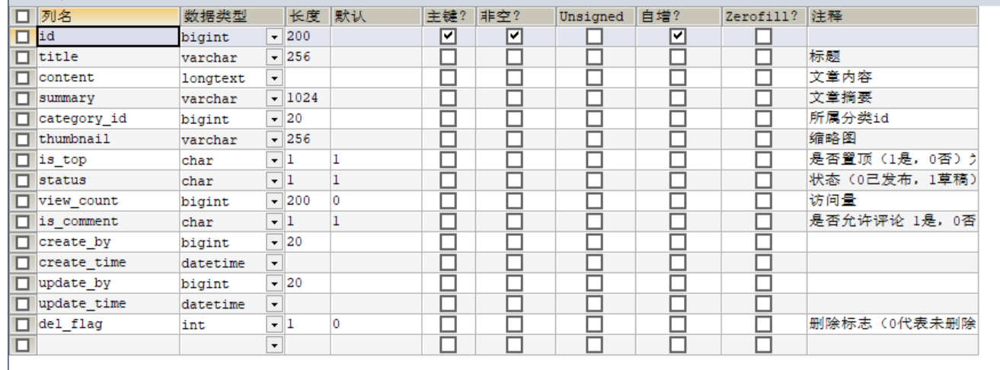

# sql的使用

## 1 关键字的使用


### 1.1 limit和offset的用法 从哪一个索引开始获取？取几条数据?

1.当limit后面跟两个参数的时候，第一个数表示要跳过的数量(或者**从哪一个索引开始获取，第一条的数据为0，不指定的话默认为0)**，后一位表示**要获取的数量**,例如：

```sql
select * from article LIMIT 1,3 # 表示从索引1开始，取3条数据，也就是取2,3,4三条数据
```

------

2.当 limit后面跟一个参数的时候，该参数表示要取的数据的数量：

例如 :

```sql
select * from article LIMIT 3 # 表示直接取前三条数据。相当于 0,3
```

------

3.当 limit和offset组合使用的时候，limit后面只能有一个参数，表示要取的的数量,offset表示要跳过的数量 。

例如:

```sql
select * from article LIMIT 3 OFFSET 1 # 表示跳过1条数据,从第2条数据开始取，取3条数据，也就是取2,3,4三条数据
```

等价于:

```sql
select * from article LIMIT 1,3
```


### 1.2 groub by ... having的使用

大致功能：**group by 字段的含义：把字段值相同的归类为一组，使用Having 对每一组进行遍历然后过滤，留下符合条件的，使用聚合函数对每一组进行相应的计算。**

注意：

group by**会把组变成一行，**前提是group by后面的字段的**值有多个相同，而不是全部不同**，否则group by相当于没写。

1 group by emp_no字段有一个原则,就是 **select中使用了聚合函数时，select 中没有使用聚合函数的字段,必须出现在 group by 后面**,gruop by 之后直接查询emp_no会默认取非聚合起来的第一条数据（没有意义），或者直接报错。


**where 子句**的作用是在对查询结果进行**分组前**，将不符合where条件的行去掉，即在分组之前过滤数据，条件中**不能包含聚组函数**，使用where条件显示特定的行。

**having 子句**的作用是筛选满足条件的组，即在**分组之后过滤数据**，条件中经常包含聚组函数(可以使用select中聚合字段的别名)，having子句限制的是组，而不是行。where子句中不能**使用聚集函数，而having子句中可以**。

书写顺序：

**select –>from ->where –> group by–> having–>order by->limit**

执行顺序：

**from-where-group by-select(聚合)-having-select（字段）-order by-limit**，所以having可以使用select中聚合字段的别名。

例如：除了02学号的学生之外，查询所有平均分大于60的学生学号和平均成绩

~~~sql
SELECT s.`s_id`,AVG(s.`s_score`) avg_score
FROM score s
WHERE s.`s_id` != '02'
GROUP BY s.`s_id` HAVING avg_score > 60
~~~

### 1.3 Order by desc,asc 设置排序方式

~~~sql
# 16、检索"01"课程分数小于60，按分数降序排列的学生信息

SELECT st.*,sc.`s_score`
FROM score sc INNER JOIN student st
ON sc.`s_id` = st.`s_id`
WHERE sc.`c_id` = '01' AND sc.`s_score` < 60
ORDER BY sc.`s_score` DESC
~~~

### 1.4 with ... as 的使用

如果一整句查询中**多个子查询都需要使用同一个子查询**的结果，那么就可以用with as，将共用的子查询提取出来，加个别名。后面查询语句可以直接用，对于大量复杂的SQL语句起到了很好的优化作用。

- 相当于一个临时表，但是不同于视图，不会存储起来，要与select配合使用。
- 同一个select前可以有多个临时表，写一个with就可以，用逗号隔开，最后一个子查询不用写逗号。
- with子句要用括号括起来。

~~~sql
WITH a AS ( SELECT * FROM category WHERE cname = '家电' ),
b AS ( SELECT * FROM products WHERE pname IN ( '小米电视机', '格力空调' ) ) 
SELECT * 
FROM a	LEFT JOIN b ON a.cid = b.category_id;
~~~

### 1.5 left join、inner join、right join的使用

连表的原理：

根据连接条件寻找相应的字段(把表名.字段)连接到表上面。

~~~mysql
select dei.occur_time,dei.handling_time,dei.handling_duration,s1.status_name as exception_type,s2.status_name as exception_status
from device_exception_info dei
inner join status s1 on s1.status_id = dei.exception_type -- dei表中添加了exception_type = status_id的一行s1表的数据，添加的每个字段名为s1.status_id,s1.字段2...
inner join status s2 on s2.status_id = dei.exception_status-- dei表中添加了exception_type = status_id的一行s2表的数据，添加的每个字段名为s2.status_id,s2.字段2...
~~~


1.以谁为主表，谁的表的**顺序就不会改变**，并且**完整保留主表**，另一张表没有相应的连接信息时会直接**使用null进行连接**

2.inner join 取两个表的**公共部分**

案例：视频p37  查询所有学生的课程及分数情况（重点）

解法1：以学生为中心

~~~mysql
select st.s_name,c.c_name,sc.s_score
from student st left join score sc on st.s_id = sc.s_id
left join course c on sc.c_id = c.c_id
~~~

解法2：以课程为中心

~~~mysql
-- 子1：查询
select c_id,s_id,s_score,rank() over(PARTITION by c_id order by s_score desc) '排名'
from score sc
-- 结果： 以谁为主表，谁的表的就顺序就不会改变，并且完整保留主表，另一张表没有相应的连接信息时会直接使用null进行连接
-- 缺点：没有选科的学生没有查询出来，因为为了保证顺序，主表不是student
select c.c_name '课程名称',st.s_name '学生姓名',a.s_score '分数'
from
(
	select c_id,s_id,s_score,rank() over(PARTITION by c_id order by s_score desc) '排名'
	from score sc
) a left join student st on st.s_id = a.s_id left join course c on a.c_id = c.c_id

~~~

解法3：一行展示学生的所有成绩

**注意**：主表与其他表之间都有想要查询的字段时，应该**优先从主表中进行查询**，(例如下面的st.s_id与sc.s_id)因为主表中的内容不会被改变，不会突然变为null。

~~~mysql
SELECT st.`s_id` "学号",st.s_name '姓名',
MAX(CASE WHEN sc.`c_id` = '01' THEN sc.`s_score` ELSE NULL END) "语文",
MAX(CASE WHEN sc.`c_id` = '02' THEN sc.`s_score` ELSE NULL END) "数学",
MAX(CASE WHEN sc.`c_id` = '03' THEN sc.`s_score` ELSE NULL END) "英语",
MAX(CASE WHEN sc.`c_id` = '04' THEN sc.`s_score` ELSE NULL END) "化学"
FROM student st LEFT JOIN score sc ON st.`s_id` = sc.`s_id`
GROUP BY st.`s_id`,st.s_name  

-- 使用其他聚合函数:
SELECT st.`s_id` "学号",st.s_name '姓名',
sum(CASE WHEN sc.`c_id` = '01' THEN sc.`s_score` ELSE 0 END) "语文",
min(CASE WHEN sc.`c_id` = '02' THEN sc.`s_score` ELSE NULL END) "数学",
MAX(CASE WHEN sc.`c_id` = '03' THEN sc.`s_score` ELSE NULL END) "英语",
MAX(CASE WHEN sc.`c_id` = '04' THEN sc.`s_score` ELSE NULL END) "化学"
FROM student st LEFT JOIN score sc ON st.`s_id` = sc.`s_id`
GROUP BY st.`s_id`,st.s_name
~~~

### 1.6 distinct的使用


例如：distinct的位置不同

~~~mysql
-- 子1：查询第3名的总分
select distinct sum(s_score) sum_score -- distinct sum(s_score)表示从总分的结果中去重
from score -- sum(distinct s_score)表示计算总分时重复的分数不进行计算
group by s_id
order by sum_score desc
limit 2,1
~~~

再如：distinct去重的字段的选择

视频的p44

~~~mysql
-- 43、统计每门课程的学生选修人数（超过5人的课程才统计）
-- 要求输出课程号和选修人数，查询结果按人数降序排列，若人数相同，按课程号升序排列

select c_id '课程号',count(DISTINCT s_id) '选修人数' -- 根据s_id进行计数并且进行去重，防止遇到重修的情况(可能有一个人选了两次这门课)
from score
group by c_id having 选修人数 > 5
order by 选修人数 desc,c_id asc
~~~

**大表一般用distinct效率不高**，大数据量的时候都禁止用distinct，建议用group by解决重复问题。

在**单表的时候使用distinct**，多表的时候使用group by，虽然一般使用group by ，但还是要知道distinct的用法

### mysql的运算符 <=>,<>

**运算符：!= 和 <>**

- 在[MySQL](https://cloud.tencent.com/product/cdb?from_column=20065&from=20065)中!= 和 <> 的功能一致，在sql92规范中建议是：!=，新的规范中建议为: <>
- is 专门用来判断是否为 NULL，而 = 则是用来判断非NULL以外的所有数据类型使用。而 <=> 则是前两者合起来,既可以判断 非NULL值，也可以用来判断NULL值。

例如：

数据库SQL实战 No. 10

https://www.nowcoder.com/questionTerminal/32c53d06443346f4a2f2ca733c19660c

获取所有非manager的员工emp_no

解法1：使用is成功，使用=失败

~~~mysql
select e.emp_no
from employees e
left join dept_manager d on e.emp_no = d.emp_no
where dept_no is null
~~~


## 2 MySQL 常用内置函数的使用

### 数值函数】

- Abs(X) //绝对值abs(-10.9) = 10
- Format(X，D) //格式化千分位数值format(1234567.456, 2) =1,234,567.46
- Ceil(X) //向上取整ceil(10.1) = 11
- Floor(X) //向下取整floor (10.1) = 10
- Round(X) //四舍五入取整
- Mod(M,N) M%N M MOD N //求余 10%3=1
- Pi() //获得圆周率
- Pow(M,N) //M^N
- Sqrt(X) //算术平方根
- Rand() //随机数
- TRUNCATE(X,D) //截取D位小数

### 【时间日期函数】

- Now(),current_timestamp() //获取当前的日期与时间 返回：2023-11-27 04:03:27
- year('2023-10-22') = 2023 // 获取字符串中的年、月 **日期字符串支持下面4种格式**：1.YYYY-MM-DD,2.YYYY/MM/DD,3.YYYYMMDD,4.YYMMDD
- month('2023-10-22') = 10
- day('2023-10-22') = 22
- datediff("2023-11-27","2023-11-26") 返回 1表示第一个日期与第二个日期相差的天数
- week('2021-10-05',1) 获取'2021-10-05'这一天是这一年的第几周，1表示从星期一作为一周的开始
- Current_date(),curdate()  //当前日期
- current_time() //当前时间
- Date(‘yyyy-mm-dd HH;ii:ss’) =  yyyy-mm-dd //获取年月日的日期部分

例如：

~~~mysql
select date(now()) -- 结果：2023-12-29
~~~


- Time(‘yyyy-mm-dd HH;ii:ss’) //获取时间部分
- Date_format(‘yyyy-mm-dd HH;ii:ss’,’%D %y %a %d %m %b %j')
- Unix_timestamp() //获得unix时间戳
- From_unixtime() //从时间戳获得时间

###【字符串函数】

- upper() 使字母全部变为大写
- lower() 使字母全部变为小写
- ASCII(str) //返回字符串str的最左面字符的ASCII代码值.如果str是空字符串,返回0.如果str是NULL,返回NULL.
- LENGTH(string ) //string长度，字节
- CHAR_LENGTH(string) //string的字符个数
- SUBSTRING(str ,position [,length ]) //从str的position开始（从1开始数）,取length个字符

~~~mysql
substring('2023-11-04',6,5) -- 结果：11-04
~~~


- REPLACE(str ,search_str ,replace_str) //在str中用replace_str替换search_str
- INSTR(string ,substring ) //返回substring首次在string中出现的位置
- CONCAT(string [,... ]) //连接字串

~~~mysql
concat('2022-','11-11') -- 结果：2022-11-11
~~~


- CHARSET(str) //返回字串字符集
- LCASE(string ) //转换成小写
- LEFT(string ,length) //从string2中的左边起取length个字符
- LOAD_FILE(file_name) //从文件读取内容
- LOCATE(substring , string [,start_position ]) //同INSTR,但可指定开始位置
- LPAD(string ,length ,pad ) //重复用pad加在string开头,直到字串长度为length
- LTRIM(string ) //去除前端空格
- REPEAT(string ,count ) //重复count次
- RPAD(string ,length ,pad) //在str后用pad补充,直到长度为length
- RTRIM(string ) //去除后端空格
- STRCMP(string1 ,string2 ) //逐字符比较两字串大小
- TRIM(string) //去除前后两端的空格

### 【流程函数】

- case when语句的使用

  case when ... then ... else ... end 即: if(...) {...} else {...}


- IF(expr1,expr2,expr3) 双分支。

### 【聚合函数】

- Count() **注意：count(null) = 0,count(666) = 1**,检测配合group by或者case when来使用
- Sum()
- Max()
- Min()
- Avg()
- Group_concat()

### 【窗口函数的使用】

窗口函数需要**mysql8.0以上的版本**才能够使用

- row_number() 1234 行数
- dense_rank() 1223  密集的排列    有重复的排名都是rank(), dense:密集的
- rank() 1224  排列

区别：


语法：

1: 完整语法

~~~sql
select rank() over(PARTITION BY ? ORDER BY ? DESC) AS '排名'-- 根据PARTITION BY指定的分组方式，根据order by的字段一组一组的进行排名,单独作为一列来展示数据，命名为'排名'
~~~

2: 不指定PARTITION BY

~~~sql
select rank() over(ORDER BY ? DESC) -- 默认以当前整个表格作为一组进行排名
~~~

注意：？处可以使用聚集函数，但是不能使用聚集函数的别名


## 3 精选sql练习题 DQL 数据查询语言

查询的数据表的位置：本地3307端口的test数据库中 or  docker的mysql容器的test数据库中

### 3.1 创建表法

第一题：视频p4

~~~sql
# 1.查询课程编号为"01“的课程比“02“的课程成绩高的所有学生的学号（重点）
# 创建表法
SELECT a.s_id
FROM (
	# 查询01课程的所有成绩与id
	SELECT s.`s_score`,s.`s_id`
	FROM course c JOIN score s
	ON c.`c_id`=s.`c_id`
	WHERE c.`c_id` = '01'

) a INNER JOIN (
	# 查询02课程的所有成绩与id
	SELECT s.`s_id`,s.`s_score`
	FROM course c JOIN score s
	ON c.`c_id`=s.`c_id`
	WHERE c.`c_id` = '02'
) b ON a.s_id = b.s_id
WHERE a.s_score > b.s_score
~~~

第二题：视频p8

~~~sql
# 查询没学过“张三“老师课的学生的学号、姓名（重点）

# 子1：查询张三老师教的课程id
SELECT c_id
FROM teacher t INNER JOIN course c
ON t.`t_id` = c.`t_id`
WHERE t.`t_name` = '张三'


# 子2：查询选了张三老师教的课程的学生id
SELECT DISTINCT s.s_id
FROM score s
WHERE s.c_id IN (
	SELECT c_id
	FROM teacher t INNER JOIN course c
	ON t.`t_id` = c.`t_id`
	WHERE t.`t_name` = '张三'
)
# 从所有的学生中排除选择了张三老师课的学生，即为没有选择张三老师课程的学生
#(包括：没有选课的学生与选了课但是没有选择张三老师课程的学生)
SELECT st.s_id,st.s_name
FROM student st
WHERE st.s_id NOT IN(
	SELECT DISTINCT s.s_id
	FROM score s
	WHERE s.c_id IN (
		SELECT c_id
		FROM teacher t INNER JOIN course c
		ON t.`t_id` = c.`t_id`
		WHERE t.`t_name` = '张三'
	)
)


~~~

### 3.2 GROUP BY ... HAVING ... 的使用：

p9: 视频中的题目老师理解为：查询学过张三”老师所教的任意一门课的同学的学号、姓名了，下面是我认为的正确理解：

~~~sql
# 查询学过张三老师所教的全部课的同学的学号、姓名（重点）

# 子1：查询张三教的课程的id
SELECT c.`c_id`
FROM teacher t INNER JOIN course c
ON t.`t_id` = c.`t_id`
WHERE t.`t_name` = '张三';

# 子2：查询张三教的课程数量
SELECT COUNT(c.`c_id`)
FROM teacher t INNER JOIN course c
ON t.`t_id` = c.`t_id`
WHERE t.`t_name` = '张三';


# 查询选了张三教的课程的任意一门的同学的信息
SELECT st.*
FROM score sc INNER JOIN student st
ON sc.`s_id` = st.`s_id`
WHERE sc.`c_id` IN (
	SELECT c.`c_id`
	FROM teacher t INNER JOIN course c
	ON t.`t_id` = c.`t_id`
	WHERE t.`t_name` = '张三'
)

# 子3：在所有选了张三老师任意一门课程的学生中查询，选择的数量等于张三老师课程数量的学生的id
SELECT sc.`s_id`
FROM score sc
WHERE sc.`c_id` IN (
	SELECT c.`c_id`
	FROM teacher t INNER JOIN course c
	ON t.`t_id` = c.`t_id`
	WHERE t.`t_name` = '张三'
)
GROUP BY sc.`s_id` HAVING COUNT(sc.`c_id`) = (
	SELECT COUNT(c.`c_id`)
	FROM teacher t INNER JOIN course c
	ON t.`t_id` = c.`t_id`
	WHERE t.`t_name` = '张三'
)
# 结果：
SELECT *
FROM student st
WHERE st.`s_id` IN(
                    SELECT sc.`s_id`
                    FROM score sc
                    WHERE sc.`c_id` IN (
                                        SELECT c.`c_id`
                                        FROM teacher t INNER JOIN course c
                                        ON t.`t_id` = c.`t_id`
                                        WHERE t.`t_name` = '张三'
									)
                    GROUP BY sc.`s_id` HAVING COUNT(sc.`c_id`) = (
                                                                    SELECT COUNT(c.`c_id`)
                                                                    FROM teacher t INNER JOIN course c
                                                                    ON t.`t_id` = c.`t_id`
                                                                    WHERE t.`t_name` = '张三'
															)
				)


~~~

p10  也是group by having搞定，也可以使用创建表法

~~~sql
# 查询学过编号为"01"的课程并且也学过编号为"02"的课程的学生的学号、姓名（重点）

SELECT sc.`s_id`,st.`s_name`
FROM score sc INNER JOIN course c ON sc.`c_id` = c.`c_id`
	      INNER JOIN student st ON st.`s_id` = sc.`s_id` 
WHERE sc.`c_id` IN ('01','02')
GROUP BY sc.`s_id` HAVING COUNT(sc.`c_id`) = 2

~~~

p13 也是group by ... having配合count数量的应用

~~~sql
# p13 查询所有课程的成绩都小于60分的学生的学号与姓名

# 子1：查询至少有一门分数小于60的学生的学号以及课程分数小于60的的课程数量
SELECT s.`s_id`,COUNT(s.`c_id`) cnt
FROM score s
WHERE s.`s_score` < 60
GROUP BY s.`s_id`

# 子2：查询每个学生的学号以及选择的课程数量
SELECT s.`s_id`,COUNT(c_id) cnt
FROM score s
GROUP BY s.`s_id`
# 两个子查询联合起来，即：课程分数小于60的的课程数量 = 选择的课程数量，结果为所有课程的成绩都小于60分的学生
SELECT st.s_id,st.s_name
FROM (
	SELECT s.`s_id`,COUNT(s.`c_id`) cnt
	FROM score s
	WHERE s.`s_score` < 60
	GROUP BY s.`s_id`
) a INNER JOIN (
	SELECT s.`s_id`,COUNT(c_id) cnt
	FROM score s
	GROUP BY s.`s_id`
) b ON a.s_id = b.s_id INNER JOIN student st
ON st.s_id = a.s_id
WHERE a.cnt = b.cnt

~~~

p14与p15 也是group by ... having配合count数量的基本应用

~~~sql
# 10查询没有学全所有课的学生的学号、姓名（重点）
# 1.对立面做法
# 子1：查询所有课程的数量
SELECT COUNT(c.`c_id`)
FROM course c


# 子2：查询选了全部课程的学生的学号

SELECT sc.s_id
FROM score sc
GROUP BY sc.`s_id` HAVING COUNT(sc.`c_id`) = (
	SELECT COUNT(c.`c_id`)
	FROM course c
);

# 结果：
SELECT st.`s_id`,st.`s_name`
FROM student st 
WHERE st.`s_id` NOT IN(
	SELECT sc.s_id
	FROM score sc
	GROUP BY sc.`s_id` HAVING COUNT(sc.`c_id`) = (
		SELECT COUNT(c.`c_id`)
		FROM course c
	)
)

~~~

p18 也是group by ... having配合count数量的基本应用

~~~sql
# 查询和"01”号同学所学课程完全相同的其他同学的学号（重点）

# 子1：查询"01”号同学所学的课程

SELECT sc.`c_id`
FROM score sc
WHERE sc.`s_id` = '01'

# 子2：查询"01”号同学所学的课程的数量

SELECT COUNT(sc.`c_id`)
FROM score sc
WHERE sc.`s_id` = '01'
# 结果：
SELECT sc.`s_id`
FROM score sc
# 查询出课程id = "01”号同学所学的课程id
WHERE sc.`c_id` IN (
	SELECT sc.`c_id`
	FROM score sc
	WHERE sc.`s_id` = '01'
	# 记得排除自己
) AND sc.`s_id` != '01'
GROUP BY sc.`s_id` HAVING COUNT(sc.`c_id`) = (
	SELECT COUNT(sc.`c_id`)
	FROM score sc
	WHERE sc.`s_id` = '01'
)
~~~

p19 也是group by ... having配合count()的基本应用

~~~sql
# p19 15、查询两门及其以上不及格课程的同学的学号，姓名及其平均成绩（重点）

# 子1： 查询两门及其以上不及格课程的同学的学号

SELECT sc.`s_id`
FROM score sc
WHERE sc.`s_score` < 60
GROUP BY sc.`s_id` HAVING COUNT(sc.`c_id`) >=2 
# 结果：
SELECT st.s_id,st.s_name,AVG(sc.`s_score`) avg_score
FROM score sc INNER JOIN student st
ON sc.`s_id` = st.s_id
WHERE st.s_id IN (
	SELECT sc.`s_id`
	FROM score sc
	WHERE sc.`s_score` < 60        # 养成去重好习惯
	GROUP BY sc.`s_id` HAVING COUNT(DISTINCT sc.`c_id`) >=2 
) # 注意GROUP BY 的列与select组的列保持一致
GROUP BY st.s_id,st.s_name
~~~

视频p43:视频中写的复杂了，题目还有歧义，下面的写法更加简单易懂

也是group by ... having 聚合函数的使用

~~~mysql
-- 41.查询课程成绩全部都相同的学生的学生编号、课程编号、学生成绩（重点）

select sc.s_id
from score sc
group by sc.s_id having max(sc.s_score) = min(sc.s_score)

select sc.s_id '学生编号',sc.c_id '课程编号',sc.s_score '学生成绩'
from score sc
where sc.s_id = (
	select sc.s_id
	from score sc
	group by sc.s_id having max(sc.s_score) = min(sc.s_score)
)
~~~


### 3.3 inner join 与 in的效率问题

 inner join写法在数据量大时,**效率比in高**,是否走索引的问题？

p16 

~~~sql
# 11、查询至少有一门课与学号为"01“的学生所学课程相同的学生的学号和姓名（重点）

# 子1：查询学号为"01“的学生的所学课程
SELECT sc.`c_id`
FROM score sc
WHERE sc.`s_id` = '01'

# my写法:感觉不如老师的可读性好
SELECT DISTINCT sc.`s_id`,st.s_name
FROM score sc INNER JOIN student st
ON sc.`s_id` = st.s_id
WHERE sc.`c_id` IN(
	SELECT sc.`c_id`
	FROM score sc
	WHERE sc.`s_id` = '01'
	# 排除自己
) AND sc.`s_id` != '01';

# 老师：in写法
# 子2：查询至少有一门课与学号为"01“的学生所学课程相同的学生的学号
SELECT DISTINCT sc.`s_id`
FROM score sc
WHERE sc.`c_id` IN(
	SELECT sc.`c_id`
	FROM score sc
	WHERE sc.`s_id` = '01'
	# 排除自己
) AND sc.`s_id` != '01'
# 结果：
SELECT st.s_id,st.s_name
FROM student st
WHERE st.s_id IN (
	SELECT DISTINCT sc.`s_id`
	FROM score sc
	WHERE sc.`c_id` IN(
		SELECT sc.`c_id`
		FROM score sc
		WHERE sc.`s_id` = '01'
		# 排除自己
	) AND sc.`s_id` != '01'
)


# 老师：inner join写法(数据量大时,效率比in高)
# 子2：查询至少有一门课与学号为"01“的学生所学课程相同的学生的学号
SELECT DISTINCT sc.`s_id`
FROM score sc
WHERE sc.`c_id` IN(
	SELECT sc.`c_id`
	FROM score sc
	WHERE sc.`s_id` = '01'
	# 排除自己
) AND sc.`s_id` != '01'
# 结果：
SELECT a.s_id,a.s_name
FROM student a INNER JOIN (
	SELECT DISTINCT sc.`s_id`
	FROM score sc
	WHERE sc.`c_id` IN(
		SELECT sc.`c_id`
		FROM score sc
		WHERE sc.`s_id` = '01'
		# 排除自己
	) AND sc.`s_id` != '01'
) b ON a.s_id = b.s_id

~~~

### 3.4 case when语句的使用

在select语句中的case when ... 会在最后查询出来的结果上面占一个字段，一般会起一个别名。

1.**在select中配合聚合函数使用:**

经常**配合sum()**使用来**计算符合某个条件数量**，**sum(case when ... then 1 else 0 end)** 如:

~~~sql
select SUM(CASE WHEN sc.`s_score`>=60 THEN 1 ELSE 0 END)/COUNT(sc.s_id) 及格率
~~~

使用count()来达到同样的效果：**count(case when ... then 666 else null end)**,注意：count(null) = 0

~~~sql
select COUNT(CASE WHEN s.s_score >=70 AND s.s_score < 80 THEN 999 ELSE NULL END)/COUNT(s_id) "中等率",
~~~

具体例子与**执行细节**：

group by sc.`s_id`后，max()函数会对每个分组求最大值，具体流程为：遍历一个分组的每条数据，CASE WHEN sc.`c_id` = '01' THEN sc.`s_score` ELSE NULL END 表示：如果c_id = '01',则记为s_score,否则记为null。遍历结束后，相当于从[s_score,null,null...]中求最大值，结果为s_score,添加到查询结果并且重命名为"语文"。

~~~mysql
SELECT sc.`s_id` "学号",
# 新增一个字段"语文"，if(sc.`c_id` = '01'){字段值 = sc.`s_score`}else{字段值 = null} 由于group by的关系，case when需要写在聚合函数如：Max()中，一条数据的最大值还是自己
MAX(CASE WHEN sc.`c_id` = '01' THEN sc.`s_score` ELSE NULL END) "语文",
MAX(CASE WHEN sc.`c_id` = '02' THEN sc.`s_score` ELSE NULL END) "数学",
MAX(CASE WHEN sc.`c_id` = '03' THEN sc.`s_score` ELSE NULL END) "英语",
MAX(CASE WHEN sc.`c_id` = '04' THEN sc.`s_score` ELSE NULL END) "化学",
AVG(sc.`s_score`) "平均成绩"
# 没有选课的学生，8号查询不出来，学号也会为null
FROM student st LEFT JOIN score sc ON st.`s_id` = sc.`s_id`
GROUP BY sc.`s_id`
ORDER BY AVG(sc.`s_score`) DESC
~~~


2.**在select中不使用聚合函数，直接使用**：

~~~mysql
select *,case when s_id = '01' then 1 else 0 end '标记学号01'
from score 
~~~

**注意**：group by分组后，不使用聚合函数的case when语句仍然对每个组的每条数据进行判断，**但是只会返回每个组的第一条数据**：

如:

~~~mysql
SELECT st.`s_id` "学号",st.s_name '姓名',
CASE WHEN sc.`c_id` = '01' THEN sc.`s_score` ELSE 0 END "语文"
FROM student st LEFT JOIN score sc ON st.`s_id` = sc.`s_id`
GROUP BY st.`s_id`,st.s_name
~~~

mysql设置如果为：sql_mode=only_full_group_by时会**直接报错**。因为c_id不在group by中。

3.**在where子句中使用**

~~~mysql
-- 查询下一个月过生日的学生 在where中使用case when
SELECT *
FROM student -- 如果MONTH(NOW()) = 12则执行where MONTH(s_birth) = 1否则执行where MONTH(s_birth)=MONTH(NOW())+1
WHERE CASE WHEN MONTH(NOW()) = 12 THEN MONTH(s_birth) = 1 
ELSE MONTH(s_birth) = MONTH(NOW()) + 1 END
~~~


p21: case when与聚合函数、group by的使用

~~~sql
# 17、按平均成绩从高到低显示所有学生的所有课程的成绩以及平均成绩（重点）


# 子1：按平均成绩从高到低显示所有学生的平均成绩
SELECT st.`s_id`,AVG(sc.`s_score`) avg_score
FROM student st LEFT JOIN score sc 
ON st.`s_id` = sc.`s_id`
GROUP BY st.`s_id`
ORDER BY avg_score DESC
	
# 解法1：自连接
SELECT sc.`s_id`,sc.`c_id`,sc.`s_score`,a.avg_score
FROM (
	SELECT st.`s_id`,AVG(sc.`s_score`) avg_score
	FROM student st LEFT JOIN score sc 
	ON st.`s_id` = sc.`s_id`
	GROUP BY st.`s_id`
	ORDER BY avg_score DESC
) a LEFT JOIN score sc ON a.s_id = sc.`s_id`

# 解法2：case when ... then ... else ... end

SELECT sc.`s_id` "学号",
# 新增一个字段"语文"，if(sc.`c_id` = '01'){字段值 = sc.`s_score`}else{字段值 = null} 由于group by的关系，case when需要写在聚合函数如：Max()中，一条数据的最大值还是自己
MAX(CASE WHEN sc.`c_id` = '01' THEN sc.`s_score` ELSE NULL END) "语文",
MAX(CASE WHEN sc.`c_id` = '02' THEN sc.`s_score` ELSE NULL END) "数学",
MAX(CASE WHEN sc.`c_id` = '03' THEN sc.`s_score` ELSE NULL END) "英语",
MAX(CASE WHEN sc.`c_id` = '04' THEN sc.`s_score` ELSE NULL END) "化学",
AVG(sc.`s_score`) "平均成绩"
# 没有选课的学生，8号查询不出来，学号也会为null
FROM student st LEFT JOIN score sc ON st.`s_id` = sc.`s_id`
GROUP BY sc.`s_id`
ORDER BY AVG(sc.`s_score`) DESC
~~~

p22: case when与聚合函数、group by的使用

~~~sql
 # 18.查询各科成绩最高分、最低分和平均分：以如下形式显示：
 # 课程ID,课程ame,最高分，最低分，平均分，及格率，中等率，优良率，优秀率
# 及格为>=60，中等为：70-80，优良为：80-90，优秀为：>=90

# 解法1：
SELECT c.`c_name` 课程名称,sc.`c_id` 课程编号,MAX(sc.`s_score`) 最高分,
MIN(sc.`s_score`) 最低分,AVG(sc.`s_score`) 平均分,
#sum(case when ...then 1 else 0 end)进行计数，遍历每一行，如果满足条件就加1，不满足则加0，最后返回结果
SUM(CASE WHEN sc.`s_score`>=60 THEN 1 ELSE 0 END)/COUNT(sc.s_id) 及格率,
SUM(CASE WHEN sc.`s_score` >=70 AND sc.`s_score`<80 THEN 1 ELSE 0 END)/COUNT(sc.s_id) 中等率,
SUM(CASE WHEN sc.`s_score` >= 80 AND sc.`s_score`<90 THEN 1 ELSE 0 END)/COUNT(sc.s_id) 优良率,
SUM(CASE WHEN sc.`s_score` >= 90 THEN 1 ELSE 0 END)/COUNT(sc.s_id) 优秀率
FROM score sc INNER JOIN course c ON sc.`c_id` = c.`c_id`
GROUP BY sc.`c_id`,c.`c_name`
# 解法2：

SELECT c.c_id "课程ID",c.c_name "课程名称",MAX(s.s_score) "最高分",
MIN(s.s_score) "最低分",AVG(s.s_score) "平均分",
SUM(CASE WHEN s.s_score >=60 THEN 1 ELSE 0 END)/COUNT(s_id) "合格率",
# count(null) = 0,count(999) = 1 遍历每一行，如果满足条件则返回999，不满足则返回null，最后返回结果
COUNT(CASE WHEN s.s_score >=70 AND s.s_score < 80 THEN 999 ELSE NULL END)/COUNT(s_id) "中等率",
SUM(CASE WHEN s.s_score >=80 AND s.s_score < 90 THEN 1 ELSE 0 END)/COUNT(s_id) "优良率",
COUNT(CASE WHEN s.s_score >=90 THEN 999 ELSE NULL END)/COUNT(s_id) "优秀率"
FROM score s#sum(case when ...then 1 else 0 end)进行计数，遍历每一行，如果满足条件就加1，不满足则加0，最后返回结果
INNER JOIN 
course c
ON s.c_id = c.c_id
GROUP BY c.c_id,c_name
~~~

p27: case when与聚合函数、group by的使用(注意：group by的使用)

~~~sql
-- 23、使用分段[100-85)，[85-70)，[70-60)，[<60]来统计各科成绩，分别统计各分数段人数：课程ID和课程名称

select sc.c_id,c.c_name,
sum(case when sc.s_score<=100 and sc.s_score > 85 then 1 else 0 end) '[100-85)',
count(case when sc.s_score<=85 and sc.s_score > 70 then -1 else null end) '[85-70)',
sum(case when sc.s_score<=70 and sc.s_score > 60 then 1 else 0 end) '[70-60)',
sum(case when sc.s_score<=60 then 1 else 0 end) '[<60]'
from score sc inner join course c on sc.c_id = c.c_id
GROUP BY sc.c_id,c.c_name
~~~

### 3.5 窗口函数的使用

p23: rank()的基本使用

~~~sql
# -19、按各科成绩进行排序，并显示排名（重点)
# 窗口函数需要mysql8.0以上的版本才能够使用，我这里是5.5.4
SELECT st.s_name '姓名',c.c_name '科目',sc.`s_score` '分数',
rank() over(PARTITION BY sc.c_id ORDER BY sc.s_score DESC) AS '排名'
FROM score sc INNER JOIN course c
ON sc.`c_id` = c.`c_id`
inner join student st on sc.s_id = st.s_id

~~~

p26: 合理选择窗口函数（3选1）解决问题:  DENSE_RANK()的使用

~~~sql
-- 22、查询所有课程的成绩第2名到第3名的学生信息及该课程成绩

-- 子1：查询所有课程的成绩的排名与分数
select sc.c_id,sc.s_id,sc.s_score,DENSE_RANK() over(PARTITION by sc.c_id ORDER BY sc.s_score desc) '排名'
from score sc

-- 粗略的结果：
select a.c_id,a.s_id,a.s_score,a.排名
from (
		select sc.c_id,sc.s_id,sc.s_score,DENSE_RANK() over(PARTITION by sc.c_id 		ORDER BY sc.s_score desc) '排名'
		from score sc
) a
where a.排名 in (2,3)

-- 最终结果：
select c.c_name '课程名称',st.s_name '学生名称',st.s_sex '性别',st.s_birth '出生日期',a.s_score '分数'
from (
		select sc.c_id,sc.s_id,sc.s_score,DENSE_RANK() over(PARTITION by sc.c_id 		ORDER BY sc.s_score desc) '排名'
		from score sc
) a left join student st on a.s_id = st.s_id
left join course c on a.c_id = c.c_id
where a.排名 in (2,3)


~~~

p28: 窗口函数与聚集函数的配合使用，窗口函数的格式，可以不分组

~~~sql
-- 查询学生平均成绩及其名次(重点)
select sc.s_id,avg(sc.s_score) avg_score,
rank() over(order by avg(sc.s_score) desc) '排名'
from score sc
GROUP BY sc.s_id
~~~


### 3.6 经典题目(综合应用)

充分理解题意与考虑罕见的情况：

#### 1 求总分最高的学生信息的及总分

视频讲解：https://www.bilibili.com/video/BV1UH4y1m7uP/?spm_id_from=333.788.recommend_more_video.12&vd_source=d6367c1fc21883823f1fb738f86ef26e

~~~sql
-- 求总分最高的学生信息的及总分(经典)

-- 思路分析: 应该当作总分最高的学生不止一人，先求出总分最高的分数，再查询出分数等于最高总分的学生信息

select st.s_id,st.s_name,st.s_sex,st.s_birth,a.sum_score
from student st right join (
     -- 子2:查询 总分最高的学生id 与 分数
	select sc.s_id,sum(sc.s_score) sum_score
	from score sc
	group by sc.s_id having sum(sc.s_score) = (
                                                     -- 子1:查询 总分最高的分数
                                                    select sum(sc.s_score) sum_score
                                                    from score sc
                                                    group by sc.s_id
                                                    order by sum_score desc
                                                    limit 0,1
											)
						  ) a on a.s_id = st.s_id

~~~

#### 2 求语文单科成绩最高的学生的信息与分数

同理，也是一样的做法（不要认为分数最高永远只有一人即可）:

~~~sql
-- 求语文单科成绩最高的学生的信息与分数

-- 思路：首先求出语文单科的最高分数，然后查询语文分数等于最高分数的学生信息

-- 结果:
select a.s_id '学号',st.s_name '姓名',st.s_sex '性别',st.s_birth '出生日期',a.s_score '分数'
from (
	select sc.s_id,sc.s_score
	from score sc
	where sc.s_score = 
    (
        -- 查询语文单科的最高分数
        select max(sc.s_score) max_score
        from score sc
        where sc.c_id = 
        (
            select c.c_id
            from course c
            where  c.c_name = '语文'
        )
	) 
    and sc.c_id = (
                    select c.c_id
                    from course c
                    where  c.c_name = '语文'
				 ) -- 子3与学生表进行连接
	) a left join student st on a.s_id = st.s_id


~~~

#### 3 求每门课程单科成绩最高的学生的信息与分数

解法1：常规解法

~~~sql
-- 求每门课程单科成绩最高的学生的信息与分数

-- 思路：与求单科类似：首先求出语文单科的最高分数，然后查询语文分数等于最高分数的学生信息，只是数量变多了。
-- 求出每门课程的最高分数，然后查询课程分数等于最高分数的学生信息

-- 结果：查询每门课程的最高分数以及学生的信息
select c.c_name '课程名称',st.s_name '学生姓名',a.max_score '最高分'
from (
         -- 子2: 查询每门课程的最高分数以及学生的id
        select sc.s_id,a.c_id,a.max_score
        from score sc right join (
                                         -- 子1：查询每门课程的最高分数
                                        select sc.c_id,max(sc.s_score) max_score
                                        from score sc
                                        group by sc.c_id 
                                  ) a on sc.c_id = a.c_id and sc.s_score = a.max_score
	) a 
left join student st on a.s_id = st.s_id 
left join course c on a.c_id = c.c_id
~~~

解法2：使用窗口函数

~~~mysql
-- 求每门课程单科成绩最高的学生的信息与分数

-- 写法1：
with temp as
(
    -- 子1：给score表按照c_id进行排名
    select s_id,c_id,s_score,rank() over(PARTITION by c_id order by s_score desc) num
    from score
) 
select c.c_name '课程',st.s_name '姓名',t.s_score '最高分'
from temp t left join student st on t.s_id = st.s_id
left join course c on t.c_id = c.c_id
where t.num = 1

-- 写法1相当于：
select c.c_name '课程',st.s_name '姓名',t.s_score '最高分'
from (
    	-- 子1：给score表按照c_id进行排名
        select s_id,c_id,s_score,rank() over(PARTITION by c_id order by s_score desc) num
        from score
	 ) t 
left join student st on t.s_id = st.s_id
left join course c on t.c_id = c.c_id
where t.num = 1
~~~


#### 4 求总分前3的学生分数与学生姓名(大厂)

写法1：先查询出使用学生的信息，再过滤不需要的信息，一个子查询+join 

~~~mysql
-- 思路：老样子，应该当作总分前3不止3人！查询总分第3的分数，使用 having sum(score) >= 总分第3的分数; 即可过滤出总分前3的学生,最后再连表求其他信息即可。

-- 结果1：
select sc.s_id '学号',st.s_name '姓名',sum(s_score) '总分'
from score sc 
left join student st on sc.s_id = st.s_id
group by sc.s_id,st.s_name having sum(s_score) >= 
(
    -- 子1：查询总分第3的分数
    select distinct sum(s_score) sum_score -- distinct sum(s_score)表示从总分的结果中去重,
    from score 
    group by s_id
    order by sum_score desc
    limit 2,1
)
order by 总分 desc
~~~

写法2：先查出需要的学生id再查询其他信息 ,两个子查询 + join (连接时总分表这边的行数少了很多)

~~~mysql
-- 结果2：
select st.s_name '姓名',a.sum_score '总分数'
from 
(	
    -- 子2：总分前3的学生id与分数
	select sc.s_id,sum(s_score) sum_score
	from score sc
	group by sc.s_id having sum(s_score) >= 
	(
        -- 子1：查询总分第3名的分数
		select sum(s_score) sum_score
		from score
		group by s_id
		order by sum_score desc
		limit 2,1
	)
	order by sum_score desc
) a 
left join student st on a.s_id = st.s_id


~~~


解法2：使用窗口函数

~~~mysql
-- 求总分前3的学生分数与学生姓名

-- 结果：
select st.s_name '姓名',b.sum_score '分数'
from 
(
    -- 子2：根据总分添加排名字段，使用DENSE_RANK，有总分重复时的排名：如： 1 1 1 2 2 3 3 4 4
	select a.s_id,a.sum_score,DENSE_RANK() over(order by a.sum_score desc) '排名'
	from 
	(	
         -- 子1：查询每个学生的总分
		select s_id,sum(s_score) sum_score
		from score
		group by s_id
	) a
) b left join student st on b.s_id = st.s_id
where b.排名 <= 3
~~~

#### 5 查询选修“张三”老师所授课程的学生中成绩最高的学生姓名及其成绩

成绩最高的学生可能不止一个

解法1：join写法 可读性好，写起来方便简洁，效率不如子查询

~~~mysql
-- 查询选修“张三”老师所授课程的学生中成绩最高的学生姓名及其成绩

-- 思路：应当成绩最高的学生不止一个来进行处理，查询出最高分，再根据最高分 与 “张三”老师所授课程 两个条件进行查询

-- join写法 可读性好，写起来方便简洁，效率不如子查询
select st.s_name,c.c_name,sc.s_score
from teacher t 
inner join course c on t.t_id = c.t_id
inner join score sc on sc.c_id = c.c_id
inner join student st on sc.s_id = st.s_id
where t.t_name = '张三' and sc.s_score = 
(
    -- 选修“张三”老师所授课程的学生中成绩最高的分数
	select max(sc.s_score) max_score
	from teacher t 
    inner join course c on t.t_id = c.t_id
	inner join score sc on sc.c_id = c.c_id
	where t.t_name = '张三'
)
~~~

解法2：子查询 + with ... as 写法

~~~mysql
-- temp表存储着 选修“张三”老师所授课程的学生成绩信息
with temp as
(
    select *
    from score sc
    where sc.c_id in
    (
            select c.c_id
            from course c 
            where c.t_id = 
            (
                select t.t_id
                from teacher t
                where t.t_name = '张三'
            ) 
    )
)

select st.s_name '学生姓名',a.s_score '成绩'
from student st 
right join 
(
    -- 查询选修“张三”老师所授课程的学生中成绩最高的学生id及其分数
	select t.s_id,t.s_score
	from temp t
	where t.s_score =
    (
         -- 查询选修“张三”老师所授课程的学生中成绩最高的分数
		select max(s_score) max_score
		from temp t
	)
) a on st.s_id = a.s_id

~~~


#### 01笔试题:

1 有一张会员表（mebmers），表中数据字段如下:`id,name,mobile,score`

解法1：

~~~mysql
-- (1) 查询score第二高的会员

-- 1 查询第二高的分数 (更加通用，查询第三高的分数也可以使用类似的方式)
select score
from mebmers
where score != ( select max(score) from mebmers )
order by score desc
limit 1
-- 或者
select max(score) score
from mebmers m
where m.score != ( select max(score) from mebmers)


-- 2 查询分数等于第二高分数的会员
--       Table字段不能使用MySQL关键字；【如果非要使用这些关键字，则需要在关键前后添加 		 `keyword` 反引号以示区分】
select id,`name`,mobile,score 
from mebmers m
where m.score = (
	    select score
        from mebmers
        where score != ( select max(score) from mebmers )
        order by score desc
        limit 1
)

-- (2) 查询名字包含ben（无论大小写都需要查询出来）的会员信息

select id,`name`,mobile,score
from mebmers m
where UPPER(m.`name`) like '%BEN%' -- 使用 =号 会去寻找 %BEN%这个名字,而不是去模糊匹配

~~~

2 

解法1：

~~~mysql
-- 获取每个部门中当前员工薪水最高的相关信息，给出dept_no,emp_no以及其对应的salary,按照部门编
-- 号dept_no升序排列

-- 结果：在有员工id的表中，通过连表过滤出需要的结果
select t1.dept_no,t2.emp_no,t1.max_salary
from (
			select dept_no,max(salary) max_salary -- 1 查询每个部门中当前在职员工中薪水最高的部门与薪水信息
			from dept_emp d 
			inner join salaries s on d.emp_no = s.emp_no 
			and d.to_date = '9999-01-01' 
			and s.to_date = '9999-01-01'
			GROUP BY d.dept_no
	) t1 
		 inner join (
								 select d.emp_no,d.dept_no,s.salary
								 from dept_emp d
								 inner join salaries s on d.emp_no = s.emp_no
								 and d.to_date = '9999-01-01' 
								 and s.to_date = '9999-01-01'
					) t2
		 on t1.dept_no = t2.dept_no and t1.max_salary = t2.salary
 order by t1.dept_no -- dept_no数据为d001 也能够进行排序
~~~

3

解法1：

~~~mysql
-- 请你查找在职员工自入职以来的薪水涨幅情况，给出在职员工编号emp_no以及其对应的薪水涨幅
-- growth，并按照growth进行升序，

-- 思路：查询 在职员工入职时的薪资表 与 在职员工现在的薪资表进行 相减即可
		 
-- 结果：
select a.emp_no,a.salary - b.salary as growth
from 
(
    -- 查询现在在职员工的薪资
    select emp_no,salary
    from salaries
    where to_date = '9999-01-01'
    
) a inner join 
(
    -- 查询入职时所有员工的薪资
    select e.emp_no,s.salary
    from employees e
    inner join salaries s on e.emp_no = s.emp_no 
    and e.hire_date = s.from_date 
    
) b on a.emp_no = b.emp_no
order by growth asc
~~~


### 3.7 日期时间相关的sql题

视频p47

~~~mysql
-- 46.查询各学生的年龄

select s_name '姓名',s_birth '出生日期',
floor(DATEDIFF(now(),s_birth)/365) '年龄'
from student
~~~

视频p50:

~~~mysql
-- 查询下周过生日的同学 假设当前为2023-11-26号 都没有完美解决
-- 方法1：计算天数的差
select s_name,s_birth
from student 
where DATEDIFF(replace(s_birth,year(s_birth),'2023')),'2023-11-26') >= 7

-- 方法2：计算是否在下一周
select s_name,s_birth
from student
where week(replace(s_birth,year(s_birth),year(date(now()))),1) = week('2023-11-26',1) + 1
~~~

视频p52:

解法1：

~~~mysql
-- 查询下一个月过生日的学生 使用%
SELECT s_name,s_birth
FROM student
WHERE MONTH(s_birth) = (MONTH(NOW()) + 1) % 12
~~~

解法2：

~~~mysql
-- 查询下一个月过生日的学生 在where中使用case when
SELECT *
FROM student
WHERE CASE WHEN MONTH(NOW()) = 12 THEN MONTH(s_birth) = 1 
ELSE MONTH(s_birth) = MONTH(NOW()) + 1 END

~~~

### 牛客数据库sql实战

#### distinct

数据库SQL实战 No.2

链接：https://www.nowcoder.com/questionTerminal/ec1ca44c62c14ceb990c3c40def1ec6c

关键：distinct + limit 直接锁定了排名倒数第三的员工

~~~mysql
-- 查找入职员工时间排名倒数第三的员工所有信息

SELECT * 
FROM employees 
WHERE hire_date = (
                    SELECT DISTINCT hire_date -- 加了distinct去重，会按入职日期进行分组，多个相同入职日期会分为一组
    			   FROM employees 
                    ORDER BY hire_date DESC 
    			   limit 2,1
				 );
-- 或者直接直接分组
SELECT * 
FROM employees 
WHERE hire_date = (
                    SELECT hire_date 
    			   FROM employees 
                    GROUP BY hire_date 
                    ORDER BY hire_date DESC 
                    limit 2,1
   				 )
~~~


数据库SQL实战 No.6

https://www.nowcoder.com/questionTerminal/23142e7a23e4480781a3b978b5e0f33a

查找所有员工入职时候的薪水情况，给出emp_no以及salary， 并按照emp_no进行逆序(请注意，一个员工可能有多次涨薪的情况)

解法1：常规写法

~~~mysql
select e.emp_no, s.salary
from employees e inner join salaries s
on e.hire_date = s.from_date
and e.emp_no = s.emp_no
order by e.emp_no desc;
~~~


解法2：完全不需要employees这个表

~~~mysql
select emp_no,salary from salaries 
group by emp_no having min(from_date) 
order by emp_no DESC
~~~

mark1

下一题no.24：


no.18:请你查找薪水排名第二多的员工编号emp_no、薪水salary、last_name以及first_name，**不能使用order by完成**

链接：https://www.nowcoder.com/questionTerminal/c1472daba75d4635b7f8540b837cc719

解法1：my max() + 子查询

~~~mysql
-- 结果
select a.emp_no,a.salary,e.last_name,e.first_name
from 
(
    -- 查询薪水第二多的员工id与薪水的值
    select emp_no,salary
    from salaries
    where salary = 
    (
        -- 查询薪水第二多的值
        select max(salary)
        from salaries
        where salary !=
            (
                select max(distinct salary)
                from salaries
            )
    )
) a left join employees e on a.emp_no = e.emp_no

~~~

解法2：

~~~mysql
-- 第二种 通用型:可以求任意第几高的工资
select e.emp_no,s.salary,e.last_name,e.first_name
from
employees e
join 
salaries s on e.emp_no=s.emp_no 
and  s.to_date='9999-01-01'
and s.salary = 
(
     select s1.salary
     from 
     salaries s1
     join -- 一个表进行自连接
     salaries s2 on s1.salary <= s2.salary 
     and s1.to_date='9999-01-01' and s2.to_date='9999-01-01'
     group by s1.salary
     having count(distinct s2.salary) = 2 -- 相当于遍历每一个薪资，查找 >= 当前薪资的薪资数量等于2的那一个,就是第二高的工资
 )

~~~


no.19 查找员工编号emp_no为10001其自入职以来的薪水salary

链接：https://www.nowcoder.com/questionTerminal/c727647886004942a89848e2b5130dc2

解法1：路人严谨思路：

~~~mysql
SELECT
( 
    (SELECT salary FROM salaries WHERE emp_no = 10001 ORDER BY to_date DESC LIMIT 1) -
    (SELECT salary FROM salaries WHERE emp_no = 10001 ORDER BY form_date ASC LIMIT 1)
) AS growth

~~~


no23:对所有员工的薪水按照salary降序进行1-N的排名

解法1：窗口函数

~~~mysql
select emp_no,salary,dense_rank() over(order by salary desc) t_rank
from salaries
order by salary desc,emp_no asc
~~~

解法2：自连接

~~~mysql
SELECT s1.emp_no, s1.salary, COUNT(DISTINCT s2.salary) AS rank
FROM salaries AS s1 
inner join salaries AS s2 on s1.salary <= s2.salary
GROUP BY s1.emp_no, s1.salary
ORDER BY s1.salary DESC, s1.emp_no ASC
~~~


## 4 DCL 数据库控制语言


### 4.1 在windows上使用cmd操作数据库：

从0开始，下载mysql，配置环境变量(mysql安装目录下的bin目录)到path中  或者 每次使用都在mysql的bin目录下面打开cmd

默认有一个root用户，密码？。

#### 4.1.1 基本命令

连接本地的mysql服务器：		

~~~shell
mysql -u 用户名 -p # -h指定主机，默认不写则使用localhost
~~~

通过`create user`来创建用户并设置密码为123456：

```sql
CREATE USER 用户名 identified by '123456';
```

也可以不带密码：

```sql
CREATE USER 用户名;
```

test@%:我们可以通过@来限制用户登录的登录IP地址，`%`表示匹配所有的IP地址，默认使用的就是任意IP地址。

退出登录命令

~~~sh
exit;
~~~

查看使用的数据库：

~~~sh
show databases;
~~~

#### 修改mysql的密码：

参考：https://blog.csdn.net/kq425/article/details/106539972

在mysql5.7的bin目录下面打开cmd:

连接本地的mysql服务器：		

~~~shell
mysql -u 用户名 -p
~~~

修改MySQL5.7版本库的user表

```SQL
UPDATE mysql.user SET authentication_string = PASSWORD("new-password");
FLUSH PRIVILEGES;
```


#### 4.1.2 权限控制命令

使用**`grant`**来为一个数据库用户进行授权：

```sql
grant all|权限1,权限2...(列1,...) on 数据库.表 to 用户 [with grant option]
```

其中all代表授予所有权限（其实是除了grant option之外），当数据库和表为`*`，代表为所有的数据库和表都授权。如果在最后添加了`with grant option`，那么被授权的用户还能将已获得的授权继续授权给其他用户。

给test用户授予test数据库的所有表的权限：

~~~sql
grant all on test.* to test;
~~~

给test用户授予test数据库的student表的select,和update权限,其中update权限只能更新s_name字段

~~~sql
grant select,update(s_name) on test.student to test;
~~~


例子：

~~~mysql
grant all privileges on *.* to root@"%" identified by ".";
~~~

这段代码是一条用于 MySQL 数据库管理系统的 SQL 语句。它的作用是授予某个用户对所有数据库和表的所有权限。具体解释如下：

- `grant all privileges`：授予所有权限。这意味着授予用户对数据库中的所有操作权限，如 SELECT、INSERT、UPDATE、DELETE、CREATE、DROP 等。

- `on *.*`：指定权限的范围。`*.*` 表示所有数据库中的所有表。第一个 `*` 表示所有数据库，第二个 `*` 表示所有表。

- `to root@"%"`：指定授予权限的用户。这里是 `root` 用户，`"%"` 表示该用户可以从任何主机连接到 MySQL 服务器。

- `identified by "."`：指定用户的密码为 `.`。这表示在授予权限时，用户的密码是一个单字符的 `.`。

综上所述，这条语句的作用是：授予 `root` 用户从任何主机连接到 MySQL 服务器时，对所有数据库和表的所有权限，并且这个 `root` 用户的密码是 `.`。


我们可以使用`revoke`来收回一个权限：

```sql
revoke all|权限1,权限2...(列1,...) on 数据库.表 from 用户
```


好的，没有问题。这是一份详细的笔记，记录了在已安装MySQL 5.7的情况下，如何成功安装并配置MySQL 8.0在3308端口作为Windows服务运行的全过程。

---

### 4.2 **Windows下安装MySQL 8.0与5.7共存（使用3308端口），注册成服务**

本笔记旨在记录在一台已运行MySQL 5.7（占用3306端口）的Windows服务器上，添加并配置MySQL 8.0（解压版）在3308端口上运行的完整步骤。

#### **前提条件**
*   操作系统：Windows
*   已有MySQL 5.7作为服务运行在3306端口。
*   MySQL 8.0已解压到指定目录，例如 `E:\mysql_3306\mysql-8.0.30-winx64`。

---

#### **第一步：检查目标端口是否被占用**

在安装前，首先确认3308端口是空闲的。

```powershell
# 在PowerShell或CMD中运行，检查3308端口的监听情况
netstat -ano | findstr ":3308"
```
*   **预期结果**：该命令无任何输出，表示端口未被占用，可以继续。

---

#### **第二步：为MySQL 8.0创建配置文件**

在MySQL 8.0的根目录下 (`E:\mysql_3306\mysql-8.0.30-winx64`) 手动创建一个名为 `my.ini` 的文件，并填入以下内容。

```ini
[mysqld]
# 设置MySQL的安装目录
basedir=E:/mysql_3306/mysql-8.0.30-winx64
# 设置MySQL数据库的数据存放目录
datadir=E:/mysql_3306/mysql-8.0.30-winx64/data
# 设置端口
port=3308
# 服务端使用的字符集默认为UTF8MB4
character-set-server=utf8mb4
# 创建新表时将使用的默认存储引擎
default-storage-engine=INNODB

[mysql]
# 设置MySQL客户端默认字符集
default-character-set=utf8mb4

[client]
# 设置MySQL客户端连接服务端时默认使用的端口
port=3308
# 设置MySQL客户端默认字符集
default-character-set=utf8mb4
```
*   **注释**：此文件是MySQL服务的核心配置，指定了安装路径、数据路径和最重要的**运行端口3308**。

---

#### **第三步：初始化MySQL 8.0数据库**

**重要提示**：此步骤会生成一个临时root密码，请务必留意并复制保存。

1.  **准备工作**：如果 `E:\mysql_3306\mysql-8.0.30-winx64` 目录下已存在 `data` 文件夹，请先**手动将其删除**。

2.  **执行初始化**：打开 **普通的PowerShell或CMD窗口**，进入 `bin` 目录并执行初始化命令。

    ```powershell
    # 切换到MySQL 8.0的bin目录
    cd E:\mysql_3306\mysql-8.0.30-winx64\bin
    
    # 执行初始化命令
    .\mysqld --initialize --console
    ```

3.  **记录临时密码**：命令执行成功后，会在输出日志的末尾找到类似下面的一行，`s+7WiEiiqPow` 就是生成的临时密码。

    ```
    A temporary password is generated for root@localhost: s+7WiEiiqPow
    ```

---

#### **第四步：安装MySQL 8.0为Windows服务**

此步骤必须在**管理员权限**的命令行中执行。

1.  **以管理员身份**打开一个新的PowerShell或CMD窗口。

2.  **执行安装命令**：

    ```powershell
    # 切换到MySQL 8.0的bin目录
    cd E:\mysql_3306\mysql-8.0.30-winx64\bin
    
    # 将MySQL 8.0安装为名为"MySQL8"的服务
    mysqld --install MySQL8
    ```
*   **预期结果**：提示 `Service successfully installed.`

---

#### **第五步：启动MySQL 8.0服务**

继续在**管理员权限**的命令行窗口中执行。

```powershell
# 使用net start命令启动服务
net start MySQL8
```
*   **预期结果**：提示 `MySQL8 服务已经启动成功。`

**下面的可以登录数据库图形界面进行操作：**

---

#### **第六步：登录并修改root密码**

服务已成功运行，最后一步是使用临时密码登录并设置一个新密码。

1.  **登录MySQL**：

    ```powershell
    # 使用root用户登录到3308端口的MySQL实例
    E:\mysql_3306\mysql-8.0.30-winx64\bin\mysql -h 127.0.0.1 -P 3308 -u root -p
    ```
    *   执行后会提示 `Enter password:`，此时输入第三步中记录的临时密码并回车。

2.  **修改密码**：登录成功后，在 `mysql>` 提示符下执行以下SQL命令来修改密码。

    ```sql
    -- 将'YourNewPassword'替换为你的新密码
    -- 使用mysql_native_password是为了兼容一些旧的数据库客户端
    ALTER USER 'root'@'localhost' IDENTIFIED WITH mysql_native_password BY 'YourNewPassword';
    
    -- 刷新权限使密码生效
    FLUSH PRIVILEGES;
    
    -- 退出
    exit;
    ```
*   **注释**：至此，MySQL 8.0已配置完成，可以使用新密码通过3308端口正常访问。


# 查看mysql的版本

您好！您可以通过多种方式查看 MySQL 的版本。下面我将为您介绍几种常用的方法，并以笔记的形式进行总结，方便您后续查阅。

### 方法一：通过命令行（无需登录MySQL）

这是最直接的方法之一。打开您服务器的命令行终端（比如 Windows 的 CMD 或 PowerShell，或者 Linux 的 Terminal），然后输入以下命令：

```bash
mysql --version
```

或者使用缩写形式：

```bash
mysql -V
```

这个命令会直接输出 MySQL 客户端和服务器的版本信息，通常会是类似这样的内容：
`mysql  Ver 8.0.27 for Win64 on x86_64 (MySQL Community Server - GPL)`

### 方法二：登录MySQL后查询

如果您已经登录到 MySQL 的命令行界面，可以使用 SQL 查询语句来获取版本信息。

1.  首先，登录到 MySQL：
    ```bash
    mysql -u [您的用户名] -p
    ```
    执行后，系统会提示您输入密码。

2.  登录成功后，可以执行以下任一命令：

    *   使用 `SELECT` 语句查询版本函数：
        ```sql
        SELECT VERSION();
        ```
    *   查看服务器状态信息，其中也包含版本号：
        ```sql
        STATUS;
        ```
    *   显示所有与版本相关的变量：
        ```sql
        SHOW VARIABLES LIKE '%version%';
        ```
        这个命令会提供更详细的版本信息，包括主版本号、协议版本等。

---

### 总结笔记

**快速查看MySQL版本的方法:**

1.  **命令行（未登录时最快）:**
    *   `mysql --version`
    *   `mysql -V`

2.  **SQL查询（已登录MySQL）:**
    *   `SELECT VERSION();` (最常用)
    *   `STATUS;` (信息更全面)
    *   `SHOW VARIABLES LIKE '%version%';` (查看所有版本相关变量)

3.  **在 C# 代码中获取:**
    *   建立连接后，读取 `MySqlConnection` 对象的 `ServerVersion` 属性。

希望这些信息能帮助到您！如果还有其他问题，请随时提出。


## 5 数据定义语言：DDL

库的操作：

```sql
create,alter,drop

create database if not exists book;

alter database book character set gbk;//修改字符集

drop database if exists book;
```

表的操作：

```sql
create table table_aname(
a int,
b varchar(10),
c double ,
d datatime
)
```

修改表操作：

```sql
alter table 表名 change (column) name1 name2 类型；

alter table 表名 modify (column) name1 新类型;  // change,modify,add,drop,rename to column
```

例如：

~~~mysql
# 给score表添加java字段
alter table score add column java int;
# mysql t
ALTER TABLE tbl_oaex_invoices 
ADD COLUMN testA INT COMMENT '排序号，记录排序位置';
# 删除java字段
alter table score drop column java;
~~~


删除表操作：

```sql
drop table  if exists table_name;
```

## 6 数据操作语言：DML

```sql
insert into table(字段1,字段2,字段3)
values( , , ),( , , ),( , ,);

insert into table_name set '字段1' = ' ','字段2' = ' ',... 

insert into table_name( , , )
select  , , , union
select  , , , union;

UPDATE beatuy
SET boyfriend_id = 2
WHERE boyfriend_id = NULL;

#删除age为1的数据,如果不添加where语句则删除表的全部数据,再次添加数据时自增的id从上一次的id开始而不是从1开始
delete from table_name where age = 1;
truncate table table_name;
```


## 7 数据库字段的设计


## 选择合适的数据类型

### 存储整数

在 MySQL 中，按存储数字的数据类型容量从小到大排序如下：

1. **`BIT(M)`**：每位占用 **1 bit**，用于存储二进制数据，`M` 表示位的数量，最多 64 位（8 字节）。

   bit(5)可以存储多大的数据？`BIT(5)` 可以存储 **5 位**的二进制数据，具体的存储范围为 **0 到 31**。因为 5 位二进制可以表示的最大值是 `2^5 - 1 = 31`。

   详细解释：

   - `BIT(5)` 表示一个 5 位的二进制数。
   - 二进制 5 位的最小值是 `00000`，对应十进制的 `0`。
   - 二进制 5 位的最大值是 `11111`，对应十进制的 `31`。

   因此，`BIT(5)` 可以存储的十进制数据范围是 **0 到 31**。

2. **`TINYINT`**：占用 **1 字节**（8 位）。

   - 有符号范围：`-128` 到 `127`
   - 无符号范围：`0` 到 `255`

3. **`SMALLINT`**：占用 **2 字节**（16 位）。

   - 有符号范围：`-32,768` 到 `32,767`
   - 无符号范围：`0` 到 `65,535`

4. **`MEDIUMINT`**：占用 **3 字节**（24 位）。

   - 有符号范围：`-8,388,608` 到 `8,388,607`
   - 无符号范围：`0` 到 `16,777,215`

5. **`INT` / `INTEGER`**：占用 **4 字节**（32 位）。

   - 有符号范围：`-2,147,483,648` 到 `2,147,483,647`
   - 无符号范围：`0` 到 `4,294,967,295`

6. **`BIGINT`**：占用 **8 字节**（64 位）。

   - 有符号范围：`-9,223,372,036,854,775,808` 到 `9,223,372,036,854,775,807`
   - 无符号范围：`0` 到 `18,446,744,073,709,551,615`

#### 总结顺序：

1. `BIT(M)`（可变，最大 8 字节）
2. `TINYINT`（1 字节）
3. `SMALLINT`（2 字节）
4. `MEDIUMINT`（3 字节）
5. `INT`（4 字节）
6. `BIGINT`（8 字节）


### `VARCHAR(255)`

`VARCHAR(255)` 是 MySQL 中的一种可变长度字符串类型，表示该列可以存储最多 **255 个字符** 的字符串。

#### 详细解释：

1. **`VARCHAR`**：代表可变长度的字符串类型。与 `CHAR` 不同，`VARCHAR` 只占用实际字符所需的空间，并且在每条记录中附带一个额外的字节或两个字节用于记录字符串的长度。

2. **`(255)`**：指定最大字符长度为 255 个字符。`VARCHAR` 的长度范围可以是 0 到 65535（受行大小、编码等限制），但在实际使用中，常用的最大长度是 255，因为超过这个值会存储为 `TEXT` 类型。

#### 存储空间：

- `VARCHAR(255)` 使用的存储空间与实际存储的字符长度有关：
  - **1 字节**用于存储字符串长度信息（如果最大长度小于 255）。
  - 如果字符串使用了多字节字符集（如 UTF-8），每个字符可能占用多个字节。对于 UTF-8，每个字符最多占用 3 字节（4 字节在某些扩展字符集中）。

#### 举例：

- 如果你在 `VARCHAR(255)` 列中存储了 "Hello"（5 个字符），实际存储的是 5 个字符 + 1 字节的长度信息，总共占用 6 字节的存储空间。

#### 注意：

- `VARCHAR(255)` 的长度表示的是字符数，而不是字节数。因此，字符集和编码（如 UTF-8）会影响实际的存储空间。


### 设置utf8字符集

错误现象：https://blog.csdn.net/qq_43747519/article/details/124213384

解决：

~~~mysql
alter table tbl_oaex_invoices convert to character set utf8
~~~

参考：https://www.cnblogs.com/zjfjava/p/6849797.html


完整的sql:

~~~mysql
SET NAMES utf8mb4;
SET FOREIGN_KEY_CHECKS = 0;

-- ----------------------------
-- Table structure for tbl_oaex_invoices
-- ----------------------------
DROP TABLE IF EXISTS `tbl_oaex_invoices`;
CREATE TABLE `tbl_oaex_invoices`  (
  `id` bigint(20) NOT NULL AUTO_INCREMENT COMMENT '主键ID',
  `invoice_type` int(11) NULL DEFAULT NULL COMMENT '发票类型 ( 0-增值税发票 1-火车票 2-出租车发票 3-飞机行程单 4-定额发票 5-发票文件夹\")',
  `invoice_image_ids` varchar(255) CHARACTER SET utf8 COLLATE utf8_general_ci NULL DEFAULT NULL COMMENT '发票图片的id,多个id使用,进行分隔',
  `enclosure_pic_ids` varchar(255) CHARACTER SET utf8 COLLATE utf8_general_ci NULL DEFAULT NULL COMMENT '附件的id,多个id使用,进行分隔',
  `material_type` varchar(20) CHARACTER SET utf8 COLLATE utf8_general_ci NULL DEFAULT NULL COMMENT '发票材料类型（0-电子 1-纸质）',
  `reimbursement_category` int(11) NULL DEFAULT NULL COMMENT '报销分类: 0-差旅报销 1-费用报销 2-物料报销',
  `description` varchar(255) CHARACTER SET utf8 COLLATE utf8_general_ci NULL DEFAULT NULL COMMENT '发票说明',
  `parent_id` bigint(20) NULL DEFAULT NULL COMMENT '上一级id，为null表示是根文件夹',
  `is_over` bit(1) NULL DEFAULT NULL COMMENT '是否完结',
  `create_by` bigint(20) NULL DEFAULT NULL COMMENT '提交人的id',
  `create_at` datetime NULL DEFAULT NULL COMMENT '提交时间',
  `merge_name` varchar(255) CHARACTER SET utf8 COLLATE utf8_general_ci NULL DEFAULT NULL COMMENT '发票文件夹的名称（合并后的名称）',
  `expense_type` varchar(255) CHARACTER SET utf8 COLLATE utf8_general_ci NULL DEFAULT NULL COMMENT '各种报销的费用类型,直接存储中文,如:1.购买固定资产 2.火车',
  `start_location` varchar(100) CHARACTER SET utf8 COLLATE utf8_general_ci NULL DEFAULT NULL COMMENT '出发地点',
  `arrival_location` varchar(100) CHARACTER SET utf8 COLLATE utf8_general_ci NULL DEFAULT NULL COMMENT '到达地点',
  `start_time` datetime NULL DEFAULT NULL COMMENT '出发时间',
  `arrival_time` datetime NULL DEFAULT NULL COMMENT '到达时间',
  `total_money` decimal(10, 2) NULL DEFAULT NULL COMMENT '发票金额（总金额）',
  `travel_number` varchar(255) CHARACTER SET utf8 COLLATE utf8_general_ci NULL DEFAULT NULL COMMENT '车次或航班号',
  `ticket_number` varchar(255) CHARACTER SET utf8 COLLATE utf8_general_ci NULL DEFAULT NULL COMMENT '票号：存储火车票的售票信息（售票码 售票车站信息）或飞机电子客票号码，作为火车票与飞机票的唯一标识',
  `invoice_number` varchar(255) CHARACTER SET utf8 COLLATE utf8_general_ci NULL DEFAULT NULL COMMENT '增值税发票号码',
  `invoice_code` varchar(255) CHARACTER SET utf8 COLLATE utf8_general_ci NULL DEFAULT NULL COMMENT '增值税发票代码',
  PRIMARY KEY (`id`) USING BTREE
) ENGINE = InnoDB AUTO_INCREMENT = 1 CHARACTER SET = utf8 COLLATE = utf8_general_ci ROW_FORMAT = Dynamic;

SET FOREIGN_KEY_CHECKS = 1;

~~~


### 数据库的字段类型与java数据类型的对应关系：

1.  bigint -> Long
2. varchar,longtext,char -> String
3. int -> Integer
4. datetime -> Date

如：



~~~java
@Data
@AllArgsConstructor
@NoArgsConstructor
@Accessors(chain = true)//开启链式调用
@TableName("sg_article")
public class Article{
    // 数据库的字段类型与java数据类型的对应关系：
    // bigint -> Long,varchar,longtext,char -> String,int -> Integer,datetime -> Date
    @TableId
    private Long id;
    //标题
    private String title;
    //文章内容
    private String content;
    //文章摘要
    private String summary;
    //所属分类id
    private Long categoryId;
    //缩略图
    private String thumbnail;
    //是否置顶（0否，1是）
    private String isTop;
    //状态（0已发布，1草稿）
    private String status;
    //访问量
    private Long viewCount;
    //是否允许评论 1是，0否
    private String isComment;

    @TableField(fill = FieldFill.INSERT)
    private Long createBy;

    @TableField(fill = FieldFill.INSERT)
    private Date createTime;

    @TableField(fill = FieldFill.INSERT_UPDATE)
    private Long updateBy;

    @TableField(fill = FieldFill.INSERT_UPDATE)
    private Date updateTime;

    //删除标志（0代表未删除，1代表已删除）
    private Integer delFlag;
    //注解表示String categoryName不在数据库表中
    @TableField(exist = false)
    private String categoryName;

    public Article(Long id, Long viewCount) {
        this.id = id;
        this.viewCount = viewCount;
    }
}


~~~


## 8 Bug

### 1 having min() = ?

~~~mysql
  drop table if exists  `employees` ; 
CREATE TABLE `employees` (
`emp_no` int(11) NOT NULL,
`birth_date` date NOT NULL,
`first_name` varchar(14) NOT NULL,
`last_name` varchar(16) NOT NULL,
`gender` char(1) NOT NULL,
`hire_date` date NOT NULL,
PRIMARY KEY (`emp_no`));
INSERT INTO employees VALUES(10001,'1953-09-02','Georgi','Facello','M','1986-06-26');
INSERT INTO employees VALUES(10002,'1964-06-02','Bezalel','Simmel','F','1985-11-21');
INSERT INTO employees VALUES(10003,'1959-12-03','Parto','Bamford','M','1986-08-28');
INSERT INTO employees VALUES(10004,'1954-05-01','Chirstian','Koblick','M','1986-12-01');
INSERT INTO employees VALUES(10005,'1955-01-21','Kyoichi','Maliniak','M','1989-09-12');
INSERT INTO employees VALUES(10006,'1953-04-20','Anneke','Preusig','F','1989-06-02');
INSERT INTO employees VALUES(10007,'1957-05-23','Tzvetan','Zielinski','F','1989-02-10');
INSERT INTO employees VALUES(10008,'1958-02-19','Saniya','Kalloufi','M','1994-09-15');
INSERT INTO employees VALUES(10009,'1952-04-19','Sumant','Peac','F','1985-02-18');
INSERT INTO employees VALUES(10010,'1963-06-01','Duangkaew','Piveteau','F','1989-08-24');
INSERT INTO employees VALUES(10011,'1953-11-07','Mary','Sluis','F','1990-01-22');

  # 查询不出结果,无论判断条件是 =还是!=，HAVING都像失去了效果，因为在having后面使用min()来判断
SELECT
    hire_date
FROM
    employees
GROUP BY
    hire_date
HAVING
    hire_date != MIN(hire_date)
    
   # 正常：
SELECT
    hire_date
FROM
    employees
GROUP BY
    hire_date
HAVING
    hire_date != (
			SELECT MIN(hire_date)
			FROM employees
    )
~~~


## 九 **MySQL 视图（View）**

**视图**（View）是一个虚拟表，它基于 SQL 查询的结果集，并不会存储数据，而是存储 SQL 查询逻辑。使用视图可以简化查询、提高安全性（限制访问特定列或行），以及提高代码可读性。

------

### **视图的基本语法**

```sql
CREATE VIEW 视图名称 AS
SELECT 查询语句;
```

------

### **示例**

假设有一个 `employees`（员工表）：

```sql
CREATE TABLE employees (
    id INT PRIMARY KEY AUTO_INCREMENT,
    name VARCHAR(50),
    department VARCHAR(50),
    salary DECIMAL(10,2)
);
```

插入一些数据：

```sql
INSERT INTO employees (name, department, salary) VALUES
('张三', '技术部', 8000),
('李四', '市场部', 7500),
('王五', '技术部', 8200),
('赵六', '财务部', 7200);
```

------

### **创建视图**

如果我们只想让管理层看到 `技术部` 的员工信息，可以创建一个 `tech_employees` 视图：

```sql
CREATE VIEW tech_employees AS
SELECT id, name, salary FROM employees WHERE department = '技术部';
```

------

### **使用视图**

我们可以像查询普通表一样查询视图：

```sql
SELECT * FROM tech_employees;
```

返回的结果：

```
+----+------+--------+
| id | name | salary |
+----+------+--------+
| 1  | 张三  | 8000.00 |
| 3  | 王五  | 8200.00 |
+----+------+--------+
```

------

### **修改或删除视图**

**修改视图**

```sql
CREATE OR REPLACE VIEW tech_employees AS
SELECT id, name, department FROM employees WHERE department = '技术部';
```

**删除视图**

```sql
DROP VIEW tech_employees;
```

------

### **总结**

视图适用于简化复杂查询、限制数据访问、提高代码可读性，但由于其本质上是查询的封装，性能可能不如直接查询表。


# 实际使用


# mysql8的json存储与查询


好的，我们来详细探讨一下 MySQL 8 中 JSON 的存储和查询，并提供一个完整的示例。

在 MySQL 8.0 版本中，对 JSON 的支持得到了显著增强，引入了原生的 `JSON` 数据类型和一系列强大的函数，使得在关系型数据库中存储和操作半结构化数据变得非常高效和方便。

### 1. JSON 数据存储

你可以像使用其他数据类型（如 `INT`, `VARCHAR`）一样，在创建表时将列的类型指定为 `JSON`。

**使用 `JSON` 类型的核心优势:**

*   **自动验证:** 当你向 `JSON` 类型的列插入或更新数据时，MySQL 会自动检查其内容是否为合法的 JSON 格式。如果格式不正确，操作会失败并报错。这保证了数据的完整性。
*   **优化存储格式:** JSON 数据不是以传统的纯文本字符串存储的，而是以一种优化的二进制格式进行内部存储。这种格式允许服务器快速地通过键（key）或索引（index）直接访问 JSON 文档中的元素，而无需读取和解析整个文档，大大提高了查询效率。

### 2. JSON 数据查询和操作

MySQL 提供了一套丰富的内置函数和操作符来处理 JSON 数据。

*   **路径表达式 (Path Expressions):** 这是定位 JSON 文档中特定元素的方式。路径以 `$` 符号开头，代表整个 JSON 文档。
    *   `.key_name`: 选择对象中指定键的值。
    *   `[index]`: 选择数组中指定索引的元素 (索引从 0 开始)。
    *   `.*`: 选择一个 JSON 对象中的所有值。
    *   `[*]` : 选择一个 JSON 数组中的所有元素。

*   **常用操作符和函数:**
    *   `->` (列提取操作符): `column->path`，用于提取 JSON 中的值，等同于 `JSON_EXTRACT()` 函数。返回的结果是 JSON 格式的（例如，字符串会带引号）。
    *   `->>` (内联路径操作符): `column->>path`，与 `->` 类似，但它会自动去除结果的引号，将其作为纯字符串返回。这在 `WHERE` 子句或 `ORDER BY` 子句中非常有用。
    *   `JSON_SET(json_doc, path, val, ...)`: 更新或添加值。如果路径已存在，则更新其值；如果不存在，则添加新值。
    *   `JSON_INSERT(json_doc, path, val, ...)`: 插入值。只有当路径不存在时，才会插入新值。
    *   `JSON_REPLACE(json_doc, path, val, ...)`: 替换值。只有当路径存在时，才会替换其值。
    *   `JSON_REMOVE(json_doc, path, ...)`: 删除 JSON 中的一个或多个元素。
    *   `JSON_CONTAINS(target, candidate[, path])`: 判断 `candidate` JSON 是否被 `target` JSON 所包含。常用于检查数组中是否包含某个值。
    *   `JSON_SEARCH(json_doc, one_or_all, search_str, ...)`: 在 JSON 文档中搜索指定的字符串，并返回匹配项的路径。

### 3. 使用示例

下面是一个完整的例子，模拟一个产品信息表，其中产品的规格属性用 JSON 存储。

**步骤 1: 创建一个带有 JSON 列的表**

我们创建一个 `products` 表，其中 `attributes` 列用来存储产品的各种属性。

```sql
CREATE TABLE products (
    id INT AUTO_INCREMENT PRIMARY KEY,
    name VARCHAR(100) NOT NULL,
    attributes JSON,
    INDEX idx_brand ((attributes->>'$.brand')) -- 可以在JSON字段的特定路径上创建索引
);
```
> **注意:** 在上面的例子中，我们在 `attributes` 的 `brand` 字段上创建了一个索引。这要求 `brand` 的值是字符串类型，并且我们使用了 `->>` 操作符来获取未加引号的值。这种索引可以极大地加速基于品牌的查询。

**步骤 2: 插入 JSON 数据**

向 `products` 表中插入几条记录，`attributes` 字段包含了复杂的嵌套对象和数组。

```sql
INSERT INTO products (name, attributes) VALUES
('笔记本电脑', '{
    "brand": "Apple", 
    "model": "MacBook Pro 14", 
    "specs": {"cpu": "M3", "ram_gb": 18, "storage_gb": 512}, 
    "colors": ["深空灰", "银色"]
}'),
('智能手机', '{
    "brand": "Huawei", 
    "model": "Mate 60 Pro", 
    "specs": {"cpu": "Kirin 9000s", "ram_gb": 12, "storage_gb": 512}, 
    "colors": ["黑色", "白色", "绿色"]
}'),
('显示器', '{
    "brand": "Dell", 
    "model": "U2723QE", 
    "size_inch": 27, 
    "ports": ["HDMI", "DP", "USB-C"]
}');
```

**步骤 3: 查询和操作 JSON 数据**

**a) 提取基本信息 (演示 `->` 和 `->>` 的区别)**

查询所有产品的品牌。

```sql
-- 使用 ->，结果是 JSON 字符串，带有引号
SELECT name, attributes->'$.brand' AS brand FROM products;
-- 结果:
-- '笔记本电脑', '"Apple"'
-- '智能手机', '"Huawei"'
-- '显示器', '"Dell"'

-- 使用 ->>，结果是普通字符串，没有引号
SELECT name, attributes->>'$.brand' AS brand FROM products;
-- 结果:
-- '笔记本电脑', 'Apple'
-- '智能手机', 'Huawei'
-- '显示器', 'Dell'
```

**b) 提取嵌套对象的值**

查询笔记本电脑的 CPU 型号和内存大小。

```sql
SELECT 
    name, 
    attributes->>'$.specs.cpu' AS cpu,
    attributes->>'$.specs.ram_gb' AS ram
FROM products 
WHERE name = '笔记本电脑';
-- 结果:
-- '笔记本电脑', 'M3', '18'
```

**c) 在 `WHERE` 子句中使用 JSON 值进行过滤**

查询内存（ram\_gb）大于 16 GB 的产品。

```sql
SELECT name, attributes->>'$.model' as model, attributes->'$.specs.ram_gb' AS ram
FROM products
WHERE CAST(attributes->>'$.specs.ram_gb' AS UNSIGNED) > 16;
```
> **重要提示:** `->>` 提取出的值本质上是字符串。当进行数值比较时，最好使用 `CAST` 函数（如 `CAST(... AS UNSIGNED)` 或 `CAST(... AS DECIMAL)`) 将其显式转换为数字类型，以确保比较的准确性，并能有效利用相关索引。

**d) 查询 JSON 数组中的元素**

查询所有包含“白色”外观选项的商品。

```sql
SELECT name, attributes->>'$.model' AS model
FROM products
WHERE JSON_CONTAINS(attributes->'$.colors', '["白色"]');
-- 结果:
-- '智能手机', 'Mate 60 Pro'
```

**e) 更新 JSON 数据 (`JSON_SET`)**

将笔记本电脑的内存（ram\_gb）升级到 36GB，并添加一个新属性 `on_sale`。

```sql
UPDATE products
SET attributes = JSON_SET(
    attributes, 
    '$.specs.ram_gb', 36,  -- 更新已有路径
    '$.on_sale', true      -- 添加新路径
)
WHERE name = '笔记本电脑';
```

**f) 删除 JSON 中的元素 (`JSON_REMOVE`)**

假设显示器的 `ports` 属性中 "HDMI" 端口描述有误，需要移除。

```sql
-- 首先找到 "HDMI" 在数组中的索引
-- （假设我们已知 HDMI 是第一个，索引为 0）
UPDATE products
SET attributes = JSON_REMOVE(attributes, '$.ports[0]')
WHERE name = '显示器';
```

### 总结

MySQL 8 的原生 `JSON` 支持为处理非结构化或半结构化数据提供了强大的灵活性。它让你能够在保持关系型数据库事务性和一致性的同时，享受到类似 NoSQL 数据库的模式灵活性（Schema Flexibility）。对于需要存储配置信息、用户画像、标签、可变属性等场景，`JSON` 数据类型是一个非常理想的选择。


## Mybatis-Plus或者JPA有对这个json的支持吗，只能写sql语句来实现吗，使用Json存储和添加字段相比有什么大优势

当然，这是一个非常实际且重要的问题。直接写原生 SQL 并不是唯一的方法，现代的 ORM 框架（如 Mybatis-Plus 和 JPA）都提供了不同程度的支持。

我们来分别看一下，并深入探讨 JSON 存储的核心优势。

### Mybatis-Plus (MP) 对 JSON 的支持

Mybatis-Plus 自身是构建在 Mybatis 之上的，它继承了 Mybatis 的所有特性，包括强大的类型处理器（TypeHandler）。因此，MP 对 JSON 的支持非常好，主要通过以下两种方式实现：

**1. 查询：使用 `QueryWrapper` 包装原生 SQL 片段**

对于 JSON 字段的查询条件，因为涉及到 `->`、`->>` 或 `JSON_CONTAINS` 等数据库原生函数，你无法直接使用 MP 提供的 `eq`, `gt` 等方法。但你可以使用 `apply` 方法来无缝嵌入这些 SQL 片段。

**示例：**

假设我们有上一节的 `Product` 实体，我们想查询品牌是 "Apple" 的产品。

```java
// Java 实体类
@Data
@TableName("products")
public class Product {
    private Integer id;
    private String name;
    // 关键点：JSON字段暂时映射为 String
    private String attributes; 
}

// 查询代码
@Autowired
private ProductMapper productMapper;

public List<Product> findByBrand(String brand) {
    QueryWrapper<Product> queryWrapper = new QueryWrapper<>();
    
    // 使用 apply 方法来调用数据库原生函数
    // 'attributes->>"$.brand"' 是 MySQL 8 的 JSON 路径语法
    // {0} 是占位符，防止 SQL 注入
    queryWrapper.apply("attributes->>'$.brand' = {0}", brand);
    
    return productMapper.selectList(queryWrapper);
}
```

**2. 映射：使用自定义 `TypeHandler` 实现自动转换 (推荐)**

每次都手动处理 `String` 类型的 JSON 很麻烦。更好的方式是定义一个 `TypeHandler`，让 Mybatis 在读写数据库时自动完成 **JSON 字符串** 与 **Java 对象** 之间的转换。

好消息是，Mybatis-Plus 已经内置了基于 Jackson 的 `JacksonTypeHandler`，你几乎不需要自己写。

**步骤：**

**a) 添加 Jackson 依赖 (如果项目中没有的话)**

```xml
<dependency>
    <groupId>com.fasterxml.jackson.core</groupId>
    <artifactId>jackson-databind</artifactId>
    <version>2.13.3</version> <!-- 请使用较新版本 -->
</dependency>
```

**b) 创建用于映射 JSON 的 Java DTO**

```java
@Data
public class ProductAttributes {
    private String brand;
    private String model;
    private Specs specs;
    private List<String> colors;
    private Boolean onSale;

    @Data
    public static class Specs {
        private String cpu;
        private Integer ramGb;
        private Integer storageGb;
    }
}
```

**c) 在实体类中指定 `TypeHandler`**

```java
import com.baomidou.mybatisplus.annotation.TableField;
import com.baomidou.mybatisplus.extension.handlers.JacksonTypeHandler;

@Data
@TableName(value = "products", autoResultMap = true) // autoResultMap = true 很重要，它会让 MP 自动处理 TypeHandler
public class Product {
    private Integer id;
    private String name;

    @TableField(typeHandler = JacksonTypeHandler.class) // 声明使用 JacksonTypeHandler
    private ProductAttributes attributes; // 字段类型直接就是我们的 DTO
}
```

**d) 启动类或配置中开启支持**

确保你的 `@MapperScan` 能扫描到 Mapper，并且 MP 的配置是正确的。现在，你可以像操作普通 Java 对象一样操作 `attributes` 字段了，MP 会在背后为你完成所有转换工作！

```java
// 插入/更新时，直接设置对象
Product p = new Product();
p.setName("新产品");
ProductAttributes attrs = new ProductAttributes();
attrs.setBrand("NewBrand");
p.setAttributes(attrs);
productMapper.insert(p); // MP 会自动将 attrs 对象序列化为 JSON 字符串存入数据库

// 查询时，直接获取对象
Product dbProduct = productMapper.selectById(1);
ProductAttributes dbAttrs = dbProduct.getAttributes(); // 直接就是 ProductAttributes 对象
System.out.println(dbAttrs.getBrand()); 
```

### JPA / Hibernate 对 JSON 的支持

JPA 是一个规范，它的实现（如 Hibernate）也提供了对原生 JSON 类型的强大支持。

**1. 映射：使用 `@JdbcTypeCode` (Hibernate 6+) 或自定义 `UserType`**

从 Hibernate 6 开始，支持变得非常简单直接。

```java
import org.hibernate.annotations.JdbcTypeCode;
import org.hibernate.type.SqlTypes;

@Entity
@Table(name = "products")
public class Product {
    @Id
    @GeneratedValue(strategy = GenerationType.IDENTITY)
    private Integer id;
    private String name;

    @JdbcTypeCode(SqlTypes.JSON) // 核心注解：告诉 Hibernate 这个字段要按 JSON 处理
    @Column(columnDefinition = "json") // 告诉数据库这是 JSON 类型
    private ProductAttributes attributes; 
    
    // Getters and Setters...
}
```
有了这个配置，Hibernate 会自动使用 Jackson (如果它在 classpath 中) 来做序列化和反序列化，体验和 MP 的 `TypeHandler` 非常相似。

**2. 查询：使用 `function` 调用原生函数 或 写 Native Query**

JPQL (JPA Query Language) 是平台无关的，所以它没有 `->>` 这样的操作符。但你可以通过 `function()` 来调用数据库的原生函数。

```java
// 在你的 JpaRepository 中
public interface ProductRepository extends JpaRepository<Product, Integer> {

    // 使用 JPQL 的 function()
    @Query("SELECT p FROM Product p WHERE function('JSON_EXTRACT', p.attributes, '$.brand') = :brand")
    List<Product> findByBrandWithJpqlFunction(@Param("brand") String brand);

    // 或者直接写原生 SQL 查询
    @Query(value = "SELECT * FROM products WHERE attributes->>'$.brand' = :brand", nativeQuery = true)
    List<Product> findByBrandWithNativeQuery(@Param("brand") String brand);
}
```
`function()` 的方式更受推荐，因为它比完全原生的 SQL 稍微多了一层抽象。

---

### JSON 存储 vs 添加新字段的核心优势

这是一个架构选择问题，两者各有优劣。

**JSON 字段的核心优势在于 “灵活性” 和 “开发效率”：**

1.  **极高的灵活性 (Schema on Read):** 这是最大的优势。假设你的产品属性一开始只有品牌和型号。后来，业务要求增加内存、CPU、颜色等。再后来，某些产品有“尺寸”，另一些有“端口类型”。
    *   **JSON 方案:** 你只需要修改你的 Java DTO (`ProductAttributes`) 并重新部署应用即可。**数据库表结构完全不需要动 (`ALTER TABLE`)**。这对于快速迭代的业务和避免数据库锁表、迁移风险至关重要。
    *   **传统字段方案:** 每增加一个新属性，你就需要执行 `ALTER TABLE products ADD COLUMN ...`。这会涉及数据库部署、数据迁移脚本，流程更重，尤其是在大型系统中。

2.  **避免稀疏列 (Sparse Columns):** 如果你有几十个可能的属性，但每个产品只用到其中的几个，传统方案会导致表里有很多 `NULL` 值。这不仅浪费空间（虽然 `NULL` 占空间小），也让表结构显得臃肿。JSON 将所有这些可变、可选的属性聚合在一个字段里，结构更紧凑。

3.  **开发模型更贴近:** 在代码中，这些属性本来就是一个内聚的对象 (`ProductAttributes`)。将它整体映射到一个 JSON 字段，比将它的每个属性拆分到不同的列中，更能反映业务对象的本来面貌。

**然而，JSON 也有需要权衡的劣势：**

*   **查询复杂性:** `WHERE attributes->>'$.brand' = 'Apple'` 比 `WHERE brand = 'Apple'` 更复杂，也更容易出错。
*   **数据库强制约束变弱:** 你无法在数据库层面为 JSON 内部的某个字段（如 `ram_gb`）设置 `NOT NULL` 约束或外键。这些数据一致性的校验责任更多地转移到了应用层。
*   **索引性能:** 虽然 MySQL 8 可以在 JSON 路径上创建索引，但对于频繁用作查询、过滤、排序和连接的核心字段，将其作为顶级列并建立传统索引，性能通常会更好。

**最佳实践和结论：**

通常采用一种**混合模式 (Hybrid Model)**：

*   **用传统字段存储:** 那些**稳定、核心、几乎所有记录都有、且经常用于查询过滤 (`WHERE`)、排序 (`ORDER BY`) 或连接 (`JOIN`)** 的属性。例如 `id`, `name`, `price`, `category_id`，甚至 `brand`（如果品牌是非常核心的查询条件）。
*   **用 JSON 字段存储:** 那些**不固定、多变、不同记录间差异很大、或者嵌套层次很深**的描述性属性。例如 `specs` (规格), `options` (选项), `tags` (标签), `features` (特性列表) 等。

这样，你既能享受到关系型数据库的严谨和高性能，又能获得 JSON 带来的灵活性和开发便利。


# 设计竖向拓展的数据库表：数据库设计模式:事件溯源（Event Sourcing）或活动流（Activity Stream）

~~~
-- 请基于下面我提供的表结构来进行改造,使用类似status的方式来改造数据库表,比如:用一个字段 opt_type表示操作类型: 0：空 1：分闸申请  2：分闸完成  3：降弓  4：挂杆  5：放电  6：登记  7：销记  8：进出门  9：摘杆  10：供电申请  11：供电完成,再添加time时间字段和people人员字段,每进行一个流程,比如进行登记后,添加一条opt_type = 6,time = 当前时间 (在这里的意思就是登记时间),people = 当前人员(在这里的意思就是登记人员)的数据即可,其他的字段也是这样子time和people的意思会根据opt_type的不同而不同,但是一个流程要保证他们可以联系起来,可以被当做一个整体查询出来形成报表.
~~~


好的，我完全理解您的设计思路。您希望将所有离散的操作步骤统一记录成一个标准的“事件流”或“操作日志”，而不是为每个步骤创建固定的字段。

这是一种非常灵活和现代的设计模式，通常被称为**事件溯源（Event Sourcing）**或**活动流（Activity Stream）**。它的核心优势在于：

*   **极高的灵活性**：未来如果业务流程增加或修改，比如在“断电完成”和“降弓”之间增加一个“安全检查”步骤，我们只需要定义一个新的 `opt_type` 即可，无需修改数据库表结构。
*   **完整的审计追踪**：每一项操作都被完整、原子地记录下来，非常便于审计、回溯和故障排查。

根据您的这个思路，并结合之前讨论的业务细节（如一个操作可能涉及监护员等多人），我对您提供的表结构进行了改造。

我们只需要两张核心业务表：`work_orders`（作业工单主表）和 `operation_logs`（操作日志表），再加上一张 `employees`（员工表）来管理人员信息。

---

### 优化后的数据库表设计（事件流模式）

#### 1. `employees` (员工表)
这张表是基础，用于统一管理人员信息，方便在日志中引用。

```sql
DROP TABLE IF EXISTS employees;
CREATE TABLE employees (
    id INT PRIMARY KEY AUTO_INCREMENT COMMENT '员工ID',
    employee_no VARCHAR(100) UNIQUE COMMENT '员工工号',
    name VARCHAR(100) NOT NULL COMMENT '员工姓名',
    department VARCHAR(100) COMMENT '所属部门'
) COMMENT '员工信息表';
```

#### 2. `work_orders` (作业工单表)
这张表作为“作业”的实体，聚合了一次完整作业流程中的所有日志。它存储的是整个作业期间不变的信息。

```sql
DROP TABLE IF EXISTS work_orders;
CREATE TABLE work_orders (
    id BIGINT PRIMARY KEY AUTO_INCREMENT COMMENT '作业工单ID',
    track_info VARCHAR(100) NOT NULL COMMENT '股道(列位)',
    trainset_no VARCHAR(50) COMMENT '车组号',
    operation_date DATE NOT NULL COMMENT '作业日期',
    status VARCHAR(50) NOT NULL COMMENT '当前工单状态',
    remarks TEXT COMMENT '备注',
    created_at TIMESTAMP DEFAULT CURRENT_TIMESTAMP COMMENT '创建时间',
    updated_at TIMESTAMP DEFAULT CURRENT_TIMESTAMP ON UPDATE CURRENT_TIMESTAMP COMMENT '更新时间'
) COMMENT '作业工单主表';
```
**说明**:
*   我仍然保留了 `operation_date` 和 `status` 字段。`operation_date` 是报表要求的业务日期。`status` 字段能极大地简化查询，让您能快速筛选出处于特定状态（如“断电完成，待登顶”）的工单，而无需每次都扫描分析日志表，这是非常重要的性能优化。

#### 3. `operation_logs` (操作日志表) - **核心改造**
这张表是您设计的精髓所在。它用统一的结构记录下每一次操作事件。

```sql
DROP TABLE IF EXISTS operation_logs;
CREATE TABLE operation_logs (
    id BIGINT PRIMARY KEY AUTO_INCREMENT COMMENT '日志ID',
    work_order_id BIGINT NOT NULL COMMENT '关联的作业工单ID',
    
    -- 核心字段，定义了操作的类型
    opt_type INT NOT NULL COMMENT '操作类型 (1:断电申请, 2:断电操作完成, 3:降弓确认, 4:车组放电, 5:登顶登记, 6:下顶销记, 7:供电申请, 8:供电操作完成, 9:领用作业牌, 10:归还作业牌)',
    
    -- 核心字段，记录操作发生的时间
    operation_time DATETIME NOT NULL COMMENT '操作时间',
    
    -- 核心字段，记录主要操作人
    employee_id INT NOT NULL COMMENT '主要操作人ID',
    
    -- 辅助字段，用于记录监护员、确认人等第二相关人
    secondary_employee_id INT COMMENT '次要操作人ID (如监护员)',
    
    -- 辅助字段，用于存储额外信息，如卡号
    details VARCHAR(255) COMMENT '详情备注 (如作业牌卡号)',
    
    FOREIGN KEY (work_order_id) REFERENCES work_orders(id),
    FOREIGN KEY (employee_id) REFERENCES employees(id),
    FOREIGN KEY (secondary_employee_id) REFERENCES employees(id)
) COMMENT '统一操作日志表';

```

**这张表是如何工作的？**

*   **关联性**：所有属于同一次作业的日志，都有相同的 `work_order_id`，这样就能把一个完整流程串联起来。
*   **灵活性**：
    *   **断电申请**：插入一条记录 `opt_type = 1`, `operation_time = '2025-03-06 12:50'`, `employee_id = (申请人ID)`。
    *   **断电操作完成**（含监护员）：插入一条记录 `opt_type = 2`, `operation_time = '2025-03-06 12:55'`, `employee_id = (操作员ID)`, `secondary_employee_id = (监护员ID)`。
    *   **登顶登记**：张三来登记，插入 `opt_type = 5`, `operation_time = ...`, `employee_id = (张三ID)`。李四来登记，再插入一条 `opt_type = 5`, `operation_time = ...`, `employee_id = (李四ID)`。
    *   **领用作业牌**：插入 `opt_type = 9`, `operation_time = ...`, `employee_id = (领卡人ID)`, `details = 'A001'` (卡号)。
    *   **归还作业牌**：插入 `opt_type = 10`, `operation_time = ...`, `employee_id = (还卡人ID)`, `secondary_employee_id = (收卡人ID)`, `details = 'A001'`。

**如何生成报表？**

当您需要为某个 `work_order_id` 生成报表时：
1.  从 `work_orders` 表中查出基础信息（股道、车组号等）。
2.  根据 `work_order_id` 从 `operation_logs` 表中查出与之相关的所有日志记录。
3.  在您的应用程序代码中，遍历这些日志记录，根据 `opt_type` 将数据填充到报表模板中对应的位置。这个过程就像是做数据“透视”，将行记录还原成您最终需要的列格式。

这个设计完全符合您的要求，既保证了流程的完整性，又提供了极高的扩展性，同时通过 `work_orders` 表的 `status` 字段兼顾了常用查询的性能。


# 位运算设计数据库

~~~
1(0x001) | 2 (0x002)是什么意思	
~~~


这是一个**位运算（Bitwise Operation）**的表达式，在编程中非常常见，尤其用于处理权限、状态标志等场景。

我来为您分解说明：

*   **`1 (0x001)`**: `1` 是十进制数字，括号里的 `0x001` 是它对应的**十六进制**表示法。`0x` 是十六进制的通用前缀。
*   **`2 (0x002)`**: 同理，`2` 是十进制数字，`0x002` 是它的十六进制表示法。
*   **`|`**: 这个符号是**“按位或”（Bitwise OR）**运算符。它会对两个数字的二进制表示形式，在每一个位上进行“或”逻辑运算。

### 计算过程

“按位或”的规则是：对于每一个二进制位，只要两个数字中有一个是 `1`，那么结果的对应位就是 `1`。

1.  **将数字转换为二进制：**
    *   十进制 `1` 的二进制是 `0001`。
    *   十进制 `2` 的二进制是 `0010`。

2.  **执行“按位或”运算：**
    我们把两个二进制数对齐，然后逐位进行比较。

    ```
      0 0 0 1   (十进制 1)
    | 0 0 1 0   (十进制 2)
    -----------
      0 0 1 1   (运算结果)
    ```
    *   第0位：`1 | 0 = 1`
    *   第1位：`0 | 1 = 1`
    *   第2位：`0 | 0 = 0`
    *   第3位：`0 | 0 = 0`

3.  **将结果转换回十进制：**
    *   二进制 `0011` 转换成十进制就是 `2^1 + 2^0 = 2 + 1 = 3`。

所以，`1 (0x001) | 2 (0x002)` 的最终结果是 **`3`** (十六进制为 `0x003`)。

### 为什么这么用？（实际应用场景）

这种操作的核心思想是**用一个整数来存储一组开关（是/否）的状态**。

想象一下，你有很多权限，每个权限都用一个只有一位是 `1` 的数字来代表（这些数字都是2的N次方）：
*   `1` (`0001`) 代表 “读”权限
*   `2` (`0010`) 代表 “写”权限
*   `4` (`0100`) 代表 “执行”权限
*   `8` (`1000`) 代表 “删除”权限

*   **赋予权限（合并）**：如果你想给一个用户同时赋予“读”和“写”的权限，你就可以用 `|` 运算：
    `权限值 = 1 | 2 = 3` (`0011`)
    这个 `3` 就同时包含了读和写的状态。

*   **检查权限**：如果你想检查权限值为 `3` (`0011`) 的用户是否拥有“写”(`2` 或 `0010`)的权限，你可以用**“按位与”(`&`)**运算符：
    `(3 & 2)`  即 `(0011 & 0010)`  结果是 `0010` (也就是 `2`)。
    因为结果不为0，所以他**拥有**“写”权限。

    如果你检查他是否有“执行”(`4` 或 `0100`)权限：
    `(3 & 4)` 即 `(0011 & 0100)` 结果是 `0000` (也就是 `0`)。
    因为结果是0，所以他**没有**“执行”权限。

**总结：** `1 | 2` 是一种高效地将两种状态（由数字1和2分别代表）合并为一个新状态（数字3）的方法。


~~~
一个股道有两个列位，短编组只使用一个列位时，建一个作业就可以了（一列位 或者 二列位），长编组用两个列位时，之前是建两个作业（一列位 + 二列位），用上面的|方式可以实现更加好的效果吗
~~~

**User**

一个股道有两个列位，短编组只使用一个列位时，建一个作业就可以了（一列位 或者 二列位），长编组用两个列位时，之前是建两个作业（一列位 + 二列位），用上面的|方式可以实现更加好的效果吗

---

**Cursor**


您提的这个问题非常棒，而且用 `|` 位运算的方式来解决是**完全可行且非常优雅的方案**。

这正是位运算大放异彩的典型场景。它能将多个离散的状态（一列位、二列位）合并到一个整数字段中，完美地解决了您提出的“长编组建两个作业”的冗余问题。

### 为什么这是一个更好的方案？

1.  **数据一致性**：对于一个长编组的作业，它在现实世界中是 **一个** 任务。用位运算的方式，它在数据库里也只对应 `work_orders` 表里的 **一条** 记录。这保证了数据模型和物理现实的统一。
2.  **逻辑简化**：无论是更新作业状态，还是查询作业日志，您都只需要和一个 `work_order_id` 打交道，而不是处理两个独立的作业ID，这会大大简化您的后端业务逻辑。
3.  **查询灵活**：您可以非常高效地查询出所有“涉及一列位”的作业，或者所有“涉及二列位”的作业，甚至是“只在一列位上”的作业。

---

### 如何用位运算实现

#### 1. 定义列位的“位掩码” (Bitmask)

首先，在您的应用程序代码中（比如作为一个枚举或常量类），定义好每个列位所代表的数字。关键是要用2的N次方来赋值。

*   **一列位**: `POSITION_1 = 1` (二进制: `0001`)
*   **二列位**: `POSITION_2 = 2` (二进制: `0010`)

以后如果扩展到四列位，就可以增加 `POSITION_3 = 4` (`0100`) 和 `POSITION_4 = 8` (`1000`)。

#### 2. 修改数据库表结构

将 `work_orders` 表中的 `track_position` 字段从 `VARCHAR` 类型改为 `INT` 或 `TINYINT` 类型，并更新注释。

#### 3. 应用逻辑

* **创建作业时 (使用 `|` 或运算):**

  *   **短编组 (只用一列位):** 新建一条作业记录，`track_position` 字段的值为 `1`。
  *   **短编组 (只用二列位):** 新建一条作业记录，`track_position` 字段的值为 `2`。
  *   **长编组 (同时用一、二列位):** 新建一条作业记录，`track_position` 字段的值为 `1 | 2`，结果就是 **`3`**。

* **查询作业时 (使用 `&` 与运算):**

  * **查询所有涉及“一列位”的作业** (包括长编组和只在一列位的短编组):

    ```sql
    SELECT * FROM work_orders WHERE (track_position & 1) > 0;
    ```

    *   当 `track_position` 是 `1` (`0001`)，`1 & 1` = `1`。
    *   当 `track_position` 是 `3` (`0011`)，`3 & 1` = `1`。
    *   当 `track_position` 是 `2` (`0010`)，`2 & 1` = `0` (不符合)。

  * **查询所有涉及“二列位”的作业**:

    ```sql
    SELECT * FROM work_orders WHERE (track_position & 2) > 0;
    ```

  * **查询只在“一列位”的短编组作业**:

    ```sql
    SELECT * FROM work_orders WHERE track_position = 1;
    ```

  * **查询所有长编组作业**:

    ```sql
    SELECT * FROM work_orders WHERE track_position = 3;
    ```

---

### 前后对比

| 场景              | 之前的做法                                                   | 现在（位运算）的做法                                         |
| :---------------- | :----------------------------------------------------------- | :----------------------------------------------------------- |
| 短编组，一列位    | `INSERT INTO work_orders (..., track_position) VALUES (..., '1列位');` | `INSERT INTO work_orders (..., track_position) VALUES (..., 1);` |
| 长编组，一+二列位 | `INSERT ... VALUES (..., '1列位');` <br> `INSERT ... VALUES (..., '2列位');`  **(两条记录)** | `INSERT ... VALUES (..., 3);` <br> **(一条记录)**            |

### 最终表结构更新

这是结合了此项优化的最新 `work_orders` 表结构：

```sql
DROP TABLE IF EXISTS work_orders;
CREATE TABLE work_orders (
    id BIGINT PRIMARY KEY AUTO_INCREMENT COMMENT '作业工单ID',
    
    track_no VARCHAR(50) NOT NULL COMMENT '股道号 (如: 27)',
    
    -- 使用整数类型存储列位状态掩码
    track_position INT NOT NULL COMMENT '列位 (位掩码: 1代表一列位, 2代表二列位, 3代表一和二列位)',
    
    trainset_no VARCHAR(50) COMMENT '车组号',
    operation_date DATE NOT NULL COMMENT '作业日期',
    
    is_safety_interlock_enabled BOOLEAN DEFAULT TRUE COMMENT '是否引入安全联锁信号',
    
    status INT NOT NULL DEFAULT 0 COMMENT '当前工单状态 (0: 准备作业, 1: 作业中, 2: 作业结束)',
    
    remarks TEXT COMMENT '备注',
    created_at TIMESTAMP DEFAULT CURRENT_TIMESTAMP COMMENT '创建时间',
    updated_at TIMESTAMP DEFAULT CURRENT_TIMESTAMP ON UPDATE CURRENT_TIMESTAMP COMMENT '更新时间'
) COMMENT '作业工单主表';
```

毫无疑问，使用位运算是处理这类“多选状态组合”问题的最佳实践之一。您的想法非常正确。

```sql
        SELECT * FROM work_orders WHERE (track_position & 1) > 0;
```

```sql
        SELECT * FROM work_orders WHERE (track_position & 2) > 0;
```

```sql
        SELECT * FROM work_orders WHERE track_position = 1;
```

```sql
        SELECT * FROM work_orders WHERE track_position = 3;
```

```sql
DROP TABLE IF EXISTS work_orders;
CREATE TABLE work_orders (
    id BIGINT PRIMARY KEY AUTO_INCREMENT COMMENT '作业工单ID',
    
    track_no VARCHAR(50) NOT NULL COMMENT '股道号 (如: 27)',
    
    -- 使用整数类型存储列位状态掩码
    track_position INT NOT NULL COMMENT '列位 (位掩码: 1代表一列位, 2代表二列位, 3代表一和二列位)',
    
    trainset_no VARCHAR(50) COMMENT '车组号',
    operation_date DATE NOT NULL COMMENT '作业日期',
    
    is_safety_interlock_enabled BOOLEAN DEFAULT TRUE COMMENT '是否引入安全联锁信号',
    
    status INT NOT NULL DEFAULT 0 COMMENT '当前工单状态 (0: 准备作业, 1: 作业中, 2: 作业结束)',
    
    remarks TEXT COMMENT '备注',
    created_at TIMESTAMP DEFAULT CURRENT_TIMESTAMP COMMENT '创建时间',
    updated_at TIMESTAMP DEFAULT CURRENT_TIMESTAMP ON UPDATE CURRENT_TIMESTAMP COMMENT '更新时间'
) COMMENT '作业工单主表';
```

