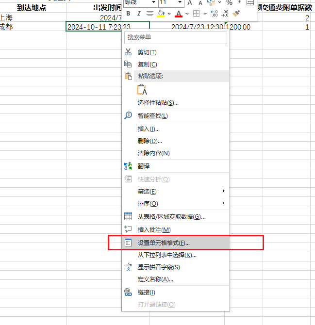
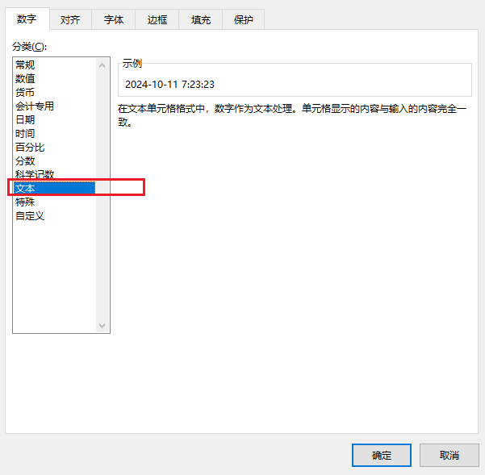

### Excel复制粘贴

我想把Excel红框中的这些内容复制到另一个excel中，应该怎么做比较方便

最便捷的方法就是直接用 Excel 的复制/粘贴，操作起来只需两步：

1. 在原文件中，拖拽选中红框区域（或点击左上角单元格后按住 `Shift` 点右下角单元格）。按 `Ctrl + C` 复制。
2. 切换到目标工作簿，在希望粘贴的左上角单元格点一下，按 `Ctrl + V` 粘贴。若要保留原格式，粘贴后点击单元格右下角的小剪贴板图标，选择“保留源格式”；若只要数值则选“仅保留值”。

如果两个工作簿并排放在同一个 Excel 窗口中，还可以选中区域后直接拖拽到目标表格，松手即完成。

### 设置单元格的格式（解决内容修改后自动变化的问题）

设置单元格的时间类型为文本，修改后就不会被改变

