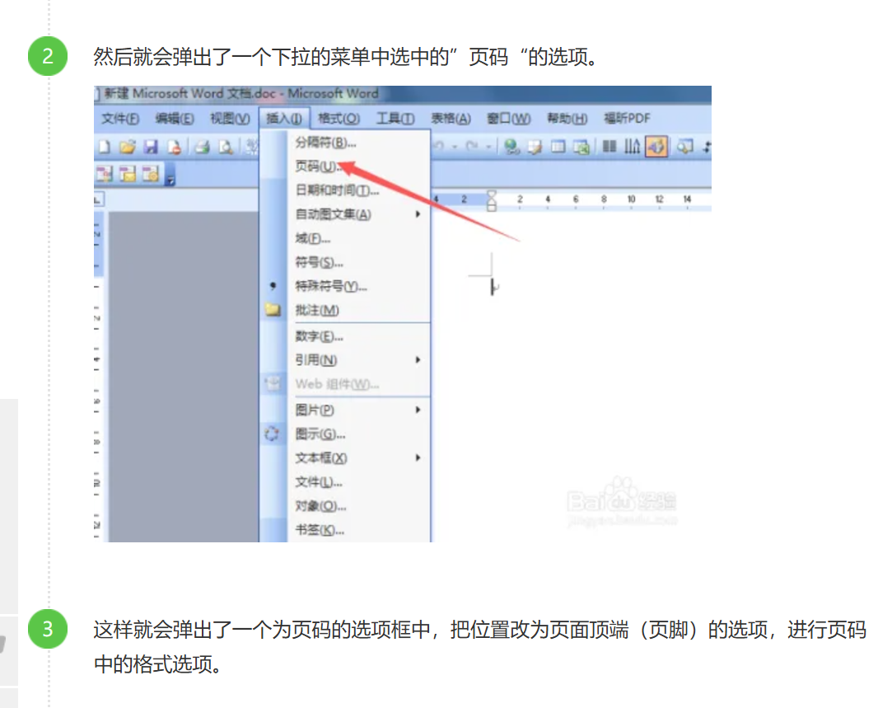
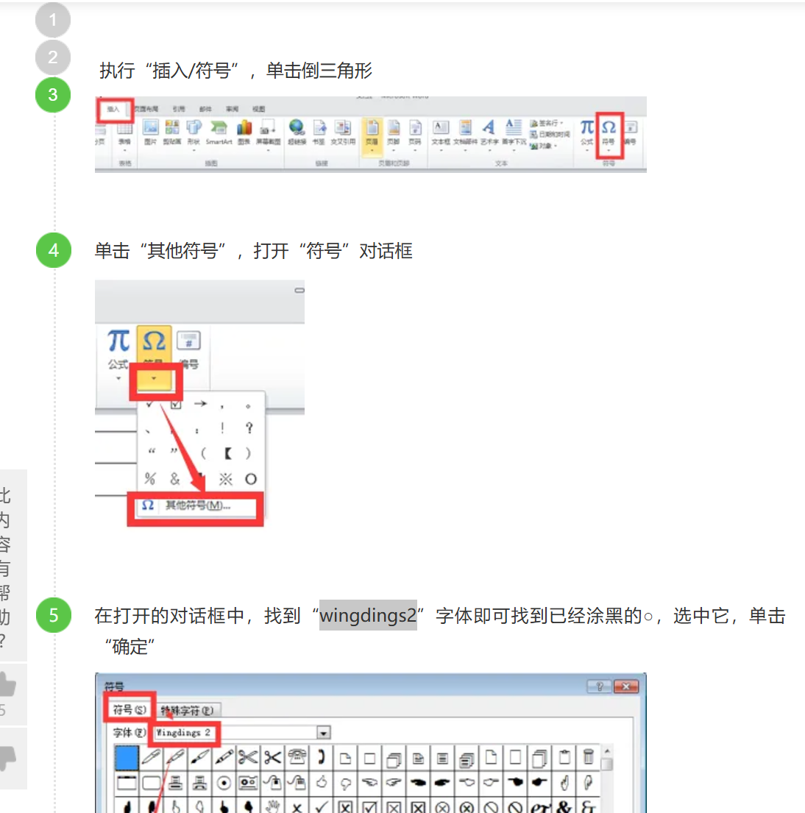

# word的使用

### 设置目录

开始 -》一级标题、二级标题...

### 设置上下左右边距（页边距）

布局 -》页边距

### 设置行距

设计  -》段落间距 -》自定义段落间距 -》行距、（选择固定值） + 设置值

### 设置页码

https://jingyan.baidu.com/article/3052f5a1e89d6397f31f86ac.html

### 添加打勾的小方框

原文：https://answers.microsoft.com/zh-hans/msoffice/forum/all/answers/caeb42d1-d04a-493c-8e8f-e8eed5722b28

### 给○（圆圈）涂黑

参考： https://jingyan.baidu.com/article/e6c8503c3909efa44f1a18cd.html

