# word的使用

### 全角、半角的区别与切换

区别：

在全角状态下，

第一个变化是我们的空格。切换到全角状态，按空格键，我们会发现两个字符之间的距离变得非常大，这与半角状态相比是非常大的。

第二个变化是英文字母，在半角状态下英文字母比较小，这是正常的。当我们切换到全角，我们可以看到这些字母是粗体和大的。

切换：

一般**使用快捷键`Shift + 空格`**后输入法就完成了全角、半角的切换。

### 设置标题

开始 -》一级标题、二级标题...

### 设置上下左右边距（页边距）

布局 -》页边距

### 设置行距(行间距)

1）

设计  -》段落间距 -》自定义段落间距 -》行距、（选择固定值） + 设置值

2）

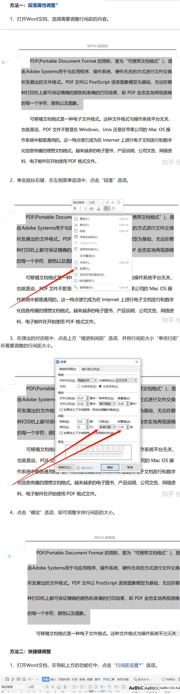

### 添加打勾的小方框

原文：https://answers.microsoft.com/zh-hans/msoffice/forum/all/answers/caeb42d1-d04a-493c-8e8f-e8eed5722b28

### 给○（圆圈）涂黑

参考： https://jingyan.baidu.com/article/e6c8503c3909efa44f1a18cd.html

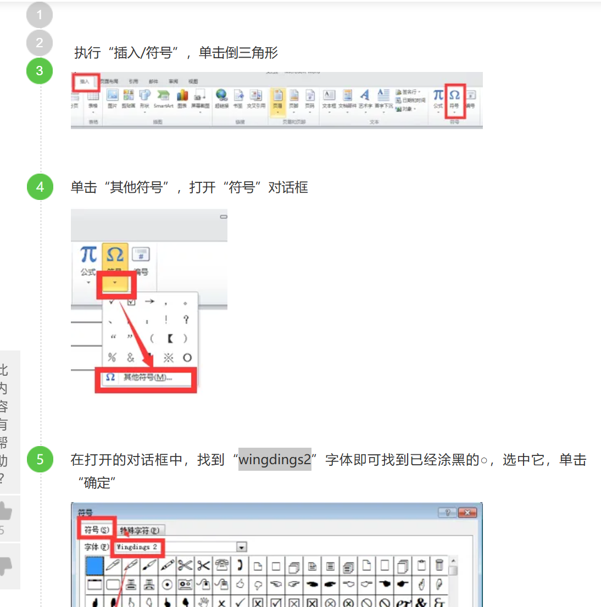

### word中插入图片显示不全或不能任意移动怎么办？

参考：https://jingyan.baidu.com/article/ff42efa933ccdec19f22027a.html

注意：鼠标的光标要放在图片的后面：

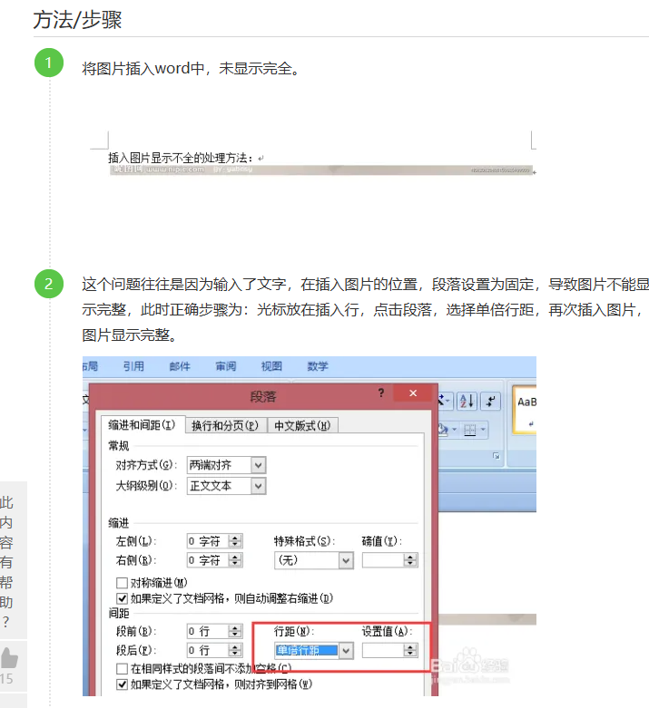

### 添加目录
参考：https://www.zhihu.com/question/20540465

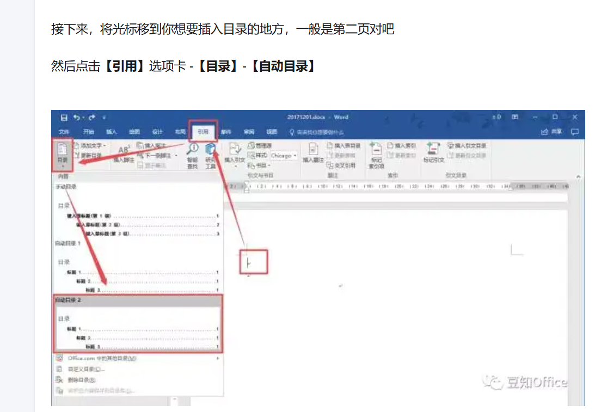

### Word：格式转换后容易出现：“在某些节中，您为左右边距、栏间距或段落缩进选择的设置相对于页面宽度过大”？

https://zhuanlan.zhihu.com/p/702511929

### pdf等转word后，部分文字的字体变异，不能统一设置为宋体小四

选中文字后进行二分查找，找到不能设置为宋体的后，使用替换功能把带字体样式的正常文字进行全局替换即可。

### 如何统一设置数字与字母的格式？

参考：https://blog.csdn.net/qq_50981222/article/details/123283235

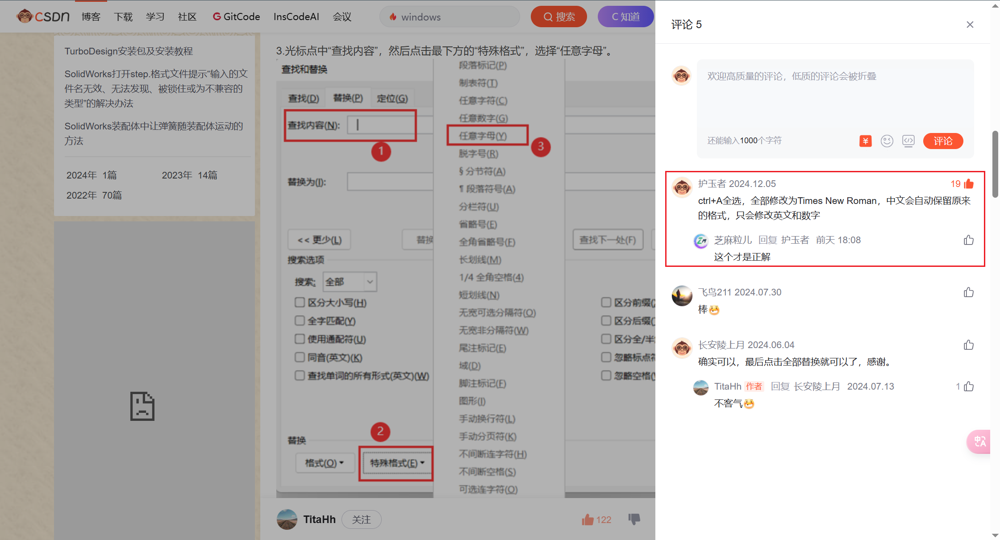

### 怎么删除word最后一页空白页（6个删除Word空白页的操作方法）

参考：https://blog.csdn.net/hltt3838/article/details/131343998

### WPS如何删除空白页面

参考：https://www.wps.cn/learning/room/d/324075

## 页眉、页码相关

### 设置页码

参考：

https://jingyan.baidu.com/article/3052f5a1e89d6397f31f86ac.html

实际上：

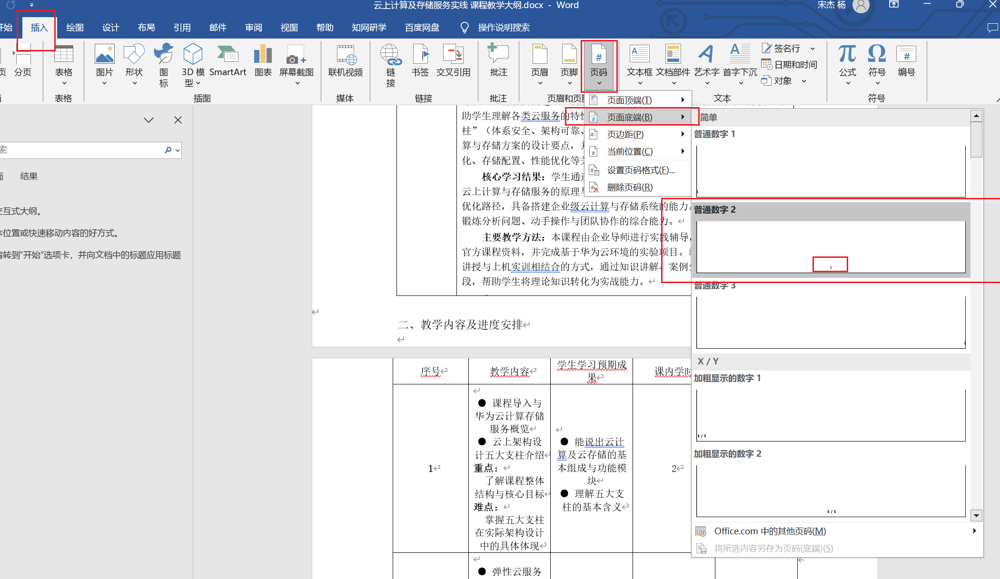

老版本：

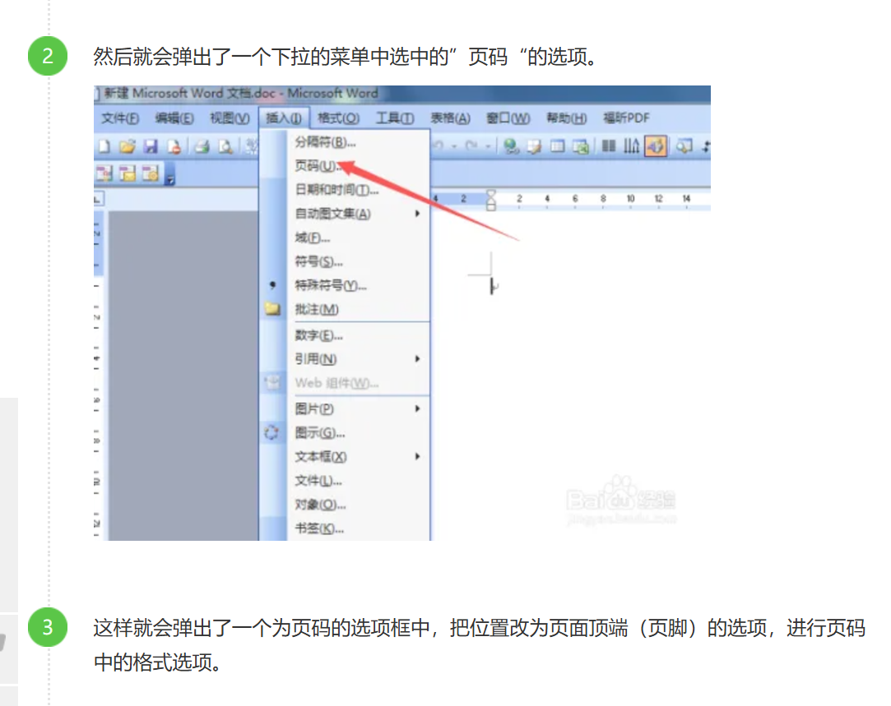

### 如何实现页码从第三页开始？

https://zhuanlan.zhihu.com/p/25923963

0）

配合下图中的使用：

1）

2）

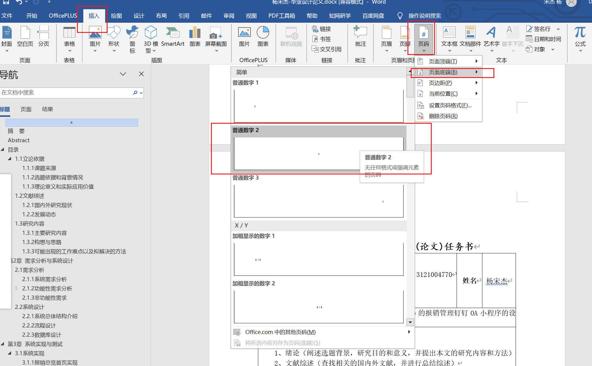

### 设置同前节 每页页眉保持一致

参考：https://plus.wps.cn/blog/p99435.html

### 设置页码不受分节符的限制，一直连续的显示下去

gpt:

~~~
你可以查看我的word文件，帮助我看看我的页眉、页码格式如何调整吗，我的页码设置为：“页码：论文页码从绪论部分开始，至附录，用阿拉伯数字连
续编排，页码位于页脚居中。封面、中英文设计说明（论文摘要）和目录不编入论文页码。中英文设计说明（论文摘要）和目录用罗马数字连续编排页码。”，而现在我的页眉要包含每个一级标题的内容，我通过在每个一级标题前面插入了分节符并取消了页眉的链接上一节来实现成功了，但是这样子有一个问题，就是我的页码也是通过分节符+链接到前一条页眉进行设置的，而现在页码因为每个一级标题前的分节符导致页码的范围只能在两个分节符之间，比如只能显示1-3，下一个一级标题时又从开始了，如何解决
~~~

回答：

~~~
你现在遇到的问题是这样的：

你已经用分节符实现了每一章（一级标题）页眉内容不同；

但是由于每一章是一个新的节，页码也在每一节重新开始了，变成“1-3、1-3、1-3”这种格式，而你想要的是从绪论开始用阿拉伯数字连续编排到附录。

这是 Word 中“分节”带来的典型问题。页码和页眉页脚的“链接前一节”是两个独立的设置，你可以分别控制。下面是解决方法：

✅ 解决方法：保留不同的页眉，但让页码连续
打开 Word，点击页码区域，进入页脚编辑模式。

在“页码”区域点击“格式页码”（在工具栏上或右键菜单中可以找到）：

在“页码格式”对话框中，

选择“续前节”（而不是“起始页码为 1”）。

👉 这个是关键点！你可以在每个节中手动设置页码为“续前节”，这样即使你分节了，每节页码也不会重新开始。

对每个章节的节都重复这个操作，确保每节页码都“续前节”。
~~~

### 设置毕业设计的页眉（对一行页眉同时设置左对齐和右对齐）

参考：https://blog.csdn.net/LaLaLaLaXFF/article/details/129818500

### 页眉下面的横线怎么设置

参考：https://jingyan.baidu.com/article/f7ff0bfc04cd546f27bb1375.html

毕业设计论文的线设置：

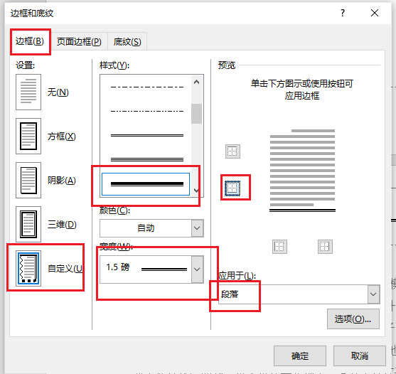

### 设置每个页眉的文字修改后不相互影响

参考这个删除的：https://docs.pingcode.com/ask/226465.html

0）

1）设置取消链接到上一节

### 分节符显示和删除的方法

快捷键：Ctrl + Shift + 8

https://zhuanlan.zhihu.com/p/149259144

## 论文引用的设置

#### 设置中括号为上标

1）

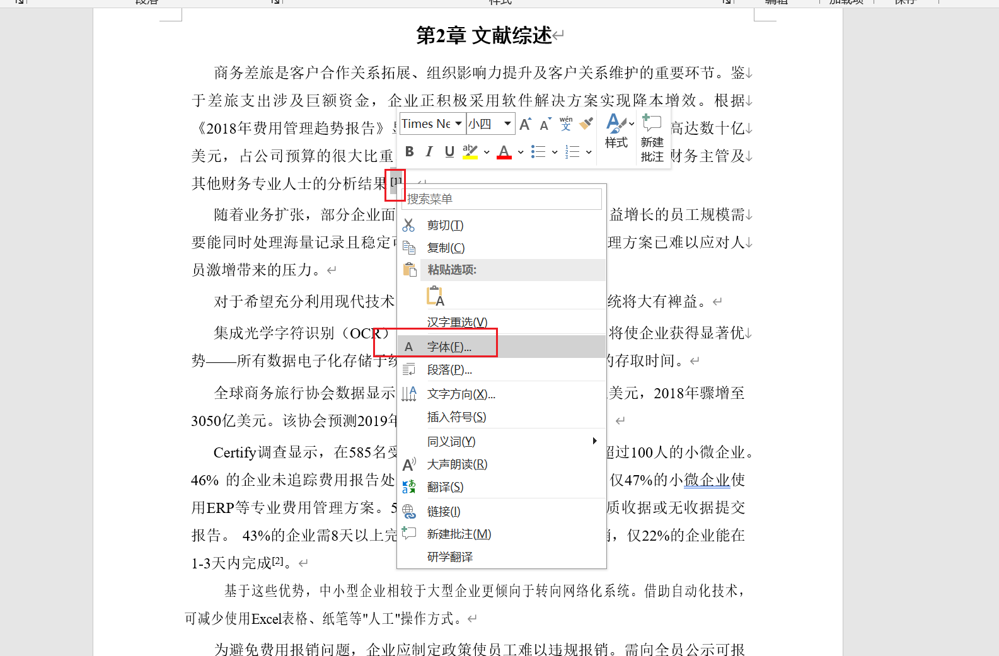

2）

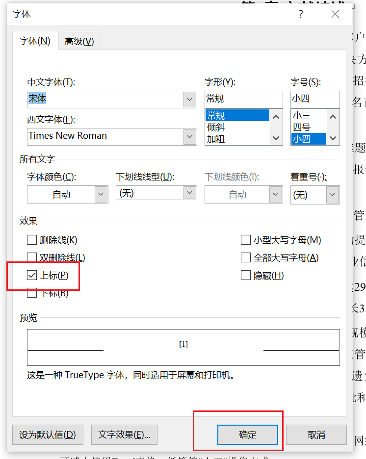

#### 英文参考文献单词间隔有大有小？该怎么处理

参考：https://zhuanlan.zhihu.com/p/489575079

## 表格

### 1 设置表格内的内容垂直居中

1）

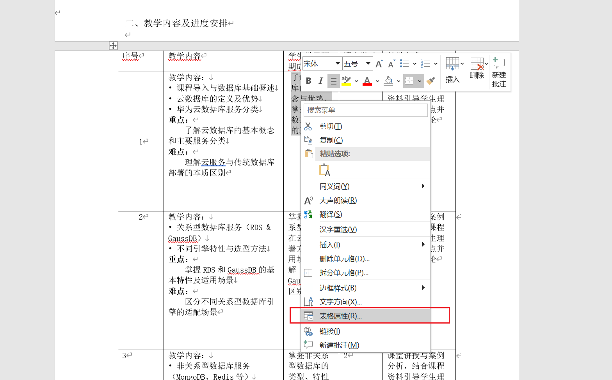

2）

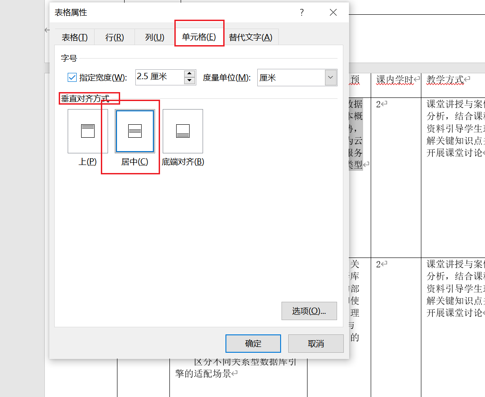

### 2在WORD中表格只显示文字不显示表格线，怎么解决

参考：https://jingyan.baidu.com/article/95c9d20d4b2b27ad4e756184.html

# 实际使用经验

## 我从网上下载下来的word文档显示编辑受限，需要密码，如何处理，可以破解吗

针对 Word 文档的**“限制编辑”**（即：你可以打开看，但不能修改，点击编辑时提示需要密码），这通常是文档作者设置了“停止保护”的密码。

这种情况不需要专业的“破解”软件，通过以下几种简单的方法通常就能解决。

**注意：在操作前，请先复制一份文件作为备份，以防文件损坏。**

### 方法一：另存为法（最简单，成功率较高）

有些较老版本的限制可以通过转换格式来清除。

1.  打开该 Word 文档。
2.  点击左上角的 **“文件”** > **“另存为”**。
3.  在保存类型里选择 **“Word XML 文档 (*.xml)”** 或者 **“富文本格式 (*.rtf)”**，保存到桌面。
4.  关闭 Word，用 Word 重新打开刚才保存的 `.xml` 或 `.rtf` 文件。
5.  此时通常保护已经被移除了。再次点击 **“文件”** > **“另存为”**，把格式改回 **Word 文档 (*.docx)** 即可。

### 方法二：新建文档复制法（如果允许选中的话）

如果文档只是限制了“编辑”，但没有限制“选中内容”：

1.  打开文档，按下 **Ctrl + A** （全选）。
2.  按下 **Ctrl + C** （复制）。
3.  新建一个空白 Word 文档，按下 **Ctrl + V** （粘贴）。
4.  保存新文档，这就是一份没有密码的副本了。
    *   *注：如果按 Ctrl+A 没反应，说明作者开启了“禁止选中”，请尝试方法三或四。*

### 方法三：利用网盘/第三方软件“洗”掉密码（推荐）

WPS、Google Docs（谷歌文档）或其他在线文档工具对微软 Office 的保护机制兼容性不同，有时候上传再下载就能去除保护。

1.  将文件上传到 **Google Drive (Google 文档)** 或 **腾讯文档/石墨文档** 等在线平台。
2.  在在线编辑器中打开它（通常在线编辑器会忽略微软的编辑保护）。
3.  在网页上选择 **“文件”** > **“下载为”** > **“Microsoft Word (.docx)”**。
4.  下载下来的文件通常就没有编辑限制了。

### 方法四：修改扩展名暴力删除保护（技术流，100%有效）

如果以上方法都不行，可以通过修改底层代码来移除保护（Word 本质上是一个压缩包）。

1.  **重命名：** 选中文件，按 F2，将后缀名 `.docx` 改为 `.zip`（系统提示点“是”）。
2.  **打开压缩包：** 双击打开这个 zip 包（不需要解压，直接打开）。
3.  **找到文件：** 依次进入 `word` 文件夹，找到 `settings.xml` 文件。
4.  **编辑代码：**
    *   把 `settings.xml` 拖出来，用“记事本”打开。
    *   按下 **Ctrl + F** 搜索 `documentProtection` 这个关键词。
    *   找到类似 `<w:documentProtection ... />` 的这一整串代码（从 `<` 开始到 `/>` 结束）。
    *   **删掉这一整串代码**。
    *   保存并关闭记事本。
5.  **还原：**
    *   把修改后的 `settings.xml` 拖回压缩包里，替换原文件。
    *   关闭压缩包，把文件名后缀从 `.zip` 改回 `.docx`。
6.  现在打开文档，编辑限制应该已经消失了。

---

**重要提示：**
如果该文档是**“打开权限密码”**（即双击文件还没看到内容就让你输密码），以上方法**全部无效**。那是高强度的加密，无法简单移除，只能找回密码。上述密码或询问文件发送者。上述密码。

## 使用模板文件复用样式与格式

~~~
我在一个word文件中设置好了标题、正文的“样式和格式”，但是当我新建一个word文件时就不能在“样式和格式”中使用了，我想打开新建的文件后依然可以使用，你有什么办法吗
~~~

有几种方法可以在新建 Word 文件中继续使用已设置好的样式和格式：

### 方法一：保存为模板文件（推荐）

1. 在已设置好样式的文档中，点击“文件” → “另存为”。
2. 在“保存类型”中选择“Word 模板（*.dotx）”。
3. 保存到默认模板文件夹（通常是 `C:\Users\你的用户名\Documents\自定义 Office 模板`）。
4. 新建文档时：
   - 点击“文件” → “新建”。
   - 选择“个人”或“我的模板”。
   - 选择你保存的模板文件。
   - 

### 方法二：将样式复制到 Normal 模板（所有新文档自动使用）

1. 在已设置好样式的文档中，按 `Alt+F8` 打开“宏”对话框（或“开发工具” → “宏”）。
2. 或者直接操作：
   - 点击“开始”选项卡 → “样式”右下角的小箭头。
   - 点击“管理样式”按钮。
   - 点击“导入/导出”按钮。
3. 在“管理器”对话框中：
   - 左侧选择当前文档的样式。
   - 右侧选择“Normal.dotm”（或“Normal.dotx”）。
   - 选中要复制的样式，点击“复制”按钮。
   - 点击“关闭”。

之后新建的空白文档会自动使用这些样式。

### 方法三：使用“管理器”复制到新文档

1. 打开已设置好样式的文档。
2. 打开新建的空白文档。
3. 在任一文档中，点击“开始” → “样式”右下角箭头 → “管理样式” → “导入/导出”。
4. 在“管理器”中：
   - 左侧显示当前文档的样式。
   - 右侧显示另一文档的样式。
   - 选中要复制的样式，点击“复制”。
   - 点击“关闭”。

### 方法四：将样式保存到“快速样式集”

1. 在已设置好样式的文档中，点击“开始” → “更改样式” → “样式集” → “另存为快速样式集”。
2. 输入名称（如“软著文档样式”），保存。
3. 在新建文档中，点击“开始” → “更改样式” → “样式集”，选择你保存的样式集。

### 方法五：直接复制格式（临时方案）

1. 在已设置好样式的文档中，选中一段使用该样式的文字。
2. 按 `Ctrl+Shift+C` 复制格式。
3. 在新建文档中，选中文字后按 `Ctrl+Shift+V` 粘贴格式。

---

推荐使用方法一或方法二：
- 方法一：适合需要多种模板的场景。
- 方法二：适合希望所有新文档都默认使用这些样式的场景。
