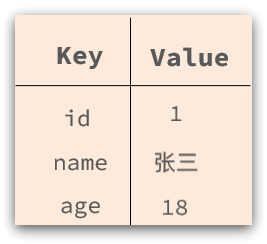
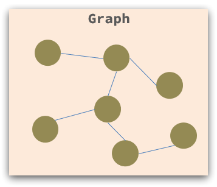
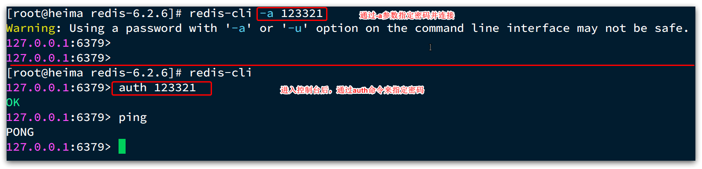
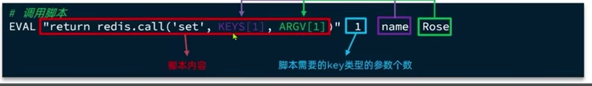

# Redis的使用


# 1.初识Redis

Redis是一种键值型的NoSql数据库，这里有两个关键字：

- 键值型

- NoSql

其中**键值型**，是指Redis中存储的数据都是以key、value对的形式存储，而value的形式多种多样，可以是字符串、数值、甚至json：


而NoSql则是相对于传统关系型数据库而言，有很大差异的一种数据库。


## 1.1.认识NoSQL

是相对于传统关系型数据库而言，有很大差异的一种特殊的数据库，因此也称之为**非关系型数据库**。


### 1.1.1.结构化与非结构化

传统关系型数据库是结构化数据，每一张表都有严格的约束信息：字段名、字段数据类型、字段约束等等信息，插入的数据必须遵守这些约束：


而NoSql则对数据库格式没有严格约束，往往形式松散，自由。

可以是键值型：



也可以是文档型：


甚至可以是图格式：




### 1.1.2.关联和非关联

传统数据库的表与表之间往往存在关联，例如**外键**：


而非关系型数据库不存在关联关系，要维护关系要么靠代码中的业务逻辑，要么靠数据之间的耦合：

```json
{
  id: 1,
  name: "张三",
  orders: [
    {
       id: 1,
       item: {
	 id: 10, title: "荣耀6", price: 4999
       }
    },
    {
       id: 2,
       item: {
	 id: 20, title: "小米11", price: 3999
       }
    }
  ]
}
```

此处要维护“张三”的订单与商品“荣耀”和“小米11”的关系，不得不冗余的将这两个商品保存在张三的订单文档中，不够优雅。还是建议用业务来维护关联关系。


### 1.1.3.查询方式

传统关系型数据库会基于Sql语句做查询，语法有统一标准；

而不同的非关系数据库查询语法差异极大，五花八门各种各样。


### 1.1.4.事务

传统关系型数据库能满足事务ACID的原则。


- 隔离性
  多个事务之间要相互隔离，不能互相干扰

- 原子性
  指事务是一个不可分割的整体，类似一个不可分割的原子

- 持久性
  指事务一旦被提交，这组操作修改的数据就真的的发生变化了(不会再被回滚了)。即使接下来数据库故障也不应该对其有影响。

- 一致性
  保障事务前后这组数据的状态是一致的。要么都是成功的，要么都是失败的。

而非关系型数据库往往**不支持事务**，或者不能严格保证ACID的特性，只能实现基本的一致性。


### 1.1.5.总结

除了上述四点以外，在存储方式、扩展性、查询性能上关系型与非关系型也都有着显著差异，总结如下：


- 存储方式
  - 关系型数据库基于磁盘进行存储，会有大量的磁盘IO，对性能有一定影响
  - 非关系型数据库，他们的操作更多的是依赖于内存来操作，内存的读写速度会非常快，性能自然会好一些

* 扩展性
  * 关系型数据库集群模式一般是主从，主从数据一致，起到数据备份的作用，称为垂直扩展。
  * 非关系型数据库可以将数据拆分，存储在不同机器上，可以保存海量数据，解决内存大小有限的问题。称为水平扩展。
  * 关系型数据库因为表之间存在关联关系，如果做水平扩展会给数据查询带来很多麻烦


## 1.2.认识Redis

Redis诞生于2009年全称是**Re**mote  **D**ictionary **S**erver 远程词典服务器，是一个基于内存的键值型NoSQL数据库。

**特征**：

- 键值（key-value）型，value支持多种不同数据结构，功能丰富
- **单线程**，每个命令具备原子性
- 低延迟，速度快（基于内存、IO多路复用、良好的编码）。
- 支持数据持久化
- 支持主从集群、分片集群
- 支持多语言客户端

## 1.3.安装Redis

大多数企业都是基于Linux服务器来部署项目，而且Redis官方也没有提供Windows版本的安装包。因此课程中我们会基于Linux系统来安装Redis.

此处选择的Linux版本为CentOS 7.

### 1.3.1.依赖库

Redis是基于C语言编写的，因此首先需要安装Redis所需要的gcc依赖：

```sh
yum install -y gcc tcl
```


### 1.3.2.上传安装包并解压

然后将课前资料提供的Redis安装包上传到虚拟机的任意目录：


例如，我放到了/usr/local/src 目录：


解压缩：

```sh
tar -xzf redis-6.2.6.tar.gz
```

解压后：


进入redis目录：

```sh
cd redis-6.2.6
```


运行编译命令：

```sh
make && make install
```

如果没有出错，应该就安装成功了。


默认的安装路径是在 `/usr/local/bin`目录下：


该目录已经默认配置到环境变量，因此可以在任意目录下运行这些命令。其中：

- redis-cli：是redis提供的命令行客户端
- redis-server：是redis的服务端启动脚本
- redis-sentinel：是redis的哨兵启动脚本


### 1.3.3.启动

redis的启动方式有很多种，例如：

- 默认启动
- 指定配置启动
- 开机自启


### 1.3.4.默认启动

安装完成后，在任意目录输入redis-server命令即可启动Redis：

```
redis-server
```

如图：


这种启动属于`前台启动`，会阻塞整个会话窗口，窗口关闭或者按下`CTRL + C`则Redis停止。不推荐使用。

### 1.3.5.指定配置启动

如果要让Redis以`后台`方式启动，则必须修改Redis配置文件，就在我们之前解压的redis安装包下（`/usr/local/src/redis-6.2.6`），名字叫redis.conf：


我们先将这个配置文件备份一份：

```
cp redis.conf redis.conf.bck
```


然后修改redis.conf文件中的一些配置：

```properties
# 允许访问的地址，默认是127.0.0.1，会导致只能在本地访问。修改为0.0.0.0则可以在任意IP访问，生产环境不要设置为0.0.0.0
bind 0.0.0.0
# 守护进程，修改为yes后即可后台运行
daemonize yes 
# 密码，设置后访问Redis必须输入密码
requirepass 123321
```


Redis的其它常见配置：

```properties
# 监听的端口
port 6379
# 工作目录，默认是当前目录，也就是运行redis-server时的命令，日志、持久化等文件会保存在这个目录
dir .
# 数据库数量，设置为1，代表只使用1个库，默认有16个库，编号0~15
databases 1
# 设置redis能够使用的最大内存
maxmemory 512mb
# 日志文件，默认为空，不记录日志，可以指定日志文件名
logfile "redis.log"
```


启动Redis：

```sh
# 进入redis安装目录 
cd /usr/local/src/redis-6.2.6
# 启动
redis-server redis.conf
```


停止服务：

```sh
# 利用redis-cli来执行 shutdown 命令，即可停止 Redis 服务，
# 因为之前配置了密码，因此需要通过 -u 来指定密码
redis-cli -u 123321 shutdown
```


### 1.3.6.开机自启

我们也可以通过配置来实现开机自启。

首先，新建一个系统服务文件：

```sh
vi /etc/systemd/system/redis.service
```

内容如下：

```conf
[Unit]
Description=redis-server
After=network.target

[Service]
Type=forking
ExecStart=/usr/local/bin/redis-server /usr/local/src/redis-6.2.6/redis.conf
PrivateTmp=true

[Install]
WantedBy=multi-user.target
```


然后重载系统服务：

```sh
systemctl daemon-reload
```


现在，我们可以用下面这组命令来操作redis了：

```sh
# 启动
systemctl start redis
# 停止
systemctl stop redis
# 重启
systemctl restart redis
# 查看状态
systemctl status redis
```


执行下面的命令，可以让redis开机自启：

```sh
systemctl enable redis
```


## 1.4.Redis桌面客户端

安装完成Redis，我们就可以操作Redis，实现数据的CRUD了。这需要用到Redis客户端，包括：

- 命令行客户端
- 图形化桌面客户端
- 编程客户端

### 1.4.1.Redis命令行客户端

Redis安装完成后就自带了命令行客户端：redis-cli，使用方式如下：

```sh
redis-cli [options] [commonds]
```

其中常见的options有：

- `-h 127.0.0.1`：指定要连接的redis节点的IP地址，默认是127.0.0.1
- `-p 6379`：指定要连接的redis节点的端口，默认是6379
- `-a 123321`：指定redis的访问密码 

其中的commonds就是Redis的操作命令，例如：

- `ping`：与redis服务端做心跳测试，服务端正常会返回`pong`

不指定commond时，会进入`redis-cli`的交互控制台：




### 1.4.2.图形化桌面客户端

GitHub上的大神编写了Redis的图形化桌面客户端，地址：https://github.com/uglide/RedisDesktopManager

不过该仓库提供的是RedisDesktopManager的源码，并未提供windows安装包。


在下面这个仓库可以找到安装包：https://github.com/lework/RedisDesktopManager-Windows/releases


### 1.4.3.安装

在课前资料中可以找到Redis的图形化桌面客户端：


解压缩后，运行安装程序即可安装：


安装完成后，在安装目录下找到rdm.exe文件：


双击即可运行：


### 1.4.4.建立连接

点击左上角的`连接到Redis服务器`按钮：


在弹出的窗口中填写Redis服务信息：


点击确定后，在左侧菜单会出现这个链接：


点击即可建立连接了。


Redis默认有16个仓库，编号从0至15.  通过配置文件可以设置仓库数量，但是不超过16，并且不能自定义仓库名称。

如果是基于redis-cli连接Redis服务，可以通过select命令来选择数据库：

```sh
# 选择 0号库
select 0
```


# 2.Redis常见命令与5种常用的基本类型

Redis是典型的key-value数据库，key一般是字符串，而value包含很多不同的数据类型：


Redis为了方便我们学习，将操作不同数据类型的命令也做了分组，在官网（ [https://redis.io/commands ](https://redis.io/commands)）可以查看到不同的命令：


不同类型的命令称为一个group，我们也可以通过help命令来查看各种不同group的命令：


接下来，我们就学习常见的五种基本数据类型的相关命令。


## 2.1.Redis通用命令

通用指令是部分数据类型的，都可以使用的指令，常见的有：

- KEYS：查看符合模板的所有key
- DEL：删除指定的key,多个key时使用空格分隔
- EXISTS：判断key是否存在 ，0表示不存在
- EXPIRE：给一个key设置有效期，有效期到期时该key会被自动删除

~~~sh
expire key 20 # 设置有效期为20秒
~~~


- TTL：查看一个KEY的剩余有效期,返回-1表示永久有效，-2表示已经过期了 1表示还有1秒过期
- select 0-15 :切换使用的数据库

通过help [command] 可以查看一个命令的具体用法，例如：

```sh
# 查看keys命令的帮助信息：
127.0.0.1:6379> help keys

KEYS pattern
summary: Find all keys matching the given pattern
since: 1.0.0
group: generic
```

## 2.2.String类型

String类型:

其**value是字符串**，不过根据字符串的格式不同，又可以分为3类：

- string：普通字符串
- int：整数类型，可以做自增、自减操作
- float：浮点类型，可以做自增、自减操作

不管是哪种格式，底层都是字节数组形式存储，只不过是编码方式不同。字符串类型的最大空间不能超过512m.


### 2.2.1.String的常见命令

String的常见命令有：
#### 1.增删改查

- SET：**添加或者修改**已经存在的一个String类型的键值对

- GET：根据key获取String类型的value

- MSET：批量添加多个String类型的键值对

  ~~~sh
  mset k1 v1 k2 v2
  ~~~
- del:删除
  
- MGET：根据多个key获取多个String类型的value

#### 2.自增命令：

- INCR：让一个整型的key自增1

  ~~~sh
  set age 17 # 设置一个String类型的value,值为17,key为age
  incr age 
  get age# 结果：18
  ~~~

  

- INCRBY:让一个整型的key自增并指定步长，例如：incrby num 2 让num值自增2

- INCRBYFLOAT：让一个浮点类型的数字自增并指定步长 **注意**：浮点数没有默认增长，必须指定步长

#### 3.组合命令:

- SETNX：**添加**一个String类型的键值对，前提是这个key不存在，否则不执行

  ~~~sh
  setnx age 18
  # 相当于下面的命令
  set age 18 nx
  ~~~

  

- SETEX：添加一个String类型的键值对，并且指定有效期

~~~sh
setex name 10 lisi # 设置一个键值对并且有效期为10秒
# 相当于
set name 10 ex
~~~


### 2.2.2.Key命名的结构

我们可以通过给key添加前缀加以区分，不过这个前缀不是随便加的，有一定的规范：

Redis的key允许有多个单词形成层级结构，多个单词之间用':'隔开，格式如下：

```
	项目名:业务名:类型:id
```

这个格式并非固定，也可以根据自己的需求来删除或添加词条。这样以来，我们就可以把不同类型的数据区分开了。从而避免了key的冲突问题。

例如我们的项目名称叫 heima，有user和product两种不同类型的数据，我们可以这样定义key：

- user相关的key：**heima:user:1**

- product相关的key：**heima:product:1**


如果Value是一个Java对象，例如一个User对象，则可以将对象序列化为JSON字符串后存储：

| **KEY**         | **VALUE**                                  |
| --------------- | ------------------------------------------ |
| heima:user:1    | {"id":1,  "name": "Jack", "age": 21}       |
| heima:product:1 | {"id":1,  "name": "小米11", "price": 4999} |

并且，在Redis的桌面客户端中，还会以相同前缀作为	层级结构，让数据看起来层次分明，关系清晰：


## 2.3.Hash类型

Hash类型，也叫散列，其**value是一个Hash 表**，类似于Java中的HashMap结构。

String结构是将对象序列化为JSON字符串后存储，当需要修改对象某个字段时很不方便：


Hash结构可以将对象中的每个字段独立存储，可以针对单个字段做CRUD：field也称hash-key


Hash的常见命令有：

- HSET key field value：**添加或者修改**hash类型key的field的值

- HGET key field：获取一个hash类型key的field的值

- HMSET key field1 value1 field2 value2 ... ：批量添加多个hash类型key的field的值

- HMGET key field1 field2：批量获取多个hash类型key的field的值

- HGETALL key：获取一个hash类型的key中的所有的field和value

- HKEYS：获取一个hash类型的key中的所有的field

- HINCRBY:让一个hash类型key的field的value自增并指定步长

  ~~~sh
  hset study:my:1 age 10 # 指定两个map的key
  hincrby study:my:1 age -2 # (integer) 8
  hget study:my:1 age # 结果："8"
  ~~~

  

- HSETNX：**添加**一个hash类型的key的field值，前提是这个field不存在，否则不执行


## 2.4.List类型

Redis中的List类型与Java中的LinkedList类似，可以看做是一个**双向链表结构**。既可以支持正向检索和也可以支持反向检索。

特征也与LinkedList类似：

- 有序
- 元素可以重复
- 插入和删除快
- 查询速度一般

常用来存储一个有序数据，例如：朋友圈点赞列表，评论列表等。


List的常见命令有：

- LPUSH key element ... ：向列表左侧插入一个或多个元素
- LPOP key：移除并返回列表左侧的第一个元素，没有则返回nil
- RPUSH key element ... ：向列表右侧插入一个或多个元素
- RPOP key：移除并返回列表右侧的第一个元素
- LRANGE key star end：返回[star,end]范围内的所有元素
- BLPOP和BRPOP：与LPOP和RPOP类似，只不过在没有元素时**会等待指定的时间**，而不是直接返回nil，在等待的时间内，如果有人添加了数据，就可以获取到并且停止等待。


## 2.5.Set类型

Redis的Set结构与Java中的HashSet类似，可以看做是一个value为null的HashMap。因为也是一个hash表，因此具备与HashSet类似的特征：

- 无序

- 元素不可重复

- 查找快

- 支持交集、并集、差集等功能


#### Set的常见命令：

- SADD key member ... ：向set中添加一个或多个元素
- SREM key member ... : 移除set中的指定元素
- SCARD key： 返回set中元素的个数
- SISMEMBER key member：判断一个元素是否存在于set中
- SMEMBERS：获取set中的所有元素
- SINTER key1 key2 ... ：求key1与key2的交集

#### 集合操作：

例如两个集合：s1和s2:


求**交集**：SINTER s1 s2...

求s1与s2的**差集**：SDIFF s1 s2... **注意**：返回的是s1里面有而s2里面没有的


求**并集**：SUNION key1 key2 ... **注意**：set是不重复的，suoion后的结果也是不重复的。


## 2.6.SortedSet类型

Redis的SortedSet是一个可排序的set集合，与Java中的TreeSet有些类似，但底层数据结构却差别很大。SortedSet中的每一个元素都带有一个score属性，可以基于score属性对元素排序，底层的实现是一个跳表（SkipList）加 hash表。

SortedSet具备下列特性：

- 可排序
- 元素不重复
- 查询速度快

因为SortedSet的可排序特性，经常被用来实现排行榜这样的功能。


#### SortedSet的常见命令：

- ZADD key score member：添加一个或多个元素到sorted set ，如果已经存在则更新其score值
- ZREM key member：删除sorted set中的一个指定元素
- ZSCORE key member : 获取sorted set中的指定元素的score值
- ZRANK key member：获取sorted set 中的指定元素的排名
- ZCARD key：获取sorted set中所有元素的个数
- ZCOUNT key min max：统计score值在给定范围内的所有元素的个数
- ZINCRBY key increment member：让sorted set中的指定元素自增，步长为指定的increment值
- ZRANGE key min max：按照score排序后，获取指定排名范围内的元素
- ZRANGEBYSCORE key min max：按照score排序后，获取指定score范围内的元素
- ZDIFF、ZINTER、ZUNION：求差集、交集、并集

**注意**：所有的排名**默认都是升序**，如果要**降序则在命令的Z后面添加REV**即可，例如：

- **升序**获取sorted set 中的指定元素的排名：ZRANK key member

- **降序**获取sorted set 中的指定元素的排名：ZREVRANK key memeber


# 3.Redis的Java客户端

在Redis官网中提供了各种语言的客户端，地址：https://redis.io/docs/clients/


其中Java客户端也包含很多：


标记为*的就是推荐使用的java客户端，包括：

- Jedis和Lettuce：这两个主要是提供了Redis命令对应的API，方便我们操作Redis，而SpringDataRedis又对这两种做了抽象和封装，因此我们后期会直接以SpringDataRedis来学习。
- Redisson：是在Redis基础上实现了分布式的可伸缩的java数据结构，例如Map、Queue等，而且支持跨进程的同步机制：Lock、Semaphore等待，比较适合用来实现特殊的功能需求。


## 3.1.Jedis客户端

Jedis的官网地址： https://github.com/redis/jedis

### 3.1.1.快速入门

我们先来个快速入门：

1）引入依赖：

```xml
<!--jedis-->
<dependency>
    <groupId>redis.clients</groupId>
    <artifactId>jedis</artifactId>
    <version>3.7.0</version>
</dependency>
<!--单元测试-->
<dependency>
    <groupId>org.junit.jupiter</groupId>
    <artifactId>junit-jupiter</artifactId>
    <version>5.7.0</version>
    <scope>test</scope>
</dependency>
```


2）建立连接

新建一个单元测试类，内容如下：

```java
private Jedis jedis;

@BeforeEach
void setUp() {
    // 1.建立连接
    // jedis = new Jedis("192.168.150.101", 6379);
    jedis = JedisConnectionFactory.getJedis();
    // 2.设置密码
    jedis.auth("123321");
    // 3.选择库
    jedis.select(0);
}
```


3）测试：

```java
@Test
void testString() {
    // 存入数据
    String result = jedis.set("name", "虎哥");
    System.out.println("result = " + result);
    // 获取数据
    String name = jedis.get("name");
    System.out.println("name = " + name);
}

@Test
void testHash() {
    // 插入hash数据
    jedis.hset("user:1", "name", "Jack");
    jedis.hset("user:1", "age", "21");

    // 获取
    Map<String, String> map = jedis.hgetAll("user:1");
    System.out.println(map);
}
```


4）释放资源

```java
@AfterEach
void tearDown() {
    if (jedis != null) {
        jedis.close();
    }
}
```


### 3.1.2.连接池

Jedis本身是线程不安全的，并且频繁的创建和销毁连接会有性能损耗，因此我们推荐大家使用Jedis连接池代替Jedis的直连方式。

```java
package com.heima.jedis.util;

import redis.clients.jedis.*;

public class JedisConnectionFactory {

    private static JedisPool jedisPool;

    static {
        // 配置连接池
        JedisPoolConfig poolConfig = new JedisPoolConfig();
        poolConfig.setMaxTotal(8);
        poolConfig.setMaxIdle(8);
        poolConfig.setMinIdle(0);
        poolConfig.setMaxWaitMillis(1000);
        // 创建连接池对象，参数：连接池配置、服务端ip、服务端端口、超时时间、密码
        jedisPool = new JedisPool(poolConfig, "192.168.150.101", 6379, 1000, "123321");
    }

    public static Jedis getJedis(){
        return jedisPool.getResource();
    }
}
```


## 3.2.SpringDataRedis客户端（RedisTemplate工具类）

SpringData是Spring中数据操作的模块，包含对各种数据库的集成，其中对Redis的集成模块就叫做SpringDataRedis，官网地址：https://spring.io/projects/spring-data-redis

- 提供了对不同Redis客户端的整合（Lettuce和Jedis）
- 提供了RedisTemplate统一API来操作Redis
- 支持Redis的发布订阅模型
- 支持Redis哨兵和Redis集群
- 支持基于Lettuce的响应式编程
- 支持基于JDK、JSON、字符串、Spring对象的数据序列化及反序列化
- 支持基于Redis的JDKCollection实现


SpringDataRedis中提供了RedisTemplate工具类，其中封装了各种对Redis的操作。并且将不同数据类型的操作API封装到了不同的类型中：


#### api的使用

##### 通用

~~~java
    /**
     * 设置有效时间
     *
     * @param key Redis键
     * @param timeout 超时时间
     * @return true=设置成功；false=设置失败
     */
    public boolean expire(final String key, final long timeout)
    {
        return expire(key, timeout, TimeUnit.SECONDS);
    }

    /**
     * 设置有效时间
     *
     * @param key Redis键
     * @param timeout 超时时间
     * @param unit 时间单位
     * @return true=设置成功；false=设置失败
     */
    public boolean expire(final String key, final long timeout, final TimeUnit unit)
    {
        return redisTemplate.expire(key, timeout, unit);
    }


    /**
     * 删除单个对象
     *
     * @param key
     */
    public boolean deleteObject(final String key)
    {
        return redisTemplate.delete(key);
    }

    /**
     * 删除集合对象
     *
     * @param collection 多个对象
     * @return
     */
    public long deleteObject(final Collection collection)
    {
        return redisTemplate.delete(collection);
    }
    /**
     * 获得缓存的基本对象列表
     *
     * @param pattern 字符串前缀
     * @return 对象列表
     */
    public Collection<String> keys(final String pattern)
    {
        return redisTemplate.keys(pattern);
    }
~~~


##### String类型

~~~java
    /**
     * 缓存基本的对象，Integer、String、实体类等
     *
     * @param key 缓存的键值
     * @param value 缓存的值
     */
    public <T> void setCacheObject(final String key, final T value)
    {
        redisTemplate.opsForValue().set(key, value);
    }

    /**
     * 缓存基本的对象，Integer、String、实体类等
     *
     * @param key 缓存的键值
     * @param value 缓存的值
     * @param timeout 时间
     * @param timeUnit 时间颗粒度
     */
    public <T> void setCacheObject(final String key, final T value, final Integer timeout, final TimeUnit timeUnit)
    {
        redisTemplate.opsForValue().set(key, value, timeout, timeUnit);
    }

    /**
     * 获得缓存的基本对象。
     *
     * @param key 缓存键值
     * @return 缓存键值对应的数据
     */
    public <T> T getCacheObject(final String key)
    {
        ValueOperations<String, T> operation = redisTemplate.opsForValue();
        return operation.get(key);
    }
~~~


##### List类型

~~~java
    /**
     * 缓存List数据
     *
     * @param key 缓存的键值
     * @param dataList 待缓存的List数据
     * @return 缓存的对象
     */
    public <T> long setCacheList(final String key, final List<T> dataList)
    {
        Long count = redisTemplate.opsForList().rightPushAll(key, dataList);
        return count == null ? 0 : count;
    }

    /**
     * 获得缓存的list对象
     *
     * @param key 缓存的键值
     * @return 缓存键值对应的数据
     */
    public <T> List<T> getCacheList(final String key)
    {
        return redisTemplate.opsForList().range(key, 0, -1);
    }
~~~


##### Hash类型

~~~java
    @Autowired
    public RedisTemplate redisTemplate;

    /**
     * 对map中的value进行递增操作
     * @param mapKey
     * @param viewCountKey
     * @param v
     */
    public void incrementCacheMapValue(String mapKey,String viewCountKey,int v){
        redisTemplate.opsForHash().increment(mapKey,viewCountKey,v);
    }
	 /**
     * 对map中的value进行递增操作
     * @param mapKey
     * @param viewCountKey
     * @param v
     */
    public void incrementCacheMapValue(String mapKey,String viewCountKey,int v){
        // 这种方式也可以
        // boundHashOps() 方法返回一个已经绑定特定散列 mapKey 的操作对象。该对象在创建后便指向了特定的键，之后可以多次对该散列进行操作，而不必每次都指定键名。
        redisTemplate.boundHashOps(mapKey).increment(viewCountKey,v);
    }


 /**
     * 缓存Map
     *
     * @param key
     * @param dataMap
     */
    public <T> void setCacheMap(final String key, final Map<String, T> dataMap)
    {
        if (dataMap != null) {
            redisTemplate.opsForHash().putAll(key, dataMap);
        }
    }

    /**
     * 获得缓存的Map
     *
     * @param key
     * @return
     */
    public <T> Map<String, T> getCacheMap(final String key)
    {
        return redisTemplate.opsForHash().entries(key);
    }

    /**
     * 往Hash中存入数据
     *
     * @param key Redis键
     * @param hKey Hash键
     * @param value 值
     */
    public <T> void setCacheMapValue(final String key, final String hKey, final T value)
    {
        redisTemplate.opsForHash().put(key, hKey, value);
    }

    /**
     * 获取Hash中的数据
     *
     * @param key Redis键
     * @param hKey Hash键
     * @return Hash中的对象
     */
    public <T> T getCacheMapValue(final String key, final String hKey)
    {
        // 获取操作Hash数据结构的对象
        HashOperations<String, String, T> opsForHash = redisTemplate.opsForHash();
        // 获取HashMap中的值
        return opsForHash.get(key, hKey);
    }

    /**
     * 删除Hash中的数据
     * 
     * @param key
     * @param hkey
     */
    public void delCacheMapValue(final String key, final String hkey)
    {
        HashOperations hashOperations = redisTemplate.opsForHash();
        hashOperations.delete(key, hkey);
    }

    /**
     * 获取多个Hash中的数据
     *
     * @param key Redis键
     * @param hKeys Hash键集合
     * @return Hash对象集合
     */
    public <T> List<T> getMultiCacheMapValue(final String key, final Collection<Object> hKeys)
    {
        return redisTemplate.opsForHash().multiGet(key, hKeys);
    }

~~~


##### Set类型

~~~java
    /**
     * 缓存Set
     *
     * @param key 缓存键值
     * @param dataSet 缓存的数据
     * @return 缓存数据的对象
     */
    public <T> BoundSetOperations<String, T> setCacheSet(final String key, final Set<T> dataSet)
    {
        BoundSetOperations<String, T> setOperation = redisTemplate.boundSetOps(key);
        Iterator<T> it = dataSet.iterator();
        while (it.hasNext())
        {
            setOperation.add(it.next());
        }
        return setOperation;
    }

    /**
     * 获得缓存的set
     *
     * @param key
     * @return
     */
    public <T> Set<T> getCacheSet(final String key)
    {
        return redisTemplate.opsForSet().members(key);
    }
~~~


##### SortedSet类型

~~~java

~~~


### 3.2.1.RedisTemplate快速入门

SpringBoot已经提供了对SpringDataRedis的支持，使用非常简单。


首先，新建一个maven项目，然后按照下面步骤执行：

#### 1）引入依赖

```xml
<?xml version="1.0" encoding="UTF-8"?>
<project xmlns="http://maven.apache.org/POM/4.0.0" xmlns:xsi="http://www.w3.org/2001/XMLSchema-instance"
         xsi:schemaLocation="http://maven.apache.org/POM/4.0.0 https://maven.apache.org/xsd/maven-4.0.0.xsd">
    <modelVersion>4.0.0</modelVersion>
    <parent>
        <groupId>org.springframework.boot</groupId>
        <artifactId>spring-boot-starter-parent</artifactId>
        <version>2.5.7</version>
        <relativePath/> <!-- lookup parent from repository -->
    </parent>
    <groupId>com.heima</groupId>
    <artifactId>redis-demo</artifactId>
    <version>0.0.1-SNAPSHOT</version>
    <name>redis-demo</name>
    <description>Demo project for Spring Boot</description>
    <properties>
        <java.version>1.8</java.version>
    </properties>
    <dependencies>
        <!--redis依赖-->
        <dependency>
            <groupId>org.springframework.boot</groupId>
            <artifactId>spring-boot-starter-data-redis</artifactId>
        </dependency>
        <!--common-pool-->
        <dependency>
            <groupId>org.apache.commons</groupId>
            <artifactId>commons-pool2</artifactId>
        </dependency>
        <!--Jackson依赖-->
        <dependency>
            <groupId>com.fasterxml.jackson.core</groupId>
            <artifactId>jackson-databind</artifactId>
        </dependency>
        <dependency>
            <groupId>org.projectlombok</groupId>
            <artifactId>lombok</artifactId>
            <optional>true</optional>
        </dependency>
        <dependency>
            <groupId>org.springframework.boot</groupId>
            <artifactId>spring-boot-starter-test</artifactId>
            <scope>test</scope>
        </dependency>
    </dependencies>

    <build>
        <plugins>
            <plugin>
                <groupId>org.springframework.boot</groupId>
                <artifactId>spring-boot-maven-plugin</artifactId>
                <configuration>
                    <excludes>
                        <exclude>
                            <groupId>org.projectlombok</groupId>
                            <artifactId>lombok</artifactId>
                        </exclude>
                    </excludes>
                </configuration>
            </plugin>
        </plugins>
    </build>

</project>
```


#### 2）配置Redis

```yaml
spring:
  redis:
    host: 192.168.150.101
    port: 6379
    password: 123321
    lettuce:
      pool:
        max-active: 8
        max-idle: 8
        min-idle: 0
        max-wait: 100ms
```


#### 3）注入RedisTemplate

因为有了SpringBoot的自动装配，我们可以拿来就用：

```java
@SpringBootTest
class RedisStringTests {

    @Autowired
    private RedisTemplate redisTemplate;
}
```


#### 4）编写测试

```java
@SpringBootTest
class RedisStringTests {

    @Autowired
    private RedisTemplate edisTemplate;

    @Test
    void testString() {
        // 写入一条String数据
        redisTemplate.opsForValue().set("name", "虎哥");
        // 获取string数据
        Object name = stringRedisTemplate.opsForValue().get("name");
        System.out.println("name = " + name);
    }
}
```


### 3.2.2.自定义序列化

RedisTemplate可以接收任意Object作为值写入Redis：


只不过写入前会把Object序列化为字节形式，默认是采用JDK序列化，得到的结果是这样的：


缺点：

- 可读性差
- 内存占用较大


我们可以自定义RedisTemplate的序列化方式，代码如下：

```java
@Configuration
public class RedisConfig {

    @Bean
    public RedisTemplate<String, Object> redisTemplate(RedisConnectionFactory connectionFactory){// 自动注入工厂Bean
        // 创建RedisTemplate对象
        RedisTemplate<String, Object> template = new RedisTemplate<>();
        // 设置连接工厂
        template.setConnectionFactory(connectionFactory);
        // 创建JSON序列化工具
        GenericJackson2JsonRedisSerializer jsonRedisSerializer = 
            							new GenericJackson2JsonRedisSerializer();
        // 设置Key的序列化
        template.setKeySerializer(RedisSerializer.string());
        template.setHashKeySerializer(RedisSerializer.string());
        // 设置Value的序列化
        template.setValueSerializer(jsonRedisSerializer);
        template.setHashValueSerializer(jsonRedisSerializer);
        // 返回
        return template;
    }
}
```


这里采用了JSON序列化来代替默认的JDK序列化方式。最终结果如图：


整体可读性有了很大提升，并且能将Java对象自动的序列化为JSON字符串，并且查询时能自动把JSON反序列化为Java对象。不过，其中**记录了序列化时对应的class名称**，目的是为了查询时实现自动反序列化**(根据全类名获取字节码对象使用反射创建对象并且读取JSON字符串中的值来实现反序列化)**。这会带来额外的内存开销。


### 3.2.3.统一使用String序列化器

**为了节省内存空间**，我们可以不使用JSON序列化器来处理value，而是**统一使用String序列化器**，要求只能存储String类型的key和value。当需要存储Java对象时，手动完成对象的序列化和反序列化。


因为存入和读取时的序列化及反序列化都是我们自己实现的，SpringDataRedis就**不会将class信息写入Redis了**。


这种用法比较普遍，因此SpringDataRedis就提供了RedisTemplate的子类：StringRedisTemplate，它的key和value的序列化方式默认就是String方式。


省去了我们自定义RedisTemplate的序列化方式的步骤，而是直接使用：

```java
@Autowired
private StringRedisTemplate stringRedisTemplate;
// spring mvc中默认的JSON序列化工具
private static final ObjectMapper mapper = new ObjectMapper();

@Test
void testSaveUser() throws JsonProcessingException {
    // 创建对象
    User user = new User("虎哥", 21);
    // 手动json序列化 writeValueAsString方法：把对象序列化为json字符串
    String json = mapper.writeValueAsString(user);
    // 写入数据
    stringRedisTemplate.opsForValue().set("user:200", json);

    // 获取数据
    String jsonUser = stringRedisTemplate.opsForValue().get("user:200");
    // 手动j反序列化 readValue()方法，把json字符串反序列化为对象
    User user1 = mapper.readValue(jsonUser, User.class);
    System.out.println("user1 = " + user1);
}

```


## 2级 spring提供:基于注解的缓存

#### csdn教程 应用型参考笔记：

https://blog.csdn.net/zl_momomo/article/details/80403564

#### JSR的5个接口


#### Spring对缓存的注解使用


#### 基于Redis的Cache类的增删改查方法：

配置：

~~~java
/**
 * Redis Cache的配置类
 * 该缓存方案支持事务
 * 该缓存方案直接集成spring-boot-starter-data-redis，所以舍弃自定义配置，直接默认使用spring的配置
 */
@SpringBootConfiguration
@EnableCaching
@Slf4j
public class RedisCacheConfig {

    /**
     * 定制链接和操作Redis的客户端工具
     *
     * @param redisConnectionFactory
     * @return
     */
    @Bean
    public RedisTemplate<String, Object> redisTemplate(RedisConnectionFactory redisConnectionFactory) {
        Jackson2JsonRedisSerializer<Object> jackson2JsonRedisSerializer = new Jackson2JsonRedisSerializer<Object>(Object.class);
        StringRedisSerializer stringRedisSerializer = new StringRedisSerializer();
        RedisTemplate<String, Object> redisTemplate = new RedisTemplate<>();

        ObjectMapper objectMapper = new ObjectMapper();
        objectMapper.enableDefaultTyping(ObjectMapper.DefaultTyping.NON_FINAL, JsonTypeInfo.As.PROPERTY);
        jackson2JsonRedisSerializer.setObjectMapper(objectMapper);
        // 设置序列化方式
        redisTemplate.setConnectionFactory(redisConnectionFactory);
        redisTemplate.setKeySerializer(stringRedisSerializer);
        redisTemplate.setValueSerializer(jackson2JsonRedisSerializer);
        redisTemplate.setHashKeySerializer(stringRedisSerializer);
        redisTemplate.setHashValueSerializer(jackson2JsonRedisSerializer);

        return redisTemplate;
    }

    /**
     * 定制化redis的缓存管理器
     *
     * @param redisConnectionFactory
     * @return
     */
    @Bean
    public CacheManager redisCacheManager(RedisConnectionFactory redisConnectionFactory) {

        Jackson2JsonRedisSerializer<Object> jackson2JsonRedisSerializer = new Jackson2JsonRedisSerializer<Object>(Object.class);
        ObjectMapper objectMapper = new ObjectMapper();
        objectMapper.enableDefaultTyping(ObjectMapper.DefaultTyping.NON_FINAL, JsonTypeInfo.As.PROPERTY);
        jackson2JsonRedisSerializer.setObjectMapper(objectMapper);

        RedisCacheConfiguration redisCacheConfiguration = RedisCacheConfiguration
                .defaultCacheConfig()
                .serializeKeysWith(RedisSerializationContext.SerializationPair.fromSerializer(new StringRedisSerializer()))
                .serializeValuesWith(RedisSerializationContext.SerializationPair.fromSerializer(jackson2JsonRedisSerializer));
        // 设置Redis的序列化方式、能够感知事务的上下文功能
        RedisCacheManager cacheManager = RedisCacheManager
                .builder(RedisCacheWriter.lockingRedisCacheWriter(redisConnectionFactory))
                .cacheDefaults(redisCacheConfiguration)
                .transactionAware()
                .build();

        log.info("the redis cache manager is loaded successfully!");
        return cacheManager;
    }
}
~~~


使用：

~~~java
    @Autowired
    private CacheManager cacheManager; // 注入基于redis的缓存管理器

// 增 改
private String generateAndSaveAccessToken(UserLoginContext userLoginContext) {
        // 注入CacheManager类(实现类为RedisCacheManager)进行保存、获取Cache对象，put key、token到cache对象中
        Cache cache = cacheManager.getCache(CacheConstants.R_PAN_CACHE_NAME);
        cache.put(UserConstants.USER_LOGIN_PREFIX +userId,accessToken);
        // 存储token到登录上下文对象中
        userLoginContext.setAccessToken(accessToken);
        return accessToken;
    }

// 删
public void exit() {
        // 实现类使用cache对象的evict方法清除token缓存,使用try-catch兜底
            Cache cache = cacheManager.getCache(CacheConstants.R_PAN_CACHE_NAME);
            cache.evict(UserConstants.USER_LOGIN_PREFIX + UserIdUtil.get());
    }

// 查
    private boolean checkAndSaveUserId(HttpServletRequest request) {
        // 从缓存中根据用户id获取token,进行比对
        Cache cache = cacheManager.getCache(CacheConstants.R_PAN_CACHE_NAME);
        String redisAccessToken = cache.get(UserConstants.USER_LOGIN_PREFIX + userId, String.class);
    }
~~~


##### @Cacheable注解


###### sync属性

设置sync为true:解决缓存穿透问题（合法请求）

当没有命中缓存时，只开启一个线程去数据库中查询数据，防止过多请求同时穿透缓存直接访问数据库。

设置为false则不会对线程的数量进行限制，并发的访问数据库。

处理不合法请求（请求查询id=-1的数据，缓存中不存在，则会直接穿透访问数据库）导致的缓存穿透问题：

使用布隆过滤器

##### SpEL表达式


##### @CachePut注解


##### @CacheEvict注解


##### @CacheConfig注解


## 分布式锁

### 基本原理和实现方式对比

- 分布式锁：满足分布式系统或集群模式下多线程课件并且可以互斥的锁
- 分布式锁的核心思想就是让大家共用同一把锁，那么我们就能锁住线程，不让线程进行，让程序串行执行，这就是分布式锁的核心思路


分布式锁执行流程图:


- 那么分布式锁应该满足一些什么条件呢？

  1. 多线程可见性：多个线程都能看到相同的结果。

  注意：这里说的可见性并不是并发编程中指的内存可见性，只是说多个进程之间都能感知到变化的意思

  1. 互斥：互斥是分布式锁的最基本条件，使得程序串行执行
  2. 高可用：锁是能够获取的，不会因为获取不了锁导致下游的程序崩溃，时时刻刻都保证较高的可用性
  3. 高性能：由于加锁本身就让性能降低，所以对于分布式锁需要他较高的加锁性能和释放锁性能
  4. 安全性：防止出现死锁 如：设置过期时间前宕机了，锁不能够释放 怎么办

- 常见的分布式锁有三种

  1. MySQL：MySQL本身就带有锁机制，但是由于MySQL的性能一般，所以采用分布式锁的情况下，使用MySQL作为分布式锁比较少见  
  2. Redis：Redis作为分布式锁是非常常见的一种使用方式，现在企业级开发中基本都是用Redis或者Zookeeper作为分布式锁，利用`SETNX`这个方法，如果插入Key成功，则表示获得到了锁，如果有人插入成功，那么其他人就回插入失败，无法获取到锁，利用这套逻辑完成`互斥`，从而实现分布式锁
  3. Zookeeper：Zookeeper也是企业级开发中较好的一种实现分布式锁的方案，但本文是学Redis的，所以这里就不过多阐述了

|        |           MySQL           |          Redis           |            Zookeeper             |
| :----: | :-----------------------: | :----------------------: | :------------------------------: |
|  互斥  | 利用mysql本身的互斥锁机制 | 利用setnx这样的互斥命令  | 利用节点的唯一性和有序性实现互斥 |
| 高可用 |            好             |            好            |                好                |
| 高性能 |           一般            |            好            |               一般               |
| 安全性 |   断开连接，自动释放锁    | 利用锁超时时间，到期释放 |    临时节点，断开连接自动释放    |


### Redis分布式锁的实现核心思路

- 实现分布式锁时需要实现两个基本方法

  1. 获取锁

     - 互斥：确保只能有一个线程获取锁
     - 非阻塞式：只尝试获取一次，成功返回true，失败返回false，后面就不尝试了，这里实现的是非阻塞式的
     - 阻塞式：失败后进入阻塞等待状态，直到锁被释放后再重试获取锁

     ```sh
     BASH
     SET lock thread01 NX EX 10 # EX 10指定过期时间 SET NX实现互斥
     # 
     ```
	  - setnx()方法：
        setnx 的含义就是 SET if Not Exists，其主要有两个参数 setnx(key, value)。该方法是原子的，如果 key 不存在，则设置当前 key 成功，返回 1；如果当前 key 已经存在，则设置当前 key 失败，返回 0。
  2. 释放锁

     - 手动释放
     - 超时释放：获取锁的时候添加一个超时时间

     ```
     BASH
     DEL lock
     ```

- 核心思路

  - 我们利用redis的`SETNX`方法，当有多个线程进入时，我们就利用该方法来获取锁。第一个线程进入时，redis 中就有这个key了，返回了1，如果结果是1，则表示他抢到了锁，那么他去执行业务，然后再删除锁，退出锁逻辑，没有抢到锁（返回了0）的线程，等待一定时间之后重试

基于Redis的非阻塞分布式锁执行流程：


### 实现分布式锁

- 锁的基本接口

```java
JAVA

public interface ILock {
    /**
     * 尝试获取锁
     *
     * @param timeoutSec 锁持有的超时时间，过期自动释放
     * @return true表示获取锁成功，false表示获取锁失败
     */
    boolean tryLock(long timeoutSec);

    /**
     * 释放锁
     */
    void unlock();
}
```

- 然后创建一个SimpleRedisLock类实现接口

```java
JAVA

public class SimpleRedisLock implements ILock {
    //锁的前缀
    private static final String KEY_PREFIX = "lock:";
    //具体业务名称，将前缀和业务名拼接之后当做Key
    private String name;
    //这里不是@Autowired注入，采用的是构造器注入，在创建SimpleRedisLock时，将RedisTemplate作为参数传入
    private StringRedisTemplate stringRedisTemplate;

    public SimpleRedisLock(String name, StringRedisTemplate stringRedisTemplate) {
        this.name = name;
        this.stringRedisTemplate = stringRedisTemplate;
    }

    @Override
    public boolean tryLock(long timeoutSec) {
        //获取线程标识 递增的，不同主机主机可能重复
        long threadId = Thread.currentThread().getId();
        //获取锁，使用Redis中的SETNX方法进行加锁，同时设置过期时间，防止死锁
        Boolean success = stringRedisTemplate.opsForValue().setIfAbsent(KEY_PREFIX + name, threadId + "", timeoutSec, TimeUnit.SECONDS);
        //success为null时自动拆箱可能会出现空指针异常，这样写更稳妥,哪怕success为null也能够正常运行
        return Boolean.TRUE.equals(success);
    }

    @Override
    public void unlock() {
        //通过DEL来删除锁
        stringRedisTemplate.delete(KEY_PREFIX + name);
    }
}
```

- 修改业务代码

```java
JAVA

@Override
public Result seckillVoucher(Long voucherId) {
    LambdaQueryWrapper<SeckillVoucher> queryWrapper = new LambdaQueryWrapper<>();
    //1. 查询优惠券
    queryWrapper.eq(SeckillVoucher::getVoucherId, voucherId);
    SeckillVoucher seckillVoucher = seckillVoucherService.getOne(queryWrapper);
    //2. 判断秒杀时间是否开始
    if (LocalDateTime.now().isBefore(seckillVoucher.getBeginTime())) {
        return Result.fail("秒杀还未开始，请耐心等待");
    }
    //3. 判断秒杀时间是否结束
    if (LocalDateTime.now().isAfter(seckillVoucher.getEndTime())) {
        return Result.fail("秒杀已经结束！");
    }
    //4. 判断库存是否充足
    if (seckillVoucher.getStock() < 1) {
        return Result.fail("优惠券已被抢光了哦，下次记得手速快点");
    }
    Long userId = UserHolder.getUser().getId();
    // 创建锁对象
    SimpleRedisLock redisLock = new SimpleRedisLock("order:" + userId, stringRedisTemplate);
    // 尝试获取锁对象
    boolean isLock = redisLock.tryLock(120);
    // 加锁失败，说明当前用户开了多个线程抢优惠券，但是由于key是SETNX的，所以不能创建key，得等key的TTL到期或释放锁（删除key）
    if (!isLock) {
        return Result.fail("不允许抢多张优惠券");
    }
    try {
        // 获取代理对象
        IVoucherOrderService proxy = (IVoucherOrderService) AopContext.currentProxy();
        return proxy.createVoucherOrder(voucherId);
    } finally {
        // 释放锁
        redisLock.unlock();
    }
}
```

- 使用Jmeter进行压力测试，请求头中携带登录用户的token，最终只能抢到一张优惠券

### Redis分布式锁误删情况说明

- ```
  逻辑说明
  ```

  - 持有锁的线程1在锁的内部出现了阻塞，导致他的锁TTL到期，自动释放
  - 此时线程2也来尝试获取锁，由于线程1已经释放了锁，所以线程2可以拿到
  - 但是现在线程1阻塞完了，继续往下执行，要开始释放锁了
  - 那么此时就会将属于线程2的锁释放，这就是误删别人锁的情况

- ```
  解决方案
  ```

  - 解决方案就是在每个线程释放锁的时候，都判断一下这个锁是不是自己的，如果不属于自己，则不进行删除操作。
  - 假设还是上面的情况，线程1阻塞，锁自动释放，线程2进入到锁的内部执行逻辑，此时线程1阻塞完了，继续往下执行，开始删除锁，但是线程1发现这把锁不是自己的，所以不进行删除锁的逻辑，当线程2执行到删除锁的逻辑时，如果TTL还未到期，则判断当前这把锁是自己的，于是删除这把锁
    [](https://pic1.imgdb.cn/item/635aa1b016f2c2beb1e68e4f.jpg)


### 解决Redis分布式锁误删问题

- 需求：修改之前的分布式锁实现
- 满足：在获取锁的时候存入线程标识（用UUID标识，在一个JVM中，ThreadId一般不会重复，但是我们现在是集群模式，有多个JVM，多个JVM之间可能会出现ThreadId重复的情况），在释放锁的时候先获取锁的线程标识，判断是否与当前线程标识一致
  - 如果一致则释放锁
  - 如果不一致则不释放锁
- 核心逻辑：在存入锁的时候，放入自己的线程标识，在删除锁的时候，判断当前这把锁是不是自己存入的
  - 如果是，则进行删除
  - 如果不是，则不进行删除
- 具体实现代码如下

```java
// 使用UUID标识JVM，使用线程id标识线程，防止冲突
private static final String ID_PREFIX = UUID.randomUUID().toString(true) + "-";
@Override
public boolean tryLock(long timeoutSec) {
    // 获取线程标识
    String threadId = ID_PREFIX + Thread.currentThread().getId();
    // 获取锁
    Boolean success = stringRedisTemplate.opsForValue().setIfAbsent(KEY_PREFIX + name, threadId, timeoutSec, TimeUnit.SECONDS);
    return Boolean.TRUE.equals(success);
}

@Override
public void unlock() {
    // 获取当前线程的标识
    String threadId = ID_PREFIX + Thread.currentThread().getId();
    // 获取锁中的标识
    String id = stringRedisTemplate.opsForValue().get(KEY_PREFIX + name);
    // 判断标识是否一致
    if (threadId.equals(id)) {
        // 释放锁
        stringRedisTemplate.delete(KEY_PREFIX + name);
    }
}
```

### 分布式删锁时的原子性问题

- 更为极端的误删逻辑说明
- 假设线程1已经获取了锁，在判断标识一致之后，准备释放锁的时候，又出现了阻塞（例如JVM垃圾回收机制），并且时间足够长
- 于是锁的TTL到期了，自动释放了
- 那么现在线程2趁虚而入，拿到了一把锁
- 但是线程1的逻辑还没执行完，那么线程1就会执行删除锁的逻辑
- 但是在阻塞前线程1已经判断了标识一致，所以现在线程1把线程2的锁给删了
- 那么就相当于判断标识那行代码没有起到作用
- 这就是删锁时的原子性问题
- 因为线程1的拿锁，判断标识，删锁，不是原子操作，所以我们要防止刚刚的情况


### Lua脚本解决多条命令原子性问题

- Redis提供了Lua脚本功能，在一个脚本中编写多条Redis命令，**确保多条命令执行时的原子性**。
- Lua是一种编程语言，它的基本语法可以上菜鸟教程看看，链接：https://www.runoob.com/lua/lua-tutorial.html
- 这里重点介绍Redis提供的调用函数，我们可以使用Lua去操作Redis，而且还能保证它的原子性，这样就可以实现`拿锁`，`判断标识`，`删锁`是一个原子性动作了
- Redis提供的调用函数语法如下

```
BASH
redis.call('命令名称','key','其他参数', ...)
```

- 例如我们要执行`set name Kyle`，则脚本是这样

```
BASH
redis.call('set', 'name', 'Kyle')
```

- 例如我我们要执行`set name David`，在执行`get name`，则脚本如下

```sh
BASH
## 先执行set name David
redis.call('set', 'name', 'David')
## 再执行get name
local name = redis.call('get', 'name')
## 返回
return name
```

- 写好脚本以后，需要用Redis命令来调用脚本，调用脚本的常见命令如下

```sh
BASH
EVAL script numkeys key [key ...] arg [arg ...]
```

- 例如，我们要调用`redis.call('set', 'name', 'Kyle') 0`这个脚本，语法如下

```
BASH
EVAL "return redis.call('set', 'name', 'Kyle')" 0
```

- 如果脚本中的key和value不想写死，可以作为参数传递，key类型参数会放入KEYS数组，其他参数会放入ARGV数组，在脚本中可以从KEYS和ARGV数组中获取这些参数

注意：在Lua中，数组下标从1开始

如图：



- 那现在我们来使用Lua脚本来代替我们释放锁的逻辑
- 原逻辑
- 改写为Lua脚本


Lua脚本：

~~~lua
-- 这里的KEYS[1]就是传入锁的key
-- 这里的ARGV[1]就是线程标识
-- 比较锁中的线程标识与线程标识是否一致
if (redis.call('get', KEYS[1]) == ARGV[1]) then
    -- 一致则释放锁，成功返回1，失败返回0
    return redis.call('del', KEYS[1])
end
return 0 -- 失败返回0
~~~


### 利用Java代码调用Lua脚本改造分布式锁

- 在RedisTemplate中，可以利用execute方法去执行lua脚本

如图：


- 对应的Java代码如下

```java
// 使用静态修饰，提前加载好Lua脚本
private static final DefaultRedisScript<Long> UNLOCK_SCRIPT;

static {
    // 使用DefaultRedisScript实现类
    UNLOCK_SCRIPT = new DefaultRedisScript();
    // 设置去类路径下面寻找并加载Lua文件
    UNLOCK_SCRIPT.setLocation(new ClassPathResource("unlock.lua"));
    UNLOCK_SCRIPT.setResultType(Long.class);
}

@Override
public void unlock() {
    stringRedisTemplate.execute(UNLOCK_SCRIPT,
            Collections.singletonList(KEY_PREFIX + name),// 封装为一个单个元素的集合
            ID_PREFIX + Thread.currentThread().getId());
}
```


### 小结

基于SETNX实现的分布式锁存在以下问题

1. 不可重入问题
   - 重入问题是指获取锁的线程，可以再次进入到相同的锁的代码块中，可重入锁的意义在于防止死锁，例如在HashTable这样的代码中，它的方法都是使用synchronized修饰的，假如它在获取锁m后执行A方法时调用另一个方法B，在B方法中又需要获取锁m，如果此时是不可重入的，即：不能够获取到锁m(已经被自己这个线程获取了)，那就死锁了。所以可重入锁的主要意义是防止死锁，我们的synchronized和Lock锁都是可重入的
2. 不可重试(非阻塞式的)问题
   - 我们编写的基于setnx的分布式锁只能尝试一次，失败了就返回false，没有重试机制。有时的需求为：当线程获取锁失败后，他应该能再次尝试获取锁
3. 超时释放问题
   - 锁超时释放虽然可以避免死锁，但如果是业务执行耗时较长，也会导致锁释放，存在安全隐患
4. 主从一致性问题
   - 如果Redis提供了主从集群(向主节点写数据，向从节点读数据)，那么当我们向主节点写入锁数据时，主节点需要异步的将数据同步给从节点，万一在同步之前，主节点宕机了(概率很低，同步的延迟是毫秒级别的)，则会选择一个从节点来作为新的主节点，但是这个从节点没有同步刚刚的锁数据，其他线程就可以趁虚而入进行新的写操作来获取锁，那么就会出现锁失效的问题。

优点：

实现简单，能够满足大多数场景，但是对有上面的4种需求、安全度要求高的场景就不合适了。


## 分布式锁-Redisson(Redi sent)


- 那么什么是Redisson呢
  - Redisson是一个在Redis的基础上实现的Java驻内存数据网格(In-Memory Data Grid)。它不仅提供了一系列的分布式Java常用对象，还提供了许多分布式服务，其中就包含了各种分布式锁的实现。
- Redis提供了分布式锁的多种多样功能
  1. 可重入锁(Reentrant Lock)
  2. 公平锁(Fair Lock)
  3. 联锁(MultiLock)
  4. 红锁(RedLock)
  5. 读写锁(ReadWriteLock)
  6. 信号量(Semaphore)
  7. 可过期性信号量(PermitExpirableSemaphore)
  8. 闭锁(CountDownLatch)


### Redisson入门

1. 导入依赖

```xml
<dependency>
    <groupId>org.redisson</groupId>
    <artifactId>redisson</artifactId>
    <version>3.13.6</version>
</dependency>
```

1. 配置Redisson客户端，在config包下新建`RedissonConfig`类

```java
import org.redisson.Redisson;
import org.redisson.api.RedissonClient;
import org.redisson.config.Config;
import org.springframework.context.annotation.Bean;
import org.springframework.context.annotation.Configuration;

@Configuration
public class RedissonConfig {
    @Bean
    public RedissonClient redissonClient() {
        Config config = new Config();
        config.useSingleServer()// 添加redis地址，这里添加了单点的地址，也可以使用config.useClusterServers()添加集群地址
            .setAddress("redis://101.XXX.XXX.160:6379")
            .setPassword("root");
        return Redisson.create(config);
    }
}
```

1. 使用Redisson的分布式锁

```java
@Resource
private RedissonClient redissonClient;

@Test
void testRedisson() throws InterruptedException {
    // 获取可重入锁对象
    RLock lock = redissonClient.getLock("anyLock");
    // 尝试获取锁，三个参数分别是：获取锁的最大等待时间(期间会重试)，锁的自动释放时间，时间单位
    boolean success = lock.tryLock(1,10, TimeUnit.SECONDS);
    // 判断获取锁成功
    if (success) {
        try {
            System.out.println("执行业务");
        } finally {
            //释放锁
            lock.unlock();
        }
    }
}
```

1. 替换我们之前自己写的分布式锁

```java

   @Resource
   private RedissonClient redissonClient;

    @Override
    public Result seckillVoucher(Long voucherId) {
        LambdaQueryWrapper<SeckillVoucher> queryWrapper = new LambdaQueryWrapper<>();
        //1. 查询优惠券
        queryWrapper.eq(SeckillVoucher::getVoucherId, voucherId);
        SeckillVoucher seckillVoucher = seckillVoucherService.getOne(queryWrapper);
        //2. 判断秒杀时间是否开始
        if (LocalDateTime.now().isBefore(seckillVoucher.getBeginTime())) {
            return Result.fail("秒杀还未开始，请耐心等待");
        }
        //3. 判断秒杀时间是否结束
        if (LocalDateTime.now().isAfter(seckillVoucher.getEndTime())) {
            return Result.fail("秒杀已经结束！");
        }
        //4. 判断库存是否充足
        if (seckillVoucher.getStock() < 1) {
            return Result.fail("优惠券已被抢光了哦，下次记得手速快点");
        }
        Long userId = UserHolder.getUser().getId();
        // SimpleRedisLock redisLock = new SimpleRedisLock("order:" + userId, stringRedisTemplate);
        RLock redisLock = redissonClient.getLock("order:" + userId);
        // boolean isLock = redisLock.tryLock(120);
        // 不传参则默认失败后不重试，直接返回false
        boolean isLock = redisLock.tryLock();
        if (!isLock) {
            return Result.fail("不允许抢多张优惠券");
        }
        try {
            IVoucherOrderService proxy = (IVoucherOrderService) AopContext.currentProxy();
            return proxy.createVoucherOrder(voucherId);
        } finally {
            redisLock.unlock();
        }
    }
```


- 使用Jmeter进行压力测试，依旧是只能抢到一张优惠券，满足我们的需求

### Redisson可重入锁原理

- 在redisson中，我们也支持可重入锁

  - 在分布式锁中，它采用hash结构来存储锁，其中外层key表示这把锁是否存在，内层key则记录当前这把锁被哪个线程持有

- 案例：method1在方法内部调用method2，method1和method2出于同一个线程，那么method1已经拿到锁了，想进入method2中拿同一把锁，必然是拿不到的，于是就出现了死锁

```java
@Resource
private RedissonClient redissonClient;

private RLock lock;

@BeforeEach
void setUp() {
    lock = redissonClient.getLock("lock");
}

@Test
void method1() {
    boolean success = lock.tryLock();
    if (!success) {
        log.error("获取锁失败，1");
        return;
    }
    try {
        log.info("获取锁成功");
        method2();
    } finally {
        log.info("释放锁，1");
        lock.unlock();
    }
}

void method2() {
    RLock lock = redissonClient.getLock("lock");
    boolean success = lock.tryLock();
    if (!success) {
        log.error("获取锁失败，2");
        return;
    }
    try {
        log.info("获取锁成功，2");
    } finally {
        log.info("释放锁，2");
        lock.unlock();
    }
}
```

- 所以我们需要额外判断，method1和method2是否处于同一线程，如果是同一个线程，则可以拿到锁，但是state会`+1`，之后执行method2中的方法，释放锁，释放锁的时候也只是将state进行`-1`，只有减至0，才会真正释放锁
- 由于我们需要额外存储一个state，所以用字符串型`SET NX EX`是不行的，需要用到`Hash`结构，但是`Hash`结构又没有`NX`这种方法，所以我们需要将原有的逻辑拆开，进行手动判断

Redisson可重入锁的流程图如下：


注意：图中进行了两次重置锁有效期，分别为：

1. 子业务获取锁时：为了子业务有足够的时间来执行 
2. 子业务释放锁时：为了主业务有足够的时间来执行 

- 为了保证原子性，所以流程图中的业务逻辑也是需要我们用Lua来实现的

  - 获取锁的逻辑

  ```lua
  local key = KEYS[1]; -- 锁的key
  local threadId = ARGV[1]; -- 线程唯一标识
  local releaseTime = ARGV[2]; -- 锁的自动释放时间
  -- 锁不存在
  if (redis.call('exists', key) == 0) then
      -- 获取锁并添加线程标识，state设为1
      redis.call('hset', key, threadId, '1');
      -- 设置锁有效期
      redis.call('expire', key, releaseTime);
      return 1; -- 返回结果
  end;
  -- 锁存在，判断threadId是否为自己
  if (redis.call('hexists', key, threadId) == 1) then
      -- 锁存在，重入次数 +1，这里用的是hash结构的incrby增长
      redis.call('hincrby', key, thread, 1);
      -- 设置锁的有效期
      redis.call('expire', key, releaseTime);
      return 1; -- 返回结果
  end;
  return 0; -- 代码走到这里，说明获取锁的不是自己，获取锁失败
  ```
  
  - 释放锁的逻辑

  ```lua
  local key = KEYS[1];
  local threadId = ARGV[1];
  local releaseTime = ARGV[2];
  -- 如果锁不是自己的
  if (redis.call('HEXISTS', key, threadId) == 0) then
      return nil; -- 直接返回
  end;
  -- 锁是自己的，锁计数-1，还是用hincrby，不过自增长的值为-1
  local count = redis.call('hincrby', key, threadId, -1);
  -- 判断重入次数为多少
  if (count > 0) then
      -- 大于0，重置有效期
      redis.call('expire', key, releaseTime);
      return nil;
  else
      -- 否则直接释放锁
      redis.call('del', key);
      return nil;
  end;
  ```

### Redisson锁的重试机制流程

获取锁失败之后----锁重试机制流程: [发布订阅]机制
- 如果`tryLock()` API中传入了最大等待时间,则说明开启了失败重试机制。
  通过源码分析,当第一次获取锁失败后且还处于等待时间时,不会立马再去尝试获取锁,
  而是先去订阅,订阅别人释放锁的信号,保证当有线程执行完释放锁的lua脚本后它就能监听到。
- 但是一旦等待的时间超过了最大等待时间waitTime,就会取消订阅,不会重试了..
  订阅之后会在while(true)的一个死循环中不断的等待 尝试 等待 尝试....
- 在释放锁的源码lua中,释放锁最后会发布一个释放锁的信号,这些订阅了的线程就会监听到!!!
- 总结:并不是一种盲等,而是等获取到锁的线程释放了,基于发布订阅我再去尝试获取锁....


### Redisson的锁的超时过期问题

为了解决：

超时释放

- 锁超时释放虽然可以避免死锁，但如果是业务执行耗时较长，也会导致锁释放，存在安全隐患

简单来说：

超时续约：利用watchDog(看门狗机制),在获取锁成功后，会开启一个定时任务，每隔一段时间(releaseTime / 3)会重置锁的超时时间来进行续约(满血复活)。


获取锁成功之后----超时过期问题:[看门狗机制]
一.说明
一定有个概念,只有获取锁成功了才会有leasetime的事情.

**leaseTime**: `tryLock()` 方法中**释放锁的时长**...
如果传入-1,会给个默认的锁超时释放时间30s...

我必须确保锁是业务执行结束释放的,而不是阻塞之后自己超时释放...

- ​       首先尝试获取锁时传入leaseTime,或者不传入默认为30s.
- ​       获取锁成功且当leaseTime为-1时(默认)[-1才会走看门狗的逻辑]:
-    	如果获取锁成功,会有一个自动更新过期时间的一个函数.
-    	Redisson有一个自动续约更新的静态变量map,专门用于存储Redisson的不同锁的实例.
-    	就是Redisson创建的各个锁的实例都会被放到Redisson的静态变量map中,以锁的名字为key,
-    	每个锁创建的对应的Entry为value存入.达到的效果就是只要是同一个锁实例,不管来几次
-    	将来拿到的永远是同一个entry.
-    	每一个锁实例都有自己对应的一个entry,entry中存放了threadId和定时任务.
-    	这个定时任务就是每隔10s会递归的调用自己,在单层递归的逻辑中完成对于锁过期时间的刷新...保证锁永不过期.
-    	直到这把锁被unlock()成功之后,会从map中剔除锁实例,并清除锁对应的entry中存储的threadId和定时任务...

如果是第一次获取到锁,会执行一个更新有效期的函数,这个函数里面实现了一个定时任务,
在 30 / 3s 后会执行任务,任务又是递归调用自己,总结就是递归调用自己一直在刷新锁的有效期,所以,永不过期!
照这样锁什么时候释放???在unlock锁成功释放之后,有一个回调函数,会取消这个定时的更新任务.
获取锁成功且当leasetime不为-1时(自己传值)

使用：

1. 如果获取锁成功后，leasetime传入的不是-1，而是一个具体的时间，比如20s，那么Redisson会在20s后自动释放该锁，即使业务阻塞时间超过20s，
2. 锁也会被释放。在这种情况下，Redisson并不会启动开门狗机制，因为它知道锁的过期时间是20s，所以不需要再去刷新锁的过期时间。如果你希望锁一直有效，可以将leasetime设置为-1，这样Redisson会开启开门狗机制，确保锁一直有效，直到被释放。


### Redisson锁的MutiLock原理

- 为了提高Redis的可用性，我们会搭建集群或者主从，现在以主从为例
- 此时我们去写命令，会出现**读写分离**(增删改在主节点上进行，查询在从节点上进行)，写在主节点上，主节点会将数据同步给从节点，但是假设主节点还没来得及把数据写入到从节点去的时候，主节点宕机了
- 哨兵会发现主节点宕机了，于是选举一个slave(从节点)变成master(主节点)，而此时新的master(主节点)上并没有锁的信息，那么其他线程就可以获取锁，又会引发安全问题
- 为了解决这个问题。Redisson提出来了MutiLock锁 即：联锁(把多个独立的锁联合起来变成一个联合的锁)，使用这把锁的话，那我们就不用主从了，每个节点的地位都是一样的，都可以当做是主节点(也可以基于此再搭建主从结构)，那我们就需要将加锁的逻辑写入到每一个主节点上，只有所有的服务器都写入成功，此时才是加锁成功。假设现在某个节点挂了，那么他去获取锁的时候，只要有一个节点拿不到，都不能算是加锁成功，就保证了加锁的可靠性

联锁工作图:


联锁解决主从一致性问题：

当有一个主节点宕机了，哨兵会发现主节点宕机了，于是选举一个slave(从节点)变成master(主节点)，而此时新的master(主节点)上并没有锁A的信息。

此时其他的线程去获取锁A，由于其他的主节点上仍有锁A的信息，所以这个线程只能从刚刚成为主节点的那里成功获取，在其他主节点上都会获取失败，即此时锁A依然是锁住了其他线程，从而解决了锁A失效的问题。


我们先使用虚拟机额外搭建两个Redis节点并注入到容器中

```java
@Configuration
public class RedissonConfig {
    @Bean
    public RedissonClient redissonClient() {
        Config config = new Config();
        config.useSingleServer().setAddress("redis://192.168.137.130:6379")
                .setPassword("root");
        return Redisson.create(config);
    }

    @Bean
    public RedissonClient redissonClient2() {
        Config config = new Config();
        config.useSingleServer().setAddress("redis://92.168.137.131:6379")
                .setPassword("root");
        return Redisson.create(config);
    }

    @Bean
    public RedissonClient redissonClient3() {
        Config config = new Config();
        config.useSingleServer().setAddress("redis://92.168.137.132:6379")
                .setPassword("root");
        return Redisson.create(config);
    }
}
```


使用联锁：

```java
@Resource
private RedissonClient redissonClient;
@Resource
private RedissonClient redissonClient2;
@Resource
private RedissonClient redissonClient3;

private RLock lock;

@BeforeEach
void setUp() {
    RLock lock1 = redissonClient.getLock("lock");
    RLock lock2 = redissonClient2.getLock("lock");
    RLock lock3 = redissonClient3.getLock("lock");
    // 具体使用
    lock = redissonClient.getMultiLock(lock1, lock2, lock3);
}

@Test
void method1() {
    boolean success = lock.tryLock();
    redissonClient.getMultiLock();
    if (!success) {
        log.error("获取锁失败，1");
        return;
    }
    try {
        log.info("获取锁成功");
        method2();
    } finally {
        log.info("释放锁，1");
        lock.unlock();
    }
}

void method2() {
    RLock lock = redissonClient.getLock("lock");
    boolean success = lock.tryLock();
    if (!success) {
        log.error("获取锁失败，2");
        return;
    }
    try {
        log.info("获取锁成功，2");
    } finally {
        log.info("释放锁，2");
        lock.unlock();
    }
}
```


### 小结

1. 不可重入Redis分布式锁
   - 原理：利用SETNX的互斥性；利用EX避免死锁；释放锁时判断线程标识
   - 缺陷：不可重入、无法重试、锁超时失效
2. 可重入Redis分布式锁
   - 原理：利用Hash结构，记录线程标识与重入次数实现可重入锁；利用WatchDog延续锁时间防止业务没有执行完成锁就失效了；利用发布订阅方案控制锁重试等待(对CPU的利用率较高，不会进行过多无效的重试)
   - 缺陷：Redis宕机引起锁失效问题(主从一致性问题)
3. Redisson的multiLock
   - 原理：多个独立的Redis节点，必须在所有节点都获取重入锁(相当于多个可重入锁的集合)，才算获取锁成功
   - 缺陷：运维成本高、实现复杂


