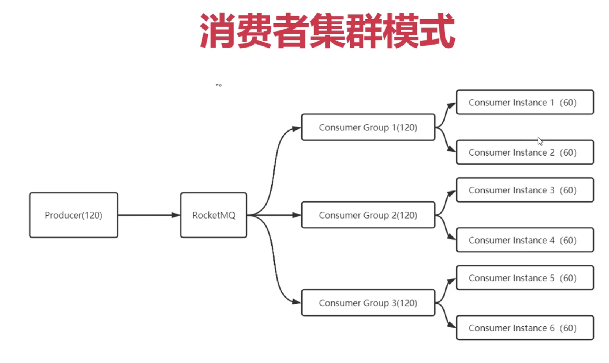
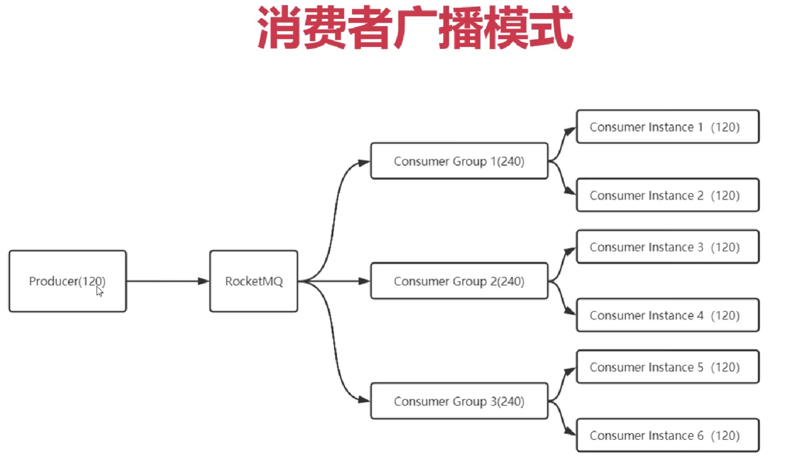

# Rocket的使用

## 1架构图


Broker:代理;消息代理;   MQ服务器，有两个，主和从

slave:奴隶;

dashboard:仪表板


## 2 安装与启动RocketMQ

1.安装JDK 1.8+,配置%JAVA_HOME%环境变量，注意：%JAVA_HOME%中不要出现空格

2.访问https://rocketmq.apache.org/zh/download，下载RocketMQ 5.x最新版Binary压缩包

3.解压缩，配置环境变量%ROCKETMQ_HOME%，指向解压缩目录。**注意**：目录中不能有空格(如：D:\Program Files\Apache)，否则启动时会报错：找不到类

4.使用cmd命令窗口执行"%ROCKETMQ_HOME%/bin/mqnamesrv.cmd",启动NameServer进程，默认使用9876端口  或者**手动点击mqnamesrv.cmd，启动NameServer进程**

5.在%ROCKETMQ_HOME%/conf目录下新建master.properties，增加Broker运行配置文件

代码如下：

~~~properties
#MQ集群名称，同一个集群下的broker要求统一
brokerClusterName=DefaultCluster

#broker名称,唯一标识
brokerName=broker-a

#brokerId=0代表主节点，大于零代表从节点
brokerId=0

#删除日志文件时间点，默认凌晨 4 点
deleteWhen=04

#日志文件保留时间，默认 48 小时
fileReservedTime=48

# 配置Broker主从复制的策略
#- ASYNC_MASTER 异步复制Master
#- SYNC_MASTER 同步双写Master
brokerRole=SYNC_MASTER

# 刷盘方式(消息写入MQ磁盘时的通知方式)
#- ASYNC_FLUSH 异步刷盘，性能好,但是宕机时会丢数据(Broker还没有完成把消息写入磁盘的工作就给生产者返回ack确认的消息)
#- SYNC_FLUSH 同步刷盘，性能较差，但是不会丢数据(Broker完成了把消息写入磁盘的工作后才给生产者返回ack确认的消息)
flushDiskType=SYNC_FLUSH

#末尾追加，NameServer节点列表，使用分号分割  配置NameServer运行的ip与端口，节点启动时向这个位置进行注册
namesrvAddr=localhost:9876

autoCreateTopicEnable=true
~~~


6.

在%ROCKETMQ_HOME%/bin目录下面执行：表示**以master.properties作为配置文件执行mqbroker.cmd脚本**

~~~ssh
mqbroker.cmd -c ../conf/master.properties
~~~

或者

- 执行命令：‘start mqbroker.cmd -n 127.0.0.1:9876 autoCreateTopicEnable=true’

> 注意：假如弹出提示框提示‘错误: 找不到或无法加载主类 xxxxxx’。打开runbroker.cmd，然后将‘%CLASSPATH%’加上英文双引号。


打开 `runbroker.cmd` 与runserver进行相同的修改

 原本：


```
set "JAVA_OPT=%JAVA_OPT% -cp %CLASSPATH%"
```

修改后：

```
set "JAVA_OPT=%JAVA_OPT% -cp "%CLASSPATH%""
```


7.**运行测试工具tools.cmd验证接入过程**

首先执行：建立一个会话级别的环境变量

```
SET NAMESRV_ADDR=localhost:9876
```

然后执行：模拟一个生产者向MQ发送数据

```
tools.cmd org.apache.rocketmq.example.quickstart.Producer
```

最后执行：模拟一个消费者消费MQ的数据

```
tools.cmd org.apache.rocketmq.example.quickstart.Consumer
```

## 3 SpringBoot整合RocketMQ

流程：


配置配置文件：设置com.imooc包下的日志输出级别为debug


~~~yaml
spring:
	application:
		name: cpp
server:
	port: 8000
logging:
	level:
		root: info # 采用默认info级别对普遍日志进行输出
		com.imooc: debug # 自己写的类使用debug级别进行输出，更加详细
~~~


依赖：版本要与本地下载的RocketMQ保持一致

~~~xml
<dependency>
<groupId>org.apache.rocketmq</groupId>
<artifactId>rocketmq-client</artifactId>
<version>5.0.0</version>
</dependency>
~~~

 ### 3.1 实例化MQProducer对象

写在CPPApplication.class中(最好新建一个配置类)，在程序启动时运行下面的代码把bean注入到ioc容器中:

~~~java
@Bean
public DefaultMQProducer producer (){
    //创建一个生产者并且放在pg1生产者组中，5.0版本的RocketMQ已经舍弃了生产者组的概念
    // 不指定生产者组名的话，会使用默认的组名，然后报错不能使用默认的组名
    DefaultMQProducer producer = new DefaultMQProducer("pg1");
    // 配置nameServer的地址来查询主MQ服务器
    producer.setNamesrvAddr ("localhost:9876");
    try{
        // 与主Broker建立长连接进行稳定通信
        producer.start();
        log.debug("Producer己启动成功")；
    } catch (MQClientException e){
    	throw new RuntimeException(e);
    }
    return producer;
}
~~~

### 3.2 构建Message对象并且发送

~~~java
@Resource
private DefaultMQProducer producer;

public void publish(Chapter chapter){
    log.debug("Chapter已处理完毕，准备推送至Broker");
    //序列化对象，// 把内存中存储的二进制对象序列化为容易传输的JSON对象
    ObjectMapper mapper = new ObjectMapper();
    //设置对对象中为null的属性不进行序列化
    mapper.setSerializationInclusion (JsonInclude.Include.NON NULL);
    try{
        ChapterWrapper chapterWrapper = new ChapterWrapper(chapter);
        // 把chapterWrapper包装类处理后的chapter对象序列化为JSON字符串并且接收
        String portalData = mapper.writeValueAsString(chapterWrapper.getObject("PORTAL"));
        //构建Message对象,参数分别为：主题、标签（用于数据筛选）、要传输JSON字符串的字节数组(二进制数据)
        Message portalMessage = new Message ("PORTAL","",portalData.getBytes());
        //发送信息并接收发送结果
        SendResult portalResult  = producer.send(portalMessage);
        log.debug("PORTAL主题消息己发送：MsgId:",+portalResult.getMsgId()+",发送状态："+portalResult.getSentResult());
        }catch (Exception e){
            1og.error("MQ消息异常"，e);
            throw new RuntimeException(e);
        }
}
~~~

消费消息:

流程：


### 3.3 实例化MQConsumer对象并进行消费

具体操作：

~~~java
    // 在配置类中把消费者对象注入容器
    // 设置命名服务器
    // 设置要订阅的主题
    // 设置消费监听函数 、 消费逻辑（把消息中的JSON字符串反序列化为对象）、消费结果
    // 启动消费者，与Broker建立长连接
~~~


~~~java
@Bean
public MQConsumer mqComsumer(){
    //推送模式：push表示以推送的方式通知消费者消费对象(实时性好，Borker一旦收到消息就会进行推送)  "cg-portal"表示分组名称
    DefaultMQPushConsumer consumer = new DefaultMQPushConsumer("cg-portal")
    try{
        //序列化对象，把对象序列化为容易传输的JSON字符串或者把JSON字符串还原为对象
    	ObjectMapper mapper = new ObjectMapper();
        consumer.setNamesrvAddr("localhost:9876");
        //设置订阅PORTAL主题的消息，*表示接收所有的消息不进行过滤
        consumer.subscribe("PORTAL","*")
        //默认为集群模式（同一个组下的消费者实例负载均衡的消费消息）
        consumer.setMessageModel(MessageModel.CLUSTERING);
        //设置消费者如何消费 有消息到来时自动触发consumeMessage方法
        consumer.registerMessageListener(new MessageListenerConcurrently(){
            @Override
            public ConsumeConcurrentlyStatus consumeMessage(List<MessageExt> msgs,ConsumeConcurrentlyContext context){
                    try{
                        //进行消费
                        for (MessageExt msg:list){
                            //msg.getBody()即消息的二进制数据,返回byte[],格式为JSON字符串
                            log.debug("接收到新章节数据："+msg.getMsgId()+"==>"+new String(msg.getBody()));
                            //把JSON字符串的二进制数据还原为Chapter对象
                            Chapter chapter = mapper.readvalue(msg.getBody(),Chapter.class);
                            log.debug(chapter);
                        }
                        //告诉Broker消息己被接收确认,对应的消息可以删除了
                        return ConsumeConcurrentlyStatus.CONSUME_SUCCESS;
                    }catch(Exception e){
                        1og.error("接收章节异常"，e);
                        //告诉Broker延后一段时间再发送一次信息，再次尝试进行消费
                        return ConsumeConcurrentlyStatus.RECONSUME_LATER;
                    }
            }
        });
        //启动消费者，与Broker建立长连接
        consumer.start();
        log.debug("Comsumer启动成功");
    }catch((Exception e){
        throw new Runtime(Exception(e);
    }
    return comsumer;
}
~~~

#### 广播模式与集群模式

#### 

**集群模式**：生产者发送同一主题的120条信息给RocketMQ,三个消费者组都订阅了这个主题，在集群模式下，120条信息被**负载均衡**的分发给消费者，每个消费者60条来进行消费。消费者组中的消费者都是进行**相同的处理**时使用这个模式。

**广播模式**：在广播模式下，一条消息会发送给 **同一个消费组中的所有消费者**，即每个消费者消费120条信息。消费者组中的消费者都是进行**不同的处理**时使用这个模式。



设置方式：

~~~java
        DefaultMQPushConsumer consumer = new DefaultMQPushConsumer("cg-portal")
		//默认为集群模式（同一个组下的消费者实例负载均衡的消费消息）
        consumer.setMessageModel(MessageModel.CLUSTERING);
        
        //设置广播(主题)模式:（同一个组下的每个消费者实例都接收所有的消息）
		consumer.setMessageModel(MessageModel.BROADCASTING);
~~~


#### push模式与pull模式

push模式：

1. 由Broker主动向消费者推送最新的消息，代码接入非常简单，适合大部分业务场景
2. 但代码灵活性差（不能控制发送消息的频次、发送数据包的大小）

pull模式：

1. DefaultMQPullConsumer,需要用户主动从Broker中Pull消息和消费消息，提交消费位点
2. 用户主动Pull消息，自主管理位点，可以灵活地掌控消费进度和消费速度，适合流计算、消费特别耗时等特殊的消费场景
3. 缺点显而易见，需要从代码层面精准地控制消费，对开发人员有一定要求

设置方式：

~~~java
    //推送模式：push表示以推送的方式通知消费者消费对象(实时性好，Borker一旦收到消息就会进行推送)  "cg-portal"表示分组名称
    DefaultMQPushConsumer consumer = new DefaultMQPushConsumer("cg1");
	DefaultMQPullConsumer consumer = new DefaultMQPullConsumer("cg2");
        
~~~


### 可能的报错

#### 1 rocketmq.remoting.exception.RemotingTooMuchRequestException: sendDefaultImpl call timeout

**解决方案：设置生产者发送消息的超时时间长一点。**

~~~java
producer.setSendMsgTimeout(60000);
~~~


## 4 RocketMQ原理


## 5 理论知识

### 中间件是什么？

我们知道操作系统中的进程通信的一种很重要的方式就是消息队列。我们这里提到的消息队列稍微有点区别，更多指的是各个服务以及系统内部各个组件/模块之前的通信，属于一种 **中间件** 。

简单来说：**中间件就是一类为(应用)软件服务的软件，应用软件是为用户服务的，用户不会接触或者使用到中间件。**

**消息队列常用发布-订阅模式工作，消息发送者（生产者）发布消息，一个或多个消息接受者（消费者）订阅消息。**

**备注：** 不要认为消息队列只能利用发布-订阅模式工作，只不过在解耦这个特定业务环境下是使用发布-订阅模式的。除了发布-订阅模式，还有点对点订阅模式（一个消息只有一个消费者）等...


### 消息队列的好处
通常来说，使用消息队列能为我们的系统带来下面**三点好处**：

1. **通过异步处理提高系统性能（减少响应所需时间）**

   例如：将用户的请求数据存储到消息队列之后就立即返回结果。随后，系统再对消息进行消费。而不是消费完后再返回结果进行提示。

2. **削峰/限流**  例如：先将短时间高并发产生的事务消息存储在消息队列中，然后后端服务再慢慢根据自己的能力去消费这些消息，这样就避免直接把后端服务打垮掉。

3. **降低系统耦合性。**消息发送者（生产者）和消息接受者（消费者）之间没有直接耦合**，消息发送者将消息发送至分布式消息队列即结束对消息的处理，消息接受者从分布式消息队列获取该消息后进行后续处理，并不需要知道该消息从何而来。**对新增业务，只要对该类消息感兴趣，即可订阅该消息，对原有系统和业务没有任何影响，从而实现网站业务的可扩展性设计。


为了避免消息队列服务器宕机造成消息丢失，会将成功发送到消息队列的消息存储在消息生产者服务器上（磁盘上？），等消息真正被消费者服务器处理后才删除消息。在消息队列服务器宕机后，生产者服务器会选择分布式消息队列服务器集群中的其他服务器发布消息。

### 使用消息队列会带来哪些问题？


**系统可用性降低：** **系统可用性在某种程度上降低**(为什么这样说呢？在加入 MQ 之前，你不用考虑消息丢失或者说 MQ 挂掉等等的情况，但是，引入 MQ 之后你就需要去考虑了！)，要保证 HA(高可用)？是不是要搞集群？那么我 **整个系统的复杂度上升了** 

**系统复杂性提高：** 加入 MQ 之后，你需要保证消息没有被重复消费、处理消息丢失的情况、保证消息传递的顺序性等等问题！

**一致性问题：** 我上面讲了消息队列可以实现异步，消息队列带来的异步确实可以提高系统响应速度。但是，万一消息的真正消费者并没有正确消费消息怎么办？这样就会导致数据不一致的情况。

那么，又 **如何解决重复消费消息的问题** 呢？

如果我们此时的消息需要保证严格的顺序性怎么办呢？比如生产者生产了一系列的有序消息(对一个 id 为 1 的记录进行删除增加修改)，但是我们知道在发布订阅模型中，**对于主题是无顺序的（不是队列先进先出吗？）**，那么这个时候就会导致对于消费者消费消息的时候没有按照生产者的发送顺序消费，比如这个时候我们消费的顺序为修改删除增加，如果该记录涉及到金额的话是不是会出大事情？

那么，又 **如何解决消息的顺序消费问题** 呢？

就拿我们上面所讲的分布式系统来说，用户购票完成之后是不是需要增加账户积分？在同一个系统中我们一般会使用事务来进行解决，如果用 `Spring` 的话我们在上面伪代码中加入 `@Transactional` 注解就好了。但是在不同系统中如何保证事务呢？总不能这个系统我扣钱成功了你那积分系统积分没加吧？或者说我这扣钱明明失败了，你那积分系统给我加了积分。

那么，又如何 **解决分布式事务问题** 呢？

我们刚刚说了，消息队列可以进行削峰操作，那如果我的消费者如果消费很慢或者生产者生产消息很快，这样是不是会将消息堆积在消息队列中？

那么，又如何 **解决消息堆积的问题** 呢？


### JMS 两种消息模型

JMS（JAVA Message Service,java 消息服务）是 Java 的消息服务，JMS 的客户端之间可以通过 JMS 服务进行异步的消息传输。**JMS（JAVA Message Service，Java 消息服务）API 是一个消息服务的标准或者说是规范**，允许应用程序组件基于 JavaEE 平台创建、发送、接收和读取消息。它使分布式通信耦合度更低，消息服务更加可靠以及异步性。


#### 点到点（P2P）模型

队列模型

使用**队列（Queue）\**作为消息通信载体；满足\**生产者与消费者模式**，一条消息只能被一个消费者使用，未被消费的消息在队列中保留直到被消费或超时。

如果我们此时我们需要将一个消息发送给多个消费者(比如此时我需要将信息发送给短信系统和邮件系统)，这个时候单个队列即不能满足需求了。当然你可以让 `Producer` 生产消息放入多个队列中，然后每个队列去对应每一个消费者。问题是可以解决，创建多个队列并且复制多份消息是会很影响资源和性能的。而且，这样子就会导致生产者需要知道具体消费者个数然后去复制对应数量的消息队列，这就违背我们消息中间件的 **解耦** 这一原则。

#### 发布订阅模型（Pub/Sub）

发布/订阅（Pub/Sub）模型

发布订阅模型（Pub/Sub） 使用**主题（Topic）**作为消息通信载体，类似于**广播模式**；发布者发布一条消息，该消息通过主题传递给所有的订阅者。


## RPC 和消息队列的区别

RPC 和消息队列都是分布式微服务系统中重要的组件之一，下面我们来简单对比一下两者：

- **从用途来看**：RPC 主要用来解决两个服务的远程通信问题，不需要了解底层网络的通信机制。通过 RPC 可以帮助我们调用远程计算机上某个服务的方法，这个过程就像调用本地方法一样简单。消息队列主要用来降低系统耦合性、实现任务异步、有效地进行流量削峰。
- **从通信方式来看**：RPC 是双向直接网络通讯，消息队列是单向引入中间载体的网络通讯。
- **从架构上来看**：消息队列需要把消息存储起来，RPC 则没有这个要求，因为前面也说了 RPC 是双向直接网络通讯。
- **从请求处理的时效性来看**：通过 RPC 发出的调用一般会立即被处理，存放在消息队列中的消息并不一定会立即被处理。

RPC 和消息队列本质上是网络通讯的两种不同的实现机制，两者的用途不同


### 消息队列能用来干什么？

1 我们只需要传达一个消息就可以干其他事情了，这是一个 **异步** 的概念。


2 解耦

在生产者这边我们只需要关注 **生产消息到指定主题中** ，而 **消费者只需要关注从指定主题中拉取消息** 就行了。


> 如果没有消息队列，每当一个新的业务接入，我们都要在主系统调用新接口、或者当我们取消某些业务，我们也得在主系统删除某些接口调用。有了消息队列，我们只需要关心消息是否送达了队列，至于谁希望订阅，接下来收到消息如何处理，是下游的事情，无疑极大地减少了开发和联调的工作量。

 3 削峰

我们把购买完成的信息发送到消息队列中，而短信系统 **尽自己所能地去消息队列中取消息和消费消息** ，即使处理速度慢一点也无所谓，只要我们的系统没有崩溃就行了。

### **主题模型/发布订阅模型**


`RocketMQ` 通过**使用在一个 `Topic` 中配置多个队列并且每个队列维护每个消费者组的消费位置** 实现了 **主题模式/发布订阅模式** 。

`RocketMQ` 中的 **主题模型** 到底是如何实现的呢？首先我画一张图，大家尝试着去理解一下。


有 `Producer Group`、`Topic`、`Consumer Group` 三个角色，我来分别介绍一下他们。

- `Producer Group` 生产者组：代表某一类的生产者，比如我们有多个秒杀系统作为生产者，这多个合在一起就是一个 `Producer Group` 生产者组，它们一般**生产相同的消息**。
- `Consumer Group` 消费者组：代表某一类的消费者，比如我们有多个短信系统作为消费者，这多个合在一起就是一个 `Consumer Group` 消费者组，它们一般**消费相同的消息**。
- `Topic` 主题：代表一类消息，比如订单消息，物流消息等等。

生产者组中的生产者会向主题发送消息，而 **主题中存在多个队列**，生产者每次生产消息之后是指定主题中的某个队列发送消息的。

**一个队列只会被一个消费者消费**。如果某个消费者挂掉，分组内其它消费者会接替挂掉的消费者继续消费。就像上图中 `Consumer1` 和 `Consumer2` 分别对应着两个队列，而 `Consumer3` 是没有队列对应的，所以一般来讲要控制 **消费者组中的消费者个数和主题中队列个数相同** 。


**每个消费组在每个队列上维护一个消费位置**，有多个消费者组时，消息被一个消费者组消费完之后是不会删除的(因为其它消费者组[其他来的消费者]也需要呀)，它仅仅是为每个消费者组维护一个 **消费位移(offset)** ，每次消费者组消费完会返回一个成功的响应，然后队列再把维护的消费位移加一，这样就不会出现刚刚消费过的消息再一次被消费了。

**为什么一个主题中需要维护多个队列** ？

答案是 **提高并发能力** 。的确，每个主题中只存在一个队列也是可行的。你想一下，如果每个主题中只存在一个队列，这个队列中也维护着每个消费者组的消费位置，这样也可以做到 **发布订阅模式** 。如下图。


但是，这样我生产者是不是只能向一个队列发送消息？又因为需要维护消费位置所以一个队列只能对应一个消费者组中的消费者，这样是不是其他的 `Consumer` 就没有用武之地了？从这两个角度来讲，并发度一下子就小了很多。


## RocketMQ 的架构图


`RocketMQ` 技术架构中有四大角色 `NameServer`、`Broker`、`Producer`、`Consumer` 。

`Broker`：主要负责消息的存储、投递和查询以及服务高可用保证。说白了就是消息队列服务器嘛，生产者生产消息到 `Broker` ，消费者从 `Broker` 拉取消息并消费。

**一个 `Topic` 分布在多个 `Broker`上，一个 `Broker` 可以配置多个 `Topic` ，它们是多对多的关系**。

如果某个 `Topic` 消息量很大，应该给它多配置几个队列(上文中提到了提高并发能力)，并且 **尽量多分布在不同 `Broker` 上，以减轻某个 `Broker` 的压力** 。

`Topic` 消息量都比较均匀的情况下，如果某个 `broker` 上的队列越多，则该 `broker` 压力越大。


`NameServer`：不知道你们有没有接触过 `ZooKeeper` 和 `Spring Cloud` 中的 `Eureka` ，它其实也是一个 **注册中心** ，主要提供两个功能：**Broker 管理** 和 **路由信息管理** 。说白了就是 `Broker` 会将自己的信息注册到 `NameServer` 中，此时 `NameServer` 就存放了很多 `Broker` 的信息(Broker 的路由表)，消费者和生产者就从 `NameServer` 中获取路由表然后照着路由表的信息和对应的 `Broker` 进行通信(生产者和消费者定期会向 `NameServer` 去查询相关的 `Broker` 的信息)。

当然，`RocketMQ` 中的技术架构肯定不止前面那么简单，因为上面图中的四个角色都是需要做集群的。我给出一张官网的架构图，大家尝试理解一下。


其实和我们最开始画的那张乞丐版的架构图也没什么区别，主要是一些细节上的差别。听我细细道来 🤨。

第一、我们的 `Broker` **做了集群并且还进行了主从部署** ，由于消息分布在各个 `Broker` 上，一旦某个 `Broker` 宕机，则该`Broker` 上的消息读写都会受到影响。所以 `Rocketmq` 提供了 `master/slave` 的结构，`salve` 定时从 `master` 同步数据(同步刷盘或者异步刷盘)，如果 `master` 宕机，**则 `slave` 提供消费服务，但是不能写入消息** 

第二、为了保证 `HA` ，我们的 `NameServer` 也做了集群部署，但是请注意它是 **去中心化** 的。也就意味着它没有主节点，你可以很明显地看出 `NameServer` 的所有节点是没有进行 `Info Replicate` 的，在 `RocketMQ` 中是通过 **单个 Broker 和所有 NameServer 保持长连接** ，并且在每隔 30 秒 `Broker` 会向所有 `Nameserver` 发送心跳，心跳包含了自身的 `Topic` 配置信息，这个步骤就对应这上面的 `Routing Info` 。

第三、在生产者需要向 `Broker` 发送消息的时候，**需要先从 `NameServer` 获取关于 `Broker` 的路由信息**，然后通过 **轮询** 的方法去向每个队列中生产数据以达到 **负载均衡** 的效果。

第四、消费者通过 `NameServer` 获取所有 `Broker` 的路由信息后，向 `Broker` 发送 `Pull` 请求来获取消息数据。`Consumer` 可以以两种模式启动—— **广播（Broadcast）和集群（Cluster）**。广播模式下，一条消息会发送给 **同一个消费组中的所有消费者** ，集群模式下消息只会发送给一个消费者。


## RocketMQ 功能特性

### 消息

#### 普通消息

普通消息一般应用于微服务解耦、事件驱动、数据集成等场景，这些场景大多数要求数据传输通道具有**可靠传输**的能力，且**对消息的处理时机、处理顺序没有特别要求**。以在线的电商交易场景为例，上游订单系统将用户下单支付这一业务事件封装成独立的普通消息并发送至 RocketMQ 服务端，下游按需从服务端订阅消息并按照本地消费逻辑处理下游任务。每个消息之间都是相互独立的，且不需要产生关联。


**普通消息生命周期**

- 初始化：消息被生产者构建并完成初始化，待发送到服务端的状态。
- 待消费：消息被发送到服务端，对消费者可见，等待消费者消费的状态。
- 消费中：消息被消费者获取，并按照消费者本地的业务逻辑进行处理的过程。 此时服务端会等待消费者完成消费并提交消费结果，如果一定时间后没有收到消费者的响应，RocketMQ 会**对消息进行重试处理**。
- 消费提交：消费者完成消费处理，并向服务端提交消费结果，服务端**标记当前消息已经被处理（包括消费成功和失败）**。RocketMQ 默认支持保留所有消息，此时**消息数据并不会立即被删除，只是逻辑标记已消费**。**消息在保存时间到期或存储空间不足被删除**前，消费者仍然可以回溯消息重新消费。
- 消息删除：RocketMQ 按照消息保存机制滚动清理最早的消息数据，将消息从物理文件中删除。


#### 定时消息

在分布式定时调度触发、任务超时处理等场景，需要实现精准、可靠的定时事件触发。使用 RocketMQ 的定时消息可以简化定时调度任务的开发逻辑，实现高性能、可扩展、高可靠的定时触发能力。定时消息仅支持在 MessageType 为 Delay 的主题内使用，即**定时消息只能发送至类型为定时消息的主题中，发送的消息的类型必须和主题的类型一致**。

基于定时消息的超时任务处理具备如下优势：

- **精度高、开发门槛低**：基于消息通知方式不存在定时阶梯间隔。可以轻松实现任意精度事件触发，无需业务去重。
- **高性能可扩展**：传统的数据库扫描方式较为复杂，需要频繁调用接口扫描，容易产生性能瓶颈。RocketMQ 的定时消息具有高并发和水平扩展的能力。


**定时消息生命周期**

- 初始化：消息被生产者构建并完成初始化，待发送到服务端的状态。
- 定时中：消息被发送到服务端，和普通消息不同的是，服务端不会直接构建消息索引，而是会将定时消息**单独存储在定时存储系统中**，等待定时时刻到达。
- 待消费：定时时刻到达后，服务端将消息重新写入普通存储引擎，对下游消费者可见，等待消费者消费的状态。
- 消费中：消息被消费者获取，并按照消费者本地的业务逻辑进行处理的过程。 此时服务端会等待消费者完成消费并提交消费结果，如果一定时间后没有收到消费者的响应，RocketMQ 会对消息进行重试处理。
- 消费提交：消费者完成消费处理，并向服务端提交消费结果，服务端标记当前消息已经被处理（包括消费成功和失败）。RocketMQ 默认支持保留所有消息，此时消息数据并不会立即被删除，只是逻辑标记已消费。消息在保存时间到期或存储空间不足被删除前，消费者仍然可以回溯消息重新消费。
- 消息删除：Apache RocketMQ 按照消息保存机制滚动清理最早的消息数据，将消息从物理文件中删除。

**定时消息的实现逻辑需要先经过定时存储等待触发，定时时间到达后才会被投递给消费者。**因此，如果将大量定时消息的定时时间设置为同一时刻，则到达该时刻后会有大量消息同时需要被处理，会造成系统压力过大，导致消息分发延迟，影响定时精度。

#### 顺序消息

**顺序消息仅支持使用 MessageType 为 FIFO 的主题，即顺序消息只能发送至类型为顺序消息的主题中**，发送的消息的类型必须和主题的类型一致。和普通消息发送相比，顺序消息发送必须要设置消息组。（推荐实现 MessageQueueSelector 的方式，见下文）。要保证消息的顺序性需要单一生产者串行发送。

单线程使用 MessageListenerConcurrently 可以顺序消费，多线程环境下使用 MessageListenerOrderly 才能顺序消费。

#### 事务消息

施工中。。。


###  同步刷盘和异步刷盘


如上图所示，在同步刷盘中需要等待一个刷盘成功的 `ACK` ，同步刷盘对 `MQ` 消息可靠性来说是一种不错的保障，但是 **性能上会有较大影响** ，一般地适用于金融等特定业务场景。

而异步刷盘往往是开启一个线程去异步地执行刷盘操作。消息刷盘采用后台异步线程提交的方式进行， **降低了读写延迟** ，提高了 `MQ` 的性能和吞吐量，一般适用于如发验证码等**对于消息保证要求不太高的业务场景**。**或者用于处理一些不太重要的信息**（如：日志、流水...），这些数据量很大，使用异步刷盘大大提高性能，并且即使Broker意外宕机了，也没有什么损失。

一般地，**异步刷盘只有在 `Broker` 意外宕机的时候会丢失部分数据(消息还没有写入磁盘就返回了ACK,生产者就不会重发消息了)**，你可以设置 `Broker` 的参数 `FlushDiskType` 来调整你的刷盘策略(ASYNC_FLUSH 或者 SYNC_FLUSH)。

### 同步复制和异步复制

上面的同步刷盘和异步刷盘是在单个Borker结点层面的，而同步复制和异步复制主要是指的 `Borker` 主从模式下，**主节点返回消息给客户端的时候是否需要同步从节点？**

- 同步复制：也叫 “同步双写”，也就是说，**只有消息同步双写到主从节点上时才返回写入成功** 。
- 异步复制：**消息写入主节点之后就直接返回写入成功** 。

然而，很多事情是没有完美的方案的，就比如我们进行消息写入的节点越多就更能保证消息的可靠性，但是随之的性能也会下降，所以需要程序员根据特定业务场景去选择适应的主从复制方案。

那么，**异步复制会不会也像异步刷盘那样影响消息的可靠性呢？**

答案是不会的，因为两者就是不同的概念，对于消息可靠性是通过不同的刷盘策略保证的，而像异步同步复制策略仅仅是影响到了 **可用性** 。为什么呢？其主要原因**是 `RocketMQ` 是不支持自动主从切换的，当主节点挂掉之后，生产者就不能再给这个主节点生产消息了,也不能给从节点发送信息**。

比如这个时候采用异步复制的方式，在主节点还未发送完需要同步的消息给从节点的时候主节点挂掉了，这个时候从节点就少了一部分消息。但是此时生产者无法再给主节点生产消息了，**消费者可以自动切换到从节点进行消费**(仅仅是消费)，所以在主节点挂掉的时间只会产生主从结点短暂的消息不一致的情况，降低了可用性，而当主节点重启之后，从节点那部分未来得及复制的消息还会继续复制。

在单主从架构中，如果一个主节点挂掉了，那么也就意味着整个系统不能再生产了。那么这个可用性的问题能否解决呢？**一个主从不行那就多个主从的呗**，别忘了在我们最初的架构图中，每个 `Topic` 是分布在不同 `Broker` 中的。但是这种复制方式同样也会带来一个问题，那就是无法保证 **严格顺序** 。而在 `RocketMQ` 中采用了 `Dledger` 解决这个问题。他要求在写入消息的时候，要求**至少消息复制到半数以上的节点之后**，才给客⼾端返回写⼊成功，并且它是⽀持通过选举来动态切换主节点的。

### 如何保证消息的一致性与可靠性

针对性的优化策略:

1. 异步刷盘(NSYNC FLUSH),改同步刷盘
2. 避免存储介质(硬盘)损坏，建议采用RAID10（便宜并且在硬盘层面上出现单块损坏时不会出现数据大规模丢失的情况），更加重要的数据可以使用分布式存储（在多个地方备份）甚至SAN介质提供异地容灾
3. 合理的应用限流，避免大量消息积压（1在Broker上设置应用限流，使消息在向应用投递时在一个可控的范围内。2 把积压在Broker上的暂时没办法消费的消息推回生产者）


## 6 RocketMQ-dashBorder监控面板

使用docker一键部署在windows中，默认占用8080端口

~~~shell
docker pull apacherocketmq/rocketmq-dashboard:latest
~~~


注意：设置nameServer的地址时应为：**本机的ip地址：9876,本机的ip地址需要配置使用ipconfig查看到的ipv4地址**，使用localhost或者127.0.0.1会连接docker中RocketMQ-dashBorder监控面板应用直接的地址

