# 微服务


随着我们项目的不断扩大，单体应用似乎显得有点乏力了。

传统单体架构应用随着项目规模的扩大，实际上会暴露越来越多的问题，尤其是一台服务器无法承受庞大的单体应用部署，并且单体应用的维护也会越来越困难，我们得寻找一种新的开发架构来解决这些问题了。

### 微服务是什么?

“微服务”架构，它是一种全新的架构风格。

#### 4级 优点

- 微服务把一个庞大的单体应用拆分为一个个的小型服务，比如我们原来的图书管理项目中，有登录、注册、添加、删除、搜索等功能，那么我们可以将这些功能单独做成一个个小型的SpringBoot项目，独立运行。
- 每个小型的微服务，都可以独立部署和升级，这样，就算整个系统崩溃，那么也只会影响一个服务的运行。
- 微服务之间使用HTTP进行数据交互，不再是单体应用内部交互了，虽然这样会显得更麻烦，但是带来的好处也是很直接的，甚至能突破语言限制，使用不同的编程语言进行微服务开发，只需要使用HTTP进行数据交互即可。
- 我们可以同时购买多台主机来分别部署这些微服务，这样，单机的压力就被分散到多台机器，并且每台机器的配置不一定需要太高，这样就能节省大量的成本，同时安全性也得到很大的保证。
- 甚至同一个微服务可以同时存在多个，这样当其中一个服务器出现问题时，其他服务器也在运行同样的微服务，这样就可以保证一个微服务的高可用。

#### 缺点

优点的背后也存在着诸多的问题：

- 要实现微服务并不是说只需要简单地将项目进行拆分，我们还需要考虑对各个微服务进行管理、监控等，S这样我们才能够及时地寻找和排查问题。因此微服务往往需要的是一整套解决方案，包括服务注册和发现、容灾处理、负载均衡、配置管理等。
- 它不像单体架构那种方便维护，由于部署在多个服务器，我们不得不去保证各个微服务能够稳定运行，在管理难度上肯定是高于传统单体应用的。
- 在分布式的环境下，单体应用的某些功能可能会变得比较麻烦，比如分布式事务。

所以，为了更好地解决这些问题，SpringCloud正式登场。

#### SpringCloud

SpringCloud是Spring提供的一套**分布式解决方案**，集合了一些大型互联网公司的开源产品，包括诸多组件，共同组成SpringCloud框架。并且，它利用Spring Boot的开发便利性巧妙地简化了分布式系统基础设施的开发，如服务发现注册、配置中心、消息总线、负载均衡、熔断机制、数据监控等，都可以用Spring Boot的开发风格做到一键启动和部署。

由于中小型公司没有独立开发自己的分布式基础设施的能力，使用SpringCloud解决方案能够以最低的成本应对当前时代的业务发展。


### 微服务的拆分

1. 微服务需要根据业务模块拆分，做到单一职责，不要重复开发相同的业务
2. 微服务可以将业务暴露为接口，供其它微服务使用
3. 不同微服务都应该有自己独立的数据库


## 0 2级 RestTemplate远程调用

### 快速入门

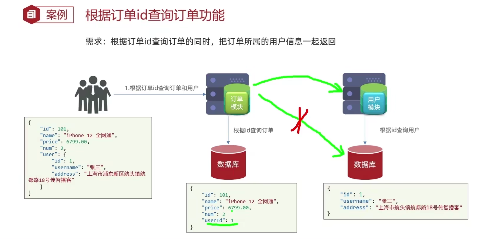

- 基于RestTemplate发起的http请求实现远程调用
- http请求做远程调用是与语言无关的调用，只要知道对方的ip、端口、接口路径、请求参数即可。

如：

在配置类或启动类中注入Bean

~~~java
/**
     * 创建RestTemplate并注入Spring容器
     * @return
     */
    @Bean
    public RestTemplate xxrestTemplate(){
        return new RestTemplate();
    }
~~~


使用：

~~~java
	@Autowired
    private RestTemplate restTemplate;

    /**
     * 使用RestTemplate，向用户项目发起http请求，查询用户
     */
    String xxurl = "http://localhost:8081/user/"+order.getUserId();
    User gguser = restTemplate.getForObject(xxurl, User.class);//第一个参数是路径，第二个参数是把响应后的JSON字符串反序列化为什么类型的对象
    order.setUser(gguser);//把向用户项目拿到的数据封装到这个订单项目
~~~

### 携带token进行远程调用

使用OAuth的资源服务器时,我们在使用RestTemplate进行服务间的远程调用时，会得到以下错误：


实际上这是因为在服务调用时没有携带Token信息，我们得想个办法把用户传来的Token信息在进行远程调用时也携带上，因此，我们可以直接使用OAuth2RestTemplate，它会在请求其他服务时携带当前请求的Token信息。它继承自RestTemplate，这里我们直接定义一个Bean：

```java
@Configuration
public class WebConfiguration {

    @Resource
    OAuth2ClientContext context;

    @Bean
    public OAuth2RestTemplate restTemplate(){
        return new OAuth2RestTemplate(new ClientCredentialsResourceDetails(), context);
    }
}
```

接着我们直接替换掉之前的RestTemplate即可：

```java
@Service
public class BorrowServiceImpl implements BorrowService {

    @Resource
    BorrowMapper mapper;

    @Resource
    OAuth2RestTemplate template;

    @Override
    public UserBorrowDetail getUserBorrowDetailByUid(int uid) {
        List<Borrow> borrow = mapper.getBorrowsByUid(uid);
        User user = template.getForObject("http://localhost:8101/user/"+uid, User.class);
        //获取每一本书的详细信息
        List<Book> bookList = borrow
                .stream()
                .map(b -> template.getForObject("http://localhost:8201/book/"+b.getBid(), Book.class))
                .collect(Collectors.toList());
        return new UserBorrowDetail(user, bookList);
    }
}
```

可以看到服务成功调用了：


# 参考的笔记地址：

https://www.yuque.com/huanfqc/springcloud/springcloud


## 1 Eureka

### eureka工作原理

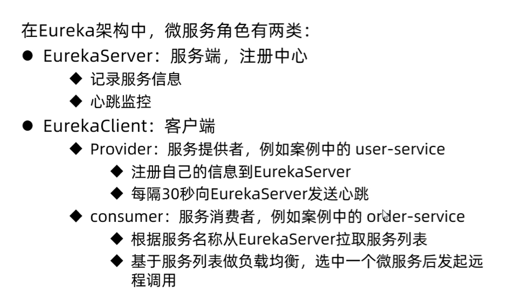


### 启动多个相同程序的方法

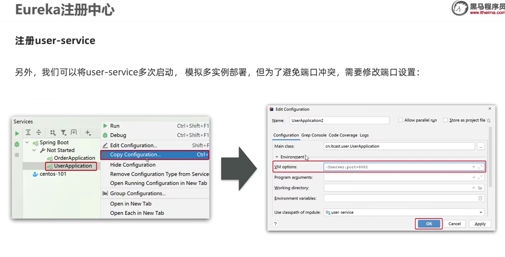


Eureka的注册与发现

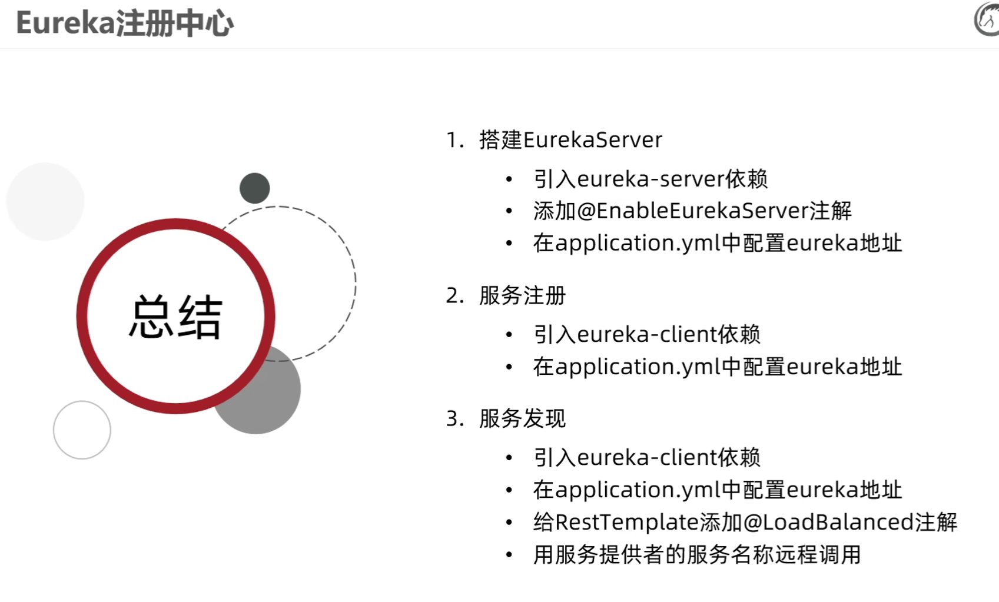

注意：在application.yaml中需要配置eureka地址与服务名称，以后调用时使用这个服务名称动态ip地址与端口号来发起http请求。

## 2 Ribbon

### 3级 Ribbon负载均衡原理

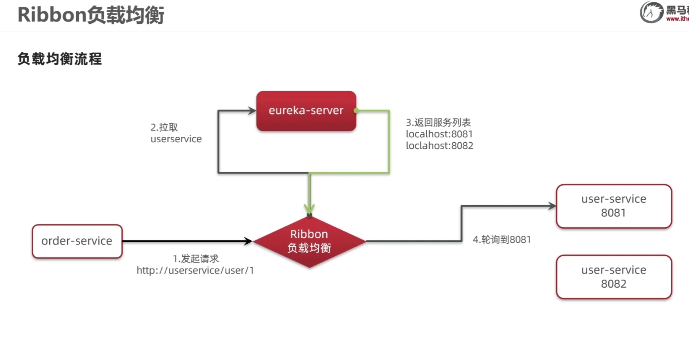

## 3 Nacos

### nacos理论知识

#### 4级 一个完备的服务注册与发现应该具备的功能：

- 服务注册以及服务查询（最基本的）
- 服务状态变更通知、服务健康检查、不可用服务剔除
- 服务权重配置（权重越高被访问的频率越高）

**不可用服务剔除** 。简单来说，注册中心会通过 **心跳机制** 来检测服务是否可用，如果服务不可用的话，注册中心会主动剔除该服务并将变更推送给相关联的服务，更新服务地址信息。

由注册中心负责维护可用服务的列表，通过注册中心动态获取可用服务的地址信息。如果服务信息发生变更，注册中心会将变更推送给相关联的服务，更新服务地址信息，无需手动更新，也不需要重启服务，这些对开发者来说完全是无感的。

#### 服务注册与发现的基本流程是怎样的？

> 这个问题等价于问服务注册与发现的原理。

每个服务节点在启动运行的时候，会向注册中心注册服务，也就是将自己的地址信息（ip、端口以及服务名字等信息的组合）上报给注册中心，注册中心负责将地址信息保存起来，这就是 **服务注册**。


一个服务节点如果要调用另外一个**服务节点**，会直接拿着服务的信息找注册中心要对方的地址信息，这就是 服务发现 。通常情况下，服务节点拿到地址信息之后，还会在本地缓存一份，保证在注册中心宕机时仍然可以正常调用服务。


如果服务信息发生变更，注册中心会将变更推送给相关联的服务，更新服务地址信息。

为了保证服务地址列表中都是可用服务的地址信息，注册中心通常会通过 **心跳机制** 来检测服务是否可用，如果服务不可用的话，注册中心会主动剔除该服务并将变更推送给相关联的服务，更新服务地址信息。

### 3级 1. 安装和启动Nacos

前面已经学习了Eureka注册中心，为什么还要学习Nacos注册中心。

原因: Nacos是阿里巴巴的产品，现在是SpringCloud中的一个组件。相比于Eureka功能更加丰富，在国内受欢迎程度较高

#### windows安装

nacos下载链接

```plain
https://github.com/alibaba/nacos/releases
```

为方便快速下载，可以直接下载我在用的这个

```plain
https://cowtransfer.com/s/a9c841dea9cc42
```

第二步: 查看nacos的启动端口

第三步: 启动nacos。在命令行输入如下。-m表示启动模式，standalone表示单机启动。除了单机启动模式，还有集群启动的模式

```plain
d:
cd D:\Nacos\nacos\bin
startup.cmd -m standalone
```

第四步: 浏览器访问

```plain
http://192.168.127.1:8848/nacos
```


第五步: 浏览器登录进nacos的管理面板


#### 使用Docker部署到Linux中


### nacos快速入门

第一步: 在cloud-demo父工程中添加spring-cloud-alibaba的管理依赖

```xml
<!--nacos管理依赖-->
<dependency>
    <groupId>com.alibaba.cloud</groupId>
    <artifactId>spring-cloud-alibaba-dependencies</artifactId>
    <version>2.2.5.RELEASE</version>
    <type>pom</type>
    <scope>import</scope>
</dependency>
```


第三步: 在order-service和user-service微服务的pom.xml里面，添加nacos的客户端依赖

```xml
<!-- 引入nacos客户端依赖 -->
<dependency>
    <groupId>com.alibaba.cloud</groupId>
    <artifactId>spring-cloud-starter-alibaba-nacos-discovery</artifactId>
</dependency>
```


第四步: 在order-service和user-service微服务的application.yml里面，添加nacos地址

```yaml
spring:
  application:
    # order的服务名称。也就是这个order-service注册到nacos之后，这个order-service会叫什么名字
    name: 服务名称

  # 要写在spring:属性下
  cloud:
    nacos:
      # nacos 服务地址
      server-addr: localhost:8848
```


第五步: 服务注册，启动order-service和user-service微服务。浏览器输入访问地址

```plain
http://192.168.127.1:8848/nacos/index.html#/serviceManagement?dataId=&group=&appName=&namespace=
```


第六步: 服务发现。浏览器输入http://localhost:8080/order/105，多次访问。查看OrderService是否能正常请求UserService并拿到数据。查看负载均衡


### Nacos服务分级存储模型

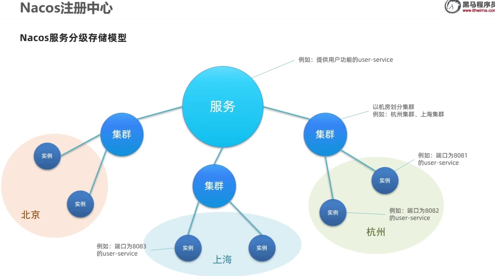

1.Nacos服务分级存储模型

namespace、group下面为：

1. 一级是服务，例如userservice
2. 二级是集群，（按照地域进行划分）例如杭州或上海
3. 三级是实例，例如杭州机房的某台部署了userservice的服务器

如图：

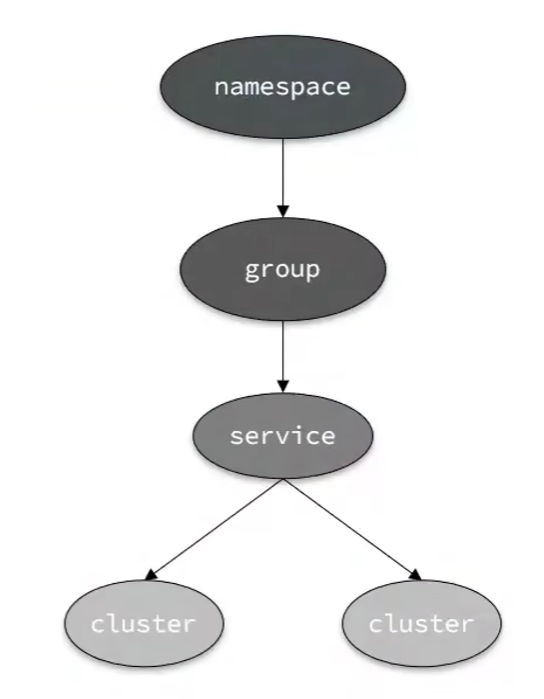

2.如何设置实例的集群属性
①修改application.yml文件，添加spring.cloud.nacos.discovery.cluster-name即可

如：

~~~yaml
spring:
  # 要写在spring:属性下
  cloud:
    nacos:
      # nacos 服务地址
      server-addr: localhost:8848
      # 设置部署到哪一个集群
      discovery:
        # 自定义集群名称。注意不能使用中文，我下面截图使用中文在启动时就报错了，大家记得用英文
        cluster-name: hangzhou
~~~

### nacos配置 优先访问同一个集群下面的服务

配置order-service与user-service处于同一个集群后，再配置IRule为NacosRule,就可以**实现优先访问同一个集群下面的服务**，实在不行再进行跨集群访问。

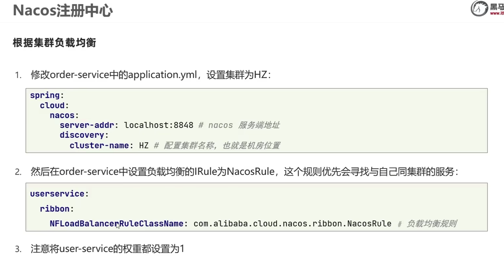


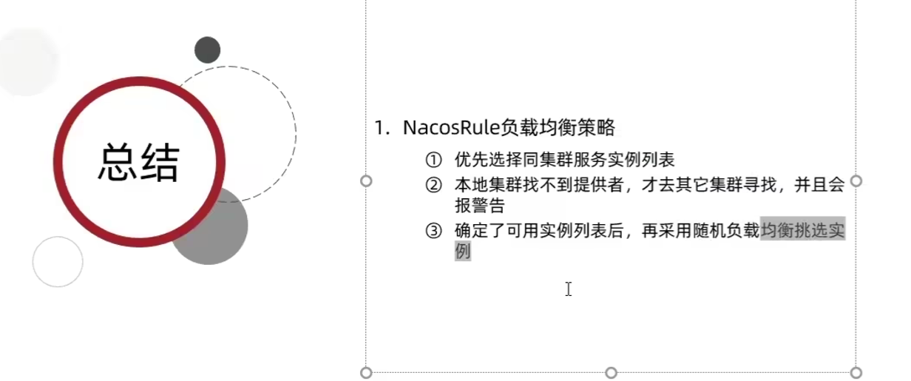


### namespace


service下面就是集群与实例。

1.Nacos环境隔离
① namespace用来做环境隔离
② 每个namespace都有唯一id
③ 不同namespace下的服务不可见


### nacos注册中心细节分析

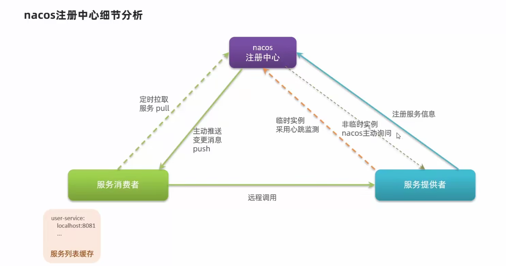

1.Nacos与eureka的共同点

- (1)都支持服务注册和服务拉取
- (2)都支持服务提供者心跳方式做健康检测

2.Nacos与Eureka的区别

- (1)Nacos支持服务端主动检测提供者状态：临时实例采用心跳模式，非临时实例采用主动检测模式
- (2)临时实例心跳不正常会被剔除，非临时实例则不会被剔除
- (3)Nacos支持服务列表变更的消息推送模式，服务列表更新更及时
- (4)Nacos:集群默认采用AP方式，当集群中存在非临时实例时，采用CP模式；Eureka采用AP方式

默认为临时实例，非临时实例的设置方法:

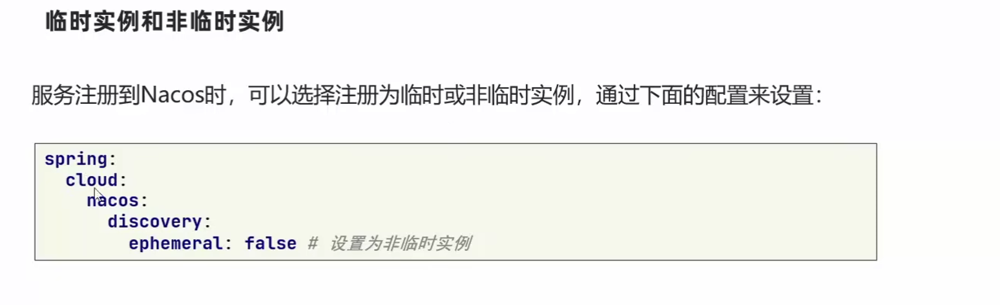


### 3级 Nacosi配置管理
- 统一配置管理
- 配置热更新
- 配置共享
- 搭建Nacos集群

#### Nacos配置管理

从Nacos的配置中心读取公共部分的配置，与本地的组成完整的配置，然后采用热更新，不需要重启就能够生效。

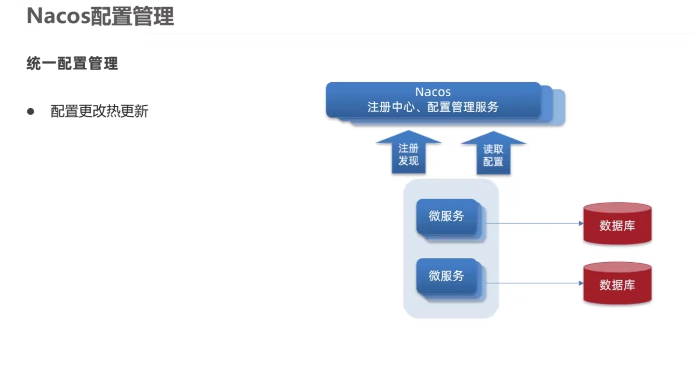

如：

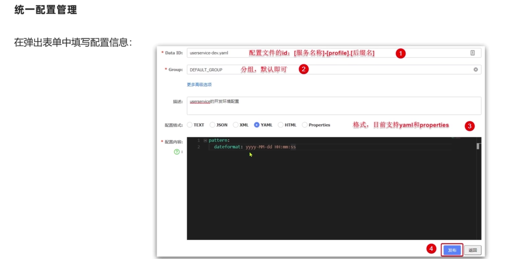


##### 将配置交给Nacos管理

程序获取配置的流程:

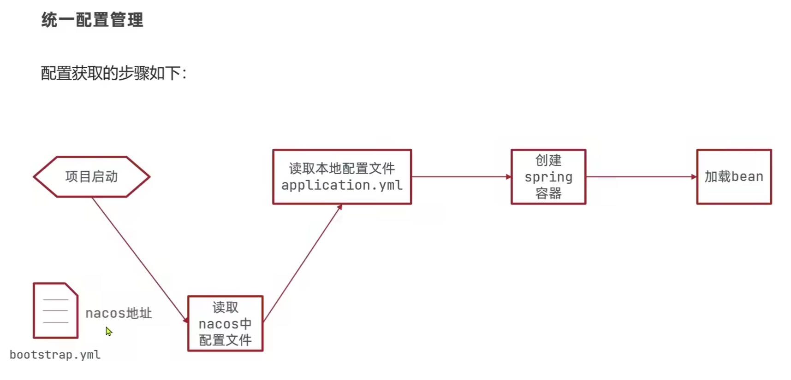

所以配置过程为：

1. 在Nacos中添加配置文件
2. 在微服务中引入nacos的config依赖
3. 在微服务中添加bootstrap.yml,配置nacos地址、当前环境(namespace)、服务名称、文件后缀名。这些决定了程序启动时去nacos读取哪个文件


具体实现：

第一步: 添加如下依赖

```xml
<!--读取nacos配置文件-->
<dependency>
	<groupId>com.alibaba.cloud</groupId>
	<artifactId>spring-cloud-starter-alibaba-nacos-config</artifactId>
</dependency>
```

第二步: 在相应的微服务模块中的resources目录下新建bootstrap.yml：下面配置文件相当于去localhost:8848处寻找UserService-dev.yaml文件

```yaml
spring:
  application:
    # 服务名称
    name: UserService
  profiles:
    # 环境 namespace，dev表示开发环境
    active: dev
  cloud:
    nacos:
      # nacos的服务地址
      server-addr: localhost:8848
      config:
        # 文件后缀名
        file-extension: yaml
```

第三步: 把application.yml中删掉如下。跟刚刚的bootstrap.yml重复的代码给删掉，也就是如果代码重复的话只保留bootstrap.yml的代码

##### 5级 实现热更新

热更新：**Nacos中的配置文件变更**后，微服务**无需重启**就可以感知。

Nacos配置更改后，微服务可以实现热更新，方式：

- 通过@Value注解注入，结合@RefreshScope注解来刷新

- 通过@ConfigurationProperties注入，直接自动刷新

如：

配置文件：

~~~yaml
pattern:
  dateformat: yyyy年MM月dd日 HH:mm:ss
~~~


读取代码：

~~~java
@RestController
@RequestMapping("/user")
@RefreshScope
public class UserController {

    @Autowired
    private UserService userService;
    
    //验证配置拉取是否成功，我们直接在这里去读取拉取过来的配置，如果能拉取就表示验证成功
    @Value("${pattern.dateformat}")
    private String xxdataformat;

    @GetMapping("now")
    public String now(){
        return LocalDateTime.now().format(DateTimeFormatter.ofPattern(xxdataformat));
    }

~~~


注意事项：

- 不是所有的配置都适合放到配置中心，维护起来比较麻烦
- 建议将一些关键参数，需要运行时调整的参数放到nacos配置中心，一般都是自定义配置

##### 多环境共享配置

环境：指下面的spring.profile..active

微服务会从nacos读取的配置文件：

- [服务名]-[spring.profile..active].yaml,环境配置 如：userservive-dev.yaml,userservive-prod.yaml
- [服务名].yaml,默认配置，**多环境共享** 如：userservice.yaml

优先级：

1. [服务名]-[环境].yaml 
2. [服务名].yaml
3. 本地application.yaml配置

#####  搭建nacos集群

架构图：

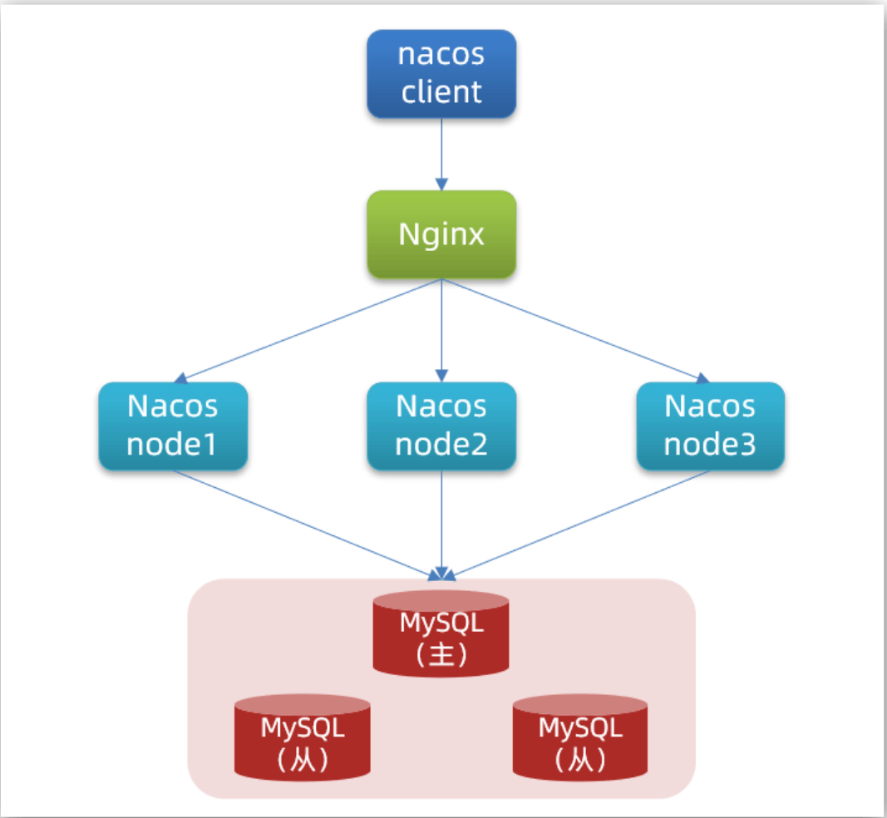

使用nginx实现负载均衡，把数据存储到Mysql集群实现各个Nacos之间的数据共享。

## 4 2级 Feign

### 1 快速入门

Feign的使用步骤:

1. 引入依赖
2. 添加@EnableFeignClients注解(启动starter依赖的自动装配)
3. 编写FeignClient接口(类似springMVC的风格)

Feign是一个声明式的http客户端，作用是帮助我们优雅的实现http请求的发送，解决RestTemplate复杂URL的问题。官网如下

```plain
https://github.com/OpenFeign/feign
```

如何**定义和使用Feign**，具体操作如下:

第一步: 在order-service微服务项目的pom.xml添加如下

```xml
<!--引入feign客户端依赖-->
<dependency>
    <groupId>org.springframework.cloud</groupId>
    <artifactId>spring-cloud-starter-openfeign</artifactId>
</dependency>
```

第二步: 在order-service微服务项目的OrderApplication启动类添加如下

```java
@EnableFeignClients
```


第三步: 在order-service微服务项目的src/main/java/cn/itcast/order目录新建clients.UserClient接口写入如下

```java
package cn.itcast.order.clients;

import cn.itcast.order.pojo.User;
import org.springframework.cloud.openfeign.FeignClient;
import org.springframework.web.bind.annotation.GetMapping;
import org.springframework.web.bind.annotation.PathVariable;

/**
 * @author 35238
 * @date 2023/4/26 0026 17:19
 */
//这个接口就是用来发请求的客户端
@FeignClient("UserService")//括号里面写服务名称，要向哪个服务发送请求
public interface UserClient {
    
    @GetMapping("/user/{id}")
    User xxfindById(@PathVariable("id") Long id);
    
}
```

第四步: 把order-service微服务项目的service目录的OrderService类，修改为如下

```java
package cn.itcast.order.service;

import cn.itcast.order.clients.UserClient;
import cn.itcast.order.mapper.OrderMapper;
import cn.itcast.order.pojo.Order;
import cn.itcast.order.pojo.User;
import org.springframework.beans.factory.annotation.Autowired;
import org.springframework.stereotype.Service;
import org.springframework.web.client.RestTemplate;

@Service
public class OrderService {

    @Autowired
    private OrderMapper orderMapper;
    @Autowired
    private RestTemplate kkrestTemplate;

    @Autowired//Feign远程调用。注入刚写的UserClient接口
    private UserClient xxuserClient;


    public Order queryOrderById(Long orderId) {
        Order order = orderMapper.findById(orderId);

        //---------------------以前的RestTemplate远程调用写法----------------------

        /*
        String xxurl = "http://UserService/user/"+order.getUserId();
        //第一个参数是路径，第二个参数是你想要拿到什么类型的数据
        User gguser = kkrestTemplate.getForObject(xxurl, User.class);
        */

        //------------------------现在的Feign远程调用写法---------------------------

        User gguser = xxuserClient.xxfindById(order.getUserId());

        //----------------------------------------------------------------------

        order.setUser(gguser);
        return order;
    }
}
```


第五步: 测试。浏览器访问http://localhost:8080/order/102，看是UserService微服务是否能请求到UserService服务的数据


#### 配置Feign携带Token访问（使用OAuth2.0）

怎么配置Feign携带Token访问呢？遇到这种问题直接去官方查：https://docs.spring.io/spring-cloud-openfeign/docs/current/reference/html/#oauth2-support，非常简单，两个配置就搞定：

```yaml
feign:
  oauth2:
  	#开启Oauth支持，这样就会在请求头中携带Token了
    enabled: true
    #同时开启负载均衡支持
    load-balanced: true
```


### 2. 自定义Feign的配置

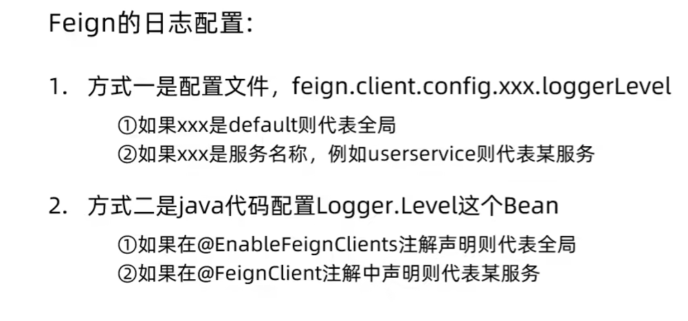


Feign运行自定义配置来覆盖默认配置，可以修改的配置如下表

| 类型                | 作用             | 说明                                                   |
| ------------------- | ---------------- | ------------------------------------------------------ |
| feign.Logger.Level  | 修改日志级别     | 包含四种不同的级别: NONE、BASIC、HEADERS、FULL         |
| feign.codec.Decoder | 响应结果的解析器 | http远程调用的结果做解析，例如把json字符串转为java对象 |
| feign.code.Encoder  | 请求参数编码     | 将请求参数编码，便于通过http请求发送                   |
| feign.Contract      | 支持的注解格式   | 默认是SpringMVC的注解                                  |
| feign.Retryer       | 失败重试机制     | 请求失败的重试机制，默认是没有，不过会使用Ribbon的重试 |

**一般我们需要配置的就是日志级别**。日志的四种日志级别的作用如下

- NONE: 没有任何日志，默认就是NONE
- BASIC: 当发送一次http请求时，会记录该请求是什么时候发的、什么时候结束的、耗时多久等基本信息
- HEADERS: 除了记录基本信息，还会记录请求头、响应头信息
- FULL: 除了记录上面的所有信息，还会记录请求体、响应体信息

【修改日志级别有两种方式】

**第一种方式: 修改配置文件方式**。具体操作如下

第一步: 在order-service微服务项目的application.yml添加如下

```yaml
# 第一种自定义feign配置的方式
feign:
  client:
    config: 
      # default表示OrderService微服务向任意微服务发送请求时，都会以这种生效feign配置
      # 除了default还可以写具体的微服务名，表示当OrderService微服务向特定微服务发送请求时，这种feign配置才会生效
      default:
        # loggerLevel是固定写法，不能改其它名字
        loggerLevel: FULL
```

第二步: 重启order-service微服务，浏览器访问 http://localhost:8080/order/103


**第二种方式: java代码方式**

为避免第一种方式的影响，我们需要先把第一种配置文件的相关代码注释掉


第一步: 在order-service微服务项目的src/main/java/cn/itcast/order目录新建config.DefaultFeignConfiguration类，写入如下

```java
package cn.itcast.order.config;

import feign.Logger;
import org.springframework.context.annotation.Bean;

/**
 * @author 35238
 * @date 2023/4/26 0026 21:03
 */
public class DefaultFeignConfiguration {
    
    @Bean
    public Logger.Level xxlogLevel(){
        //日志级别不演示FULL，看一下BASIC级别的日志信息是什么样的
        return Logger.Level.BASIC;
    }
    
}
```

第二步: 分两种，一种是局部。另一种是全局

局部: 当OrderService微服务向特定微服务发送请求时，这种feign配置才会生效。
那么第二步就应该是在order-service微服务项目的UserClient接口，的@FeignClient注解里面添加如下。只需要修改@FeignClient注解即可

```java
package cn.itcast.order.clients;

import cn.itcast.order.config.DefaultFeignConfiguration;
import cn.itcast.order.pojo.User;
import org.springframework.cloud.openfeign.FeignClient;
import org.springframework.web.bind.annotation.GetMapping;
import org.springframework.web.bind.annotation.PathVariable;

/**
 * @author 35238
 * @date 2023/4/26 0026 17:19
 */
//这个接口就是用来发请求的客户端
@FeignClient(value ="UserService",configuration = DefaultFeignConfiguration.class)//括号里面写服务名称，要向哪个服务发送请求
public interface UserClient {

    @GetMapping("/user/{id}")
    User xxfindById(@PathVariable("id") Long id);

}
```


全局: 不管OrderService微服务向哪个微服务发送请求时，feign配置都会生效。
那么第二步就应该是在order-service微服务项目的OrderApplication启动类添加如下。只需要修改@EnableFeignClients注解即可

```java
package cn.itcast.order;

import cn.itcast.order.config.DefaultFeignConfiguration;
import org.mybatis.spring.annotation.MapperScan;
import org.springframework.boot.SpringApplication;
import org.springframework.boot.autoconfigure.SpringBootApplication;
import org.springframework.cloud.client.loadbalancer.LoadBalanced;
import org.springframework.cloud.openfeign.EnableFeignClients;
import org.springframework.context.annotation.Bean;
import org.springframework.web.client.RestTemplate;

@MapperScan("cn.itcast.order.mapper")
@SpringBootApplication
@EnableFeignClients(defaultConfiguration = DefaultFeignConfiguration.class)
public class OrderApplication {

    public static void main(String[] args) {
        SpringApplication.run(OrderApplication.class, args);
    }


    /**
     * 创建RestTemplate并注入Spring容器
     * @return
     */

    //以后我们都要习惯使用上面这种注释，写法: /**+回车

    @Bean
    @LoadBalanced
    public RestTemplate xxrestTemplate(){
        return new RestTemplate();
    }

}
```


不可以两种都用，要么全局，要么局部。这里以全局为例

第三步: 重启order-service微服务，浏览器访问 http://localhost:8080/order/103


在正常使用的情况下，日志级别建议设置为BASIC。在调试错误的信息，日志级别建议设置为FULL


### 3 Feign的优化

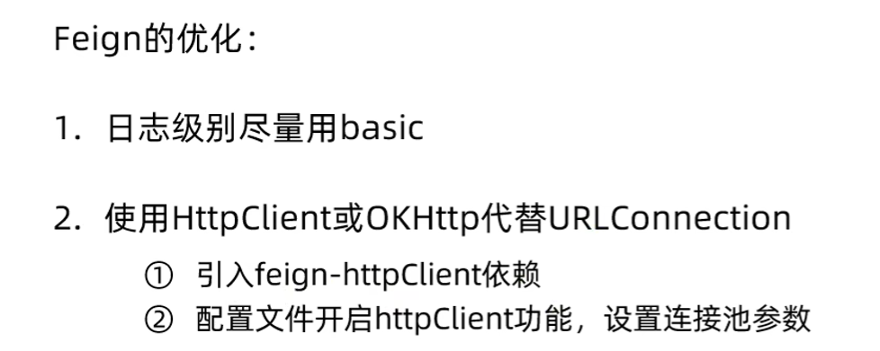

Feign其实是有优化的空间，我们下面就学习如何把Feign进行性能优化。Feign是声明式的客户端，帮助我们把声明变成http请求，但是最终发送http请求时，还是会用到别的一些客户端，默认使用的是URLConnection这种客户端，URLConnection是jdk自带的

Feign的底层实现，或者说Feign的底层客户端实现:

- URLConnection: 默认实现，不支持连接池，性能较差
- Apache HttpClient: 支持连接池(建立连接池可以减少连接创建和销毁的性能损耗，避免连接每次三次握手、断开每次四次挥手)
- OKHttp: 支持连接池

因此优化Feign的性能主要包括:

- 使用连接池代替默认的URLConnection
- 日志级别，最好使用none(默认)或basic，因为日志输出的越多，性能也会有损耗

例如我们把Feign底层客户端换成HttpClient。具体操作如下

第一步: 在order-service微服务项目的pom.xml，添加如下

```xml
<!--引入httpClient依赖-->
<dependency>
    <groupId>io.github.openfeign</groupId>
    <artifactId>feign-httpclient</artifactId>
</dependency>
```

第二步: 在order-service微服务项目的application.yml，添加如下

```yaml
# 更换feign客户端为httpClient
feign:
  httpclient:
    enabled: true #支持HttpClient的开关
    max-connections: 200 #最大连接数
    max-connections-per-route: 50 #请求路径的最大连接数
```


启动效果跟前面一样的，这里只是改变了连接池

### 4 Feign的最佳实践

方式一: 

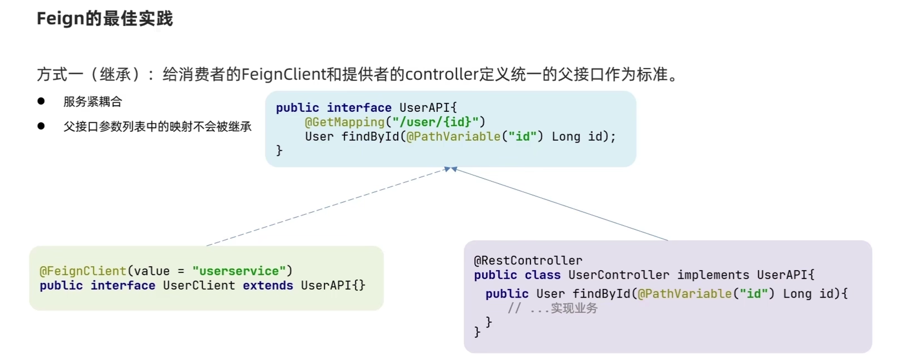

缺点：耦合在一起了，一旦父接口需要修改，那么下面的子接口、类全部需要修改。

方式二: 

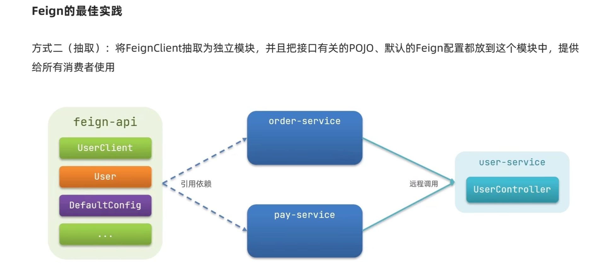

缺点：无论客户端要调用多少种服务端，每次导入的依赖都包含全部的接口，没有使用到的接口显的十分冗余。


第一种解决方式: 在order-service项目的启动类，指定FeignClient所在包(扫描整个包，注入Bean容器中)，适合于有多个UserClient时，缺点是会把其它用不上的UserClient也加入进来

```java
@EnableFeignClients(basePackage = "cn.itcast.feign.clients")
```

第二种解决方式: 在order-service项目的启动类，指定FeignClient字节码，也就是直接指定扫描哪个写好的UserClient，也可以指定多个。推荐这种解决方案

```java
@EnableFeignClients(clients = {UserClient.class})
```


## 5 sentinel流量控制

sentinel是用来做限流、隔离、降级、熔断的功能。本质要做的就是统计数据和规则判断

### 3级 1. 雪崩问题

在微服务调用链路中的某个服务故障，引起整个链路中的所有微服务都不可用，称为雪崩


解决雪崩问题的常见方式有四种

1、超时处理: 设定超时时间，请求超过时间没有响应就返回错误信息，不会无休止等待。新的超时连接数/s 大于 释放的超时连接数/s 时，还是会耗尽整个tomcat的资源,最后导致雪崩

2、舱壁模式: 限定每个业务能使用的线程数，避免耗尽整个tomcat的资源，因此也叫线程隔离。完全解决雪崩，但是资源利用不好

3、熔断降级: 由熔断器统计业务执行的异常比例，如果超出阈值则会熔断该业务，拦截访问该业务的一切请求。完全解决雪崩

4、流量控制: 限制业务访问的QPS(每秒钟处理的请求数量)，避免服务因流量的突增而故障。根源解决雪崩，使用的是Sentinel

总结：

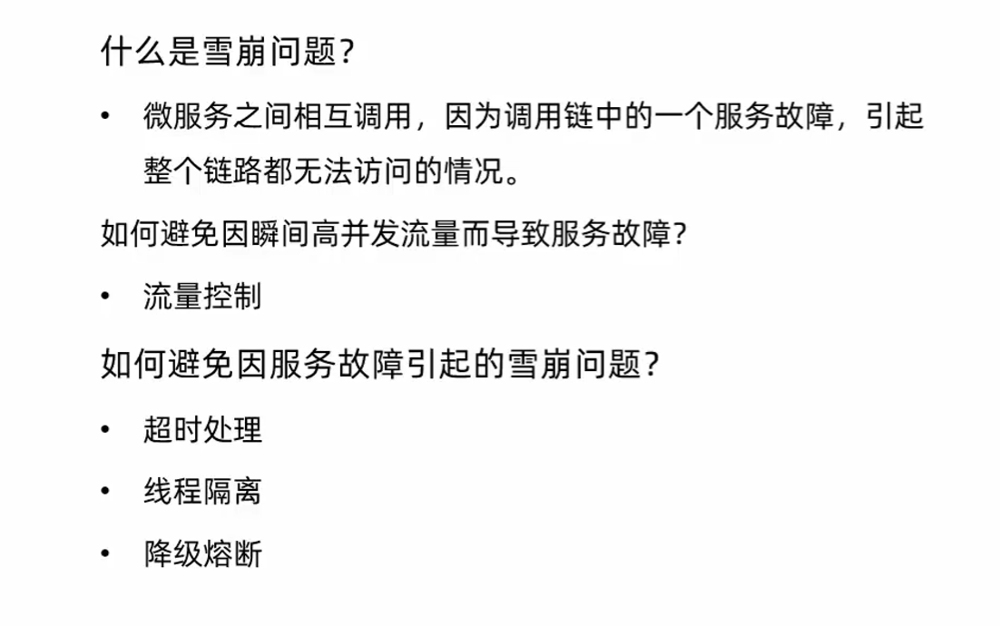


### 2 安装启动Sentinel

sentinel官方提供了UI控制台，方便我们对系统做限流设置

```plain
sentinel-dashboard-1.8.1.jar下载: https://cowtransfer.com/s/14e414d742ae4b
```

在D盘新建sentinel-dashboard目录，把下载的jar包粘贴进sentinel-dashboard目录，win+r输入如下

```plain
d:
cd sentinel-dashboard
java -jar sentinel-dashboard-1.8.1.jar
```


登录sentinel控制台


修改sentinel的默认端口、用户、密码

```shell
java -jar sentinel-dashboard-1.8.1.jar -Dserver.port=8090 #这条命令我这边运行是无效的，指定不了端口
java -jar sentinel-dashboard-1.8.1.jar --server.port=8090
```

| 配置项                           | 默认值   | 说明       |
| -------------------------------- | -------- | ---------- |
| server.port                      | 8080     | 服务端口   |
| sentinel.dashboard.auth.username | sentinel | 默认用户名 |
| sentinel.dashboard.auth.password | sentinel | 默认密码   |

### 3 整合sentinel
导入依赖：

```xml
<!--整合sentinel-->
<dependency>
	<groupId>com.alibaba.cloud</groupId>
	<artifactId>spring-cloud-starter-alibaba-sentinel</artifactId>
</dependency>
```

添加配置：

```yaml
spring:
 cloud:
    sentinel:
      transport:
        dashboard: localhost:8080
```


浏览器访问(多访问几次，等下sentinel监控曲线才会更明显)order-service微服务的**任意端点(Endpoint,相当于Controller层中的每个接口)**，触发sentinel监控

### 4 流量控制的配置

**簇点链路**

就是项目内的调用链路，链路中被监控的每个接口就是一个资源。默认情况下sentinel会监控SpringMVC的每一个端点（Endpoint），因此SpringMVC的每一个端点（Endpoint）就是调用链路中的一个资源流控、熔断等都是针对簇点链路中的资源来设置的。

#### 直接模式

**流控模式**

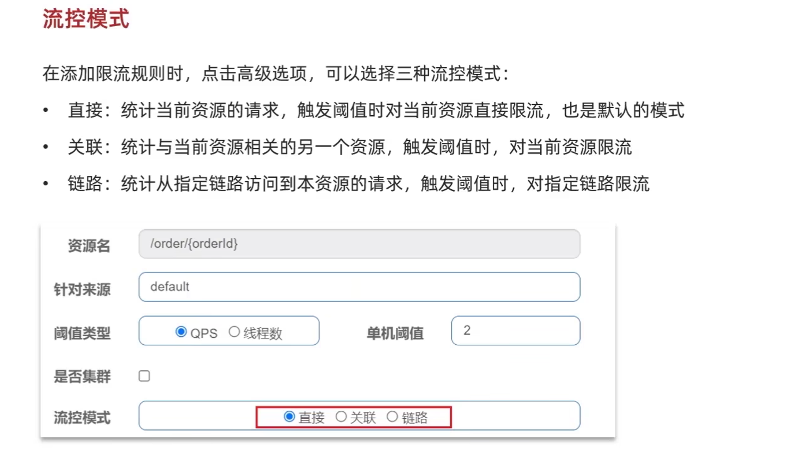


#### 关联模式

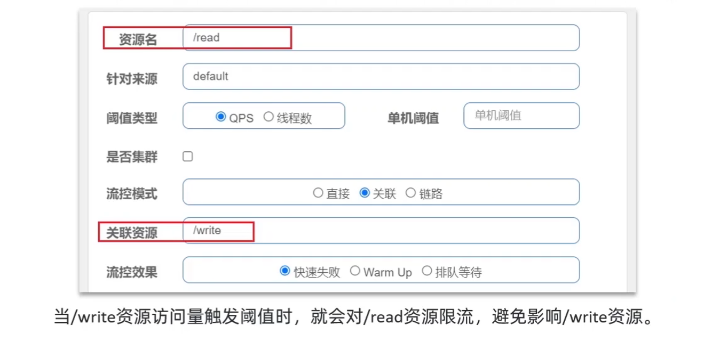

**注意**：给谁限流就给谁添加流控规则。比如：上面的就是给/read添加关联模式的流控规则，因为满足一定条件时要给/read资源限流。

**总结**: 什么时候需要在限流规则里使用 '关联模式'

1、两个有竞争关系的资源

2、一个优先级高，另一个优先级低，当优先级高的被大量访问时，对限流优先级低的那个做限流

#### 4级 链路模式

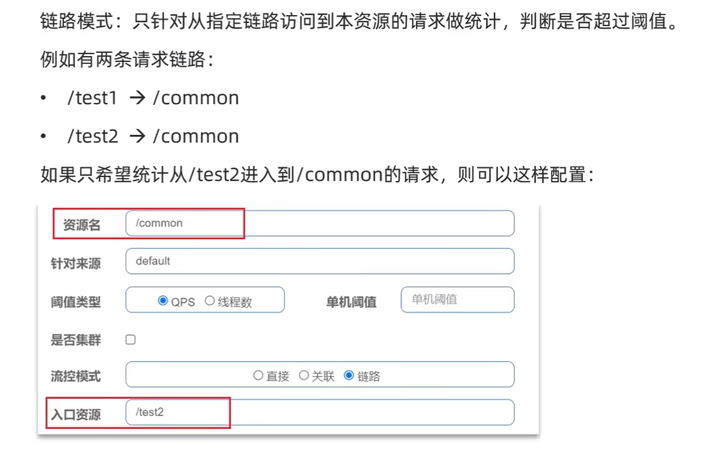

上面的配置表示：当从/test2进来访问/common资源的请求达到设置的阈值时，会对访问/test2的请求进行限流。

**需求**: 有查询订单和创建订单业务，两者都需要查询商品。针对从查询订单进入到查询商品的请求统计，并设置限流

具体步骤如下

1、在OrderService中添加一个queryGoods方法，不用实现业务
2、在OrderController中，改造/order/query端点，调用OrderService中的queryGoods方法
3、在OrderController中添加一个/order/save的端点，调用OrderService的queryGoods方法
4、**给queryGoods设置限流规则**，从/order/query进入queryGoods的方法限制QPS必须小于2

具体操作如下

第一步: 在order-service的OrderService类添加注解来标记Service层的资源，如下：

```java
@SentinelResource("goods")
public void xxqueryGoods(){
	System.out.println("查询商品");
}
```

第二步: 在order-service的application.yml修改一下

```yaml
web-context-unify: false # 关闭context整合，就不会把使用资源都存放到web链路这一个中链路了
```


第三步: 在order-service的的OrderController类的xxqueryOrder、xxupdateOrder方法修改为如如下

```java
@GetMapping("/query")
public String xxqueryOrder(){
    //查询商品
	orderService.xxqueryGoods();
	System.out.println("查询订单");
	return "查询订单成功";
}

@GetMapping("/save")
public String xxsaveOrder(){
    //查询商品
    orderService.xxqueryGoods();
    System.out.println("新增订单");
    return "新增订单成功";
}

@GetMapping("/update")
public String xxupdateOrder(){
    return "更新订单成功";
}
```

第四步: 重新运行OrderApplication引导类，然后浏览器访问 http://localhost:8088/order/query、save


第五步: 在浏览器的sentinel添加限流规则，模式为链路模式


### 5 流控效果

#### 快速失败


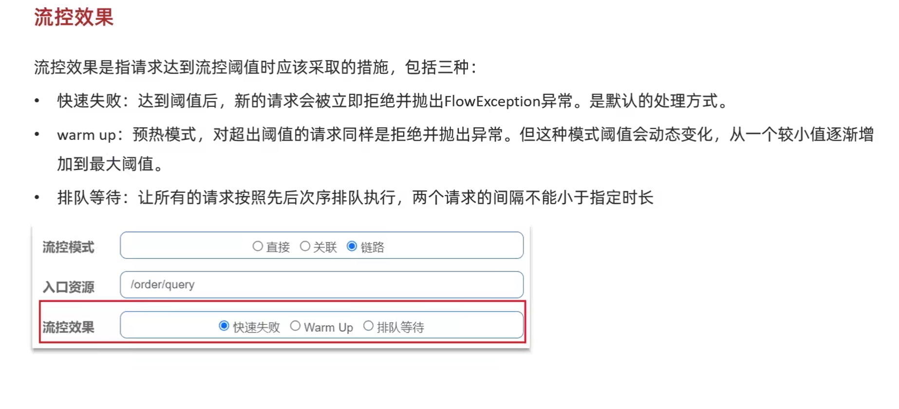


#### Warm Up预热模式

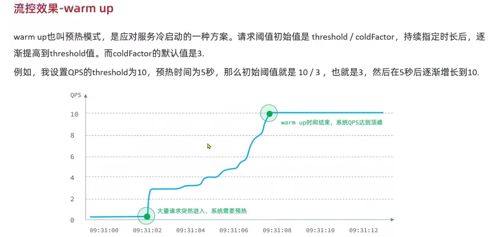

#### 排队等待

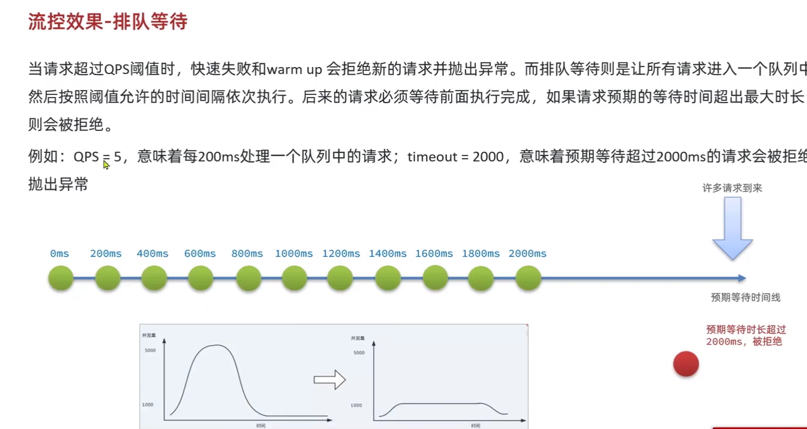

#### 热点参数限流

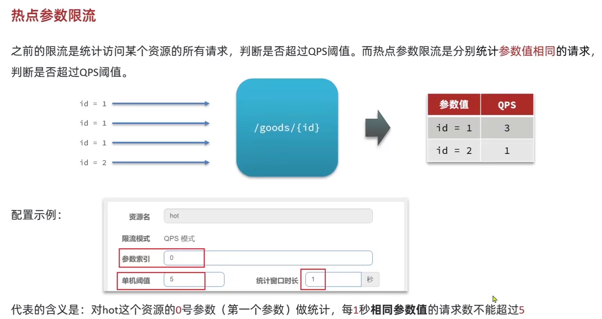

还可以在**左侧的热点规则 -> 新增热点限流规则中**进行配置：

设置热点规则


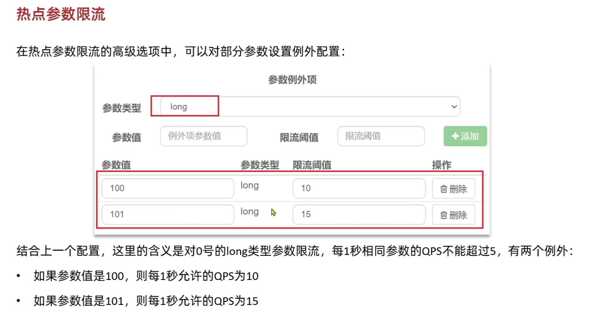


### 6 隔离、降级
降级与熔断：

降级：调用请求失败后返回一些默认值，设置兜底策略

熔断:拒绝所有的请求

线程隔离：

####  Feign整合Sentinel

虽然限流可以尽量避免因高并发而引起的服务故障，但服务还会因为其它原因而故障。而要将这些故障控制在一定范围，避免雪崩，就要靠线程隔离（舱壁模式）和熔断降级手段了。

不管是线程隔离还是熔断降级，都是对客户端（调用方）的保护，避免因为依赖的微服务故障而被拖垮。

SpringCloud中，微服务调用都是通过Feign来实现的，因此做客户端保护必须整合Feign和Sentinel。整合的具体操作如下

第一步: 在order-service项目的application.yml添加如下，开启Feign的Sentinel功能

```yaml
feign:
  sentinel:
    enabled: true #开启Feign的sentinel功能
```

第二步:新建UserClientFallbackFactory类，实现FallbackFactory工厂接口

```java
package cn.itcast.feign.clients.fallback;

import cn.itcast.feign.clients.UserClient;
import cn.itcast.feign.pojo.User;
import feign.hystrix.FallbackFactory;
import lombok.extern.slf4j.Slf4j;

/**
 * @author 35238
 * @date 2023/6/21 0021 19:58
 */
//实现FallbackFactory接口，泛型是我们关联的Feign客户端接口，也就是UserClient
@Slf4j
public class UserClientFallbackFactory implements FallbackFactory<UserClient> {
    @Override
    public UserClient create(Throwable throwable) {
        return new UserClient() {
            @Override
            //在这个方法里面编写降级的逻辑，可以是返回友好的提示，也可以是返回默认结果
            public User findById(Long id) {
                log.error("查询用户异常",throwable);
                //返回空的用户对象
                return new User();
            }
        };
    }
}
```

第三步: 把刚刚的UserClientFallbackFactory类**注册为一个bean**。在feign-api项目的DefaultFeignConfiguration类添加如下

```java
@Bean
public UserClientFallbackFactory userClientFallbackFactory(){
	return new UserClientFallbackFactory();
}
```

第四步: 在feign-api项目的UserClient接口的FeignClient注解添加如下

```java
fallbackFactory = UserClientFallbackFactory.class
```


第五步: 重启order-service项目

第六步: 多访问几次 http://localhost:8088/order/101，触发sentinel

第七步: 浏览器访问sentinel页面 http://localhost:8090/


#### 线程隔离

线程隔离有两种方式实现

- 线程池隔离（不使用原来的线程来执行，开辟一个新的线程池）
- 信号量隔离(Sentinel默认采用，使用原来的线程来执行，维护一个计时器来记录剩下多少个线程可以使用)

两种线程隔离方式的区别如下表。

扇出(分散出): 依赖的服务越多、扇出就越高、调用的就越多，线程要开启的就越多，消耗就越大。例如网关的扇出就很高

|      | 信号量隔离                               | 线程池隔离                     |
| ---- | ---------------------------------------- | ------------------------------ |
| 优点 | 轻量级，无额外开销                       | 支持主动超时、支持异步调用     |
| 缺点 | 不支持主动超时、异步调用                 | 开启线程的额外开销比较大       |
| 场景 | 高频调用、高扇出的时候适合使用信号量隔离 | 低扇出的时候适合使用线程池隔离 |

Sentinel如何实现信号量隔离(是线程隔离的其中一种方式)，相关概念如下

1、QPS：就是每秒的请求数

2、线程数：是该资源能使用用的tomcat线程数的最大值。也就是通过限制线程数量，实现舱壁模式


### 7 3级 熔断降级的策略-配置降级规则

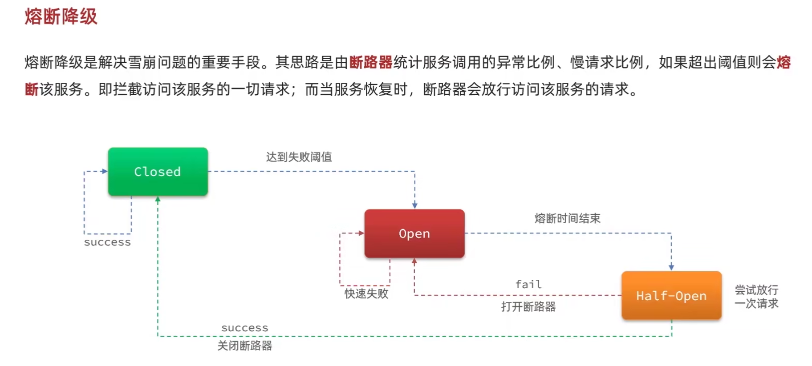

#### 慢调用

RT: 即 ResponseTime

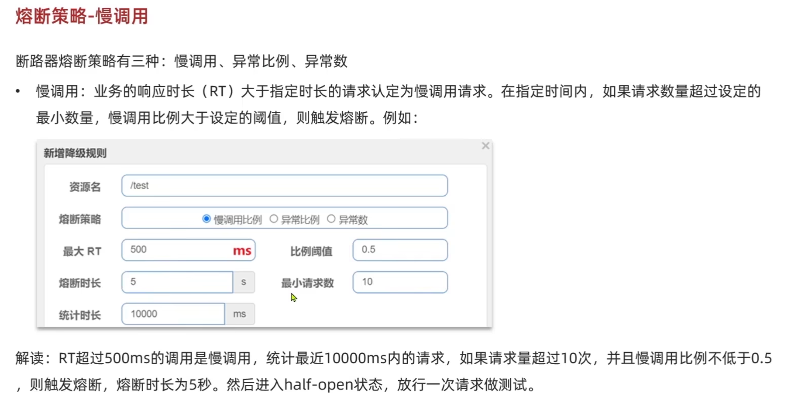

设置降级规则：


#### 异常比例、异常数

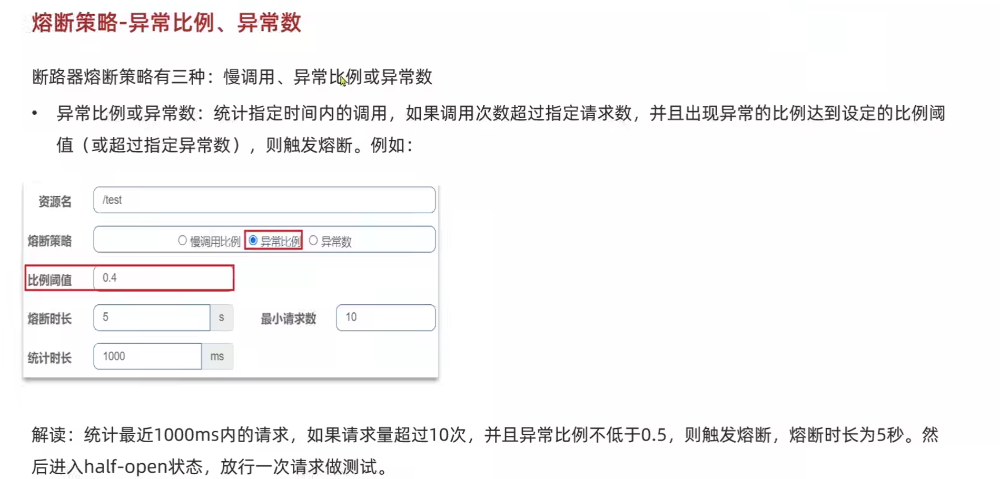

### 8 sentinel授权规则

#### 4级 授权规则

授权规则可以对调用方的来源做控制，有白名单和黑名单两种方式

白名单：来源 (origin) 在白名单内的调用者允许访问

黑名单：来源 (origin) 在黑名单内的调用者不允许访问


案例: 给/order/{orderId} 配置授权规则。具体操作如下

第一步: 在order-service项目的cn.itcast.order目录新建sentinel.HeaderOriginParser类，写入如下

```java
package cn.itcast.order.sentinel;

import com.alibaba.csp.sentinel.adapter.spring.webmvc.callback.RequestOriginParser;
import org.apache.commons.lang.StringUtils;
import org.springframework.stereotype.Component;

import javax.servlet.http.HttpServletRequest;

/**
 * @author 35238
 * @date 2023/6/22 0022 20:43
 */
@Component
//新建的这个类要去实现RequestOriginParser接口
public class HeaderOriginParser implements RequestOriginParser {
    @Override
    public String parseOrigin(HttpServletRequest xxrequest) {
        //尝试获取请求头
        String y_origin = xxrequest.getHeader("yyorigin");
        //非空判断
        if(StringUtils.isEmpty(y_origin)){
            //如果请求头为空，就给一个默认的值，避免为空
            y_origin="blank";
        }
        //有请求头的话，就下一行return返回
        return y_origin;
    }
}
```

第二步: 在gateway项目的application.yml添加如下，例如网关的过滤器给请求加一个请求头叫yyorigin，值是yyorigin_value

```yaml
- AddRequestHeader=yyorigin,yyorigin_value #所有经过网关的请求都会带上yyorigin请求头，值是yyorigin_value
```


第三步: 重启GatewayApplication引导类、OrderApplication引导类

第四步: 浏览器访问sentinel页面 http://localhost:8090/，设置授权规则


第五步: 测试。访问 http://loalhost:8088/order/101，查看从浏览器直接访问是否被允许访问


第六步: 测试。访问 http://localhost:10010/order/101，查看从网关访问是否被允许访问

如果还是不行就访问 http://localhost:10010/order/101?authorization=admin


#### 自定义异常结果

在前面所有不符合我们在sentinel指定的规则的请求，都会在页面报错，但是报错不雅观，而且不管是什么问题都是同一个报错页面在浏览器

下面我们将学习自定义异常，默认情况下，发生限流、降级、授权拦截时，都会抛出异常到调用方。如果要自定义异常时的返回结果，需要实现BlockExceptionHandler接口。而BlockException包含很多个子类，分别对应不同的场景

| 异常                 | 说明               |
| -------------------- | ------------------ |
| FlowException        | 限流异常           |
| ParamFlowException   | 热点参数限流的异常 |
| DegradeException     | 降级异常           |
| AuthorityException   | 授权规则异常       |
| SystemBlockException | 系统规则异常       |

具体操作如下

第一步: 在order-service项目的sentinel目录新建SentinelExceptionHandler类，写入如下

```java
package cn.itcast.order.sentinel;

import com.alibaba.csp.sentinel.adapter.spring.webmvc.callback.BlockExceptionHandler;
import com.alibaba.csp.sentinel.slots.block.BlockException;
import com.alibaba.csp.sentinel.slots.block.authority.AuthorityException;
import com.alibaba.csp.sentinel.slots.block.degrade.DegradeException;
import com.alibaba.csp.sentinel.slots.block.flow.FlowException;
import com.alibaba.csp.sentinel.slots.block.flow.param.ParamFlowException;
import org.springframework.stereotype.Component;

import javax.servlet.http.HttpServletRequest;
import javax.servlet.http.HttpServletResponse;

@Component
// 在这个类实现BlockExceptionHandler接口
public class SentinelExceptionHandler implements BlockExceptionHandler {
    @Override
    public void handle(HttpServletRequest request, HttpServletResponse response, BlockException e) throws Exception {
        String msg = "未知异常";
        int status = 429;

        if (e instanceof FlowException) {
            msg = "请求被限流了";
        } else if (e instanceof ParamFlowException) {
            msg = "请求被热点参数限流";
        } else if (e instanceof DegradeException) {
            msg = "请求被降级了";
        } else if (e instanceof AuthorityException) {
            msg = "没有权限访问";
            status = 401;
        }

        response.setContentType("application/json;charset=utf-8");
        response.setStatus(status);
        response.getWriter().println("{\"msg\": " + msg + ", \"status\": " + status + "}");
    }
}
```

第二步: 重新启动OrderApplication引导类

第三步: 浏览器访问sentinel页面 http://localhost:8090/，设置一些规则


第四步: 查看这次的错误页面长什么样

#### 规则持久化

在前面学习的所有为sentinel配置规则时，只要是服务重启，那么规则就失效，需要重新配置一次，原因是sentinel默认会把这些规则保存在内存里，当重启的时候就丢失了。下面就来学如何让规则持久化的相关知识，分几节来学

#### 规则管理模式

Sentinel的控制台规则管理有三种模式：

原始模式: 控制台配置的规则直接推送到Sentinel客户端，也就是我们的应用。然后保存在内存中，服务重启则丢失


pull模式: 控制台将配置的规则推送到Sentinel客户端，而客户端会将配置规则保存在本地文件或数据库中。以后会定时去本地文件或数据库中查询，更新本地规则


push模式: 控制台将配置规则推送到远程配置中心，例如Nacos。Sentinel客户端监听Nacos，获取配置变更的推送消息，完成本地配置更新


#### 实现push模式

push模式实现最为复杂，依赖于nacos，并且需要改在Sentinel控制台。整体步骤如下：

1、修改order-service服务，使其监听Nacos配置中心
2、修改Sentinel-dashboard源码，配置nacos数据源
3、修改Sentinel-dashboard源码修改前端页面
4、重新编译、打包-dashboard源码

具体操作如下

第一步: 在order-service的pom.xml添加如下，作用是引入sentinel监听nacos的依赖

```xml
<dependency>
    <groupId>com.alibaba.csp</groupId>
    <artifactId>sentinel-datasource-nacos</artifactId>
</dependency>
```

第二步: 在order-service中的application.yml修改相关配置为如下，作用是配置nacos地址及监听的配置信息

```yaml
spring:
  cloud:
    sentinel:
      datasource:
        flow:
          nacos:
            server-addr: localhost:8848 # nacos地址
            dataId: orderservice-flow-rules # 添加的配置文件名称
            groupId: SENTINEL_GROUP # 添加的配置文件的分组
            rule-type: flow # 配置限流的规则，还可以是：degrade、authority、param-flow
```


第三步: 重新启动OrderApplication引导类

第四步: 下载sentinel-dashboard.jar包。下载到你的sentinel目录，例如我的是 'D:\sentinel-dashboard'

```plain
https://cowtransfer.com/s/26e336459c5247
```

第五步: 停止官方sentinel的运行，去运行上面你下载的这个sentinel。注意启动时Nacos要修改成你的Nacos地址，sentinel启动端口自定义为8090

```plain
d:
cd sentinel-dashboard
java -jar sentinel-dashboard.jar --nacos.addr=localhost:8848 --server.port=8090
```

第六步: 浏览器访问sentinel页面 http://localhost:8090

如果进入什么都没有，就访问 http://localhost:8088/order/101，多访问几次触发sentinel，然后再回来访问就行了


第七步: 在sentinel添加一个流控规则(限流规则)，注意必须在 '流控规则-NACOS' 加才行


第八步: 浏览器访问nacos页面


第九步: 测试。验证这个流控规则有没有生效。疯狂访问 http://localhost:8088/order/101，超出1秒1次就会限流，我们在第七步设置的QPS为1


第十步: 测试。重启order-service项目服务(重启OrderApplication)，看一下流控规则还会不会生效


也就是我们通过实现push模式，实现了规则持久化


## 6 2级 seata分布式事务

### 分布式事务问题

分布式事务问题的流程图如下


我们看到的结果是库存失败了，账户却被扣减了。我们希望得到的结果是库存出错后，订单和账户即使执行成功也要回滚

### CAP定理

分布式的 CAP 理论告诉我们:

> 任何一个分布式系统都无法同时满足一致性（Consistency）、可用性（Availability）和分区容错性（Partition tolerance），最多只能同时满足两项。

分布式系统有三个指标：

- Consistency (一致性): 用户访问分布式系统中的任意节点，得到的数据必须一致
- Availability (可用性): 用户访问集群中的任意健康节点，必须能得到响应，而不是超时或拒绝（数据库各节点的数据不一致时，即使节点是健康的，也不能随便响应）
- Partition tolerance (分区容错性): 因为网络故障或其它原因导致分布式系统中的部分节点与其它节点失去连接，形成独立分区，在集群出现分区时，整个系统也要持续对外提供服务

并指出一个结论是 '**分布式系统无法同时满足这三个指标**'，这个结论就叫做 CAP 定理

简述CAP定理内容？

- 分布式系统节点通过网络连接，一定会出现分区问题（P)
- 当分区出现时，系统的一致性（C)和可用性(A)就无法同时满足，只能选取一个


### BASE理论

BASE理论是对CAP的一种解决思路，包含三个思想

- Basically Available (基本可用): 分布式系统在出现故障时，允许损失部分可用性，即保证核心可用
- Soft State (软状态): 在一定时间内，允许出现中间状态，比如临时的不一致状态
- Eventually Consistent (最终一致性): 虽然无法保证强一致性，但是在软状态结束后，最终达到数据一致

而分布式事务最大的问题是各个子事务的一致性问题，因此**可以借鉴CAP定理和BASE理论**

- AP模式: 各子事务分别执行和提交，允许出现结果不一致，然后采用弥补措施恢复数据即可，实现**最终一致**
- CP模式: 各个子事务执行后互相等待，同时提交，同时回滚，达成**强一致**。但事务等待过程中，处于弱可用状态

解决分布式事务，各个子系统之间必须能感知到彼此的事务状态，才能保证状态一致，因此需要一个事务协调者来协调每一个事务的参与者 (子系统事务)

这里的子系统事务，称为分支事务；有关联的各个分支事务在一起称为全局事务


上图右侧的 '事务协调者'，就是我们学习的重点Seata

### seata-架构

Seata是 2019 年 1 月份蚂蚁金服和阿里巴巴共同开源的分布式事务解决方案。致力于提供高性能和简单易用的分布式事务服务，为用户打造一站式的分布式解决方案。官网地址: http://seata.io，其中的文档、博客中提供了大量的使用说明、源码分析

Seata事务管理中有三个重要的角色

- TC (Transaction Coordinator) - 事务协调者：维护全局和分支事务的状态，协调全局事务提交或回滚
- TM (Transaction Manager) - 事务管理器：定义全局事务的范围、开始全局事务、提交或回滚全局事务
- RM (Resource Manager) - 资源管理器：管理分支事务处理的资源，与TC交谈以注册分支事务和报告分支事务的状态，并驱动分支事务提交或回滚


Seata提供了四种不同的分布式事务解决方案

- XA模式：强一致性分阶段事务模式，牺牲了一定的可用性，无业务侵入
- TCC模式：最终一致的分阶段事务模式，有业务侵入
- AT模式：最终一致的分阶段事务模式，无业务侵入，也是Seata的默认模式
- SAGA模式：长事务模式，有业务侵入

### seata-windows下部署TC服务

第一步: 下载seata-server-1.4.2.zip，下载链接如下，下载之后解压到D盘，解压之后是seata文件夹

```plain
https://cowtransfer.com/s/523a484df69e4d
```

第二步: 修改conf目录下的registry.conf文件，**设置seata的TC服务注册到nacos并且从nacos中读取配置文件**

修改为如下：

```yaml
registry {
  # tc服务的注册中心类，这里选择nacos，也可以是eureka、zookeeper等,选择一个后，其他没有选择的配置即可删除
  type = "nacos"

  nacos {
    # seata tc 服务注册到 nacos的服务名称、nacos的地址等信息
    application = "seata-tc-server"
    serverAddr = "127.0.0.1:8848"
    group = "DEFAULT_GROUP"
    namespace = ""
    cluster = "SH"
    username = "nacos"
    password = "nacos"
  }
}

config {
  # 读取tc服务端的配置文件的方式，这里是从nacos配置中心读取，这样如果tc是集群，可以共享配置
  type = "nacos"
  # 配置nacos地址等信息
  nacos {
    serverAddr = "127.0.0.1:8848"
    namespace = ""
    group = "SEATA_GROUP"
    username = "nacos"
    password = "nacos"
    dataId = "seataServer.properties" # 读取seataServer.properties这个文件作为tc服务端的配置信息
  }
}
```

第三步: 在Nacos添加seataServer.properties配置中心文件，浏览器访问 http://localhost:8848/

先启动nacos(默认8848端口)。在命令行输入如下。m表示启动模式，standalone表示单机启动。除了单机启动模式，还有集群启动的模式

```plain
d:
cd D:\Nacos\nacos\bin
startup.cmd -m standalone
```


在下seataServer.properties输入如下：

```yaml
# 记录事务相关数据的存储方式，db代表存储到数据库，注意你的数据库信息必须正确
store.mode=db
store.db.datasource=druid
store.db.dbType=mysql
store.db.driverClassName=com.mysql.cj.jdbc.Driver
store.db.url=jdbc:mysql://127.0.0.1:3306/seata?useUnicode=true&rewriteBatchedStatements=true&serverTimezone=UTC
store.db.user=root
store.db.password=228675
store.db.minConn=5
store.db.maxConn=30
store.db.globalTable=global_table
store.db.branchTable=branch_table
store.db.queryLimit=100
store.db.lockTable=lock_table
store.db.maxWait=5000
# 事务、日志等配置
server.recovery.committingRetryPeriod=1000
server.recovery.asynCommittingRetryPeriod=1000
server.recovery.rollbackingRetryPeriod=1000
server.recovery.timeoutRetryPeriod=1000
server.maxCommitRetryTimeout=-1
server.maxRollbackRetryTimeout=-1
server.rollbackRetryTimeoutUnlockEnable=false
server.undo.logSaveDays=7
server.undo.logDeletePeriod=86400000

# 客户端与服务端传输方式
transport.serialization=seata
transport.compressor=none
# 关闭metrics功能，提高性能
metrics.enabled=false
metrics.registryType=compact
metrics.exporterList=prometheus
metrics.exporterPrometheusPort=9898
```


第四步: 由于tc服务在管理分布式事务时，需要记录事务相关数据到数据库中，所以需要我们去新建一个名为seata的数据库，然后运行如下SQL语句

```sql
SET NAMES utf8mb4;
SET FOREIGN_KEY_CHECKS = 0;

-- ----------------------------
-- 分支事务表
-- ----------------------------
DROP TABLE IF EXISTS `branch_table`;
CREATE TABLE `branch_table`  (
  `branch_id` bigint(20) NOT NULL,
  `xid` varchar(128) CHARACTER SET utf8 COLLATE utf8_general_ci NOT NULL,
  `transaction_id` bigint(20) NULL DEFAULT NULL,
  `resource_group_id` varchar(32) CHARACTER SET utf8 COLLATE utf8_general_ci NULL DEFAULT NULL,
  `resource_id` varchar(256) CHARACTER SET utf8 COLLATE utf8_general_ci NULL DEFAULT NULL,
  `branch_type` varchar(8) CHARACTER SET utf8 COLLATE utf8_general_ci NULL DEFAULT NULL,
  `status` tinyint(4) NULL DEFAULT NULL,
  `client_id` varchar(64) CHARACTER SET utf8 COLLATE utf8_general_ci NULL DEFAULT NULL,
  `application_data` varchar(2000) CHARACTER SET utf8 COLLATE utf8_general_ci NULL DEFAULT NULL,
  `gmt_create` datetime(6) NULL DEFAULT NULL,
  `gmt_modified` datetime(6) NULL DEFAULT NULL,
  PRIMARY KEY (`branch_id`) USING BTREE,
  INDEX `idx_xid`(`xid`) USING BTREE
) ENGINE = InnoDB CHARACTER SET = utf8 COLLATE = utf8_general_ci ROW_FORMAT = Compact;

-- ----------------------------
-- 全局事务表
-- ----------------------------
DROP TABLE IF EXISTS `global_table`;
CREATE TABLE `global_table`  (
  `xid` varchar(128) CHARACTER SET utf8 COLLATE utf8_general_ci NOT NULL,
  `transaction_id` bigint(20) NULL DEFAULT NULL,
  `status` tinyint(4) NOT NULL,
  `application_id` varchar(32) CHARACTER SET utf8 COLLATE utf8_general_ci NULL DEFAULT NULL,
  `transaction_service_group` varchar(32) CHARACTER SET utf8 COLLATE utf8_general_ci NULL DEFAULT NULL,
  `transaction_name` varchar(128) CHARACTER SET utf8 COLLATE utf8_general_ci NULL DEFAULT NULL,
  `timeout` int(11) NULL DEFAULT NULL,
  `begin_time` bigint(20) NULL DEFAULT NULL,
  `application_data` varchar(2000) CHARACTER SET utf8 COLLATE utf8_general_ci NULL DEFAULT NULL,
  `gmt_create` datetime NULL DEFAULT NULL,
  `gmt_modified` datetime NULL DEFAULT NULL,
  PRIMARY KEY (`xid`) USING BTREE,
  INDEX `idx_gmt_modified_status`(`gmt_modified`, `status`) USING BTREE,
  INDEX `idx_transaction_id`(`transaction_id`) USING BTREE
) ENGINE = InnoDB CHARACTER SET = utf8 COLLATE = utf8_general_ci ROW_FORMAT = Compact;

SET FOREIGN_KEY_CHECKS = 1;
```


第五步: 启动TC服务。打开我们在第一步下载好的seata文件夹，找到并进入里面的bin目录，运行seata-server.bat


第六步: 打开浏览器，访问nacos地址：http://localhost:8848，然后进入服务列表页面，可以看到seata-tc-server的信息


第七步: 我们不需要去访问TC服务，这个TC服务是给seata的TM和RM访问的。到这里就把TC服务搭建好了，下面我们将学习微服务对seata的集成，来代理事务，形成TM和RM，完成对分布式事务的支持


### 微服务集成seata

必须先完成上一节的部署TC服务，然后紧接着完成这节

第一步: 任意一个微服务(例如storage-service)的pom.xml，添加如下

```xml
<!--引入seata的依赖-->
<dependency>
	<groupId>com.alibaba.cloud</groupId>
	<artifactId>spring-cloud-starter-alibaba-seata</artifactId>
	<exclusions>
		<!--版本较低，1.3.0，因此排除-->
		<exclusion>
			<groupId>io.seata</groupId>
			<artifactId>seata-spring-boot-starter</artifactId>
		</exclusion>
	</exclusions>
</dependency>

<!--seata starter 采用1.4.2版本-->
<dependency>
	<groupId>io.seata</groupId>
	<artifactId>seata-spring-boot-starter</artifactId>
	<version>1.4.2</version>
</dependency>
```

第二步: 在storage-service的application.xml中，配置去nacos中寻找TC服务，添加如下：

```yaml
# 配置seata
seata:
  registry:
    type: nacos
    nacos:
      server-addr: 127.0.0.1:8848
      namespace: "" # 只要写默认为public
      group: DEFAULT_GROUP
      application: seata-tc-server
      username: nacos
      password: nacos
  # 事务组名称
  tx-service-group: seata-demo
  service:
    # 配置事务组与cluster(集群)的映射关系，从而确定cluster
    vgroup-mapping: 
      seata-demo: SH
```


第三步: 重新启动StorageApplication引导类

第四步: 查看TC服务 (也就是你运行的seata-server.bat) 的cmd命令行终端，是否有TM注册成功


第五步: 同理，把剩下的两个项目(order-service和account-service)也注册进seata，操作过程跟上面的storage-service项目一样，每一个项目就是一个TM


然后就进入下面的实战学习，必须要把这节和上一节做完，不然下面的实战是做不了的

### 实现分布式事务的4种模式

#### XA模式

XA模式原理

XA 规范 是 X/Open 组织定义的分布式事务处理（DTP，Distributed Transaction Processing）标准，XA 规范 描述了全局的TM与局部的RM之间的接口，几乎所有主流的数据库都对 XA 规范 提供了支持


seata的XA模式，seata的XA模式做了一些调整，但大体相似，如下

RM一阶段的工作:

1、注册分支事务到TC

2、执行分支业务sql但不提交

3、报告执行状态到TC

TC二阶段的工作:

1、TC检测各分支事务执行状态

2、如果都成功，通知所有RM提交事务

3、如果有失败，通知所有RM回滚事务

RM二阶段的工作:

1、接收TC指令，提交或回滚事务

对应的流程如下


XA模式的优点是什么？

1、事务的强一致性，满足ACID原则。
2、常用数据库都支持，实现简单，并且没有代码侵入

XA模式的缺点是什么？

1、因为一阶段需要锁定数据库资源，等待二阶段结束才释放，性能较差
2、依赖关系型数据库实现事务

具体操作如下

第一步: 在storage-service项目、order-service项目、account-service项目的application.yml添加如下

```yaml
# seata实现XA模式
data-source-proxy-mode: XA
```


第二步: 修改order-service项目的OrderServiceImpl类的create方法的注解，把原来的@Transactional注解改成@GlobalTransactional注解


第二步: 修改order-service项目的OrderServiceImpl类的create方法的注解，把原来的@Transactional注解改成@GlobalTransactional注解


第三步: 重新运行AccountApplication、OrderApplication、StorageApplication引导类

第四步: 测试。打开postman软件，我们数据库现在有600元、8个库存，先测试用户用200元买2个库存，这次由于库存够所以不会报事务的错

```plain
http://localhost:8082/order?userId=user202103032042012&commodityCode=100202003032041&count=2&money=200
```


第五步: 测试。现在数据库有400元、6个库存，再测试用户如果买10个库存，由于这次库存不够，所以这次按理来说是会有事务问题发生

我们看一下数据库的数据有没有被扣减


经过去数据库查看，发现并没有进行扣减，也是三个微服务项目的事务都进行了回滚，解决了分布式事务的问题

第六步: 查看idea控制台，是否有回滚信息


#### AT模式

AT模式同样是分阶段提交的事务模型，不过缺弥补了XA模型中资源锁定周期过长的缺陷

阶段一RM的工作:

1、注册分支事务

2、记录undo-log（数据快照）

3、执行业务sql并提交

4、报告事务状态

阶段二提交时RM的工作:

1、删除undo-log即可

阶段二回滚时RM的工作:

1、根据undo-log恢复数据到更新前

对应的流程如下


简述AT模式与XA模式最大的区别是什么？

1、XA模式一阶段不提交事务，锁定资源；AT模式一阶段直接提交，不锁定资源

2、XA模式依赖数据库机制实现回滚；AT模式利用数据快照实现数据回滚

3、XA模式强一致；AT模式最终一致

AT模式的脏写问题


使用AT模式的写隔离即可解决脏写问题，如下图


AT模式的优点:

1、一阶段完成直接提交事务，释放数据库资源，性能比较好

2、利用全局锁实现读写隔离

3、没有代码侵入，框架自动完成回滚和提交

AT模式的缺点:

1、两阶段之间属于软状态，属于最终一致

2、框架的快照功能会影响性能，但比XA模式要好很多

具体操作如下

第一步: 在seata库执行下面的sql语句

```sql
CREATE TABLE `lock_table`  (
  `row_key` varchar(128) CHARACTER SET utf8 COLLATE utf8_general_ci NOT NULL,
  `xid` varchar(96) CHARACTER SET utf8 COLLATE utf8_general_ci NULL DEFAULT NULL,
  `transaction_id` bigint(20) NULL DEFAULT NULL,
  `branch_id` bigint(20) NOT NULL,
  `resource_id` varchar(256) CHARACTER SET utf8 COLLATE utf8_general_ci NULL DEFAULT NULL,
  `table_name` varchar(32) CHARACTER SET utf8 COLLATE utf8_general_ci NULL DEFAULT NULL,
  `pk` varchar(36) CHARACTER SET utf8 COLLATE utf8_general_ci NULL DEFAULT NULL,
  `gmt_create` datetime NULL DEFAULT NULL,
  `gmt_modified` datetime NULL DEFAULT NULL,
  PRIMARY KEY (`row_key`) USING BTREE,
  INDEX `idx_branch_id`(`branch_id`) USING BTREE
) ENGINE = InnoDB CHARACTER SET = utf8 COLLATE = utf8_general_ci ROW_FORMAT = Compact;
```


第二步: 在seata-demo库执行下面的sql语句

```sql
CREATE TABLE `undo_log`  (
  `branch_id` bigint(20) NOT NULL COMMENT 'branch transaction id',
  `xid` varchar(100) CHARACTER SET utf8 COLLATE utf8_general_ci NOT NULL COMMENT 'global transaction id',
  `context` varchar(128) CHARACTER SET utf8 COLLATE utf8_general_ci NOT NULL COMMENT 'undo_log context,such as serialization',
  `rollback_info` longblob NOT NULL COMMENT 'rollback info',
  `log_status` int(11) NOT NULL COMMENT '0:normal status,1:defense status',
  `log_created` datetime(6) NOT NULL COMMENT 'create datetime',
  `log_modified` datetime(6) NOT NULL COMMENT 'modify datetime',
  UNIQUE INDEX `ux_undo_log`(`xid`, `branch_id`) USING BTREE
) ENGINE = InnoDB CHARACTER SET = utf8 COLLATE = utf8_general_ci COMMENT = 'AT transaction mode undo table' ROW_FORMAT = Compact;
```


第三步: 在storage-service项目、order-service项目、account-service项目的application.yml，修改模式为AT


第四步: 重新运行AccountApplication、OrderApplication、StorageApplication引导类

第五步: 测试。打开postman软件，我们数据库现在有400元、6个库存，先测试用户用200元买2个库存，这次由于库存够所以不会报事务的错

```plain
http://localhost:8082/order?userId=user202103032042012&commodityCode=100202003032041&count=2&money=200
```


第六步: 测试。现在数据库有200元、4个库存，再测试用户如果买10个库存，由于这次库存不够，所以这次按理来说是会有事务问题发生

我们看一下数据库的数据有没有被扣减


经过去数据库查看，发现并没有进行扣减，也是三个微服务项目的事务都进行了回滚，解决了分布式事务的问题

第七步: 查看idea控制台，是否有回滚信息


#### TCC模式

TCC模式与AT模式非常相似，每阶段都是独立事务，不同的是TCC通过人工编码来实现数据恢复。需要实现三个方法

1、Try：资源的检测和预留

2、Confirm：完成资源操作业务；要求 Try 成功 Confirm 一定要能成功

3、Cancel：预留资源释放，可以理解为try的反向操作

TCC的工作模型图如下


TCC的优点是什么？

1、一阶段完成直接提交事务，释放数据库资源，性能好

2、相比AT模型，无需生成快照，无需使用全局锁，性能最强

3、不依赖数据库事务，而是依赖补偿操作，可以用于非事务型数据库

TCC的缺点是什么？

1、有代码侵入，需要人为编写try、Confirm和Cancel接口，太麻烦

2、软状态，事务是最终一致

3、需要考虑Confirm和Cancel的失败情况，做好幂等处理

案例: 改造account-service服务，利用TCC实现分布式事务，需求如下

1、修改account-service，编写try、confirm、cancel逻辑

2、try业务：添加冻结金额，扣减可用金额

3、confirm业务：删除冻结金额

4、cancel业务：删除冻结金额，恢复可用金额

5、保证confirm、cancel接口的幂等性

6、允许空回滚

7、拒绝业务悬挂

案例分析:

1、Try业务: 记录冻结金额和事务状态到account_freeze表; 扣减account表可用金额

2、Confirm业务: 根据xid删除account_freeze表的冻结记录

3、Cancel业务: 修改account_freeze表，冻结金额为0，state为2; 修改account表，恢复可用金额

4、如何判断是否空回滚: cancel业务中，根据xid查询account_freeze，如果为null则说明try还没做，需要空回滚

5、如何避免业务悬挂: try业务中，根据xid查询account_freeze ，如果已经存在则证明Cancel已经执行，拒绝执行try业务

TCC的空回滚和业务悬挂

当某分支事务的try阶段阻塞时，可能导致全局事务超时而触发二阶段的cancel操作。在未执行try操作时先执行了cancel操作，这时cancel不能做回滚，就是空回滚。对于已经空回滚的业务，如果以后继续执行try，就永远不可能confirm或cancel，这就是业务悬挂。应当阻止执行空回滚后的try操作，避免悬挂


为了实现空回滚、防止业务悬挂，以及幂等性要求。我们必须在数据库记录冻结金额的同时，记录当前事务id和执行状态，为此我们设计了一张表

```sql
CREATE TABLE `account_freeze_tbl` (
  `xid` varchar(128) NOT NULL,
  `user_id` varchar(255) DEFAULT NULL COMMENT '用户id',
  `freeze_money` int(11) unsigned DEFAULT '0' COMMENT '冻结金额',
  `state` int(1) DEFAULT NULL COMMENT '事务状态，0:try，1:confirm，2:cancel',
  PRIMARY KEY (`xid`) USING BTREE
) ENGINE=InnoDB DEFAULT CHARSET=utf8 ROW_FORMAT=COMPACT;
```

案例的具体操作如下

第一步: 在account-service项目的service目录新建AccountTCCService接口，写入如下

```java
package cn.itcast.account.service;

import io.seata.rm.tcc.api.BusinessActionContext;
import io.seata.rm.tcc.api.BusinessActionContextParameter;
import io.seata.rm.tcc.api.LocalTCC;
import io.seata.rm.tcc.api.TwoPhaseBusinessAction;

/**
 * @author 35238
 * @date 2023/6/24 0024 13:36
 */
@LocalTCC
public interface AccountTCCService {

    /**
     * Try逻辑，@TwoPhaseBusinessAction中的name属性要与当前方法名一致，用于指定Try逻辑对应的方法
     */
    @TwoPhaseBusinessAction(name = "deduct", commitMethod = "confirm", rollbackMethod = "cancel")
    void deduct(@BusinessActionContextParameter(paramName = "userId") String userId,
                @BusinessActionContextParameter(paramName = "money") int money);

    /**
     * 二阶段confirm确认方法、可以另命名，但要保证与commitMethod一致
     *
     * @param ctx 上下文,可以传递try方法的参数
     * @return boolean 执行是否成功
     */
    boolean confirm(BusinessActionContext ctx);
    
    /**
     * 二阶段回滚方法，要保证与rollbackMethod一致
     */
    boolean cancel(BusinessActionContext ctx);
}
```

第二步: 在seata_demo库，执行下面的sql语句。作用是新增account_freeze_tbl表，用来表示资源的预留和锁定，以及事务状态

```sql
SET NAMES utf8mb4;
SET FOREIGN_KEY_CHECKS = 0;

-- ----------------------------
-- Table structure for account_freeze_tbl
-- ----------------------------
DROP TABLE IF EXISTS `account_freeze_tbl`;
CREATE TABLE `account_freeze_tbl`  (
  `xid` varchar(128) CHARACTER SET utf8 COLLATE utf8_general_ci NOT NULL,
  `user_id` varchar(255) CHARACTER SET utf8 COLLATE utf8_general_ci NULL DEFAULT NULL,
  `freeze_money` int(11) UNSIGNED NULL DEFAULT 0,
  `state` int(1) NULL DEFAULT NULL COMMENT '事务状态，0:try，1:confirm，2:cancel',
  PRIMARY KEY (`xid`) USING BTREE
) ENGINE = InnoDB CHARACTER SET = utf8 COLLATE = utf8_general_ci ROW_FORMAT = COMPACT;

-- ----------------------------
-- Records of account_freeze_tbl
-- ----------------------------

SET FOREIGN_KEY_CHECKS = 1;
```

第三步: 在account-service项目的service.impl目录新建AccountTCCServiceImpl类，写入如下

```java
package cn.itcast.account.service.impl;

import cn.itcast.account.entity.AccountFreeze;
import cn.itcast.account.mapper.AccountFreezeMapper;
import cn.itcast.account.mapper.AccountMapper;
import cn.itcast.account.service.AccountTCCService;
import io.seata.core.context.RootContext;
import io.seata.rm.tcc.api.BusinessActionContext;
import lombok.extern.slf4j.Slf4j;
import org.springframework.beans.factory.annotation.Autowired;
import org.springframework.stereotype.Service;
import org.springframework.transaction.annotation.Transactional;

/**
 * @author 35238
 * @date 2023/6/24 0024 13:52
 */
@Slf4j
@Service
public class AccountTCCServiceImpl implements AccountTCCService {

    //注入案例提供的两个接口
    @Autowired
    private AccountMapper accountMapper;
    @Autowired
    private AccountFreezeMapper freezeMapper;

    @Override
    @Transactional
    public void deduct(String userId, int money) {
        //获取事务id
        String xid = RootContext.getXID();
        
        //判断业务悬挂，也就是判断freeze是否有冻结记录，如果有，表示已经执行过cancel了，这里就拒绝业务
        AccountFreeze oldFreeze = freezeMapper.selectById(xid);
        if(oldFreeze != null){
            //什么都不做，就相当于拒绝
            return;
        }

        //扣减可用余额
        accountMapper.deduct(userId, money);
        //记录冻结金额、事务状态
        AccountFreeze freeze = new AccountFreeze();
        freeze.setUserId(userId);
        freeze.setFreezeMoney(money);
        freeze.setState(AccountFreeze.State.TRY);
        freeze.setXid(xid);
        //插入
        freezeMapper.insert(freeze);
    }

    @Override
    public boolean confirm(BusinessActionContext ctx) {
        //获取事务id
        String xid = ctx.getXid();
        //根据id删除冻结记录
        int count = freezeMapper.deleteById(xid);
        return count==1;
    }

    @Override
    public boolean cancel(BusinessActionContext ctx) {
        //获取事务id
        String xid = ctx.getXid();
        //获取userId
        String userId = ctx.getActionContext("userId").toString();
        //查询冻结记录
        AccountFreeze freeze = freezeMapper.selectById(xid);

        //判断是否要做空回滚，也就是判断freeze是否为null，为null就表示try没执行，此时就需要空回滚
        if (freeze == null) {
            //new一些数据
            freeze = new AccountFreeze();
            //if外面获取的userId
            freeze.setUserId(userId);
            //空回滚就把金额设置为0
            freeze.setFreezeMoney(0);
            freeze.setState(AccountFreeze.State.CANCEL);
            freeze.setXid(xid);
            //插入
            freezeMapper.insert(freeze);
            return true;
        }
        
        //幂等判断
        if(freeze.getState() == AccountFreeze.State.CANCEL){
            //表示已经处理过一次cancel了,无需重复处理
            return true;
            
        }


        //恢复可用余额
        accountMapper.refund(freeze.getUserId(),freeze.getFreezeMoney());
        //将冻结金额清零、状态改为cancel
        freeze.setFreezeMoney(0);
        freeze.setState(AccountFreeze.State.CANCEL);
        //更新
        int count = freezeMapper.updateById(freeze);
        return count==1;
    }
}
```

第四步: 修改account-service项目的AccountController类，把注入AccountService接口，改为注入AccountTCCService接口


第五步: 重新运行AccountApplication、OrderApplication、StorageApplication引导类

第六步: 测试。先打开数据库，把account_tbl余额表改为1000，把storage_tbl库存表改为10

第七步: 测试。然后打开postman软件，测试用户用200元买2个库存，这次由于库存够所以不会报事务的错

```plain
http://localhost:8082/order?userId=user202103032042012&commodityCode=100202003032041&count=2&money=200
```


第八步: 测试。现在数据库有800元、8个库存，再测试用户如果买10个库存，由于这次库存不够，所以这次按理来说是会有事务问题发生

我们看一下数据库的数据有没有被扣减


经过去数据库查看，发现并没有进行扣减，也是三个微服务项目的事务都进行了回滚，解决了分布式事务的问题

第九步: 查看idea控制台，是否有回滚信息


#### Saga模式

Saga模式是SEATA提供的长事务解决方案。也分为两个阶段

一阶段: 直接提交本地事务

二阶段: 成功则什么都不做；失败则通过编写补偿业务来回滚

Saga模式的执行流程如下


Saga模式优点:

1、事务参与者可以基于事件驱动实现异步调用，吞吐高

2、一阶段直接提交事务，无锁，性能好

3、不用编写TCC中的三个阶段，实现简单

缺点:

1、软状态持续时间不确定，时效性差

2、没有锁，没有事务隔离，会有脏写

这种模式在视频里没有相关演示

####  四种模式的对比

|          | XA                             | AT                                           | TCC                                                | SAGA                                                         |
| -------- | ------------------------------ | -------------------------------------------- | -------------------------------------------------- | ------------------------------------------------------------ |
| 一致性   | 强一致                         | 弱一致                                       | 弱一致                                             | 最终一致                                                     |
| 隔离性   | 完全隔离                       | 基于全局锁隔离                               | 基于资源预留隔离                                   | 无隔离                                                       |
| 代码侵入 | 无                             | 无                                           | 有，要编写三个接口                                 | 有，要编写状态机和补偿业务                                   |
| 性能     | 差                             | 好                                           | 非常好                                             | 非常好                                                       |
| 场景     | 对一致性、隔离性有高要求的业务 | 基于关系型数据库的大多数分布式事务场景都可以 | 对性能要求较高的事务。有非关系型数据库要参与的事务 | 业务流程长、业务流程多。参与者包含其它公司或遗留系统服务，无法提供 TCC 模式要求的三个接口 |


## 7 2级 Getway网关

在SpringCloud中有两个组件可以实现网关。分别是gateway、zuul

Zuul是基于Servlet的实现，属于阻塞式编程。而SpringCloudGateway则是基于spring5中提供的WebFlux，属于响应式编程的实现，具备更好的性能

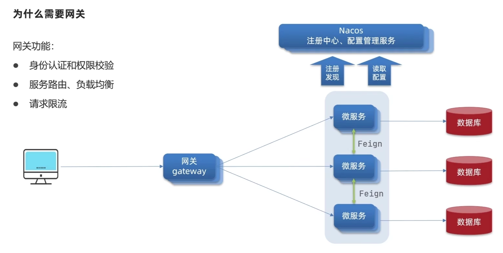


网关的作用：

- 对用户请求做身份认证、权限校验
- 将用户请求路由(找到对应的)到微服务，并实现负载均衡
- 对用户请求做限流

网关工作图:

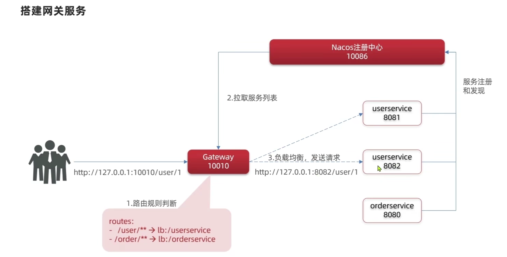

### 网关的快速入门

网关路由可以配置的内容包括如下

```yaml
id: # 路由唯一标识

uri: # 路由目的地，支持lb和http两种

predicates: # 路由断言，判断请求是否符合要求，符合则转发到路由目的地uri

filters: # 路由过滤器，处理请求或响应
```

搭建网关服务的步骤如下

第一步: 由于网关是一个服务，所以需要在cloud-demo总项目中新建一个项目，项目名为gateway


第二步: 在gateway微服务项目的pom.xml修改为如下

```xml
<?xml version="1.0" encoding="UTF-8"?>
<project xmlns="http://maven.apache.org/POM/4.0.0"
         xmlns:xsi="http://www.w3.org/2001/XMLSchema-instance"
         xsi:schemaLocation="http://maven.apache.org/POM/4.0.0 http://maven.apache.org/xsd/maven-4.0.0.xsd">
    <parent>
        <artifactId>cloud-demo</artifactId>
        <groupId>cn.itcast.demo</groupId>
        <version>1.0</version>
    </parent>
    <modelVersion>4.0.0</modelVersion>

    <artifactId>gateway</artifactId>

    <properties>
        <maven.compiler.source>8</maven.compiler.source>
        <maven.compiler.target>8</maven.compiler.target>
    </properties>

    <dependencies>

        <!--nacos服务注册发现依赖-->
        <dependency>
            <groupId>com.alibaba.cloud</groupId>
            <artifactId>spring-cloud-starter-alibaba-nacos-discovery</artifactId>
        </dependency>

        <!--网关gateway依赖-->
        <dependency>
            <groupId>org.springframework.cloud</groupId>
            <artifactId>spring-cloud-starter-gateway</artifactId>
        </dependency>

    </dependencies>

</project>
```


第三步: 在gateway微服务项目的src/main/java目录下新建cn.itcast.gateway.GatewayApplication类，写入如下

```java
package cn.itcast.gateway;

import org.springframework.boot.SpringApplication;
import org.springframework.boot.autoconfigure.SpringBootApplication;

/**
 * @author 35238
 * @date 2023/5/28 0028 14:06
 */

@SpringBootApplication
public class GatewayApplication {

    public static void main(String[] args) {
        SpringApplication.run(GatewayApplication.class, args);
    }

}
```


第四步: 在gateway微服务项目的src/main/resources目录下新建File，File名为application.yml，写入如下

```yaml
server:
  port: 10010 #服务端口
spring:
  application:
    name: gateway #当前这个gateway微服务项目的服务名称
  cloud:
    nacos:
      server-addr: localhost:8848 # nacos的地址
    gateway:
      routes: #自定义网关的路由规则，多个规则就用- ，指定访问网关的一个类型的url时，就会转发给相应的服务类型
        
        - id: User-Service #自定义路由标识，必须唯一
          uri: lb://UserService # lb表示负载均衡的分发请求，也可以是http。
          					  # UserService为路由目标地址，也就是设置用户请求符合规则时，会请求到哪里，UserService是已有的服务名称
          predicates: #路由断言，作用是判断路由是否符合规则，也就是用户请求是否符合规则，符合的话，才会被网关路由到某个服务名称，多个断言用-
            - Path=/user/** #路径断言，判断用户请求的路径是否是以/user/开头，如果是则符合规则
        
        - id: Order-Service #自定义路由标识，必须唯一
          uri: lb://OrderService #让用户请求访问的是OrderService微服务
          predicates:
            - Path=/order/** #当用户请求路径是以order开头时，才会被网关路由到OrderService微服务
```

第五步。测试(先确保你的nacos已经启动)，先运行GatewayApplication类，然后重启OrderApplication、UserApplication、UserApplication2服务

浏览器访问: http://localhost:10010/user/3，注意要http://localhost:10010/user/开头，访问网关的端口，因为我们在第四步指定了路由断言


可以发现，我们并没有在gateway微服务项目写任何业务代码，但是却能用gateway微服务项目的路径访问到数据，原因就是网关路由，把gateway微服务项目的请求路由到我们指定的其他微服务去了，我们访问这个gateway微服务项目，实际访问的是OrderService和UserService微服务

### 路由断言工厂

路由断言工厂Route Predicate Factory

接下来，就重点学习predicates的配置

我们在上面快速入门的application.yml配置文件中写的断言规则只是字符串，这些字符串会被断言工厂(Predicate Factory)读取并处理，转变为路由判断的条件

```plain
例如 Path=/user/**是按照路径匹配，这个规则是由
org.springframework.cloud.gateway.handler.predicate.PathRoutePredicateFactory类来处理的
```

像这样的断言工厂在SpringCloudGateway还有几十个

spring提供了11种基本的Predicate工厂，如下表。为了避免md语法冲突，我在下表写的※其实就是*

| 名称       | 说明                                                         | 示例                                                         |
| ---------- | ------------------------------------------------------------ | ------------------------------------------------------------ |
| After      | 是某个时间点后的请求                                         | - After=2037-01-20T17:42:47.789-07:00[America/Denver]        |
| Before     | 是某个时间点之前的请求                                       | - Before=2031-04-13T15:14:47.433+08:00[Asia/Shanghai]        |
| Between    | 是某两个时间点之前的请求                                     | - Between=2037-01-20T17:42:47.789-07:00[America/Denver], 2037-01-21T17:42:47.789-07:00[America/Denver] |
| Cookie     | 请求必须包含某些cookie                                       | - Cookie=chocolate, ch.p                                     |
| Header     | 请求必须包含某些header                                       | - Header=X-Request-Id, \d+                                   |
| Host       | 请求必须是访问某个host (域名)                                | - Host=**.somehost.org,※※.anotherhost.org                    |
| Method     | 请求方式必须是指定方式                                       | - Method=GET,POST                                            |
| Path       | 请求路径必须符合指定规则，多个路径的话逗号隔开，只要符合其中一个就算符合 | - Path=/red/{segment},/blue/**                               |
| Query      | 请求参数必须包含指定参数                                     | - Query=name, Jack或者- Query=name                           |
| RemoteAddr | 请求者的ip必须是指定范围                                     | - RemoteAddr=192.168.1.1/24                                  |
| Weight     | 权重处理                                                     |                                                              |

不会写也没事，spring官网有提供12种断言工厂的示例

https://docs.spring.io/spring-cloud-gateway/docs/current/reference/html/#gateway-request-predicates-factories

演示如下，在刚刚快速入门的gateway微服务项目的application.yml里面添加如下

```yaml
# 演示After断言工厂，也就是用户必须在亚洲上海时区2037-01-20之后访问，才算符合规则，才会让用户去请求路由到达OrderService服务
- After=2037-01-20T17:42:47.789-07:00[America/Denver] #明显我们现在的时间是不符合要求的，所以等下演示会报404
```

然后重启GatewayApplication服务，浏览器访问http://localhost:10010/order/102


演示完After，我们把After修改演示一下Before

```yaml
# 演示Before断言工厂，也就是用户必须在亚洲上海时区2037-01-20之前访问，才算符合规则，才会让用户去请求路由到达OrderService服务
- Before=2037-01-20T17:42:47.789-07:00[America/Denver] #明显我们现在的时间是符合要求的，所以访问正常
```

然后重启GatewayApplication服务，浏览器访问http://localhost:10010/order/102


###  路由过滤工厂

路由的过滤器配置，路由过滤器GatewayFilter

GatewayFilter是网关中提供的一种过滤器，可以对进入网关的**请求**和微服务返回的**响应**做处理。不仅可以对请求做处理，还可以对响应做处理，下面是流程图


spring提供了37种不同的路由过滤工厂，如下表

| 名称                 | 说明                         |
| -------------------- | ---------------------------- |
| AddRequestHeader     | 给当前请求添加一个请求头     |
| RemoveRequestHeader  | 移除请求中的一个请求头       |
| AddResponseHeader    | 给响应结果中添加一个响应头   |
| RemoveResponseHeader | 从响应结果中移除有一个响应头 |
| RequestRateLimiter   | 限制请求的流量               |
| ......               |                              |

不会写也没事，spring官网有提供37种断言工厂的示例

https://docs.spring.io/spring-cloud-gateway/docs/current/reference/html/#gatewayfilter-factories


#### 添加请求头的过滤器

演示如下

第一步: 在刚刚快速入门的gateway微服务项目的application.yml里面添加如下。

表示给所有进入UserService服务的请求添加一个请求头: Hello=can you allow me request

```yaml
spring: 
  cloud:
    nacos:
      server-addr: localhost:8848
    gateway:
      routes: 
        - id: User-Service
          uri: lb://UserService
          predicates:
            - Path=/user/**
          filters:
          # AddRequestHeader表示给所有进入UserService服务的请求添加一个请求头: Hello=can you allow me request
            - AddRequestHeader=Hello,can you allow me request #格式: - AddRequestHeader=key,value
```


然后重启GatewayApplication服务

第二步: 由于请求UserService服务时，网关给路径自动追加了请求头参数，所以我们需要去user-service微服务的src/main/java/cn.itcast.user/web目录的UserController类里面稍微修改一下请求，加一个接收参数的参数

```java
@GetMapping("/{id}")
public User queryById(@PathVariable("id") Long id, @RequestHeader(value = "Hello",required = false) String HelloGG) {
	System.out.println("获取到了请求头: "+HelloGG);
	return userService.queryById(id);
}
```


然后重启UserService、UserService2服务

第三步: 测试。浏览器访问http://localhost:10010/user/1，访问之后回到终端看一下UserService、UserService2的日志信息，看有没有打印sout那个语句


#### 4级 其他过滤器选项：

如果一个请求路径是`/api/v1/resource`，经过`StripPrefix=1`过滤器处理后，请求路径将变成`/v1/resource`，将 `api` 前缀移除。

~~~yaml
  cloud:
    gateway:
      discovery:
        locator:
          enabled: true
      # 提示：predicates 中如果要匹配多个地址前缀，每个前缀用,分割，如：- Path=/auth/**,/oauth/**
      routes:
        - id: oauth2-auth-route
          uri: lb://${sn.auth}
          predicates:
            - Path=/auth/**
          filters:
            - StripPrefix=1
~~~


#### 默认过滤器

思考: 我们只是在gateway微服务项目的application.yml配置里面给访问UserService服务(user-service微服务项目)的请求添加了请求头，要是需要给所有请求微服务项目的请求都加上请求头，那岂不是在这个application.yml里面给所以相关微服务都写一遍这个代码，太麻烦了

解决: **默认过滤器**，如果要对所有的路由都生效，则可以将过滤器工厂写到default下。格式如下

```yaml
#演示默认过滤器，会对所有的路由请求都生效
default-filters:
	- AddRequestHeader=Hello,can you allow me request #格式: - AddRequestHeader=key,value
```


然后重启GatewayApplication服务，浏览器访问http://localhost:10010/user/2，访问之后回到终端看一下UserService、UserService2的日志信息，看有没有打印sout那个语句


### 全局过滤器

全局过滤器GlobalFilter的作用是**拦截所有进入网关的请求和微服务响应**，与GatewayFilter默认过滤器的作用一样

上面刚学的默认过滤器虽然可以作用于所有进入网关的请求和微服务响应，但是默认过滤器是通过配置的方式来定义的，配置的仅仅是参数，过滤器的业务逻辑是无法控制的，由spring写死的，功能有限。但是，如果某些业务比较复杂，例如请求进来后端，但是我想知道是谁发起的，身份是什么，有没有权限访问我，那么这些额外是功能就需要自定义自己来写，而全局过滤器GlobalFilter就能实现这个，特点是**可以自定义功能**

如何才能使用全局过滤器GlobalFilter，我们只需要实现GlobalFilter接口即可，GlobalFilter接口的方法如下

```java
Mono<Void> filter(ServerWebExchange exchange, GatewayFilterChain chain);

//exchange: 请求上下文，里面可以获取Request、Response等信息
//chain: 过滤器队列，用来把请求委托给下一个过滤器，也就是放行，交给下一个过滤器
//Mono<Void>: 返回值
//filter: 方法名
```

案例: 定义全局过滤器，拦截请求，判断请求的参数是否满足下面条件

```plain
条件1: 参数中是否有authorization

条件2: authorization参数值是否为admin

如果同时满足则放行，否则拦截
```

操作过程如下

第一步: 在gateway微服务项目的src/main/java/cn.itcast.gateway目录新建AuthorizeFilter类，写入如下

```java
package cn.itcast.gateway;

import org.springframework.cloud.gateway.filter.GatewayFilterChain;
import org.springframework.cloud.gateway.filter.GlobalFilter;
import org.springframework.core.annotation.Order;
import org.springframework.http.HttpStatus;
import org.springframework.http.server.reactive.ServerHttpRequest;
import org.springframework.stereotype.Component;
import org.springframework.util.MultiValueMap;
import org.springframework.web.server.ServerWebExchange;
import reactor.core.publisher.Mono;

/**
 * @author 35238
 * @date 2023/5/28 0028 19:16
 */

@Order(-1)//过滤器执行的前后顺序，值越小越先执行，值的范围为：[Integer.MIN,Integer.MAX]可能你的同事也定义有过滤器，所以这个可以用数字设置自己这个过滤器先执行还是后执行   
// 实现Order接口中的方法也可以达到相同的效果
@Component
public class AuthorizeFilter implements GlobalFilter {
    @Override
    public Mono<Void> filter(ServerWebExchange exchange, GatewayFilterChain chain) {

        //第一步: 通过exchange上下文对象来获取请求参数
        ServerHttpRequest xxrequest = exchange.getRequest();
        MultiValueMap<String, String> xxparams = xxrequest.getQueryParams();//返回值与Map集合类似

        //第二步: 获取参数中匹配的第一个authorizationHelloHaha参数
        String xxauth = xxparams.getFirst("authorizationHelloHaha");

        //第三步: 判断authorization参数值是否为admin
        if ("admin".equals(xxauth)) {
            //是，放行
            return chain.filter(exchange);

        }
        // 设置状态码让用户知道请求失败了，提高用户体验。UNAUTHORIZED表示未登录，用户就会看到401状态码
        exchange.getResponse().setStatusCode(HttpStatus.UNAUTHORIZED);

        //否，拦截
        return exchange.getResponse().setComplete();
    }
}
```

第二步: 重启GatewayApplication服务，分别在浏览器访问http://localhost:10010/user/2、http://localhost:10010/user/2?authorizationHelloHaha=admin


###  过滤器链执行顺序

到此，我们学习了三种过滤器，分别是: 当前路由过滤器、DefaultFilter、GlobalFilter。这三种过滤器在网关中的执行顺序是怎么样的呢？

当请求找到符合的路由之后，会将 '当前路由过滤器'、'DefaultFilter'、'GlobalFilter'，合并到一个过滤器链(集合)中，然后对这些过滤器进行排序，然后依次执行每个过滤器


过滤器执行顺序:

1、每一个过滤器都有一个int类型的order值，order值越小，优先级越高，执行顺序越靠前

2、'GlobalFilter' 通过实现Ordered接口，或者添加@Order注解(在前面 '5. 全局过滤器' 使用过一次)来指定order值，由我们自己指定order值大小

3、'路由过滤器'、'defaultFilter' 通过spring来指定order值，默认是按照声明顺序从1递增


4、不同过滤器中，如果**order值相同，那么优先级为 'defaultFilter过滤器' > '路由过滤器' > 'GlobalFilter过滤器'**

### 网关的cors跨域配置

跨域问题处理

在微服务项目中，所有的请求都必须先进入网关，然后由网关路由到某个具体的微服务，也就是跨域请求实际上不需要在每个微服务里面都处理一遍，仅仅在网关处理即可（解决浏览器与网关直接的跨域问题即可，因为只有浏览器会出现跨域问题，网关的转发不会导致跨域问题），所以我们需要学习如何在网关，来处理跨域请求。

网关是基于Netflix来实现的。

跨域触发条件：ajax请求的发起者与服务者的协议、域名、端口任意一个不一致时。

例如：使用前端程序在loaclhost的8090端口上发起一个ajax请求，请求的url为http:localhost:10010,此时ajax请求的发起者与服务者的端口不同，于是出现跨域问题。

跨域问题: 浏览器禁止请求的发起者与服务端发生跨域ajax请求，如果发起的请求是跨域的，就会被浏览器拦截。

解决方案: CORS(浏览器会不断询问服务器: 你让不让别人跨域访问你)

演示跨域并解决跨域，如下

第一步: 打开前端页面并向服务器发送请求，模拟跨域请求

```html
<!DOCTYPE html>
<html lang="en">

<head>
  <meta charset="UTF-8">
  <meta name="viewport" content="width=device-width, initial-scale=1.0">
  <meta http-equiv="X-UA-Compatible" content="ie=edge">
  <title>Document</title>
</head>

<body></body>
<script src="https://unpkg.com/axios/dist/axios.min.js"></script>
<script>
  axios.get("http://localhost:10010/user/1?authorizationHelloHaha=admin")
    .then(resp => console.log(resp.data))
    .catch(err => console.log(err))
</script>

</html>
```


第二步: 在网关微服务那里，写入处理跨域的代码

```yaml
spring:
  cloud:
    gateway:
      globalcors: # 全局的跨域处理
        add-to-simple-url-handler-mapping: true # 解决options请求(询问是否允许跨域的请求)被拦截问题
        corsConfigurations:
          '[/**]': # 拦截所有请求，凡是进入网关的请求都会进行跨域处理
            allowedOrigins: # 允许哪些网站的跨域请求
              - "http://localhost:8090"
              - "http://www.leyou.com"
            allowedMethods: # 允许的跨域ajax的请求方式
              - "GET"
              - "POST"
              - "DELETE"
              - "PUT"
              - "OPTIONS"
            allowedHeaders: "*" # 允许所有请求头跨域
            allowCredentials: true # 是否允许携带cookie
            maxAge: 360000 # 允许跨域后，在接下来的360000毫秒?内发起跨域请求后，就不需要再次向服务器进行确认了
```


## 8 2级 OAuth2.0 分布式权限校验

### 3级 OAuth2.0介绍

**简单说，OAuth 就是一种授权机制。数据的所有者告诉系统，同意授权第三方应用进入系统，获取这些数据。系统从而产生一个短期的进入令牌（token），用来代替密码，供第三方应用使用。**

**别人(client)是什么？**

登录石墨文档可以输入账号密码登录，也可以选择微信登录，微信扫码确认后，就登录了石墨文档。石墨文档通过微信认证的方式实现了自身的认证登录。这个石墨文档就是client的角色（Role）。

**什么时候需要让别人(client)访问我们的资源？**

最常见的是微信授权登录，对client来说，是用户授权client拿到用户在微信上的信息，比如性别，唯一id。

**OAuth通过引入授权层并将client的角色与资源所有者的角色分离, 并且给client单独的凭证(access_token)，client通过access_token获取有限的资源。**

#### OAuth2.0定义的角色

**resource owner**
资源的拥有者，通常就是用户，比如登录的用户。

**resource server**
资源服务，提供资源的服务。需要access_token才允许被调用。比如微信api，通过access_token调用它可以获取到用户的性别等信息。

**client**
客户端，第三方客户端，被授权访问的应用。比如石墨文档通过微信登录的时候，石墨文档就是client角色，它要用户授权获取用户微信的信息。

**authorization server**
资源认证授权服务。用户登录到本服务后，可以选择授权给第三方。

#### 令牌与密码

令牌（token）与密码（password）的作用是一样的，都可以进入系统，但是有三点差异。

（1）令牌是短期的，到期会自动失效，用户自己无法修改。密码一般长期有效，用户不修改，就不会发生变化。

（2）令牌可以被数据所有者撤销，会立即失效。以上例而言，屋主可以随时取消快递员的令牌。密码一般不允许被他人撤销。

（3）令牌有权限范围（scope），比如只能进小区的二号门。对于网络服务来说，只读令牌就比读写令牌更安全。密码一般是完整权限。

上面这些设计，保证了令牌既可以让第三方应用获得权限，同时又随时可控，不会危及系统安全。这就是 OAuth 2.0 的优点。

注意，只要知道了令牌，就能进入系统。系统一般不会再次确认身份，所以**令牌必须保密，泄漏令牌与泄漏密码的后果是一样的。** 这也是为什么令牌的有效期，一般都设置得很短的原因。

#### 更新令牌

令牌的有效期到了，如果让用户重新走一遍上面的流程，再申请一个新的令牌，很可能体验不好，而且也没有必要。OAuth 2.0 允许用户自动更新令牌。

具体方法是，B 网站颁发令牌的时候，一次性颁发两个令牌，一个用于获取数据，另一个用于获取新的令牌（refresh token 字段）。令牌到期前，用户使用 refresh token 发一个请求，去更新令牌。

> ```javascript
> https://b.com/oauth/token?
> grant_type=refresh_token&
> client_id=CLIENT_ID&
> client_secret=CLIENT_SECRET&
> refresh_token=REFRESH_TOKEN
> ```

上面 URL 中，`grant_type`参数为`refresh_token`表示要求更新令牌，`client_id`参数和`client_secret`参数用于确认身份，`refresh_token`参数就是用于更新令牌的令牌。

B 网站验证通过以后，就会颁发新的令牌。


### 方案1 使用中间件统一存储Session用户的信息

回顾我们之前**SpringSecurity进行权限校验的原理**，服务器是如何判定一个请求是来自哪个用户的呢？

- 首先浏览器会向服务端发送请求，访问我们的网站。
- 服务端收到请求后，会创建一个SESSION ID，并暂时存储在服务端，然后会发送给浏览器作为Cookie保存。
- 之后浏览器会一直携带此Cookie访问服务器，这样在服务器收到请求后，就能根据携带的Cookie中的SESSION ID判断是哪个用户了。

我们现在采用的是分布式的系统，那么在用户服务进行登录之后，其他服务比如图书服务和借阅服务，它们会知道用户登录了吗？


实际上我们登录到用户服务之后，Session中的用户数据只会在用户服务的应用中保存，而在其他服务中，并没有对应的信息，但是我们现在希望的是，所有的服务都能够同步这些Session信息，这样我们才能实现在用户服务登录之后其他服务都能知道，那么我们该如何实现Session的同步呢？

1. 我们可以在每台服务器上都复制一份Session，但是这样显然是很浪费时间的，并且用户验证数据占用的内存会成倍的增加。
2. 将Session移出服务器，用统一存储来存放，比如我们可以直接在Redis或是MySQL中存放用户的Session信息，这样所有的服务器在需要获取Session信息时，统一访问Redis或是MySQL即可，这样就能保证所有服务都可以同步Session了


现在我们需要为每个服务都添加验证机制，首先导入依赖：

```xml
<!--  SpringSession Redis支持  -->
<dependency>
    <groupId>org.springframework.session</groupId>
    <artifactId>spring-session-data-redis</artifactId>
</dependency>
<!--  添加Redis的Starter  -->
<dependency>
    <groupId>org.springframework.boot</groupId>
    <artifactId>spring-boot-starter-data-redis</artifactId>
</dependency>
```

然后我们依然使用SpringSecurity框架作为权限校验框架：

```xml
<dependency>
    <groupId>org.springframework.boot</groupId>
    <artifactId>spring-boot-starter-security</artifactId>
</dependency>
```

接着我们在每个服务都编写一下对应的配置文件：

```yaml
spring:
  session:
  	# 存储类型修改为redis
    store-type: redis
  redis:
  	# Redis服务器的信息，该咋写咋写
    host: 1.14.121.107
```

这样，默认情况下，每个服务的接口都会被SpringSecurity所保护，只有登录成功之后，才可以被访问。

我们去访问图书服务：


可以看到，访问失败，直接把我们给重定向到登陆页面了，也就是说必须登陆之后才能访问，同样的方式去访问其他服务，也是一样的效果。

由于现在是统一Session存储，那么我们就可以在任意一个服务登录之后，其他服务都可以正常访问，现在我们在当前页面登录，登录之后可以看到图书服务能够正常访问了：


同时用户服务也能正常访问了：


我们可以查看一下Redis服务器中是不是存储了我们的Session信息：


虽然看起来好像确实没啥问题了，但是借阅服务炸了，我们来看看为什么：


在RestTemplate进行远程调用的时候(相当于一个客户端，这个客户端并没有携带Cookie)，由于我们的请求没有携带对应SESSION的Cookie，所以导致验证失败，访问不成功，返回401，所以虽然这种方案看起来比较合理，但是在我们的实际使用中，还是存在一些不便的。

### OAuth2.0 的授权模式

#### 四种授权模式

**OAuth 2.0 规定了四种获得令牌的流程。你可以选择最适合自己的那一种，向第三方应用颁发令牌。**下面就是这四种授权方式。

> - 授权码（authorization-code）
> - 隐藏式（implicit）
> - 密码式（password）：
> - 客户端凭证（client credentials）

注意，不管哪一种授权方式，第三方应用申请令牌之前，都必须先到系统备案，说明自己的身份，然后会拿到两个身份识别码：客户端 ID（client ID）和客户端密钥（client secret）。这是为了防止令牌被滥用，没有备案过的第三方应用，是不会拿到令牌的。


我们还是从理论开始讲解，OAuth 2.0一共有四种授权模式：

1. **客户端模式（Client Credentials）**

   这是最简单的一种模式，我们可以直接向验证服务器请求一个Token,我们需要在验证服务器**（User Account And Authentication）**服务拿到令牌之后，才能去访问资源，比如用户信息、借阅信息等，这样资源服务器才能知道我们是谁以及是否成功登录了）

   当然，这里的前端页面只是一个例子，它还可以是其他任何类型的**客户端**，比如App、小程序甚至是第三方应用的服务。

   

   虽然这种模式比较简便，但是已经失去了用户验证的意义（直接请求就返回token了），压根就不是给用户校验准备的，而是更适用于服务内部调用的场景。

2. **密码模式（Password）**

   密码模式相比客户端模式，就多了用户名和密码的信息，用户需要提供对应账号的用户名和密码，才能获取到Token。

   

   虽然这样看起来比较合理，但是会直接将账号和密码泄露给客户端，需要后台完全信任客户端不会拿账号密码去干其他坏事，所以这也不是我们常见的。

3. **隐式授权模式（Implicit Grant）**

   首先用户访问页面时，会重定向到认证服务器，接着认证服务器给用户一个认证页面，等待用户授权，用户填写信息完成授权后，认证服务器返回Token。

   

   它适用于没有服务端的第三方应用页面，并且相比前面一种形式，验证都是在验证服务器进行的，敏感信息不会轻易泄露，但是Token直接返回给了前端页面，依然存在泄露的风险。

   

4.  **授权码模式（Authrization Code）**

这种模式是最安全的一种模式，也是推荐使用的一种，比如我们手机上的很多App都是使用的这种模式。

相比隐式授权模式，它并不会直接返回Token，而是返回授权码，真正的Token是通过应用服务器访问验证服务器获得的。在一开始的时候，应用服务器（**客户端通过访问自己的应用服务器来进而访问其他服务**）和验证服务器之间会共享一个`secret`，这个东西没有其他人知道，而验证服务器在用户验证完成之后，会返回一个授权码，应用服务器最后将授权码和`secret`一起交给验证服务器进行验证，并且Token也是在服务端之间传递，不会直接给到客户端。


这样就算有人中途窃取了授权码，也毫无意义，因为，Token的获取必须同时携带授权码和secret，但是`secret`第三方是无法得知的，并且Token不会直接丢给客户端，大大减少了泄露的风险。

#### 授权码模式流程：

##### 使用postman直接访问验证服务器

1. 请求或者重定向到验证服务器来获取code：http://localhost:8500/sso/oauth/authorize?client_id=web&response_type=code

2. 被SpringSecurity默认的的登录页面拦截，输入用户名与密码登录验证，验证成功后进行授权

3. 重定向到提前设置好的redirect_uri ,并且把code作为参数进行返回: http://localhost:8201/book/1?code=48Mvlp

4. 向http://localhost:8500/sso/oauth/token发送post请求来获取token，请求参数为client_id、client_secret、code、grant_type=code

5. 返回token结果如下：

   ~~~json
   {
       "access_token": "58d3168d-024f-46ba-bf93-9510e5475c03",
       "token_type": "bearer",
       "refresh_token": "64021233-5208-4073-a345-1ebf14395c46",
       "expires_in": 43199,
       "scope": "borrow"
   }
   ~~~

   

6. 访问http://localhost:8500/sso/oauth/check_token?token= 来验证token是否有效，请求参数为token 结果：

   ~~~json
   {
       "active": true,
       "exp": 1705766549,
       "user_name": "test",
       "authorities": [
           "ROLE_USER"
       ],
       "client_id": "web",
       "scope": [
           "book",
           "user"
       ]
   }
   ~~~

   

7. 访问localhost:8500/sso/oauth/token ，来刷新token，请求参数为client_id、client_secret、refresh_token、grant_type=refresh_token 结果：

   ~~~json
   {
       "access_token": "b2e1fb84-608a-4433-adc7-1dd9dde83e56",
       "token_type": "bearer",
       "refresh_token": "64021233-5208-4073-a345-1ebf14395c46",
       "expires_in": 43200,
       "scope": "borrow"
   }
   ~~~

##### 单点登陆请求的流程

 基于@EnableOAuth2Sso实现：

1. 浏览器直接请求图书服务的地址：http://localhost:8201/book/1,首先由于没有登录会被SpringSecurity拦截重定向到默认的localhost:8201/login界面，但是没有展示localhost:8201默认的登录页面，而是再次重定向到验证服务器中获取code的地址：http://localhost:8500/sso/oauth/authorize 并且携带着配置好的各种参数：

   

   然后因为没有在验证服务器上登录，所以会被localhost:8500的SpringSecurity默认登录界面拦截，输入验证服务器的账号密码登录后，再次访问上图的地址，进行授权操作

2. 开始授权，点击授权后会向http://localhost:8500/sso/oauth/authorize发起一个post请求，然后重定向到配置的redirect_uri的地址中，并且携带上code,**然后应用服务器会使用code向验证服务器请求token,应用服务器得到token后再去请求图书服务，图书服务再从验证服务器中检查token是否合法,合法的话就返回数据给应用服务器（浏览器不可见）**，应用服务器再返回给浏览器，最后浏览器直接重定向到最初访问的http://localhost:8201/book/1

##### 授权码模式流程2

**授权码（authorization code）方式，指的是第三方应用先申请一个授权码，然后再用该码获取令牌。**

这种方式是最常用的流程，安全性也最高，它适用于那些有后端的 Web 应用。授权码通过前端传送，令牌则是储存在后端（即：应用服务器），而且所有与资源服务器(图书服务所在服务器)的通信都在后端完成。这样的前后端分离，可以避免令牌泄漏。

第一步，A 网站提供一个链接，用户点击后就会跳转到 B 网站，授权用户数据给 A 网站使用。下面就是 A 网站跳转 B 网站的一个示意链接。

> ```javascript
> https://b.com/oauth/authorize?
>   response_type=code&
>   client_id=CLIENT_ID&
>   redirect_uri=CALLBACK_URL&
>   scope=read
> ```

上面 URL 中，`response_type`参数表示要求返回授权码（`code`），`client_id`参数让 B 知道是谁在请求，`redirect_uri`参数是 B 接受或拒绝请求后的跳转网址，`scope`参数表示要求的授权范围（这里是只读）。


第二步，用户跳转后，B 网站会要求用户登录，然后询问是否同意给予 A 网站授权。用户表示同意，这时 B 网站就会跳回`redirect_uri`参数指定的网址。跳转时，会传回一个授权码，就像下面这样。

> ```javascript
> https://a.com/callback?code=AUTHORIZATION_CODE
> ```

上面 URL 中，`code`参数就是授权码。


第三步，A 网站拿到授权码以后，就可以在后端(浏览器不可见)，向 B 网站请求令牌。

> ```javascript
> https://b.com/oauth/token?
>  client_id=CLIENT_ID&
>  client_secret=CLIENT_SECRET&
>  grant_type=authorization_code&
>  code=AUTHORIZATION_CODE&
>  redirect_uri=CALLBACK_URL
> ```

上面 URL 中，`client_id`参数和`client_secret`参数用来让 B 确认 A 的身份（`client_secret`参数是保密的，因此只能在后端发请求），`grant_type`参数的值是`AUTHORIZATION_CODE`，表示采用的授权方式是授权码，`code`参数是上一步拿到的授权码，`redirect_uri`参数是令牌颁发后的回调网址。


第四步，B 网站收到请求以后，就会颁发令牌。具体做法是向`redirect_uri`指定的网址(即使设置为)，发送一段 JSON 数据。

> ```javascript
> {    
>   "access_token":"ACCESS_TOKEN",
>   "token_type":"bearer",
>   "expires_in":2592000,
>   "refresh_token":"REFRESH_TOKEN",
>   "scope":"read",
>   "uid":100101,
>   "info":{...}
> }
> ```

上面 JSON 数据中，`access_token`字段就是令牌，A 网站在后端拿到了。


 基于@EnableResourceServer实现：

作为资源服务就不会再提供验证的过程，而是直接要求请求时携带Token

