# git的使用

objective

## 1.提交文件到远程仓库

## 项目中的git分支演变

如图：红色箭头表示基于当前的分支创建一个新的分支来进行工作，绿色箭头表示把分支合并起来。

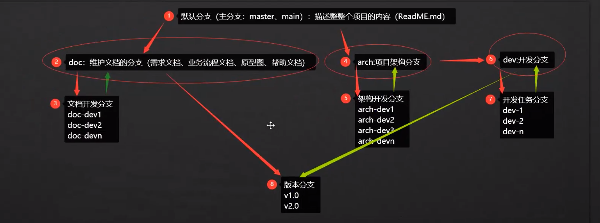


## git基础知识


### 其他注意事项

1. 空文件夹(一个工作空间、工作区)不会被git追踪，必须要有文件才可以
2. 一个github仓库**只能有一个.git文件夹（存放在最外面）**，如果Github仓库的其他文件夹中里面有.git文件夹，那么在GitHub上面就不能查看这个文件夹里面的内容。


### 3级 1.1 `.gitignore` 的文件

创建一个名为 `.gitignore` 的文件，用来指定 Git 忽略哪些文件和文件夹，这些被忽略的文件将不会被纳入版本控制。

以下是如何编写 `.gitignore` 文件的基本步骤：

1. **创建 `.gitignore` 文件**：首先，在你的 Git 项目根目录下创建一个名为 `.gitignore` 的文件。

2. **编辑 `.gitignore` 文件**：使用文本编辑器打开 `.gitignore` 文件，然后添加忽略规则。每个规则通常占据一行。

3. **编写忽略规则**：忽略规则遵循一些基本的模式匹配规则。以下是一些示例规则：

   - 忽略单个文件：要忽略一个特定文件，只需在 `.gitignore` 文件中添加文件名即可，例如：`file.txt`
   - 忽略特定文件类型：要忽略特定类型的文件，可以使用通配符 `*`，例如：`*.log` 将忽略所有 `.log` 文件。
   - 忽略整个文件夹：要忽略整个文件夹及其内容，可以在 `.gitignore` 中添加文件夹名称，例如：`myfolder/`
   - 使用斜杠 `/` 分隔路径：你可以指定相对于 `.gitignore` 文件所在目录的路径，例如：`folder/subfolder/`
   - 使用 `#` 添加注释：你可以在 `.gitignore` 文件中使用 `#` 符号添加注释，以提供说明或注解。

   ~~~sh
   *.txt  ，*.xls  表示过滤某种类型的文件
   target/ ：表示过滤这个文件夹下的所有文件
   /test/a.txt ，/test/b.xls  表示指定过滤某个文件下具体文件
   !*.java , !/dir/test/     !开头表示不过滤
   *.[ab]    支持通配符：过滤所有以.a或者.b为扩展名的文件
   /test  仅仅忽略项目根目录下的 test 文件，不包括 child/test等非根目录的test目录
   ~~~

   可以使用一个通配符来一次性忽略所有`.idea`文件夹，以及其中的内容。你可以在项目的根目录下的`.gitignore`文件中添加如下一行：
   
   ```
   **/.idea/
   ```
   
   这将递归地忽略所有项目中名为`.idea`的文件夹，不管它们在项目的哪个子目录中。这个通配符将匹配任何目录下的`.idea`文件夹，并将其排除在版本控制之外。不需要为每个子目录都单独设置忽略规则。

下面是一个示例 `.gitignore` 文件的内容：

```sh
plaintextCopy code# 忽略所有 .log 文件
*.log

# 忽略 build 文件夹及其内容
/build/

# 忽略 .env 文件
.env
```

1. **保存文件**：保存 `.gitignore` 文件。

一旦你编写了 `.gitignore` 文件并将其保存到项目根目录，Git 将在执行 `git add` 和 `git commit` 操作时自动忽略 `.gitignore` 中指定的文件和目录。

### 提交记录

提交记录是一个**快照**，除了第一个提交，其他提交都有父节点，提交记录是在当前父节点的基础上，**记录变化的部分**，相比普通的复制粘贴，更加**轻量级**，能够在多个提交记录之间来回穿梭。

### 1.2 HEAD与分支的移动

head一般指向分支（如：master），master指向具体的提交记录

HEAD总是指向当前分支上最近一次提交记录（提交一个记录后HEAD与分支一起移动）。

**git checkout 移动HEAD的指向**

**分离的HEAD状态**就是指让其**指向某个具体的提交记录**而不是分支名。

如：

原来： HEAD -> main -> c1

~~~sh
git checkout c1 # 不仅仅可以切换到分支，还可以切换到具体的提交记录
~~~

结果：HEAD ->  c1，main -> c1

#### 直接引用：使用哈希值 

移动HEAD:

~~~sh
git checkout c1
~~~

移动分支：

~~~sh
git branch -f main c2 # 把main分支移动到指向c2提交
git reset ...
git rebase bugFix main # 相当于git checkout main + git rebase bugFix(把当前分支main的提交移动到bugFix分支，main也移动)
~~~


#### 相对引用：^与~[num]

移动HEAD:

在分支或者HEAD的基础上使用~与^

~~~sh
git checkout Head^ # 使用Head^来向上面移动
# 或者	
git checkout main^ # 使用^表示从main分支向上移动1个提交记录
git checkout main~2 # 单个~相当于^,使用~2表示从main分支向上移动2个提交记录
~~~


操作符 `^` 与 `~` 符一样，后面也可以跟一个数字。指定“合并提交”的某个 parent 提交。

Git 默认选择“合并提交”的“第一个” parent 提交(即：合并提交c6正上方的c2提交)，在操作符 `^` 后跟一个数字可以改变这一默认行为。

例如：

~~~sh
git checkout HEAD^2 # 表示移动到HEAD上面的第二个父提交(默认从左到右开始数)
~~~


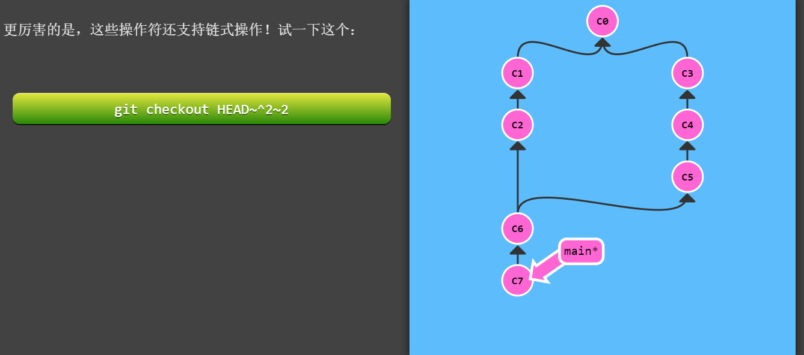

结果：

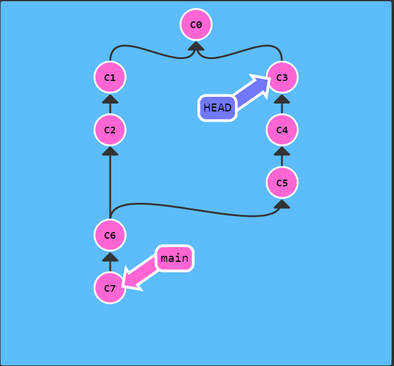

### tag标签相关命令

有没有什么可以**永远指向某个提交记录的标识**呢，比如软件发布新的大版本，或者是修正一些重要的 Bug 或是增加了某些新特性，有没有比分支更好的可以永远指向这些提交的方法呢？

标签可以永久地将某个特定的提交命名为里程碑，然后就**可以像分支一样引用**了。更难得的是，它们并**不会随着新的提交而移动**。你**也不能切换到某个标签上面进行修改提交**，它就像是提交树上的一个锚点，标识了某个特定的位置。

#### git tag命令

指定提交c1进行打标签，如果你不指定提交记录，Git 会用 `HEAD` 所指向的位置。

~~~sh
git tag v1 c1 # 给c1提交打上名为v1的标签
~~~


切换到 `v1` 上面，要注意你会进到分离 `HEAD` 的状态 —— 这是因为不能直接在`v1` 上面做 commit。

#### git describe命令

**描述**离你最近的锚点（也就是标签），它就是 `git describe`！

Git Describe 能帮你在提交历史中移动了多次以后找到方向；当你用 `git bisect`（一个查找产生 Bug 的提交记录的指令）找到某个提交记录时，或者是当你坐在你那刚刚度假回来的同事的电脑前时， 可能会用到这个命令。

`git describe` 的语法是：

```sh
git describe <ref>
```

`<ref>` 可以是任何能被 Git 识别成提交记录的引用，如果你没有指定的话，Git 会使用你目前所在的位置（`HEAD`）。

它输出的结果是这样的：

```sh
<tag>_<numCommits>_g<hash>
```

`tag` 表示的是离 `ref` 最近的标签， `numCommits` 是表示这个 `ref` 与 `tag` 相差有多少个提交记录， `hash` 表示的是你所给定的 `ref` 所表示的提交记录哈希值的前几位。

当 `ref` 提交记录上有某个标签时，则只输出标签名称

例如：

初始状态：

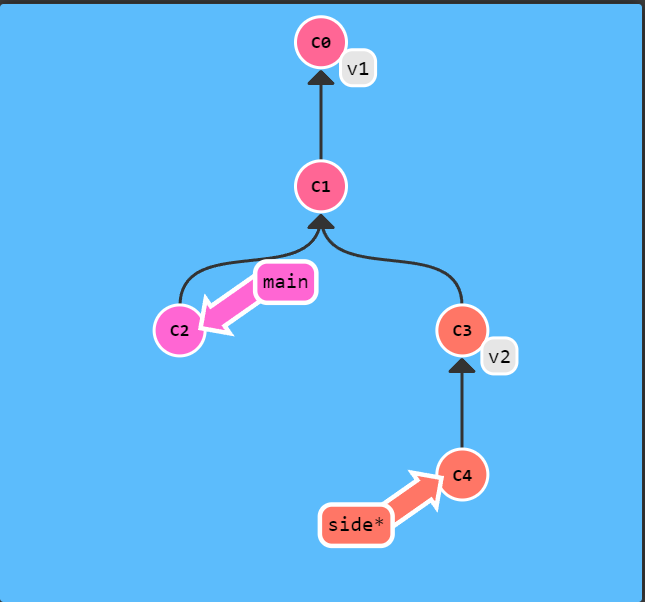

`git describe main` 会输出：

```
v1_2_gC2
```

`git describe side` 会输出：

```
v2_1_gC4
```

### 撤销变更命令 reset...

#### git reset 重置命令

```sh
git reset c1 # 把当前分支指向的提交改为c1
```

**--hard:**

- `git reset --hard` 将会重置当前分支的指针（HEAD）、暂存区和工作目录，使它们与指定的提交完全一致。
- 执行这个命令后，之前的所有未提交的更改都将被永久删除，工作目录会被还原到指定提交的状态。

```sh
git reset --hard <commit-hash>
```

**--mixed:**

- `git reset --mixed` 是默认行为，如果不指定模式，默认就是 `--mixed`。
- 这个选项将会重置当前分支的指针和暂存区，但是工作目录不会被修改。未提交的更改会保留在工作目录，但是不会被暂存区追踪。

可使用于**撤消Git中的本地提交**，当你不小心将错误的文件提交给[Git](https://en.wikipedia.org/wiki/Git)，但是还没有将提交推送到服务器时。

用法如下：

```sh
$ git commit -m "do Something"             				  # (1) 含有错误的提交
$ git reset HEAD~                                          # (2) 令分支指向上一个提交，但是当前提交的错误内容不会被修改
<< edit files as necessary >>                              # (3) 修改错误的提交
$ git add ...                                              # (4) 修改完毕后，再次提交到暂存区
$ git commit -m '提交信息'                                  # (5)  把修改正确的提交进行提交
```

结果：会在reset到的提交处(这张图表示：reset到了“git完结”处，修改后再提交的情况)建立一个新的main分支，如图：

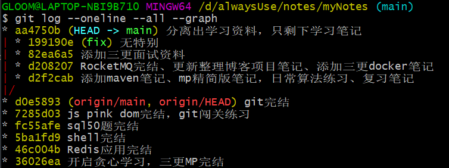


#### git revert 拷贝命令

原理：

初始状态：

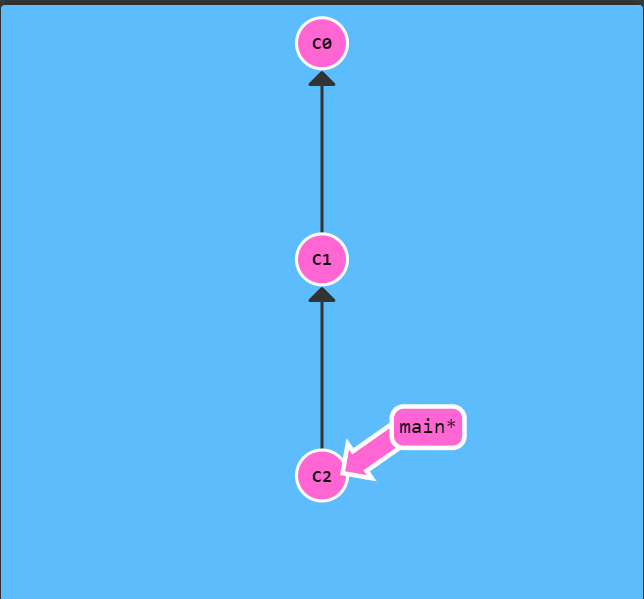

命令：

~~~sh
git revert HEAD # 表示把HEAD指向的提交复制一份，创建一个新的提交，放在当前分支中
~~~


结果：

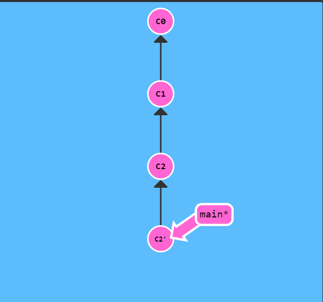

### 3级 2.1 配置类:

#### 1.添加

```sh
git config --global user.name "yourName"
git config --global user.email "your@email.com"
```

#### 2.修改

###### （1）覆盖的形式：

```sh
git config --global user.name "yourName"
git config --global user.email "your@email.com"
```

###### （2）替换的形式：

```sh
git config --global --replace-all user.name "yourName" 
git config --global --replace-all user.email "your@email.com"
```

#### 3.删除

无效？

```sh
$ git config --global --unset user.name "yourName"
git config --global --unset user.email "your@email.com"
```

#### 4.查看

###### （1）查看所有：

```sh
git config --list
```

###### （2）查看指定信息：

```sh
git config user.name
git config user.email
```

#### 直接修改配置文件

直接访问`C:\Users\GLOOM\.gitconfig`文件，修改相应的配置即可。

### 2.2 clone类：

克隆项目到本地:

clone会做如下操作。1、pull操作 拉取代码。2、初始化本地仓库。3、创建远仓别名(origin)

~~~sh
git clone 远程仓库链接
~~~

克隆指定分支:

```sh
git clone -b 远分支 远链接
```

### 2.3 查看提交类：

查看项目中你写的代码行数：

~~~sh
git log --author="Your Name" --oneline --shortstat | grep -E "fil(e|es) changed" | awk '{added+=$4; removed+=$6} END {printf "Added lines: %s, Removed lines: %s, Total lines: %s\n", added, removed, added-removed}'
~~~


查看详细的提交信息（作者、日期...），使用上下来查看更多的提交

~~~sh
git log
~~~

显示所有分支的所有提交情况（git bash窗口足够大才能够看到更多），使用图像、一行的方式

```sh
git log --all --graph --oneline 
```

查看某个人的提交情况：

~~~sh
git log --author='五月的夏天'
~~~

显示本人历史所有的(不包括其它人)提交情况，从克隆仓库开始

```sh
git reflog
```


### 2.4 删除类

git删除文件：与使用鼠标手动删除文件不同，git命令删除使用git status查看就已经为绿色

~~~sh
git rm demo3.html
~~~

删除暂存区的文件与文件夹：

~~~sh
git rm --cached hello.txt
~~~

~~~sh
git rm -r --cached 文件夹
~~~

具体地，这个命令的各部分含义如下：

- `git rm`: 这是 Git 的删除文件命令。
- `--cached`: 这个选项告诉 Git 只删除暂存区（索引）中的文件，而不删除工作目录中的文件。
- `[文件夹名]`: 这是你想要从暂存区中删除的文件夹的名称。
- -r 表示递归的删除文件夹

通过执行这个命令，你可以将文件夹及其内容从 Git 的版本历史中移除，但仍然保留在你的工作目录中。

请注意，这个命令只会影响暂存区中的文件，如果你已经将这个文件夹提交到版本历史中，那么它将继续存在于历史快照中，直到你执行一次提交，将删除操作推送到远程仓库。

要**清空 Git 暂存区**中的所有文件，你可以使用以下命令：

1.测试成功

~~~sh
git rm -r --cached *
~~~

使用后再次git add就能够忽略.gitignore中的文件

2. **测试成功**

```shell
git reset
```

这将取消将所有文件从工作目录添加到暂存区的操作，暂存区将为空。文件仍将保留在你的工作目录中，但它们不再处于暂存状态。

### 2.5 提交命令

添加所有文件到暂存区并且提交到本地

```sh
git commit -a -m '注释'
```

只提交某一个文件到本地库中：

~~~sh
git commit -m '提交了一个文件' hello.txt
~~~

提交暂存区的所有文件到本地仓库:

~~~sh
git commit -m '注释'
~~~


### 2.6 分支类命令:

Gt的分支也非常轻量。它们只是简单地指向某个提交纪录。

使用分支其实就相当于在说：“我想基于这个提交以及它所有的parent提交进行新的工作。”


#### 2.6.1 git branch,checkout基本命令

```sh
# 创建分支:
git branch 分支名 
git branch 分支名 main^ # 表示在main分支的上一个提交处创建一个分支
# 创建并切换到创建的分支上
git checkout -b 分支名
git checkout -b 分支名 提交记录的hash # 表示创建分支指向这个提交并且切换到这个分支上

# 查看分支:
git branch -v 
# 删除分支：
git branch -d 分支名

# 更改分支名称 把当前的master分支名称更改为main
git branch -m master main
# 强制重命名当前分支为main。即使main分支已经存在
git branch -M main 

# 切换分支:
git checkout 分支名 #老版本
git switch 分支名 # 新版本

```

### 合并命令

#### git merge 合并1(两个父节点)

在Git中合并两个分支成功后会产生一个特殊的提交记录，它有**两个parent节点**。翻译成自然语言相当于：“我要把这两个parent节点本身及它们所有的祖先都合并进来。”合并后**移动的分支是当前HEAD指向的分支**。

merge命令：把两个分支当前指向的两个提交记录作为两个parent节点，合并出一个新的提交记录，比如下面命令的执行结果为：main分支上合并出了一个新的提交记录，里面包含了bugFix分支与main分支的全部信息。

~~~sh
git checkout main
~~~

初始状态：


```sh
git merge bugFix
```

结果：


~~~sh
git checkout bugFix
git merge main # 因为main是bugFix的子节点，所以父子合并的结果肯定为子节点main
~~~

结果：


#### git rebase 变基 合并2（更加线性的提交序列）

##### 直接git rebase 在当前分支的基础上面复制一份到指定分支去

优点：
Rebase使你的提交树变得很干净，所有的提交都在一条线上。
缺点：
Rebase修改了提交树的历史。
比如，提交C1可以被rebase到c3之后。这看起来C1中的工作是在C3之后进行的，但实际上是在C3之前。
一些开发人员喜欢保留提交历史，因此更偏爱merge。而其他人（比如我自己）可能更喜欢干净的提交树，于是偏爱rebase。

**变基后当前分支会移动！**

第二种合并分支的方法是git rebase,Rebase实际上就是取出一系列的提交记录，“复制”它们，然后在另外一个地方逐个的放下去。

~~~sh
git checkout bugFix
~~~
例如：**移动一个提交记录**：

初始状态：
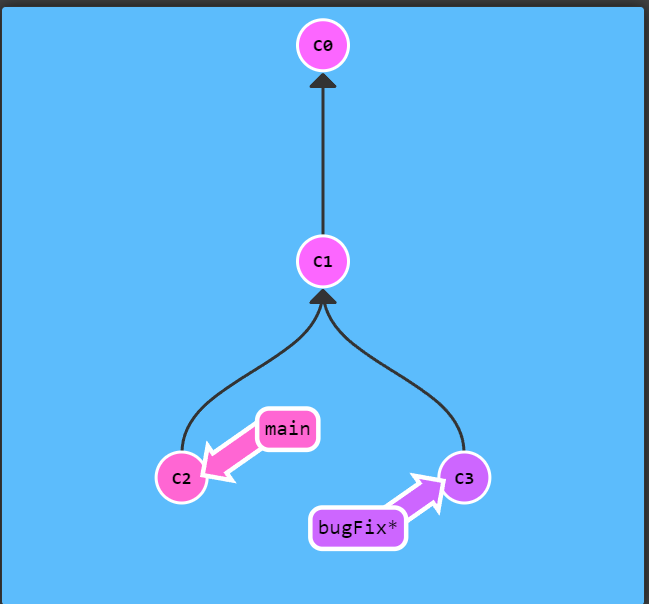


~~~sh
git rebase main # 取出当前分支指向的提交记录复制到main分支上，并且改变当前分支bugFix的引用指向
~~~
如图：
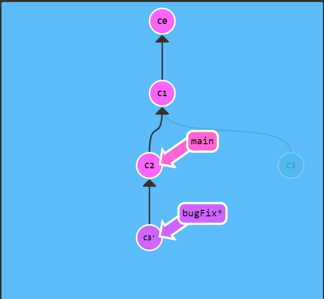

现在bugFix分支上的工作在main的最顶端，同时我们也**得到了一个更线性的提交序列**。
注意，提交记录C3依然存在而C3'是我们Rebase到main分支上的c3的副本。

现在唯一的问题就是main还没有更新，下面咱们就来更新main吧

~~~sh
git checkout main
git rebase bugFix # 取出当前main分支的提交记录复制到bugFix分支上（因为两者实际上是同一个分支，rebase复制后main分支的结果相当于bugFix）
~~~

相当于：

**命令最后面的main分支的提交与分支指向都会移动**    不提前切换分支的变基命令：

~~~sh
git rebase bugFix main # 把main分支的提交变基到bugFix上,因为两个分支在同一条线上，所以只是移动了main分支的指向
~~~


结果：

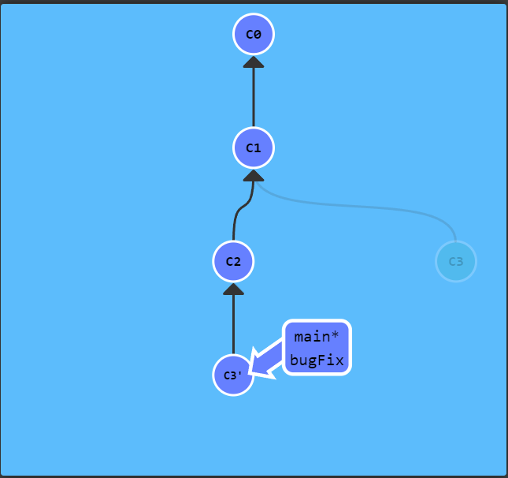

由于bugFix指向的提交继承自main指向的提交,所以Git只是简单的把main分支的引用向前移动了一下而已。


##### -i参数 使用**图形界面**对指定的提交进行排序与筛选 :

两种选择提交的方式，将对这些提交进行排序与筛选：

~~~sh
git rebase -i main # 当前在bugFix分支，命令表示对[bugFix,main)的提交进行图形化界面选择，只选择保留c4
git rebase -i HEAD~4 # HEAD~4表示选择包括HEAD在内的4个提交
~~~


可以使用图形界面对提交记录进行排序与筛选

例如：**移动多个提交**

初始状态：

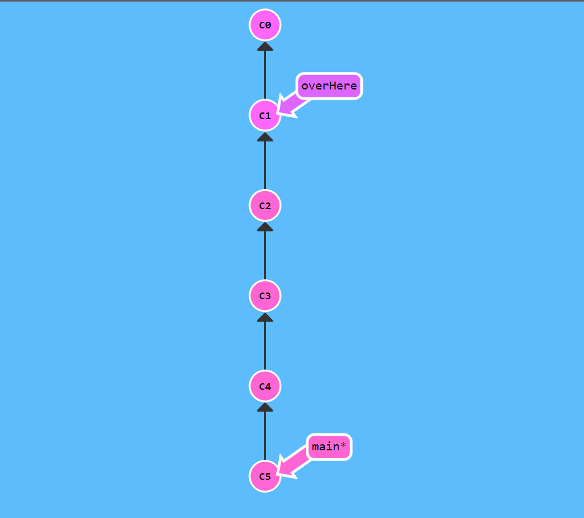

~~~sh
git rebase -i HEAD~4 # -i表示打开图形界面，HEAD~4表示选择包括HEAD在内的4个提交即：c2-c5，对这些提交进行选择后的结果存放在另一个分支(头部与原来的分支相同)存储起来，并且当前分支的执行也会移动过去
~~~

在图形界面中对提交记录进行排序与增删

结果：

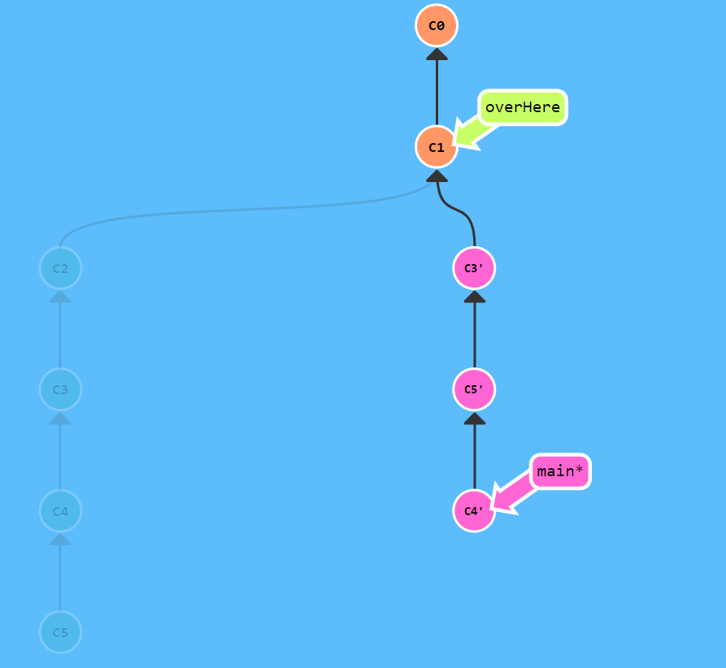

其他：单分支变多分支

初始状态：

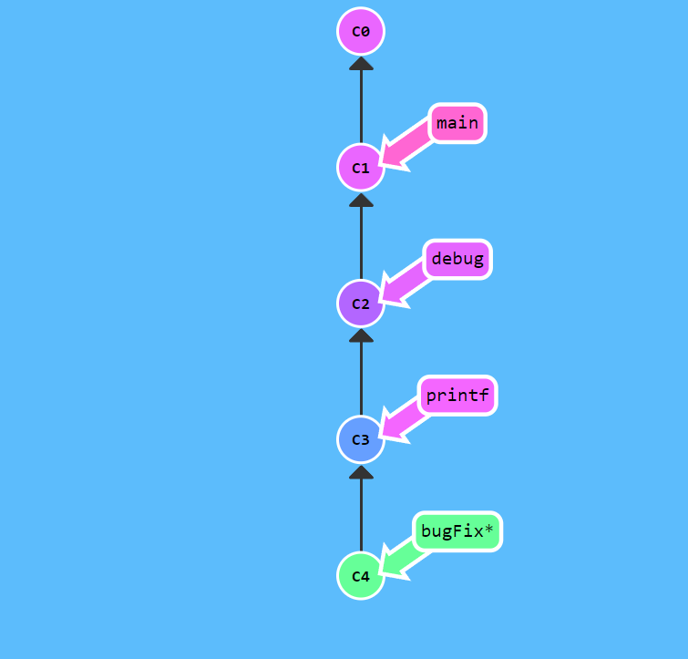

~~~sh
git rebase -i main # 表示对[bugFix,main)的提交进行图形化界面选择，只选择保留c4
git rebase bugFix main # 会更新main的位置,获取main分支的记录放在bugFix上 相当于：git checkout main;git rebase bugFix
~~~

结果：

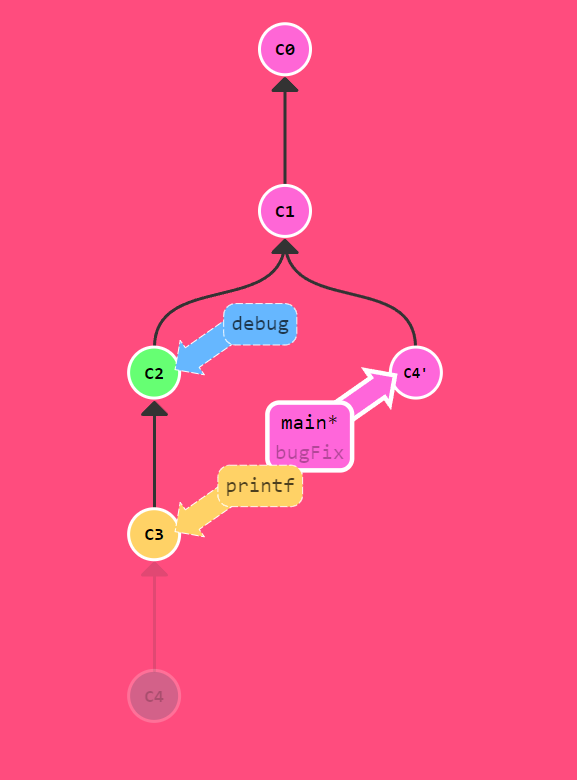


### cherry-pick 优选命令

好用程度：**cherry-pick > rebase(rebase -i) > merge**

把对应的提交拷贝过来作为新的提交提交到本分支中。

要在心里牢记cherry-pick可以将提交树上**任何地方的提交记录**取过来**追加到HEAD上**（只要不是HEAD上游的提交就没问题)

初始状态：

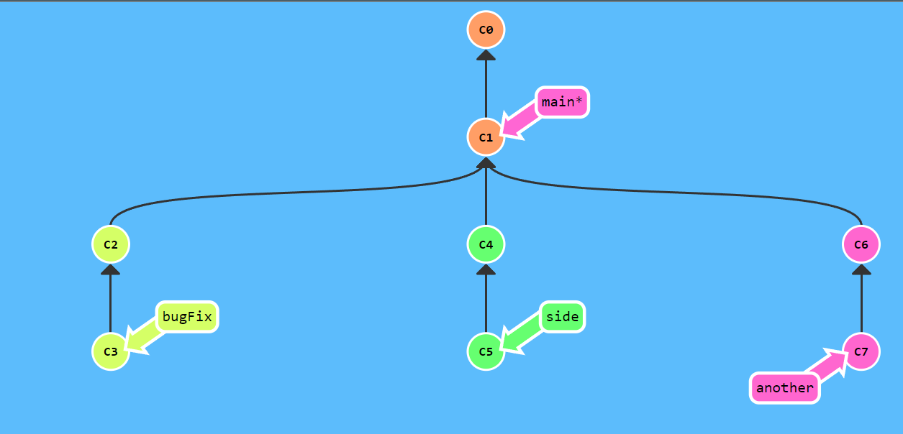

~~~sh
git cherry-pick c3 c4 c7 # 优选c3,c4,c7这三个提交记录到当前分支指向的提交记录后
~~~

结果：

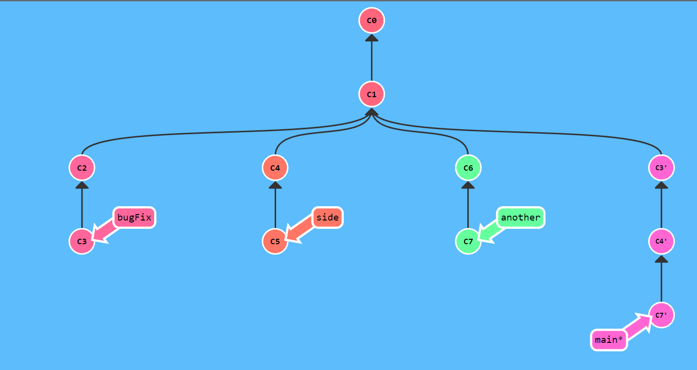

#### 2.6.2 关于冲突：

**冲突产生的原因：**
合并分支时，两个分支对同一个文件都有修改记录时。Gt无法替我们决定使用哪一个。必须人为决定新代码内容。

##### 如何解决冲突：

1 git status找到发生冲突的文件 ,自己进行选择保留哪部分代码

2 删除这些字符：<<<<< HEAD          HEAD指向的分支中冲突的内容           =============       bugFix分支中冲突的内容        >>>>>>bugFix

3 `git add .`和`git commit -m '注释'` 提交所有暂存区的文件。(**注意**：不能够这样只提交发生冲突的文件：`git commit -m ' ' 冲突文件)`

合并发生冲突时（进入merge-ing状态）：直接在本分支解决冲突后提交(修改文件，因为在master进行合并，只有master分支被修改)


### 2.7 最常用的命令

- git init 初始化本地库

- git satus 查看本地库的状态 

- git remote add 远程仓库别名 远程仓库链接
- git clone 链接
- git reflog
- git log --all --graph
- git remote -v  查看远程仓库的别名与对应的链接
- git add 文件
- git commit -m '注释'
- git pull 远仓名 远分支
- git push 远仓名 本分支：远分支
- git reset --hard 版本号

## 3 远程仓库的详细操作

#### 远程分支

远程分支反映了远程仓库在你最后一次与它通信时的状态。

远程分支与本地分支的不同：git checkout切换到远程分支o/main时，HEAD不会指向o/main,而是**处于分离HEAD状态**，指向o/main指向的那个提交。

如图：

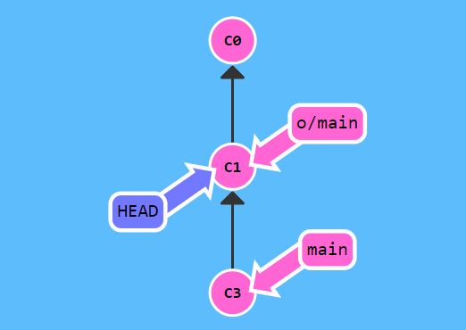

此时进行git commit提交c4，o/main分支的指向也不会移动，而HEAD会移动到新的提交上。

结果：

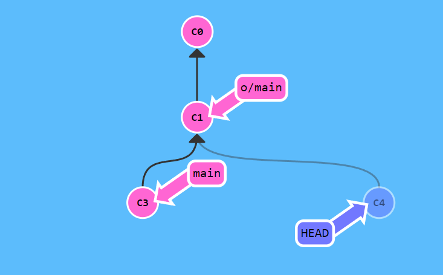


#### git fetch 更新本地的远程分支

**git fetch做了些什么？**
git fetch完成了仅有的但是很重要的两步：
1 从远程仓库下载本地仓库中缺失的提交记录来**更新本地的远程分支**指针（如o/main)

git fetch就是你与远程仓库通信的方式！
git fetch通常通过互联网（使用http:/或git://协议)与远程仓库通信。

**git fetch不会做的事**
git fetch并不会改变你本地仓库的状态。它不会更新你的main分支，也不会修改你磁盘上的文件。

总结：git fetch实际上将本地仓库中的远程分支更新成了远程仓库相应分支最新的状态。

git fetch**会下载并且更新本地的远程分支为最新的状态**！

**没有参数时**：会下载所有的提交记录到各个远程分支

案例：

初始状态：

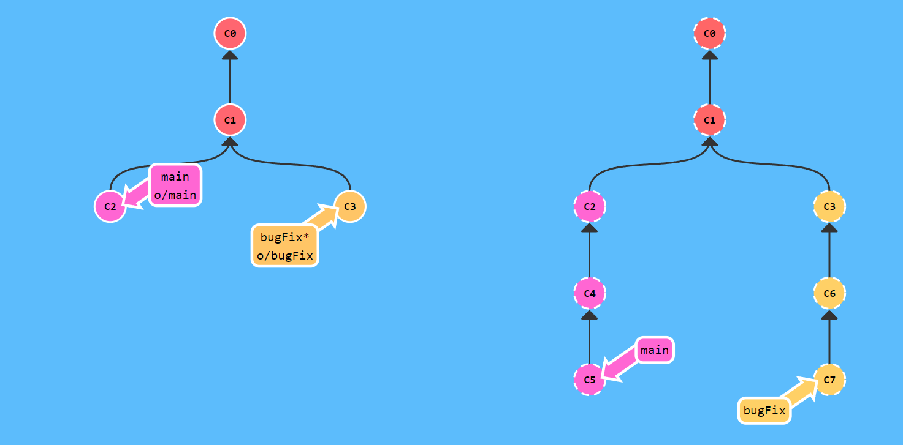

~~~sh
git fetch 远程仓库
~~~

结果：

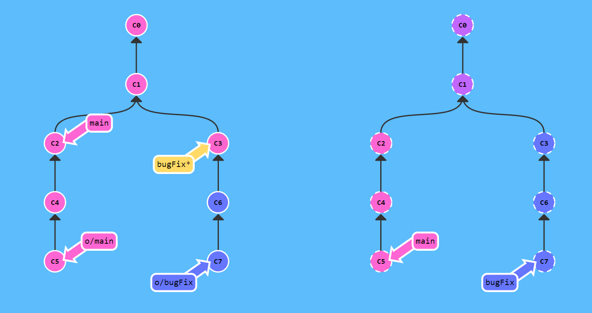

##### git fetch的参数：

从远程下载到本地：

~~~sh
git fetch origin 远程分支：本地分支
~~~

这里有一点是需要**注意**的 ：左边现在指的是远程仓库中的位置，而 右边才是要放置提交的本地仓库的位置。

从本地推送到远程：

~~~sh
git push origin 本地分支：远程分支
~~~


git fetch与 git push 刚好相反，这是可以讲的通的，因为我们在往相反的方向传送数据。但是**fetch与push的参数都符合从左到右传输数据**，无论是push的从左边参数的本地分支推送到右边参数的远程分支，还是fetch的从左边参数的远程分支下载提交到右边参数的本地分支。

例子：

初始状态：

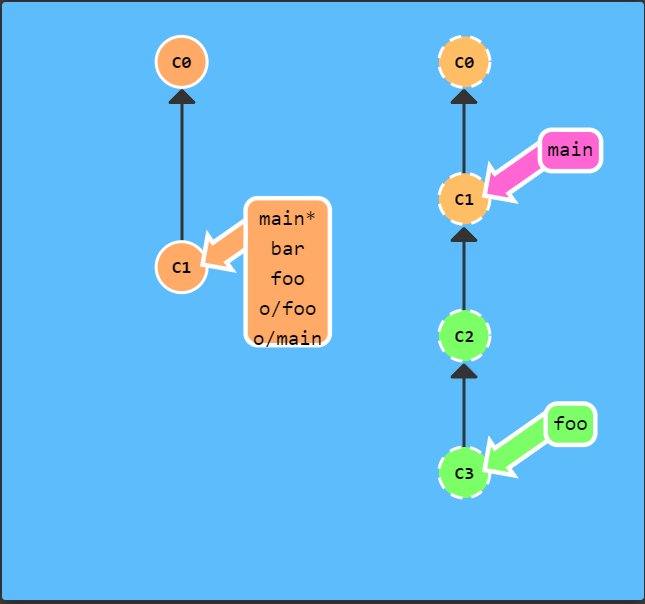

命令：

~~~sh
git fetch origin foo^:bar
~~~

结果：

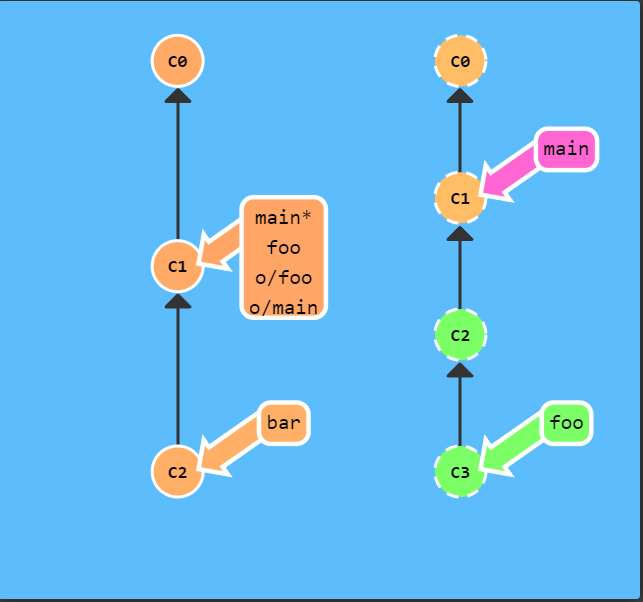

结论：

Git将foo^解析成一个origin仓库的位置，然后将那些提交记录下载到了本地的bar分支上。

**注意：**由于我们指定了目标分支，所以o/foo没有被更新。

如果bar分支不存在，Git 会在 fetch 前自己创建立本地分支, 就像是 Git 在 push 时，如果远程仓库中不存在目标分支，会自己在建立一样

其他命令：

~~~sh
git fetch origin :bar # 表示下载空的东西到bar分支中，会在本地创建一个bar分支
~~~


### 3.1 push、pull详细操作


#### push操作

`git push` 命令通常用于将本地分支的更改推送到远程分支进行合并，将远程分支更新为与本地分支一致。（本地的o/main分支也会更新）

这意味着，如果本地分支**领先于**远程分支，推送操作将会将本地的提交应用到远程分支，使其更新为与本地分支相同。

即：**本地仓库比远程仓库多一个提交时，就能够直接push成功**

~~~sh
git push (https/ssh)链接 本分支：远分支
# 本分支与远分支相同时可简写为：
git push (https/ssh)链接 本分支
~~~

##### push命令的参数：

1 没有指定参数时，默认push的结果是 push当前**HEAD指向的**分支(如main)到HEAD指向的分支追踪的远程分支(如：o/main)的远程仓库的对应分支上。 如果HEAD执行的位置没有追踪远程分支，则命令失败。

~~~sh
git push
~~~

2 **默认命令**

```
git push origin main
```

把这个命令翻译过来就是：

**切换**到本地仓库中的“main”分支，获取所有的提交，再到远程仓库“origin”中找到“main”分支(没有的话就新建)，将远程仓库中没有的提交记录都添加上去,最后更新o/main分支。


3 -u 

~~~sh
# 把本地的main分支推送到origin仓库地址的main分支 同时 添加origin为默认远程仓库地址
git push -u origin main
~~~

作用：推送的同时添加默认的推送仓库为origin的窗口地址，以后进行推送与拉取时，可以不指定仓库地址，git就会使用默认的仓库地址来进行操作。

如：

~~~sh
4git push # 将本地的分支推送到远程的同名分支
git pull
~~~

4 使用:号指定推送的本地分支与远程分支

**(1)还可以指定推送到foo分支前的一个提交为止**：

~~~sh
git push origin foo~1：main # 从foo分支指向的前一个提交开始，推送到远程仓库的main分支，因为推送到的是远程仓库的main分支，所以本地的o/main分支会在推送后进行更新，哪怕推送的是main分支
~~~

意思：**切换到本地仓库中的“foo”分支，获取foo~1及之前的提交，再到远程仓库“origin”中找到“main”分支(没有的话就新建)，将远程仓库中没有的提交记录都添加上去,最后更新o/main分支。**


(2)使用:号删除远程分支

~~~sh
git push origin :foo # 表示推送空的内容给远程仓库的foo分支，这会删除foo分支
~~~


##### (重要)如果push推送前远程仓库的提交已经发生了变更怎么办？

如图：

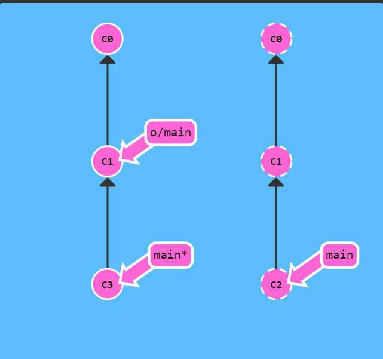

**解法1**：

~~~sh
git fetch origin main # 下载远程仓库的main分支的提交给更新本地的o/main远程分支
~~~

结果：

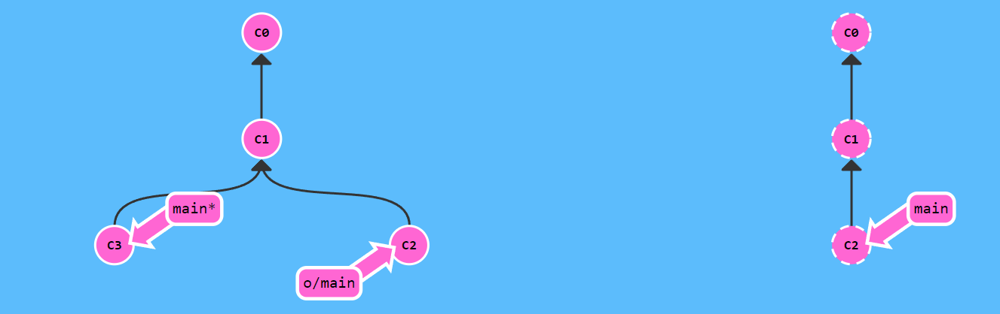

然后

~~~sh
git rebase o/main # 把当前分支的提交变基到本地的远程分支上，保证比远程仓库的提交多且线性
~~~

结果：

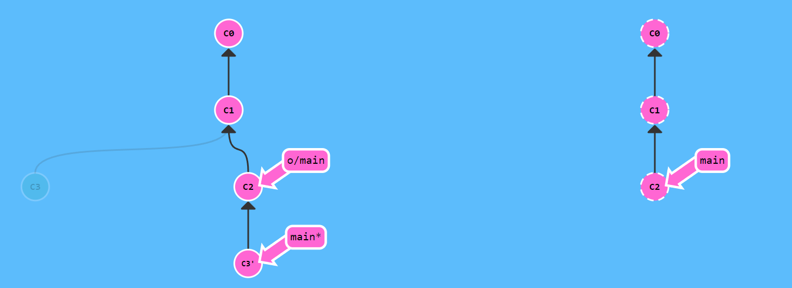

最后

~~~sh
git push origin main：main # 推送到远程仓库的main分支进行合并
~~~

结果：

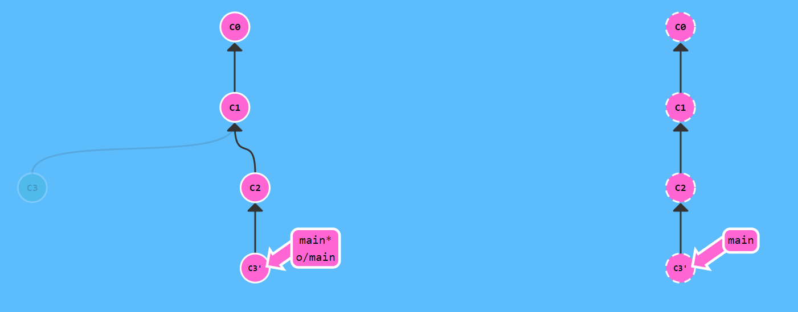

#### git pull --rebase命令

简写版本：

先

```sh
git pull --rebase origin main # 就是fetch和rebase两个命令的简写！
# 相当于：git fetch origin main;git renase o/main(main绑定的远程分支)
```

再

~~~sh
git push origin main：main
~~~


**解法2**：

~~~sh
git fetch 远程仓库
git merge 本地的远程分支
git push push (https/ssh)链接 本分支：远分支
~~~

简写版本：

~~~sh
git pull
git push
~~~


#### pull操作

会把拉取到的代码自动提交到本地库，此时本地库与远程库保持一致(使用git status可查 注意：工作区中可能还有代码没有提交)

`git pull` 命令用于从远程仓库获取最新的更改并将它们合并到你的本地分支。这个命令通常执行以下操作：

1. git fetch
2. git merge
3. **冲突解决（Conflict Resolution）**：如果合并中出现冲突，你需要手动解决这些冲突。冲突通常发生在你和其他人同时修改了相同的文件或代码部分时。

初始状态：

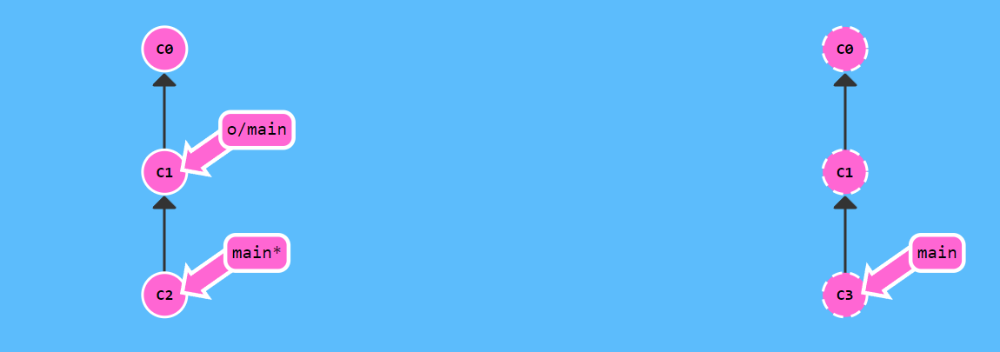

执行代码：
~~~sh
git pull origin main
~~~

结果：

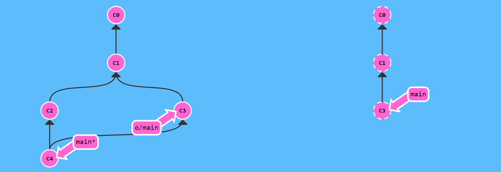

##### git pull命令的参数

其实就是git fetch命令的参数：

从远程下载到本地：

~~~sh
git fetch origin 远程分支：本地分支
~~~


`git pull origin foo` 相当于：`git pull origin foo:o/foo`

相当于：

```shell
git fetch origin foo;  # 拉取远程仓库的foo分支来更新本地的o/foo分支
git merge o/foo # 把当前分支与更新后的o/foo分支进行合并 注意：是当前分支与o/foo分支进行合并而不是创建一个foo分支然后与o/foo分支进行合并
```

还有...

`git pull origin bar~1:bugFix` 相当于：

```sh
git fetch origin bar~1:bugFix # 表示下载到远程仓库bar分支的前一个的提交为止，下载到本地的bugFix分支
git merge bugFix
```

#### clone操作

clone会做如下操作。1、pull操作 拉取代码。2、初始化本地仓库(创建main分支与本地的远程分支)。3、创建远仓别名(origin)

当你克隆时，Gt会为远程仓库中的每个分支在本地仓库中创建一个远程分支（比如o/main)。然后再创建一个跟踪远程仓库中活动分支的本地分支，默认情况下这个本地分支会被命名为main

~~~sh
git clone https链接/ssh链接
~~~


### 3.2 使用ssh进行免密登录：

在本地生成公钥与私钥:

使用ssh免密协议 + rsa非对称加密算法 对绑定这个邮箱的账户生成公钥与私钥

公钥与私钥保存在C:\Users\用户\ .ssh 文件夹中，把公钥保存在github后，在这台电脑上面登录邮箱绑定的账号或者使用ssh链接clone项目时，就不需要密码就能够登录了，github会自动找到这台电脑中的私钥，然后进行登录。

~~~sh
[注意：这里-C这个参数是大写的C,在C:\Users\用户目录下面使用git命令行运行，会自动创建.ssh目录存放公钥与私钥]
ssh-keygen -t rsa -C 邮箱
~~~

### 3.3 远程仓库的冲突 整个流程

a与b先后从中央仓库拉取(或者clone)代码到本地，a修改了test.java后提交到了本地，然后push到了远程仓库，b在a提交后也修改了test.java文件，提交到本地仓库后，b也进行push操作，但是在b修改test.java的时间里，a已经给远程仓库添加了新的提交，所以b需要从远程仓库pull拉取最新的分支(多个提交)到本地，记为分支1，b原来本地的分支(多个提交）记为分支2，然后执行pull操作包含的合并分支操作，合并分支1与分支2，但是因为两个分支都对test.java文件（同一行？）进行了修改，git无法判断保留哪一些，所以发生了冲突，b与a进行讨论后修改了代码，重新提交到本地后冲突解决，分支1与分支2成功合并，b再把合并好的分支push到远程仓库，b本地的分支提交数量比远程仓库的分支（即分支1）多一个提交（即：解决冲突的那个提交），所以可以成功push到远程仓库，覆盖原来的提交。

### 3.4 给分支绑定远程追踪分支的两种方法

1 分支不存在

~~~sh
git checkout -b foo o/main # 创建一个名为 foo 的分支，它跟踪远程分支 o/main。
~~~

初始状态：

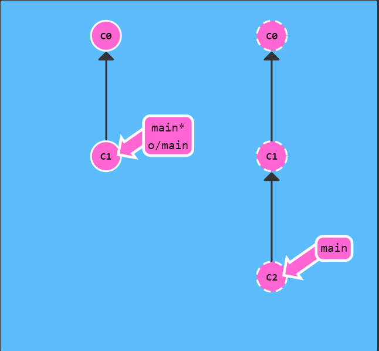

执行：

~~~sh
git checkout -b foo o/main
git pull origin main
~~~


结果：我们使用了o/main来合并foo分支。需要**注意**的是main并未被合并！

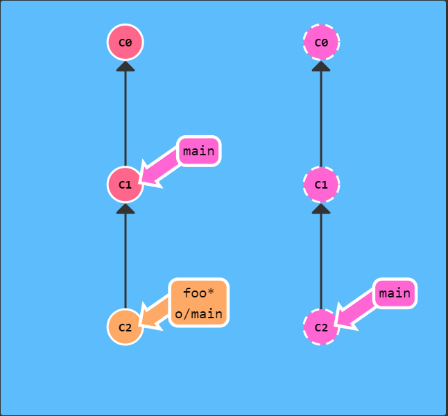

2 分支已存在

```sh
git branch -u o/main foo # 这样 foo 就会跟踪 o/main 了。
```

如果当前就在 foo 分支上, 还可以省略 foo：

```shell
git branch -u o/main
```


## 4 git常见报错与解决方法

### 4.1 使用git push代码到github上时报错：OpenSSL SSL_read: Connection was reset, errno 10054

使用https链接进行推送时报错：

~~~sh
git push https链接 本地分支:远程分支
~~~

参考网上的回答，成功解决问题：

**修改设置，解除ssl验证**

```sh
git config --global http.sslVerify "false"
# 不行则试试下面这个
git config --global https.sslVerify "false"
```

 此时，再执行git操作即可。

**注意：**设置后关闭当前git窗口，重新打开再执行git操作

实在不行，可以**使用仓库的ssh链接**进行推送（前提是在本地电脑配置了ssh免密登录）

~~~sh
git push ssh链接 本地分支:远程分支
~~~

### 4.2 远程服务器拒绝！(Remote Rejected) 不能够使用main分支进行推送

如果你是在一个大的合作团队中工作，很可能是**main被锁定了**，需要一些Pull Request流程来合并修改。如果你直接提交(commit)到本地main,然后试图推送(push)修改，你将会收到这样类似的信息：
！[远程服务器拒绝]main->main(TF402455：不允许推送(push)这个分支；你必须使用pull request来更新这个分支)

**为什么会被拒绝？**
**远程服务器拒绝直接推送(push)提交到main**,因为策略配置要求pull requests来提交更新.
你应该按照流程，新建一个分支，推送(push)这个分支并申请pull request,但是你忘记并直接提交给了main,所以现在你卡住并且无法推送你的更新.

**解决办法**
reset你的main分支和远程服务器保持一致，然后在最新的提交上新建一个分支feature,推送到远程服务器。

否则下次你pull并且他人的提交和你冲突的时候就会有问题。

**具体命令与执行流程**：

初始状态：

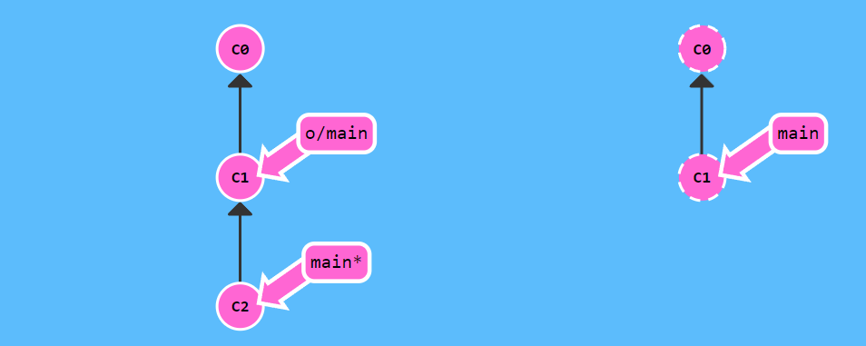

具体操作为：

移动main分支和远程服务器保持一致

~~~sh
git reset --hard c1
~~~

结果：

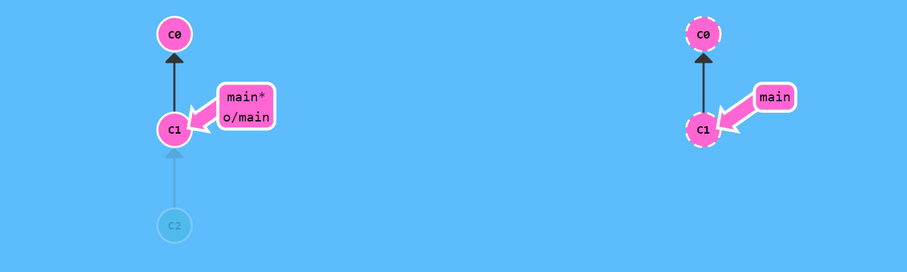

2 在本地最新的分支上新建一个分支feature

~~~sh
git checkout -b feature c2
~~~

结果：

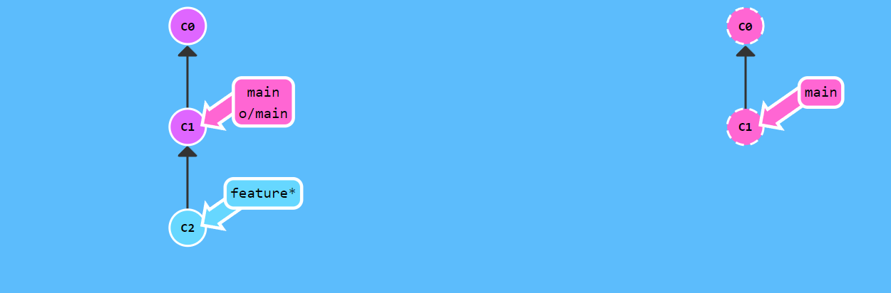

3 推送feature分支到远程服务器

~~~sh
git push origin feature
~~~

结果：

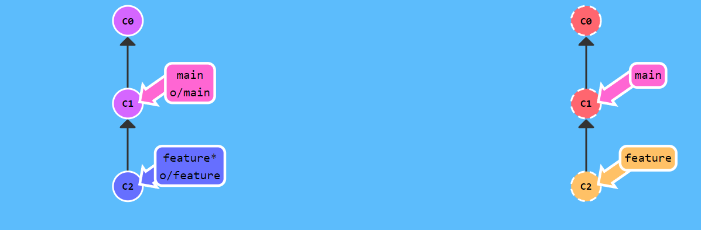


## 5 git的实际使用

#### 基础知识：

 用git实现对配置文件的修改与提交逻辑：本地要使用local环境进行测试，但是提交时要提交的是test环境，开发时怎么使用git最方便呢？ 1 **拉取下来的配置文件为test，但是需要local环境来进行测试，测试完成后修改回test环境即可。因为git是会检查你代码修改后与修改之前是否一样的，如果是一样的，则不会记录为被修改的文件。所以你在提交之前把配置文件改为test的话，这个配置文件相当于没有修改过，git是不会记录这个配置文件已经被修改了的**  


### 5.1 my：获取多提交的github仓库到本地并且进行推送

1.在gitHub中新建一个仓库origin，进行了多个提交。

2.1 在本地的test文件夹中使用git clone命令把整个仓库文件夹（文件名为仓库名,假设为origin）克隆下来,会自动生成名称为origin的远程仓库别名**（重要的是把远程仓库的提交记录也克隆了下来，这是后面成功push到远程仓库的关键）**

~~~sh
git clone 链接
~~~

2.2 在本地的test文件夹(已经包含要提交的文件，要确保没有冲突)中使用git init命令初始化后，再使用命令：

~~~sh
git pull 链接 远分支
~~~

拉取远程仓库的文件在本地进行合并，同时**把远程仓库的提交记录也拉取了下来，这是后面成功push到远程仓库的关键**,直接跳转第4步即可。

3.把要推送的文件复制到origin文件夹中（**注意：不能包含.git文件夹**），使用git进入origin文件夹(test文件夹中没有.git文件，不是一个git仓库)	

~~~sh
cd origin/
~~~

4.把新复制过来的文件添加暂存区

~~~sh
git add .
~~~

5.提交本地库(**注意**：提交之前一定要检查一遍提交的文件【是否包含：个人信息、不必要的文件】)

~~~sh
gti commit -m '注释'
~~~

6.最后push到远程仓库即可(此时本地仓库既有远程仓库之前的提交，还在本地比远程仓库多了一个提交，所有能够成功push)

~~~sh
git push origin 本分支：远分支
~~~

7.后面只要不在github的远程仓库上直接修改的话，重复4-6即可把本地修改的内容备份到远程仓库了。


### 5.2 b站：推送文件到github的空仓库


1 初始化、添加、添加到本地（本地有多个提交）

~~~sh
git init
git add *
git commit -m "first commit"
~~~

2 修改git默认分支master为github仓库的默认分支main

~~~sh
git branch -m mastar main
# 或者
git branch -M main
~~~

3 添加远程仓库地址，起别名

~~~sh
git remote add origin 链接
~~~

4 推送（把本地的提交记录也推送给了远程仓库）

~~~sh
git push origin main:main
~~~

### 5.3 修改已经提交的提交记录

初始状态：

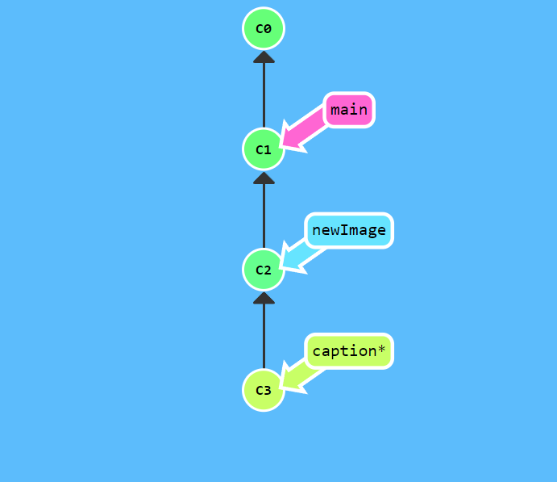

这种情况也是很常见的：你之前在 `newImage` 分支上进行了一次提交，然后又基于它创建了 `caption` 分支，然后在caption分支上又提交了一次。

此时你想对某个以前的提交记录(如c2)进行一些小小的调整。比如设计师想修改一下 `newImage` 中图片的分辨率，尽管那个提交记录并不是最新的了。

我们可以通过两种方法来克服困难：

#### (1) rebase -i解法

- 先用 `git rebase -i` 将提交重新排序，然后把我们想要修改的提交记录挪到最前
- 然后用 `git commit --amend` 来进行一些小修改
- 接着再用 `git rebase -i` 来将他们调回原来的顺序
- 最后我们把 main 移到修改的最前端（用你自己喜欢的方法），就大功告成啦！

具体执行代码：

~~~sh
git rebase -i HEAD~2 # 选择HEAD前面的两个提交打开图形界面，把c2移动到前面
~~~

结果：

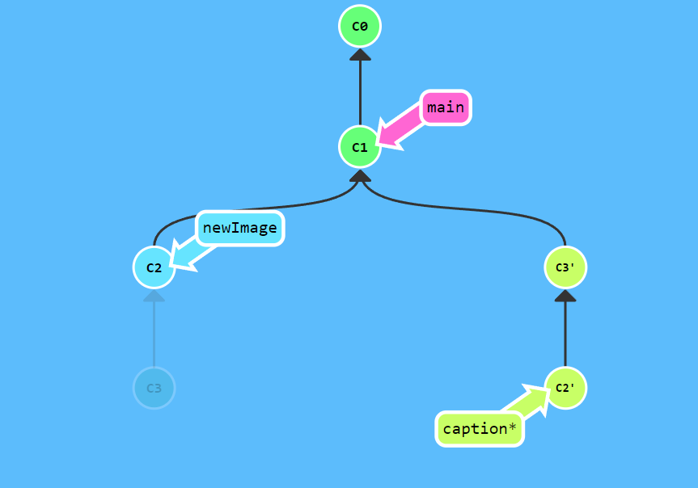

执行代码：

~~~sh
git commit --amend # 修改当前分支caption指向的提交记录c1,修改后的提交存储在另一个分支中，并且当前分支caption指向修改后的提交处c2''处
~~~

结果：

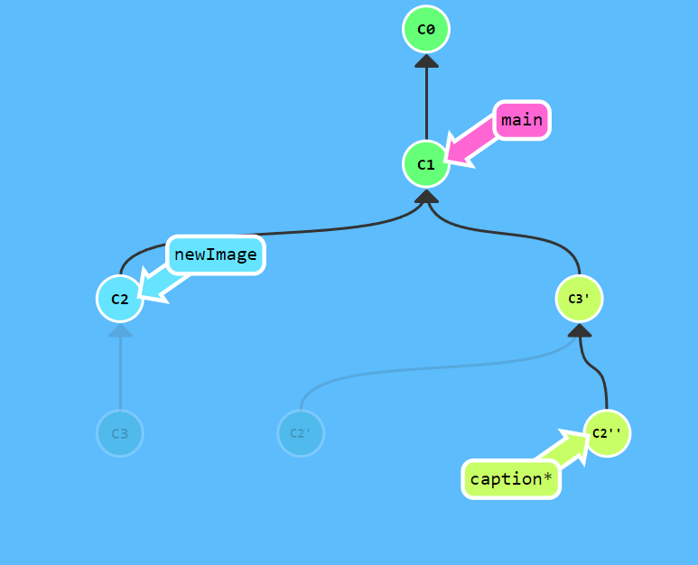

执行代码：

~~~sh
git rebase -i HEAD~2 # 把修改后的提交记录c2''移动回去
~~~

结果：

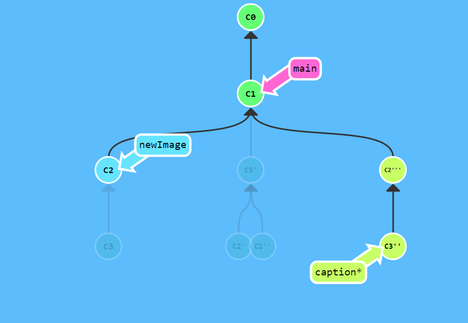

执行代码：

~~~sh
git rebase caption main # 相当于切换到main后执行git rebase caption,main分支移动
~~~

结果：

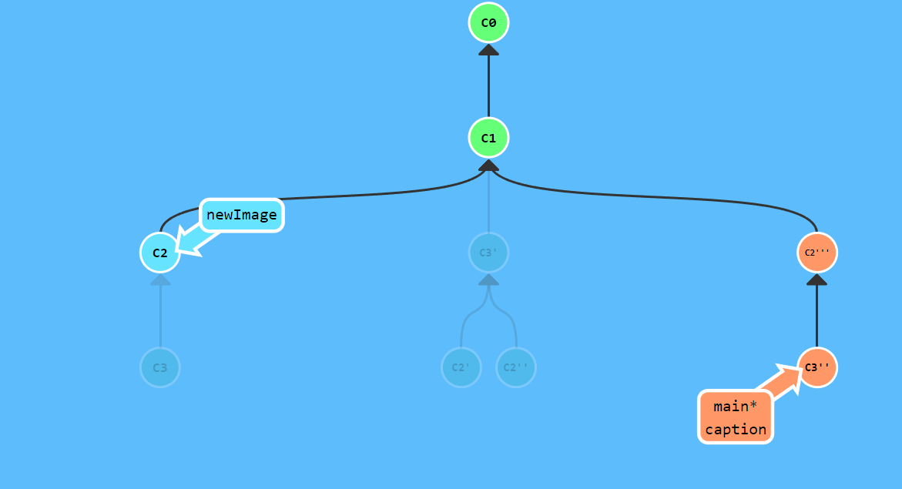

#### (2) cherry-pick解法

```shell
git checkout main
git cherry-pick c2
git commit --amend
git cherry-pick c3
```

