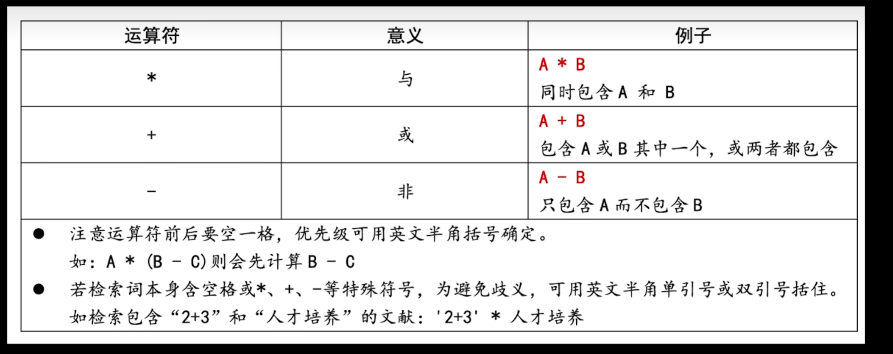
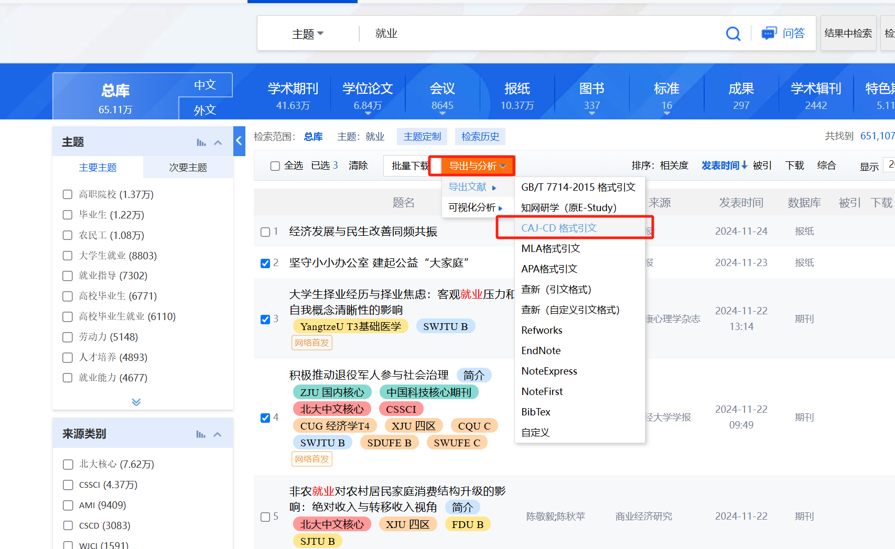
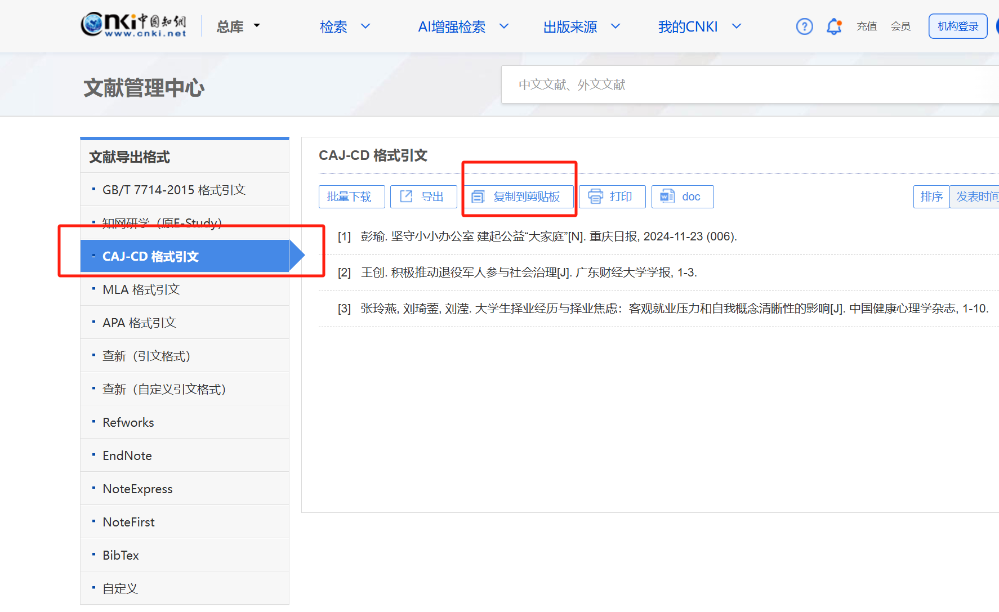

# 论文

## 开题报告

开题报告就相当于论文的绪论，直接参考知网上：硕士博士的学位论文即可

不用老是担心查重问题，**先写出来再降重**

### **文献综述（国内外研究现状）**：

白嫖他人论文的（文献综述），再使用秘塔写作猫的改写功能降重，其中可能要再自主找寻参考文献，修改引用方式

## 知网研学

### 从百度学术中进行导入论文到word：

https://blog.csdn.net/yunwaihe/article/details/131083660

### 知网搜索技巧

#### 基本检索

**`基于SpingCloud + Vue的报销管理钉钉OA小程序的设计与实现`**

~~~
钉钉小程序 * OA
钉钉小程序 + OA系统
钉钉小程序 + OA系统 + 报销管理 + OCR识别 + 发票
~~~

再配合主题、关键词等搜索

#### 高级检索

#### 句子检索：

可搜索含有多个指定词语的句子

### 论文导入格式

五邑-caj格式

如：

~~~
[1] 彭瑜.坚守小小办公室  建起公益“大家庭”[N].   重庆日报,   2024-11-23   (006). 
[2]王创.积极推动退役军人参与社会治理[J].广东财经大学学报,1-3.
[3]  张玲燕,刘琦蓥,刘滢.大学生择业经历与择业焦虑：客观就业压力和自我概念清晰性的影响[J].中国健康心理学杂志,1-10.
~~~

#### 操作方式：

