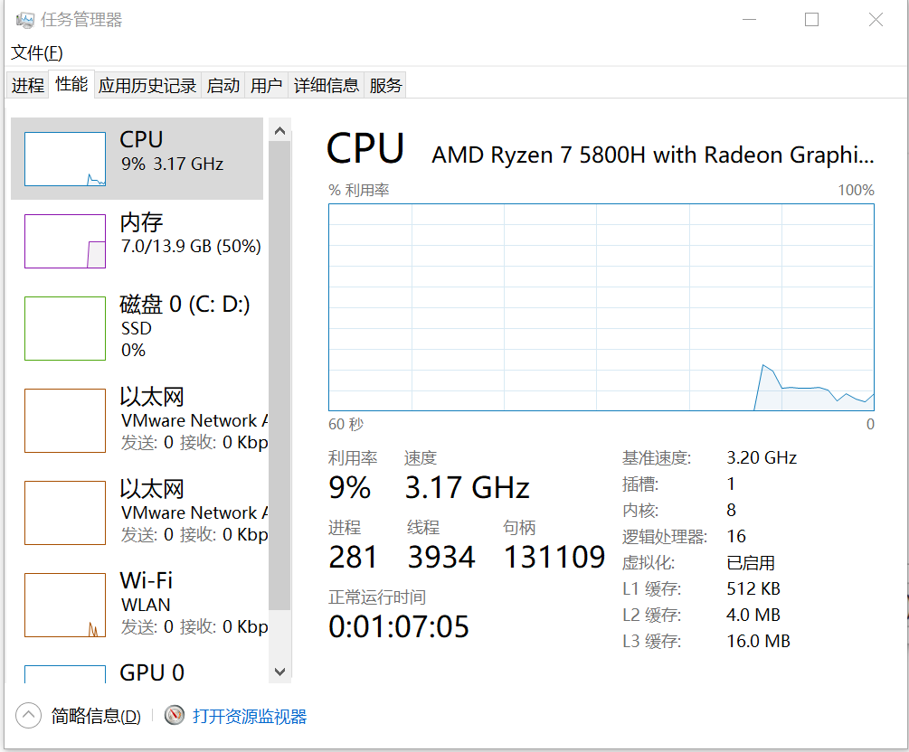
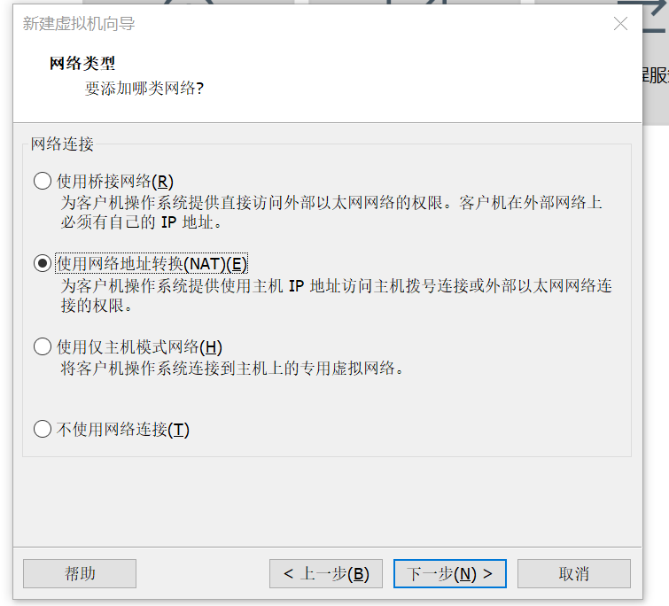
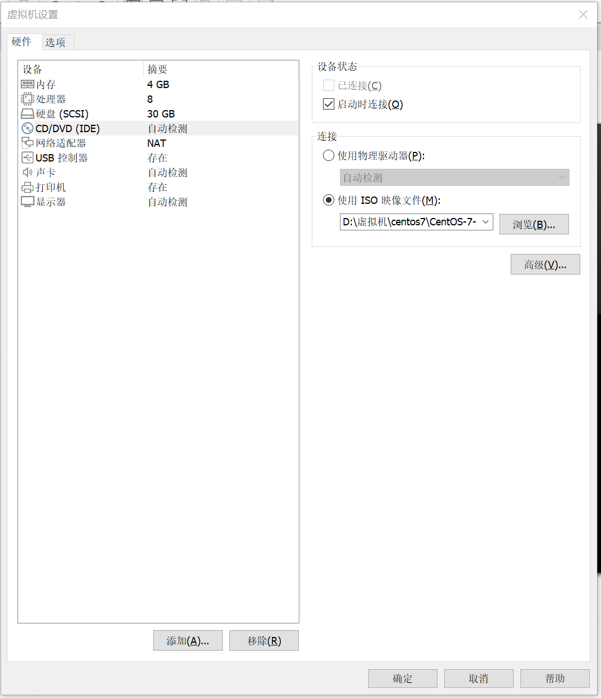

# Linux的使用

## 1:常用命令

### ls 查看文件

等价于 ll  

```sh
ls -alF 
```

- -a: 查看隐藏文件
- -l: 查看详细信息 
- -F: 在列出的文件名称后加一符号；例如可执行档则加 "*", 目录则加 "/" 
- -h: 以人类可读的方式显示当前目录中目录大小(如:7.2K 表示大小为7.2KB)


查看指定目录下面的内容

~~~sh
ls -l /etc | grep bash # 查看/etc目录下名称包含bash的文件
~~~


### pwd 查看当前工作路径的绝对路径

### cd 移动

cd . ,cd..

cd study/ 表示移动到study文件夹

### sudo -s 切换root用户

sudo -s 表示切换为root用户

su - study 表示切换为study用户

### touch 创建文件

### rm 删除文件

rm -rf /* 删库跑路

参数：

- -i 删除前逐一询问确认。
- -f 即使原档案属性设为只读，亦直接删除，无需逐一确认。
- -r 表示递归的删除目录和目录下面的文件 

### exit 退出root用户或者退出终端

exit:可以是退出当前用户然后返回上一个用户

### who 查看当前用户的相关信息

信息分别为：哪一个用户，使用的控制台、登录时间和ip地址

查看当前的所有用户的信息

~~~sh
who
~~~

查看当前操作的用户的信息

```sh
who am i # 查看当前操作的是哪一个用户，使用的控制台、登录时间和ip地址
```


### groups 查看当前用户所有的用户组

用户加入了相应的用户组才能使用相应的命令

### id 查看用户所属的用户相关信息:用户id，组id，所属组id

id test 查看test用户的相关信息

### cat 把文件打印到控制台上

cat /etc/passwd 打印/etc目录下的passwd文件

### alias 查看所有命令的别名

1.给ls --color=never**起别名**为ls，覆盖原来默认的ls --color=auto

注意：这是**临时起名**，重启后就会失效

~~~sh
alias ls='ls --color=never'
~~~

**2.设置别名永久生效与删除别名:**

写入环境变量配置文件

```sh
vi  ~/.bashrc
```

重新加载文件

~~~sh
source .bashrc
~~~

删除别名(临时删除)

```sh
unalias 别名
```

3.命令生效顺序

1. 第一顺位执行用绝对路径或相对路径执行的命令。
2. 第二顺位执行别名。
3. 第三顺位执行Bash的内部命令。
4. 第四顺位执行按照**$PATH环境变量定义的目录(输入命令时在列出来的目录中进行查找)**查找顺序找到的第一个命令

### ln 创建一个链接文件(快捷方式)

ln .bash_logout kk 表示给.bash_logout创建一个硬链接文件(文件类型为-)并命名为kk

ln -s .bash_logout kkk 表示给.bash_logout创建一个软链接文件(文件类型为l)并命名为kkk

### chmod修改文件的权限

ugo:u当前用户(user) 、g当前用户组(group)、o其他(other)

读r、写w、执行x

目录没有x权限就不能使用cd进入

例如：

```sh
chmod ug-w test # 表示修改test文件的user,groups的权限：去除w权限
chmod u+w test # 给当前用户添加执行test文件的权限
```

表示修改test文件的user,groups,other的权限(**r=4，w=2，x=1)**: 改为rw-rw-r--
```sh
chmod 664 test 
chmod 777 test # 赋予ugo所有权限
```

**例子：**

您希望只有root用户能运行`deploy_docker.sh`脚本。以下是步骤：

1. **将文件的所有者设置为root：** 使用`chown`命令将文件的所有者设置为root用户。

   ```sh
   sudo chown root:root /path/to/deploy_docker.sh
   ```

2. **修改文件权限：** 使用`chmod`命令修改文件权限，以便只有文件的所有者（即root）能够执行它。

   ```sh
   sudo chmod 700 /path/to/deploy_docker.sh
   ```

在完成上述操作后，只有root用户具有读、写和执行`deploy_docker.sh`脚本的权限。


### chown,chgrp修改文件的所属者与所属组

sudo chown root test 表示把test文件的所属者改为root

sudo chgrp root test 表示把test文件的所属组改为root

### cp 拷贝文件

```sh
cp ../study newStudy # 表示拷贝上一级目录下的study文件到当前目录中并重命名为 newStudy

cp -r study test # 表示递归复制当前study文件夹的所有文件到test中
cp -r vue/dist/* /usr/share/nginx/html # 表示递归复制当前vue/dist文件夹的所有文件到/usr/share/nginx/html中
```


### mv移动文件或重命名

mv test ../study 表示移动test到上一级的study

mv test yyds 表示重命名

### find 查找文件

-name:指定查找的文件名称

```sh
sudo find /etc -name passwd* # 表示查找/etc路径下面所有passwd开头的文件
```

-atime:指定根据文件的创建时间来进行查找

~~~sh
find /etc -atime +10 -name t* # 表示查找10天前的t开头的文件
~~~

-exec:对查找到的文件进行处理

~~~sh
find /etc -atime +10 -name t* -exec rm -rf {} \; # 表示查找10天前的t开头的文件 并且 删除查找到的文件
~~~

- **`{}`：** 是一个占位符，`find`命令会将匹配的文件名替换到这个位置。在这个例子中，`{}`将被替换为`find`命令找到的每个文件或目录的名称。
- **`\`：** 用于转义最后的分号`;`，确保`find`命令正确解释`-exec`选项的结束。


### top监控界面，类似任务管理器

top 表示进入监控界面

q 表示退出监控界面

1 表示查看使用CPU的使用情况

f 表示设置显示的信息

### free 查看内存的使用情况

free -m 以M为单位

free -g 以G为单位

### lsblk 查看所有块设备的信息，其中就包括我们的硬盘、光驱实现

lsblk

###  fdisk,mount 实现挂载

sudo fdisk -l 连接u盘后查看u盘所在目录

sudo mount /etc/sda1 u-test 把 /etc/sda1目录挂载到u-test目录中(把/etc/sda1的文件复制一份到u-test中)，对u-test中文件的所有操作相当于对/etc/sda1的操作

sudo umount /etc/sda1 取消挂载

### df查看当前磁盘使用情况

df -m

### ps等命令 查看当前运行的一些进程、线程

- `ps -fe` 查看所有进程 
- `ps -fT -p <PID>` 查看某个进程（PID）的所有线程 
- `top` 按大写 H 切换是否显示线程 
- `top -H -p <PID>` 动态查看某个进程（PID）的所有线程 

查看Java进程，安装了JDK后可使用：

~~~sh
jps 
~~~

查看进程的所有线程，安装了JDK后可使用

```shell
jstack 进程id 
```


### kill 操作进程

~~~sh
kill 进程id 
~~~

或者：

kill -9 进程id 

- 1 (HUP)：重新加载进程。
- 9 (KILL)：杀死一个进程。
- 15 (TERM)：正常停止一个进程。

### shutdown关机

sudo shutdown 关机

sudo shutdown -c 取消关机

sudo shutdown now 马上关机

### tar压缩命令

tar命令可以将多个文件和目录打包成一个单一的归档文件，而不进行压缩。

这个归档文件可以包含文件的权限、所有者信息以及目录结构等元数据。

 虽然 `tar` 本身并不压缩，但通常与压缩工具（如 `gzip`、`bzip2`）一起使用，以便在创建归档文件的同时进行压缩，减小文件大小。

压缩命令：	

```sh
tar -zcvf test.tar.gz *.txt  # -zcfv(在吃饭v) 表示使用gzip格式压缩当前目录下面所有的txt文件，变成一个压缩文件命名为test.tar.gz
tar -zcvf test.tar.gz test/ # 压缩test目录下面的所有文件
```

**注意**：tar命令压缩哪一个目录呢？

~~~sh
BASE_PATH=/data/backup/db
DB_NAME=test
# 先切换到BASE_PATH目录再压缩整个DB_NAME目录为tar.gz文件,这样备份的就是test文件夹应该目录和里面的文件
cd ${BASE_PATH}
tar -zcvf ${BASE_PATH}/${FILE_NAME}.tar.gz ${DB_NAME} # 如果把DB_NAME替换为/data/backup/db/test,则会备份/data/backup/db/test中的每一个文件夹。而不是test文件夹！
~~~


解压命令：

解压.gz文件的命令

```sh
tar -zxvf test.tar.gz # -zxfv(真幸福v)表示解压压缩文件test.tar.gz
```

-C参数：

~~~sh
tar -zxvf test.tar.gz -C /test # 表示解压test.tar.gz文件到/test目录下
~~~


参数含义：

- -z表示以gzip格式进行压缩
- -c表示对文件进行压缩，创建新的压缩文件
- -x表示进行解压操作
- -v可以在处理过程中输出一些日志信息
- -f指定压缩后的文件名
- -C 指定解压到哪一个目录

解压.xz文件的命令

~~~sh
tar -xf f
~~~


### gzip 压缩命令

只能压缩文件？文件夹不行？

压缩：

```sh
gzip /home/hello.txt # 生成hello.txt.gz压缩文件
```

**注意**：压缩后原文件hello.txt会被删除

例如：

~~~sh
# 备份数据库
# mysqldump命令登录数据库获取一个数据库文件，使用|给到gzip命令进行压缩，重定向到xxx.sql文件
mysqldump -u${DB_USER} -p${DB_PW} --host=${HOST} -q -R --databases ${DATABASE} | gzip > ${BACKUP}/S{DATETIME}/S{DATETIME}.sql.gz
~~~

1. **`mysqldump`：** 这是一个用于备份MySQL数据库的命令行工具。
2. **`--host=${HOST}`：** 指定连接的MySQL主机。
3. **`-q`：** 减少输出中的冗余信息，以提高可读性。
4. **`-R`：** 包含存储过程和触发器的定义在内，以便在备份时也备份这些数据库对象。
5. **`--databases ${DATABASE}`：** 指定要备份的数据库名称。
6. **`|`：** 管道操作符，将`mysqldump`的输出传递给下一个命令。
7. **`gzip > ${BACKUP}/S{DATETIME}/S{DATETIME}.sql.gz`：** 这部分用于将`mysqldump`的输出通过`gzip`进行压缩，并将压缩后的内容保存到指定的目录和文件名中。

解压：

~~~sj
gunzip xxx.gz
~~~

**注意**：gunzip解压后.gz压缩包会被删除

### zip压缩命令

可以压缩文件夹

压缩：

```sh
zip -r myHome.zip /home/ # 表示压缩home目录的所有文件与文件夹为myHome.zip(注意：包括home目录本身，哪怕写的是/home/*也是包括home目录的)
```

常用参数：

-r:递归压缩，即压缩目录

解压：

```sh
mkdir /opt/emp
unzip -d /opt/emp /home/myHome.zip # 表示解压/home/myHome.zip文件并且把解压后的文件存放到/opt/emp目录中
```

unzip的常用参数：
-d<目录>：指定解压后文件的存放目录

### vim编辑器

#### 方便的配置

每次使用 Vim 打开文件时，Vim 都会到**当前登录用户**的宿主目录（~中）中读取 .vimrc 文件，此文件可以对 Vim 进行一些默认配置设定。

在~中编辑.vimrc文件：

~~~sh
vim .vimrc
~~~

输入下面的配置：

~~~sh
set nu # 开启行号的显示
syn off # 关闭颜色的显示
~~~

在/root配置了后，只有root用户才会生效

#### 实用命令：

1.快速复制一行

按下i并且输入完成后，按下Esc退出，使用yy复制当前行，使用p自动粘贴到下一行。

2.复制多行

按下i并且输入完成后，按下Esc退出，输入v以当前光标为起点进入可视化模式，键盘上下移动光标进行选取，输入y进行复制，键盘上下移动光标到合适位置然后输入p进行粘贴。

3.vi进入文件后，直接按G跳到最后一行。

4.按/开始搜索，输入内容后开始搜索，Enter + i 跳转到指定位置进行输入，n表示查找下一个内容。

#### 基础知识：

vim hello.txt  表示使用vim编辑hello.txt文件，不存在则会自动创建

1.一开始为命令模式，命令模式下的光标移动命令：

- ^ 直接调到本行最前面
- $ 直接跳到本行最后面
- gg 直接跳到第一行
- [N]G 跳转到第N行
- [N]方向键 向一个方向跳转N个字符

2.i 开始输入,自动切换到编辑模式

- 按下`a`表示从当前光标所在位置之后继续写，
- `i`会在光标之前继续写
- `o`会直接跳到下一行
- 而`A`表示在当前行的最后继续写入
- `I`表示在当前行的最前面继续写入

3.按下Esc退出编辑模式，输入：进入末行模式，在末行模式下，常用的复杂命令有：

- :set number 开启行号
- :w 保存
- :wq或:x 保存并关闭
- :q 关闭
- :q! 强制关闭
- /it 表示搜索it

3.1`/`或是`?`在末行模式中使用搜索功能

1. 输入你需要查找的关键字，回车键 如：/it 表示搜索it
2. 如果要继续查找下一个关键字，输入n.
3. 查找上一个关键字，输入N（大写）

3.2 替换功能

:s/it/he/g 表示要将当前行中的`it`全部(global)替换为`he`

- g: global,表示全局替换
- c: confirm,表示进行确认
- p: 表示替代结果逐行显示(Ctrl + L恢复屏幕)
- i: ignore,不区分大小写

4:**输入v进入可视化模式**,以进入可视化模式时的位置作为基本位置，通过移动另一端来进行选取。

我们可以使用以下命令来对选中区域进行各种操作：

- y 复制选中区域
- d/x 剪切（删除）选中区域
- p 粘贴
- u 撤销上一步

当然，这些命令在命令模式下也可以使用，但是可视化模式下使用更适合一些。

### apt下载工具

sudo apt update 表示更新apt，服务器第一次使用时需要执行

sudo apt install gcc 表示下载gcc编译器

### | grep 使用管道传递信息

管道符号“|”,表示将前一个命令你个处理结果交给后面命令处理。

ps aux 表示查看进程状态（Process Status）

```sh
ps aux | grep -n study # 表示搜索进程状态中含有study的文件并且显示行号
```


| grep 参数 | 含义         |
| --------- | ------------ |
| -n        | 显示行号     |
| -i        | 不区分大小写 |
| -m                   |  设置返回的行数        |
| -A n | 打印匹配的字符串后面相邻n行 |
| -B n | 打印匹配的字符串前面相邻n行 |
| -C n | 打印匹配的字符串前面相邻后n行 |


使用正则表达式匹配文件的内容

~~~sh
cat /etc/passwd | grep r..t # 对/etc/passwd文件的每一行进行匹配，匹配的规则为正则表达式，返回匹配成功的行
~~~

匹配一个手机号：

~~~sh
echo"15912345678" | grep -E ^1[34578][0-9]{9}$ # -E表示支持拓展的正则表达式，使{9}能够生效
~~~


### curl命令

`curl`用于发送HTTP请求并获取响应。

一般使用`curl`的语法如下：

```sh
curl [选项] [URL]
```

- `-X`：设置请求方法，如`-X POST`表示使用POST请求。
- `-H`：设置请求头，如`-H "Content-Type: application/json"`表示设置请求头为JSON格式。
- `-d`：设置请求体，用于发送POST请求的数据。
- `-o`：指定输出文件的名称，用于下载文件。
- `-v`：显示详细的输出信息，包括请求头和响应信息。

如：

~~~sh
curl http://www.baidu.com
curl 127.0.0.1
~~~

发送一个JSON格式的POST请求

~~~sh
curl --location --request POST 'http://localhost:7777/login' \
--header 'Content-Type:application/json' \
--data '{
"userName":"kana",
"password":"1234"
}'
~~~


### wget命令 指定url下载文件

~~~sh
wget http://code.imnks.com/zip/portainer-ce-public-cn-20221227.zip 
# 是使用wget命令下载指定URL的文件。在这个例子中，你将下载一个名为portainer-ce-public-cn-20221227.zip的文件。wget是一个常用的Linux命令行工具，用于下载文件。
~~~

### Linux上查看本机的ip地址 ifconfig、ip addr

Windows上是ipconfig，在Linux上是ifconfig。

~~~java
ifconfig

ip addr 
// ens33一般就是本主j网卡的ip地址
// 如: 下面的192.168.134.128
2: ens33: <BROADCAST,MULTICAST,UP,LOWER_UP> mtu 1500 qdisc pfifo_fast state UP group default qlen 1000
    link/ether 00:0c:29:8d:db:db brd ff:ff:ff:ff:ff:ff
    inet 192.168.134.128/24 brd 192.168.134.255 scope global dynamic ens33
       valid_lft 1076sec preferred_lft 1076sec
    inet6 fe80::20c:29ff:fe8d:dbdb/64 scope link 
       valid_lft forever preferred_lft forever

~~~

### history 查看历史命令

查看内存中的历史命令(包括刚刚写的命令，注销时才会把内存中的历史命令写入.bash_history文件)

~~~sh
history
~~~

history [选项] [历史命令保存文件]
选项：

- -c:清空历史命令
- -w:把缓存中的历史命令写入历史命令保存文件~/.bash_history

**其他使用**：

历史命令默认会保存1000条，可以在环境变量配置文件
/etc/profile中进行修改

**历史命令的调用**

- 使用上、下箭头调用以前的历史命令
- 使用“!n”重复执行第n条历史命令
- 使用“!!"重复执行上一条命令
- **使用“!字串”重复执行最后一条以该字串开头的命令(常用)**

### systemctl 命令 设置某个服务的状态

设置某个服务为自动启动

~~~sh
systemctl enable 服务名(如Nginx)
~~~

设置重启某个服务

~~~sh
systemctl restart nginx.service 表示重启nginx
~~~

- sudo systemctl status nginx 表示查看Nginx的状态，检查是否正常运行 
- sudo systemctl start nginx 表示启动nginx
- sudo systemctl stop nginx 表示停止nginx

### ps 查看进程

使用`ps -f`命令可以列出当前**正在运行的进程**的详细信息，

包括进程的PID（进程ID）、PPID（父进程ID）、用户、CPU使用情况、内存使用情况等

### date 日期相关命令

~~~sh
date # 显示当前日期
date +%s # 显示当前时间的时间戳
date +%y%m%d # 显示当前日期并且转换为231126的格式
date +%Y-%m-%d_%H%M%S #  显示当前日期并且转换为20 23-11-26_120910的格式
~~~

### crontab 定时任务命令

查看当前所有的定时任务

~~~sh
crontab -l
~~~

创建一个定时任务

~~~sh
crontab -e
~~~

设置定时任务的内容：

每天2点开始执行

~~~sh
# 格式： cron表达式 要执行脚本的路径 参数
# 分别表示 分钟、小时、一个月的第几天、第几个月、星期几
0 2 * * * /root/jb/bf.sh /root/my_bf # 表示执行/root/jb/bf.sh这个脚本，脚本需要的参数为/root/my_bf

~~~

删除定时任务：
 方法一：使用`crontab -r`命令

```sh
crontab -r
```

这会删除当前用户的所有定时任务。系统将提示你确认删除操作。

方法二：使用`crontab -l`和`crontab -r`命令

1. 使用`crontab -l`命令列出当前用户的定时任务。

```sh
crontab -l
```

1. 找到要删除的定时任务的行号。
2. 使用`crontab -r [行号]`删除指定行的定时任务。

```sh
crontab -r [行号]
```

方法三：编辑定时任务文件

1. 使用下面的命令编辑当前用户的定时任务文件：

```sh
crontab -e
```

1. 找到并删除你想要删除的定时任务的行。
2. 保存文件并退出编辑器。

### mkdir 创建目录

-p 表示一次创建多级目录

~~~sh
mkdir -p /data/backup/db
~~~

### > 重定向命令

`>` 是一个用于重定向输出的命令。它将命令的标准输出重定向到指定的文件。

举个例子：

```sh
echo "Hello, World!" > output.txt
```

在这个例子中，`echo "Hello, World!"` 是一个简单的命令，它会输出文本 "Hello, World!"。而 `> output.txt` 部分将这个输出重定向到名为 `output.txt` 的文件中。如果 `output.txt` 文件不存在，它会被创建；如果存在，它会被覆盖。

例如：

~~~sh
# 备份数据库
# mysqldump命令登录数据库获取一个数据库文件，使用|给到gzip命令进行压缩，重定向到xxx.sql.gz文件
mysqldump -u{DB_USER} -p${DB_PW} --host=${HOST} -q -R --databases ${DATABASE} | gzip > ${BACKUP}/S{DATETIME}/S{DATETIME}.sql.gz
~~~

### whereis 命令

如：

**将和nginx文件相关的文件都查找出来**

~~~sh
whereis nginx # 返回nginx: 表示没有找到
~~~

### tail 实时查看文件

~~~sh
# 实时查看log文件，一旦有消息记录下来就马上能够查看到
tail -f xxx.log
~~~

### head 只查看文件的前10行

~~~sh
head xxx.sql # 只查看100万行数据的前10行
~~~

### wc 查看文件的行数

~~~sh
wc -l xxx.sql
~~~


## 2:基础知识

### 2.1~的含义

主目录 root用户为/root#,其他自己创建的用户(如test)为:/home/test$

### 2.2Linux的文件系统

根目录/下有很多个文件夹，它们都有着各自的划分：

- /bin 可执行二进制文件的目录，如常用的命令 ls、tar、mv、cat 等实际上都是一些小的应用程序
- /home 普通用户的主目录，对应Windows下的C:/Users/用户名/
- /root root用户的主目录（root用户是具有最高权限的用户，之后会讲）
- /boot 内核文件的引导目录, 放置 linux 系统启动时用到的一些文件
- /sbing 超级用户使用的指令文件
- /tmp 临时文件目录，一般用户或正在执行的程序临时存放文件的目录，任何人都可以访问，重要数据不可放置在此目录下。
- /dev 设备文件目录，在Linux中万物皆文件，实际上你插入的U盘等设备都会在dev目录下生成一个文件，我们可以很方便地通过文件IO方式去操作外设，对嵌入式开发极为友好。
- /lib 共享库，系统使用的函数库的目录，程序在执行过程中，需要调用一些额外的参数时需要函数库的协助。
- /usr 第三方 程序目录
- /etc 配置程序目录，系统配置文件存放的目录
- /var 可变文件，放置系统执行过程中经常变化的文件
- /opt 用户使用目录，给主机额外安装软件所摆放的目录。

### 2.3 ll命令获得的信息

drwxr-xr-x 4 test test 4096 Jan 24 08:55 .

1： d rwx r-x r-x  其中第1个字符表示此文件的类型：`-`表示普通文件，`l`为链接文件，`d`表示目录（文件夹）

第2-4个字符表示文件的拥有者（User）对该文件的权限，第5-7个字符表示文件所属用户组（Group）内用户对该文件的权限，最后8-10个字符表示其他用户（Other）对该文件的权限。其中`r`为读权限(ls)、`w`为写权限(touch)、`x`为执行权限(cd,查找)，为了方便记忆，直接记UGO就行了 

ps: rm 一个文件，这条命令是否具有权限是由当前目录的权限来决定的而不是由被删除的文件的权限来决定


2： 4它表示文件创建的链接文件（快捷方式）数量，一般只有1表示只有当前文件

3：后面分别表示：当前用户、当前用户组、多少字节、最后一次修改时间

### 2.4 Linux的快捷键

常用快捷键

- ctrl+c 强制终止当前命令
- ctrl+l 清屏 相当于clear命令
- ctrl+a 光标移动到命令行首
- ctrl+e 光标移动到命令行尾
- ctrl+u 从光标所在位置删除到行首
- ctrl+z 把命令放入后台运行
- ctrl+r 在历史命令中搜索
- tab+tab 补全所有可能的命令、目录

## 3:常用操作

### 3.1 创建新用户并且切换到新用户

sudo useradd study -m -s /bin/bash   -m:创建用户目录 -s:自动shell为/bin/bash

sudo passwd study 给study用户设置密码后才能使用

su - study

### 3.2给用户添加权限(添加到相应的用户组中)

sudo usermod study -G sudo  在root用户下把study用户添加到sudo用户组中

sudo vim /etc/sudoers

studydocker ALL=(ALL) NOPASSWD:ALL  表示允许用户在运行sudo命令时，不需要输入密码即可运行


### 3.3下载并连接mysql8.0

```sh
sudo apt install mysql-server-8.0

sudo mysql -u root -p # 表示使用root用户登录MySQL数据库 默认密码为root？
```

版本1：

```sh
# 创建mysql数据库与用户 mysql语法：

create database book_manage

create user test identified by '123456'; # 表示创建用户设置密码

grant all on book_manage.* to test # 表示赋予book_manage表的全部权限给test用户

# 允许mysql的外网访问

cd /etc/mysql 

sudo vim mysql.conf.d/mysqld.cnf # 表示编辑 mysql.conf.d目录下面的mysqld.cnf文件

# 注释bind-adress 127.0.0.1这一行

Esc :wq # 表示保存并退出

sudo systemctl restart mysql.service # 表示重启mysql
```

版本2：

（1）进入mysql后：

```mysql
use mysql;

update user set host = '%' where user = 'root';

# 执行`update user set host = '%' where user = 'root';`这个SQL语句会将MySQL数据库中的mysql表中的user为'root'的记录的host字段的值更新为'%'，其中'%'表示可以允许任意IP地址连接到MySQL服务器。这样修改后，root用户就可以从任何IP地址连接到MySQL服务器了，而不再受到IP地址限制的限制。

flush privileges;  # 使用`flush privileges;`命令刷新权限，以便让修改的内容生效。

alter user 'root'@'%' identified with mysql_native_password by '123456';
# 执行`alter user 'root'@'%' identified with mysql_native_password by '123456';`会将root用户在任何主机的连接密码更改为123456，并将身份验证方式更改为mysql_native_password。这将使root用户能够使用新的密码进行连接和身份验证。
```

```sh
cd /etc/mysql 

sudo vim mysql.conf.d/mysqld.cnf # 表示编辑 mysql.conf.d目录下面的mysqld.cnf文件

# 注释bind-adress 127.0.0.1这一行

Esc :wq # 表示保存并退出

sudo systemctl restart mysql # 表示重启mysql
```


### 3.4下载并启动Redis客户端

sudo apt install redis 表示下载redis全家桶

redis-cli 表示启动Redis客户端

### 3.5 安装jdk以及编译jar文件

sudo apt install openjdk-8-jdk

使用xftp上传jar文件

java -jar xxx.jar

Ctrl + c 表示退出

java -jar xxx.jar & 表示在后台运行java程序，但是日志仍然会打印，要输入命令时使用Ctrl+c

### 3.6 Nginx反向代理前端静态资源

sudo apt install nginx 下载完成后默认使用80端口，记得在防火墙中放行80端口

**1.旧版本：**

cd /etc/nginx/

 sudo vim nginx.conf

在http中添加

~~~sh
server {
                listen       80;
                # 配置服务器ip地址
                server_name  localhost;
                add_header Access-Control-Allow-Origin *;
                location / {
                		# 配置前端文件路径
                        root /home/test/static;
                        charset utf-8;
                        # 配置跨域
                        add_header 'Access-Control-Allow-Origin' '*';
                        add_header 'Access-Control-Allow-Credentials' 'true';
                        add_header 'Access-Control-Allow-Methods' '*';
                        add_header 'Access-Control-Allow-Headers' 'Content-Type,*';
                }
        }
~~~

sudo systemctl restart nginx.service 表示重启nginx

其他命令：

- sudo systemctl status nginx 表示查看Nginx的状态，检查是否正常运行 
- sudo systemctl enable nginx 表示设置自动启动
- sudo systemctl start nginx 表示启动nginx
- sudo systemctl stop nginx 表示停止nginx

**2.新版本：**配置的/etc/nginx/sites-enabled/default默认导入/etc/nginx/nginx.conf文件，在哪里写都一样

(1)sudo vim /etc/nginx/sites-enabled/default 表示配置nginx的相关信息来使nginx反向代理上传的dist文件夹(前端资源)

(2)root XXX.html 

修改为： root /home/jojo/dist; 表示配置nginx代理/home/jojo/dist路径的文件


(3) 

index ...

location / {
                try_files $uri $uri/ =404;
        }   

修改为： 

```sh
location / {

					index  /index.html;

					try_files $uri $uri/  /index.html;
        }  # 表示无论访问什么路径都重定向到index.html页面
```

**gpt解释**：配置中的location /用于指定一个匹配的URI路径，即根路径，其作用是将请求映射到指定的处理程序。

index /index.html用于指定当访问根路径时，默认加载的文件为index.html。

try_files $uri $uri/ /index.html用于定义请求文件的查找顺序。具体表达的意思是：

- 首先查找请求的文件（$uri）是否存在，如果存在则直接返回该文件；
- 如果请求的文件不存在，那么查找该路径下是否有文件夹（$uri/），如果有则返回该文件夹；
- 如果上述两种情况都不存在，则将请求重定向到index.html。

**3给ip地址注册itbaima.net域名后：**

sudo vim /etc/nginx/sites-enabled/default 表示配置nginx的相关信息

修改server_name  _;为server_name  itbaima.net;

此后所有ip地址都可以使用域名进行代替了(包括：ssh连接，前端发起的请求)

**4上ssl证书,使用https协议**

(1).申请证书，给域名备案

上传证书到服务器上 scp ca.* jojo@itbaima.net:~  表示上传ca开头的文件到~

(2).sudo vim /etc/nginx/sites-enabled/default 表示配置nginx的相关信息

注释80http端口相关的配置如：listen       80;

打开https443端口的注释

(3).配置证书的位置: 

ssl_certificate              /home/jojo/ssl/ca.pem

ssl_certificate_key      /home/jojo/ssl/ca.key

sudo systemctl restart nginx.service 表示重启nginx

### 3.7 windows连接Linux服务器

cmd中输入: ssh 用户名@公网ip 表示使用ssh进行连接

### 3.8idea上传文件到Linux服务器

idea控制台中：

cd 当前目录

scp -r dist 用户名@公网ip:~ 表示上传当前目录下面的dist文件夹到指定公网ip的用户名的/home目录下面(类似ssh)

scp xxx.jar 用户名@公网ip:~ 表示上传普通文件(jar)

### 3.9退出java程序(杀进程)


pa aux | grep sangeng-bog 表示搜索含有sangeng-bog 的文件的信息(包括进程号)

kill -9 进程号

### 3.10 Linux解压.zip文件

~~~sh
sudo apt install unzip
unzip xxx.zip
~~~


### 3.11 编译、运行java文件

~~~sh
javac Test.java # 编译
java Test # 运行
~~~


## 4 理解创建虚拟机的过程、注意事项

### 分配cpu




插槽：1 表示主板上cpu的插槽只有一个，即只有一个cpu

内核：8 一个cpu可以有多个处理核心，这里的8表示每个cpu里面独立出来的内部处理核心有8个，是一个8核的cpu

给虚拟机分配cpu，向物理器（宿主机）借：


处理器数量即cpu的数量，每个处理器的内核数量即每个cpu有多少个内核，使用超线程技术(HT)可以使一个内核模拟拓展出两个逻辑内核来。

相当于一个内核可以同时处理两个线程，即：4核8线程（4个内核以及拓展出来的8个逻辑内核）。

所以一个8核16线程的物理机的cpu最多能够借给虚拟机的内核总数为使用超线程技术后的16个逻辑内核。

### 设置网络类型




1使用桥接网络:（虚拟机可以看成在主机的外面，把主机当作一个桥，通过主机连接到外部网络）

虽然虚拟机运行在物理机中，但是桥接网络能够使虚拟机以物理机为桥，与外部网络中的其他计算机进行通信。

在虚拟化环境中，桥接网络通常指虚拟机通过物理网络接口与外部网络通信。在这种模式下，虚拟机可以通过桥接网络与外部网络中的其他计算机进行通信，就好像它们**直接连接到了外部网络中**一样。这种网络配置模式通常用于需要虚拟机与外部网络进行通信的场景，比如虚拟机作为Web服务器、邮件服务器或其他网络服务的情况。

2使用网络地址转换（NAT）：（把主机当成一个虚拟的NAT路由器，通过主机的IP地址访问外部网络）

NAT允许虚拟机通过主机的IP地址访问外部网络，同时隐藏了虚拟机内部的IP地址。这种配置方式通常适用于**需要访问外部网络但不需要外部网络直接访问虚拟机**的情况。

### 选择操作系统镜像文件

选择CD/DVD 光驱选项，选择虚拟机启动所需要的操作系统iso文件：




### 添加挂载点给硬盘分区

/boot 分配1G 文件系统：xfs   引导分区，系统启动时起作用

/swap 分配4G 文件系统：swap 交换分区 作用：选择一部分硬盘空间，用于应对内存使用满了的情况，可以把内存中最近没有使用到的应用程序存放到硬盘中（速度比较快的硬盘，高速硬盘），以腾出更多的内存防止卡死。（类似windows中的虚拟内存）

/ 分配剩下的容量 


ctrl+alt+F2-F6(选一个) 从桌面进入真正的Linux Shell，而不是桌面的终端。

ctrl+alt+F1 回到桌面
