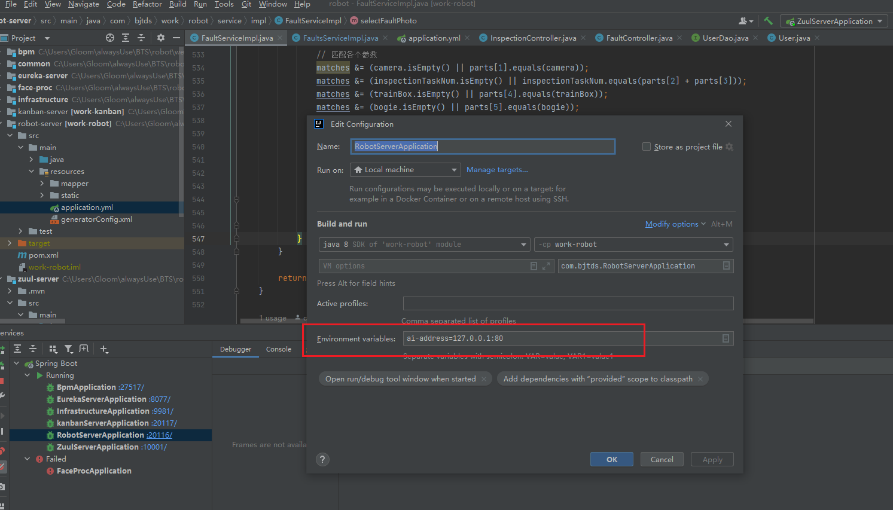

## 访问不了nginx代理的网页，进行排查

关于 Nginx 排查的总结笔记。

### 1. 命令详解

#### **命令一：查看进程**
```powershell
tasklist /fi "imagename eq nginx.exe"
```
*   **`tasklist`**: Windows 自带的工具，用于列出当前运行的所有进程（类似于 Linux 的 `ps`）。
*   **`/fi`**: 表示使用“过滤器” (Filter)。
*   **`"imagename eq nginx.exe"`**: 过滤条件。
    *   `imagename`: 进程的映像名称（即 .exe 文件名）。
    *   `eq`: 等于 (Equal)。
    *   `nginx.exe`: 我们要找的目标进程名。
*   **作用**：只显示名字叫 `nginx.exe` 的进程，如果没有任何输出或提示“没有运行的任务”，说明 Nginx 没启动。

#### **命令二：查看端口**
```powershell
netstat -an | findstr "10080"
```
*   **`netstat`**: 网络统计工具，显示网络连接、路由表等信息。
*   **`-a`**: 显示所有 (All) 连接和监听端口。
*   **`-n`**: 以数字 (Numerical) 形式显示地址和端口号（不尝试将 IP 解析为域名，速度更快）。
*   **`|`**: 管道符，将左边命令的输出结果“喂”给右边的命令处理。
*   **`findstr "10080"`**: 在输入的内容中查找包含 "10080" 字符串的行（类似于 Linux 的 `grep`）。
*   **作用**：检查是否有程序正在监听 `10080` 端口。如果 Nginx 配置正确并启动成功，这里应该能看到 `TCP 0.0.0.0:10080 ... LISTENING`。

---

### 📝 Nginx 启动排查总结笔记 (Windows)

#### **Step 1: 确认进程是否存活**
首先检查 Nginx 是否在后台运行。
```powershell
tasklist /fi "imagename eq nginx.exe"
```
*   ✅ **有结果**：进程已启动（可能是假死或配置未生效）。
*   ❌ **无结果**：进程未启动，尝试手动运行 `nginx.exe` 看是否有报错弹窗。

#### **Step 2: 确认端口是否监听**
检查你配置的端口（如 10080）是否处于 `LISTENING` 状态。
```powershell
netstat -an | findstr "10080"
```
*   ✅ **有 LISTENING**：服务正常，如果访问不了，检查防火墙。
*   ❌ **无结果**：Nginx 进程虽然在，但没加载该端口的配置，或者启动时遇到了错误（如端口被占用、配置语法错误）。

#### **Step 3: 必杀技 - 查阅日志**
如果进程在，但端口没开，**90% 的原因都在错误日志里**。
*   **位置**：Nginx 目录下的 `logs/error.log`。
*   **常见错误**：
    *   `bind() to 0.0.0.0:80 failed`: 端口被占用。
    *   `unknown directive`: 配置文件写错单词了。
    *   `unexpected "}"`: 配置文件花括号不匹配。

#### **Step 4: 常用维护命令**
在 Nginx 安装目录下执行：
*   **重载配置**（修改配置后必须执行）：
    ```powershell
    nginx -s reload
    ```
*   **彻底关闭**（如果重载无效，建议先杀再开）：
    ```powershell
    taskkill /F /IM nginx.exe
    ```
*   **测试配置**（检查 nginx.conf 是否有语法错误）：
    ```powershell
    nginx -t
    ```


## 启动 Nginx

对于 Nginx，在 Windows 上启动它和 MongoDB 稍微有点不同，最推荐的方式是使用 `start` 命令让它在后台运行，这样就不会占用您的命令行窗口了。

请在远程电脑上按以下步骤操作：

### 1. 启动 Nginx

**关键点：必须先进入 Nginx 的目录，不能跨目录直接运行。** Nginx 非常依赖相对路径来寻找配置文件。

假设您把 Nginx 解压到了 `D:\Services\nginx`（请根据实际路径修改）：

```cmd
d:
cd \Services\nginx
start nginx
```

*   **`start nginx`**：这个命令会让 Nginx 在后台启动。您会看到屏幕闪一下，然后马上回到命令行提示符，这是正常的。

### 2. 验证是否启动成功

因为 `start nginx` 没有任何输出，您需要确认它是否真的跑起来了：

**方法 A：查看进程列表**
```cmd
tasklist /fi "imagename eq nginx.exe"
```
*   **成功**：您应该能看到两个 `nginx.exe` 进程（一个是主进程，一个是工作进程）。
*   **失败**：如果提示“没有运行的任务...”，说明启动失败了。

**方法 B：浏览器访问**
打开浏览器访问 `http://localhost`，如果看到 "Welcome to nginx!" 页面，就是成功了。

### 3. 常用管理命令

既然是在后台运行，您不能通过关闭窗口来停止它，需要使用专门的命令（必须在 nginx 目录下执行）：

*   **停止 Nginx**（快速停止）：
    ```cmd
    nginx -s stop
    ```
*   **退出 Nginx**（处理完当前请求后停止，更优雅）：
    ```cmd
    nginx -s quit
    ```
*   **重新加载配置**（修改 `nginx.conf` 后不需要重启，运行这个即可）：
    ```cmd
    nginx -s reload
    ```

---

### ⚠️ 常见启动失败原因（如果进程列表中没有 nginx）

如果运行了命令但 `tasklist` 里找不到 nginx，通常是因为 **端口 80 被占用了**。

1.  **去哪里看报错？**
    进入 Nginx 目录下的 `logs` 文件夹，打开 `error.log` 文件。
2.  **如果是端口占用**：
    日志里会有 `bind() to 0.0.0.0:80 failed`。
    Windows 上最容易占用 80 端口的是 **IIS 服务 (World Wide Web Publishing Service)**。
3.  **解决方法**：
    *   要么在 `conf/nginx.conf` 里把端口改成 8080 或其他。
    *   要么停止 IIS 服务：`net stop W3SVC`。

###  bind() to 0.0.0.0:80 failed

~~~
nginx日志中的日志为：“2025/12/10 14:57:47 [emerg] 11944#8588: bind() to 0.0.0.0:80 failed (10013: An attempt was made to access a socket in a way forbidden by its access permissions)”，这是什么原因，IIS 服务是干什么的，停止的话有影响吗
~~~


这个错误代码 `10013` 明确指出了原因：**端口 80 已经被其他程序占用了**，且权限被拒绝。Nginx 想要使用 80 端口，但发现有人捷足先登了。

### 1. 为什么是 IIS 服务？
IIS (Internet Information Services) 是 Windows 自带的 Web 服务器软件。就像 Nginx 也是 Web 服务器一样，它们默认都想霸占最标准的 HTTP 端口——**80**。
*   **IIS 是干什么的？** 它是微软提供的用来托管网站、FTP 站点等的服务。很多企业级 Windows 应用或开发环境会自动安装并启动它。

### 2. 停止 IIS 有影响吗？
**通常情况下，对于开发或非 IIS 专用服务器，停止它是安全的。**

*   **没有影响的情况**：如果你这台电脑不是专门用来跑 ASP.NET 网站，或者没有正在运行的公司内部 IIS 站点，停止它完全没问题。绝大多数开发人员的电脑上 IIS 都是闲置资源。
*   **可能有影响的情况**：如果你这台电脑上通过 IIS 部署了什么旧的考勤系统、内网门户，或者安装了 SQL Server Reporting Services（它有时依赖 HTTP 服务），关掉它会导致那些网页打不开。

### 3. 如何解决？

您可以选择 **停止 IIS**（把路让给 Nginx）或者 **修改 Nginx 端口**（Nginx 绕道走）。

#### 方案 A：停止 IIS 服务（推荐，最直接）
让 Nginx 使用标准的 80 端口，方便以后访问（不用输冒号和端口号）。

在管理员权限的命令行中运行：
```cmd
net stop W3SVC
```
*(W3SVC 就是 "World Wide Web Publishing Service" 的缩写)*

如果以后不想让它开机自启抢端口，可以禁用它：
```cmd
sc config W3SVC start= disabled
```

**停止后，请重新尝试启动 Nginx：**
```cmd
cd \Services\nginx
start nginx
```

#### 方案 B：修改 Nginx 端口（稳妥，不影响现有服务）
如果您不敢关 IIS，可以让 Nginx 改用其他端口（比如 8080）。

1.  打开 Nginx 目录下的 `conf/nginx.conf` 文件。
2.  找到类似下面的一段：
    ```nginx
    server {
        listen       80;
        server_name  localhost;
        ...
    ```
3.  把 `listen 80;` 改成 `listen 8080;`（或其他空闲端口）。
4.  保存文件。
5.  重新启动 Nginx。
6.  以后访问时需要加端口：`http://localhost:8080`。

### 还有谁可能占用 80 端口？
除了 IIS，还有一个常见的“钉子户”是 **SQL Server Reporting Services**。如果刚才关了 IIS (`net stop W3SVC`) 还是报错 10013，可以试着检查一下是否装了 SQL Server。
*   查看谁占用了 80：`netstat -ano | findstr :80`，最后一列是 PID，去任务管理器查 PID 对应的进程名即可。


## 0、win10使用Nginx代理前端dist文件夹

~~~
我现在在win10中已经打包好dist文件夹了，如何配置nginx让他代理我的dist文件夹
~~~

好的，根据你提供的 `nginx.conf` 配置，我来指导你如何配置 Nginx 来代理你的 `dist` 文件夹，并确保Qt应用可以通过 `http://localhost:80/index.html` 访问到。

你的目标是将 `dist` 文件夹的内容通过 Nginx 发布，让 Qt 应用可以访问。最直接和常用的方法是使用 `root` 指令来指定静态文件的根目录，并确保 `index.html` 能够被正确加载。

假设你的 `dist` 文件夹位于 `D:/your-project/dist`。

**你需要对 `nginx.conf` 进行如下修改：**

我们将添加一个新的 `location /` 块，让 Nginx 知道去哪里查找 `index.html` 和其他前端资源。

```nginx
#user  nobody;
worker_processes  1;

#error_log  logs/error.log;
#error_log  logs/error.log  notice;
#error_log  logs/error.log  info;

#pid        logs/nginx.pid;


events {
    worker_connections  1024;
}


http {
    include       mime.types;
    default_type  application/octet-stream;

    client_max_body_size 20m;

    #log_format  main  '$remote_addr - $remote_user [$time_local] "$request" '
    #                  '$status $body_bytes_sent "$http_referer" '
    #                  '"$http_user_agent" "$http_x_forwarded_for"';

    #access_log  logs/access.log  main;

    sendfile        on;
    #tcp_nopush     on;

    #keepalive_timeout  0;
    keepalive_timeout  65;

    #gzip  on;
    
    upstream prodmge-back {
        server localhost:10001 weight=1;
    }

    server {
        listen       80;
        server_name  _;

        #charset koi8-r;
        #access_log  logs/host.access.log  main;
        
        location /prodmge/ {
                        proxy_pass http://prodmge-back/; 
                }
        
        # location /static-resources {
        #   alias D:/guangtie/sr-root/static-resources/;
        #           autoindex on;  # 关键，允许列目录
        #           autoindex_exact_size off;  # 文件大小友好显示
        #           autoindex_localtime on;  # 显示本地时间
        #   add_header 'Access-Control-Allow-Origin' '*';
        #           add_header 'Access-Control-Allow-Methods' 'GET, OPTIONS';
        #           add_header 'Access-Control-Allow-Headers' '*';
        #  }
        # 故障详情使用
        location /static-resources/robot/images/robot-origin/RawImageDisk/ {
                    alias D:/RawImageDisk/;
                    autoindex on;  # 关键，允许列目录
                    autoindex_exact_size off;  # 文件大小友好显示
                    autoindex_localtime on;  # 显示本地时间
                    add_header 'Access-Control-Allow-Origin' '*';
                    add_header 'Access-Control-Allow-Methods' 'GET, OPTIONS';
                    add_header 'Access-Control-Allow-Headers' '*';
         }

        # 新增的配置，用于代理dist文件夹
        location / {
            root   D:/your-project/dist; # 将此路径替换为你的实际dist文件夹路径
            index  index.html index.htm; # Nginx会尝试按顺序查找这些文件作为默认页面
            try_files $uri $uri/ /index.html; # 这对于单页应用（SPA）非常重要，确保路由刷新时也能正确加载index.html
        }


        #error_page  404              /404.html;

        # redirect server error pages to the static page /50x.html
        error_page   500 502 503 504  /50x.html;
        location = /50x.html {
            root   html;
        }
    }
}
```

### 关键修改解释：

1.  **`location / { ... }`**:
    *   这是一个通用的 `location` 块，它会匹配所有没有被其他更具体 `location` 块（例如 `/prodmge/` 或 `/static-resources/.../`）匹配到的请求。
    *   这意味着当你的 Qt 应用请求 `http://localhost:80/` 或 `http://localhost:80/index.html` 时，会由这个 `location` 块来处理。

2.  **`root D:/your-project/dist;`**:
    *   这是最重要的配置。它告诉 Nginx，当请求匹配到这个 `location` 块时，去 `D:/your-project/dist` 这个目录下面查找对应的文件。
    *   **请务必将 `D:/your-project/dist` 替换为你的实际 `dist` 文件夹的绝对路径。**

3.  **`index index.html index.htm;`**:
    *   这个指令告诉 Nginx，如果一个请求指向一个目录（例如 `http://localhost:80/`），那么 Nginx 会按顺序尝试查找 `index.html` 或 `index.htm` 作为该目录的默认文件。
    *   这确保了当你只访问 `http://localhost:80/` 时，Nginx 会自动返回 `D:/your-project/dist/index.html`。

4.  **`try_files $uri $uri/ /index.html;`**:
    *   这对于单页应用（SPA，如 Vue, React, Angular 项目）非常关键。
    *   它的作用是：
        *   首先，Nginx 会尝试查找与 `$uri` 匹配的文件（例如，如果请求是 `/css/app.css`，它会查找 `D:/your-project/dist/css/app.css`）。
        *   如果找不到文件，它会尝试查找与 `$uri/` 匹配的目录（例如，如果请求是 `/assets`，它会查找 `D:/your-project/dist/assets/index.html` 或 `D:/your-project/dist/assets/` 目录本身）。
        *   如果以上都找不到，它会将请求内部重定向到 `/index.html`。这意味着，即使你刷新了 `http://localhost:80/some/route` 这样的深层路由，Nginx 也会返回 `index.html`，然后由前端路由来处理实际的页面显示，避免出现404错误。

### 配置步骤总结：

1.  **确定 `dist` 文件夹的绝对路径。** 例如：`D:/MyFrontendProject/dist`。
2.  **编辑 `nginx.conf` 文件。**
3.  **在 `server` 块中添加或修改 `location /` 块，如下所示：**

    ```nginx
    server {
        listen       80;
        server_name  _;
    
        # ... 其他现有的location块 ...
    
        # 新增的配置，用于代理dist文件夹
        location / {
            root   D:/MyFrontendProject/dist; # 替换为你的实际dist文件夹路径
            index  index.html index.htm;
            try_files $uri $uri/ /index.html;
        }
    
        # ... 其他现有的配置 ...
    }
    ```
4.  **保存 `nginx.conf` 文件。**
5.  **重启 Nginx 服务**，以使配置生效。
    
    *   在 Windows 上，你可以打开任务管理器，找到 Nginx 进程并结束它，然后重新运行 Nginx 可执行文件。
    *   或者，如果你有 Nginx 的命令行工具，可以使用 `nginx -s reload` 命令来平滑重启。

完成这些步骤后，你的 Qt 应用就可以通过 `http://localhost:80/index.html` (或仅仅 `http://localhost:80/`) 访问到你 `dist` 文件夹中的前端应用了。


## 一、Nginx的Linux代理转windows

~~~
	接口请求地址为：“http://localhost:10001/robot-service/fault/selectFaultPhotos?folderPath=http://127.0.0.1:80/home/bjtds/RawImageDisk/HuaWei_Result/Pre_result/202502062012CR400AF2151&inspectionTaskNum=20250206CR400AF2151&camera=&trainBox=&bogie=&axle=&wheel=&primaryComponent=&secondaryComponent=&artifactNum=”，
	代码实现为：“public List<String> selectFaultPhoto(String folderPath, String camera, String inspectionTaskNum, String trainBox, String bogie, String axle, String wheel, String primaryComponent, String secondaryComponent, String artifactNum) throws Exception {
        if (Objects.equals(folderPath, "")) return null;
        List<String> imageFileNames = new ArrayList<>();

        // 创建URL对象
        URL url = new URL(folderPath);
        HttpURLConnection connection = (HttpURLConnection) url.openConnection();
        connection.setRequestMethod("GET");

        // 读取响应
        BufferedReader in = new BufferedReader(new InputStreamReader(connection.getInputStream()));
        StringBuilder content = new StringBuilder();
        String inputLine;
        while ((inputLine = in.readLine()) != null) {
            content.append(inputLine);
        }
        in.close();

        // 使用Jsoup解析HTML内容
        Document doc = Jsoup.parse(content.toString());
        Elements links = doc.select("a[href]");

        // 使用正则表达式过滤出图片文件名
        Pattern pattern = Pattern.compile("([^\\s]+(\\.(?i)(jpg))$)");
        for (Element link : links) {
            String href = link.attr("href");
            Matcher matcher = pattern.matcher(href);
            if (matcher.matches()) {
                String[] parts = (href.split("\\.")[0]).split("-");

                boolean matches = true;
                // 匹配各个参数
                matches &= (camera.isEmpty() || parts[1].equals(camera));
                matches &= (inspectionTaskNum.isEmpty() || inspectionTaskNum.equals(parts[2] + parts[3]));
                matches &= (trainBox.isEmpty() || parts[4].equals(trainBox));
                matches &= (bogie.isEmpty() || parts[5].equals(bogie));
                matches &= (axle.isEmpty() || parts[6].equals(axle));
                matches &= (wheel.isEmpty() || parts[7].equals(wheel));
                matches &= (primaryComponent.isEmpty() || parts[8].equals(primaryComponent));
                matches &= (secondaryComponent.isEmpty() || parts[9].equals(secondaryComponent));
                matches &= (artifactNum.isEmpty() || parts[10].equals(artifactNum));

                if (matches) {
                    imageFileNames.add(folderPath + "/" + href);
                }
            }
        }

        return imageFileNames;
    }
”，如何在windows中配置nginx以实现代码中的功能
~~~


你这个接口逻辑里，`folderPath`参数其实是一个**HTTP目录访问地址**，对应的是服务器上实际存放图片的文件夹，这个文件夹需要通过Nginx对外暴露出来，Nginx负责把该目录以HTTP方式提供出来，供代码里的Jsoup去解析这个目录下的图片列表。

**目标需求总结：**

> Nginx需要把Windows上的一个文件夹，例如： `D:\RawImageDisk\HuaWei_Result\Pre_result\202502062012CR400AF2151` 映射成HTTP地址： `http://127.0.0.1:80/home/bjtds/RawImageDisk/HuaWei_Result/Pre_result/202502062012CR400AF2151`

------

## **Step1：安装Nginx（Windows版）**

- 下载地址：[Nginx官网](https://nginx.org/en/download.html)
- 解压后就是Nginx目录，比如：`C:\nginx`
- 进入`C:\nginx\conf\nginx.conf`，进行配置

------

## **Step2：配置Nginx映射目录**

编辑`nginx.conf`，增加一个`location`规则：

```nginx
server {
    listen 80;

    location /home/bjtds/RawImageDisk/ {
        alias D:/RawImageDisk/;
        autoindex on;  # 关键，允许列目录
        autoindex_exact_size off;  # 文件大小友好显示
        autoindex_localtime on;  # 显示本地时间
    }
}
```

### 解释：

- `location /home/bjtds/RawImageDisk/` 说明这个路径下的请求都交给Nginx来处理。
- `alias D:/RawImageDisk/` 把这个请求路径映射到Windows的实际路径。
- `autoindex on` 让Nginx列出文件和子目录（类似Apache的目录浏览功能），这样Jsoup才能读取图片列表。
- `autoindex_exact_size` & `autoindex_localtime`：调整文件显示格式。

------

## **Step3：启动Nginx**

```bash
cd C:\nginx
start nginx
```

------

## **Step4：访问测试**

打开浏览器访问：

```
http://127.0.0.1/home/bjtds/RawImageDisk/HuaWei_Result/Pre_result/202502062012CR400AF2151/
```

✅ 看到目录下的图片列表，说明配置成功。

------

## **Step5：接口代码对接**

你的代码请求参数：

```text
folderPath=http://127.0.0.1:80/home/bjtds/RawImageDisk/HuaWei_Result/Pre_result/202502062012CR400AF2151
```

这个路径就能直接对应Nginx暴露的文件夹，代码能顺利拿到HTML目录列表，Jsoup就能解析里面的`jpg`文件了。

------

## **总结**

| 角色          | 路径                                                         |
| ------------- | ------------------------------------------------------------ |
| 本地文件夹    | D:\RawImageDisk\HuaWei_Result\Pre_result\202502062012CR400AF2151 |
| Nginx映射地址 | http://127.0.0.1/home/bjtds/RawImageDisk/HuaWei_Result/Pre_result/202502062012CR400AF2151 |
| 代码请求路径  | folderPath=http://127.0.0.1/home/bjtds/RawImageDisk/HuaWei_Result/Pre_result/202502062012CR400AF2151 |

------

### ⚠️ 注意

- Windows路径`D:\`要用`/`写，变成`D:/`。
- 这个目录映射的Nginx配置需要**重启Nginx**才能生效。


### 例子：windows本地设置图片的显示


1）修改环境变量为nginx的地址

2) 创建文件夹用于与http请求进行映射

| 角色          | 路径                                                         |
| ------------- | ------------------------------------------------------------ |
| 本地文件夹    | D:\RawImageDisk\HuaWei_Result\Pre_result\202502062012CR400AF2151 |
| Nginx映射地址 | http://127.0.0.1/home/bjtds/RawImageDisk/HuaWei_Result/Pre_result/202502062012CR400AF2151 |
| 代码请求路径  | folderPath=http://127.0.0.1/home/bjtds/RawImageDisk/HuaWei_Result/Pre_result/202502062012CR400AF2151 |

3）配置nginx，建立映射关系

~~~
server {
    listen 80;

    location /home/bjtds/RawImageDisk/ {
        alias D:/RawImageDisk/;
        autoindex on;  # 关键，允许列目录
        autoindex_exact_size off;  # 文件大小友好显示
        autoindex_localtime on;  # 显示本地时间
    }
}

~~~

Windows路径`D:\`要用`/`写，变成`D:/`。

这个目录映射的Nginx配置需要**重启Nginx**才能生效。


## 二、处理跨越问题


非常好！既然你已经用Nginx来作为图片服务器，那处理CORS就非常简单了，**只需要在Nginx配置里面加上CORS相关的响应头**就行。

### 示例配置

假设你当前Nginx配置大致如下：

```nginx
server {
    listen 80;
    server_name 127.0.0.1;

    location /home/bjtds/RawImageDisk/ {
        root /;
        autoindex on;
    }
}
```

你只需要在对应的`location`里面，加上如下CORS头：

```nginx
add_header 'Access-Control-Allow-Origin' '*';
add_header 'Access-Control-Allow-Methods' 'GET, OPTIONS';
add_header 'Access-Control-Allow-Headers' '*';
```

完整示例：

```nginx
server {
    listen 80;
    server_name 127.0.0.1;

    location /home/bjtds/RawImageDisk/ {
        root /;
        autoindex on;

        add_header 'Access-Control-Allow-Origin' '*';
        add_header 'Access-Control-Allow-Methods' 'GET, OPTIONS';
        add_header 'Access-Control-Allow-Headers' '*';
    }
}
```

------

### 说明

- ```
  Access-Control-Allow-Origin
  ```

   允许所有来源（

  ```
  *
  ```

  ），如果你只想允许

  ```
  localhost:8104
  ```

  访问，可以改为：

  ```nginx
  add_header 'Access-Control-Allow-Origin' 'http://localhost:8104';
  ```

- `Access-Control-Allow-Methods` 允许的HTTP方法，这里一般只需要GET和OPTIONS。

- `Access-Control-Allow-Headers` 允许的请求头，具体看你的实际情况，如果没特殊需求，`*`最方便。

------

### 配置好后记得重启Nginx

```bash
nginx -s reload
```

------

### 验证

配置完后，你再打开浏览器访问你的图片接口，看看浏览器的开发者工具（F12），网络请求里，**响应头里应该能看到`Access-Control-Allow-Origin`**，这样前端的跨域问题就解决了。

### 浏览器缓存坑

浏览器有时候会对图片请求做**强缓存**，即使Nginx返回头已经正确了，**但浏览器直接用缓存的图片，不再重新发请求**。可以试试：

- **清缓存**或用**无痕模式**测试。
- F12 → 网络 → 关闭"缓存"选项，再刷新页面。


## 三、nginx反向代理例子

发现6000端口是chorme浏览器的默认非安全端口，配置nginx转发6000端口后成功解决，修改代码与nginx配置，生产环境使用nginx转发请求后进行测试

---

### Nginx 配置优化及代理转发概念解析

**笔记主题：** Nginx 反向代理配置与概念澄清

**日期：** 2025年9月12日

---

#### 1. Nginx 添加 POST 请求代理转发

**问题描述：**
用户希望在Nginx配置文件中添加两个 `location` 块，用于代理转发特定的 POST 请求。具体需求是将访问 `/face/face_register_image_query` 和 `/face/face_identify` 的请求代理到 `http://192.168.100.210:6000` 对应的路径。

**解决方案：**
在 `server` 块中添加如下 `location` 配置。Nginx 的 `proxy_pass` 指令默认支持所有 HTTP 方法，无需单独指定 POST。

```nginx
# ... existing code ...

        location /face/face_register_image_query {
            proxy_pass http://192.168.100.210:6000/face/face_register_image_query;
        }

        location /face/face_identify {
            proxy_pass http://192.168.100.210:6000/face/face_identify;
        }

# ... existing code ...
```

---

#### 2. 代理（Proxy）与转发（Forward）的区别

**问题描述：**
用户询问 Nginx 配置中的“代理”和“转发”有何区别。

**解答：**

1.  **代理（反向代理）：**
    *   在Nginx中，通常指**反向代理**。Nginx作为客户端与后端服务器之间的中间层。
    *   客户端向Nginx发起请求，Nginx接收请求后，将其发送给配置的后端服务器。后端服务器处理响应后，通过Nginx返回给客户端。
    *   客户端感知到的交互对象始终是Nginx，不知道具体的后端服务器地址。
    *   **优点：** 负载均衡、缓存、安全防护、SSL卸载等。
    *   **示例：** Nginx的 `proxy_pass` 指令就是典型的反向代理实现。

2.  **转发：**
    *   这是一个更广泛的概念，根据上下文有不同含义：
        *   **HTTP重定向（Redirect）：** 客户端收到HTTP状态码（如301、302），被告知去访问另一个URL。这是**客户端行为的转发**。
        *   **服务器内部转发：** 在应用服务器内部，请求被转发到另一个资源，客户端无感知。
        *   **网络层面转发：** 路由器或交换机根据网络地址转发数据包。
    *   **在Nginx `proxy_pass` 语境下：** 当我们说Nginx将请求“转发”给后端服务器时，实际上是在描述反向代理的工作机制。`proxy_pass` 建立了**代理**关系，其内部包含了请求的**转发**动作。

**总结：** 在Nginx `proxy_pass` 的语境中，“代理”和“转发”常常被混用或指代同一行为：Nginx作为中间人将请求送达后端服务器。但从技术概念上，`proxy_pass` 实现的是反向代理，其中包含了请求的服务器端转发过程。

---

#### 3. 提取重复的后端服务器地址

**问题描述：**
用户提出 `http://192.168.100.210:6000` 字符串在配置中重复出现，希望将其提取出来，以便后续统一修改。

**解决方案：**
使用 Nginx 的 `upstream` 块来定义后端服务器组，将重复的地址提取到 `upstream` 中，然后在 `location` 块中引用该 `upstream` 名称。

**修改示例：**

```nginx
# ... existing code ...

    upstream prodmge-back {
		server localhost:10001 weight=1;
	}

    # 新增的upstream块，用于提取重复的后端服务器地址
    upstream face_backend {
        server 192.168.100.210:6000;
    }

    server {
        listen       80;
        server_name  _;

# ... existing code ...

		location  /Health {
            # 使用upstream名称
            proxy_pass http://face_backend/Health;
        }
		
        location /face/face_register_image_query {
            # 使用upstream名称
            proxy_pass http://face_backend/face/face_register_image_query;
        }

        location /face/face_identify {
            # 使用upstream名称
            proxy_pass http://face_backend/face/face_identify;
        }

# ... existing code ...
```

通过此修改，如果 `192.168.100.210:6000` 地址发生变化，只需修改 `upstream face_backend` 块中的 `server` 行即可，大大提高了配置的可维护性。

---


~~~
“ upstream doorsys{
    server 192.168.100.11:10001;
}   server {
        listen       10081;
        server_name  table_item;

        #charset koi8-r;
        #access_log  logs/host.access.log  main;

		location  /Health {
            proxy_pass http://face_backend/Health;
        }
		
        location /face/face_register_image_query {
            proxy_pass http://face_backend/face/face_register_image_query;
        }

        location /face/face_identify {
            proxy_pass http://face_backend/face/face_identify;
        }
		
		location /prodmge/ {
            proxy_pass http://prodmge-back/; 
        }

        location /doorsys/ {
            proxy_pass http://doorsys/;
        }

        location / {
                root   D:/Client/webClient/table_item/dist; 
                index  index.html index.htm; 
                try_files $uri $uri/ /index.html; 
        }

        #error_page  404              /404.html;

        # redirect server error pages to the static page /50x.html
        error_page   500 502 503 504  /50x.html;
        location = /50x.html {
            root   html;
        }
    }”这样子配置可以吗，这样子配置的话可以实现访问/doorsys路径的都转发到后端了吧
~~~

是的，这样配置是**可以**的，逻辑上已经实现了将 `/doorsys/` 开头的请求转发到后端 `192.168.100.11:10001`。

但有一个非常重要的细节需要确认，这决定了您的请求是否能正确到达后端接口：**后端接口的实际路径是什么？**

### 需要注意的 `proxy_pass` 尾部斜杠问题

请仔细看下面两种写法的区别：

#### 写法 1（您当前的写法）：
```nginx
location /doorsys/ {
    proxy_pass http://doorsys/;  # 注意结尾有斜杠
}
```
*   **行为**：Nginx 会**截断**匹配到的 `/doorsys/` 部分。
*   **示例**：
    *   前端请求：`http://localhost:10081/doorsys/user/login`
    *   Nginx 转发：`http://192.168.100.11:10001/user/login` (**去掉**了 `/doorsys`)

#### 写法 2（无尾部斜杠）：
```nginx
location /doorsys/ {
    proxy_pass http://doorsys;   # 注意结尾没有斜杠
}
```
*   **行为**：Nginx 会**保留**完整的路径。
*   **示例**：
    *   前端请求：`http://localhost:10081/doorsys/user/login`
    *   Nginx 转发：`http://192.168.100.11:10001/doorsys/user/login` (**保留**了 `/doorsys`)

### 这里的关键判断：
您需要确认您的 Java 后端接口定义（Controller）里，是否包含 `/doorsys` 这个前缀？

*   **情况 A**：如果后端 Controller 写的是 `@RequestMapping("/user")`
    *   那么您**当前**的配置（写法 1，带斜杠）是**正确**的。前端发 `/doorsys/user`，后端收 `/user`。

*   **情况 B**：如果后端 Controller 写的是 `@RequestMapping("/doorsys/user")`（也就是后端项目本身就有一个 context-path 叫 doorsys）
    *   那么您当前的配置会导致后端收到 `/user`，从而报 404。
    *   如果是这种情况，您应该去掉 `proxy_pass` 末尾的斜杠，或者手动补上：`proxy_pass http://doorsys/doorsys/;`

**通常情况下，为了配合前端 `Params.appname` 的逻辑，您的写法 1（带斜杠，去前缀）是比较符合常规“反向代理网关”的做法的。** 只要确保后端接口不需要那个 `/doorsys` 前缀即可。


~~~
实际上这个 http://192.168.100.11:10001地址是网关，还要带上/doorsysplatform-service的服务前缀，后面才是请求的路径，所以应该怎么写呢
~~~

明白，这是一个非常经典的微服务网关转发场景。

**需求梳理：**
1.  **前端请求**：`http://localhost:10081/doorsys/user/login`
2.  **期望转发**：`http://192.168.100.11:10001/doorsysplatform-service/user/login`

这里不仅要去掉前端的 `/doorsys` 前缀，还要加上后端的 `/doorsysplatform-service` 前缀。

### 推荐配置

请将您的 `location /doorsys/` 配置修改为：

```nginx
location /doorsys/ {
    # 把前端的 /doorsys/ 替换为后端的 /doorsysplatform-service/
    proxy_pass http://doorsys/doorsysplatform-service/; 
}
```
*(注意：`upstream doorsys` 依然定义为 `192.168.100.11:10001`)*

### 转发逻辑详解

当请求 `http://localhost:10081/doorsys/user/login` 到达时：

1.  Nginx 匹配到 `location /doorsys/`。
2.  Nginx 看到 `proxy_pass` 后面**带有路径**（`/doorsysplatform-service/`）。
3.  Nginx 会执行**路径替换**：
    *   去掉请求 URL 中与 location 匹配的部分：`/doorsys/`。
    *   剩下的部分是：`user/login`。
    *   把它拼接到 proxy_pass 指定的路径后面。
4.  **最终生成的后端请求**：
    `http://192.168.100.11:10001` + `/doorsysplatform-service/` + `user/login`
    = `http://192.168.100.11:10001/doorsysplatform-service/user/login`

这就是您想要的效果。


~~~
这样子写就可以反向代理全部发向后端的请求了吧，不需要对每一个不同后端路径的接口一个个写吧，像这一个写法其实可以优化成一次搞定的形式对吧：“        location /face/face_register_image_query {
            proxy_pass http://face_backend/face/face_register_image_query;
        }

        location /face/face_identify {
            proxy_pass http://face_backend/face/face_identify;
        }”
~~~

是的，完全可以优化！您现有的那种“一个接口写一个 location”的写法非常累赘，维护起来也很痛苦。Nginx 的强大之处就在于**按路径前缀进行模糊匹配**。

### 优化方案

只要这几个接口的前缀都是 `/face/`，并且都转发给同一个后端服务 `face_backend`，您只需要写**一个**通用的规则即可覆盖所有情况。

**将原来的这两个（甚至更多类似的）：**
```nginx
location /face/face_register_image_query {
    proxy_pass http://face_backend/face/face_register_image_query;
}

location /face/face_identify {
    proxy_pass http://face_backend/face/face_identify;
}
```

**合并优化为：**
```nginx
location /face/ {
    # 只要是以 /face/ 开头的请求，都丢给 face_backend 对应的 /face/ 路径下
    proxy_pass http://face_backend/face/;
}
```

### 转发效果验证

1.  **请求 1**：`/face/face_register_image_query`
    *   匹配到 `/face/`。
    *   Nginx 替换路径：去掉 `/face/`，剩下 `face_register_image_query`。
    *   拼接到后端：`http://face_backend` + `/face/` + `face_register_image_query`。
    *   **结果**：正确。

2.  **请求 2**：`/face/face_identify`
    *   匹配到 `/face/`。
    *   同理拼接。
    *   **结果**：`http://face_backend/face/face_identify`，正确。

3.  **未来新增请求 3**：`/face/user/delete`
    *   **结果**：`http://face_backend/face/user/delete`，自动支持，无需改配置。

### 总结
这就是 Nginx 的标准用法。只要**前端请求的前缀**和**后端接收的前缀**有一定的映射规律（通常是一样的，或者是替换关系），都可以用这种“目录级”的反向代理一次搞定。


## 四、一个nginx同时部署多个前端dist包

nginx中可以实现同时部署多个前端dist包吗，比如我有两个前端项目，用同一个nginx程序可以进行部署和访问吗

**可以，这非常常见。** Nginx 天生就是为了处理多站点、多项目而设计的。

您可以通过两种主要方式在同一个 Nginx 上部署多个前端项目：

### 方式 1：基于端口区分（Port-based）
**适用场景**：内部系统，不在意端口号，或者每个项目都是独立完整的应用。

*   **项目 A** 访问地址：`http://your-ip:8080`
*   **项目 B** 访问地址：`http://your-ip:8081`

**配置示例**：
```nginx
# nginx.conf

# 项目 A 的配置
server {
    listen       8080;
    server_name  localhost;

    location / {
        root   html/project-a; # 项目 A 的 dist 目录
        index  index.html;
    }
}

# 项目 B 的配置
server {
    listen       8081;
    server_name  localhost;

    location / {
        root   html/project-b; # 项目 B 的 dist 目录
        index  index.html;
    }
}
```

---

### 方式 2：基于路径区分（Location-based）- **更常用**
**适用场景**：希望通过同一个域名/IP 访问，只是后面跟不同的子路径。

*   **主项目/门户**：`http://your-ip/`
*   **管理后台**：`http://your-ip/admin`

**配置示例**：
```nginx
# nginx.conf
server {
    listen       80;
    server_name  localhost;

    # 项目 A (主应用)
    location / {
        root   html/dist-a;
        index  index.html;
        try_files $uri $uri/ /index.html; # Vue/React 路由模式必备
    }

    # 项目 B (子应用)
    location /admin {
        # 注意：使用 alias 而不是 root
        alias  html/dist-b;
        index  index.html;
        try_files $uri $uri/ /admin/index.html; # 这里的路径要对应上
    }
}
```

**⚠️ 关键注意点 (针对方式 2)**：
如果是 Vue/React 项目部署在子路径（如 `/admin`）下，**必须**修改前端项目的打包配置 `publicPath` (或 `base`)，将其设置为 `/admin/`，否则打包出来的资源路径会错（比如找不到 CSS/JS）。

### 方式 3：基于域名区分（Host-based）
**适用场景**：如果您有域名解析权限，或者在本地修改了 `hosts` 文件。

*   `http://www.site-a.com` -> 项目 A
*   `http://admin.site-b.com` -> 项目 B

**配置示例**：
```nginx
server {
    listen 80;
    server_name www.site-a.com;
    location / { root html/dist-a; }
}

server {
    listen 80;
    server_name admin.site-b.com;
    location / { root html/dist-b; }
}
```

### 总结
*   简单测试用 **方式 1（多端口）** 最快，互不干扰。
*   正式环境为了美观和统一入口，常用 **方式 2（多路径）**，但记得改前端 `publicPath`。


~~~
如果使用“方式 1：基于端口区分”，那么根据你提供的配置文件，意味着nginx同时监听8080和8081端口，用户访问的话就会返回数据吗，“server {
    listen 8080;”的意思应该不是配置nginx运行在哪一个端口上面吧，nginx监听8080和8081端口后，这两个端口上面还可以部署程序吗
~~~

您问到了非常关键的点，我为您详细解释一下：

### 1. Nginx “监听”到底意味着什么？
`listen 8080;` **就是配置 Nginx 自己运行在 8080 端口上**。

*   当 Nginx 启动并读取到这个配置时，它会告诉操作系统：“**把所有发送到本机 8080 端口的数据包都交给我处理。**”
*   这就像 Nginx 在 8080 号柜台坐下来开始营业了。

### 2. 这两个端口上还可以部署其他程序吗？
**不可以。**

**端口是独占资源**。
*   如果 Nginx 已经占用了 8080 端口（正在监听），那么任何其他程序（比如 Tomcat、Java jar包、Node.js 服务）如果也想绑定 8080 端口，启动时就会直接报错“端口已被占用 (Address already in use)”。
*   同理，如果 8081 端口上已经跑着一个 Tomcat，那么 Nginx 的 `listen 8081;` 就会导致 Nginx 启动失败。

### 3. 既然端口被 Nginx 占了，那数据是怎么返回的？
这就是 Nginx 作为 **Web 服务器**（对于静态文件）或 **反向代理** 的核心作用。

#### 情况 A：部署前端静态包（您的场景）
您把两个前端 dist 包分别放在 `html/project-a` 和 `html/project-b` 文件夹里。
1.  **用户** 访问 `http://localhost:8080`。
2.  **Nginx**（正坐在 8080 号柜台）收到请求。
3.  **Nginx** 根据配置 `root html/project-a`，转身去硬盘里读取 `index.html` 文件。
4.  **Nginx** 把文件内容返回给用户浏览器。

**在这个过程中，8080 端口上不需要跑任何 Java 或 Node.js 程序，只要有 Nginx 就够了。** Nginx 自己就是那个提供服务的程序。

#### 情况 B：后端接口转发（反向代理）
假如您有一个 Java 后端程序跑在 **9090** 端口。
您可以在 Nginx (8080) 里配置：
```nginx
location /api/ {
    proxy_pass http://localhost:9090;
}
```
1.  **用户** 访问 `http://localhost:8080/api/user`。
2.  **Nginx** (8080) 收到请求，发现是 `/api/` 开头。
3.  **Nginx** 悄悄把请求转发给 **9090** 端口的 Java 程序。
4.  **Java 程序** (9090) 处理完返回给 Nginx。
5.  **Nginx** 再返回给用户。

**总结**：
*   **listen 8080** = Nginx 占用 8080 端口。
*   **8080 端口不能再给别的程序用了**。
*   用户访问 8080，实际上就是直接在和 Nginx 对话。


~~~
那你这个“方式 1：基于端口区分（Port-based）”是让nginx同时占用两个端口是吧，因为是nginx同时监听8080和8081端口
~~~

是的，完全正确。

**“方式 1：基于端口区分”的核心就是：**
**同一个 Nginx 程序（也就是这一个 `nginx.exe` 进程）同时占用并监听了两个端口（8080 和 8081）。**

它就像一个既负责“前门（8080）”接待，又负责“后门（8081）”接待的保安。
*   客人敲前门，它就拿出项目 A 的网页给客人。
*   客人敲后门，它就拿出项目 B 的网页给客人。

**这样做的好处**是您只需要维护**一份** Nginx 配置文件和**一个** Nginx 服务进程，就可以管理多套完全独立的网站。


## 反斜杠 `\` 被 Nginx 误读成了转义字符

这个错误是因为您配置文件中的路径字符串里的反斜杠 `\` 被 Nginx 误读成了转义字符，导致路径乱码了。

具体看这句日志：
`GetFileAttributesEx() "D:\Client\webClient able_item\dist/index.html" failed`

请注意路径中间的 `webClient` 和 `able_item` 之间变成了一个奇怪的制表符（tab）空格，原来的 `\t` 消失了。

### 错误原因
在您的配置文件中：
```nginx
root   D:\Client\webClient\table_item\dist;
```
字符串里的 `\t` 被 Nginx 解析成了 **制表符 (Tab)**，而不是字面意义上的反斜杠加 t。
*   `\t` = Tab 键
*   `\n` = 换行符

这就是为什么日志里显示路径是 `D:\Client\webClient   able_item\dist`，路径不对，当然找不到文件。

### 解决方法
在 Nginx 配置文件中，**永远推荐使用正斜杠 `/`** 来作为路径分隔符，即使是在 Windows 上。Nginx 会自动处理兼容性。

请修改您的配置文件，将所有 Windows 风格的反斜杠 `\` 替换为正斜杠 `/`：

**修改前：**
```nginx
location / {
    root   D:\Client\webClient\table_item\dist;
    index  index.html index.htm;
    try_files $uri $uri/ /index.html;
}
```

**修改后（推荐）：**
```nginx
location / {
    root   D:/Client/webClient/table_item/dist;  # 注意这里改成正斜杠
    index  index.html index.htm;
    try_files $uri $uri/ /index.html;
}
```

如果您一定要用反斜杠，必须使用双反斜杠进行转义（不推荐，容易漏）：
`root D:\\Client\\webClient\\table_item\\dist;`

---

### 关于 "rewrite or internal redirection cycle" 的解释
日志里还有一句：
`rewrite or internal redirection cycle while internally redirecting to "/index.html"`

这是因为：
1.  用户访问 `/favicon.ico`。
2.  Nginx 去找文件，但因为路径乱码找不到。
3.  根据 `try_files $uri $uri/ /index.html`，Nginx 尝试回退到访问 `/index.html`。
4.  Nginx 再次去读取 `index.html`，但因为路径依然是乱码（带制表符那个），还是找不到。
5.  Nginx 又触发 `try_files` 重试 `/index.html`...
6.  陷入死循环，Nginx 报错停止。

**只要修复了路径中的斜杠问题，这两个错误都会消失。**


## Nginx 关键知识点总结

这次排查过程非常有价值，涵盖了 Nginx 配置中几个最容易踩的“深坑”。以下是针对您遇到的问题，重新整理的**Nginx 关键知识点总结**，建议收藏备查：

### 1. 配置文件路径：Windows 的反斜杠陷阱
*   **现象**：日志报错 `GetFileAttributesEx() ... failed`，路径中出现乱码或制表符（如 `webClient` 和 `table_item` 之间变成空格）。
*   **原理**：在 Windows 路径中，反斜杠 `\` 是转义字符。`\t` 会被解析为 Tab 键，`\n` 是换行。
*   **规则**：在 Nginx 配置文件中，**永远使用正斜杠 `/`** 来分隔路径，即使是在 Windows 系统上。
    *   ❌ 错误：`root D:\Client\webClient\dist;`
    *   ✅ 正确：`root D:/Client/webClient/dist;`

### 2. Upstream 命名：下划线的合法性
*   **现象**：Nginx 转发正常，但 Java (Tomcat) 后端报错 `IllegalArgumentException`，提示 Host 无效。
*   **原理**：Nginx 默认将 `upstream` 的名称作为 HTTP 请求的 `Host` 头发送给后端。RFC 标准规定域名（Host）**不允许包含下划线 `_`**，只允许字母、数字和中划线 `-`。
*   **规则**：Upstream 命名**严禁使用下划线**。
    *   ❌ 错误：`upstream java_backend { ... }`
    *   ✅ 正确：`upstream java-backend { ... }`

### 3. proxy_pass 的“斜杠”魔法（核心重难点）
Nginx 在转发时，是否截断路径，完全取决于 `proxy_pass` **最后是否带路径（包括仅有的一个斜杠）**。

| 写法             | 配置示例                         | 原始请求    | 转发给后端的请求 | 行为                                           |
| :--------------- | :------------------------------- | :---------- | :--------------- | :--------------------------------------------- |
| **只写 IP/域名** | `proxy_pass http://backend;`     | `/api/user` | `/api/user`      | **完整透传**。保留 location 的前缀。           |
| **带路径/斜杠**  | `proxy_pass http://backend/;`    | `/api/user` | `/user`          | **截断替换**。去掉了 location 匹配的 `/api/`。 |
| **带具体路径**   | `proxy_pass http://backend/new;` | `/api/user` | `/newuser`       | **拼接**。容易出错，通常需要 `/new/`。         |

*   **您的案例**：`/Health` 接口需要原样透传，所以推荐使用第一种写法（不带斜杠）。

### 4. 浏览器的“自动补全”与精确匹配
*   **现象**：浏览器输入 `.../Health` 回车，自动跳转到 `.../Health/` 导致 404；但 `curl` 或 Postman 测试 `.../Health` 却是正常的。
*   **原理**：
    1.  浏览器把地址栏看作文件目录，默认行为是给目录加斜杠。
    2.  后端服务太严格，只认 `/Health`，不认 `/Health/`。
*   **规则**：如果后端对尾部斜杠敏感，需在 Nginx 做兼容处理。
    *   使用 `location = /Health` 和 `location = /Health/` 分别处理，或者用正则统一处理。
    *   **调试技巧**：永远先用 `curl -v` 或 Postman 测试，排除浏览器行为的干扰。

### 5. Windows 下 Nginx 的进程管理
*   **现象**：修改配置后 `nginx -s reload` 报错 `OpenEvent failed`，或者修改不生效。
*   **原理**：Windows 的进程信号机制不完善，容易导致 Nginx 出现“僵尸进程”或 PID 文件不同步。
*   **规则**：
    1.  不要过度依赖 `reload`。
    2.  遇到怪问题，使用 **“重启大法”**：
        ```cmd
        taskkill /F /IM nginx.exe  (强制杀光所有进程)
        start nginx                (启动新进程)
        ```

希望这份总结能帮您在未来的开发部署中少走弯路！


## 配置nginx开机自启

~~~
win10上nginx如何配置成服务并且设置开机自启
~~~


[2 tools called]

在 Windows 10 上将 Nginx 配置为服务并实现开机自启，最推荐的方法是使用 **WinSW (Windows Service Wrapper)**。Nginx 官方提供的 Windows 版本只包含简单的启动程序，并不直接支持 Windows 服务模式，而 WinSW 可以将任何可执行文件包装成 Windows 服务。

以下是详细的操作步骤：

### 1. 下载工具

1.  **WinSW**: 前往 [WinSW GitHub Releases](https://github.com/winsw/winsw/releases) 下载最新的 `WinSW-x64.exe` (或者 `WinSW-x86.exe`，取决于你的系统)。
2.  **Nginx**: 确保你已经下载并解压了 Nginx (例如在 `C:\nginx`).

### 2. 配置服务文件

将下载的 `WinSW-x64.exe` 复制到 Nginx 的根目录下（即 `nginx.exe` 所在的目录）。

为了方便，建议将 `WinSW-x64.exe` 重命名为 `nginx-service.exe`。

在同一目录下创建一个新的 XML 配置文件，命名为 `nginx-service.xml` (文件名必须与 exe 文件名一致)，内容如下：

```xml
<service>
  <!-- 服务ID，在Windows服务列表中唯一 -->
  <id>nginx</id>
  <!-- 服务显示的名称 -->
  <name>Nginx Service</name>
  <!-- 服务描述 -->
  <description>High Performance Nginx Web Server</description>
  
  <!-- nginx.exe 的路径，这里假设就在当前目录下 -->
  <executable>%BASE%\nginx.exe</executable>
  
  <!-- 日志路径 -->
  <logpath>%BASE%\logs</logpath>
  <logmode>roll</logmode>
  
  <!-- 停止服务时的命令 -->
  <stopexecutable>%BASE%\nginx.exe</stopexecutable>
  <stopargument>-s</stopargument>
  <stopargument>stop</stopargument>
</service>
```

### 3. 安装并启动服务

1.  以 **管理员身份** 打开命令提示符 (CMD) 或 PowerShell。
2.  进入 Nginx 目录：
    ```powershell
    cd C:\nginx  # 请替换为你实际的 Nginx 路径
    ```
3.  执行安装命令：
    ```powershell
    .\nginx-service.exe install
    ```
4.  启动服务：
    ```powershell
    .\nginx-service.exe start
    ```
    或者使用 Windows 原生命令：
    ```powershell
    net start nginx
    ```

### 4. 验证与管理

*   **验证开机自启**: 安装成功后，该服务默认就是“自动”启动类型。你可以按 `Win + R` 输入 `services.msc` 打开服务列表，找到 "Nginx Service"，查看其启动类型是否为 "自动"。
*   **停止服务**: `.\nginx-service.exe stop` 或 `net stop nginx`
*   **卸载服务**: `.\nginx-service.exe uninstall`

### 常见问题排查

*   **端口占用**: 如果服务启动失败，查看 `logs` 目录下的 `nginx-service.wrapper.log` 或 Nginx 自己的 `error.log`。最常见原因是 80 端口被 IIS 或其他程序占用。
*   **路径问题**: 配置文件中的 `%BASE%` 代表当前 exe 所在目录。如果你把 exe 放在别处，需要写 `nginx.exe` 的绝对路径。


~~~
不使用WinSW的方式呢，可以直接把nginx配置成服务的吧
~~~


很遗憾，**Nginx 官方的 Windows 版本原生是不支持直接作为服务运行的**。

它不像 MySQL 或 Tomcat 那样内置了 `-install` 这样的命令。如果你尝试使用 Windows 自带的 `sc create` 命令强制将 `nginx.exe` 注册为服务，启动时会报错（通常是错误代码 1053），因为 Nginx.exe 是一个普通的控制台程序，它不懂得向 Windows 服务管理器（SCM）汇报状态，Windows 会认为它启动超时并将它杀掉。

如果您不想用 WinSW（需要写 XML 配置文件），这里有两种最常用的替代方案：

### 方案一：使用 NSSM（操作比 WinSW 更简单）

**NSSM** (Non-Sucking Service Manager) 是另一个非常流行的服务封装工具，它的优点是**完全不需要写 XML 配置文件**，提供图形化界面或简单的命令行。

1.  **下载 NSSM**: 去官网下载 nssm 压缩包并解压。
2.  **安装服务**:
    以管理员身份运行 CMD，进入 nssm 所在目录，运行：
    ```cmd
    nssm install nginx
    ```
3.  **配置**:
    *   会弹出一个图形化窗口。
    *   **Path**: 选择你的 `nginx.exe` 路径。
    *   **Startup directory**: 会自动填入（通常是 nginx 所在文件夹）。
    *   点击 **Install service** 按钮。
4.  **管理**:
    现在它就是一个标准服务了，可以使用 `net start nginx` 启动。

### 方案二：使用 Windows 任务计划程序（完全无需第三方工具）

如果你**完全不想下载任何第三方工具**，只想实现“开机自启”且后台运行，使用 Windows 自带的“任务计划程序”是最佳的原生方案。

1.  **打开工具**: 按 `Win + S` 搜索“任务计划程序”并打开。
2.  **创建任务**: 点击右侧的“创建基本任务...”。
    *   **名称**: 输入 "NginxAutoStart"。
3.  **触发器**: 选择 **“计算机启动时”** (When the computer starts)。
4.  **操作**: 选择 **“启动程序”** (Start a program)。
    *   **程序/脚本**: 浏览选择你的 `nginx.exe`。
    *   **添加参数**: 留空。
    *   **起始于 (Start in)**: **必填！** 这里必须填入 Nginx 的安装目录路径（例如 `C:\nginx\`），否则 Nginx 启动时会找不到配置文件和日志目录。
5.  **调整属性** (关键步骤):
    *   任务创建完成后，在列表中双击它打开属性。
    *   在“常规”选项卡中，勾选 **“不管用户是否登录都要运行”** (Run whether user is logged on or not)。
    *   勾选 **“使用最高权限运行”** (Run with highest privileges)。
    *   (可选) 在“条件”选项卡中，取消勾选“只有在计算机使用交流电源时才启动此任务”，防止笔记本没插电时不启动。

**总结：**
*   如果必须要是**“服务”**（可以在服务列表管理，挂了自动重启），必须用 Wrapper 工具（WinSW 或 NSSM）。
*   如果只是为了**“开机自启”**，Windows 任务计划程序是最好的原生选择。
